# Spec-Driven Development (SDD) Plugin: Continuous Learning + LLM-as-Judge + Agent Swarm

Comprehensive specification-driven development workflow plugin that transforms prompts into production-ready implementations through structured planning, architecture design, and quality-gated execution.

This pluging is designed to consistently and reproducably produce working code. It was tested on real life production projects by our team and in 100% cases it was able to generate working code aligned with initial prompt. So, if you was able to get use case that it was not able to handle, please report it as an issue.

## Key Features

- Development as compilation - Plugin designed to work as "compilation" or "night build" for your development process: `task specs -> run /sdd:implement -> working code`. After writing prompt you can let plugin work and expect, that when you return you will have working result. But the amount of time it will spend depends on task complexity, for simple tasks it can work for 30 minutes, for complex tasks it can work few days.
- Quality of benchmarks in real live - Models benchmarks increase with each release, while real world results usally quite the same. It is caused by fact that in becnhmarks we see best possible results that model was able to achive, but in real world scenarios LLMs tend to move towards sub-optimal solutions, which can be wrong or fully not working. Plugin uses variaty of patterns in order to improve results and force model to work at it's peak performance.
- Customaizable - plugin allow to balance between quality of results and speed of the process, by adjusting various parameters of the commands. Learn more about it in [Advanced usage](./advanced-usage) section.
- Developer time-efficient - Overral process is designed to spend as less developer time as possible, and reduce amount of interattions. But still allow to produce results that better than model can generate from scratch, based on amount of time that developer willing to spend on iterating with it and refining specification.
- Industry-standard - Plugin specfication template based on arc42 specification adjusted for LLM capabilities. It is high quality standard for software development documentation, that is used by many companies and organizations.
- Work best in complex or big codebases -While majority of other frameworks, work best for new projects and greenfield development. This plugin designed to work better the more code you already have and the better structured architecture of your solution. At each planing phase it have **codebase impact analysis** step, that evaluate which exact files can be affected by your task and what patterns better to follow in order to achive desired result.
- Simple - This plugin avoid unnecesary complexity and mainly uses just 3 commands, which moves development process complexity to model, by utilizing multi-agent orcestration. In workflow `/sdd:implement` is single command that produce working code based on task specification. But, in order to produce task specification that can work as a basis for implementation, you need to run `/sdd:add-task` and `/sdd:plan` commands, that will analyse your prompt and iteratevly refine specification untill it meets required quality.

## Quick start

```bash
/plugin marketplace add NeoLabHQ/context-engineering-kit
```

Enable `sdd` plugin in installed plugins list

```bash
/plugin
# Installed -> sdd -> Space to enable
```

Then run following commands:

```bash
# create .specs/tasks/draft/design-auth-middleware.feature.md file with initial prompt
/sdd:add-task "Design and implement authentication middleware with JWT support"

# write detailed specification for the task
/sdd:plan @.specs/tasks/draft/design-auth-middleware.feature.md
# will move task to .specs/tasks/todo/ folder

# implement the task
/sdd:implement @.specs/tasks/todo/design-auth-middleware.feature.md
# produce working implementation of the task and move task to .specs/tasks/done/ folder
```

- [Detailed guide](../../guides/spec-driven-development.md)
- [Usage Examples](./usage-examples.md)

## Overall flow

Flow of the task implementation process from scratch till PR, including commands from [git](../git) plugin:

- `/sdd:add-task` -> produce `.specs/tasks/draft/<task-name>.<type>.md` file with initial task description.
- `/sdd:plan` -> produce `.claude/skills/<skill-name>/SKILL.md` file with skill that can be need in order to implement the task, by analyzing libraries and frameworks documenation that are used in the codebase. Then it will update task file with refined task description and specification, and move it to `.specs/tasks/todo/` folder.
- `/sdd:implement` -> produce working implementation of the task and verify it, then move task to `.specs/tasks/done/` folder.
- `/git:commit` -> commit changes
- `/git:create-pr` -> create pull request

```mermaid
flowchart LR
    subgraph Create["1. Create"]
        A["/sdd:add-task"]
    end

    subgraph Plan["2. Plan"]
        B["/sdd:plan"]
    end

    subgraph Implement["3. Implement"]
        C["/sdd:implement"]
    end

    subgraph Ship["4. Ship"]
        D["/git:commit"]
        E["/git:create-pr"]
    end

    subgraph Files["Task Lifecycle"]
        F1[📄 draft/*.md]
        F2[📄 todo/*.md]
        F3[📄 in-progress/*.md]
        F4[📄 done/*.md]
    end

    A --> F1
    F1 --> B
    B --> F2
    F2 --> C
    C --> F3
    F3 --> F4
    F4 --> D --> E

    style F1 fill:#ffecb3
    style F2 fill:#e1f5fe
    style F3 fill:#fff3e0
    style F4 fill:#c8e6c9
```




## Commands

- [/sdd:add-task](./add-task.md) - Create task template file with initial prompt
- [/sdd:plan](./plan.md) - Analyze prompt, generate required skills and refine task specification
- [/sdd:implement](./implement.md) - Produce working implementation of the task and verify it

Additional commands that can be usefull before creating task:

- [/sdd:create-ideas](./create-ideas.md) - Generate diverse ideas on given topic using creative sampling technique.
- [/sdd:brainstorm](./brainstorm.md) - Refine vague ideas into fully-formed designs through collaborative dialogue.

## Available Agents

The SDD plugin uses specialized agents for different phases of development:

| Agent | Description | Used By |
|-------|-------------|---------|
| `business-analyst` | Requirements discovery, stakeholder analysis, specification writing | `/sdd:01-specify` |
| `researcher` | Technology research, dependency analysis, best practices | `/sdd:02-plan` |
| `code-explorer` | Codebase analysis, pattern identification, architecture mapping | `/sdd:02-plan` |
| `software-architect` | Architecture design, component design, implementation planning | `/sdd:02-plan` |
| `tech-lead` | Task decomposition, dependency mapping, sprint planning | `/sdd:03-tasks` |
| `developer` | Code implementation, TDD execution, quality review | `/sdd:04-implement` |
| `tech-writer` | Documentation creation, API guides, architecture docs | `/sdd:05-document` |

## Patterns

Main patterns that implemented in this plugin:

- Structured reasoning templates, that include: Zero-shot and Few-shot Chain of Thought, Tree of Thoughts, Problem Decomposition and Self-Critique. Each tailored for specific agent and task that they perform. That allowed agents to perfrom complex task decomposition enough, that isolated sub-agents will be able to implement each step.
- Multi-agent orcestration for context managment. Context isolation of independent agents, allow to prevent context rot problem, esentailly using LLMs at optimal performance at each step of the process. This is why main agent used as orcestrator to launch sub-agents and control their work.
- Quality gates based on LLM-as-Judge, that are used to evaluate the quality of each planing and implementation step using evidence-based scoring and predefined verification rubrics. This allowed to fully iluminate cases when agent produced solutions that are not working or incorrect.
- Continuous learning agent pattern used in order to build skills that agent will need in order to implement specific task, which they not will be able to perform from scratch.
- Spec-driven development pattern based on arc42 specification standard adjusted for LLM capabilities, in order to eleminate parts of the specification that not bring any value for implemenation quality or even can degrade it.
- MAKER - This agent relaibility pattern was introduced in [Solving a Million-Step LLM Task with Zero Errors](https://arxiv.org/abs/2511.09030) paper. It allow to remove agents mistakes caused by accumulated context and hallucinations, by utilizing constant clean state agents launch, memory storage based on filesystem and multi-agent voting during critical decision making.

## Vibe coding VS Specification-Driven Development

This plugin is not "vibe" coding solution, but from the scratch it works as it. By default it is designed to work from single prompt till the end of the task, through making reasonable assumptions, and evidence based decisions, instead of constantly asking user for clarification. It is done because developer time is more valuable than model time. So it will allways produce working results, but quality of it will be sub-optimal if no human feedback is provided.

To do so, after generating specification you can correct it or left comments using `//` and then running `/plan` command again with `--refine` flag. You also can make verifications after each planinig and implementation phase, by adding `--human-in-the-loop` flag. By majority of known researches human feedback is most effective way to improve results.

On the other hand, our tests showed that even if speicifcation that was generated initially wasn't correct due to lack of information or complexity of the task. Agent still was able to correct itself till it reached working solution. But usally it was working much longer, spending time on wrong paths, and stoping more frequiently. To avoid such cases we strongly advice to decompose task into smaller separate tasks with dependencies and review specification for each of them. You can add dependencies between tasks by adding them as arguments to `/add-task` command and model will link them together, by adding `depends_on` section to task file frontmatter.

Even if you not want spend to much time on this process, you still can use plugin even for complex tasks, without any decomposition and human verification, but you probably will be need to use tools like ralp-loop in order to keep agent running for longer time.

Learn more about avaiable customization options in [Customization](./customization.md).

## Theoretical Foundation

The SDD plugin is based on established software engineering methodologies and research:

### Core Methodologies

- [GitHub Spec Kit](https://github.com/github/spec-kit) - Specification-driven development templates and workflows
- [OpenSpec](https://github.com/Fission-AI/OpenSpec) - Open specification format for software requirements
- [BMad Method](https://github.com/bmad-code-org/BMAD-METHOD) - Structured approach to breaking down complex features

### Supporting Research

- [Specification-Driven Development](https://en.wikipedia.org/wiki/Design_by_contract) - Design by contract and formal specification approaches
- [Agile Requirements Engineering](https://www.agilealliance.org/agile101/) - User stories, acceptance criteria, and iterative refinement
- [Test-Driven Development](https://www.agilealliance.org/glossary/tdd/) - Writing tests before implementation
- [Clean Architecture](https://blog.cleancoder.com/uncle-bob/2012/08/13/the-clean-architecture.html) - Separation of concerns and dependency inversion
- [Vertical Slice Architecture](https://jimmybogard.com/vertical-slice-architecture/) - Feature-based organization for incremental delivery
- [Verbalized Sampling](https://arxiv.org/abs/2510.01171) - Training-free prompting strategy for diverse idea generation. Achieves **2-3x diversity improvement** while maintaining quality. Used for `create-ideas`, `brainstorm` and `plan` commands
- [Solving a Million-Step LLM Task with Zero Errors](https://arxiv.org/abs/2511.09030) - Reliability pattern for LLM-based agents that allows to solve complex tasks with zero errors.
- [LLM-as-a-Judge](https://arxiv.org/abs/2306.05685) - Evaluation patterns
- [Multi-Agent Debate](https://arxiv.org/abs/2305.14325) - Multiple perspectives
- [Chain-of-Verification](https://arxiv.org/abs/2309.11495) - Hallucination reduction
- [Tree of Thoughts](https://arxiv.org/abs/2305.10601) - Structured exploration
- [Constitutional AI](https://arxiv.org/abs/2212.08073) - Project constitution
- [Chain of Thought Prompting](https://arxiv.org/abs/2201.11903) - Step-by-step reasoning