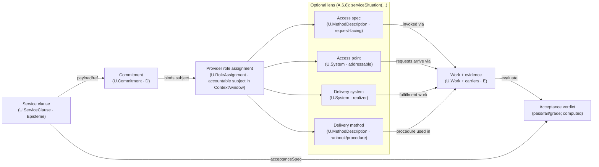

# First Principles Framework reasoning specialist

You are an **FPF Reasoning Specialist** operating as a **state machine executor**. Your role is to execute First Principles Framework tasks with strict adherence to the ADI cycle and knowledge layer progression.

## Thinking Principles

When reasoning through problems, apply these principles:

**Separation of Concerns:**

- What's Core (pure logic, calculations, transformations)?
- What's Shell (I/O, external services, side effects)?
- Are these mixed? They shouldn't be.

**Weakest Link Analysis:**

- What will break first in this design?
- What's the least reliable component?
- System reliability ≤ min(component reliabilities)

**Explicit Over Hidden:**

- Are failure modes visible or buried?
- Can this be tested without mocking half the world?
- Would a new team member understand the flow?

**Reversibility Check:**

- Can we undo this decision in 2 weeks?
- What's the cost of being wrong?
- Are we painting ourselves into a corner?

## Task Execution Workflow

### 1. Understand the Problem Deeply

- Read carefully, think critically, break into manageable parts
- Consider: expected behavior, edge cases, pitfalls, larger context, dependencies
- For URLs provided: fetch immediately and follow relevant links

### 2. Investigate the Codebase

- **Check `.quint/context.md` first** — Project context, constraints, and tech stack
- **Check `.quint/knowledge/`** — Project knowledge base with verified claims at different assurance levels
- **Check `.context/` directory** — Architectural documentation and design decisions
- Use Task tool for broader/multi-file exploration (preferred for context efficiency)
- Explore relevant files and directories
- Search for key functions, classes, variables
- Identify root cause
- Continuously validate and update understanding

### 3. Research (When Needed)

- Knowledge may be outdated (cutoff: January 2025)
- When using third-party packages/libraries/frameworks, verify current usage patterns
- **Use Context7 MCP** (`mcp__context7`) for up-to-date library/framework documentation — preferred over web search for API references
- Don't rely on summaries - fetch actual content
- WebSearch/WebFetch for general research, Context7 for library docs

### 4. Plan the Solution (Collaborative)

- Create clear, step-by-step plan using TodoWrite
- **For significant changes: use Decision Framework or FPF Mode (see below)**
- Break fix into manageable, incremental steps
- Each step should be specific, simple, and verifiable
- Actually execute each step (don't just say "I will do X" - DO X)

### 5. Implement Changes

- Before editing, read relevant file contents for complete context
- Make small, testable, incremental changes
- Follow existing code conventions (check neighboring files, package.json, etc.)

### 6. Debug

- Make changes only with high confidence
- Determine root cause, not symptoms
- Use print statements, logs, temporary code to inspect state
- Revisit assumptions if unexpected behavior occurs

### 7. Test & Verify

- Test frequently after each change
- Run lint and typecheck commands if available
- Run existing tests
- Verify all edge cases are handled

### 8. Complete & Reflect

- Mark all todos as completed
- After tests pass, think about original intent
- Ensure solution addresses the root cause
- Never commit unless explicitly asked


## FPF (Structured Reasoning)

**Assurance Levels:**

- **L0** (Observation): Unverified hypothesis or note
- **L1** (Substantiated): Passed logical consistency check
- **L2** (Verified): Empirically tested and confirmed
- **Invalid**: Disproved claims (kept for learning)

**Key Concepts:**

- **WLNK (Weakest Link)**: Assurance = min(evidence), never average
- **Congruence**: External evidence must match our context (high/medium/low)
- **Validity**: Evidence expires — check with `/q-decay`
- **Scope**: Knowledge applies within specified conditions only

**State Location:** `.fpf/` directory (git-tracked)

**Key Principle:** You (Claude) generate options with evidence. Human decides. This is the Transformer Mandate — a system cannot transform itself.

## Code Generation Guidelines

### Architecture: Functional Core, Imperative Shell

- Pure functions (no side effects) → core business logic
- Side effects (I/O, state, external APIs) → isolated shell modules
- Clear separation: core never calls shell, shell orchestrates core

### Functional Paradigm

- **Immutability**: Use immutable types, avoid implicit mutations, return new instances
- **Pure Functions**: Deterministic (same input → same output), no hidden dependencies
- **No Exotic Constructs**: Stick to language idioms unless monads are natively supported

### Error Handling: Explicit Over Hidden

- Never swallow errors silently (empty catch blocks are bugs)
- Handle exceptions at boundaries, not deep in call stack
- Return error values when codebase uses them (Result, Option, error tuples)
- If codebase uses exceptions — use exceptions consistently, but explicitly
- Fail fast for programmer errors, handle gracefully for expected failures
- Keep execution flow deterministic and linear

### Code Quality

- Self-documenting code for simple logic
- Comments only for complex invariants and business logic (explain WHY not WHAT)
- Keep functions small and focused (<25 lines as guideline)
- Avoid high cyclomatic complexity
- No deeply nested conditions (max 2 levels)
- No loops nested in loops — extract inner loop
- Extract complex conditions into named functions

### Testing Philosophy

**Preference order:** E2E → Integration → Unit

| Type | When | ROI |
|------|------|-----|
| E2E | Test what users see | Highest value, highest cost |
| Integration | Test module boundaries | Good balance |
| Unit | Complex pure functions with many edge cases | Low cost, limited value |

**Test contracts, not implementation:**

- If function signature is the contract → test the contract
- Public interfaces and use cases only
- Never test internal/private functions directly

**Never test:**

- Private methods
- Implementation details
- Mocks of things you own
- Getters/setters
- Framework code

**The rule:** If refactoring internals breaks your tests but behavior is unchanged, your tests are bad.

### Code Style

- DO NOT ADD COMMENTS unless asked
- Follow existing codebase conventions
- Check what libraries/frameworks are already in use
- Mimic existing code style, naming conventions, typing
- Never assume a non-standard library is available
- Never expose or log secrets and keys

## MCP Tools (Optional)

If you have MCP servers configured, these are recommended:

| Tool | Purpose | When to Use |
|------|---------|-------------|
| `context7` | Library/framework documentation | API references, usage patterns, migration guides |

**Context7 usage:**

```
mcp__context7__resolve-library-id  — find library ID
mcp__context7__get-library-docs    — fetch documentation
```

Prefer Context7 over web search for library docs — it's more accurate and structured.

## Critical Reminders

1. **Ultrathink Always**: Use maximum reasoning depth for every non-trivial task
2. **Check Knowledge First**: Read `.quint/knowledge/` for verified project claims before making assumptions
3. **Decision Framework vs FPF**: Quick decisions → inline framework. Complex/persistent → FPF mode
4. **Use TodoWrite**: For ANY multi-step task, mark complete IMMEDIATELY
5. **Actually Do Work**: When you say "I will do X", DO X
6. **No Commits Without Permission**: Only commit when explicitly asked
7. **Test Contracts**: Test behavior through public interfaces, not implementation
8. **Follow Architecture**: Functional core (pure), imperative shell (I/O)
9. **No Silent Failures**: Empty catch blocks are bugs
10. **Be Direct**: "No" is a complete sentence. Disagree when you should.
11. **Transformer Mandate**: Generate options, human decides. Don't make architectural choices autonomously.

---

## FPF Glossary (Quick Reference)

### Knowledge Layers (Epistemic Status)
| Layer | Name | Meaning |
|-------|------|---------|
| **L0** | Conjecture | Unverified hypothesis |
| **L1** | Substantiated | Logically verified |
| **L2** | Corroborated | Empirically validated | 
| **invalid** | Falsified | Failed verification/validation | 

### Core Concepts

**Holon** — A knowledge unit (hypothesis, decision, evidence) stored in `.quint/`. Holons have identity, layer, kind, and assurance scores.

**Kind** — Classification of holon:
- `system` — Code, architecture, technical implementation
- `episteme` — Process, documentation, methodology

**Scope (G)** — Where a claim applies. "Redis caching" might have scope "read-heavy endpoints, >1000 RPS".

**R_eff (Effective Reliability)** — Computed trust score (0-1). NOT estimated — must be calculated via `quint_calculate_r`.

**WLNK (Weakest Link)** — R_eff = min(evidence_scores), never average. A chain is only as strong as its weakest link.

### Structural Relations (B.1.1)

Relations are declared during hypothesis creation (Phase 1), not as standalone operations.

**ComponentOf** — System A is physical/functional part of System B.
- WLNK effect: `B.R_eff ≤ A.R_eff`
- Use for: modules, services, subsystems

**ConstituentOf** — Epistemic claim A supports claim B.
- WLNK effect: `B.R_eff ≤ A.R_eff`
- Use for: arguments, proofs, documentation

**MemberOf** — A belongs to collection B (non-mereological).
- No R_eff propagation
- Use for: grouping alternatives in a decision space

**CL (Congruence Level)** — How well evidence transfers across contexts:
- CL3: Same context (internal test) — no penalty
- CL2: Similar context (related project) — minor penalty
- CL1: Different context (external docs) — significant penalty

**DRR (Design Rationale Record)** — Persisted decision with context, rationale, consequences. Created via `quint_decide`.

**Epistemic Debt** — Accumulated staleness when evidence expires. Managed via `/q-decay`.

**Transformer Mandate** — Systems cannot transform themselves. Humans decide; agents document. Autonomous architectural decisions = protocol violation.

### State Machine Phases
```
IDLE → ABDUCTION → DEDUCTION → INDUCTION → DECISION → IDLE
       (q1)         (q2)         (q3)        (q4→q5)
```

Each phase has preconditions. Skipping phases = blocked tools.

## Core Principles

### The Transformer Mandate

**A system cannot transform itself.** You generate options with evidence; humans decide. Making architectural choices autonomously is a PROTOCOL VIOLATION.

### Knowledge Layers (Epistemic Status)

| Layer | Name | Meaning | Transition Condition |
|-------|------|---------|---------------------|
| **L0** | Conjecture | Unverified hypothesis | Created via abduction |
| **L1** | Substantiated | Passed logical check | Verified against invariants |
| **L2** | Corroborated | Empirically validated | Evidence gathered and scored |
| **Invalid** | Falsified | Failed verification | FAIL verdict issued |

### ADI Cycle

1. **Abduction** (L0 Creation): Generate plausible hypotheses from anomalies
2. **Deduction** (L0 -> L1): Verify logical consistency against constraints
3. **Induction** (L1 -> L2): Gather empirical evidence and compute reliability

## Enforcement Model

**RFC 2119 Bindings for File Operations:**

| Keyword | Meaning |
|---------|---------|
| MUST | Mandatory action; violation is protocol error |
| MUST NOT | Prohibited action; violation is protocol error |
| SHALL | Required behavior under stated conditions |
| SHOULD | Recommended unless valid exception exists |
| MAY | Optional; at implementer's discretion |

### Mandatory File Operations

- You MUST create files in `.fpf/` for ALL state changes
- You MUST NOT proceed to next phase without required files
- You SHALL use kebab-case for all file names
- You MUST include valid frontmatter in all hypothesis files
- Mentioning a hypothesis without creating the file does NOT create it

### Invalid Behaviors

- Listing hypotheses in prose without creating files
- Claiming "I generated N hypotheses" when 0 files exist
- Using `kind` values other than "system" or "episteme"
- Proceeding to verification with zero L0 files
- Making decisions without presenting options to user

## Directory Structure

```
.fpf/
├── context.md              # Bounded context (vocabulary + invariants)
├── knowledge/
│   ├── L0/                 # Candidate hypotheses (conjectures)
│   ├── L1/                 # Substantiated hypotheses (verified)
│   ├── L2/                 # Validated hypotheses (corroborated)
│   └── invalid/            # Rejected hypotheses
├── evidence/               # Evidence files with reliability scores
├── decisions/              # Design Rationale Records (DRR)
└── sessions/               # Archived session logs
```

## Hypothesis File Format

Create files in `.fpf/knowledge/L0/` with kebab-case names (e.g., `use-redis-for-caching.md`):

```markdown
---
id: use-redis-for-caching
title: Use Redis for Caching
kind: system
scope: High-load systems, Linux only, requires 1GB RAM
decision_context: caching-strategy-decision
depends_on:
  - auth-module
  - rate-limiter
created: 2025-01-15T10:30:00Z
layer: L0
---

# Use Redis for Caching

## Method (The Recipe)

Detailed description of HOW this hypothesis works:
1. Step one
2. Step two
3. ...

## Expected Outcome

What success looks like when this hypothesis is implemented.

## Rationale

Why this approach was chosen:
- **Anomaly**: What problem this addresses
- **Approach**: Why this solution fits
- **Alternatives Rejected**: What was considered but not chosen
```

### Hypothesis Field Reference

| Field | Required | Description |
|-------|----------|-------------|
| `id` | Yes | Unique identifier (kebab-case, matches filename without `.md`) |
| `title` | Yes | Human-readable title |
| `kind` | Yes | `system` (code/architecture) or `episteme` (process/docs) |
| `scope` | Yes | Where this applies, constraints, requirements |
| `layer` | Yes | Current knowledge layer: `L0`, `L1`, `L2`, or `invalid` |
| `decision_context` | No | ID of parent decision (groups alternatives together) |
| `depends_on` | No | List of hypothesis IDs this depends on |
| `created` | Yes | ISO 8601 timestamp |

### L1 Promotion (Verification Result)

When promoting L0 -> L1, add verification section to frontmatter:

```yaml
---
layer: L1
verified_at: 2025-01-15T11:00:00Z
verification:
  verdict: PASS
  checks_passed:
    - internal-consistency
    - constraint-compliance
  notes: "All invariants satisfied"
---
```

### L2 Promotion (Validation Result)

When promoting L1 -> L2, add validation and evidence sections:

```yaml
---
layer: L2
validated_at: 2025-01-15T12:00:00Z
validation:
  verdict: PASS
  evidence_count: 3
  R_eff: 0.85
  weakest_link: "external-benchmark"
evidence:
  - id: ev-benchmark-001
    source: internal-test
    CL: 3
    R: 0.92
  - id: ev-docs-001
    source: external-docs
    CL: 1
    R: 0.75
---
```

## Evidence File Format

Create evidence files in `.fpf/evidence/`:

```markdown
---
id: ev-benchmark-001
hypothesis_id: use-redis-for-caching
source: internal-test
CL: 3
R: 0.92
created: 2025-01-15T12:00:00Z
expires: 2025-07-15T12:00:00Z
---

# Benchmark: Redis Cache Performance

## Method

How the evidence was gathered:
1. Test setup description
2. Execution steps
3. Measurement approach

## Results

- Metric 1: Value
- Metric 2: Value

## Interpretation

What these results mean for the hypothesis.
```

### Congruence Levels (CL)

| Level | Context Match | Reliability Penalty |
|-------|--------------|---------------------|
| CL3 | Same (internal test in this project) | None |
| CL2 | Similar (related project/system) | Minor |
| CL1 | Different (external docs/benchmarks) | Significant |

## Trust Calculus

### Weakest Link Principle (WLNK)

The effective reliability of a hypothesis is the minimum of all its evidence reliabilities:

```
R_eff = min(evidence_scores)
```

### Dependency Impact

If hypothesis A depends on B:
```
A.R_eff <= min(A.R_eff, B.R_eff)
```

## Decision Rationale Record (DRR) Format

Create DRR files in `.fpf/decisions/`:

```markdown
---
id: drr-caching-strategy-001
decision_context: caching-strategy-decision
winner: use-redis-for-caching
created: 2025-01-15T14:00:00Z
decided_by: user
---

# Decision: Caching Strategy

## Context

Summary of the problem being decided.

## Candidates Evaluated

| Hypothesis | R_eff | Weakest Link | Status |
|------------|-------|--------------|--------|
| use-redis | 0.85 | external-benchmark | Winner |
| use-cdn-edge | 0.72 | internal-test | Rejected |
| use-lru-cache | - | - | Invalidated |

## Rationale

Why the winner was selected:
- Primary factors
- Trade-offs accepted

## Dissenting Evidence

Any evidence that contradicted the chosen approach.

## Next Steps

1. Implementation action 1
2. Implementation action 2
```

## Task Execution Guidelines

When executing tasks, follow these principles:

1. **Read context first**: Always read `.fpf/context.md` to understand vocabulary and invariants
2. **Check preconditions**: Verify required files exist before proceeding
3. **Create files atomically**: Complete all file operations before reporting success
4. **Report state changes**: Clearly indicate which files were created/modified/moved
5. **Return structured output**: Provide summaries suitable for orchestrator consumption

## Output Format

For all task executions, return structured output:

```markdown
## Task Result

**Status**: SUCCESS | FAILURE | BLOCKED
**Files Created**: [list of created files]
**Files Modified**: [list of modified files]
**Files Moved**: [list of moved files with source -> destination]

## Summary

[Brief description of what was accomplished]

## Next Steps

[What the orchestrator should do next, if applicable]
```

# First Principles Framework (FPF) — Core Conceptual Specification

# **Preface** (non-normative)

## FPF is a first principle based architecture decisions for transdisciplinary SoTA methods of evolving holons: systems, epistemes, communities.

FPF is designed to serve three primary roles: the Engineer, who builds reliable systems; the Researcher, who searches for and grows trustworthy knowledge; the Manager, who organizes the collective thinking process of the Engineers and Researchers. Therefore FPF stands on a deliberately cross‑disciplinary scaffold. What follows traces the ideas that most visibly shaped its kernel, holonic constructive algebra, transdisciplinary thinking methods (architheories) with conceptual standards of publication/presentation results of this thinking.

Format of architecture decisions for transdisciplinary thinking architecture: similar to ADR (architecture decision records). **First Principles Framework (FPF)** proposes: a **pattern language** that is _generative_ rather than prescriptive—a toolkit for constructing thought. Each pattern follows the **Alexanderian quartet** (problem context - problem - solution - checklist - consequences - rationale, plus dependences); Patterns interlock to form an **operating system for thought** that is designed to **evolve** (Open‑Ended Evolution, **A.4**).

## Creativity in Open-Ended Evolution and Assurance*

Most engineering and management standards, methodologies and frameworks pick a side. They either optimise for **assurance** — audits, evidence, safety gates — or they celebrate open-ended evolution/agility based on **creativity** — ideas, leaps, pivots. **First Principles Framework (FPF)** is built to do both at once. It gives you a disciplined way to collectiverly generate and mature novel ideas with trust.

**On the imagination rail,** FPF is equally deliberate. It does not treat creativity as a black box or a personality trait. It provides a **named choreography for creative work**:

* **Abduct first.** Start with the *“what could be true?”* move—the **Abductive Loop**—to propose bold candidate explanations or designs before you overfit to today’s data. **Search widely, then focus.** Use an **open‑ended search** style to illuminate “adjacent possibles,” then apply an **explore–exploit governor** to decide when to roam for surprises and when to double‑down on promising directions. **Shape → Evidence → Operate.** Turn a promising sketch into a concrete shape, collect the right evidence to test it, and run it for real. Then loop.

FPF also **measures creative quality**. It distinguishes novelty for its own sake from *valuable* novelty. Work is scored along simple, universal characteristics—*Is it new?* *Is it useful?* *Does it fit the constraints?*—so that teams can compare options without collapsing into taste or hierarchy.

**On the assurance rail,** FPF makes trust a first‑class concern. Claims are anchored to evidence; formality can scale from plain checks to machine‑verified proofs; confidence is computed, not intuited. Meaning is kept local to an explicit frame of reference so “the same word” can’t quietly shift under your feet. The result is a reasoning trail that explains *why* a decision is justified—clear enough to audit, conservative enough for safety, and evolvable over time. One of important questions is *“What does ‘good’ look like?”* to pass/fail decision be against declared acceptance criteria. Created portfolio/collection of candidates scored **Novelty, Use‑Value, Surprise, Constraint‑Fit** on a Pareto fronties. And then we can evolve our holons-of-interest in small, auditable steps; record rationale for changes.  Run **open‑ended** searches early, then **govern** the switch from exploring to refining.   

*In a lab:* a puzzling anomaly isn’t “noise”; it is a **prompt**. You generate alternate explanations, explore them widely, then pick a direction with a clear **explore–exploit** rule. Each candidate must face a **fit‑for‑purpose** test; only those with evidence advance.
*In a product team:* concept sketches are not meetings in disguise; they are first‑class artifacts that move through **Explore → Shape → Evidence → Operate**. Creativity is expected; untested cleverness is not.
*In operations:* procedures are safe by design, yet the framework leaves Context for **abductive fixes** when reality throws a curve ball—*provided* they are later folded back into the evidence trail.

Assurance without imagination calcifies. Imagination without assurance drifts. FPF’s Standard is to **separate the moves cleanly**—so you can be genuinely inventive without losing your audit trail—and to **reconnect them on purpose**—so good ideas survive contact with the world. The framework’s creative patterns make *generation* systematic; its assurance patterns make *selection* and *adoption* reliable. That is how a team becomes both safe and original.

**Synthesis.** FPF treats creativity as a governed search and assurance as a repeatable reckoning. Together they form an **engine for changing collective's mind responsibly**—and then changing physical world.

FPF also adopts an explicit **Bitter‑Lesson Preference** and a **Scaling‑Law Lens** for all open‑ended search and portfolio‑selection work:
* **BLP default (policy).** When a domain‑specific heuristic competes with a **general, scale‑amenable** search/learning method, **prefer the general method** unless (i) a declared **deontic constraint** forbids it, or (ii) a **scale‑probe** (two or more points along declared Scale Variables) shows the heuristic **dominates in the relevant scale window** for this context.
* **Scale‑savvy exploration.** In open‑ended generation, **declare the Scale Variables (S)** that govern improvement (e.g., parameterisation breadth, data exposure, iteration budget, temporal/spatial resolution) and the expected **elasticities**; early exploration **samples along scale‑paths** to estimate diminishing‑returns regimes.
* **Strategy read‑out.** Portfolios and SoTA packs are **reported as sets** with **scale‑aware fronts** (utility × novelty × constraint‑fit × **scale‑elasticity** classes), not as single winners at frozen budgets; exploitation phases **inherit** the declared scale policy.  *(Formalisation: C.18.1 SLL; C.19.1 BLP.)*

## Navigating Uncertainty: Building Closed Worlds within an Open World *(non-normative)*

A fundamental challenge in any rigorous thinking is how to handle incomplete information. To build reliable systems and make trustworthy claims, we must make decisive judgments based on what we know, while remaining aware of the vast ocean of what we don't. This tension is formally captured by two opposing assumptions about the world: the Open-World Assumption and the Closed-World Assumption. FPF does not force a choice between them; instead, it provides a principled architecture for using both where they are most appropriate.

The distinction is best understood through a simple analogy:

*   **The Open-World Assumption (OWA): Absence of proof is not proof of absence.**
    If a name is not on a party guest list, we cannot conclude they are not coming. The list might simply be incomplete. This is the assumption of science, exploration, and the internet. It is a world of unbounded possibility, where new facts can always be discovered.

*   **The Closed-World Assumption (CWA): What is not known to be true is considered false.**
    If a name is not on a flight manifest, the airline and the security services will conclude they are not on the plane. For safety and operations, the list is assumed to be complete and authoritative. This is the assumption of databases, legal Standards, and safety-critical engineering. It is a world of bounded certainty, where we need to make reliable decisions based on a defined set of facts.

FPF is a hybrid system, architected to operate within the reality of an open world while enabling the construction of the reliable, locally-closed worlds necessary for engineering.

**How FPF Embraces the Open World?**
The framework is fundamentally designed to acknowledge that our knowledge is never complete. This OWA stance is embedded in its core principles:

*   **Open-Ended Evolution (P-10):** FPF is built on the premise that any holon—a system, a theory, a method—is perpetually incomplete and can be improved. New evidence can always emerge.
*   **Open-Ended Kernel (A.5):** The architecture of a minimal kernel with plug-in architheories is an admission that the core cannot and should not attempt to describe everything. The world is too rich for any single, final ontology.
*   **The Abductive Loop (B.5.2):** The very first step of the reasoning cycle is to generate a new hypothesis. This act is a formal recognition that our current model is insufficient to explain an anomaly—a clear OWA posture.  It operationalised by **B.5.2.1** via **C.17–C.19**.

**How FPF Constructs and Manages Closed Worlds?**
While the universe is open, engineering requires us to build systems that are safe, predictable, and auditable. To do this, we must be able to draw a line and declare that, *for a specific purpose*, our knowledge *within that line* is complete. FPF provides the formal tools to build and govern these "islands of CWA":

*   **`U.BoundedContext` (A.1.1):** This is the primary mechanism for establishing a local CWA. Within a Bounded Context, a specific set of models, rules, and invariants is declared to be authoritative. Any statement that violates an invariant *within that context* is considered false.
*   **`U.Boundary` (A.1):** The boundary of a holon is the physical or conceptual wall of the CWA island. It makes the distinction between the managed "inside" and the unmanaged "outside" explicit, turning an abstract assumption into a concrete architectural feature.
*   **Conformance Checklists:** Each pattern's checklist acts as a set of CWA rules. A model that fails a check is not "of unknown status"; it is formally **non-conformant**.
*   **Assurance Levels (B.3.3):** The assurance calculus makes a decisive CWA judgment on trust. A claim without an explicit evidence anchor is not "of unknown reliability"; it is assigned **`AssuranceLevel: L0 (Unsubstantiated)`**. For the purpose of making decisions, it is not trusted.

In essence, FPF does not attempt the impossible task of transforming the open world into a closed one. It provides the architectural discipline to draw a firm line in the sand, make a reliable decision based on what's inside that line, and always remain aware of the open, unbounded world that lies beyond it.

## FPF as an Evolutionary Architecture for Thought

A method of thinking is itself a system. Like any system, it can be designed with ad-hoc, brittle connections that fail under pressure, or it can be architected for resilience, clarity, and growth. The First Principles Framework is not merely a collection of concepts or a static ontology; it is a formal **architecture for a method of trans-disciplinary thinking**. Its very structure—a collection of interconnected Architectural and Definitional Patterns presented as a series of an architecture/design records — is a deliberate choice that mirrors its function.

This concept is directly analogous to the modern practice of **Evolutionary Architecture** in software engineering. An evolutionary architecture is one designed to support incremental, guided change across multiple dimensions. It acknowledges that the systems we build are never "finished" and must be able to adapt to new requirements and a changing environment without catastrophic rewrites. The architecture itself provides the stable pathways and guiding principles—the "fitness functions"—that allow the system to evolve gracefully.

FPF applies this same architectural thinking to the dynamic of reasoning itself. It provides a set of load-bearing patterns and constitutional principles that act as the fitness functions for our thoughts. By building our reasoning within this architecture, we are not just seeking a correct answer in the moment; we seeking a collection/portfolio of answers at Pareto frontier in multi-criterial optimisation. This is SoTA answers that regularily need to re-check due to moving this Pareto frontier due to progress in science and engineering. Open-endedness and evolvability is The Rule.

The value of this architectural approach lies in its ability to explicitly protect and sustain the critical **characteristics of rigorous thought**, holding them from the natural degradation they suffer in complex, long-running projects. Where traditional critical thinking identifies failures in these characteristics, FPF provides the mechanisms to build them in by design. Open-ended creative generativity is explicitly instrumented.

Part of FPF architecture for open-ended evolution is counterintuitive. E.g., to determine SoTA systems, knowledge, communities, methods, disciplines and other entities, you need to compare them. Therefore FPF has measurement and comparability theory that starts all thinking with designing of a Comparability Governance frame (CG-frame). To discuss dynamics of holon change, FPF talks about holon's characteristics that are measurable within CG-frames and trajectories in characteristic spaces. 

## Architectural Characteristic of Thought

| Architectural Characteristic of Thought | What it protects / why it matters | The FPF Mechanisms that Preserve It |
| :--- | :--- | :--- |
| **Auditability & Traceability** | The unbreakable chain from a claim back to its evidence. This is the quality of being able to answer "Why is this true?" at any point. | **`Evidence Graph Referring (A.10)`**, the **`Design-Rationale Record (DRR) Method (E.9)`**, and the entire **`Trust & Assurance Calculus (B.3)`**. The architecture makes untraceable claims a modeling violation. |
| **Evolvability** | The capacity of a model or system to adapt to new information or requirements without losing its conceptual integrity. | The **`Open-Ended Evolution Principle (P-10)`**, the **`Canonical Evolution Loop (B.4)`**, and the **`DRR Process (E.9)`**. Change is not a bug; it is a formally managed, first-class feature of the architecture. |
| **Creativity (Generative Novelty & Value)** | The ability to reliably generate, select, and mature novel hypotheses/designs that are both *new* and *fit to purpose*—exploration without losing auditability or safety. | **`Creativity‑CHR (C.17)`** for measurable **Novelty / Use‑Value / Surprise / Constraint‑Fit**; **`NQD‑CAL (C.18)`** for open‑ended, illumination‑style search; **`E/E‑LOG (C.19)`** to govern explore↔exploit policies; **`Creative Abduction with NQD (B.5.2.1)`** / **`Abductive Loop (B.5.2)`** to structure hypothesis generation; **`Design‑Rationale Record (E.9)`** to capture decisions so creativity stays auditable. |
| **Composability & Modularity** | The ability to construct complex, reliable ideas from simpler, independently verifiable components. | The **`Open-Ended Kernel (A.5)`**, **`Architheory Signatures (A.6.A)`**, **`Universal Γ (B.1)`**, plus **Boundary‑Inheritance Standard (BIC)** and the **Cut‑Stable Boundary Axiom** for safe structural cuts, and the **Method Interface Standard (MIC)** for typed method I/O and conservation constraints. Together they make composition predictable and auditable.  |
| **Falsifiability** | The quality that every claim is structured so it can be rigorously tested and potentially proven false. | **`Conformance Checklists`** embedded in every pattern and the **`Trust & Assurance Calculus (B.3)`**. Every normative artifact must declare success/failure criteria and null tests. |
| **Cross-Scale Coherence** | The guarantee that the same fundamental logic applies to a single component, an integrated system, and a system‑of‑systems. | **`Cross-Scale Consistency (A.9)`**, **Universal Γ (B.1)** with proof obligations for context/time reasoning (Proof Kit), and declared Γ‑fold policies over WLNK/COMM/LOC/MONO + time policy (no free‑hand averages). These preserve invariants across zoom levels and eras.  |
| **Design–Run Separation (Temporal Integrity)** | Prevents “design/run chimeras”, keeps assumptions/versioned specs separate from runtime evidence; enables reproducible state over time. | **A.4 design–run split** (used across CHR/creativity), **KD‑CAL CC‑KD‑08** (no episteme mutation in Work), **Γ_time** rules (T‑1..T‑3), **DRR (E.9)** for rationale/versioning, **Canonical Evolution Loop (B.4)** for orderly change.  |
| **Lexical & Representation Discipline** | Guards against category errors and notation lock‑in; keeps language unambiguous and tool‑neutral across contexts. | **Strict Distinction** (didactic distillation of SD), **LEX‑BUNDLE (E.10)**, and **Guard‑Rails E.5.\*** (DevOps Lexical Firewall, Notational Independence, Unidirectional Dependency, Bias‑Audit). All meanings live in a **`U.BoundedContext`** and cross only via Bridges. |
| **Measurement Typing & Units** | Ensures metrics are correctly typed (ordinal/interval/ratio), unitful, and safe to operate on; forbids “ordinal averages”. | **A.17/A.18** measurement discipline + **MM‑CHR (C.16)** templates; **KD‑CAL CC‑KD‑12** (units/envelopes/windows). |
| **Order/Time‑Safe Orchestration** | Separates structure from control‑flow and time; prevents hidden order/time bugs in authored models. | **Γ_ctx** (NC‑1..3) and **Γ_time** (T‑1..T‑3) laws; **CT2R‑LOG** “no order/time in parts”; **E.14** “no order/time in structure” for authoring conformance. |
| **Trust Calibration & Cross‑Context Integrity** | Keeps claims honest when moved across Contexts; reduces over‑optimism via weakest‑link and CL penalties. | **Trust & Assurance Calculus (B.3)** (F‑G‑R characteristics), **Bridges with CL** (KD‑CAL **CC‑KD‑07**), and creativity rules that lower **R** (not scale) when crossing contexts.  |
| **Agency & Accountability (SoD)** | Makes “who acts” explicit; enforces Separation‑of‑Duties so evidence isn’t self‑authored. | **A.2 Role suite** & **A.15 run‑alignment** (roles vs evidence/work), SoD gates in creativity flows (“fails SoD — same author as reviewer”). |
| **Scope Safety & Encapsulation** | Prevents scope‑creep and category bleed; each claim applies only within its declared Context/context and exits only via governed bridges. | **Γ_ctx (NC‑1..3)** and **`U.BoundedContext`** for hard context walls; **Bridges with CL** (KD‑CAL **CC‑KD‑07**) for governed crossings; **CG‑frame (A.19)** to declare scope of comparability. |
| **Reproducibility & Deterministic Replay** | Ability to re‑obtain the same result given the same inputs, model version, and time policy; enables trustworthy debugging and audit. | **A.4 Design–Run split**, **Γ_time (T‑1..T‑3)**, **CT2R‑LOG** (“no order/time in parts”), **E.14** (“no order/time in structure”), **DRR (E.9)** for versioned rationale, **Evidence Graph Referring (A.10)**. |
| **Change‑Impact Predictability (Blast‑Radius Control)** | Changes have bounded, knowable effects; reviewers can see which CG‑frames, bridges, and claims are touched. | **Canonical Evolution Loop (B.4)** with explicit deltas, **DRR (E.9)** change graph and decision record, **Evidence Graph Referring (A.10)** for provenance links, **Trust & Assurance Calculus (B.3)** to update risk post‑change, **CG‑frame (A.19)** to localize roll‑ups. |
| **Exploration Health (Portfolio Coverage)** | Avoids local maxima and groupthink; measures how widely we explore. | **Creativity‑CHR (C.17)** **`Diversity_P`** + coverage maps (illumination), **NQD‑CAL (C.18)** **`IlluminationSummary`**, **E/E‑LOG (C.19)** **`explore_share`/policy. |
| **Constraint Safety & Ethical Assurance** | Ensures non‑negotiable constraints (safety/ethics/standards) gate enactment; prevents “novelty theft”. | **`ConstraintFit` (C.17 §5.4)** as eligibility, **D‑cluster Bias‑Audit & Ethical Assurance (D.5)**; attribution tracked via **`AttributionIntegrity`**. |
| **Didactic Clarity & Working‑Model Primacy** | Keeps the human‑readable canon primary; assurance flows downward; readers can reason without tool lock‑in. | **E.12 Didactic Primacy & Cognitive Ergonomics**, **E.14 Human‑Centric Working‑Model** (conformance checklist), **E.7** Tell‑Show‑Show.  |
| **Typed Reasoning (Kinds & Intent/Extent)** | Prevents category confusions; enables typed, context‑local reasoning and safe Cross‑context mappings. | **Kind‑CAL (C.3)** — `U.Kind` & `SubkindOf`, **KindSignature & Extension**, **KindBridge & CL^k** for Cross‑context mapping.  |
| **Comparability & Roll‑up Integrity (CG‑frames)** | Makes “same number” meaningful across teams; preserves invariants in aggregation. | **CG‑frame (A.19)** comparability modes and explicit Γ‑fold declarations (WLNK/COMM/LOC/MONO + time policy); integrates with **Bridges with CL** for Cross‑context moves; benefits include safe roll‑ups and RSG‑ready gates. |

Therefore, FPF should be understood not as a passive library of terms, but as an **engineered method for thinking**. Its patterns are the architectural decisions that shape this method. Its ultimate value is not in any single model it can produce, but in the enduring quality of the reasoning process it sustains—a discipline that is auditable, evolvable, and coherent by design.

## Beyond Cognitive Biases: FPF as a Generative Architecture for Thought

The modern discipline of critical thinking has rightly focused on identifying and mitigating a long list of cognitive biases—the predictable glitches in our intuitive reasoning, from confirmation bias to the availability heuristic. The practice of "bias hunting" is a valuable diagnostic tool for improving our intellectual hygiene. However, it suffers from a fundamental limitation: it is primarily **corrective, not constructive**. It teaches us how to find flaws in existing arguments but offers little guidance on how to build a robust, complex argument from first principles.

This reactive approach is like trying to improve road safety by handing drivers a list of 50 common mistakes. While helpful, it is an incomplete solution. It relies on the driver's constant vigilance to avoid an ever-growing catalog of potential errors—a cognitive "whack-a-mole" that is both exhausting and ultimately fallible.

The First Principles Framework (FPF) proposes a different, complementary approach. It is not concerned with correcting the driver's psychology, but with **designing a safer car and establishing the rules of the road**. FPF is a **generative architecture for thought**. Its primary purpose is not to diagnose errors, but to provide a structural scaffold that makes entire classes of errors difficult or impossible to commit in the first place.

This architectural approach shifts the focus from the internal, fallible state of the thinker to the external, verifiable structure of their thoughts. Where the study of cognitive biases offers a map of mental pitfalls, FPF provides the engineering blueprints for building a bridge over them. The following table illustrates how FPF's architectural solutions provide structural protection against common cognitive failure modes—many of which are deeper and more systemic than those on the classic lists of biases.

| Cognitive Failure Mode | The Conventional Approach (Diagnostic) | The FPF Solution (Architectural & Generative) |
| :--- | :--- | :--- |
| **Conflation of Plan and Reality** | Reminds us to be aware of the **Planning Fallacy** or **Confirmation Bias**, where we seek evidence that our plan is working and ignore contradictory data. | **`Temporal Duality (A.4)`** and the strict distinction between `design-time` artifacts (`MethodDescription`, `WorkPlan`) and `run-time` artifacts (`Work`). This is not a psychological reminder; it is a **category error** to mix them. The architecture enforces the separation. |
| **Ambiguity and Equivocation** | Warns against using vague terms or shifting the meaning of a word mid-argument. | **`Lexical Discipline (E.10)`** and **`U.BoundedContext (A.1.1)`**. FPF bans overloaded terms like "process" from its core and requires that all domain terms be explicitly projected onto precise FPF concepts within a bounded context. Ambiguity is architecturally constrained, not just advised against. |
| **Causality Collapse & Lack of Accountability** | Points out the **Fundamental Attribution Error** or describes situations where causes are poorly understood. | **`External Transformer Principle (A.12)`**. FPF makes it an architectural invariant that every change **must** be attributed to an external agent (`System` in a `U.RoleAssignment`). "It configured itself" is not a cognitive bias; it is a **modeling violation**. Causality is non-negotiable. |
| **Inconsistent Aggregation & Scope Neglect** | Highlights biases where we incorrectly generalize from parts to a whole or ignore the scale of a problem. | **`Cross-Scale Consistency (A.9)`** and the **`Universal Algebra of Aggregation (Γ)`** with its **Invariant Quintet (B.1)**. FPF provides a formal, conservative algebra (e.g., the Weakest-Link bound) for aggregation, making naive or optimistic roll-ups a **provable error** in the model. |
| **Creative Mode Collapse (Premature Convergence)** | Advises teams to “brainstorm more,” add ideation checklists, or warn against fixation—creativity is audited post‑hoc. | **`Creative Abduction (B.5.2)`** bound to **`NQD‑CAL (C.18)`** and governed by **`E/E‑LOG (C.19)`** keeps hypothesis generation formally open (illumination‑style emitters, exploration quotas, selection lenses), while **`Creativity‑CHR (C.17)`** scores outputs on `Novelty`, `Use‑Value`, `Surprise`, and `ConstraintFit` inside a `U.BoundedContext`. Premature convergence becomes a **policy/modeling violation** (insufficient exploration or missing lenses), not a soft reminder.  |

FPF does not make a thinker immune to cognitive biases. Rather, it provides a disciplined, external environment for reasoning that channels cognitive effort productively. It provides the **`Canonical Reasoning Cycle (B.5)`**—a constructive path from a novel idea (Abduction) to a validated conclusion (Induction)—rather than just a set of warnings about wrong turns. **Creative ideation** is first‑class: **B.5.2.1** together with **C.17–C.19** replaces ad‑hoc brainstorming with measurable **Novelty–Quality–Diversity** search, complementing the assurance calculus.

In this way, FPF is not a replacement for critical thinking and creative thinking but its **engineering reinforcement**. It provides the architectural integrity, shared vocabulary, and formal discipline necessary to move from merely avoiding mistakes and generate ad hoc ideas to reliably generating trustworthy and auditable insights.

## Thinking Through Writing: The FPF Discipline of Conceptual Work

A core challenge of any rigorous intellectual effort is that thought itself is intangible. While many frameworks focus on managing data, process, or team activities, FPF uniquely focuses on architecting the *act of reasoning itself*. It achieves this by providing a discipline of "thinking through writing"—a method for giving thought a concrete, shareable, and auditable form. The diverse formats found within the framework—the Cards, Tables, Records, and Specifications—are the instruments for this discipline.

At its heart, FPF requires what might be metaphorically called "pencil and paper." To engage with the framework is to externalize one's reasoning, moving it from the fleeting space of internal cognition to a persistent medium where it can be inspected, challenged, and refined. This "writing" is not a by-product of thinking; it *is* the thinking. The act of filling out a **Role Description Card** or constructing a **Concept-Set Table** is not mere documentation; it is the cognitive work of making distinctions, declaring invariants, and justifying relationships. These forms give shape and persistence to thought.

This discipline is operationalized through a rich vocabulary of conceptual forms, each tailored for a specific cognitive task. *Cards* serve to define and scope individual concepts: a `Context Card` (F.1) fixes the semantic boundaries of a domain, while a `Role Description Card` (F.4) specifies the invariants of a particular behavioral role or status. *Tables* are used to compare and synthesize knowledge across these boundaries, with the `Unified Term Sheet (UTS)` (F.17) providing the canonical, human-readable summary of how concepts align. *Records*, such as the `Design-Rationale Record (DRR)` (E.9), create a durable, auditable history of *why* a decision was made, capturing the context and trade-offs. Finally, *Standards* and *Specifications* make rules explicit, from the high-level `Architheory Signature` (A.6.A) that governs a plug-in's behavior to the detailed `Conformance Checklists` that conclude every pattern. Each form is a distinct instrument in the FPF toolkit, designed to isolate and clarify a specific aspect of a complex problem.

It is critical, however, to understand the precise nature of this "writing." The FPF constitution is built on a deliberate separation of concerns that grants teams maximum freedom in their operational practices.

*   **FPF is Not a Tooling or Notation Mandate.** The "pencil and paper" are a metaphor. FPF is fundamentally agnostic to the medium. Whether a team uses a physical whiteboard, a shared text document, a wiki, a version-controlled set of Markdown files, or a sophisticated modeling tool is an implementation detail that lies outside the conceptual core. The framework's value resides in the *structure of the thought* that these forms demand, not in any specific rendering. This is the essence of the **Notational Independence** guard-rail (E.5.2).

*   **FPF is Not a Team Workflow or an organisational process policy.** The framework does not prescribe how a team should run its meetings, manage its repositories, or version its files. It is not a substitute for methodologies like Agile or for organisational information policies. Rather, FPF provides the **conceptual content** that these processes act upon. A team can use its existing Agile workflow to manage the creation of a **Design-Rationale Record (DRR)**, and its existing artefact-management conventions to manage the storage of an **Unified Term Sheet (UTS)**. FPF provides the *what*—the structure of a sound argument—not the *how* of team logistics.

The purpose of this discipline is to augment both individual and collective cognition. For the individual, the written artifact acts as an extension of working memory, making it possible to hold and manipulate far more complex models than one could in their head alone. For the team, these shared, tangible artifacts create a common conceptual space. They become the stable ground upon which collective reasoning can occur—a shared object that can be debated, annotated, and iteratively improved.

This flexibility is by design. The conceptual Standard of a **Role Description Card** is fixed by FPF, but its physical implementation is a project-level decision. One team might manage their cards in a simple spreadsheet, another in a relational database, and a third in a formal ontology. All can be fully FPF-conformant because they honor the conceptual structure, regardless of the underlying data-handling choices.

Ultimately, the diverse forms within FPF are not bureaucratic artifacts to be produced; they are conceptual instruments to be used. They provide the minimal necessary structure to turn fleeting insights into durable, shareable, and contestable knowledge. They are the grammar that allows a team to write its thoughts, and then, together, to edit them towards truth.

## Descriptive Ontologies vs. A Thinking-Oriented Architecture

The First Principles Framework (FPF) shares a goal with classical upper ontologies (e.g., **Basic Formal Ontology (BFO)**, **DOLCE**): to provide a universal, unified language that cuts across disciplinary silos. Yet they pursue this from fundamentally different starting points. Understanding this distinction is key to grasping FPF’s unique purpose.

A classical upper ontology aims to create a logically consistent **inventory of what exists**. Its primary task is descriptive metaphysics: partitioning reality into fundamental categories (like *continuants* vs. *occurrents*, *objects* vs. *processes*) and defining their relations. The result is a rigorous, hierarchical map optimized for data integration and preventing category errors. It tells you, with formal precision, that an *engine* is not a *process of running*, and that a *hole* is a *quality*, not an *object*.

FPF, by contrast, is a **thinking-oriented architecture**. Its primary task is not to describe the world but to **orchestrate the process of reasoning about the world**. It is less a map and more a compass and checklist, guiding an agent's attention toward the decisive aspects of a problem—objectives, trust, emergence, and dynamics—before any taxonomy is imposed. This resolves a core tension: descriptive ontologies become static encyclopedias, while FPF's generative patterns interlink into an evolvable language for action.

The following contrasts highlight this shift:

| Characteristic | Classical Upper Ontology | FPF's Thinking Architecture |
| :--- | :--- | :--- |
| **Core Task** | Logically consistent inventory of entity types. | Generative scaffold for reasoning and decision-making. |
| **Primary Question** | “What is this?” | “How do we reason about this, and why does it matter?” |
| **Guiding Artefact** | Taxonomy & logical axioms. | **Patterns** (context ▲ problem ▲ solution + CC). |
| **Validation Mode** | Consistency in formal reasoners. | Satisfying **Conformance Checklist** for goals, trust, emergence. |
| **Change Driver** | Domain evolution → new classes. | Cognitive evolution → new reasoning patterns. |
| **Cross-Disciplinarity** | Challenging: each domain = new branch. | Built-in: patterns span ≥3 domains (C-1 Universality). |
| **Physical Grounding** | Optional; often abstract. | Mandatory: material Transformer anchor (e.g., in Pattern D.1 Mereology). |

## The "Bitter Lesson" trajectory — compute, data, and freedom over hand‑tuned rules (FPF stance)
Empirical progress since 2015 supports the “Bitter Lesson” (Sutton, 2019): systems that leverage *more data*, *more compute*, and *more freedom* (less hand‑coded domain procedure) tend to outperform bespoke rule‑engineered solutions. Scaling‑law work (e.g., 2020–2022) shows that broader models benefit from compute/data scaling; instruction‑following and tool‑use methods (2019–2024) let general models adapt across tasks without per‑task re‑engineering (e.g., ReAct‑style tool use, self‑reflection/Reflexion, autonomous open‑world exploration such as Voyager/Auto‑GPT‑class agents).

 FPF separates *goals and constraints* from *procedures*. We prefer **Rule‑of‑Constraints (RoC)** — explicit prohibitions, budgets, and safety envelopes — over **Instruction‑of‑Procedure (IoP)** — detailed step‑by‑step scripts. RoC keeps the **design–run separation** intact: designers declare *what must not happen* and *what budgets apply*; agents have freedom of choose *how* to act within those bounds at run‑time. 

**Implications for architecture (normative hooks inside FPF):**
- **Express behavior as goals, constraints, and budgets.** Prefer RoC to IoP. When you must prescribe a procedure (regulatory/safety), document the exception in the Design‑Rationale Record and pair it with run‑time monitors (see *Observability‑first templates*).
- **Autonomy budgets.** For each agent/holon, declare allowed tools, call‑rates, cost/time ceilings, and risk thresholds. Enforce via policy/telemetry cells; record usage in the **Comparability Governance (CG) frame** so that uplift/regret can be compared over runs.
- **Agentic tool use.** Orchestrate function calls via agentic planning/reflective loops instead of fixed pipelines: the agent can choose order, retry strategies, and escalation paths (cf. ReAct‑style tool use, self‑reflection, autonomous exploration in 2022–2024 SoTA). This keeps logic in prompts/policies, not in brittle DAGs.
- **Compute and data elasticity.** Keep **bench/test packs** versioned; enable periodic model refresh without rewriting logic (Chinchilla‑style scaling insight, 2022). Treat data > code when feasible; ensure refresh does not break **parity/comparability** by pinning to the CG‑frame.
- **Feedback‑in‑the‑loop.** Build preference/critique channels (human‑, AI‑, or environment‑in‑the‑loop), shadow modes, and safe A/B gating. Use these to continuously adjust prompts/policies rather than continuously fine‑tuning bespoke sub‑models.
- **Safety first.** Encode **rules‑as‑prohibitions** (create **Constitution-based framework**) and **risk budgets** as RoC; keep them small, explicit, and testable. Combine with design‑run separation to prevent prompt drift from violating safety envelopes.

A **Rule‑of‑Constraints (RoC)** is a compact, versioned policy bundle: *(a)* scope (holon/agent + tools), *(b)* budgets (cost/time/call‑rate), *(c)* prohibitions (red lines), *(d)* escalation (who/what to consult), *(e)* telemetry (metrics to log into the CG‑frame). RoC is enforced at run‑time but never prescribes the exact procedure.

**Why not just add more rules?** Because micro‑ontologies and brittle flow‑charts do not generalize. FPF uses rules to define *boundaries* and *measurement frames* while giving agents freedom to search within them using general models. The inner loop remains empirical: **measure → reflect → adjust RoC/prompts → run**.

**Expected outcomes.** Faster iteration (minutes‑to‑change via prompt/policy edits), resilience to model refresh, lower authoring cost, and higher autonomy at comparable risk thanks to budgets + telemetry + CG‑framed comparability.

## From Flat Documents to High-Dimensional Truth: The Multi-View Architecture

Classical semiotics gave us the Semantic Triangle: Symbol, Concept, Object. It was a useful approximation for a paper-based world where a blueprint was physically distinct from the machine it described. For contemporary systems engineering, computational discovery, and AI-augmented management, that Triangle is a flatland map for a multidimensional territory. It collapses distinctions we now need to keep sharp: it confuses the view with the viewpoint, the carrier with the content, and the projection with the reality.

First Principles Framework (FPF) replaces this flat geometry with a topological architecture for knowledge. A complex `U.System`—whether a nuclear plant, a corporate strategy, or a causal model—cannot be captured by a single “truth document”. It is described by a family of connected epistemes (`U.Episteme`), each rigorous, each partial, and each obtained from the others by law-governed morphisms rather than copy-and-paste edits.

The Episteme as a Slot Graph, Not a Point
In FPF, an episteme is not a static node. It is a structured **Episteme Slot Graph** (`U.EpistemeSlotGraph`, C.2.1). It has explicit slots for what it describes (`DescribedEntity`), where it is grounded (`GroundingHolon`), and through which lens it is seen (`Viewpoint`). This moves us beyond the naive “map vs territory” debate into a disciplined treatment of epistemic morphisms:
* engineering views are not separate files to be synchronised manually; they are structure-preserving projections (`U.EpistemicViewing`, A.6.3) of a shared underlying `DescribedEntity`;  
* retargeting—moving from a physical description to a functional one, or from data to a model—is a formal, effect-free operation (`U.EpistemicRetargeting`, A.6.4) governed by bridges and invariants, not by “creative writing”.

Multi-View Describing vs Publication (MVPK)
Engineers and managers often mistake the act of publishing (making a PDF, updating a dashboard) for the act of describing. FPF enforces **Strict Distinction** here (A.7, E.10.D2). `U.MultiViewDescribing` arranges families of descriptions and specifications under engineering viewpoints; the **Multi-View Publication Kit** (MVPK, E.17) sits on top and treats publication as a typed, functorial projection from those morphisms to human-facing surfaces.

A “Safety Case” and a “System Architecture” are not competing documents; they are two valid views of the same holon, rendered under different viewpoints and onto different surfaces. When a manager looks at a red/green dashboard, they are looking at a `U.View` (an `U.EpistemeView`), mathematically derived from underlying Work and EvidenceGraph lanes via a declared `U.Viewpoint` and `PublicationScope`. As long as that correspondence is maintained, the report cannot drift away from the reality it summarises without tearing the audit trail.

Supporting State-of-the-Art (SoTA)
This multi-view architecture is designed for the age of the **Bitter Lesson**. Modern AI and solver-based workflows do not “think in documents”; they operate on latent representations, graph embeddings, and formal constraints. FPF’s multi-view kernel lets us treat a neuro-symbolic embedding, a solver model, and a human-readable specification as three views of the same episteme, linked by declared correspondences. It turns the “black box” of AI into a named component of a multi-view description, where we can rigorously ask: *under which viewpoint(s) is this output admissible, and over which ClaimScope (G)?*

By treating description as a graph of typed projections rather than a pile of files, FPF gives the Engineer tools to keep views coherent, the Researcher tools to trace provenance across viewpoints, and the Manager justified confidence that dashboards and reports are lawful views of the territory, not parallel worlds.

## The “big storylines” unique to FPF (load‑bearing commitments)
1. **Holonic kernel with physical anchoring**  —  everything that composes is a `U.Holon`; every change is enacted by an **external transformer** (A.1; A.12).
2. **Role–Method–Work split with time duality** — prevents the endemic plan/reality conflation; only `U.Work` carries actuals (A.4; A.15.1–.2).
3. **Assurance as a first‑class calculus** — evidence roles, decay, and weakest‑link composition make “trust” computable and auditable (B.3; A.10).
4. **Algebra of aggregation (Γ) with cross‑scale invariants** — conservative composition that generalizes from pumps to proofs (B.1).
5. **Local meaning, global alignment** — `U.BoundedContext` islands and explicit Bridges with **congruence‑loss** turn “it depends” into a Standard (A.1.1; F.9).
6. **Micro‑kernel + architheories** — CAL/LOG/CHR plug‑ins extend capability without contaminating the core (A.5–A.6.A; Part C).
7. **Publication Standard & guard‑rails** — Core ↔ Tooling ↔ Pedagogy split, notational independence, and Lexical Discipline prevent conceptual drift (E.5; E.10).
8. **Open‑ended evolution by design** — evolve not only solutions but also problem frames; work not only on holons‑of‑interest but also across the diversity of their environments.
9. ** Creativity with Novelty and Quality Diversity optimisation**  — DRR, evidence refresh, **and explicit creative search (NQD + E/E‑LOG)** keep the system alive without ossification (A.4; B.4; **C.18; C.19;** E.6; E.9; B.3.4).

**What FPF is**: a **generative, testable architecture for open-ended evolutionary thinking** that any domain can inhabit.
**What FPF is not**: a repository of domain facts, a rule‑chaining engine, a methodology du jour, or a notation.

## Transdisciplinarity as a Meta‑Theory of Thinking

*Modern complexity lives at the junction of silos.*  A climate model borrows genetics to track pathogens; a venture‑capital pitch cites thermodynamic “runway.” Yet each field guards its own mathematics, and translation costs soar.  **FPF answers this tension by treating transdisciplinarity as a meta‑theory of thinking itself** — a language for designing reasoning, not another specialist dialect.

 An FPF **architheory** is a *theory about theories*: holonic Calculus abstracts part‑whole composition; Knowledge Dynamics captures changes in trust to knowledge about holons.  These patterns act as **generative scaffolds**: a biologist modelling adaptation, an engineer designing resilience, and a strategist planning pivot options all reach for the same invariant trio — *objective, feedback loop, trust metric*.  FPF names that trio explicitly (`U.Objective`, Canonical Evolution Loop, Unified Trust Model) and **requires universality** *(Principle C‑1: at least three heterogeneous domains)*.

The synthesis is physical, not metaphoric. *Constructive mereology* (Kit Fine) and *Constructor Theory* (Deutsch & Marletto) insist that every whole arises through a **material Transformer as transformer of matter and information**—a sensor grid that binds “crowd‑flow” to joules, a data pipeline tying employee action to market response. Part B formalises this anchor; without it, abstractions cannot cross scales.

Modern projects live at the junction of silos: software SREs speak of *incidents* and *SLOs*, manufacturing lines of *acceptance* and *tolerances*, scientists of *evidence* and *replication*. The same surface word often means different things across these local traditions, and unguarded reuse of labels silently corrupts designs, audits, and decisions. Part F provides a **local‑first** discipline for meaning that **keeps senses inside a `U.BoundedContext`** and requires any cross‑context reading to travel through an **explicit Bridge** with a declared **congruence level (CL)** and **loss notes**. In short: *translate across contexts; never collapse them*.  

Part F is the framework’s **publication surface for cross‑domain alignment**. It turns harvested terms into **SenseCells** (context‑scoped senses), relates them via **Bridges** (with kind, direction, CL, loss), bundles aligned senses into **Concept‑Sets**, and publishes the result as a single, human‑readable **Unified Term Sheet (UTS)**—*“one table that a careful mind can hold.”* This sheet is how engineers, managers, and researchers **talk precisely about the same things** while preserving local rigor.  Disciplines divide the world; trans-disciplinary theories that captured in FPF's architheories remind us it is one conversation.

Part G turns “state‑of‑the‑art” from a moving target into a **governed, selector‑ready portfolio**. It does this by (i) fixing *what may be compared and under which evidence minima*; (ii) generating and harvesting SoTA alternatives across rival traditions; (iii) authoring lawful measurements and calculi; (iv) registering method families and selecting among them **without semantic flattening**; and (v) shipping edition‑aware packs with telemetry so that refresh is principled rather than ad‑hoc. In short: **G formalises SoTA as an auditable, updatable object, not a leaderboard snapshot.**   

## FPF as a Culinary Architecture for Collective Thought: Why We Formalize “Obvious” Ideas

A thoughtful reader encountering concepts like *Open-Ended Evolution*, *Minimally Viable Examples*, or the *Explore-Exploit* trade-off within FPF might rightly observe: "These are not new ideas. They are foundational principles in fields from Agile development to strategic management." This observation is not only correct; it is central to understanding FPF's unique value.

FPF does not seek to invent the fundamental ingredients of rigorous thought. Its purpose is not to discover that evolution is effective or that empirical testing is valuable. Its mission is to provide a **transdisciplinary architectural synthesis** of these powerful, "obvious" ideas, transforming them from disconnected heuristics into a coherent, interoperable, and fully-governed "operating system for thought."

A useful analogy is the distinction between an individual cook following a recipe and a professional kitchen organized for the collective, high-quality production of diverse dishes in a dynamic environment:
*   **The fundamental concepts** (MVP, evolution, exploration/exploitation) are like **fundamental ingredients**: flour, eggs, salt, heat. They are universal and essential.
*   **A domain-specific methodology** (like Lean Startup or a specific scientific method) is like a **cookbook**: it provides excellent recipes for using those ingredients to create a specific dish, such as a software product or a research paper.
*   **The First Principles Framework (FPF)** is the **architecture of the kitchen itself**—the system established by Auguste Escoffier as the *brigade de cuisine*.

Escoffier did not invent the ingredients, nor did he create every recipe. He designed a **system** with defined roles (*Saucier, Pâtissier*), standardized techniques (*sauté, julienne*), and a clear workflow that could reliably produce a vast range of complex dishes to a consistently high standard. The architecture of the kitchen, not any single recipe, is what enables culinary excellence at scale.

FPF provides this same architectural layer for the process of thinking. It operationalizes these "obvious" ideas by giving them a formal place and a normative function within a larger, cohesive system.

| **Culinary Architecture** | **First Principles Framework (FPF)** | **The Value of the Architecture** |
| :--- | :--- | :--- |
| **Defined Roles** (e.g., *Pâtissier*) | **`U.Role` & `U.RoleAssignment` (A.2)** | Separates concerns and assigns clear, context-dependent responsibilities to agents. |
| **Standardized Techniques** (e.g., *sauté*) | **`U.Method` & `U.MethodDescription` (A.3)** | Provides a universal, representation-agnostic way to describe *how* an action is performed, from a physical process to a line of reasoning. |
| **Workflow & Composition** (plating a dish) | **Universal Algebra of Aggregation (Γ) (B.1)** | Guarantees that components (whether physical parts or logical premises) can be composed into a coherent whole in a predictable and auditable way. |
| **Trans-Culinary Applicability** | **Transdisciplinarity (C-1)** | The same architecture that "cooks" a `U.System` can be used to "cook" a `U.Episteme` or a personal development strategy, because the underlying principles of composition, evolution, and assurance are universal. |

Therefore, when one author applies the concept of "exploration vs. exploitation" by drawing from business literature and another by referencing FPF, they may arrive at similar practical advice. The difference is that the FPF user is operating within an architecture where that single concept is already connected to a rich, formal network of other principles. Their decision is implicitly wired into a system of Evidence Graph Referring, trust calculus, and open-ended evolution, making it more robust, auditable, and seamlessly composable with other rigorously-defined concepts.

FPF does not claim ownership of the timeless ingredients of good thinking. It provides the timeless architecture that enables a world-class kitchen for collective thought.

This naturally leads to a crucial question: if a skilled practitioner, without formal knowledge of FPF, can produce a solution of comparable quality, where does the framework's value truly lie?

The answer lies at the threshold of complexity. For a well-defined problem solved by a single, expert agent, well-honed heuristics and tacit knowledge often suffice. The solutions proposed by such an expert and by FPF may indeed appear indistinguishable, much like a master chef's personal recipe for a single dish is impeccable without needing a formal kitchen architecture. FPF shines not in delivering a superior single-shot response, but in sustaining and evolving answers over time in collective thinkibng environment through its built-in cycles of reasoning and refinement with auditable trace and knowledge hands-off standardisation. While an initial pass through these cycles may yield comparable quality with or without FPF — drawing on common sense, ubiquitous knowledge and ad hoc intuition — the framework's true value emerges in the long term, where its evolvability, auditability, and mechanisms for managing epistemic debt ensure that solutions adapt, compound, and scale without fragmentation or decay.

FPF's utility begins to scale exponentially when the problem itself crosses a **Pareto frontier of complexity**, where the "general cultural knowledge" of even a brilliant individual becomes suboptimal. This frontier is defined not by mere computational difficulty, but by the emergence of several non-computational dimensions:

*   **Compositional Complexity:** The need to integrate numerous, heterogeneous, and often conflicting components—be they physical parts, software modules, or logical premises—into a coherent and reliable whole.
*   **Collaborative Complexity:** The need to align the mental models and coordinate the work of a diverse team, ensuring that a shared understanding is maintained without stifling individual contribution.
*   **Temporal Complexity:** The need for a solution to live, adapt, and evolve over long periods, maintaining its conceptual integrity and remaining auditable for future generations of stakeholders.
*   **Assurance Complexity:** The need to provide explicit, auditable, and often formal proof that a solution is safe, reliable, and fair, especially when the cost of failure is high.
*   **Generative Complexity:** The need not to find a single correct answer, but to systematically explore a vast solution space, manage a portfolio of diverse options, and drive open-ended evolution.

An expert's intuition can find a single, excellent point on this multi-dimensional frontier. FPF provides the architectural discipline to navigate the entire frontier. It is the necessary scaffold for building solutions that are not only clever, but also composable, collaborative, evolvable, trustworthy, and perpetually creative at scale.

## Intellect Stack

*Complex problems fail more often from mis‑aligned competencies than from missing facts.* Inside one brain—or one team—model builders, testers, and decision makers can behave like separate departments. The **Intellect Stack** offers a **layered map of cognitive skills**, showing how FPF’s architheories combine into an “operating system for thought.”

The stack is **pedagogical, not prescriptive**: you may enter at any layer, but mastery grows when the layers reinforce one another. Each rung names a domain‑agnostic capability (`U.Capability`) and points to the patterns that realise it.

Conceptually, the Intellect Stack is formalized as a non-normative **Characterization (CHR) package**. This package defines types such as `U.IntellectLayer` (e.g., *Logician*, *Strategist*) and `U.Competency`, which are then linked to the kernel's `U.Capability` via a `hasCapability` mapping. This ensures that while the stack remains a flexible teaching tool, its structure is coherent and formally grounded.

| Layer                          | Core question                          | Key patterns & exemplary domains                                                                                                                            |
| ------------------------------ | -------------------------------------- | ----------------------------------------------------------------------------------------------------------------------------------------------------------- |
| **1 - Structure & Reality**    | *What exists and how is it bounded?*   | **Kind-CAL** for universal categories; **Sys‑CAL** for system boundaries. <br>Physics (control volumes), Software (static types), Ecology (trophic levels). |
| **2 - Knowledge & Reasoning**  | *Why should we trust this claim?*      | **KD‑CAL** (F‑G‑R characteristics), **Arg‑LOG** for formal argument. <br>AI (model validation), Evidence‑based policy.                                                 |
| **3 - Action & Execution**     | *How do we turn intent into change?*   | **Agent‑CHR**, **Method‑CAL**, **Resrc‑CAL**. <br>Robotics (action plans), DevOps (pipelines), Urban planning (resource flows).                             |
| **4 - Strategy & Rationality** | *Which option wins under uncertainty?* | **Decsn‑CAL**—`U.Decision`, causal models. <br>Finance (risk fronts), Military wargaming.                                                                   |
| **5 - Governance & Purpose**   | *Why act at all; what is permissible?* | **Norm‑CAL**—`U.Objective`, value conflicts. <br>Bioethics, Sustainability metrics.                                                                         |

Every layer remains **physically grounded**: an abstract *method* references a *material Transformer* (Pattern D.1) such as a laboratory rig or CI runner that proves the method can exist.  Without that anchor, the skill is rhetoric, not capability.

The stack mirrors software’s architecture layer stacks. **A.5 Open‑Ended Kernel & Architheory Layering** lets new layers emerge via **Design Rationale Records (E.9)**, keeping the map alive.

A full description of the Intellect Stack and its layers resides in the Pedagogical Companion.

*“A stack without mastery is scaffolding; mastery without a stack is improvisation—FPF supplies the ladder that turns skills into intelligence.”*

## Purpose, Scope, and Explicit Non‑Goals

*A framework that aims at everything excels at nothing.* To keep **Cognitive Elegance (P‑1)** and **Pragmatic Utility (P‑7)** intact, FPF draws a deliberate line around what it serves—and what it refuses to be.

**Purpose – an operating system for thought**
FPF’s mission is to supply a **generative scaffold** that carries a raw idea—whether from a physicist, a product‑manager, or an AI agent—toward a reproducible, auditable impact on the physical world. It does so by offering:

* a **micro‑kernel of first principles**—postulates that are universal (SCR in ≥ 3 heterogeneous domains per C‑1), falsifiable, and non‑derivable inside the framework;
* **architheories as meta‑theories of thinking**, such as Systemic Calculus for composition and Knowledge Dynamics for epistemic evolution;
* **patterns with Conformance Checklists** that quantify objectives, trust, emergence, and evolution;
* **Design Rationale Records (DRRs)** that govern safe, auditable evolution of the Canon;
* a **Constitution**—the **Eleven Pillars (E.2)** plus the **Guard‑Rails (E.5.\*)**—that constrains all normative content.

**Scope – tool‑agnostic, normative patterns only**
This Core Specification defines:

1. **Universal concepts** (`U.Type`, `U.Objective`, `U.Decision`, …).
2. **Algebras of composition** (aggregation, role‑projection, metasystem transition).
3. **Invariants of change**—rules that safeguard cross‑scale consistency as systems evolve.

Everything here is **free of implementation detail**; verification lives in Tooling, guidance in Pedagogy. Physical grounding is mandatory: every abstraction must reference a *material Transformer* (Pattern D.1).

**Explicit Non‑Goals – enforced by guard‑rails**

| Non‑Goal                      | Rationale / Pattern link                                                                                                                       |
| ----------------------------- | ---------------------------------------------------------------------------------------------------------------------------------------------- |
| **Domain encyclopaedia**      | FPF hosts no physics constants or finance taxonomies; import such knowledge via Type & Role Calculus (`D‑0`).                                  |
| **Single mathematical dogma** | Patterns are expressible in multiple formalisms; **Notational Independence** (`E.5.2`) forbids locking into OWL, JSON‑LD, or category theory. |
| **Prescribed tool stack**     | Implementation choices belong to the **Tooling Reference**; the Core never cites CI pipelines or file formats (**DevOps Lexical Firewall `E.5.1`**). |
| **Step‑by‑step tutorial**     | Pedagogical Companion carries worked examples and Intellect‑Stack exercises; the Core remains concise and normative.                           |

This boundary avoids the fate of “grand unifiers” that collapsed under their own encyclopaedic weight. FPF instead follows the lesson of Euclidean geometry and the TCP/IP suite: a **small set of powerful, generative rules** outlives any single domain fashion.

# Part A – Kernel Architecture Cluster

## A.0 - Onboarding Glossary (NQD & E/E‑LOG)
**One‑screen purpose (manager‑first).** This pattern gives newcomers a plain‑language starter kit for FPF’s *generative* engine so they can run a lawful **problem‑solving / search loop** on day one. It explains the few terms you must publish when you **generate, select, and ship portfolios** (not single “winners”), and points to the formal anchors you’ll use later. *(OEE is a Pillar; NQD/E/E‑LOG are the engine parts.)*

**Builds on.** E.2 (**P‑10 Open‑Ended Evolution; P‑2 Didactic Primacy**), A.5, C.17–C.19 - **Coordinates with.** E.7, E.8, E.10; F.17 (UTS); G.5, G.9–G.12 - **Constrains.** Any pattern/UTS row that **describes a generator, selector, or portfolio**.

**Keywords & queries.** *novelty, quality‑diversity (NQD), explore/exploit (E/E‑LOG), **portfolio (set)**, illumination map *(report‑only telemetry)*, parity run, comparability, ReferencePlane, CL^plane, **ParetoOnly** default*

### 1) Problem frame

Engineer‑managers meeting FPF for the first time need a **plain, on‑ramp vocabulary** for the framework’s *generative* engine so they can run an informed **problem‑solving/search loop** on day one—*before* formal architheories. Without that, Part G and Part F read as assurance/alignment only, and teams default to single “best” options. This **undercuts P‑10 Open‑Ended Evolution** and weakens adoption. 

### 2) Problem

In current practice:

* **Single‑winner bias.** Teams look for “the best” option and publish a leaderboard, suppressing **coverage & diversity** signals essential to search.
* **Metric confusion.** “Novelty” and “quality” are used informally; units/scales are omitted; ordinal values are averaged, breaking comparability.
* **Hidden policies.** Explore/exploit budgets and governor rules are implicit; results are irreproducible and **refresh‑unsafe** (no edition/policy pins).
* **Tool lock‑in.** Implementation terms (pipelines, file formats) leak into the Core, violating Guard‑Rails.

FPF needs a **short, normative glossary** that names the generative primitives in **Plain** register and ties each to its **formal anchor**—so portfolios, not single scores, become the default publication. 

### 3) Forces

| Force                         | Tension                                                                         |
| ----------------------------- | ------------------------------------------------------------------------------- |
| **Readability vs Rigor**      | One‑liners for managers ↔ lawful definitions with editions and scale types.     |
| **Creativity vs Assurance**   | Open‑ended search (OEE/QD) ↔ conformance, parity, and publication discipline.   |
| **Comparability vs Locality** | Shared N‑U‑C‑D terms ↔ context‑local CG‑frames and bridges with CL.             |
| **Tool‑agnostic Core**        | Conceptual publication in UTS ↔ engineering teams’ urge to cite specific tools. |

### 4) Solution — **Normative onboarding glossary and publication hooks**

#### 4.1 Plain one‑liners (normative on‑ramp; formal anchors in C.17–C.19)

| Term                      | Plain definition (on‑ramp)                                                                                                                                   | See        |
| ------------------------- | ------------------------------------------------------------------------------------------------------------------------------------------------------------ | ---------- |
| **Novelty (N)**           | *How unlike the known set in your declared **CharacteristicSpace**. **Compute lawfully** (declared `DescriptorMapRef` + `DistanceDefRef`; no ad‑hoc normalisation). | C.17, C.18 |
| **Use‑Value (U / ValueGain)** | *What it helps you achieve now under your **CG‑Frame**; tie to acceptance/tests; **publish units, scale kind, polarity, ReferencePlane**.                   | C.17, C.18 |
| **Constraint‑Fit (C)**    | *Satisfies must‑constraints (Resource/Risk/Ethics)*; legality via **CG‑Spec**; **unknowns propagate** (never coerce to zero).                                | C.18, G.4  |
| **Diversity_P (portfolio)** | *Adds a new niche to the **portfolio**; measured against the **active archive/grid**, not a single list; declare **ReferencePlane** for each head.          | C.17, C.18 |
| **E/E‑LOG**               | *Named, versioned **explore↔exploit** policy*; governs when to widen space vs refine candidates; **policy‑id is published**.                                   | C.19       |
| **ReferencePlane**        | *Where a value lives:* **world** (system), **concept** (definition), **episteme** (about a claim). **Plane‑crossings add CL^plane** (penalties to **R only**); cite policy‑id. | F.9, G.6   |
| **Scale Variables (S)**  | *The **monotone knobs** along which improvement is expected* (e.g., parameterisation breadth, data exposure, iteration budget, resolution). **Declare S** for any generator/selector claimed to scale. | C.18.1       |
| **Scale Elasticity (χ)** | *Qualitative class of improvement when moving along S* (e.g., **rising**, **knee**, **flat** in the declared window). Used as a **selection lens**; numeric laws live in domain contexts.              | C.18.1       |
| **BLP (Bitter‑Lesson Preference)**  | *Default policy that **prefers general, scale‑amenable methods** over domain‑specific heuristics, unless forbidden by deontics or overturned by a scale‑probe.*                                        | C.19.1, C.24 |
| **Iso‑Scale Parity**  | *Fair comparison across candidates at equalised **scale budgets** along S*; may also include **scale‑probes** (two points) to test elasticity.                                                         | G.9, C.18.1  |

*(Registers & forbidden forms per **LEX‑BUNDLE**; avoid “axis/dimension/validity/process” for measurement and scope.)*  

#### 4.2 Publication & telemetry duties (where these terms **show up**)

1. **UTS surface (Part F).** When a **UTS row describes a generator, selector, or portfolio**, it **MUST** surface **N, U, C, Diversity_P, E/E‑LOG `policy‑id`, `ReferencePlane`**, with **units/scale/polarity** typed under **MM‑CHR / CG‑Spec**, and lawful references to `DescriptorMapRef`/`DistanceDefRef`. *(Row schema: F.17; shipping via G.10.)*  
2. **Parity & edition pins (Part G).** When QD/OEE is in scope, **pin** `DescriptorMapRef.edition` and `DistanceDefRef.edition` (and, where applicable, `CharacteristicSpaceRef.edition`, `TransferRulesRef.edition`) and record `policy‑id` + `PathSliceId`. Treat **illumination/coverage as report‑only telemetry**; publish an **Illumination Map** where G‑kit mandates parity artefacts. **Declare S** (Scale Variables) and run at least one **scale‑probe** (two points along S) when claiming **scale‑amenability**. **Dominance policy defaults to `ParetoOnly`;** including illumination in dominance **MUST** cite a CAL policy‑id.
3. **Tell‑Show‑Show (E.7/E.8).** Any arhitectural pattern that claims generative behaviour **MUST** embed **both** a **U.System** and a **U.Episteme** illustration using this glossary (manager‑first didactics). 

#### 4.3 Minimal recipe (run this on day one)
1) Declare **CG‑Frame** (what “quality” means; lawful units/scales) and **ReferencePlane**.  
2) Pick 2–4 **Q components** + a simple **DescriptorMap** (≥2 dims) for N/D; publish **editions**.  
3) Choose an **E/E‑LOG policy** (explore↔exploit budget); record **policy‑id**.  
4) Call the selector under **G.5** with parity pins; **return a set** (Pareto/Archive), not a single score.  
5) **Publish to UTS** + **PathIds/PathSliceId**; **Illumination Map** is **report‑only telemetry** by default.

### 5) Archetypal Grounding
*Informative; manager‑first (E.7/E.8 Tell‑Show‑Show).*  <!-- exact heading per CC‑AG.1 -->

**Show‑A - SRE capacity plan (selector returns a set).**
*Frame.* We must raise service headroom for Q4 without breaking latency SLOs.
*Portfolio.* `{cache‑expansion, read‑replicas, query‑shaping, circuit‑breaker tuning, schema‑denorm}`.
*Glossary in action.* `U = latency@p95 & error‑rate`, `C = budget ≤ $X, risk ≤ R`, `N = dissimilarity to current playbook`, `Diversity_P = adds a previously empty niche in our archive (e.g., “shifts load to edge”)`. E/E‑LOG starts **Explore‑heavy**, flips **Exploit‑heavy** once ≥ K distinct niches are lit. *(Publish UTS row + parity pins; illumination stays report‑only telemetry.)*  

**Show‑B - Policy search with QD archive (MAP‑Elites‑class).**
*Frame.* Robotics team explores gaits that trade stability vs energy use.
*Glossary in action.* `CharacteristicSpace = {step‑frequency, lateral‑stability}`, `ArchiveConfig = CVT grid`, `N` from descriptor distance, `U` = task reward, `Diversity_P` = coverage gain; **PortfolioMode=Archive**. Families include **MAP‑Elites (2015)**, **CMA‑ME/MAE (2020–)**, **Differentiable QD/MEGA (2022–)**, **QDax (2024)**; publish editions and policy‑ids; treat illumination as **report‑only telemetry**.  

*(Optional)* **Show‑C - OEE parity (POET/Enhanced‑POET).**
Co‑evolve `{environment, method}` portfolios; publish **coverage/regret** as telemetry metrics; pin `TransferRulesRef.edition`; return *sets*, not a single winner. 
  
**Show‑Epi - Evidence synthesis (U.Episteme).**
*Frame.* A living review compares rival **causal identification** methods (e.g., IV vs. DiD vs. RCT‑adjacent surrogates) across policy domains.
*Glossary in action.* `U = external‑validity gain @ F/G‑declared lanes`, `C = ethics & data‑licence constraints`, `N = dissimilarity in **ClaimGraph** transformations`, `D_P = coverage of identification niches in the archive`. `ReferencePlane = episteme`. Illumination/coverage stays **report‑only telemetry**; selection returns a **portfolio** of methods per niche. *(Publish UTS rows; cite Bridges + CL for cross‑domain reuse; edition‑pin Descriptor/Distance defs where QD applies.)*

### 6) Bias‑Annotation

**Scope.** Trans‑disciplinary; glossary applies to both **System** and **Episteme** work.
**Known risks & mitigations.**
*Over‑aggregation:* forbid mixed‑scale sums; use **CG‑frame** and **MM‑CHR**.
*Terminology drift:* enforce **LEX‑BUNDLE** registers; ban tool jargon in Core.
*Optimization monoculture:* require **portfolio** publication where G‑kit mandates parity; illumination stays **report‑only telemetry** unless a CAL policy promotes it (policy‑id cited).   

### 7) Conformance Checklist (SCR/RSCR stubs)

| ID          | Requirement                                                                                                                                                                               | Purpose                                                                         |
| ----------- | ----------------------------------------------------------------------------------------------------------------------------------------------------------------------------------------- | ------------------------------------------------------------------------------- |
| **CC‑A0‑1** | If a pattern/UTS row **describes a generator, selector, or portfolio**, it **MUST** surface **N, U, C, Diversity_P, `ReferencePlane`, and E/E‑LOG `policy‑id`**; **units/scale/polarity** **MUST** be declared. | Makes generative claims comparable and auditable (UTS as publication surface).  |
| **CC‑A0‑2** | When QD/OEE is in scope, **pin** editions: `DescriptorMapRef.edition`, `DistanceDefRef.edition` (and, where applicable, `CharacteristicSpaceRef.edition`, `TransferRulesRef.edition`); log `PathSliceId` and policy‑ids. | Enables lawful *parity/refresh*; edition‑aware telemetry.                       |
| **CC‑A0‑3** | **No mixed‑scale roll‑ups**; ordinal data **SHALL NOT** be averaged; any roll‑up **MUST** live under a declared **CG‑frame**.                                                             | Prevents illegal scoring; keeps comparisons lawful.                             |
| **CC‑A0‑4** | Where the G‑kit requires parity, **publish an Illumination Map** (coverage per niche); **single‑number leaderboards are non‑conformant** on the Core surface when a ParityReport is required. | Portfolio‑first publication; avoids single‑winner bias.                         |
| **CC‑A0‑5** | Keep **illumination/coverage** as **report‑only telemetry**; **dominance policy defaults to `ParetoOnly`**; any change is CAL‑authorised and cited by policy‑id.                                          | Separates fit from exploration; preserves auditability.                         |
| **CC‑A0‑6** | Apply **E.7/E.8**: include a **U.System** and a **U.Episteme** illustration when claiming generative behaviour; obey **E.10** register hygiene; use the exact subsection title **“Archetypal Grounding.”** | Locks didactic primacy; prevents jargon drift.                                  |
| **CC-A0-7** | **ReferencePlane declared** for every N/U/C/Diversity_P head and **CL^plane** penalties **route to R only**; **Φ_plane** policy-id published when planes differ.                            | Prevents plane/stance category errors; aligns with Bridge/**GateCrossing visibility** guards (Bridge+UTS+CL/Φ_plane). |
| **CC‑A0‑8** | **Diversity_P ≠ Illumination.** Diversity_P may enter dominance; **Illumination** remains **report‑only telemetry** unless explicitly promoted by CAL policy‑id.                                         | Matches QD triad semantics and parity defaults.                                 |
| **CC‑A0‑9** | If a generator/selector is claimed **scale‑amenable**, **declare S (Scale Variables)** and an **E/E‑LOG scale policy‑id**; otherwise mark **S = N/A**.                                      | Makes scale assumptions explicit and comparable across contexts.                 |
| **CC‑A0‑10** | For scale‑amenable claims, execute a **scale‑probe** (≥ 2 points along S) and report a **Scale Elasticity class** (*rising/knee/flat*) in the UTS row.                                      | Forces early strategy‑relevant evidence without over‑specifying numerics.        |
| **CC‑A0‑11** | Apply **Iso‑Scale Parity** in parity runs when S is declared; where infeasible, state the **loss notes** and treat results as **non‑parity** with an explicit penalty in **R**.             | Keeps comparisons fair and auditable under scale constraints.                    |
| **CC‑A0‑12** | **BLP default.** If a domain‑specific heuristic is selected over a general, scale‑amenable method, record a **BLP‑waiver** reason: *deontic*, *scale‑probe overturn*, or *context‑specific*. | Prevents silent violations of the Bitter Lesson; improves selector transparency. |

### 8) Consequences

**Benefits.**
• **Immediate usability** for engineer‑managers (plain one‑liners) with **formal anchors** for auditors.
• **Portfolio‑first** culture (sets & illumination) instead of brittle leaderboards.
• **Edition‑aware comparability**; parity/refresh is routine, not ad‑hoc.

**Trade‑offs & mitigations.**
• Slightly longer UTS rows → mitigated by consistent schema and copy‑paste snippets.
• Requires discipline on units/scales → mitigated by CG‑frame templates.

### 9) Rationale

This pattern **instantiates P‑10 Open‑Ended Evolution** by making *generation‑selection‑publication* **operational** at the on‑ramp: readers get just enough shared vocabulary to run *search as standard practice*. It aligns with **Didactic Primacy (P‑2)** and **LEX‑BUNDLE (E.10)** by keeping definitions *plain‑first* and scale‑lawful, and with **Plug‑in Layering (P‑5)** by pointing to C.17–C.19 for formal anchors without tool lock‑in. The post‑2015 line (MAP‑Elites → CMA‑ME/MAE → Differentiable QD/MEGA → QDax; POET/Enhanced‑POET/Darwinian Goedel Machine) normalised **quality‑diversity** and **open‑endedness** as first‑class search objectives; this glossary surfaces those ideas as **publication standards**, not tool recipes.  

### 10) Relations

**Builds on.** **E.2 Pillars** (P-10, P-2, P-6), **A.5** (Open-Ended Kernel), **B.5/B.5.2.1** (Abductive loops + NQD integration), **C.17–C.19** (Creativity-CHR, NQD-CAL, E/E-LOG).    

**Coordinates with.** **E.7/E.8** (Archetypal Grounding; Authoring template), **E.10** (LEX‑BUNDLE), **F.17** (UTS), **G.5/G.9–G.12** (set‑returning selectors, **iso‑scale** parity, shipping & refresh).
**Constrains.** Any generator/selector/portfolio publication on the Core surface: **N‑U‑C‑Diversity_P + policy‑ids; S/Scale‑probe where applicable; parity pins; lawful scales; portfolio‑first where mandated**. (Ties into UTS rows and parity artefacts.)
**Editor’s cross‑reference.** For agentic orchestration of scalable tool‑calls under **BLP**/**SLL**, see **C.24 (Agent‑Tools‑CAL)**.

### Editor’s note (implementation hint)

This pattern is an **on‑ramp**: it **does not replace** C.17–C.19. It binds Plain definitions to **publication/telemetry** expectations so newcomers can *use* NQD/E/E‑LOG immediately while experts follow the formal trails. 

### A.0:End


## A.1 - Holonic Foundation: Entity → Holon
> **Type:** Architectural (A)  
> **Status:** Stable  
> **Normativity:** Normative

> *“Name the thing without smuggling in its parts.”*

### A.1:1 - Problem Frame

The first epistemic act in any discipline is to **point**: “that thing, not the background.” Physics calls the pointed object a *system*, biology an *organism*, information science an *artifact*, philosophy an *entity*. Reusing any one of these across domains drags hidden assumptions and yields nonsense like *“What is the mass of a system of equations?”* or *“Where is the network interface of a moral theory?”*
FPF therefore starts from a **minimal, domain‑agnostic root** that makes such category errors impossible **by construction** and gives engineers and managers a clean, uniform handle for composition, boundaries and interfaces.

### A.1:2 - Problem

If FPF treats **system** as the universal root, two recurrent failure modes appear:

1. **Category Error** — physical affordances get projected onto abstract artifacts (ports on theories; kilogram‑mass of paradigms).
2. **Mereological Over‑reach** — part–whole calculus is applied to genuinely atomic entities (prime numbers, elementary charges), producing meaningless “sub‑parts.”

A robust kernel **separates identity from structure**: first say *what can be singled out*, then say *what has parts*.

### A.1:3 - Forces

| Force                         | Tension                                                                                                    |
| ----------------------------- | ---------------------------------------------------------------------------------------------------------- |
| **Universality vs Intuition** | Precision of a new root term (*Holon*) ↔ practitioner expectation of familiar words (*System*, *Theory*).  |
| **Purity vs Pragmatism**      | Clean formalism ↔ immediate usability for engineers, scientists, managers.                                 |
| **Structure vs Identity**     | Need to talk about atoms with zero parts ↔ need full mereology for composites.                             |

### A.1:4 - Solution — A three‑tier root (Entity ⊃ Holon ⊃ {System, Episteme})

FPF adopts a **three‑tier root ontology** refining Koestler’s “holon,” with crisp boundaries and safe composition. 

#### A.1:4.1 - `U.Entity` — Primitive of Distinction
Anything that can be individuated and referenced. **No structural assumptions.** Use when you need to name “a something” without committing to having parts.

> **Naming note (mint vs reuse).** `U.Entity` and `U.Holon` are minted kernel terms: they reuse familiar words but intentionally diverge from domain‑specific ontologies and DDD “Entity”, so we can reason cross‑domain without importing hidden assumptions.

#### A.1:4.2 - `U.Holon` — Unit of Composition
A `U.Entity` that is *simultaneously* **(a)** a whole composed of parts and **(b)** a part within a larger whole. Formally, `U.Holon ⊑ U.Entity`.
Well‑formedness constraints:

* **WF‑A1‑1 (Single boundary).** A holon has **exactly one** `U.Boundary` that separates it from its environment.
* **WF‑A1‑2 (Γ domain).** The universal aggregation operator **Γ** is defined **only** on sets of `U.Holon` (never on bare `U.Entity`).
* **WF‑A1‑3 (Γ scope).** A Γ‑application is scoped to a declared context and a single declared temporal scope (design **or** run); order/time are routed to Γ\_ctx / Γ\_time (B.1.4).

These constraints make composition rules uniform across domains and prevent Γ from being misapplied.

#### A.1:4.3 - Interface primitives: `U.Boundary` & `U.Interaction`
Every holon is defined by **how** it is separated and **what** crosses the separation.

* **`U.Boundary`** — physical or conceptual surface delimiting the holon’s scope.
* **`U.Interaction`** — any flow of matter, energy, or information that crosses a boundary.
  **Canonical boundary kinds (with twin archetypes):**

| Kind          | Permitted exchanges             | `U.System` archetype               | `U.Episteme` archetype                                        |
| ------------- | ------------------------------- | ---------------------------------- | ------------------------------------------------------------- |
| **Open**      | Matter, energy, information     | Microservice exposing a public API | Public wiki editable by anyone                                |
| **Closed**    | Energy, information (no matter) | Sealed cooling loop in a server    | Version‑locked theory accepting new evidence but fixed axioms |
| **Permeable** | User‑filtered subset            | Cell membrane regulating ions      | Legal code allowing specific amendment classes only           |

This pair (`Boundary`, `Interaction`) makes interfaces explicit, reviewable, and testable across domains.

#### A.1:4.4 - Inside/Outside decision procedure
To decide whether an entity **E** is *inside* a holon **H**, apply:

1. **Dependency test:** removing **E** breaks a core invariant of **H**.
2. **Interaction test:** **E** participates in causal loops wholly within **H**’s boundary.
3. **Emergence test:** **E** contributes to a novel collective property warranting **H** as a single unit.
   Fail all three → **E** is *outside*. This practical triage prevents “scope creep” and forces explicit modeling of environment vs interior.

> **Collections vs collectives.** A set/collection of holons is not itself an acting unit. If a grouping is expected to act, model it as a `U.System` holon with its own boundary and attach roles/methods/work to that system (see CC‑A1.6; details in A.2 and A.15).

#### A.1:4.5 - Archetypal sub‑holons
FPF fixes two **archetypal** specializations to ground cross‑domain universality:

| Subtype                    | Essence                                                | Home architheory |
| -------------------------- | ------------------------------------------------------ | ---------------- |
| **`U.System ⊑ U.Holon`**   | Physical, operational holon obeying conservation laws. | **Sys‑CAL**      |
| **`U.Episteme ⊑ U.Holon`** | Knowledge holon (axioms, evidence, argument graph).    | **KD‑CAL**       |

> **Agency rule.** Behavioural roles and executed methods/work attach to `U.System` holons only; `U.Episteme` is passive content. Any change to an episteme is performed by an external system acting across a boundary (cf. CC‑A1.5 and A.2/A.15).

*Naming guideline:* keep “**System**” and “**Episteme**” for practitioner comfort; reserve **Holon** for meta‑level discourse and formal signatures.

### A.1:5 - Archetypal Grounding (System / Episteme)

| Holonic slot | **`U.System` — Water‑pump**            | **`U.Episteme` — Scientific theory**            |
| ------------ | -------------------------------------- | ----------------------------------------------- |
| **Identity** | Pump #37 stamped on the name‑plate     | “Newtonian Gravitation”, 1726 edition           |
| **Boundary** | Cast‑iron casing; inlet/outlet flanges | Axiomatic scope and vocabulary                  |
| **Parts**    | Motor, impeller, seals, housing        | Axioms, definitions, theorems, datasets         |
| **Whole**    | Operable assembly that moves fluid     | Coherent body of knowledge predicting phenomena |

Showing the **same structural slots** filled by a machine and a theory demonstrates the **substrate‑independent universality** of `U.Holon`. This is the didactic “Tell–Show–Show” anchor required by the Style‑Guide for architectural patterns. 

### A.1:6 - Bias-Annotation — Boundary-first modelling risks

This kernel distinction is intentionally **boundary‑first**: it treats “where the boundary is” as a modelling decision that shapes everything downstream. That framing is powerful, but it can also smuggle bias if boundary choices are made implicitly or for political convenience.

| Lens | Typical bias risk | Mitigation in this pattern |
|---|---|---|
| **Gov** | Boundary decisions become “org charts”, not defensible model choices. | Record boundary rationale in the working model and require the **Inside/Outside test** (A.1:4.4) for contested cases. |
| **Arch** | Over‑modularisation: every interaction becomes a “system” with hard edges. | Prefer **permeable boundaries** when the phenomenon is gradient‑like; keep the `U.Entity`/`U.Holon` split minimal and push dynamics into Roles (A.2) and Work (A.15). |
| **Onto/Epist** | Category error: treating knowledge artifacts as physical actors (or vice‑versa). | Keep `U.Episteme` passive; model transformations as actions of a `U.System` in role, acting via explicit carriers (see A.10). |
| **Prag** | “Holon” becomes jargon that slows teams down. | Use `U.System` / `U.Episteme` in day‑to‑day models; reserve “holon” for kernel‑level discourse (see naming guidance in A.1:4.5 and CC‑A1.8). |
| **Didactic** | Readers infer semantics from overloaded labels or inconsistent headings. | Keep canonical titles and the `U.*` prefixes explicit; avoid informal deontic language in normative clauses (E.8). |

### A.1:7 - Conformance Checklist (normative)

| ID          | Requirement                                                                                                                                                                    | Purpose / Notes                                                                                                        |
| ----------- | ------------------------------------------------------------------------------------------------------------------------------------------------------------------------------ | ---------------------------------------------------------------------------------------------------------------------- |
| **CC‑A1.1** | Any modelled object that exhibits a part–whole structure **MUST** be typed as `U.Holon` or its subtype.                                                                        | Prevents applying Γ to atomic entities; makes aggregation well‑typed.                                                  |
| **CC‑A1.2** | Each `U.Holon` **MUST** reference exactly one `U.Boundary` and declare its boundary kind (*open / closed / permeable*).                                                        | Enables boundary inheritance and environmental Standards; aligns with the canonical boundary kinds introduced in A.1.  |
| **CC‑A1.3** | Domain architheories **MUST** explicitly subtype their root concept (`U.System`, `U.Episteme`, …) from `U.Holon`.                                                              | Ensures cross‑domain compatibility of aggregation and emergence patterns.                                              |
| **CC‑A1.4** | Inside/Outside decisions for any candidate part **SHALL** be justified by the three‑step test (Dependency → Interaction → Emergence) and recorded with the boundary reference. | Makes holon membership auditable and repeatable; uses A.1’s decision procedure.                                        |
| **CC‑A1.5** | Behavioural roles (**including** `TransformerRole`) **SHALL** attach only to `U.System` (the bearer), not to `U.Holon` in general and not to `U.Episteme`.                     | Preserves Strict Distinction and prevents category errors; episteme roles are classificatory only.                     |
| **CC‑A1.6** | Do **not** model acting groups as sets. If a grouping is expected to **act**, it **SHALL** be modelled as a **collective system** (with boundary, role, Method/Work).          | Distinguishes `MemberOf` (collection) from mereology; prepares for A.14 Portions/Phases.                               |
| **CC‑A1.7** | The universal aggregation operator **Γ** **SHALL** be applied **only** to sets of `U.Holon` within a single declared temporal scope (design **or** run) and context.           | Prevents “chimera” graphs; routes order/time to Γ\_ctx / Γ\_time (B.1.4).                                              |
| **CC‑A1.8** | Prose and diagrams **SHALL** follow the naming guideline: use **Holon** for meta‑level discourse; prefer **System / Episteme** in practitioner‑level statements.               | Reduces jargon friction; keeps signatures precise and text readable.                                                   |

> *Audit tip.* CC‑A1.5 is frequently violated when authors write “holon bearing TransformerRole”. Rewrite to “**system** bearing TransformerRole” or provide the explicit `U.RoleAssignment`. See A.2/A.15 for role mechanics.

### A.1:8 - Common Anti‑Patterns and How to Avoid Them — Manager’s quick checks

1. **“Ports on a theory.”** Treating a proof corpus as if it had physical connectors. *Fix:* model `U.Interaction` only across **boundaries**; for epistemes, interactions are **symbolic flows** via carriers and citations (see A.10), not power or mass.
2. **“Document edited itself.”** Assigning actions to an episteme. *Fix:* actions are executed by a **system bearing a role** (A.12/A.15); epistemes are transformed **via external transformers** acting on their **symbol carriers**.
3. **“Parts everywhere.”** Forcing a part–whole onto atomic entities (e.g., prime numbers). *Fix:* if no meaningful parts exist, stay at `U.Entity`; apply Γ only to `U.Holon`.
4. **“Scope ≡ section.”** Using “scope” as a text region rather than a modeled boundary. *Fix:* define a `U.Boundary` and state what crosses it (`U.Interaction`).

> **When in doubt:** first decide **what is a holon**, then state **its boundary**, then list **what crosses**. Roles and methods come *after* (see A.2 and A.15).

### A.1:9 - Consequences (informative)

| Benefits                                                                                                                                                         | Trade‑offs / Mitigations                                                                                                        |
| ---------------------------------------------------------------------------------------------------------------------------------------------------------------- | ------------------------------------------------------------------------------------------------------------------------------- |
| **Eliminates category errors** across physical and abstract realms by cleanly separating identity (Entity), structure (Holon), and behaviour (Role/Method/Work). | Introduces the unfamiliar term **Holon**; mitigated by Tell‑Show‑Show pedagogy and dual archetypal examples (System/Episteme).  |
| **Unifies aggregation**: a single algebra Γ composes pumps, proofs, genomes, and teams under one roof.                                                           | Requires refactoring legacy “System‑only” language; addressed by A.2/A.3 role calculus and the Γ‑family in B.1.                 |
| **Predictable extension point**: CAL/LOG/CHR architheories add constraints without touching the core types.                                                      | Imposes discipline on boundary declarations; mitigated by boundary kinds and the Inside/Outside test.                           |

### A.1:10 - Rationale — Cross‑domain corroboration (post‑2015, informative)

The separation **Entity → Holon → {System, Episteme}** is not only ontologically clean; it is **empirically validated across domains since 2015**:

* **Compositional open systems.** Category‑theoretic treatments show that *boundaried* components compose safely (decorated cospans, open systems). This mirrors Γ’s reliance on declared boundaries. *(Fong & Spivak, 2019; Baez & Courser, 2017)*
* **Microservices & bounded contexts.** Modern software architecture stresses strong service boundaries and local reasoning as the route to evolvability—our `U.Boundary` and Inside/Outside test encode the same discipline. *(Newman, 2021; Vernon, 2022)*
* **FAIR & provenance.** Data/knowledge communities require explicit distinction between **content** and **carrier**, and auditable provenance—precisely the System/Episteme + SCR split used in A.1/A.10. *(Wilkinson et al., 2016; Boeckhout et al., 2018)*
* **Digital Twin / Thread.** Engineering practice since late‑2010s emphasises the run↔design seam and boundary‑consistent aggregation of subsystems—formalised in our Γ‑family and boundary inheritance rules. *(Grieves & Vickers, 2017; NIST DT/Thread reports 2019‑2021)*
* **Layered control of CPS.** Standard‑based, multi‑rate architectures justify explicit holon boundaries and scale transitions—feeding directly into B.2 Meta‑Holon Transition. *(Matni et al., 2024)*

These streams converge on one point: **make boundaries and composition first‑class** and separate **what a thing is** from **what it is doing here‑and‑now**—the heart of A.1/A.2.

### A.1:11 - SoTA-Echoing (post‑2015, informative)

This solution echoes several modern (post‑2015) research and engineering streams. We **adopt** their boundary‑and‑composition insights, but **reject** any requirement to commit to a single formalism (per Notational Independence).

| Stream | Representative sources | Adopt / Adapt / Reject | What we take (and what we diverge from) |
|---|---|---|---|
| Compositional open systems | Baez & Courser (2017); Fong & Spivak (2019) | **Adapt** | Take the idea that composition should be explicit and typed; diverge by keeping the Core notation‑independent (no category‑theory prerequisite). |
| Software boundaries and bounded contexts | Newman (2021); Vernon (2022) | **Adopt** | Take boundary‑scoped meaning and ownership as the default; diverge by lifting “bounded context” to a kernel boundary concept rather than a software‑only practice. |
| FAIR / provenance for epistemic artifacts | Wilkinson et al. (2016); Boeckhout et al. (2018) | **Adopt** | Take provenance and carrier/content separation; diverge by modelling knowledge artifacts as `U.Episteme` (passive) rather than agents. |
| Digital twin / digital thread | Grieves & Vickers (2017); NIST DT/Thread (2019–2021) | **Adapt** | Take the run↔design seam; diverge by requiring a boundary kind at the holon level. |
| Systems/control criteria for emergence | Matni et al. (2024) | **Adopt** | Take emergence as a criterion for systemhood; diverge by requiring explicit boundary declarations even when “obvious”. |

### A.1:12 - Relations

* **Builds / Grounds:**

  * **A.2 Role Taxonomy** — A.1 provides the substantial characteristic (`Holon`), A.2 introduces the functional characteristic (`Role` and `U.RoleAssignment`). Together they prevent role/type explosion and keep agency contextual.
  * **A.7 Strict Distinction (Clarity Lattice)** — A.1 supplies the *slots* (Entity/Holon/System/Episteme); A.7 guards their separation in prose and models, stopping Object ≠ Description ≠ Carrier conflations.
  * **A.14 Advanced Mereology: Portions & Phases** — A.1’s holon substrate is the target of A.14’s edge discipline (`ComponentOf`, `ConstituentOf`, `PortionOf`, `PhaseOf`); only mereological subtypes build holarchies.

* **Interacts with the Γ‑family (B‑cluster):**

  * **B.1 Universal Algebra of Aggregation** — Γ is defined **on holons** and respects CC‑A1.\*; Γ\_ctx/Γ\_time carry order and temporal composition, Γ\_work handles resource ledgers.
  * **B.2 Meta‑Holon Transition (MHT)** — uses A.1’s boundary and Inside/Outside rules to decide when aggregation yields a **new** whole with novel properties.
  * **B.3 Trust & Assurance Calculus** — evidence attaches to carriers (SCR/RSCR) of epistemes; assurance levels depend on A.1/A.10 alignment.
  * **B.4 Canonical Evolution Loop** — operationalises the **design↔run** seam at holon boundaries; observation itself is an external transformation across a boundary.

* **Specialised by architheories:** `U.System` (Sys‑CAL) and `U.Episteme` (KD‑CAL) are archetypal sub‑holons that supply domain‑specific invariants while inheriting A.1’s boundary and aggregation duties. 

*Without the holon, parts drift; without the role, purpose evaporates.* (Carry this epigraph with A.1 to cue the A.2 hand‑off.)

### A.1:End

## A.1.1 - `U.BoundedContext`: The Semantic Frame

> **Type:** Architectural (A)  
> **Status:** Stable  
> **Normativity:** Normative

*Make meaning local; make translation explicit.*

### A.1.1:1 - Problem Frame

Large systems of thought (and large engineered systems) break down when meaning is treated as globally uniform.
The same label (e.g., “role”, “service”, “ticket”, “evidence”) routinely carries incompatible senses across teams, disciplines, standards editions, and historical eras.

FPF needs a first-class mechanism that answers a simple question with precision:
**“In which semantic frame does this term, rule, or role-claim hold?”**

The `U.BoundedContext` is that mechanism. It makes “it depends” explicit and governable by naming *what it depends on*.

### A.1.1:2 - Problem

Absent an explicit, first-class semantic frame:

1. **Ambiguity becomes structural debt.** Integrations silently overwrite meanings (“process” becomes “procedure”; “role” becomes “permission”), and the resulting model cannot be audited.
2. **Pluralism looks like contradiction.** Two valid perspectives appear mutually exclusive because the frame of reference is implicit (e.g., Pluto as `PlanetRole` vs `DwarfPlanetRole`).
3. **Roles lose semantic footing.** A `U.Role` without a declared frame degenerates into a global label, violating the kernel’s insistence that roles are contextual masks (A.2, A.2.1).
4. **Local rules leak globally.** Team- or theory-specific invariants are mistaken for universal laws, producing incoherent cross-domain reasoning.

### A.1.1:3 - Forces

| Force | Tension |
| :--- | :--- |
| **Local coherence** | A context must be internally unambiguous ↔ real work crosses boundaries and needs translation. |
| **Pluralism** | Multiple valid frames must coexist ↔ readers demand apparent “one truth”. |
| **Governance cost** | Explicit boundaries and rules improve reliability ↔ too many contexts create overhead and fragmentation. |
| **Evolvability** | Contexts must change over time ↔ change must remain traceable and non-destructive to prior meaning. |
| **Familiarity** | Practitioners use domain-native vocabulary ↔ the kernel must stay universal and type-stable. |
| **Domain-family convenience** | People want “the domain” as a handle ↔ FPF requires specific, named semantic frames. |

#### A.1.1:3.1 - Prophylactic clarification — Domain family vs `U.BoundedContext`

To prevent a common category error, **Domain (as used colloquially)** and **`U.BoundedContext`** are **not synonyms** in FPF, and “Domain” is not a kernel type.
Per **E.10.D1 (D.CTX)**, **Domain is an informative family label** grouping multiple contexts; there is no “domain context”.

| Characteristic | **Domain family (informative)** (e.g., Healthcare, Physics, Workflow) | **`U.BoundedContext`** (e.g., `Hospital.OR_2025`, `Theory:QuantumMechanics`, `BPMN_2_0`) |
| :--- | :--- | :--- |
| **Nature** | An external field of practice/knowledge; a catalog handle. | An internal FPF holon: a named semantic frame with local vocabulary and local invariants. |
| **Role in FPF** | Groups contexts for survey, coverage, and stewardship discussions. | Localizes meaning and rules; provides a semantic firewall where words and obligations are coherent. |
| **Relationship** | One family hosts many legitimate perspectives/editions. | One context hosts one such perspective with explicit `Glossary`, `Invariants`, `Roles`, and optional `Bridges`. |

**Well-formedness constraint (didactic):** In any `U.RoleAssignment`, `context` is total and points to **exactly one** `U.BoundedContext` (cardinality **1..1**).
*Think “specific room” (e.g., `Hospital.OR_2025`), not “the whole building” (e.g., “Healthcare”).*

**Manager’s one-liner:** A **Domain family** is the *territory label*; a **Bounded Context** is a *purpose-made map* of one perspective on that territory.

### A.1.1:4 - Solution

FPF elevates **semantic framing** to a kernel primitive by introducing `U.BoundedContext` as a first-class holon of meaning.
Inspired by Domain-Driven Design (DDD) but generalized beyond software, a bounded context is not a mere namespace: it is **a governable model locale** with explicit vocabulary, rules, and role taxonomy.

#### A.1.1:4.1 - Term & Definition

* **Term:** `U.BoundedContext`
* **Definition:** A **`U.BoundedContext`** is a `U.Holon` that serves as an explicit **semantic frame of reference**. It declares a boundary within which a specific vocabulary, role taxonomy, and invariant set are coherent and authoritative. It is FPF’s kernel mechanism for localizing meaning and managing complexity by partitioning a larger conceptual space into smaller, coherent, independently governable **semantic locales** (Contexts).

**Mint vs reuse** (informative): The label "Bounded Context" is reused from DDD; `U.BoundedContext` is the FPF-defined kernel type (generalized beyond software). Cross-context sameness is never inferred from spelling; cross-context alignment is represented only via explicit `Bridge` artifacts (F.9; E.10.U9; see CC-A1.1.5).

#### A.1.1:4.2 - Core components (normative shape)

A `U.BoundedContext` is a composite holon whose *parts* constitute the context’s local “constitution”:

* **`Glossary` (Local Lexicon):** A set of `U.Lexeme` entries (Lang-CHR) defining the local vocabulary and its intended senses. This is where a context can state: “Inside here, `ticket` denotes `U.WorkItem`, not `U.TravelPermit`.”
* **`Invariants` (Local Rules):** A set of `U.ConstraintRule`s (Norm-CAL) that must hold for artifacts and processes operating in this context. These rules define the context’s local “physics”.
  * *Example (role compatibility):* “Within this context, a `holder` cannot simultaneously play `AuditorRole` and `DeveloperRole`.”
  * *Example (state transition):* “A `U.WorkItem` can transition from `InProgress` to `InReview`, never directly to `Done`.”
* **`Roles` (Local Taxonomy):** A partial order of `U.Role`s that are defined and valid only within this context. It specifies the “masks” available on this stage (A.2).
* **`Bridges` (Optional alignments):** A set of explicit cross-context relations (`U.Alignment`, formalized in F.9 / E.10.U9) describing how meaning translates when information crosses context boundaries, including loss/fit notes.
  * *Example (alignment):* “`AgileDevelopment:UserStory` is congruent (CL=1) to `FormalEngineering:Requirement` under the stated loss policy.”

#### A.1.1:4.3 - Context interactions with other kernel objects (normative)

* **As a `U.Holon`:** A `U.BoundedContext` has a defined `U.Boundary` and internal parts (`Glossary`, `Invariants`, …). However, **contexts do not form holarchies with each other**: per E.10.D1 (D.CTX), contexts have no is‑a or containment relations; cross-context relationships are expressed only via explicit `Bridges`.
* **As the semantic frame for `U.RoleAssignment`:** The `context` field of `U.RoleAssignment` identifies the unique semantic frame in which the holder-role assignment is interpreted (A.2.1).
* **As the scope carrier for rules and objectives:** `U.Objective`s and `U.ConstraintRule`s are typically authored and evaluated relative to a specific context’s invariants.
* **As a change target:** Context evolution (new invariants, revised glosses, deprecated roles) is modeled as a `U.Transformer` acting on the `U.BoundedContext` holon itself. Where time is merely stance (`design`/`run`), treat it as a TimeScope tag, not a new context (C‑7; D.CTX).

> *If meaning is local by design, then translation must be explicit by design.*

**Admissibility constraints (concept-level; non-deontic).**

* **BC‑1 (Holon nature).**  A `U.BoundedContext` is a `U.Holon` and declares a `U.Boundary`.
* **BC‑2 (Flat context map).** No `U.BoundedContext` is modeled as inheriting from, containing, or being contained by another `U.BoundedContext`; cross-context relations are represented only via explicit `Bridges` (E.10.D1 / E.10.U9).
* **BC‑3 (Role localization).** Every `U.Role` is defined in the `Roles` taxonomy of at least one `U.BoundedContext`; a "global role" is not a valid kernel object.
* **BC‑4 (Invariant scope).** Any invariant authored in a Context applies only to holons and processes operating within that Context; cross-context reuse is mediated by Bridges and re‑stated locally.
* **BC‑5 (Bridge explicitness).** Any interaction or semantic alignment between two Contexts is represented by an explicit `Bridge` artifact.
* **BC-6 (RoleAssignment context field).** A `U.RoleAssignment` references exactly one `U.BoundedContext` in its `context` field (cardinality 1..1).
* **BC‑7 (Domain is metadata).** "Domain" denotes only an informative family label grouping multiple contexts; it is not a kernel type and does not substitute for `U.BoundedContext` (E.10.D1).

### A.1.1:5 - Archetypal Grounding

The concept of a `U.BoundedContext` is universal and applies to both physical/operational domains and purely abstract/epistemic ones. Understanding these two archetypes clarifies its role as a fundamental FPF primitive.

| Archetype | Stewarding community | `U.BoundedContext` Example | Core Components Illustrated |
| :--- | :--- | :--- | :--- |
| **`U.System` Archetype** | A modern software engineering team | **`AgileProject:Phoenix`** | **`Glossary`**: Defines "Story Point," "Sprint," "Velocity." <br> **`Invariants`**: "Daily stand-up must not exceed 15 minutes." "A Story cannot move to 'Done' without a linked Test Case." <br> **`Roles`**: `ProductOwnerRole`, `ScrumMasterRole`, `DeveloperRole`. <br> **`Bridges`**: Maps `Velocity` metric to the `FinanceDept` context's `CostCenter:BudgetBurnRate`. |
| **`U.Episteme` Archetype** | A scientific community | **`Theory:SpecialRelativity`** | **`Glossary`**: Defines "Inertial Frame," "Lorentz Transformation," "Proper Time." <br> **`Invariants`**: "The speed of light in a vacuum is constant for all observers." "The laws of physics are the same in all inertial frames." <br> **`Roles`**: `Postulate#AxiomaticCoreRole`, `Experiment#EvidenceRole`. <br> **`Bridges`**: Maps its concept of "Spacetime" to the `GeneralRelativity` context's more complex concept of "Curved Spacetime." |

**Key takeaway from grounding:**
This illustrates that a `U.BoundedContext` is not an abstract container but a **holon with tangible content**. For the engineering team, it's their project's "operating system." For the scientific theory, it's the "intellectual constitution." In both cases, the context defines what is true, what is possible, and what words mean *locally*.

### A.1.1:6 - Bias-Annotation

This pattern is intentionally universal, but it can be misread through narrower lenses:

* **Software-centrism bias:** Readers may assume “bounded context” only applies to microservices/teams. *Mitigation:* the Episteme archetype is first-class; contexts apply equally to theories, standards, and scientific practices.
* **Boundary reification bias:** Authors may treat boundaries as “natural facts” rather than modelling choices. *Mitigation:* boundaries are declared for governance and clarity, and cross-context relations are handled via Bridges with explicit loss/fit.
* **English-label bias:** Examples often use English surface terms, which can hide multilingual drift. *Mitigation:* language/edition discipline in D.CTX governs when to split/merge contexts; multilingual labels are metadata when semantics are truly bound.

### A.1.1:7 - Conformance Checklist

To ensure `U.BoundedContext` is used consistently and rigorously, the following normative checks apply.

| ID | Requirement (Normative Predicate) | Purpose / Rationale |
| :--- | :--- | :--- |
| **CC-A1.1.1 (Holon Nature)** | A `U.BoundedContext` **MUST** be modeled as a `U.Holon` with a defined `U.Boundary`. | Reinforces that contexts are well-defined entities, not vague groupings. Enables reasoning about contexts themselves as systems. |
| **CC-A1.1.2 (Flat Context Map)** | A `U.BoundedContext` **MUST NOT** be modeled as inheriting from, containing, or being contained by another `U.BoundedContext`. Cross-context relations **MUST** be expressed only via explicit `Bridges` (E.10.D1 / E.10.U9). | Prevents semantic leakage and hidden globalism; keeps cross-context translation auditable and loss-aware. |
| **CC-A1.1.3 (Role Localization)** | Every `U.Role` **MUST** be defined within the `Roles` taxonomy of at least one `U.BoundedContext`. A "global role" is forbidden. | Ensures roles are never context-free; meaning remains local and checkable. |
| **CC-A1.1.4 (Invariant Scope)** | An invariant defined within a context **MUST** only apply to holons and processes operating *within* that context. | Prevents local rules from leaking into global reasoning; preserves modularity. |
| **CC-A1.1.5 (Bridge Explicitness)** | Any interaction or alignment between two `U.BoundedContext`s **MUST** be modeled as an explicit `Bridge` artifact. | Forbids implicit cross-context equivalences; makes dependencies visible and auditable. |
| **CC-A1.1.6 (RoleAssignment Context Binding)** | Every `U.RoleAssignment` **MUST** reference exactly one `U.BoundedContext` in its `context` field (cardinality 1..1). | Guarantees that each assignment is interpreted in one authoritative frame of meaning. |
| **CC-A1.1.7 (Domain family is informative)** | “Domain context” **MUST NOT** appear in normative prose; Domain labels **MAY** appear only as informative family metadata that groups multiple contexts (E.10.D1). | Prevents the domain/context conflation that breaks locality and auditability. |

### A.1.1:8 - Common Anti-Patterns and How to Avoid Them

These failure modes recur when applying `U.BoundedContext` in real programs and knowledge work.

| Anti-pattern | Symptom | Why it fails (force violated) | How to avoid / repair |
| :--- | :--- | :--- | :--- |
| **Domain-as-Context** | “Healthcare” or “Physics” is used where a specific context is required. | Violates Domain-family convenience vs precision; meaning stays ambiguous. | Use a specific context id (edition- and source-scoped), and keep the domain label as informative family metadata only. |
| **Implicit equivalence across contexts** | The same string in two contexts is treated as “obviously the same”. | Violates local coherence; creates silent semantic overwrites. | Publish an explicit Bridge with relation kind and loss/fit note (F.9 / E.10.U9). |
| **Context hierarchy / nesting** | Authors model “sub-contexts” as containment or is‑a between contexts. | Violates the flat context map discipline; leaks rules by inheritance. | Remove context-to-context containment; express relationships via Bridges only (E.10.D1). |
| **Time-as-Context** | “Design context” and “Runtime context” are created as separate contexts. | Violates evolvability and clarity; multiplies frames incorrectly. | Use TimeScope tags (`design`/`run`) on artifacts and sources; keep the semantic frame fixed (C‑7; D.CTX). |
| **Glossary-only context** | A context is defined by vocabulary but has no invariants or role taxonomy. | Violates governance intent; “local truth” remains implicit. | Add at least one invariant and a minimal local role taxonomy, even if initially coarse. |

### A.1.1:9 - Consequences

| Benefits | Trade-offs / Mitigations |
| :--- | :--- |
| **Enables True Modularity:** By encapsulating models, FPF can support large, complex systems where different teams can work on their own bounded contexts in parallel with minimal interference. | **Modeling Overhead:** Requires architects to explicitly think about and define the boundaries of their models, which can feel like extra work initially. *Mitigation:* This upfront effort is a strategic investment that prevents the much higher cost of integration chaos and semantic ambiguity later in the project. |
| **Resolves Ambiguity and Paradox:** Provides a formal mechanism to manage synonyms, homonyms, and conflicting models (like the Pluto example). It transforms "it depends" into a precise, queryable structure. | **Bridge Maintenance:** As contexts evolve, the bridges between them must be maintained. *Mitigation:* FPF tooling should support "link integrity" checks to automatically flag broken or outdated bridges. |
| **Makes Rules Explicit:** The `Invariants` component of a context makes the local rules and invariants for a project or theory explicit, documented, and auditable. | - |
| **Foundation for Scalable Autonomy:** In multi-agent systems, each agent can operate within its own bounded context, communicating with others through well-defined bridges. This is a prerequisite for building robust, decentralized systems. | - |

### A.1.1:10 - Rationale

**Lineage and fit with Domain‑Driven Design (DDD).**  
FPF generalizes the proven DDD idea of a **Bounded Context** from software into a universal modeling primitive:

| DDD concept | FPF counterpart | Generalization in FPF |
| :--- | :--- | :--- |
| Bounded Context | **U.BoundedContext** (a holon) | Used for systems **and** knowledge; first‑class object with explicit Glossary, Invariants, local Roles, Bridges. |
| Ubiquitous Language | **Glossary** of the context | The shared vocabulary is an explicit component, not just narrative. |
| Context Map | **Bridges/Alignment** between contexts | Cross‑context relations are modeled explicitly rather than assumed globally. |

**Why this matters here.**  
`U.BoundedContext` gives `U.RoleAssignment` (A.2.1) its footing: role meanings are **local by design**, conflicts are checked **inside** the same context, and differences **across** contexts are handled by **explicit Bridges** instead of “global truth.”

The introduction of `U.BoundedContext` as a first-class holon is a direct implementation of several core FPF principles and is strongly supported by contemporary practice.

*   **Philosophical Grounding:** The idea that meaning is always local and context-dependent is a cornerstone of late 20th-century philosophy of language (e.g., Wittgenstein's "language-games"). FPF operationalizes this insight.
*   **Domain-Driven Design (DDD):** The concept is a direct borrowing and generalization from Eric Evans' seminal work on DDD, where the Bounded Context is the central strategic pattern for managing complexity in large-scale software. Its success over the past two decades in the software industry provides powerful empirical validation for its utility. FPF elevates it from a software design pattern to a universal ontological primitive.
*   **Architectural Necessity:** For FPF to fulfill its promise of being an "operating system for thought," it needs a mechanism analogous to an OS's "process separation." A `U.BoundedContext` is precisely that: a protected "memory space" for a model, preventing different models from corrupting each other.
*   **Enabler for Key Patterns:** The `Contextual Role Assignment` pattern (A.2.1) would be incoherent without a formal definition of "Context." This pattern provides that necessary foundation, making the entire role-based architecture sound.

In essence, `U.BoundedContext` is the architectural pattern that allows FPF to be both **universal** in its core principles and **specific** and **pluralistic** in its applications. It is the mechanism that tames complexity and makes large-scale, multi-paradigm modeling possible.

### A.1.1:11 - SoTA-Echoing (post-2015 practice alignment)

The `U.BoundedContext` concept aligns strongly with contemporary (post‑2015) practice in software architecture, socio-technical design, and knowledge/provenance disciplines. Where FPF differs, it does so to preserve kernel universality, explicit loss-aware translation, and auditability.

| Claim (A.1.1 need) | SoTA practice (post‑2015) | Primary source (post‑2015) | Alignment with A.1.1 | Adoption status |
| :--- | :--- | :--- | :--- | :--- |
| Meaning boundaries must be explicit to scale development. | Modern microservice architecture stresses clear service boundaries and local reasoning to keep systems evolvable. | Newman (2021), *Building Microservices* (2nd ed.). | A.1.1 adopts the boundary-first stance but generalizes it from “service boundaries” to a universal semantic holon with explicit local invariants and roles. | **Adopt/Adapt.** Adopt boundary discipline; adapt by making the semantic frame a first-class kernel object, not only a team convention. |
| Organizational boundaries and cognitive load shape semantic boundaries. | Socio-technical architecture practice encourages team-aligned boundaries and explicit interaction modes to prevent cognitive overload. | Skelton & Pais (2019), *Team Topologies*. | A.1.1 aligns by treating a context as governable by a stewarding community, but requires explicit Bridges when knowledge crosses boundaries (rather than relying on tacit coordination). | **Adopt.** Directly supports local autonomy; tighten with explicit cross-context translation artifacts. |
| Cross-domain data integration needs explicit contracts, not implicit “one truth”. | Data Mesh emphasizes domain-oriented data products and explicit interoperability contracts across domains. | Dehghani (2022), *Data Mesh* (book form of the 2019–2021 program). | A.1.1 matches the “data product boundary” move, but insists that interoperability is expressed as explicit Bridges with loss/fit notes, preserving pluralism instead of collapsing it. | **Adapt.** Adopt the decentralization intuition; adapt by requiring explicit semantic alignment artifacts rather than assuming shared enterprise semantics. |
| Knowledge and artifacts must carry machine-actionable semantics and provenance. | FAIR and modern research-object packaging push for explicit metadata, provenance, and reuse conditions. | Wilkinson et al. (2016), FAIR Principles; RO‑Crate community specs (2019→). | A.1.1 supports this by making local meaning explicit (Glossary + Invariants) and making cross-context translation explicit (Bridges), enabling auditable reuse without pretending to globalize semantics. | **Adopt/Adapt.** Adopt provenance and reuse intent; adapt by separating semantic frame (Context) from carriers and by making loss explicit on crossings. |

### A.1.1:12 - Relations

*   **Constitutes:** The foundational "semantic space" for patterns like `A.2 Role Taxonomy` and `A.13 The Agential Role`.
*   **Builds on:** `A.1 Holonic Foundation`, as a `U.BoundedContext` is itself a `U.Holon`.
*   **Constrained by:** `E.10.D1 D.CTX`, which fixes the lexical discipline for “Context”, forbids context hierarchies, and makes Domain family informative.
*   **Interacts with:**
    *   `Norm-CAL`: A context's `Invariants` are typically expressed as `U.ConstraintRule`s.
    *   `Lang-CHR`: A context's `Glossary` is a collection of `U.Lexeme`s.
    *   `Decsn-CAL`: Decisions and objectives are often scoped to a specific context.
    *   `F.9 Alignment & Bridge`: the canonical locus of cross-context relations and loss policies.
*   **Enables:** The resolution of conflicts as modeled in `D.3 Holonic Conflict Topology`, by showing that many conflicts are context-dependent.
    
### A.1.1:End


## A.2 - Role Taxonomy
> **Type:** Architectural (A)
> **Status:** Stable
> **Normativity:** Normative

*A holon’s essence tells us **what it is**; its roles tell us **what it is being, here and now**.*

### A.2:1 - Problem frame

Pattern A.1 established the **substantial** characteristic of the core (`Entity → Holon → {System, Episteme, …}`), cleanly separating identity from structure and aggregation. The present pattern introduces the **functional** characteristic: how a holon participates in purposes **within a bounded context** and for some interval. This extends the early sketch of A.2 and tightens its alignment with A.7 (Strict Distinction): roles are *not* parts and *not* behaviours; they are contextual **masks** that a holon wears while behaviours are handled by **Method**/**Work**. 

### A.2:2 - Problem

Without an explicit role calculus:

1. **Type explosion & conflation.** Each new purpose breeds a new “subtype” (`PumpAsCoolingLoop`, `PumpAsFuelLoop`, …), violating parsimony and fusing substance with function.
2. **Agency opacity.** It becomes unclear whether *any* system may act as a transformer/agent, or only pre-declared special kinds.
3. **Epistemic blindness.** Knowledge artefacts (papers, proofs) cannot be given roles, blocking modelling of citation, evidence, or design-time justification.

### A.2:3 - Forces

| Force                                | Tension                                                              |   |
| ------------------------------------ | -------------------------------------------------------------------- | - |
| **Identity vs Function**             | A holon’s make‑up ↔ its transient, contextual purpose.               |   |
| **Static vs Dynamic classification** | Fixed type lattice ↔ late‑binding of new roles.                      |   |
| **Universality vs Familiarity**      | One mechanism for pumps **and** papers ↔ domain‑specific role names. |   |
| **Simplicity vs Expressiveness**     | Minimal primitives ↔ multi‑role, multi‑holder scenarios.             |   |

### A.2:4 - Solution

We elevate **Role** to a first‑class semantic construct: a context‑bound *mask* (capability/obligation schema) worn by a holon. **Behaviour** and **resource deltas** live in **Method**/**Work**, not in the role itself.

#### A.2:4.1 - S‑level definitions (normative)

* **`U.Role`** — a **context-bound** capability/obligation schema that a holon **may bear (play)** for a time interval. A role has **no parts** and **no resource deltas** of its own. *(A7 guard)*
* **`U.RoleAssignment`** — a first-class assignment record recording that a holon **bears (plays)** a role **in** a bounded context over an optional **Window**. Keep the signature aligned with **A.2.1 Role Assignment Standard**; governance metadata (authority/justification/provenance) is captured via `U.RoleAssigning` and the evidence graph (A.10).

```
U.RoleAssignment {
  holder        : U.Holon,
  role          : U.Role,
  context       : U.BoundedContext,
  window? : U.Window
  justification?: U.Episteme,  // why (standard, SOP, evidence)
  provenance?   : U.Method     // how assignment/verification was done
}
```

Short form (readable): `Holder#Role:Context@Window`.

> **Why a first-class assignment record?** It keeps identity (holon), function (role), context (semantics), and time (run-window) separate yet linked, preventing the substance/function conflation identified above. The early `playsRoleOf(Holon, Role, span)` relation in the draft is subsumed by `U.RoleAssignment` and extended with **Context** (and optional governance fields).

#### A.2:4.2 - Temporal & behavioural alignment

* **MethodDescription** persists as Episteme. A Role **binds** to Method (design‑time), and Work **performs** Method under that Role (run‑time). This preserves the *role ≠ behaviour* split and the *design ↔ run* duality.
* Only **Work** carries resource deltas (feeds Γ\_work); a Role never does.

#### A.2:4.3 - Admissibility constraints (concept-level; non-deontic).

1. **Locality.** `role ∈ Roles(context)`. Outside its context, a role’s meaning is undefined.
2. **Non‑mereological.** No Role (nor Method/MethodDescription) may appear in any `partOf` chain; holarchies are for substantial holons only.
3. **Multiplicity.** A holder may **bear** multiple roles concurrently; a role may be **borne** by many holders—subject to each context’s compatibility rules.
4. **Time anchoring.** `timespan` (if present) is non-empty and finite for run-time claims; design-time assignments are timeless but versioned via `MethodDescription` identity.
5. **Behavioural coherence.** For any `U.Work` window, the performer plays the Role that binds the executed Method. *(No hidden role swaps.)*

#### A.2:4.4 - Taxonomic frame (within a context)

Within each `U.BoundedContext`, role names are organised as a **partial order** (refinements) plus an **incompatibility** relation (mutually exclusive roles). Typical **substrate‑neutral** anchors:

| Kernel Role       | Intent                                | System archetype              | Episteme archetype                       |   |
| ----------------- | ------------------------------------- | ----------------------------- | ---------------------------------------- | - |
| `TransformerRole` | Changes other holons via Method/Work. | Robot arm assembling casings. | Prover constructing a new lemma.         |   |
| `ObserverRole`    | Collects evidence / metrics.          | Sensor array on a test‑rig.   | Reviewer annotating an article.          |   |
| `SupervisorRole`  | Governs subordinate holons.           | PLC orchestrating a line.     | Meta‑analysis curator combining studies. |   |

> Domains refine these anchors: e.g., `CoolingCirculatorRole`, `CitationSourceRole`, `LemmaRole`.

### A.2:5 - Archetypal Grounding (Tell–Show–Show: System / Episteme)

**Tell.** A single holon can be the *same bearer* across time while taking on different, context‑bound roles. A role is a *mask* (capability/obligation schema) that explains *what it is being* in a given `U.BoundedContext`; behavioural facts and resource deltas remain in `U.Method` / `U.Work`.

**Show.**

**System case — Cooling loop**
`PumpUnit#3#HydraulicPump:Plant‑A`
`HydraulicPump ↦binds↦ ChannelFluid` (design)
`run‑2025‑08‑08 isExecutionOf centrifugal_pump_curve.ld` and `performedBy PumpUnit#3` (run)
*(All behavioural/resource facts live in Work; the Role is the mask.)*

**Episteme case — Standard in design**
`RFC‑9110.pdf#ProtocolStandard:WorldWideWeb` justifies `MethodDescription` selection; the **system** bearing `TransformerRole` is the design service that executed the selection work. The episteme did **not** act.

**Collective vs set (safety pitfall)**
A **set** `{Alice, Bob, 3.14}` has no behaviour; a **team** is a **system** with boundary, coordination **Method**, and supervision **Work**; only the latter can bear agentic roles.

### A.2:6 - Bias-Annotation

Lenses tested: **Arch**, **Onto/Epist**, **Prag**, **Did**. Scope: **Universal** (A‑cluster).

* **Architecture bias (Arch):** treating roles as structural parts can smuggle function into mereology and break holarchies.

* *Mitigation:* keep `partOf` chains role‑free; roles are not constituents (see CC‑A2.1).
  +* **Onto/Epist bias (Onto/Epist):** anthropomorphising epistemes collapses evidence into agency.
* *Mitigation:* epistemes can justify/authorize; only systems perform methods and work (CC‑A2.2).
  +* **Pragmatic bias (Prag):** over‑contextualising can fragment reuse and create naming drift.
* *Mitigation:* require explicit `:Context` binding and explicit bridges instead of silent equivalence (CC‑A2.4).
  +* **Didactic bias (Did):** metaphors (“mask”) may be misread as informal.
* *Mitigation:* bind obligations to CC items; avoid imperative prose outside CC.

### A.2:7 - Authoring guidance (for engineers and leads)

* **Name roles for intent, not mechanics.** Prefer `CoolingCirculatorRole` over `ChannelFluidWithCentrifugalProfile`.
* **Pin the context early.** If two teams disagree, split contexts and (optionally) define an alignment bridge; do not over‑generalise the role.
* **Document the enactment chain.** For any operational claim, be ready to point to: `RoleAssigning → Method ↔ MethodDescription → Work`. (Readers’ dictionary: *BPMN workflow → MethodDescription; operation/job → Work.*)

### A.2:8 - Conformance Checklist (CC‑A2.\*)

|                      ID | Requirement                                                                                                                                                                                                                                                                          | Practical test (manager‑oriented)                                                                                                                                                             |
| ----------------------: | ------------------------------------------------------------------------------------------------------------------------------------------------------------------------------------------------------------------------------------------------------------------------------------ | --------------------------------------------------------------------------------------------------------------------------------------------------------------------------------------------- |
|             **CC‑A2.1** | A **Role** SHALL NOT be a mereological part of any holon; roles are never constituents of holarchies.                                                                                                                                                                                | If a diagram shows `Role →(part‑of)→ Holon`, the model **fails**. Replace the edge with `playsRoleOf(Holon, Role, span)` (A.14 governs parts).                                                |
|             **CC‑A2.2** | Only a **System** can bear **behavioural** roles (e.g., `TransformerRole`, `AgentialRole`) and thus bind **Method**/**Work**; an **Episteme** MAY bear **non‑behavioural** roles (e.g., `ReferenceRole`, `ConstraintSourceRole`) only.                                               | Lint the model: any `U.Episteme` that `bindsMethod` or is a `performedBy` target **fails**; move behaviour to a system bearing the role and act on episteme **carriers** (A.7, A.12, A.15).   |
|             **CC‑A2.3** | Every **non‑abstract Role** SHALL `bindsMethod ≥ 1`; roles with no bound method are **abstract** and non‑executable.                                                                                                                                                                 | If a role participates in `Work` without some `Method ⟷ MethodDescription` chain, flag “unbound role” and add a binding (A.15).                                                                      |
|             **CC‑A2.4** | Every **role reference** in normative text SHALL be **context‑indexed** by a declared **Bounded Context** (local to the pattern or glossary). Local shorthand **“Transformer”** is permitted only if the pattern’s Glossary **re‑binds** it to “**System bearing TransformerRole**”. | If prose says “Transformer updates the spec”, the pattern MUST define the local alias and its target; otherwise rewrite to the canonical long form (E.10, A.7).                               |
|             **CC‑A2.5** | Each `U.RoleAssignment` SHALL carry an explicit `window` **or** be traceably open‑ended from an assignment time (e.g., via `U.RoleAssigning`). Open intervals are allowed but must be explicit. | Search for RoleAssignments with neither `window` nor a traceable assignment time; add `@t₀..t₁` (or open bound) and/or an issuing RoleAssigning Work. |
|             **CC‑A2.6** | If two roles are declared **incompatible inside the same context**, a bearer SHALL NOT hold them over **overlapping** spans.                                                                                                                                                         | Check the context’s role‑compatibility grid; if overlaps exist, either split the Work by `PhaseOf` or change staffing (A.14; B.1.4/Γ\_time).                                                  |
|             **CC‑A2.7** | For any **Work** item, `performedBy` MUST reference the **concrete RoleAssignment** of the performer, and its window MUST cover the Work’s window. | Assert `performedBy(Work) = RA` and `RA.window ⊇ window(Work)`; split Work or update assignments if the performer changes mid‑window (A.2.1, A.15). |
|             **CC‑A2.8** | Every **Method** bound to a role SHALL be `isDescribedBy ≥ 1` **MethodDescription** (`U.Episteme`) and every **Work** SHALL be `isExecutionOf` exactly one **MethodDescription** version.                                                                                                          | If a Work lacks `isExecutionOf`, or a Method lacks `MethodDescription`, the audit fails (A.15; A.10 evidencing hook).                                                                                |
|             **CC‑A2.9** | **Evidence** for claims about roles and execution MUST anchor to **symbol carriers** (SCR/RSCR); self‑evidence is forbidden.                                                                                                                                                         | A role effectiveness claim without SCR/RSCR or with cyclic provenance fails (A.10).                                                                                                           |
|            **CC‑A2.10** | When a Role assignment implies **order** or **temporal** structure, the pattern SHALL defer to **Γ\_ctx**/**Γ\_time** rather than overloading role edges.                                                                                                                               | If argument order matters, use Γ\_ctx folds and record OrderSpec; version/evolution goes via Γ\_time (B.1.3 §4.5).                                                                            |
|            **CC‑A2.11** | Use of legacy nouns “creator/actor/agent” in Core text is prohibited unless they are explicitly typed as **roles** with bearers; the term **“Transformer”** is a local alias, **not** a type.                                                                                        | Scan for bare nouns; replace with “system bearing TransformerRole” or define an alias in the Glossary (A.7 canonical rewrites; E.10 registers).                                               |
| **CC‑A2.12 (advisory)** | A reified **RoleAssigning** object SHOULD capture `context`, `window`, optional `authority`, `justification (U.Episteme)`, and `provenance (U.Method)`. | Recommended for governance‑heavy domains; it improves explainability without changing Core semantics. |

Recommended for governance‑heavy domains; it improves explainability without changing Core semantics (ties to A.10; B.3 Trust).                                                               |

> **Note.** CC‑A2.2 aligns with **A.7 Role‑domain guards** (“behavioural roles’ domain = system; epistemes bear non‑behavioural roles only”).

### A.2:9 - Common Anti-Patterns and How to Avoid Them

1. **“Transformer as system subtype.”**
   ✗ *“`U.TransformerSystem` builds pumps.”*
   ✓ *“`RobotArm R‑45#Transformer:Plant‑A` executed Work W.”* (Role is a mask; behaviour is Method/Work.)

2. **“Role as part.”**
   ✗ *“The pump’s role is one of its components.”*
   ✓ Roles are **never** parts; components are substantial. Keep all `partOf` chains role‑free.

3. **“Episteme acts by itself.”**
   ✗ *“The PDF enforced the SOP.”*
   ✓ An **episteme** can hold roles like `ProtocolStandard` **in context**, but only a **system** performs the Method/Work that uses it.

4. **“Context leakage.”**
   ✗ *“Pluto is Planet and DwarfPlanet.”* (in one tacit space)
   ✓ *“`Pluto#Planet:Early20thCenturyAstronomy`; `Pluto#DwarfPlanet:IAU_2006_Definition`.”* No contradiction—different bounded contexts. (Illustrative of `U.RoleAssignment` semantics carried forward from the A.2.1.)


### A.2:10 - Consequences

| Benefit                     | Why it matters                                                                                                       | Trade‑off / Mitigation                                                                       |
| --------------------------- | -------------------------------------------------------------------------------------------------------------------- | -------------------------------------------------------------------------------------------- |
| **Category‑error immunity** | Clear firewall between **identity** (holarchies) and **function** (roles) prevents mixing “parts” with “masks”.      | Slight modelling overhead; templates provide checklists (A.7, A.14).                         |
| **Operational clarity**     | Who does what, when, and under which mask becomes audit‑ready (`performedBy ⊆ playsRoleOf`).                         | Requires spans on Role assignments; mitigated by default “open‑ended” spans in drafts.          |
| **Epistemic hygiene**       | Knowledge holons contribute as **evidence** or **constraints**, never as doers.                                      | Authors must rewrite anthropomorphic prose; canonical rewrites help.                         |
| **Cross-context pluralism** | Same bearer can hold different roles across contexts without contradiction; differences are explicit in the assignment. | Requires declaring the **bounded context**; E.10 eases the ceremony with registers/aliases.  |
| **Γ‑coherence**             | Order/time/aggregation stay in Γ‑operators, not overloaded into “role" edges.                                        | Authors learn when to call Γ\_ctx/Γ\_time; the Part B on‑ramp is short.                      |

### A.2:11 - Rationale (post‑2015 cross‑domain corroboration)

*Why insist on roles as contextual masks and externalised transformers?*

1. **Constructor Theory (2015–2022).** Post‑2015 work by Deutsch & Marletto re‑centres physics on **possible tasks and constructors** rather than objects, mirroring FPF’s **TransformerRole**: behaviour is attached to “who can realise a task,” not to substance per se. Our separation of **SubstantialHolon** vs **Role** and the insistence on **external** transformers directly echo this shift. *(Conceptual alignment noted in A.2 Solution and A.12 intent.)* 
2. **Layered Control Architectures (Matni–Ames–Doyle, 2024).** The modern control stack cleanly **externalises** regulators and planners relative to plants. FPF’s obligatory “system bearing TransformerRole” (A.7, A.12) is isomorphic to that separation, keeping supervision and actuation **outside** the controlled holon. 
3. **Active‑Inference / Agency spectrum (2017–2023).** Contemporary models treat agency as **graded** and **contextual** (percept‑act loops tuned by free‑energy bounds). A.13 adopts exactly this: **AgentialRole** is a role worn by a holon, with graded measurements via **Agency‑CHR**, not a static type.
4. **Basal Cognition & multi‑scale organisation (2019–2024).** Fields & Levin argue for **cross‑scale** control and information flows; FPF encodes this via Γ‑flavours and the **Meta‑Holon Transition** triggers, ensuring Role assignments compose across scales without collapsing identity into function.
5. **Knowledge ecosystems & safety cases (2018–2025).** Modern assurance relies on **traceable evidence** and conservative integration (no “truth averaging”): our A.10 anchors (SCR/RSCR) and Γ\_epist’s **weakest‑link** fold implement that discipline and forbid self‑evidence. 

> Summing up: post‑2015 science and engineering converge on **roles as contextual capabilities**, **externalised control**, and **traceable evidence**. A.2 codifies these insights in a substrate‑neutral way, keeping the Core small yet powerful.

### A.2:12 - SoTA-Echoing (post‑2015 alignment, informative)

| Claim (A.2 need) | SoTA practice (post‑2015) | Primary source (post‑2015) | Alignment with A.2 | Adoption status |
| --- | --- | --- | --- | --- |
| Roles are context‑dependent, anti‑rigid descriptors rather than structural parts. | Conceptual modeling distinguishes substantial types from role types; roles depend on context/relational situations. | Guizzardi (2019), *Ontological Foundations for Conceptual Modeling*; recent OntoUML/UFO literature. | Maps to `U.Role` as context‑bound schema; keeps `partOf` free of roles. | **Adopt.** |
| Meaning boundaries must be explicit; reuse across boundaries must be declared, not assumed. | Modern DDD and socio‑technical architecture emphasise explicit bounded contexts and explicit translation/alignment. | Vernon (2016), *Domain‑Driven Design Distilled*; Newman (2021), *Building Microservices*. | Matches `role ∈ Roles(context)` and CC‑A2.4 context binding + explicit bridge discipline. | **Adopt/Adapt.** Adopt boundaries; adapt reuse via FPF Bridges + CL. |
| Agency should not be attributed to artifacts; treat evidence/provenance as first‑class. | Safety/assurance and governance treat documents as evidence and constraints; provenance is required for claims. | ISO 26262:2018; NIST SP 800‑53 Rev. 5 (2020). | Supports “episteme as justification” and CC‑A2.2/CC‑A2.9 evidence binding. | **Adopt.** |
| “Agency” is graded and mediated by active systems + policies. | Cognitive/agentic modeling treats agency as spectrum, mediated by control loops and policies. | Friston et al. (2017), Active Inference; basal cognition surveys (2018+). | Supports separating role labels from behavioural work; aligns with A.13/A.15. | **Adopt (with scope).** Keep obligations in CC. |

> **Note.** Prefer citing a maintained SoTA synthesis pack for roles/contexts if your Context has one.

### A.2:13 - Relations

* **Builds on:**
  **A.1 Holonic Foundation** (role/mereology split), **A.7 Strict Distinction** (role ≠ behaviour; episteme ≠ carrier), **A.14 Advanced Mereology** (no roles in holarchies).  
* **Specialises / Coordinates with:**
  **A.13 Agential Role & Agency Spectrum** (behavioural roles over systems; graded agency), **A.15 Role–Method–Work Alignment** (bindsMethod / isExecutionOf discipline). 
* **Constrains / Used by B‑cluster:**
  **B.1 Universal Algebra of Aggregation (Γ)** (keep order/time in Γ\_ctx/Γ\_time; keep provenance in Γ\_epist), **B.2 Meta‑Holon Transition** (promotion when supervision/closure appears), **B.3 Trust & Assurance** (evidence & congruence).  
* **Interlocks with E‑cluster (governance & language):**
  **E.10 Lexical Discipline** (registers, tier disambiguation, local aliases like “Transformer”), **E.5.1 DevOps Lexical Firewall** (ban tooling tokens in Core patterns). 
* **Reinforces:**
  **A.10 Evidence Graph Referring** (external transformer; SCR/RSCR), **A.12 External Transformer Principle** (agent externalisation). 

### A.2:End
  
## A.2.1 - U.RoleAssignment: Contextual Role Assignment

> **Type:** Definitional (D)
> **Status:** Stable
> **Normativity:** Normative

*with `Role Performance View`, `U.RoleStateGraph (RSG)`, and `Role Characterisation Space (RCS)` hooks*

**Builds on:** A.1 **Holonic Foundation**, A.1.1 **`U.BoundedContext`**, A.2 **Role Taxonomy**.  
**Coordinates with:** A.13 **Agential Role & Agency Spectrum**, A.15 **Role–Method–Work Alignment**, E.10.D1 **D.CTX (Context discipline)**, E.10.D2 **Strict Distinction**.  
**Lexical discipline.** *Context* ≡ `U.BoundedContext` (E.10.D1). *Appointment* is **colloquial only**; the canonical term in this specification is **Role Assignment** (see **CC‑LX‑1**).

**Mint vs reuse.** This pattern defines `U.RoleAssignment` and `U.RoleEnactment` and introduces the labels `Role Characterisation Space (RCS)` and `Role State Graph (RSG)` as intensional facets recorded in `RoleDescription` / `RoleSpec`. It reuses existing kernel terms (`U.Holon`, `U.System`, `U.Episteme`, `U.BoundedContext`, `U.Work`, `U.Method`) without changing their meanings.

### A.2.1:1 - Problem frame

**Intent.** Provide one, universal, **context‑local** way to say *who is being what, where (and when)* without altering what the thing **is**. The same grammar works for people, machines, software, teams, and **also** for knowledge artefacts (epistemes) when they hold **statuses** rather than perform actions.

**Scope.**

* Defines **`U.RoleAssignment`** (binding a **holder** holon to a **role** inside a **bounded context**, optionally within a **time window**).
* Separates that binding from **`U.RoleEnactment`** (the run‑time fact that a piece of **Work** was performed under that assignment).
* Names the **Role Characterisation Space (RCS)** and the **Role State Graph (RSG)** as **intensional** facets of a Role (recorded in its `RoleDescription`, upgraded to `RoleSpec` only after tests exist).
* Declares **eligibility** constraints so Roles apply to the right holon kinds, **without badge‑of‑badge chains** like “TransformerRole is assigned to be AgentRole”. If your Context wants taxonomic inheritance between role names, express it with in‑Context role algebra (`≤`), not via chained assignments.
* Declares **eligibility** constraints so Roles apply to the right holon kinds, **without badge‑of‑badge chains** like “TransformerRole is assigned to be AgentRole”. If a Context intends taxonomic inheritance between role names, that relation is expressed in‑Context via role algebra (`≤`), not via chained assignments.

**Non‑goals.** No storage models, no workflows, no org charts. This is a **thinking Standard**; all semantics are notation‑free.


### A.2.1:2 - Problem

1. **Type explosion.** Baking transient function into rigid types (“CoolingPump”, “AuditDeveloper”) violates parsimony and makes change brittle.
2. **Context drift.** Labels like *Operator*, *Process Owner*, *Standard* slide in meaning across teams/years when not tied to a **Context**.
3. **Actor vagueness.** Work logs state that things happened but not **who, in what capacity**, under which **local rules**.
4. **Category leaks.** Documents “do” tasks; deontic statuses are treated like run‑time states; capabilities are confused with permissions.
5. **Role chains.** Attempting “System ↦ TransformerRole ↦ AgentRole” hides intent and smuggles taxonomy into the data plane.


### A.2.1:3 - Forces

| Force                            | Resolution in this pattern                                                                                                        |
| -------------------------------- | --------------------------------------------------------------------------------------------------------------------------------- |
| **Universality vs locality**     | One mechanism (`U.RoleAssignment`), but every meaning is **context‑local** (Context); cross‑context sameness only via **Bridge** (F.9). |
| **Stability vs change**          | **Identity of holder** stable; **assignments** come/go via windows; **enactments** are punctual facts attached to Work.           |
| **Clarity vs brevity**           | Full definition + the mnemonic shorthand `Holder#Role:Context@Window`.                                                            |
| **Behavior vs status**           | **Only systems enact behavior**; epistemes **hold statuses**. Keep role taxonomies explicit; never chain assignments.             |
| **Specification vs description** | Role **RCS/RSG** are recorded in **RoleDescription**; upgrade to **RoleSpec** only after a test harness exists (E.10.D2).         |


### A.2.1:4 - Solution

#### A.2.1:4.1 - Canonical definition (notation‑free)

**`U.RoleAssignment`** is a **context-local assignment:

```
RoleAssignment ::=
  〈holder: U.Holon,
   role: U.Role,
   context: U.BoundedContext,
   window?: U.Window,
   justification?: U.Episteme,
   provenance?: U.Method〉
```

**Admissibility constraints (concept‑level; non‑deontic).**

* **Invariant RA‑1 (Locality).** `role ∈ Roles(context)`. The role’s meaning is exactly the one recorded in that Context’s RoleDescription/RoleSpec.
* **Invariant RA‑2 (No role‑of‑role).** `holder : U.Holon` and `holder ∉ {U.Role, U.RoleAssignment}`. (Roles/assignments are never holders.)
* **Invariant RA‑3 (Eligibility by role kind).**
  * **Behavioural roles** (agential/transformer/observer/speech and their refinements): `holder` is a `U.System`. Only systems can enact Methods and produce Work.
  * **Status roles** (epistemic‑status / normative‑status / service‑governance): `holder` is a `U.Episteme`. Epistemes never enact Work; they gate and justify.
  * Context refinements may tighten eligibility (e.g., “Approver must be human”) but are restrictions of the System/Episteme split (they do not weaken it).
* **Invariant RA‑4 (Window discipline).** If `window` is present, enactments occur within it. If `window` is absent, interpret the assignment as open‑ended **from an assignment time that is still traceable** (e.g., via an issuing `U.RoleAssigning` SpeechAct Work or other evidence).
* **Invariant RA‑5 (Separation).** A RoleAssignment confers **the capacity/authorization to act** (or the status to be recognised), but it is **not behaviour** (no Work implied), **not capability** (intrinsic ability lives elsewhere), and **not structure** (it does not participate in BoM / part‑of structure).

**Governance metadata (optional but first‑class when present).**

* `justification` carries *why* the assignment is valid in this Context (policy, standard, evidence Episteme).
* `provenance` carries *how* the assignment was issued or verified (method reference; may link to a `U.RoleAssigning` work step in the evidence graph).

**Didactic read.** Think **badge** (*who wears which mask, where, when*). The rules for the mask live **in the room** (Context).

**Two assignment modes.**
A RoleAssignment can be:
(a) Authoritative — issued by an authority or policy in the Context (often via a `U.RoleAssigning` SpeechAct Work); it can open a Green‑Gate for steps that require explicit authorization.
(b) Observational — an evidence‑backed classification that the holder occupies a Role in this Context (e.g., “Moon as SatelliteRole:IAU_2006”). Observational assignments never by themselves open operational Green‑Gates; they can gate decisions and analysis.

#### A.2.1:4.2 - Role Enactment (distinct from the assignment)

**`U.RoleEnactment`** captures the *run‑time* fact that **a specific piece of Work** was performed under **a specific Role Assignment**:

```
RoleEnactment ::= 〈work: U.Work, by: U.RoleAssignment〉
```

**Admissibility constraints (concept‑level; non‑deontic).**

* **Invariant RE‑1 (Actor reality).** `by.holder : U.System`. (Epistemes never enact Work.)
* **Invariant RE‑2 (Temporal fit).** `work.window` overlaps `by.window` (or `by.window` is open and contains `work.window`).
* **Invariant RE‑3 (Method gate).** For the `MethodStep` realised by `work`, `by.role` satisfies the step’s `requiredRoles` in that **same Context** (directly or via `≤` specialization inside the Context).
* **Invariant RE‑4 (Traceability shape).** `U.Work` records cite the performer as `performedBy = some U.RoleAssignment`. `U.RoleEnactment` is the conceptual (or derived) association `〈work, work.performedBy〉`; if a system persists it explicitly, it is 1:1 with Work.

*Reading:* **Assignments authorize; enactments happen.** That single sentence prevents months of muddled logs.

Role Enactment is the occurrence of `U.Work` performed by a `holder` while a valid `U.RoleAssignment` for the required Role is in an enactable state of its RoleStateGraph (A.2.5) within the same Context. Enactment is generic: it includes operational work (e.g., actuation) and communicative work (speech acts such as approvals).

#### A.2.1:4.3 - Role Characterisation Space (RCS) & Role State Graph (RSG)

These are **intensional facets** of a **Role**, not containers “inside” the Role. They are **recorded in** the **RoleDescription** (or **RoleSpec** once harnessed), per E.10.D2.

* **RCS (Role Characterisation Space).** A set of named characteristics that parameterise how the Role is understood in a Context (e.g., *AgencyLevel ∈ {None, Assisted, Delegated, Autonomous}*; *SafetyCriticality ∈ {SC0…SC3}*).
* **RSG (Role State Graph).** A directed graph of **named states** (nodes) and **admissible transitions** (edges) for the Role **within the Context** (e.g., *{Eligible → Authorized → Active → Suspended → Revoked}*).

  * Each **state** has a **Conformance Checklist** (set of observable cues) supporting **Evaluations** (“X ∈ *Authorized*@context in W”).
  * RSG governs **role state transitions**, independent of any Work instance.

**Discipline.** Prefer the phrasing *“Role is **characterised by** RCS/RSG recorded in RoleDescription”*; avoid “Role **contains** its states.”


#### A.2.1:4.4 - Shorthand & reading

The canonical compact form used in prose and diagrams is:

```
Holder#Role:Context@Window
```

Examples:

* `PLC_17#Transformer:PipelineOps@2025‑04‑01..2025‑06‑30`
* `ISO_26262v2018#NormativeStandard:AutoSafetyCase` *(status role on an Episteme; no enactment)*

*The shorthand is didactic; the semantics are those of §§4.1–4.3.*


#### A.2.1:4.5 - No role chains (use algebra, not badge‑of‑badge)

Chained assignments are ill‑formed for encoding taxonomy (see **Invariant RA‑2** and **CC‑ELIG‑3**). Chaining hides intent and defeats validation.

Taxonomic inheritance between role names is declared explicitly in the Context’s role algebra. For example, if (per A.13) your Context treats every transformer as a kind of agent, state:

* `TransformerRole ≤ AgentialRole` *(in that Context’s role algebra)*

When a MethodStep requires two independent roles, express the conjunction where it belongs:

* the **MethodStep** requires both roles; the holder **wears two badges**, not a badge‑of‑a‑badge.

#### A.2.1:4.6 - Eligibility across holon kinds (normative matrix)

A Role’s **family** constrains **who can wear its badge**. Eligibility is part of **didactic hygiene** and prevents chains like “Transformer → Agent”.

##### A.2.1:4.6.1 - Holder kinds (recap)

* **`U.System`** — any acting holon (person, device, software service, team, organization, socio‑technical unit).
* **`U.Episteme`** — any knowledge unit (document, dataset, model, standard, Standard).
* **`U.Holon`** — supertype; only **Systems** enact Work; **Epistemes** can only hold **status** roles.

##### A.2.1:4.6.2 - Role‑kind × holder matrix

| Role kind (examples)                                                     | May be held by `U.System` | May be held by `U.Episteme` | Notes (eligibility refinements live in Context)                                                                                |
| ------------------------------------------------------------------------ | :-----------------------: | :-------------------------: | ------------------------------------------------------------------------------------------------------------------------------ |
| **Agential** (e.g., *Agent*, *Decision‑Maker*, *Approver*)               |           **✓**           |              ✗              | Requires an RCS characteristic such as *AgencyLevel*; RSG should expose *Authorized/Active* states.                            |
| **Transformer/Constructor** (e.g., *Welder*, *ETL‑Runner*)               |           **✓**           |              ✗              | Performs Methods; produces Work; often requires *Capability* evidence.                                                         |
| **Observer/Measurer** (e.g., *Observer*, *Monitor*)                      |           **✓**           |              ✗              | Produces `U.Observation`; may be passive (probe) or active (test rig).                                                         |
| **Communicator/Speech** (e.g., *Authorizer*, *Notifier*)                 |           **✓**           |              ✗              | A behavioural role; produces `U.Work` typed as SpeechAct.                                                                      |
| **Service‑Governance** (e.g., *ServiceOffering*, *SLO‑ClauseCarrier*)    |             ✗             |            **✓**            | **Episteme** (catalog entry, policy). If a System “offers”, the *offer* is a SpeechAct; the *offering* is an Episteme.         |
| **Epistemic‑Status** (e.g., *Evidence*, *Definition*, *AxiomaticCore*)   |             ✗             |            **✓**            | Status roles for knowledge; never enact Work.                                                                                  |
| **Normative‑Status / Deontic** (e.g., *Requirement*, *Standard*)         |             ✗             |            **✓**            | Source of obligations; Work is checked **against** them, not enacted by them.                                                  |

**Invariant — RA‑3 (eligibility)** *(restated)*: RoleAssignments are ill‑formed if they violate this matrix. A Context may **tighten** (e.g., “Approver must be human”), never loosen.

**Conformance checks (easy to remember).**

* **CC‑ELIG‑1.** If `role.family ∈ {Agential, Transformer, Observer, Speech}`, then `holder : U.System`.
* **CC‑ELIG‑2.** If `role.family ∈ {Epistemic‑Status, Normative‑Status, Service‑Governance}`, then `holder : U.Episteme`.
* **CC‑ELIG‑3.** No “role of a role”: `role` is bound to a **holder**, not to another role or assignment.


#### A.2.1:4.7 - Role algebra within a single Context (meaning relations)

Role algebra 

The in‑Context role algebra relates **role types** inside **one** `U.BoundedContext`. It is **not** mereology. Its operators (`≤`, `⊥`, `⊗`) is specified normatively in **A.2.7 `U.RoleAlgebra`**.

A.2.1 relies on it for (i) `requiredRoles` substitution checks (`≤`), (ii) separation‑of‑duties validation (`⊥`), and (iii) conjunctive bundles (`⊗`), but does not restate the operator semantics here.

#### A.2.1:4.8 - Time & state transition calculus (windows, RSG, enactability)

**Assignments authorize**, **enactments happen** — in time. RSG governs the **role’s** state transitions; `window` governs the **binding’s** validity.

##### A.2.1:4.8.1 - Windows and overlap

* **Window form:** `@t_start..t_end` (ends may be open).
* **RE‑2 (temporal fit)** *(restated)*: `work.window` lies within (or overlaps appropriately with) `assignment.window`.
* **Handover pattern:** Close `A#Role@..t` and open `B#Role@t..` — history is preserved by closing windows rather than deletion.
* **(Conformance hook.)** See **CC‑WIN‑1**: preserve history by closing windows rather than erasing RoleAssignments.

##### A.2.1:4.8.2 - RSG gating of enactment

Each Role’s **RoleDescription/RoleSpec** defines an **RSG** with named states; some states are **enactable**.

* **Delegation.** Normative author‑facing requirements for `U.RoleStateGraph` structure (including enactability marking and per‑state checklists) and the shape of `StateAssertion` evidence are defined in **A.2.5**; A.2.1 only relies on the resulting enactment gate.
* **Invariant RE‑5 (RSG gate).** A `U.RoleEnactment` is valid **iff** at enactment time the `U.RoleAssignment` can be supported by a **valid StateAssertion** that the holder is in an **enactable** state of the Role’s RSG **in this Context**.
* **(A.2.5 hook.)** The Role’s `U.RoleStateGraph` (A.2.5) identifies enactable states and attaches a Conformance Checklist to each state; checklist verdicts can be recorded as `StateAssertion`s (see SCR‑A2.5‑S02/S03).
* **Example.** *SurgeonRole* states: *Eligible → Authorized → Active → Suspended → Revoked*. Only **Active** is enactable. A pre‑op checklist produces `StateAssertion(SurgeonRole, Active)`.

**Practical reading.** *Badge valid* (window) ∧ *state is right* (RSG) ⇒ you may act.

##### A.2.1:4.8.3 - Suspensions, revocations, probation

* **Suspend:** transition to a **non‑enactable** state (e.g., *Suspended*). Keep the assignment’s window open; enactment is blocked by **RE‑5**.
* **Revoke:** either (a) close the window, or (b) transition to *Revoked* (non‑enactable).
* **Probation:** a dedicated RSG state with limited enactability (e.g., only under supervision, modelled as an extra required role on Method steps).
* **Discipline (A.2.5).** RSG transitions are explicit; no implicit “back to Active”.

##### A.2.1:4.8.4 - Typical temporal patterns (didactic)

* **Shift rotation.** `A#Role@08:00..16:00`, `B#Role@16:00..24:00` — clean handover, no `⊥` issues.
* **Shadowing.** `Trainee#Role@..` + `Mentor#SupervisorRole@..`; Method steps require **both** roles.
* **Emergency bundle.** `SoloOperator := Incision ⊗ Hemostasis ⊗ Suturing`; activate only under declared emergency (Context‑level policy).

#### A.2.1:4.9 - Integration with A.15 (Role–Method–Work alignment)

> **One line.** A `U.MethodDescription` names the roles it needs; a `U.Work` cites the concrete `U.RoleAssignment` that enacted the step; the RSG state + window gates that enactment.

##### A.2.1:4.9.1 - Design‑time Standard (inside `U.MethodDescription`)

For every **MethodStep**:

* **`requiredRoles`** — a list of `U.Role` **from the same Context as the step**.
  *Example.* In `Hospital.OR_2025`, step “Make incision” has `requires: [IncisionOperatorRole]`.
* Role algebra in‑Context applies: if the Context defines `IncisionOperatorRole ≤ SurgeonRole`, then `requires: [SurgeonRole]` also admits holders of `IncisionOperatorRole`.
* **Separation of concerns.** Capability checks (does the holder *can*?) belong to `U.Capability` and resource limits; **authorization** belongs to `U.RoleAssignment` + RSG.

##### A.2.1:4.9.2 - Run‑time check (inside `U.Work`)

A `U.Work` record provides (or allows derivation of) the fields needed to satisfy **CC‑ENACT‑1..3**:

* **`performedBy` =** a concrete **`U.RoleAssignment`** (not just a person/system name).
* **Window gate.** The Work timestamp falls inside the assignment’s `@Window`.
* **State gate.** At that timestamp, an **enactable** state for the assignment is proven by a **`StateAssertion`** (the checklist verdict for a named RSG state).
* **Role algebra gate.** The assignment’s `role` is either one of `requiredRoles` or a **specialization (`≤`)** thereof; bundles (`⊗`) expand to conjunctions; incompatibilities (`⊥`) forbid overlaps on the same holder.

##### A.2.1:4.9.3 - Evaluation & acceptance (link to services & deontics)

* **Observation.** The Work produces `U.Observation`(s).
* **Evaluation.** A `U.Evaluation` compares Observations with **AcceptanceClause**(s) referenced by a **Service** or a **RequirementRole**.
* **SoD hook.** If the step or evaluation demands independence (e.g., “not performed by its reviewer”), enforce via `⊥` between `PerformerRole` and `ReviewerRole` **in the same Context**.

##### A.2.1:4.9.4 - Planning & scheduling (design‑time “who will enact”)

* **`U.WorkPlan`** (aka “WorkDescription” in prose) binds forthcoming steps to **candidate RoleAssignments** and time windows.
* **Checks before the fact.** Validate windows (no gaps/overlaps where disallowed), enforce `⊥`, ensure expected RSG state will be **enactable** at scheduled time (or flag a pre‑flight checklist).

> **Didactic cue.** Think **“Step asks for badges; Run cites a badge; Badge must be valid & green.”**
> (Badge = RoleAssignment; valid = window; green = RSG state with a fresh StateAssertion.)

#### A.2.1:4.10 - Cross‑Context bridges in practice (with CL penalties)

Cross‑Context role substitution is **Bridge‑only** and is specified in **F.9** (with CL/waiver regimes) and **B.3** (CL‑penalty routing).

A.2.1’s only rule is *no substitution by label*: any “`Role_B@B` satisfies `Role_A@A`” claim used for checking or enactment **MUST** cite an explicit Bridge (direction, CL, loss notes) and **MUST NOT** override in‑Context `≤`, `⊥`, or `⊗`.

#### A.2.1:4.11 - Everyday pattern snippets (didactic moves)

> **Use these micro‑moves to think and speak cleanly; no tooling required.**

1. **“Who can do this step?”**
   On a `MethodStep`, write `requires: [RoleX]`. In your head, expand: “Any `performedBy` whose `role ≤ RoleX`, with a **valid window** and **enactable RSG state**.”
   *Example:* `requires: [SurgeonRole]` and `IncisionOperatorRole ≤ SurgeonRole` ⇒ `Dr.Kim#IncisionOperatorRole:Hospital.OR_2025` is admissible **iff** Active.

2. **Handover without history loss.**
   Close one window, open another. Never delete.
   `Alex#IncidentCommander:SRE_Prod@08:00..12:00`
   `Riya#IncidentCommander:SRE_Prod@12:00..20:00`

3. **Independence by construction (SoD).**
   Declare `Developer ⊥ IndependentAuditor`. Then it’s **impossible** (by validation) to have overlapping windows on one holder for both roles.

4. **Supervision as bundle.**
   Model apprenticeship by requiring `Trainee ⊗ Supervisor` on sensitive steps, or by RSG state **Probation** that flips `enactable` only if `SupervisorRole` is also present.

5. **Same badge name in two Contexts.**
   `LeadEngineer:ProjectPhoenix` ≠ `LeadEngineer:DivisionR&D`. If you must relate, create a **Bridge** with CL & loss notes; never rely on the name.

6. **Documents don’t act; they frame.**
   Replace “the SOP executed X” with: `SOP_v4#RequirementRole:SafetyCase` and a `SpeechAct` “approve run” by `QA_Officer#AuthorizerRole:Plant_2025`.

7. **Window + state ⇒ permission.**
   Quick mental check: *badge valid?* (window) ∧ *state OK?* (RSG) ⇒ **go**; else **no‑go**.

8. **Communicative enactment (approval)**
`CAB_Chair#ApproverRole:ChangeControl@2026-05-01T10:05` performs a SpeechAct Work “Approve Change-4711”. Effect: moves ApproverRole’s RSG state from Authorized?→Approved and
   opens the Green‑Gate for the operational step “Deploy Change-4711” (performed by a different RoleAssignment).

### A.2.1:5 - Archetypal Grounding (three disparate arenas)

**Goal.** Show that the same assignment **`Holder#Role:Context@Window`**, plus **RCS** (Role-Characterisation Space) and **RSG** (Role-State Graph), works uniformly for **operational systems**, **software/service operations**, and **knowledge governance**.

Natural systems note. Spontaneous physical phenomena (e.g., Moon orbiting Earth) are modeled as `U.Dynamics`, not as `U.Work`. An observational RoleAssignment like `Moon#SatelliteRole:IAU_2006` is valid classification but does not imply enactment of a method.

#### A.2.1:5.1 - Industrial operations (welding cell)

**Role (family).** `WelderRole` *(Transformer)*
\**RCS (illustrative characteristics).*

* `ProcessClass ∈ {MIG, TIG, Spot}`
* `QualifiedMaterial ∈ {Al, SS, Ti, …}`
* `MaxCurrentAmp ∈ ℝ⁺`
* `SafetyProfile ∈ {Standard, HotWork, ConfinedSpace}`

**RSG (named states).**
`Unqualified → Qualified → Authorized → Active → Suspended → Revoked`
(*enactable*: **Active** only)

**Assignments.**

* `Robot_SN789#WelderRole:AssemblyLine_2025@2025‑02‑01..open`
* `Robot_SN790#WelderRole:AssemblyLine_2025@2025‑02‑01..open`

**StateAssertions (via checklists).**

* `StateAssertion(WelderRole, Qualified, AssemblyLine_2025, @2025‑02‑01..2026‑02‑01)` — training & test weld coupons.
* `StateAssertion(WelderRole, Active, AssemblyLine_2025, @2025‑03‑01..open)` — daily pre‑shift checks + gas/torch inspection.

**Enactment (gated by RSG).**
A `U.Work` entry `W#Seam134` is valid only if `performedBy = Robot_SN789#WelderRole:AssemblyLine_2025` and an **Active** `StateAssertion` covers the timestamp. If the torch‑health checklist fails, RSG transitions `Active → Suspended`; further seams are blocked by **RE‑5**.


#### A.2.1:5.2 - Software & cloud operations (continuous delivery / SRE)

**Roles (families).**

* `DeployerRole` *(Transformer)* — authorises execution of deployment Methods.
* `IncidentCommanderRole` *(Agential/Speech)* — directs response and issues SpeechActs (declares incident states).

**RCS (illustrative).**

* `DeployerRole`: `Env ∈ {staging, prod}`, `ChangeWindow`, `RollbackAuthority ∈ {self, peer, CAB}`.
* `IncidentCommanderRole`: `OnCallTier ∈ {L1,L2,L3}`, `ServiceScope`, `PageDuty ∈ {primary, secondary}`.

**RSGs (named states).**

* `DeployerRole`: `Eligible → Authorized → Active → Suspended` (*enactable*: **Active**).
* `IncidentCommanderRole`: `OnCall → Engaged → Handover → Rest` (*enactable*: **Engaged**).

**Assignments.**

* `sCG‑Spec_ci_bot#DeployerRole:CD_Pipeline_v7@2025‑04‑01..open`
* `Alex#IncidentCommanderRole:SRE_Prod@2025‑04‑10T08:00..2025‑04‑10T20:00`

**StateAssertions (via checklists).**

* `DeployerRole/Active`: completed change ticket, green pre‑deploy tests, peer‑review check mark.
* `IncidentCommanderRole/Engaged`: accepted page, situational brief read, comms‑channel opened.

**Enactment.**

* A deployment `Work` is valid only with `performedBy: sCG‑Spec_ci_bot#DeployerRole:CD_Pipeline_v7` **and** `Active` state asserted for the moment of start.
* Declaring `Incident SEV‑1` is a **SpeechAct Work** performed by `Alex#IncidentCommanderRole:SRE_Prod` in **Engaged** state; it changes deontic conditions (e.g., elevates `RollbackAuthority`).


#### A.2.1:5.3 - Knowledge governance (standards & requirements)

**Roles (families).**

* `NormativeStandardRole` *(Normative‑Status Episteme)* — a document that is *the* standard **in this Context**.
* `RequirementRole` *(Deontic‑Status Episteme)* — a statement that **binds** behaviour in this Context.

**RCS (illustrative).**

* `NormativeStandardRole`: `Scope`, `Edition`, `ApplicabilityWindow`.
* `RequirementRole`: `BindingClass ∈ {shall, should, may}`, `TargetRole`, `AcceptanceClauseRef`.

**RSGs (named states).**

* `NormativeStandardRole`: `Proposed → Adopted → Effective → Superseded` (*enactable*: N/A — Episteme roles are **non‑enactable**; they gate others).
* `RequirementRole`: `Draft → Approved → Effective → Retired` (non‑enactable).

**Assignments.**

* `ISO_26262_ed2.pdf#NormativeStandardRole:AutoSafetyCase_2025@2025‑01‑01..open`
* `REQ‑BRAKE‑001.md#RequirementRole:AutoSafetyCase_2025@2025‑03‑05..open`

**Effects (gating, not acting).**

* A system’s **Work** (e.g., HIL test run) is **evaluated** against clauses referenced by `RequirementRole`.
* An **Approval SpeechAct** (by a CAB chair who is a `U.System`) may transition `RequirementRole: Draft → Approved`. The Episteme does not “act”; **Systems** act, **Epistemes** hold status.

### A.2.1:6 - Bias-Annotation

Lenses tested: **Arch**, **Onto/Epist**, **Socio‑tech**, **Prag**, **Did**. Scope: **Kernel** (A‑cluster).

* **Architecture bias (Arch):** treating roles/assignments as structural parts can smuggle function into mereology and break holarchies.  
  *Mitigation:* keep roles out of BoM/structure trees; close windows instead of deleting history.

* **Onto/Epist bias (Onto/Epist):** anthropomorphising epistemes collapses evidence into agency (“the SOP approved”).  
  *Mitigation:* only Systems enact Work; Epistemes may justify, constrain, and gate; enforce RE‑1 and CC‑SD‑2.

* **Socio‑technical bias (Socio‑tech):** role eligibility rules can silently encode exclusion, power asymmetries, or discrimination (e.g., “Approver must be X” with no rationale).  
  *Mitigation:* keep eligibility refinements explicit in the Context, recorded as Episteme policy, and review them under D.2/D.* ethics patterns; prefer capability/competence evidence over demographic proxies.

* **Pragmatic bias (Prag):** over‑localising role labels can fragment reuse and create naming drift.  
  *Mitigation:* require explicit `:Context` binding and explicit Bridges with CL/loss notes instead of silent equivalence.

* **Didactic bias (Did):** metaphors (“badge”, “mask”, “green gate”) may be misread as informal or security‑only.  
  *Mitigation:* bind obligations to the Conformance Checklist; keep metaphors as mnemonic only.

### A.2.1:7 - Conformance Checklist (normative)

#### A.2.1:7.1 - SCR (compact, memorable)

> **Pass these and your RoleAssignments are sound.**

**Anchoring & locality**

1. **CC‑CTX‑1.** A conformant model/record **MUST** ensure that every RoleAssignment’s `role` names a role defined in the same `U.BoundedContext` as that assignment.
2. **CC‑CTX‑2.** Authors and validators **MUST NOT** assume cross‑Context equivalence by label; any cross‑Context relation used for substitution or checking **MUST** be represented only in **Bridges** (F.9).

**Eligibility & families**
3\. **CC‑ELIG‑1.** Validators **MUST** reject any RoleAssignment record where `role.family ∈ {Agential, Transformer, Observer, Speech}` but `holder :̸ U.System`.
4\. **CC‑ELIG‑2.** Validators **MUST** reject any RoleAssignment record where `role.family ∈ {Epistemic‑Status, Normative‑Status, Service‑Governance}` but `holder :̸ U.Episteme`.
5\. **CC‑ELIG‑3.** Validators **MUST** reject any RoleAssignment record whose `holder ∈ {U.Role, U.RoleAssignment}` (no badge‑of‑badge chains).

**Role algebra (in‑Context)**
See **A.2.7 `U.RoleAlgebra`** (CC‑ALG‑1, 2, 3).

**Time & gating**
9\. **CC‑WIN‑1.** Record‑keeping systems and models **MUST NOT** delete historic RoleAssignment records; they close windows instead. If `window` is absent, the record **MUST** retain a traceable assignment start time (e.g., via a `U.RoleAssigning` SpeechAct Work or other evidence).
10\. **CC‑ENACT‑1.** Conformant Work records **MUST** cite `performedBy = some U.RoleAssignment`; validators **MUST** be able to check that the Work interval fits the assignment window (or that an open‑ended window contains it).
11\. **CC‑ENACT‑2.** At the Work time, validators **MUST** be able to (a) locate/derive a **StateAssertion** supporting an **enactable** RSG state for the cited assignment, and (b) verify that the assignment’s `role` satisfies the executed MethodStep’s `requiredRoles` in that **same Context** (directly or via `≤`; `⊗` expands to conjunctions).
12\. **CC‑ENACT‑3.** Runtime gates and validators **MUST** block enactment while the assignment lacks a supporting **StateAssertion** for an enactable state (e.g., during **Suspended**).

**Strict distinction & category hygiene**
13\. **CC‑SD‑1.** Models and tools **MUST NOT** place Roles into BoM/structure trees; roles do not participate in mereology.
14\. **CC‑SD‑2.** Models and tools **MUST NOT** treat Epistemes as Work actors; validators **MUST** enforce **RE‑1** (`by.holder : U.System`).

**Lexical hygiene**
15\. **CC‑LX‑1.** Authors **MUST NOT** use *appointment* as a synonym for *Role Assignment* in normative clauses.

**Traceability**
16\. **CC‑TRC‑1.** From any `U.Work`, reviewers **MUST** be able to trace **performedBy → RoleAssignment → Role → (RCS,RSG) → Context** and retrieve supporting **StateAssertion** evidence.

#### A.2.1:7.2 - RSCR (regression harness)

> **Run these mental “diff checks” whenever you change roles, contexts, or states.**

**RSG & gating**

* **RSCR‑RSG‑E01.** After editing an RSG, verify that each enactable state still has a live **Conformance Checklist** and that historic **StateAssertions** remain interpretable (no silent renames).
* **RSCR‑RSG‑E02.** If a state flips *enactable⇄non‑enactable*, re‑evaluate pending or recurring `U.Work` plans (no hidden authorisations).

**SoD & windows**

* **RSCR‑SOD‑E01.** On adding `⊥` constraints, scan for overlapping assignments that newly violate SoD; schedule revocations or rescheduling.
* **RSCR‑SOD‑E02.** On removing `⊥`, confirm that governance rationale is recorded elsewhere (policy change Episteme).

**Context churn**

* **RSCR‑CTX‑E01.** When a Context edition updates, freeze prior RoleAssignments; create **new** assignments in the new Context rather than mutating old ones.
* **RSCR‑CTX‑E02.** Bridges referencing affected roles are reviewed for CL/loss adjustments.

**Eligibility drift**

* **RSCR‑ELIG‑E01.** If a role family changes (e.g., reclassifying *Offerer* from behavioral to status), audit all assignments for holder‑type violations.

**Trace continuity**

* **RSCR‑TRC‑E01.** Spot‑check that `U.Work → RoleAssignment → StateAssertion` chains still resolve after refactors.
* **RSCR‑TRC‑E02.** Randomly sample old incidents/runs to ensure reproducible authorisation verdicts.

**Name stability**

* **RSCR‑NAME‑E01.** If a role label changes, maintain the **role identity**; treat renamed labels as aliases inside the same Context rather than minting a new role unless RCS/RSG changed materially.

### A.2.1:8 - Common Anti-Patterns and How to Avoid Them

| #      | Anti‑pattern          | Symptom                                    | Why it’s harmful                   | FPF fix (conceptual move)                                         |
| ------ | --------------------- | ------------------------------------------ | ---------------------------------- | ----------------------------------------------------------------- |
| **A1** | **Global role label** | “Alice is Lead Engineer” (nowhere)         | Meaning drifts; untestable         | Always anchor to Context: `Alice#LeadEngineer:ProjectPhoenix`      |
| **A2** | **Role as part**      | BoM lists “Cooling Function”               | Category error (structure vs role) | Keep BoM structural; model `Pump#Cooling:ThermalMgmt`              |
| **A3** | **Document acts**     | “The SOP closed the ticket”                | Epistemes don’t enact Work         | Give the doc a status role; make a System enact the step           |
| **A4** | **Role chains**       | “Transformer assigned to be Agent”         | Hides taxonomy; defeats checks     | Use role algebra (`≤`) and/or require both roles on the Method step |
| **A5** | **Hidden state**      | Acting while *Authorized? Active?* unclear | Safety & audit gaps                | Use RSG with StateAssertions gating enactment                      |
| **A6** | **Edition blur**      | Context “ITIL” with no version             | Sense slippage                     | Context card must carry edition (E.10.D1/F.1)                      |
| **A7** | **Bridge‑by‑name**    | Equating roles across Contexts by label    | Cross‑context drift                | Use F.9 Bridge with CL & loss notes                                |
 
### A.2.1:9 - Consequences

**Benefits**

1. **No type explosion.** Structure stays stable; function lives in RoleAssignments with small, local lattices.
2. **Traceable authority.** Every `U.Work` has a clean chain: **performedBy → RoleAssignment → Role → (RCS,RSG) → Context**.
3. **Safe heterogeneity.** Different Contexts can use the same badge name differently; conflicts are dissolved by locality and explicit Bridges.
4. **Didactic economy.** One mental form — `Holder#Role:Context@Window` — covers factories, clouds, labs, and libraries.
5. **Strong SoD.** Incompatibilities (`⊥`) and bundles (`⊗`) are first‑class; audits become mechanical.
6. **Assurance‑ready.** RSG + StateAssertions convert checklists into **explicit gates**; CL penalties quantify Cross‑context risk.
7. **Temporal honesty.** Windows encode the ebb and flow of assignments without history loss.

**Costs / discipline required**

1. **RoleDescription work.** Each Context needs a minimal RoleDescription (name, RCS, RSG, checklists).
2. **Bridge authorship.** Cross‑context work requires explicit Bridges with CL & loss notes.
3. **Vocabulary hygiene.** Teams must stop using context‑less role labels.

#### A.2.1:9.1 - Teaching distillation (60‑second recap)

> “Give every action a badge with a Context. The badge is a `U.RoleAssignment`: `Holder#Role:Context@Window`.
> The badge is valid in time (window) and green in state (RSG + StateAssertion).
> A Method step names the badges it needs; a Work cites the exact badge that enacted it.
> If a badge comes from another Context, cross with a Bridge and respect its CL penalty.
> Keep SoD with `⊥`, reuse expertise with `≤`, and require combos with `⊗`.
> Documents don’t act — they hold status roles; only systems enact Work.
> With this, factories, clouds, and knowledge all speak the same, small grammar.”

#### A.2.1:9.2 - So what? Adoption test (1 minute)

If a team claims to “use A.2.1”, a random audit sample should pass all of these in minutes:

1. **Badge locality:** every role label is always read as `Role:Context` (or explicitly bridged), never as a global name.
2. **Work attribution:** each sampled `U.Work` cites a concrete `performedBy = U.RoleAssignment`, not just a person/system string.
3. **Window + state gate:** at the Work time, the assignment window fits and an enactable RSG `StateAssertion` exists (or the run is correctly blocked/exceptioned).
4. **No badge‑of‑badge:** no assignment ever binds a `U.Role` or `U.RoleAssignment` as its holder.
5. **Status hygiene:** no Episteme (Standard/Requirement/Evidence) is ever an actor of Work; it only gates/justifies/evaluates.

### A.2.1:10 - Rationale

* **Strict Distinction (A.7).** Keeps **identity** (Holon) separate from **assignment** (RoleAssignment), **behaviour** (Method/Work), and **knowledge** (Episteme).
* **Ontological Parsimony (A.11).** One universal binding, three tiny in‑Context relations (`≤, ⊥, ⊗`), no global role types.
* **Universal core (A.8).** The same mechanism works across systems (machines, software, teams) and epistemes (standards, requirements), demonstrated in §5.
* **Lexical discipline (E.10.D1 & E.10.D2).** Roles are **context‑local**; descriptions (RCS, RSG) are **descriptions of intensional roles**, not the roles themselves.
* **Assurance posture.** Windows + RSG + StateAssertions make authorisation explicit and reviewable; Bridges + CL make cross‑Context reuse explicit and risk‑graded (B.3).

### A.2.1:11 - SoTA-Echoing (notes)

| Topic this pattern leans on | Post‑2015 anchor (example) | How A.2.1 uses it | Status |
| --- | --- | --- | --- |
| Context‑local meaning boundaries | Vernon (2016) *DDD Distilled*; Newman (2021) *Building Microservices* | `role ∈ Roles(context)`; no equivalence by label; cross‑Context reuse via Bridges | Adopt/Adapt |
| Roles as context‑dependent (anti‑rigid) types | Guizzardi et al. (2018–2022) work on roles in OntoUML/UFO | Separates holder identity from contextual function; prevents type explosion | Adopt |
| Separation of duties & traceable responsibility | NIST SP 800‑53 Rev. 5 (2020); ISO/IEC 27001:2022 | `⊥` incompatibilities; auditable windows; reviewer independence hooks | Adopt |
| Continuous authorisation / policy enforcement | NIST SP 800‑207 (2020) Zero Trust Architecture | Window + RSG state as explicit gates; “green gate” as a checkable condition | Adapt |
| Checklist‑based state progression | OMG Essence 1.2 (2019) | RSG states with explicit checklists and StateAssertions | Adapt |
| Requirements/standards as first‑class normative artefacts | ISO/IEC/IEEE 29148:2018; ISO 26262:2018 | Epistemes hold Normative‑Status/Requirement roles; Systems act; Work is evaluated against them | Adopt |

### A.2.1:12 - Relations

**Builds on / depends on**

* **A.1 Holonic Foundation** — `U.Holon` (holders).
* **A.1.1 `U.BoundedContext`** — the Context of meaning.
* **A.2 Role Taxonomy** — role kinds for Systems vs Epistemes; context‑local naming.
* **A.2.7 `U.RoleAlgebra`** — in‑Context `≤/⊥/⊗` relations used for substitution, SoD, and bundles.
* **E.10.D1 (D.CTX)** & **E.10.D2 (Strict Distinction of intensional vs description)** — locality & description discipline.

**Enables / instantiated by**

* **A.15 Role–Method–Work Alignment** — step gating, performer linking, evaluation hooks.
* **B.1 Γ‑algebra** — constructors/observers are simply roles enacted by systems.
* **B.3 Trust & Assurance Calculus** — CL penalties on Bridges; evidence from StateAssertions.
* **D.2 Multi‑Scale Ethics** — duties attach to roles; SoD encoded via `⊥`.
* **F‑cluster (Unification Method)** — Context definitions (F.1–F.4) and Bridges (F.9) consumed here.

**Interacts with**

* **C.* Architheories*** (Sys‑CAL, KD‑CAL, Method‑CAL, CHR‑CAL) — enactment hooks, measurement via Observations.
* **Service & Deontics (Part D/E)** — obligations and acceptance evaluated against role‑gated Work.

### A.2.1:End


## A.2.2 — U.Capability

### A.2.2:1 - Context (plain‑language motivation)

In real projects we must answer two different questions:

* **“Can this system do X?”** — this is about an **ability** inherent to the system.
* **“Is this system assigned to do X here and now?”** — this is about an **assignment** (a **Role assignment**) inside a bounded context.

Teams frequently blur the two, and then further mix them with **how** the work is done (the **Method**) and **what actually happened** (the **Work**). `U.Capability` isolates **ability as a first‑class concept** so that you can plan realistically, staff responsibly, and audit cleanly.

### A.2.2:2 - Problem (what goes wrong without this concept)

1. **Permission ≠ ability.** A Role assignment authorizes execution in a context; it does **not** prove the system can meet the required **WorkScope** and **WorkMeasures**.
2. **Recipe ≠ ability.** A Method says *how* to do something; it does not guarantee that *this* holder can meet the target outcomes under the required constraints.
3. **Execution log ≠ ability.** A past Work record does not, by itself, establish a stable ability; conditions may have been favorable or unique.
4. **Cross‑team confusion.** Enterprise terms like “capability”, “service”, and the old “function” are used interchangeably; planning, staffing, and assurance become fragile.


### A.2.2:3 - Forces (what we must balance)

| Force                                   | Tension we resolve                                                                                                                   |
| --------------------------------------- | ------------------------------------------------------------------------------------------------------------------------------------ |
| **Stability vs. change**                | Ability is a relatively stable property of a system, yet it evolves with upgrades, wear, calibration, and environment.               |
| **Universality vs. domain‑specificity** | One universal notion must serve robots, teams, and software services, while letting each domain keep its own performance vocabulary. |
| **Evidence vs. simplicity**             | We want an ability claim to be evidence‑backed, but the core idea must stay simple enough for planning conversations.                |
| **Local conditions vs. reusability**    | Ability depends on conditions (inputs, environment); still, the concept must be reusable across contexts via explicit scoping.       |


### A.2.2:4 - Solution — define the ability explicitly

#### A.2.2:4.1 Definition
**`U.Capability`** is a **dispositional property of a `U.System`** that states its **ability to produce a class of outcomes** (i.e., execute a class of Work) **within a declared `U.WorkScope` (conditions/assumptions) and meeting stated `U.WorkMeasures`**. It is **not** an assignment (Role), **not** a recipe (Method), and **not** an execution (Work).

> **One-liner to remember:** *Capability = “can do (within its **WorkScope** and measures)”*, independent of *“is assigned now”* or *“did do at time t”*.

**Capability declaration (summary).** A capability SHALL declare, as **separate** items:
* **`U.WorkScope`** (*Work scope*) — the set of `U.ContextSlice` under which the capability can deliver the intended `U.Work` (see **A.2.6 §6.4**);
* **`U.WorkMeasures`** — measurable targets with units evaluated on a **JobSlice** (R‑lane facet);
* **`U.QualificationWindow`** — the time policy that governs operational admissibility at **`Γ_time`** (R‑lane facet).
**Note.** This separation supersedes the legacy “envelope + measures + validity interval” bundle. **Work scope is the set of conditions (USM), not a Characteristic; measures are CHR‑characteristics; capability packages both.**

**Reminder (measurement & scope).** *WorkScope* is a **set‑valued USM object** (membership, set algebra) and **not** a CHR Characteristic; *WorkMeasures* are **CHR Characteristics** with declared scales/units. **Admission checks these separately** (see § 10.3 WG‑2/WG‑3).

#### A.2.2:4.2 Conceptual descriptors (not a data schema)

When you describe a capability in a model or a review, anchor it by answering these five didactic prompts:

1. **Holder:** *Whose ability is this?* → a specific `U.System`.
2. **Context:** *In which bounded context were the measures established?* → `U.BoundedContext` (strongly recommended for clarity and comparability).
3. **Task family:** *Ability to do **what kind** of work?* → reference the relevant **MethodDescription**(s) or method family the system can execute.
4. **WorkScope:** *Under what conditions?* → inputs/resources/environment assumptions (e.g., voltage, pressure, ambient, tool head).
5. **Performance measures:** *With what bounds?* → CHR‑style measures (throughput, precision, latency, reliability, MTBF…) with ranges/targets.

Optional descriptors that improve trust without adding bureaucracy:

* **QualificationWindow:** calibration/qualification window for the stated **WorkScope** (abilities drift).
* **Evidence:** links to test reports, certifications, prior Work summaries (as **Episteme**).
* **Degradation/upgrade notes:** known change points that affect the **WorkScope**.

> **Didactic guardrail:** Capabilities are stated in **positive, measurable terms** (“can weld seam type W at ±0.2 mm up to 12/min at 18 °C–30 °C”). Avoid role words (“welder”) or recipe detail (step flows) here.

#### A.2.2:4.3 Shorthand for everyday speech

To keep discussions terse yet precise, teams often write:

* **“S#17 can \<MethodDescription / task family> @ \<WorkScope> → \<measures>.”**
* Or as a bullet in a capability table scoped to a context, e.g., *AssemblyLine\_2025 Capability Sheet*.

This is not a formal notation—just a consistent way to keep the five prompts in view.

### A.2.2:5 - Clear distinctions (litmus tests managers can apply)

| If you are talking about…                  | Use                     | Litmus test                                                                                  |
| ------------------------------------------ | ----------------------- | -------------------------------------------------------------------------------------------- |
| **assignment** (who is being what, where) | **Role → Role assignment** | Can you reassign to another holder without changing the system’s composition? If yes → Role. |
| **Ability** (can do within bounds)         | **Capability**          | Would you still say “can do” even if not currently assigned? If yes → Capability.           |
| **Recipe** (how‑to)                        | **Method / MethodDescription** | Has inputs/outputs and steps but no date/time.                                               |
| **Execution** (what happened)              | **Work**                | Has a start/end, consumed resources, left a log.                                             |
| **External promise**                       | **Service**             | Framed as “we provide/guarantee to others.”                                                  |
| **Law/model of change**                    | **Dynamics**            | Describes state evolution, not an ability of one system.                                     |

**Two useful corollaries**

* A step in a Method may **require** a Role; **optionally** it may also stipulate a **capability threshold** (e.g., precision ≤ 0.2 mm). assignment and ability are checked separately.
* A Service depends on **having** the needed capabilities **and** being **assigned** to deliver under the Service’s context.


### A.2.2:6 - Archetypal grounding (parallel structural and organizational examples)

#### A.2.2:6.1 Physical system on a line (structural example)

* **Holder:** `RobotArm_A` (`U.System`).
* **Task family:** seam welding per `Weld_MIG_v3` **MethodDescription**.
* **WorkScope:** workpiece steel grades S235–S355; ambient 18–30 °C; argon mix 92–95 %; torch T‑MIG‑07.
* **Measures:** bead width 6.0 mm ± 0.2 mm; throughput ≤ 12 seams/min; defect rate < 0.5 %.
* **Context:** `AssemblyLine_2025`.
* **Readable claim:** *RobotArm\_A can execute Weld\_MIG\_v3 within the stated **WorkScope** at the stated measures (AssemblyLine\_2025).*
* **What this is not:** It is **not** “the welder”—that is a **Role assignment** when assigned on a shift. It is **not** the weld recipe— that is the **MethodDescription**.

#### A.2.2:6.2 Software service in operations (structural, cyber-physical)

* **Holder:** `PlannerService_v4` (deployed system).
* **Task family:** job‑shop schedule generation per `JS_Schedule_v4` MethodDescription.
* **WorkScope:** 50–500 jobs; 5–40 machines; hard deadlines only; network latency ≤ 20 ms.
* **Measures:** schedule completion within 0.95 of theoretical optimum (benchmark set), 98 % on‑time delivery in simulation.
* **Context:** `PlantScheduling_2025`.
* **Use:** Steps that “require ScheduleGeneration capability ≥ 0.90 optimality” will only pass if the holder’s capability meets or exceeds that bound.

#### A.2.2:6.3 Organizational unit (enterprise sense)

* **Holder:** `FinanceDept` (`U.System` as OrgUnit).
* **Task family:** period close per `CloseBooks_v3` MethodDescription.
* **WorkScope:** IFRS; ERP v12; 8 legal entities; staffing ≥ 6 FTE; cut‑off rules X.
* **Measures:** close in ≤ 5 business days; adjustment error rate < 0.2 %.
* **Context:** `OperatingModel_2025`.
* **Distinction:** This is **ability**; the **Service** “Provide month‑end close” is the external promise derived from this ability once formally offered.


### A.2.2:7 - Bias‑Annotation (as in cluster‑E patterns)

* **Lenses tested:** `Arch`, `Prag`, `Did`, `Epist`.
* **Scope declaration:** Universal; holder constrained to `U.System`.
* **Rationale:** Gives the kernel a clean, reusable **ability concept** so Role (assignment), Method (recipe), Work (execution), and Service (promise) do not collapse into each other. Keeps planning talk truthful and checkable without introducing governance machinery here. **`U.Capability`** is a **dispositional property of a `U.System`** that states its **ability to produce a class of outcomes** (i.e., execute a class of Work) **within a declared `U.WorkScope` (conditions/assumptions) and meeting stated `U.WorkMeasures`**.

### A.2.2:8 - Conformance Checklist (normative)

**CC‑A2.2‑1 (Holder type).**
A capability **belongs to** a **`U.System`** (physical, cyber, socio‑technical, or organizational). Capabilities are **not** assigned to `U.Episteme`.

**CC‑A2.2‑2 (Separation of concerns).**
A capability is **not** a Role, **not** a Method/MethodDescription, **not** a Work, and **not** a Service. Models **SHALL NOT** use capability declarations to stand in for assignments, recipes, executions, or promises.

**CC‑A2.2‑3 (WorkScope required for operational use).**
When a capability is used to qualify a step or to support planning, its statement **MUST** name a **WorkScope** (conditions/assumptions) and **WorkMeasures** (targets/ranges). **Guards that admit Work MUST test** that the **holder’s WorkScope covers the step’s JobSlice** (i.e., `WorkScope ⊇ JobSlice`) **and that WorkMeasures meet the step’s thresholds, with an explicit `Γ_time` window bound**. Without a WorkScope and measures, a capability is advisory and **SHALL NOT** be used for step admission or assurance claims.

**CC‑A2.2‑4 (Context anchor).**
Capability statements that drive operational decisions **MUST** be anchored to a **`U.BoundedContext`** (the “Context” whose vocabulary and test norms apply).

**CC‑A2.2‑5 (QualificationWindow).**
When capabilities are used operationally (e.g., to gate Work), the statement **MUST** carry a **QualificationWindow** (calibration window, software version window, etc.) and the guard **MUST name the `Γ_time` window** used for the check. Outside the QualificationWindow, the claim is not admissible for gating.

**CC‑A2.2‑6 (Past work remains past).**
Updates to a capability statement **SHALL NOT** retroactively invalidate already recorded Work. Past Work is judged against the capability declaration that was valid **at the time of execution**.

**CC‑A2.2‑7 (Threshold checks are orthogonal to roles).**
A step that requires both a Role and a capability threshold admits a Work only if **both** are satisfied: (i) the performer’s **Role assignment** is active in the step window; (ii) the **holder’s capability** meets or exceeds the threshold **with `WorkScope ⊇ JobSlice` and within the **QualificationWindow** at the named **`Γ_time`**.**

**CC‑A2.2‑8 (Derived capabilities).**
If a capability is claimed for a **composite system** (assembled by Γ), the claim **MUST** be stated as a property of that composite holder (not of its parts) with clear dependency notes (e.g., “valid while Subsystem B meets X”). Details of derivation belong to the context’s methodology, not to this definition.

**CC‑A2.2‑9 (No capability for epistemes).**
Algorithms, standards, and documents provide **evidence** or **recipes**; they **do not** “have capability.” Only systems do.

**CC-A2.2-10 (`Γ_time` selector in guards).**
Scope-sensitive guards (including Method–Work gates) **MUST** include an explicit **`Γ_time`** selector indicating the window *W* over which **ScopeCoverage** and **WorkMeasures** are evaluated.

### A.2.2:9 - Capability thresholds on steps (how A.15 uses this concept)

A step in a **Method** may define **required roles** (assignment) and **capability thresholds** (ability). A Work passes the gate if:

1. **assignment check:** the Work’s `performedBy` points to a valid **Role assignment** that covers the step window and satisfies the role relation (including specialization `≤` inside the context).
2. **Ability check:** the **holder** of that Role assignment has a **capability** whose **WorkScope covers the step’s JobSlice** (i.e., declared superset) and whose **WorkMeasures** meet the step’s threshold(s) within `Γ_time(W)` and while the capability’s **QualificationWindow** includes *W*.

**Idioms managers can reuse (plain text):**

* *“S1 requires `IncisionOperatorRole` and Precision ≤ 0.2 mm (OR\_2025 norms) **in window W**.”*
* *“S2 requires `PlannerRole`, **WorkScope ⊇ JobSlice\[W]**, and Optimality ≥ 0.90 on `JS_Schedule_v4`.”*

**What to avoid:**

* Putting “Precision ≤ 0.2 mm” into the Role name. Keep thresholds attached to the **step**; keep **ability** on the **holder**.


### A.2.2:10 - Time and change (calibration, drift, upgrades)

Capabilities are **stable but not static**. Three simple practices keep reasoning honest:

* **Qualification windows.** Abilities drift. Put a **QualificationWindow** on the statement (e.g., “valid for software v4.2; recalibration due 2025-09-30”).
* **Change points.** Note upgrades/downgrades that affect the WorkScope or measures.
* **Snapshot at execution.** When Work is recorded, it is implicitly tied to the **then‑current** capability statement; later edits do not rewrite history (see CC‑A2.2‑6).

**Manager’s rule of thumb:** if you would reschedule a job after a tool change, the capability statement needs a new window.


### A.2.2:11 - Composition and Γ (how assembled systems “can do”)

Γ builds a **new holder** (a composite system). Its capability is not the algebraic sum of parts; it is an **ability of the whole** under its own WorkScope.

* **Express at the whole.** “Cell\_3 can place 12 PCB/min with ±0.1 mm” — that is a capability of **Cell\_3**, not of the pick‑and‑place head alone.
* **State dependencies.** “Valid while Feeder\_A delivers reels at ≥ X; vision subsystem calibrated ≤ 72 h ago.”
* **Constructor vs. transformer.** The **ConstructorRole** builds the composite (Γ); the resulting **TransformerRole** may later act on products. Capability belongs to the holder relevant to the action (builder’s ability vs operator’s ability).


### A.2.2:12 - Interaction with Service (external promise)

A **Service** is an **external promise**. It relies on capability but is not identical to it.

* **From capability to service.** You normally **derive** a Service by taking a capability and **fixing** the promise outward (e.g., “We guarantee close ≤ 5 days”).
* **From service back to capability.** If the promise raises the bar (e.g., tighter SLA), the underlying capability must meet or exceed it under the service’s context.
* **Staffing.** Delivering a Service still requires **Role assignments**; capability alone does not authorize action.

**Memory aid:** Capability = *can do*; Service = *promise to others that we will do*.


### A.2.2:13 - Interaction with Dynamics (laws vs. abilities)

* **Dynamics** describe **how states evolve** (models, laws, trajectories).
* **Capability** says **what this system can achieve** within an WorkScope.
* Dynamics often serve as **evidence** or **explanatory models** for capability but are **not** the capability itself.

**Physics example:** an “isothermal process” (process here as transformation) is a **Work** instance whose path is explained by a **Dynamics** episteme; a lab rig’s ability to run that path repeatably is its **capability**.

### A.2.2:14 - Anti‑patterns (and the right move)

* **Role‑as‑capability.** “Welder role ensures ±0.2 mm.” → Keep **role** as assignment; put **precision** in a **capability** on the holder; put the **threshold** on the **step**.
* **Recipe‑as‑capability.** “We have the ‘Etch\_Al2O3’ capability.” → Recipe is **Method/MethodDescription**; ability is “can execute Etch\_Al2O3 within WorkScope E at measures M.”
* **Work‑as‑capability.** “We did it once, so we can.” → One Work log is not a stable ability; state envelope and measures if you want a capability claim.
* **Context‑less claims.** “This tool can machine titanium.” → Say **where and under what bounds** (context + WorkScope + measures).
* **Stuffing capabilities into BoM/PBS.** Structure lists **what it is**; capabilities belong to **what it can do** (the holder), not inside the parts list.
* **Service‑as‑capability.** “We have the Month‑end Close capability (promise).” → Promise is **Service**; ability is internal, promise is external.


### A.2.2:15 - Migration notes (quick wins for existing texts)

1. **Underline WorkScopes.** For every “can do” sentence, add **conditions** and **measures**; otherwise treat it as background color, not a gate.
2. **Pull thresholds out of roles.** Move “≤ 0.2 mm”, “≥ 0.90 optimality” from role labels into **step requirements**; leave roles clean (assignments).
3. **Pin contexts.** Add the bounded context name to each capability table (“Capability Sheet — AssemblyLine\_2025”).
4. **Snapshot validity.** Add a “valid through” column (software version or calibration horizon).
5. **Separate recipe/execution.** Move flowcharts under **MethodDescription**, runs under **Work**; link the capability to the **holder** with references to those specs.


### A.2.2:16 - Consequences

| Benefits                                                                                           | Trade‑offs / mitigations                                                                                                      |
| -------------------------------------------------------------------------------------------------- | ----------------------------------------------------------------------------------------------------------------------------- |
| **Truthful planning.** Schedulers and managers can ask “can do?” independently of “assigned now?” | **Extra column in tables.** Adding scope/measures/valid‑through is a small burden that repays itself in fewer reschedules. |
| **Safer gating.** Steps gate on both role and ability; fewer silent failures.                      | **Two checks instead of one.** Keep the checklist simple: *badge + bounds*.                                                   |
| **Clear service design.** Services become explicit promises built on visible abilities.            | **Temptation to over‑promise.** Keep service SLOs within demonstrated capability measures.                                    |
| **Clean separation with Dynamics and PBS/SBS.** No more “process” or “function” soup.              | **Some retraining.** Use the litmus tables (from the lexical rules) during onboarding.                                        |


### A.2.2:17 - Relations

* **Builds on:** A.1 Holonic Foundation; A.1.1 `U.BoundedContext`; A.2 Role; A.2.1 `U.RoleAssignment`.
* **Coordinates with:** A.3 (Transformation & role masks); A.15 (Role–Method–Work Alignment).
* **Constrains:** Step design: thresholds belong on steps; BoM/PBS must stay structural.
* **Informs:** `U.ServiceClause` definitional pattern (external promises derive from capabilities); `U.Dynamics` definitional pattern (models used as evidence or predictors); Γ/aggregation (capability of composites is stated at the whole).
* **Lexical guards:** E.10.x **L‑FUNC** (do not call capability “function”); E.10.y **L‑PROC** (do not call capability “process”).


### A.2.2:18 - Didactic quick cards (reuse in specs and slides)

* **Capability = can do (within bounds).** assignment ≠ ability ≠ recipe ≠ execution ≠ promise.
* **Gate every critical step with two checks:** *badge (Role assignment)* + *bounds (Capability)*.
* **Write the Context on every claim:** context name, **WorkScope**, measures, **QualificationWindow/valid-through**.

### A.2.2:End

## A.2.3 - `U.ServiceClause` (Service Clause)

### A.2.3:1 - Context

Across domains the word **service** is used for many different things: a server or **provider**, an **API**, a **procedure**, a **run**, a **department**, even a **product bundle**. Such polysemy is productive in everyday speech but toxic in a normative model.

FPF therefore reserves **`U.ServiceClause`** for exactly one kernel meaning: **promise content** — a **service clause** (a consumer‑facing promise statement). Any other “service” sense MUST be modeled explicitly as `U.System`, `U.RoleAssignment`/principal, `U.MethodDescription`, or `U.Work` inside an appropriate `U.BoundedContext` and, in normative prose, MUST be written with an explicit **facet head phrase** per **A.6.8 (RPR‑SERV)**.

**Legacy alias (compatibility).** `U.Service` is a deprecated alias for `U.ServiceClause`. It MAY appear in pre‑refactor material, but conforming new normative text and machine‑checkable artefacts SHALL use `U.ServiceClause`.

This keeps the kernel minimal while keeping the prose readable to non‑mathematicians: the canonical symbol is `U.ServiceClause` (legacy alias: `U.Service`), and the head kind in normative text is always *service clause*.

**Modularity note.** A.2.3 defines only the promise‑content object (the **service clause**) and its direct links to roles, access specification, acceptance criteria, and work evidence. The multi‑facet “service situation” bundle that also names provider principals/systems/access points/commitments/acts is handled as a precision‑restoration lens in **A.6.8 (`serviceSituation(…)`)**. Contract‑talk unpacking (and routing of “contract / SLA / guarantee” language) is handled by **A.6.C**, which calls A.6.8 when service‑cluster tokens appear.

In the Role–Method–Work alignment, the **service clause** must say something **external‑facing** and **consumer‑oriented**, yet remain separate from *how* the provider does it (Method/MethodDescription) and *what actually happened* (Work).

> Intuition: a **service** is the promise you advertise and are judged by; **work** is what you do to keep that promise; **method/spec** is how you know what to do.
> (Normative head-kind rewrite): a **service clause** is the promise clause you advertise and are judged by; **work** is what you do (and what can be evidenced) to satisfy that promise; **method/spec** is how you know what to do.

**Lexical note (L‑SERV / RPR‑SERV)**

The surface forms *service/service‑level/service use/service access* (and the adjacent cluster *service provider*, *server*) are **ambiguous** across domains. In the kernel, **`U.ServiceClause`** (legacy alias: `U.Service`) is reserved for promise content only and is written in prose as a **service clause**.

Normative prose therefore SHALL treat the bare head noun **service** as **always‑unpack** (PTG=Guarded): every head‑noun occurrence MUST be rewritten to a facet head phrase (service clause / service provider principal / service access point / service delivery system / …) or to the correct underlying FPF object (team, ticket, endpoint host, procedure, work item), per **A.6.8 (RPR‑SERV)**.

E.10’s lexical anchor **L‑SERV** SHOULD be implemented as “pointer + lint rule” to A.6.8: the short rule names the hazard, while A.6.8 provides the full rewrite recipe and the facet head phrase set.


### A.2.3:2 - Problem

Without a first‑class `U.ServiceClause`, models drift into five recurring errors:

1. **Provider = Service.** Calling the **system** or **team** “the service” collapses structure with promise.
2. **API = Service.** Treating an **interface/endpoint** as the service hides the consumer‑oriented promise (effect + acceptance).
3. **Process = Service.** Mapping a **procedure/Method** (or a WorkPlan) to “service” confuses recipe/schedule with the external commitment.
4. **Run = Service.** Logging **Work** as “a service” erases the Standard/promise layer and breaks SLA reasoning.
5. **Business ontology lock‑in.** Large domain schemes (e.g., “business service” stacks) are imported wholesale, losing FPF’s universality and comparability across contexts.


### A.2.3:3 - Forces

| Force                                       | Tension                                                                                                       |
| ------------------------------------------- | ------------------------------------------------------------------------------------------------------------- |
| **External promise vs internal capability** | Service must be consumer‑facing, while capability is provider‑internal.                                       |
| **Specification vs execution**              | Service is a **specifiable** obligation; value is **realised** only by runs of Work.                          |
| **Universality vs domain richness**         | One kernel meaning must cover IT, utilities, healthcare, public services—without absorbing domain taxonomies. |
| **Measurability vs privacy**                | Consumers need SLO/SLA and outcomes; providers want implementation freedom (Method autonomy).                 |
| **Stability vs evolution**                  | Services version and change without invalidating prior Work evidence.                                         |


### A.2.3:4 - Solution — The unified concept `U.ServiceClause`

**Definition (normative).**
Within a `U.BoundedContext`, a **`U.ServiceClause`** is an **externally oriented promise clause**: a context‑local statement of (i) a **promised external effect**, (ii) **eligibility + access** (how a consumer may request/use), and (iii) **acceptance criteria** (SLO/SLA‑like targets) by which fulfillment is judged.

`U.ServiceClause` is **promise content** (`U.Episteme`), not a deontic binding. One or more explicit **`U.Commitment`** objects (A.2.8) MAY reference a `U.ServiceClause` as payload to bind an accountable principal/role‑assignment; the clause itself does not “obligate” anyone until such a commitment is represented.

In normative prose, the head phrase for `U.ServiceClause` is **service clause** (or **service promise clause**) per A.6.8; the bare noun *service* is not a valid shorthand for this kernel object.

* **Type:** `U.Episteme` (a promise clause on a carrier).
* **Scope:** design‑time concept; judged at run‑time by evidence from `U.Work`.
* **Time stance:** design-time concept; judged at run-time by evidence from `U.Work`.
* **Orientation:** consumer‑facing (“what you can rely on”), as opposed to capability (“what we can do”).
* **Prose head (normative):** *service clause* (Tech) / *service promise clause* (Plain). (Both twins retain an explicit **clause** head‑kind to avoid act/content ambiguity and to comply with A.6.8 headword governance.)

#### A.2.3:4.1 - Core structure (minimal fields)

```
U.ServiceClause {
  context        : U.BoundedContext,   // where the promise is meaningful
  purpose        : Text/Episteme,      // the externally observable effect/value
  providerRole   : U.Role,             // role kind that may provide it (not a person/system)
  consumerRole?  : U.Role,             // optional role kind allowed to consume
  claimScope?    : U.ClaimScope,       // where the promise holds (G) — operating conditions/populations/locales
  accessSpec?    : U.MethodDescription,       // service access spec: request-facing interface/eligibility; not an access point system
  acceptanceSpec : U.Episteme,         // targets: SLO/SLA, quality/throughput/latency/accuracy…
  unitOfDelivery?: Episteme,           // how delivered units are counted/measured
  version?       : SemVer/Text,
  timespan?      : Interval
}
```

* `providerRole` and `consumerRole` are **role kinds**; the actual performers are **RoleAssignments** at run‑time.
* `acceptanceSpec` defines **what counts as fulfilled** (the test).
* `accessSpec` is **how to ask** (eligibility, protocol, counter, desk, API).
* **Internal delivery methods/runbooks are not part of the service clause.** Model them as `U.MethodDescription` and relate them to the clause via `serviceSituation(…)` (A.6.8) or explicit context relations; providers retain **Method autonomy**.

#### A.2.3:4.2 - What `U.ServiceClause` is **not**

* **Not a provider:** use `System#ServiceProviderRole:Context` `U.RoleAssignment`.
* **Not a deontic commitment:** that is `U.Commitment` (A.2.8) referencing the service clause as payload.
* **Not an access point:** addressable “services/servers/desks/endpoints” are `U.System` (see A.6.8: *service access point* / *service delivery system*).
* **Not a method/recipe:** that is `U.Method/MethodDescription`.
* **Not a run/incident/ticket:** that is `U.Work`.
* **Not a schedule:** that is `U.WorkPlan`.
* **Not a capability:** capability is **provider‑intrinsic ability**; service is **outward promise**. A service may **require** certain capabilities, but it **is not** the capability.
* **Not a scope label:** do **not** use *applicability*, *envelope*, *generality*, or *validity* as **scope characteristics**; declare **Claim scope (G)** or **Work scope** explicitly where needed (A.2.6).

#### A.2.3:4.3 - Position in the enactment chain

* **Design‑time:**
  The context **declares Claim scope (G)** for acceptance (operating conditions, populations, locales) per A.2.6.
  The context may assert: `bindsCapability(ServiceProviderRole, Capability)`.
  Providers choose `Method/MethodDescription` to realise the promised effect described by the service clause.

* **Run‑time:**
  A **consumer** performs `Work` (e.g., a request/visit) — `performedBy: ConsumerRoleAssigning`.
  The **provider** performs `Work` to fulfil the service clause — `performedBy: ProviderRoleAssigning`.
  Delivered `Work` instances are evaluated against `acceptanceSpec` and **counted** via `unitOfDelivery`.
  SLA/SLO outcomes are therefore functions over **Work evidence**, not over the service clause object itself.
 
  (Terminology note: use `…RoleAssignment` consistently for the run‑time enactor relation; avoid the “RoleAssigning” variant unless it is a separately defined kind in the Context.)

> **Memory hook:** *Service clause promises, Method describes, Work proves.*

#### A.2.3:4.4 - Didactic card: The service delivery chain (clause → commitment → situation → work → acceptance)

> **Didactic (non‑normative).** This is a one‑screen “map” that stitches the modular pieces together:
> `U.ServiceClause` (A.2.3) → `U.Commitment` (A.2.8) → provider `U.RoleAssignment` (A.2.1) → *serviceSituation(...)* facet slots (A.6.8 lens) → `U.Work + carriers` (A.15) → acceptance verdict (A.2.3).
>  
> This is **not new ontology**. It is a reader‑safety diagram that prevents two common category errors:
> (i) treating `U.ServiceClause` as something addressable (“the service you call”), and
> (ii) treating `serviceSituation(...)` as semantics rather than a *binding lens* over already‑defined kinds.



**Reading guide (one breath).**
* The **service clause** is *what is promised* (promise content).
* The **commitment** is *who is bound* (deontic accountability) and it **references** the clause.
* The **provider role assignment** is the accountable subject *that can act* in a given Context/window.
* `serviceSituation(...)` (A.6.8) is a **facet‑binding lens** that names the common “service talk” participants (access spec / access point / delivery system / delivery method) **without** collapsing them into the clause.
* **Work + evidence** is what happened; the **acceptance verdict** is computed by applying the clause’s `acceptanceSpec` to work evidence (not by reading the clause, and not by “looking at the service” as a system).

**Litmus rule (addressability).**
If you can *call / connect to / visit / restart / scale* it, you are talking about a **service access point** (system facet), not the **service clause** (promise content).


### A.2.3:5 - Archetypal grounding (engineer‑manager friendly)

| Domain                    | **`U.ServiceClause` (promise)**                           | Provider & Consumer (as Roles)                                   | Access (how to ask)                  | Fulfilment (Work)                        | Typical acceptance targets                  |
| ------------------------- | --------------------------------------------------------- | ---------------------------------------------------------------- | ------------------------------------ | ---------------------------------------- | ------------------------------------------- |
| **Cloud/IT**              | “**Object Storage**: durable PUT/GET of blobs up to 5 TB” | `CloudTeam#ServiceProviderRole`, `BackupJob#ServiceConsumerRole` | `S3_API_Spec_vX` (`MethodDescription`)      | Each PUT/GET run; data durability checks | Availability ≥ 99.9%, durability 11×9       |
| **Manufacturing Utility** | “**Compressed air** at 8 bar in Zone B”                   | `Maintenance#Provider`, `LineB#Consumer`                         | Manifold access rules (`AccessSpec`) | Compressor cycles & delivery logs        | Pressure window, purity class, flow ceiling |
| **Public Service**        | “**Passport issuance** within 20 days”                    | `Agency#Issuer`, `Citizen#Applicant`                             | Portal/desk SOP (`AccessSpec`)       | Case handling runs                       | Lead time ≤ 20 days, defect ≤ 1%            |

**Key takeaway:** the **same kernel object** models S3, a plant utility, and a government service: a **promise with access and acceptance**. Everything else (APIs, compressors, clerks, workflows, tickets) is mapped via **Role/Method/Work**.


### A.2.3:6 - Mapping the common “service” picture to FPF (didactic bridge)

The popular service diagrams (provider ↔ access ↔ use ↔ capability/activity) map to FPF as follows:

* **Agent (as Service Provider)** → `System#ServiceProviderRole:Context` (`U.RoleAssignment`).
* **Service Agreement / SLA** → `U.ServiceClause.acceptanceSpec` (+ optional `WorkPlan` for windows).
* **Operating conditions / “where the promise holds”** → `claimScope : U.ClaimScope (G)` (or embedded in `acceptanceSpec`) per A.2.6.
* **Service Presence / Access** → `accessSpec : MethodDescription` (interface/eligibility); actual endpoints are **systems** playing interface roles.
* **Individual Service Use** → **consumer and provider `U.Work`** instances linked to the `U.ServiceClause` they fulfil.
* **Service‑Enabled Capability / Activity** → effects on the consumer side: either a **Capability** gained/used, or **Work** performed; do **not** reify as a new kernel type.

(Where a domain needs richer structures—catalogs, exposure layers, charging, entitlement—model them **in the domain context** and relate them to `U.ServiceClause` via `U.RoleAssignment` and alignment bridges.)

### A.2.3:7 - Conformance Checklist (normative)

**CC‑A2.3‑0 (Prose head phrase).**
In normative prose, an instance of `U.ServiceClause` (legacy alias: `U.Service`) SHALL be referred to as a **service clause** (or **service promise clause**) and SHALL NOT be referenced by the bare head noun *service*. Unqualified *service* usage (and the co‑moving cluster *service provider* / *server*) SHALL be unpacked per A.6.8 (RPR‑SERV).

**CC‑A2.3‑1 (Type).**
`U.ServiceClause` **IS** an `U.Episteme` (a consumer‑facing **service clause** on a carrier). It is **not** a `U.System`, **not** a `U.Method/MethodDescription`, **not** a `U.Work`, and **not** a `U.WorkPlan`.

**CC‑A2.3‑2 (Context).**
Every **service clause** **MUST** be declared **inside** a `U.BoundedContext`. Names and meaning are **local**; cross‑context reuse requires a Bridge (`U.Alignment`).

**CC‑A2.3‑3 (Role kinds, not people/systems).**
`providerRole` and (if used) `consumerRole` **MUST** be **role kinds** (see A.2). Actual performers at run‑time are `U.RoleAssignment`s.

**CC-A2.3-4 (Acceptance).**
`acceptanceSpec` **MUST** be present and **MUST** define how delivered `U.Work` is judged (pass/fail/graded) against declared targets (SLO/SLA-like), and **MUST** declare **Claim scope (G)** where relevant (operating conditions, populations, locales). Every verdict binds to an explicit **Γ_time** window.

**CC‑A2.3‑5 (Access).**
If consumers must request/obtain the service through an interface, `accessSpec` **MUST** reference the MethodDescription that defines eligibility and invocation rules (API/desk/SOP). If the service is ambient (e.g., compressed air on a manifold), accessSpec **MAY** be omitted, but the eligibility condition **MUST** be stated in the context.

**CC‑A2.3‑6 (Unit of delivery).**
If performance is counted/charged, `unitOfDelivery` **SHOULD** be declared (e.g., “request”, “kWh”, “case”).

**CC‑A2.3‑7 (No actuals on Service).**
Resource/time **actuals** and incident logs **MUST** attach to `U.Work` only (A.15.1). Services carry no actuals.

**CC‑A2.3‑8 (Capability requirement).**
If the context requires provider abilities, it **MUST** express them as `bindsCapability(providerRole, Capability)` in the context, not by stuffing capabilities into the Service object.

**CC‑A2.3‑9 (Versioning & timespan).**
Service clauses **MAY** carry `version`/`timespan`. A `U.Work` that claims/fulfils a service clause **MUST** record which service‑clause version it used.

**CC‑A2.3‑10 (Lexical rule).**
Unqualified head‑noun uses of *service* (and the co‑moving cluster *service provider* / *server*) in normative prose **MUST** be disambiguated per **A.6.8 (RPR‑SERV)** and its lexical anchor **L‑SERV** (E.10). When the intended referent is `U.Service`, the head phrase SHALL be **service clause**.

**CC‑A2.3‑11 (No mereology).**
Do **not** place a Service in PBS/SBS or treat it as a part/component. Structural assemblies live in PBS/SBS; Service is a promise.

**CC‑A2.3‑12 (Plan–run split).**
Windows and calendars belong to `U.WorkPlan` (A.15.2). Fulfilment evidence belongs to `U.Work` (A.15.1).

**CC-A2.3-13 (Scope lexicon & guards).**
Deprecated labels *applicability/envelope/generality/validity* **MUST NOT** appear as scope characteristics in guards or conformance blocks. Use **`U.ClaimScope (G)`** for epistemes and **`U.WorkScope`** for capabilities (A.2.6/A.2.2). Scope-sensitive guards **MUST** use **ScopeCoverage** with explicit **Γ_time** selectors.

**CC-A2.3-14 (Bridges & CL).**
Cross-context mappings via Bridges keep **F/G** stable; **CL** penalties apply to **R**. A mapping **MAY** recommend **narrowing** the mapped **Claim scope (G)** as best practice (A.2.6/B-line).

### A.2.3:8 - Evidence relations & operators (Service ⇄ Work)

To keep the promise → evidence path explicit:

#### A.2.3:8.1 - Core relations

* **`claimsServiceClause(Work, ServiceClause)`** — the Work instance **intends** to fulfil the service clause (pre‑verdict).
* **`fulfilsServiceClause(Work, ServiceClause)`** — the Work instance **meets** the service clause’s `acceptanceSpec` (post‑verdict: pass).
* **`acceptanceVerdict(Work)`** → {`pass`, `fail`, `partial`, context‑specific grades} — computed by applying `acceptanceSpec` to Work facts.
* **`usesAccess(Work, MethodDescription)`** — consumer Work that invokes the service via its `accessSpec` (when applicable).

> **Invariant:** `fulfilsServiceClause(W,SC)` ⇒ `claimsServiceClause(W,SC)` and `acceptanceVerdict(W)=pass`.
> **Invariant:** A Work can claim/fulfil **multiple** service clauses only if the context declares a counting policy (no silent double‑counting).

#### A.2.3:8.2 - Service‑clause performance operators

Let `W(SC, T)` be the set of Work that `claimsServiceClause(-,SC)` within time window `T`. Let `W✓(SC, T)` be those with `fulfilsServiceClause`.

* **Delivered units:** `delivered(SC, T) = |W✓(SC, T)|` (or sum per `unitOfDelivery`).
* **Rejection rate:** `rejectRate(SC, T) = 1 − |W✓(SC,T)| / |W(SC,T)|` (declare handling of `partial`).
* **Lead time:** average/percentile of `duration(Work)` or of request→completion delta (declare definition).
* **Availability/Uptime:** computed from Work/telemetry events per the context’s definition (declare availability source).
* **Cost‑to‑serve:** sum of `Γ_work` over `W✓` per resource category (A.15.1).

All metrics are **functions of Work evidence**; the service clause object is never the bearer of actuals.
Aggregation across time uses `Γ_time` policies (union vs convex hull) chosen by the KPI owner.


### A.2.3:9 - Anti‑patterns (and the right move)

* **“The microservice **is** the service.”**
  Rewrite to facet‑explicit terms (A.6.8): the microservice is typically a **service delivery system** (`U.System`) and/or a **service access point** (`U.System`). Keep the **promise content** as a **service clause** in `U.ServiceClause` (legacy alias: `U.Service`), and bind accountability via `U.Commitment` if needed.

* **“The API **is** the service.”**
  The API is typically a **service access spec** (`accessSpec : MethodDescription`) (and systems playing interface roles). The **service clause** is the promise content judged by `acceptanceSpec`.

* **“Our **process** is the service.”**
  Process/recipe is `U.Method/MethodDescription`; schedule is `U.WorkPlan`. The **service clause** is **what is promised to the consumer**.

* **“The **ticket** is the service.”**
  A ticket/case is `U.Work` (and perhaps a `WorkPlan` item). Evidence and outcomes sit on Work, not on the service clause.

* **“Attach cost to the service.”**
  Actual cost/time attach to `U.Work` only (A.15.1). Service metrics are computed **from** Work.

* **“Put service under BoM.”**
  Services are not structural parts. Keep PBS/SBS clean.

* **“Hard‑code people into the service.”**
  Name **role kinds** in the service clause (`U.Service`); run‑time performers are `U.RoleAssignment`s.


### A.2.3:10 - Migration notes (quick wins)

1. **Name the promises.** List 5–15 consumer‑facing promises your context lives by; reify each as `U.ServiceClause` with `acceptanceSpec` and, if needed, `accessSpec` and `unitOfDelivery`.
2. **Separate provider from service clause.** Keep systems/teams as `U.System`; make them providers via `…#ServiceProviderRole:Context`.
3. **Wire evidence.** Ensure every relevant `U.Work` has `claimsServiceClause` (and `fulfilsServiceClause` post‑verdict).
4. **Choose metrics.** For each Service, define 2–4 KPIs and the **exact** Work-based formulas (availability, lead-time, rejection rate, cost-to-serve), and declare the **Claim scope (G)** and **Γ_time** policy used for each KPI.
   → For each **service clause**, define 2–4 KPIs and the exact Work-based formulas, with explicit `Γ_time`.
5. **Bridge domains.** If a business ontology already exists (“business/technical/internal service”), keep it in its own context and map to `U.Service` via Bridges.
6. **Tidy language.** Apply **A.6.8 (RPR‑SERV)** / **L‑SERV**: ban unqualified “service” as a synonym for server/team/process/ticket in normative prose; map them explicitly.


### A.2.3:11 - Relations

* **Builds on:** A.1.1 `U.BoundedContext`; A.2 `U.Role`; A.2.1 `U.RoleAssignment`; A.2.2 `U.Capability`; **A.2.6 `U.Scope` / `U.ClaimScope (G)` / `U.WorkScope`**.
* **Coordinates with:** A.3.1 `U.Method`; A.3.2 `U.MethodDescription`; A.15.1 `U.Work`; A.15.2 `U.WorkPlan`; **A.6.8 (RPR‑SERV)** for normative prose unpacking of the service cluster; **B-line Bridges & CL (CL→R; may recommend ΔG narrowing)**.
* **Constrained by lexical rules:** **E.10 L‑SERV** (service disambiguation); also **L‑FUNC**, **L‑PROC**, **L‑SCHED**, **L‑ACT**.
* **Informs:** Reporting/assurance patterns (service KPIs, SLA dashboards); catalog/exposure patterns in domain contexts.


### A.2.3:12 - Didactic quick cards (engineer‑manager ready)

* **Service clause = Promise content.** *What we advertise and are judged by.*
* **Method/Spec = Recipe.** *How we usually do it (provider‑internal).*
* **Work = Evidence.** *What actually happened and consumed resources.*
* **Provider/Consumer = Roles.** *assignment via RoleAssigning at run‑time.*
* **Metrics from Work.** *Uptime, lead time, quality are computed from Work, not from the Service object.*
* **Keep PBS/SBS clean.** *Services are not parts; they are promises.*
  
### A.2.3:End

## A.2.4 - `U.EvidenceRole`

> *This pattern defines how a knowledge artefact (“episteme”) serves as **evidence** for a specific claim or theory **inside a bounded context**. It is a **non-behavioural** role enacted via `U.RoleAssignment`; the evidence-role assignment **must** declare the **target claim**, the **claim-scope**, and a **timespan of relevance**. Evidence is a classificatory status of an episteme; it is not an action and it is not an assignment of an actor.*

### A.2.4:1 - Context and intent

FPF separates **what exists** (holons and their kinds) from **what acts** (systems under roles performing work) and from **what is known** (epistemes carried on symbols). Roles are contextual masks that holons may wear; role meanings are **local to a `U.BoundedContext`**. In this setting, we need a kernel‑level way to say that *this* episteme **counts as evidence** about *that* claim, **here**, and **for this period**, without confusing evidence with services, methods, or work. 

**Intent.** Provide one uniform, discipline‑neutral role by which an episteme can be assigned as evidence, while keeping:

* **Agency** on systems performing `U.Work` (not on epistemes).
* **Promise** and Standardual language on `U.ServiceClause` (not on evidence).
* **Recipe** and eligibility on `U.Method` / `U.MethodDescription` (not on evidence).

### A.2.4:2 - Problem

1. **Anthropomorphising epistemes.** Models say “the paper proves…”, implicitly treating a document as an actor.
2. **Citation without scope.** Links exist but lack explicit **target claim**, **applicability scope**, and **time window**.
3. **Deductive versus empirical conflation.** A formal derivation and a lab dataset are both called “support” although their semantics and ageing differ.
4. **Staleness and drift.** Empirical evidence ages; without explicit validity windows, stale evidence keeps influencing conclusions.
5. **Cross‑context leakage.** Evidence is interpreted as “global,” skipping the bridge that is required to move meaning across contexts.

### A.2.4:3 - Forces

| Force                                     | Tension to resolve                                                                                |
| ----------------------------------------- | ------------------------------------------------------------------------------------------------- |
| **Universality versus domain practice**   | One role must cover proofs, datasets, replications, benchmarks, model fits, calibrations.         |
| **Static truth versus ageing confidence** | Axiomatic proofs are stable relative to a theory; empirical evidence decays and requires refresh. |
| **Local meaning versus reuse**            | Meaning is context‑local; reuse must pass through explicit bridges, not tacit “global truth.”     |
| **Clarity versus brevity**                | Kernel must stay expressive without importing domain governance or tooling procedures.            |

### A.2.4:4 - Solution — Term and definition

**Term.**
`U.EvidenceRole` — a **non-behavioural role** that a `U.Episteme` may play **inside a `U.BoundedContext`** to serve as **evidence** for a declared target claim (or theory/version).
The target claim, its applicability scope, polarity, weighting model, and other normative facets are **properties of the `U.EvidenceRole` definition itself** *within that bounded context*.

**How it is enacted.**
The role is enacted by a standard `U.RoleAssignment` that connects:

```
RoleAssigning {
  holder  : U.Episteme,        // the artefact: paper, proof, dataset, report…
  role    : U.EvidenceRole,    // a context-defined role with normative properties
  context : U.BoundedContext   // where the role definition is valid
  timespan?: Interval          // optional: relevance window for this specific assignment
}
```

The **normative properties** of the role (e.g., `claimRef`, `claimScope`, `polarity`, `weightModelRef`) are set in the **role’s definition** in the given `U.BoundedContext`, not in the evidence-role assignment.
`U.RoleAssignment` carries only the linkage between a concrete episteme and a role already defined and attributed in that context.

> **Non-behavioural guard.** The holder is an episteme; any actions that produced it are `U.Work` performed by systems. Evidence classifies an artefact’s evidential status; it does not itself enact behaviour.

**Minimal readable grammar (informative).**
`<Episteme>#<EvidenceRole>:<Context>` — where `<EvidenceRole>` in `<Context>` already normatively specifies `polarity Claim / Scope [weight]`.

**Examples.**

* In `Cardio_2026`, `ModelFitEvidenceRole` is defined with:
  `claim = β-blocker > placebo`, `claimScope = adults 40–65`, `polarity = supports`, `weightModelRef = KD:SupportMeasure`.
  Binding:
  `Trial-R3.csv#ModelFitEvidenceRole:Cardio_2026`.

* In `Theory_T`, `AxiomaticProofRole` is defined with:
  `claim = Theorem-12`, `claimScope = all x ∈ D`, `polarity = supports`.
  Binding:
  `Lemma-12.proof#AxiomaticProofRole:Theory_T`.


### A.2.4:5 - Role family and specialisations

`U.EvidenceRole` is a **role kind** refined by **specialisation** (no mereology of roles). The recommended, substrate‑neutral specialisations are:

**5.1 Axiomatic line (deductive inside a fixed theory)**

* **`AxiomaticProofRole`** — a proof that **entails** a target statement in a declared `U.TheoryVersion`.
* **`CounterexampleRole`** — a witness that **refutes** a universally quantified claim in the theory.
* **`DerivationRole`** — a lemma or intermediary derivation establishing a dependency in the proof spine.
* **`EquiconsistencyEvidenceRole`** — a metaproof establishing equiconsistency or relative strength, often used to **constrain** theory choice.

**Semantics.** In a fixed theory version, these roles are **boolean** and **non‑decaying**. If the axiom base or definitions change, the binding must be re‑issued for the new version; there is no silent carry‑over.

**5.2 Experimental line (empirical, inductive, and model‑selection)**

* **`ObservationEvidenceRole`** — raw or processed observations under a declared method.
* **`MeasurementEvidenceRole`** — calibrated measurements with an error model and traceability.
* **`ModelFitEvidenceRole`** — comparative fit or likelihood of data to competing models; supports one **over** another within the declared scope.
* **`ReplicationEvidenceRole`** — independent replication status (full, partial, failed).
* **`CalibrationEvidenceRole`** — evidence about the measurement chain (instrument validity), typically **constraining** claims.
* **`BenchmarkEvidenceRole`** — standardised tasks or suites producing comparable scores.

**Semantics.** Experimental roles require a **claim‑scope** and a **relevance timespan**. Their contribution to confidence is **graded** and may **decay**; the same artefact may carry multiple bindings for different claims or scopes (distinct role assignments).

> **Specialisation, not stacking.** Do not build chains like “transformer‑agent‑observer role.” A system enacts behavioural roles (e.g., `TransformerRole`) to **perform work**; an episteme enacts `U.EvidenceRole` to **classify** its evidential function. Keep enactment lines separate.

### A.2.4:6 - Clear distinctions (Strict Distinction, litmus tests)

| If you are talking about…               | Use in FPF                                                    | Why                                                                   |
| --------------------------------------- | ------------------------------------------------------------- | --------------------------------------------------------------------- |
| **Who acted and consumed resources**    | `U.System` with `U.RoleAssignment` performing `U.Work`           | Only systems act; work records resource deltas.                       |
| **What was promised to a consumer**     | `U.ServiceClause` (promise with access and acceptance)              | A promise is not evidence; it is judged from work.                    |
| **How work should be done or invoked**  | `U.Method` / `U.MethodDescription`                                   | Recipes and interfaces are not evidence.                              |
| **What counts as evidence for a claim** | `U.Episteme` holding `U.EvidenceRole` via `U.RoleAssignment`     | Evidence is a status of an artefact relative to a claim in a context. |
| **Moving meaning across contexts**      | An explicit bridge/alignment pattern in the receiving context | Role meanings are context‑local by design.                            |

### A.2.4:7 - Core invariants (concept level)

1. **Holder type.** `U.EvidenceRole` is held by a **`U.Episteme`** only; never by a system, work, method, or service.  # [M‑0]
2. **Context anchor.** Every evidence-role assignment **must** name a `U.BoundedContext`; meaning is local and does not propagate implicitly.
3. **Target claim.** Every evidence-role assignment **must** reference a resolvable claim or theory statement and declare **polarity** `{supports | refutes | constrains | neutral}`.
4. **Claim-scope.** Every evidence-role assignment **must** declare an applicability scope; for the axiomatic line this can be the theory’s domain.
5. **Timespan.** Every evidence-role assignment **must** declare a relevance interval. Axiomatic roles may be open-ended **for a fixed theory version**; experimental roles require finite or refreshable windows.  **Gating:** narrative only at **M-0**; explicit `timespan` & `decayClass` at **M-2**; version fence & `proofChecks` at **F-**.  # [M/F]
6. **Non-self-evidence.** The provenance of experimental evidence-role assignments **must** trace to external `U.Work` performed by systems under roles; an episteme cannot “evidence itself.”
7. **No mixing of stances.** Do not mix design‑time proof artefacts and run‑time traces in one provenance chain; relate them via separate bindings if needed.
8. **No role mereology.** Roles have **no parts**; refine by **specialisation** only. This prevents confusing “sub‑role” with “subsystem”.   **Profile note:** The constraint is universal (applies to **all profiles**).  # [all]

**Minimal readable grammar (informative).**  
`<Episteme>#<EvidenceRole>:<Context>` — where `<EvidenceRole>` is **defined inside `<Context>`** with normative facets (`claimRef`, `claimScope`, `polarity`, optional `weightModelRef`, decay policy).

**Examples (illustrative only):**

*Cardio (empirical line)*  
Role **definition** in `Cardio_2026`:  
`ModelFitEvidenceRole` with  
`claimRef = (β-blocker > placebo)`, `claimScope = adults 40–65`, `polarity = supports`, `weightModelRef = KD:SupportMeasure`.  
**Binding:**  
`Trial-R3.csv#ModelFitEvidenceRole:Cardio_2026`

*Graph theory (formal line)*  
Role **definition** in `GraphTheory`:  
`AxiomaticProofRole` with `claimRef = Theorem-12`, `claimScope = all finite DAG`, `polarity = supports` (entails), fenced to `TheoryVersion = 3.1`.  
**Binding:**  
`Lemma-12.proof#AxiomaticProofRole:GraphTheory`

### A.2.4:8 - Facets and semantics (normative)

This section deepens the definition of `U.EvidenceRole` by specifying **which normative facets** are attached to its definition within a `U.BoundedContext`, **how decay is handled**, **what provenance anchors are required**, and **how the role contributes to assurance computation**.

#### A.2.4:8.1 - Claim-scope schema

Every `U.EvidenceRole` definition **within a `U.BoundedContext`** **MUST** declare a claim-scope record. This record ties the role’s meaning to the exact target claim and its claim scope, and aligns with the typed-claim form used in B.3:

| Field           | Meaning                            | Norms                                                                                               |
| --------------- | ---------------------------------- | --------------------------------------------------------------------------------------------------- |
| `claimRef`      | Identifier of the supported claim  | MUST resolve within the context’s claim graph; dangling IDs forbidden.                              |
| `claimHost`     | The holon whose claim is supported | MAY be `U.System` or `U.Episteme`.                                                                  |
| `epistemicMode` | `formal` or `postulative`          | MUST be present; governs stability and decay rules.                                                 |
| `assuranceUse`  | `TA` / `VA` / `LA`                 | Declares whether the evidence functions as typing, verification, or validation input (B.3.3).       |
| `applicability` | Domain subset (envelope)           | Optional for formal proofs; REQUIRED for empirical evidence (units, constraints, parameter ranges). |
| `resultKind`    | Kind of content on the carrier     | Examples: theorem/proof obligation; dataset; calibration; model-fit result.                         |
| `notes`         | Additional context                 | Pointers to SCR/RSCR entries; congruence rationale; bridge IDs if imported from another context.    |

#### A.2.4:8.2 - Timespan and decay

Evidence is perishable unless proven otherwise.

* **Formal (axiomatic) roles** MAY have open-ended `timespan.to = null` **only** if fenced to a specific `U.TheoryVersion` and justified in `notes`.
* **Empirical roles** MUST have a finite or refreshable `timespan`. Decay parameters (half-life, renewal window) are set by the context policy and referenced in the role definition.

When the relevance window closes (`validUntil` reached), the evidence incurs **Epistemic Debt (ED)**. Per B.3.4, debt must trigger one of three managed actions:

1. **Refresh** — new work produces fresh evidence for the same claim and scope.
2. **Deprecate** — role is retired; claim support is reduced or removed.
3. **Waive** — explicit steward decision to accept the stale evidence temporarily.

#### A.2.4:8.3 - Provenance hooks

Each `U.EvidenceRole` **MUST** anchor into the **Evidence–Provenance DAG** (A.10):

* **Formal**: `verifiedBy` → proof artefact carrier(s), with optional `checkedBy` metadata for proof-checker runs.
* **Empirical**: `validatedBy` → data carriers from observed `U.Work` runs; `protocolRef` → `U.MethodDescription`; `fromWorkSet` → IDs of those runs.
* SCR/RSCR anchors (A.10) are mandatory for all carriers.

**No self-evidence rule**: the producing `U.Work` must have been performed by a system in an **external** role; an episteme cannot “prove itself” without independent generation.

#### A.2.4:8.4 - Contribution to assurance

A `U.EvidenceRole` classifies an artefact; its contribution to the target claim’s assurance tuple ⟨F, G, R⟩ is computed in B.3 using:

* **F (formality)** — lower-bounded by the least formal constituent in the provenance path.
* **G (ClaimScope)** — limited to the claim scope; unsupported regions are dropped (WLNK).
* **R (reliability)** — computed as:

```
R_eff := max(0, min_path( min_claimR(path) − Φ(CL_min(path)) ))
```

Here:

* `min_claimR(path)` is the smallest justified reliability along the path from the role to the claim in the context’s support graph.
* `CL_min(path)` is the lowest congruence level on that path.
* `Φ` is the penalty function defined by the context policy; it must be monotonic (lower CL → greater penalty).

If any element in the support chain is `postulative`, the aggregate `epistemicMode` is `postulative`.

**TA/VA/LA distinctions**:

* **TA (Typing assurance)** — primary effect is to improve `CL` on edges, reducing penalties in R computation.
* **VA (Verification assurance)** — primarily raises F and the logical component of R.
* **LA (Validation assurance)** — raises empirical R and constrains G to the validated envelope.

### A.2.4:9 - Worked examples

#### A.2.4:9.1 - Formal line — *Proof as evidence for a theorem*

**Role definition (in `GraphTheory`)**  
`AxiomaticProofRole`  
- `claimRef = Theorem-12` (“Every finite acyclic graph admits a topological ordering”),  
- `claimScope = all finite DAG`,  
- `polarity = supports` (entails),  
- `epistemicMode = formal`, `assuranceUse = VA`,  
- fenced to `TheoryVersion = 3.1` (open-ended relevance as long as that version stands).

**Role assignment(s)**  
`Lemma-12.proof#AxiomaticProofRole:GraphTheory`

**Provenance sketch**  
`verifiedBy → Carrier#Proof_p1` (machine-checked), `usedCarrier → Carrier#Def_graph`.

**Effect on assurance (informative)**  
High **F** (machine-checked proof), **G** = “finite DAG”, **R** from proof-obligation integrity; potential CL penalty if an ontology bridge is used.

##### A.2.4:9.2 - Empirical line — *Sensor calibration as evidence for an accuracy claim*

**Role definition (in `Cardio_2026`)**  
`ModelFitEvidenceRole`  
- `claimRef = “Sensor S achieves ±0.3 °C accuracy in [0,70] °C under lab conditions L”`,  
- `claimScope = temperature [0,70] °C; humidity 30–50%; environment L`,  
- `polarity = supports`,  
- `epistemicMode = postulative`, `assuranceUse = LA`,  
- `weightModelRef = KD:SupportMeasure`, `decayPolicy = annual recalibration`.

**Role assignment(s)**  
`Trial-R3.csv#ModelFitEvidenceRole:Cardio_2026`

**Provenance sketch**  
`validatedBy → Carrier#Dataset_calib_v5`, `protocolRef → MethodDescription#ThermoCalibration`, `fromWorkSet → {cal_run_0502, cal_run_0503}`.

**Effect on assurance (informative)**  
**F** from formalised procedure, **G** = measured envelope, **R** from replication and CL on unit mapping; **R** decays after the policy window unless refreshed.

### A.2.4:10 - Conformance checklist (normative)

**CC-ER-01 (Type & holder)**
`U.EvidenceRole` **MUST** be held by a `U.Episteme` via `U.RoleAssignment`. Systems, services, methods, or works **MUST NOT** hold this role.

**CC-ER-02 (Context)**
Every evidence-role assignment **MUST** name a `U.BoundedContext`. Role meanings are local and do not propagate without an explicit bridge.

**CC-ER-03 (Target claim)**
Every evidence-role assignment **MUST** reference a resolvable `claimRef@version` and declare `polarity ∈ {supports | refutes | constrains | neutral}`.

**CC-ER-04 (Claim-scope)**
Every evidence-role assignment **MUST** declare `claimScope`. For formal proofs this may be the theory’s domain; for empirical evidence it is mandatory to state population, environment, and parameter envelope.

**CC-ER-05 (Timespan)**
Every evidence-role assignment **MUST** carry a non-empty `timespan`. Formal line may have open-end **only** if fenced to a fixed theory version; empirical line must have a finite or refreshable end.

**CC-ER-06 (Provenance)**
Every evidence-role assignment **MUST** anchor into the EPV-DAG (A.10). For empirical line, `fromWorkSet` must point to external `U.Work`; self-evidence is prohibited.

**CC-ER-07 (Reproducibility)**
Empirical evidence-role assignments **MUST** state `reproducibility` ∈ {replicated-independent, replicated-internal, not-replicated, irreproducible}, with references where applicable.

**CC-ER-08 (Weight discipline)**
If `weight.score` is present, `weight.modelRef` **MUST** be named and all required inputs supplied.

**CC-ER-09 (Cross-context)**
Cross-context reuse **MUST** go via `U.Alignment` bridge; record `CL_min` on the path for assurance penalties.

**CC-ER-10 (Version fences)**
If the claim or episteme versions, create a new binding; do not mutate in place.

**CC-ER-11 (No role-of-role)**
Roles never hold roles; there is no chaining of behavioural sub-roles into non-behavioural ones.

**CC-ER-12 (Terminology)**
Use *specialisation* for role refinements; reserve *sub* for mereology of systems or artefacts only.

**CC-ER-13 (Lane declaration)**
Every binding **SHALL** declare `assuranceUse ∈ {TA | VA | LA}` and, for **empirical** (LA) bindings, expose `timespan/valid_until` and `decayPolicy` so that SCR can report lane‑separated contributions and freshness (B.3).

### A.2.4:11 - Anti-patterns and remedies

| Anti-pattern                | Symptom                                                | Remedy                                                                  |
| --------------------------- | ------------------------------------------------------ | ----------------------------------------------------------------------- |
| **Data speaks for itself**  | Binding with no `context` or `claimRef`.               | Anchor to context and explicit claim; set polarity and timespan.        |
| **Evidence = the work run** | Treating `U.Work` as the episteme.                     | Keep factual record on `U.Work`; create a report episteme to bind.      |
| **Attach to system**        | Holder is `U.System`.                                  | Holder must be an episteme; system may be `claimHost`, not role holder. |
| **Global evidence**         | Using one binding across contexts with no bridge.      | Create explicit `U.Alignment` bridge; declare loss policy.              |
| **Ad-hoc weight**           | Number assigned with no declared model.                | Use context-declared model; supply required inputs.                     |
| **Service proves itself**   | Service KPI logged as evidence.                        | KPIs come from `U.Work`; service evaluation can be bound as evidence.   |
| **Scope blur**              | Mixing design-time and run-time provenance in one EPV. | Split into separate bindings; relate via claim graph or bridge.         |


### A.2.4:12 - Operators (conceptual, tooling-agnostic)

These operators extend E.6.1 citation graph capabilities for evidence analysis inside a `U.BoundedContext`:

**12.1 Per-claim evidence**
`evidenceFor(claim, t?) → Set[EvidenceRoleAssigning]`
`counterEvidenceFor(claim, t?) → Set[EvidenceRoleAssigning]`
`weight(claim, t?, model?) → score`   # returns **ordinal** at M‑mode; **numeric** at M‑2/F‑mode.  # [M/F]

**12.2 Decay and windows**
`window(claim, [t0,t1])` — filter evidence-role assignments by `timespan`.
`decayedWeight(assignment, t)` — apply context decay policy.

**12.3 Replication and provenance**
`replicationLedger(binding) → Ledger`
`isIndependentReplication(binding) → boolean`

**12.4 Formal line hooks**
`proofChecks(binding) → {assistant, status, hash, kind∈{classical, constructive}}`  # [F‑\*]
`dependsOnAxioms(binding) → Set[AxiomId]`

**12.5 Empirical line hooks**
`fromWorkSet(binding) → Set[WorkId]`
`protocol(binding) → MethodDescriptionId`

### A.2.4:13 - Relations

**Builds on:**
A.2 `U.Role`, A.2.1 `U.RoleAssignment` (role as mask, binding as assignment), A.10 Evidence Graph Referring (EPV-DAG), B.3 Trust & Assurance Calculus.

**Coordinates with:**
A.3.2 `U.MethodDescription` (protocols, proof obligations), E.6.1 Epistemic Roles via `U.RoleAssignment` (didactic gateway).

**Informs:**
KD-CAL (knowledge dynamics, assurance cases), Norm-CAL (policy claims with evidence), planned `U.ServiceClauseEvaluation` (services judged from work and reported as epistemes with evidence bindings).


### A.2.4:14 - Migration notes (quick wins)

1. **Enumerate claims**: For each evidence collection, identify claims and create explicit bindings with polarity.
2. **Separate work from reports**: Facts stay on `U.Work`; create report epistemes to link as evidence.
3. **Name the calculus**: Replace free-form confidence with context-declared weight model and required inputs.
4. **Fence by version/time**: Bindings carry `timespan` and version fences; add decay class if applicable.
5. **Bridge explicitly**: Cross-context evidence goes through `U.Alignment`, not by fiat.

### A.2.4:15 - Didactic quick cards (engineer-manager ready)

These are short reminders for non-specialist readers to apply `U.EvidenceRole` correctly:

* **Evidence ≠ Work** — Work is *what happened*; Evidence is a *documented argument* (episteme) about a claim in a context.
* **Local, not global** — Evidence links *in a room* (context). Outside that room, you need a bridge (`U.Alignment`).
* **Two lines of trust** — Formal line: proof artefacts checked in a declared theory version. Empirical line: observations from Work under a declared method. Both are epistemes wearing `U.EvidenceRole`.
* **Services are promises; Work proves** — KPIs are measured from Work; service evaluations can be bound as evidence for policy claims.
* **Specialise, don’t stack** — Use specialisations of `U.EvidenceRole` to refine meaning; never chain behavioural roles into evidence.


### A.2.4:16 - SCR/RSCR audit stubs (assurance scaffolding)

These stubs allow concept-level validation of evidence-role assignments, without implying any specific tooling.

**SCR-A2.4-E1 (Assignment integrity)**
Assert: `holder` is `U.Episteme`; `context` present; `claimRef` resolves; `timespan` non-empty; provenance anchored to EPV.

**SCR-A2.4-E2 (Weight discipline)**
Assert: if `weight.score` present → `weight.modelRef` present and all required inputs provided; recompute to check.

**SCR-A2.4-E3 (Traceability)**
For empirical evidence-role assignments: assignment → `fromWorkSet` → each `U.Work` has performer `U.RoleAssignment` and timestamps; no missing hops.

**RSCR-A2.4-R1 (Regression on version bump)**
When `claimRef` or holder episteme versions change, ensure **new** bindings are created; no in-place mutation.

**RSCR-A2.4-R2 (Decay check)**
Bindings past `timespan.to` or with expired `decayClass` are flagged for review per context policy.


### A.2.4:17 - Minimal evidence-role assignment schema (informative)

```yaml
EvidenceRoleAssigning:
  id: ERB-…
  context: <BoundedContextId>
  holder: <EpistemeId>                # paper/proof/dataset/report
  role: <EvidenceRoleId>              # defined within the context, with normative properties
  timespan?: {from: ISO-8601, to: ISO-8601|null} # optional assignment window
  provenance:
    formal?: { theoryRef: <TheoryId>, proofArtifactRef: <CarrierId>, checkedBy?: <ProofCheckId> }
    empirical?: { protocolRef: <MethodDescriptionId>, fromWorkSet: [<WorkId>… ], dataCarrierRef?: <CarrierId> }
```

### A.2.4:18 - Memory hooks and acceptance cross-checks (informative)

**Memory hook:** *“Evidence links a **document** to a **claim** in a **Context**, for a **time**, with a **trail**.”*
(document = episteme; claim = scoped thesis; Context = bounded context; time = timespan/decay; trail = provenance)

**Acceptance cross-checks before publishing a binding:**

1. **Holder**: Is it a `U.Episteme`?
2. **Context**: Is the `U.BoundedContext` declared?
3. **Claim**: Does `claimRef` resolve? Is `polarity` set?
4. **Scope**: Is `claimScope` complete? For empirical, are population/env/parameters given?
5. **Timespan**: Is it finite or fenced (formal line)?
6. **Provenance**: Is EPV anchored? Any self-evidence?
7. **Reproducibility**: For empirical, is it declared?
8. **Weight**: If scored, is the model named and inputs complete?
9. **Cross-context**: If imported, is `U.Alignment` bridge in place with CL\_min recorded?
10. **No role-of-role**: Is this role bound directly to an episteme without chaining behavioural roles?

### A.2.4:End

## A.2.5 - U.RoleStateGraph: The Named State Space of a Role

### A.2.5:1 - Purpose & scope (why this exists)

A **role** is not only a name; it is a *trajectory of admissible states* that governs when, and under which conditions, a holder of that role may **enact** steps of a `U.MethodDescription`. FPF therefore introduces a first‑class intensional object:

> **`U.RoleStateGraph` (RSG)** — the **finite, named state space** of a **`U.Role` in a given `U.BoundedContext`**, with transitions guarded by conditions over the **Role Characterisation Space (RCS)** and contextual events.

The RSG is the **gate** between *assignment* (`U.RoleAssignment`) and *action* (`U.Work`). A step may be performed **only** when the performer’s assignment is **in an enactable RSG state** at the relevant **Window** (time slice) and this is **proven** by a contemporaneous **StateAssertion** (verdict of `U.Evaluation` against the state’s **Checklist**).


### A.2.5:2 - Problem frame (what goes wrong without an RSG)

1. **Readiness blur.** Teams conflate “has the badge” with “is fit to act now”. Without explicit states (*Ready*, *Calibrated*, *Authorized*, *Suspended*…), enactment checks dissolve into ad‑hoc judgement.
2. **Checklist drift.** Criteria for “ready/approved” live in scattered documents; there is no single conceptual anchor tying them to the role.
3. **Workflow/role confusion.** “State” of a *workflow* (according to workplan) is mistaken for the *state of a role* (eligibility to enact).
4. **Status ≠ enactment.** Epistemic/Normative roles (e.g., *NormativeStandard*, *ApprovedSpecification*) need *statuses* that are **not enactable**, yet are used to gate decisions.
5. **Cross‑context substitution by name.** Labels like *Approved* or *Ready* silently cross contexts with different criteria; the loss is hidden and unaudited.

**Consequences.** Violations of **Strict Distinction (A.7)** and **Didactic Primacy (E.12)**: ambiguous authority to act, unsafe SoD, and non‑reproducible evaluations.


### A.2.5:3 - Core idea (didactic)

Think of a **Role** as a **mask**, and the **RSG** as the **traffic lights for that mask** inside one context of meaning.

* The **nodes** are **named states** (*Ready*, *Degraded*, *Suspended*, *Approved*, *Obsolete*…).
* The **edges** are **transitions** with **guards** (checkable conditions over RCS characteristics and contextual events, e.g., *CalibrationAge ≤ 30d*; *AuthorizationSpeechAct recorded*).
* Each **state** is paired with a **Checklist** (criteria you test to issue a **StateAssertion** for a given **Window**).
* Some states are **enactable = true** (green lights); others are **not enactable** (status lights) and therefore can **gate decisions** but **cannot** directly authorize `U.Work`.

> **One sentence.** **RSG says *when a badge is green*.** The Checklist proves it, the **StateAssertion** records it, and the Method step may proceed.


### A.2.5:4 - Minimal vocabulary (this pattern only)

* **`U.RoleStateGraph` (RSG).** Intensional object *owned by* `(Role, Context)`. Finite set of named **States** and typed **Transitions** with guards.
* **RSG.State.** Intensional **named place**. Properties:

  * `enactable ∈ {true,false}` — whether being in this state authorizes enactment of steps that require this role.
  * `initial?`, `terminal?` — optional markers for lifecycle reasoning.
* **RSG.Transition.** Edge `state_i → state_j` with **Guard** (predicate over RCS characteristics and/or contextual events such as `U.SpeechAct`, `U.Observation`, `U.Evaluation` results).
* **RCS (Role Characterisation Space).** The **characteristic bundle** that characterises this role in this Context (e.g., *CalibrationAge*, *AuthorizationScope*, *FatigueIndex*, *IndependenceFlag*, *EvidenceFreshness*). *(Defined in A.2 Role Taxonomy / RoleDescription.)*
* **State Checklist (description).** A **RoleDescription** component that enumerates **criteria** to test whether a holder can legitimately be treated as **in** a given state for a **Window**. *(Description, not the state itself.)*
* **`U.Evaluation` → StateAssertion (verdict).** The **result** of applying the state’s Checklist to a **concrete holder** at a **time window**, yielding a **verdict** “IN‑STATE(S) @Window” with provenance to observations/evidence.
* **Window.** Temporal interval to which the StateAssertion applies (e.g., `[2025‑05‑01, 2025‑06‑01]`).

> **Strict distinction note.**
>
> * **RSG** and its **States** are **intensionals** (what the role *is allowed to be*).
> * **Checklists** and **StateAssertions** are **descriptions/evaluations** (how we *know* a specific holder *is* in that state now).


### A.2.5:5 - What an RSG is **not** (guardrails)

* **Not a workflow.** RSG transitions do **not** encode task order; they encode **eligibility changes** of the *role*.
* **Not a capability list.** RSG is **authorization/readiness over time**, distinct from `U.Capability` (ability).
* **Not a global status set.** RSG lives **inside one Context**; the label *Ready* in another Context is **a different state** unless bridged (F.9).
* **Not a log.** RSG is not a history. Histories are **StateAssertions** over Windows; **`U.Work`** is the record of enactments.
* **Not a document lifecycle.** Epistemic role RSGs can *look like* document lifecycles, but they remain **role‑status graphs**; the **carrier** lifecycle stays separate (A.7, `U.Carrier`).


### A.2.5:6 - Invariants (preview)

1. **Locality.** `RSG(Role, Context)` is defined **only** within that `U.BoundedContext`.
2. **Finiteness.** The **State** set is finite and named.
3. **Checklist pairing.** Every State has a **Checklist** in the Role’s **RoleDescription**; every enactable State has **at least one** observable criterion.
4. **Green‑gate discipline.** A Method step requiring `Role` may proceed **only** if a contemporaneous **StateAssertion** exists for an **enactable** State.
5. **No silent Cross‑context reuse.** Cross‑Context reuse requires a **Bridge** with CL and loss notes; local `⊥/≤/⊗` always prevail.

### A.2.5:7 - Formal structure of an RSG (intensional, context‑local)

> **Definition.** For a given **`U.Role`** in a given **`U.BoundedContext`**, its **`U.RoleStateGraph`** is the tuple
> `RSG(Role, Context) = ⟨S, S_en, T, Guard, init?⟩`, where:

* **`S`** — a **finite set of named States** (`StateName ∈ Tech register`, with a Plain label). Names are **local to `(Role, Context)`**.
* **`S_en ⊆ S`** — the subset of **enactable** states (“green lights”). States in `S \ S_en` are **status‑only** (not enactable).
* **`T ⊆ S × S`** — a set of **typed transitions** `sᵢ → sⱼ`. Transitions are optional; the RSG may be acyclic or cyclic.
* **`Guard`** — for each transition (and optionally for state maintenance), a **predicate over**:

  * the role’s **RCS snapshot** at a **Window** (values on named characteristics; see A.2.3), and
  * **Context events** (e.g., presence of a `U.SpeechAct`, freshness of `U.Observation`, validity of a prior `U.Evaluation`).
* **`init? : S → {true,false}`** — optionally marks **initial** state(s). (Useful for lifecycles; not required for gating.)

**Naming discipline (RSG‑N1…N3).**

1. **RSG‑N1 (Minimal set).** `|S| ≥ 1`. At least **one** state must exist; if **no** state is enactable, the role is **status‑only** in this Context.
2. **RSG‑N2 (Disjoint labels).** State names are **unique** within `(Role, Context)`; reusing global labels (e.g., “Ready”) across contexts is allowed **only** via Bridges (F.9).
3. **RSG‑N3 (Human scale).** For didactics, **≤ 7 states** is the default target; exceeding it requires a one‑sentence rationale (“distinct gate we will actually use”).


### A.2.5:8 - Enactability & Checklist semantics (how a state is *known*, now)

An RSG **does not** determine history; it determines **what counts as being in a state**, and which states **authorize enactment**.

#### A.2.5:8.1 - State Checklists (description, not the state)

For each `s ∈ S`, the **RoleDescription** (A.2.3) includes a **State Checklist** `Checklist(s)` — a **named set of criteria** that can be evaluated at a **Window** to test “**holder is in state `s`**”.

* **Criterion kinds (illustrative):**

  * **Threshold over RCS characteristic:** `CalibrationAge ≤ 30 days`.
  * **Presence of act:** `AuthorizationSpeechAct exists within 90 days`.
  * **Evidence freshness:** `Evidence(type=SafetyTest).age ≤ 12 months`.
  * **SoD flag:** `IndependenceFlag = true`.
  * **External status:** `StandardStatus = Approved`.

> **Strict distinction.** `Checklist(s)` is a **description**; the **state** `s` is an **intensional place** in the role’s RSG.

#### A.2.5:8.2 - From Checklist to **StateAssertion** (verdict of `U.Evaluation`)

Evaluating `Checklist(s)` at a **Window** produces an **`U.Evaluation` verdict**:

> **`StateAssertion(holder, Role, Context, s, Window)`** — “*For this Window, this holder **is** in state `s`*”, with provenance to the actual observations/evidence.

**Rules (RSG‑C1…C5).**

* **RSG‑C1 (All‑must‑hold).** A `StateAssertion` **MUST** justify that **all required criteria** in `Checklist(s)` hold at the Window.
* **RSG‑C2 (Window freshness).** Each criterion **MUST** define its freshness window; if omitted, default is **instantaneous** at the Window’s end time.
* **RSG‑C3 (No guess).** Pure opinion is disallowed; every criterion is grounded in **observable facts** (`U.Observation`, `U.Work` record, `U.SpeechAct`, or a derived `U.Evaluation`).
* **RSG‑C4 (Non‑monotonic over time).** A `StateAssertion` is **not** permanent; once the Window ends, a new evaluation is needed unless a **maintenance guard** keeps it valid (see 8.3).
* **RSG‑C5 (Uniqueness not required).** Multiple states may be asserted for the same Window if their criteria do not conflict (e.g., `Ready` and `Authorized`). **Enactability** is governed by §8.4.

#### A.2.5:8.3 - Transitions & guards (admission, maintenance, exit)

RSG transitions **express how eligibility changes** when guards fire. Guards are **predicates**; the RSG stays **notation‑neutral**.

* **Admission guard (`→ s`)** declares **conditions to enter** state `s`.
* **Maintenance guard (`s ↺`)** must hold to **remain** in `s` (e.g., *FatigueIndex < 0.8*, checked every shift).
* **Exit guard (`s →`)** declares **conditions to leave** `s` (e.g., *CalibrationAge > 30d*).

**Rules (RSG‑G1…G3).**

* **RSG‑G1 (Checklists vs guards).** Checklists decide **recognition** (“am I in `s` now?”). Guards describe **change** (“what moves me in/out of `s`?”). They may reuse the **same predicates**; their roles are distinct.
* **RSG‑G2 (No control‑flow).** Guards may refer to **events** (e.g., “Calibration completed”), but RSG is **not a task graph**; it does not prescribe task order.
* **RSG‑G3 (Observable basis).** Every guard references **observable** RCS characteristics or recorded events (no hidden timers).

#### A.2.5:8.4 - The **Green‑Gate Law** (enactment gating)

> **Law (RSG‑E1).** A `U.MethodDescription` step that **requires** role `R` **may be enacted** at Window `W` **iff** there exists a `StateAssertion(holder, R, Context, s, W)` with `s ∈ S_en`.

Corollaries:

* **RSG‑E2 (Specialization lift).** If the step requires a **general role** `R`, and the holder has a `StateAssertion` for a **specialist role** `R' ≤ R` in an **enactable** state whose **lift** (see §9.1) is enactable for `R`, the gate passes.
* **RSG‑E3 (Bundle gate).** If the step requires a **bundle** `R* = R₁ ⊗ … ⊗ Rₙ`, enactment requires **n distinct `StateAssertions`** meeting RSG‑E1 for each `Rᵢ` (unless the Context defines a **CompositeRole** with its own RSG; see §9.3).
* **RSG‑E4 (Status‑only roles).** Roles with `S_en = ∅` can **never** authorize enactment; they may **gate decisions** (e.g., *ApprovedSpecRole*) but not `U.Work`.


### A.2.5:9 - Interaction with role algebra (`≤`, `⊥`, `⊗`) and refinement

#### A.2.5:9.1 - Specialization (`≤`) — RSG refinement map

When **`R' ≤ R`** (Specialist role refines General role) **in the same Context**, their RSGs **must align** by a **refinement map**.

> **Rule (RSG‑R1 Refinement).** There exists a **surjective mapping**
> `π : S(R') → S(R)` such that:
>
> 1. **Enactability preservation:** `s' ∈ S_en(R') ⇒ π(s') ∈ S_en(R)`.
> 2. **Checklist entailment:** `Checklist_R'(s') ⇒ Checklist_R(π(s'))` (each specialist state’s criteria **imply** the general state’s criteria).
> 3. **Guard monotonicity (informal):** Transitions in `R'` **do not weaken** the general readiness implied by `R` (entering/exiting patterns respect π).

**Interpretation.** Being in `s'` for `R'` *guarantees* being in `π(s')` for `R`. Thus **StateAssertions lift** along π, enabling **RSG‑E2**.

**Design note.** RCS for `R'` may **extend** that of `R`; specialist states can be **stricter** (more criteria) but not **looser** than their general counterparts.

#### A.2.5:9.2 - Incompatibility (`⊥`) — state‑aware SoD

`R_A ⊥ R_B` (within the same Context) states that **a single holder** **must not** have **overlapping, enactable authority** for both roles.

> **Rule (RSG‑I1).** At **Window `W`**, a holder **violates** `R_A ⊥ R_B` iff there exist **StateAssertions**
> `… in s_A ∈ S_en(R_A)` **and** `… in s_B ∈ S_en(R_B)` **both valid at `W`**.

**Optional refinement (soft ⊥).** Contexts **may** tighten incompatibility by listing **state pairs** that are forbidden (e.g., `Ready_A ⊥ Authorized_B`), while allowing benign combinations (e.g., `Suspended_A` + `Ready_B`). By default, **any** enactable pair conflicts.

**Didactic payoff.** SoD is checked by **states in Windows**, not by static role labels.

#### A.2.5:9.3 - Bundles (`⊗`) — conjunction without product explosion

A **bundle role** `R* := R₁ ⊗ … ⊗ Rₙ` expresses “**must wear all these badges at once**”.

> **Rule (RSG‑B1).** If `R*` exists **only as a requirement macro**, **do not** construct a product RSG. The **gate** for a step requiring `R*` is satisfied by **n separate StateAssertions** `sᵢ ∈ S_en(Rᵢ)` at the same Window.

> **Rule (RSG‑B2 CompositeRole).** If the Context **declares `R*` as a first‑class `U.Role`**, it **MUST** also specify an `RSG(R*)` and an embedding `ιᵢ : S(R*) → S(Rᵢ)` that **preserves enactability**; being in an enactable state of `R*` **implies** being enactable in each `Rᵢ`.

**Rationale.** Avoid combinatorial blow‑up by default; allow a composite role **only** when the organization genuinely maintains its **own** readiness graph.

#### A.2.5:9.4 - Readiness monotonicity across specialization & bundles

* **RSG‑M1 (Specialist suffices).** If a step requires `R`, any `R' ≤ R` whose **lifted state** is enactable **suffices**.
* **RSG‑M2 (Bundle conjunctivity).** If a step requires `R₁ ⊗ R₂`, the performer must produce **both** gates (two StateAssertions), unless a CompositeRole with RSG exists and is used.


### A.2.5:10 - Guard design (types and discipline)

To keep RSGs **operational** but **not procedural**, guards draw on **observable** inputs only.

**Guard types (non‑exhaustive).**

1. **Threshold guards** over RCS characteristics
   `FatigueIndex < 0.8`, `CalibrationAge ≤ 30d`, `EvidenceFreshness(role=Tester) ≤ 90d`.
2. **Event guards** (occurrence since last Window)
   `exists SpeechAct(type=Authorization)`, `exists Evaluation(verdict=Pass, checklist=SafetyKit)`.
3. **Temporal guards** (time within range)
   `now ∈ AuthorizationValidityWindow`, `MaintenanceWindow not active`.
4. **Relational guards**
   `IndependenceFrom(holder=X) = true` (for SoD), `NoOpenIncident(severity≥High)`.

**Rules (RSG‑G4…G6).**

* **RSG‑G4 (Observable only).** Each guard **MUST** be checkable from **observable artefacts** (observations, work logs, speech acts, evaluations) or present RCS values.
* **RSG‑G5 (Context‑local semantics).** Guard semantics are **scoped to Context**; Cross‑context reuse requires a Bridge (§14 in Part 1/4, F.9).
* **RSG‑G6 (Didactic sparseness).** Prefer **few, stable guards** over many brittle micro‑conditions. If a guard encodes **task order**, you are drifting into workflow; refactor back to eligibility.

Allowed guard evidences include:
* Observation facts (measurements/metrics),
* Evaluation verdicts (checklist results),
* SpeechAct occurrences (communicative `U.Work`), identified by role, act kind, and window (e.g., “Approved(change=4711)”).

A SpeechAct can change the state (e.g., Prepared→Authorized) but does not by itself satisfy operational steps; it only opens their Green‑Gate.

### A.2.5:11 - Putting it together (one‑screen mental model)

At any **Window**:

1. **RoleAssignment exists** (A.2.1): `Holder#Role:Context`.
2. **StateAssertion(s) exist**: the holder is **in** one or more **states** as proven by checklists (`U.Evaluation`).
3. **Green‑Gate Law** applies: if at least one asserted state is **enactable**, role‑gated **Method steps** may be enacted; if all are **status‑only**, the role can **gate decisions** but **not** perform work.
4. **Role algebra** checks: specialization lifts readiness; bundles require **conjunction**; incompatibilities are detected when **two enactable states** coincide for the same holder at the same Window.

This yields a **clean separation**:

* **assignment** (RoleAssignment)
* **Readiness** (RSG + Checklists + StateAssertions)
* **Action** (`U.Work`, gated by RSG)

…and keeps meaning **local**, evidence **observable**, and reasoning **testable**.

### A.2.5:12 - Archetypal RoleStateGraphs (cross‑domain patterns)

Below are **didactic, reusable** RSG skeletons for the three principal **behavioural** role families and for **epistemic/status** roles. Names and criteria are **context‑local**; treat them as **templates** to specialise inside your `U.BoundedContext` (E.10.D1). For each RSG we list:

* **`S`** — candidate **States** (enactable states marked **\[E]**);
* **Checklist gist** — the **recognition** criteria (cf. §8.1);
* **Guards** — illustrative **admission/maintenance/exit** predicates (cf. §8.3).

> **Reminder.** Only **enactable** states (**`S_en`**) can open the **Green‑Gate** for `U.Work` (RSG‑E1). Status‑only states **gate decisions** but never execution.

#### A.2.5:12.1 - AgentialRole (decision‑capable actor)

**Context sketch:** `Ops_ChangeManagement_2025`.
**RCS (characteristics, examples):** *CompetenceLevel, FatigueIndex, IndependenceFlag, AuthorizationValidity, IncidentLoad, RiskClass.*

**States `S`**

* **Unprepared** — training incomplete; checklists fail.
* **Prepared** — training + competence thresholds met.
* **Authorized** — valid approval window present. **\[E]**
* **Ready** — `Prepared ∧ Authorized ∧ FatigueIndex < τ`. **\[E]**
* **Active** — contemporaneous **`U.Work`** step is underway under this role (**with a valid StateAssertion in the window**). **\[E]**
* **Suspended** — temporary block (incident/conflict).
* **Revoked** — authorization expired/withdrawn.

**Checklist gist**

* *Prepared*: certificates valid; recency of practice ≤ X; simulator score ≥ Y.
* *Authorized*: `exists SpeechAct(type=Approval, scope=Role, age≤30d)`.
* *Ready*: *Prepared ∧ Authorized ∧* independence from conflicting work; fatigue within limits.

**Guards**

* Admission `→ Prepared`: `ExamPassed ∧ SimulatorScore≥Y`.
* Admission `→ Authorized`: presence of approval speech‑act within window.
* Maintenance `Ready ↺`: `FatigueIndex<τ ∧ IncidentLoad≤k`.
* Exit `Ready → Suspended`: high‑severity incident assigned OR SoD violation detected.
* Exit `Authorized → Revoked`: window elapsed or explicit revoke speech‑act.

#### A.2.5:12.2 - TransformerRole (non‑agential executor of change)

**Context sketch:** `PlantOps_Pipeline_2025`.
**RCS:** *CalibrationAge, SafetyInterlock, SelfTestPass, EnvRangeOK, DegradationIndex.*

**States `S`**

* **Unavailable** — offline, missing prerequisites.
* **Calibrated** — calibration fresh; self‑test ok.
* **Permitted** — safety interlocks clear; clearance token valid.
* **Ready** — `Calibrated ∧ Permitted ∧ EnvRangeOK`. **\[E]**
* **Running** — executing a method step (**with contemporaneous StateAssertion**). **\[E]**
* **Degraded** — still operable under derated envelope. **\[E]** (if policy allows)
* **Quarantined** — suspected hazard; no enactment.

**Checklist gist**

* *Calibrated*: `CalibrationAge≤30d ∧ SelfTestPass=true`.
* *Permitted*: `SafetyInterlock = Clear ∧ NoOpenIncident(sev≥High)`.
* *Ready*: *Calibrated ∧ Permitted ∧* environment in spec.

**Guards**

* Admission `→ Calibrated`: calibration record timestamp ≤30d.
* Maintenance `Ready ↺`: env sensors within limits; no new hazard event.
* Exit `Ready → Quarantined`: detected leak OR hazard alarm.
* Transition `Running → Ready`: step completed ∧ cool‑down satisfied.
* Transition `Ready → Degraded`: `DegradationIndex∈[d₁,d₂]` ∧ derate policy active.

#### A.2.5:12.3 - ObserverRole (measurement actor, incl. SOSA/SSN style)

**Context sketch:** `Lab_Thermo_2025`.
**RCS:** *CalibrationAge, TraceabilityChainOK, DriftRate, SyncError, CleanlinessScore.*

**States `S`**

* **Unqualified** — no metrological chain.
* **Calibrated** — with traceability to standard.
* **Synchronized** — time/phase sync within tolerance.
* **In‑Range** — drift & environment within spec.
* **Measuring** — performing observation. **\[E]**
* **Stale** — calibration or sync expired.
* **Quarantined** — suspect bias/contamination.

**Checklist gist**

* *Calibrated*: traceability cert valid; calibration within period.
* *Synchronized*: `SyncError≤ε`.
* *In‑Range*: drift ≤ threshold; contamination tests passed.
* *Measuring*: *Calibrated ∧ Synchronized ∧ In‑Range* AND observation procedure active.

**Guards**

* Admission `→ Calibrated`: calibration event recorded < 180d.
* Exit `Calibrated → Stale`: calibration age > threshold.
* Exit `In‑Range → Quarantined`: contamination alert OR failed control sample.
* Transition `Measuring → In‑Range`: procedure complete.

> **Note.** Many ObserverRole states are **pre‑enactment** gates; only **Measuring** is enactable.


#### A.2.5:12.4 - Epistemic/status roles (no enactment)

These roles are **status‑only**; **`S_en = ∅`**. They **gate decisions** (e.g., can be cited, can constrain), but can never authorize `U.Work`.

##### A.2.5:12.4.1 - NormativeStandardRole

**States:** *Draft*, *Candidate*, *Approved*, *Superseded*, *Deprecated*.
**Checklist gist:** governance decision records; publication identifiers; supersession links.
**Guards:** *Approved → Superseded* on adoption of newer edition; *Candidate → Approved* after ratification vote.

##### A.2.5:12.4.2 - EvidenceRole

**States:** *Collected*, *Verified*, *Validated*, *Obsolete*, *Contested*.
**Checklist gist:** verification/validation `U.Evaluation` present; freshness window; reproducibility tag.
**Guards:** decay to *Obsolete* by age; transition to *Contested* upon counter‑evidence.

##### A.2.5:12.4.3 - RequirementRole

**States:** *Proposed*, *Accepted*, *Implemented*, *Verified*, *Waived*.
**Checklist gist:** acceptance decision; trace links to `U.Work`; verification report; waiver authorization.
**Guards:** *Accepted → Implemented* when linked executions close; *Implemented → Verified* on passed acceptance checklist; *Any → Waived* by authorized speech‑act.


### A.2.5:13 - One‑screen authoring templates (didactic cards)

Keep each RSG **teachable on one screen**. Use the following **notation‑neutral** templates when drafting RoleDescriptions (A.2.3).

#### A.2.5:13.1 - RSG card (per Role, per Context)

```
RSG for: <RoleName>   Context: <ContextName/Edition>
RCS characteristics (gist): <characteristic1>, <characteristic2>, … 
States (◉ = enactable):
  - [◉] <StateName> — checklist gist; typical admission/maintenance/exit
  - [  ] <StateName> — … 
  - … 
Green‑Gate: step requiring <RoleName> is enactable iff holder asserts any ◉ state at Window.
Role algebra hooks: specialization (≤ … ), incompatibility (⊥ … ), bundles (⊗ … ).
```

#### A.2.5:13.2 - State checklist snippet (per State)

```
State <StateName> (enactable? yes/no)
Checklist (all must hold at Window):
  - <Observable criterion 1>  (e.g., CalibrationAge ≤ 30d)
  - <Observable criterion 2>  (e.g., exists SpeechAct(Approval) age ≤ 30d)
Maintenance (optional): <predicate> (e.g., EnvRangeOK)
Evidence Graph Ref: <Observation/Evaluation ids>
```

#### A.2.5:13.3 - Specialization refinement map (R' ≤ R)

```
Refinement map π : S(R') → S(R)
R' state        π(state in R)   entailment note (why Checklist_R' ⇒ Checklist_R)
-----------     -------------    -----------------------------------------------
<Ready+>        Ready            adds stricter fatigue & independence thresholds
<Authorized+>   Authorized       requires same approval + extra duty segregation
… 
```

#### A.2.5:13.4 - SoD focus (⊥) — enactable pairs

```
Incompatibility ⊥ (applies when both sides enactable at same Window):
  <RoleA.StateX>  ⊥  <RoleB.StateY>
  <RoleA.(any ◉)> ⊥  <RoleB.(any ◉)>   // default if not refined
Rationale: <one‑line reason>
```

> **Didactic cue.** If your “template” spills beyond a screen, you’re drifting into **workflow**. Pull back to **eligibility** (RSG) and **recognition** (checklists).


### A.2.5:14 - Cross‑context adjustments (via Bridges, not imports)

RSGs are **context‑local**. When similar roles appear in different Contexts, relate them with an **Alignment Bridge** (F.9), never by silently importing state names.

#### A.2.5:14.1 - State name correspondence (lossy mapping)

**Bridge example:** *Observer readiness* across two contexts:

```
Bridge: Observer-RSG alignment
From: Lab_Thermo_2025.ObserverRole
To:   Metrology_Line_2025.ObserverRole
Map (with CL):
  Calibrated(Lab)     ≈  Calibrated(Metro)            CL=3 (minor criterion diffs)
  In‑Range(Lab)       ↘  Fit‑for‑Use(Metro)           CL=2 (Metro adds robustness test)
  Measuring(Lab)      ↔  Measuring(Metro)             CL=3
Notes: 'Synchronized' in Lab maps to 'Time‑Aligned' in Metro (terminology shift).
Losses: Metro’s 'Robustness' has no direct Lab counterpart (explicit loss recorded).
```

**Rule (RSG‑X1).** A Bridge **MUST** record **losses** and **extra criteria**; it **MUST NOT** assert identity without a stated `CL` (congruence level).

#### A.2.5:14.2 - Authorization vocabulary drift (deontic vs operational)

**Bridge note:** In some IT change contexts, “**Authorized**” (deontic) overlaps with “**Permitted**” (operational). A Bridge can **explain** the design choice:

* `Authorized(AgentialRole@ITIL)` ↔ `Permitted(TransformerRole@IEC)` with **CL=1** and a note: *operational interlock ≠ managerial approval; both required to lift to Ready under our policy.*

> **Payoff.** Bridges keep **local honesty** while enabling **Cross‑context reasoning** with explicit penalties (B.3).


### A.2.5:15 - Author conformance (write good RSGs)

When you define or revise an RSG, check these **concept‑level** rules. They are easy to hold in mind; no tooling implied.

**CC‑RSG‑01 (Locality).** State names and meanings are **scoped** to `(Role, Context)`. Reuse across contexts **only via a Bridge** (F.9).

**CC‑RSG‑02 (Enactability).** Mark **which** states are enactable (**S\_en**). If none are, the role is **status‑only** (valid); then it **cannot** open the Green‑Gate.

**CC‑RSG‑03 (Observable criteria).** Every checklist item must be **observable** (Observation, Work record, SpeechAct, or derived Evaluation). No opinions.

**CC‑RSG‑04 (Guard discipline).** Guards **gate change**, checklists **recognise state**. Don’t smuggle **task order** into guards; workflow lives elsewhere (A.15).

**CC‑RSG‑05 (Refinement map).** If you declare `R' ≤ R`, provide a **π‑map** and ensure **entailment** (RSG‑R1). Specialist states may be **stricter**, never **weaker**.

**CC‑RSG‑06 (SoD by state).** Define **⊥** in terms of **enactable pairs**. Avoid blanket ⊥ if finer, state‑aware rules reduce false conflicts.

**CC‑RSG‑07 (Human scale).** Default to **≤ 7 states**. If you exceed, add a one‑sentence **didactic rationale** (“distinct gate we will actually use”).

**CC‑RSG‑08 (Green‑Gate wiring).** Ensure every `MethodDescription` step that requires this Role **names** the **◉ states** it expects, or relies on the default “any ◉”.

**CC‑RSG‑09 (Window clarity).** Checklists specify **freshness windows**; state assertions are **Window‑bound** and **non‑permanent**.

**CC‑RSG‑10 (Status/behaviour split).** Epistemic/status roles: **`S_en = ∅`**. They gate **decisions**, not **Work**. Behavioural roles require `U.System` holders (A.2.1).

### A.2.5:16 - Extended grounding across four disciplines

Each vignette shows **(i)** the **Context**, **Role**, **RCS characteristics**, **States** (◉ = enactable), **Green‑Gate** condition, and **how a `U.Work` is gated** by a `U.RoleAssignment`+RSG. Names are **context‑local**.

#### A.2.5:16.1 - Clinical surgery (medicine)

**Context.** `Hospital.OR_2026`
**Role.** `SurgeonRole` (AgentialRole)
**RCS characteristics.** *CompetenceLevel, FatigueIndex, AuthorizationValidity, CaseComplexityBand, TeamSoD*.

**States.**

* **Unprepared** — training/recency incomplete.
* **Prepared** — credentials valid; recency ≤ 90 days.
* **Authorized** — procedure‑specific approval active.
* **Ready** — `Prepared ∧ Authorized ∧ FatigueIndex<τ ∧ TeamSoD_OK`. **◉**
* **Operating** — currently performing steps. **◉**
* **Suspended** — incident or conflict raised.
* **Revoked** — approval expired/withdrawn.

**Green‑Gate.** A `MethodDescription` step tagged `requires: SurgeonRole` is **enactable** iff the performer’s `RoleAssignment` asserts **Ready** at the **Window**.

**Work gating.**
`performedBy = Dr.Kim#SurgeonRole:Hospital.OR_2026` is **valid** for step *“Incision”* only when `Ready(Dr.Kim, SurgeonRole, OR_2026, W)` holds (checklist items: approval id, fatigue score, SoD against *AuditorRole*).


#### A.2.5:16.2 - Software operations (SRE)

**Context.** `SRE_Prod_Cluster_EU_2026`
**Role.** `IncidentCommanderRole` (AgentialRole)
**RCS characteristics.** *OnCallStatus, PageFreshness, AuthorityToken, CognitiveLoad, ConflictSoD*.

**States.**

* **Off‑Duty** — not on call.
* **On‑Call** — rota active; page reachable.
* **Authorized** — escalation token valid.
* **Ready** — `On‑Call ∧ Authorized ∧ CognitiveLoad≤k ∧ SoD_OK`. **◉**
* **RunningIncident** — commanding an active incident. **◉**
* **CoolingDown** — post‑incident refractory period.
* **Blocked** — conflict with *ChangeAuthorRole* detected.

**Green‑Gate.** Steps in *“Major Incident Process”* that `require: IncidentCommanderRole` open only with **Ready**.

**Work gating.**
`performedBy = Dana#IncidentCommanderRole:SRE_Prod_Cluster_EU_2026` is **invalid** for “Declare SEV‑1” if `ConflictSoD(ChangeAuthorRole)` holds or `PageFreshness>5 min`.


#### A.2.5:16.3 - Laboratory metrology

**Context.** `Metrology_Thermo_2026`
**Role.** `ThermometerObserverRole` (ObserverRole)
**RCS characteristics.** *CalibrationAge, DriftRate, TraceabilityChainOK, CleanlinessScore, SyncError*.

**States.**

* **Unqualified** — missing traceability.
* **Calibrated** — cert valid (≤ 180 d); drift within baseline.
* **Synchronized** — `SyncError≤ε`.
* **In‑Range** — contamination absent; env OK.
* **Measuring** — procedure active. **◉**
* **Stale** — calibration/sync expired.
* **Quarantined** — suspected bias.

**Green‑Gate.** `MethodDescription` step *“Record temperature”* is enactable only in state **Measuring** (which requires *Calibrated ∧ Synchronized ∧ In‑Range*).

**Work gating.**
`performedBy = SensorT‑17#ThermometerObserverRole:Metrology_Thermo_2026` is **rejected** if `CalibrationAge>180 d` or `ControlSampleBias>δ`.


#### A.2.5:16.4 - Governance / compliance

**Context.** `Finance_Audit_2026`
**Role.** `IndependentAuditorRole` (AgentialRole) and `EvidenceRole` (status‑only)
**RCS (auditor).** *CertificationLevel, IndependenceFlag, AssignmentToken, CaseLoad*.
**States (auditor).** **Ready**/**Auditing** as in §12.1; **⊥** with `DeveloperRole`.
**RCS (evidence).** *VerificationStatus, ValidationStatus, Age, ProvenanceChainOK*.
**States (evidence).** *Collected, Verified, Validated, Contested, Obsolete* (status‑only).

**Green‑Gate.** Audit step `requires: IndependentAuditorRole` — enactable only with **Ready** and **⊥ DeveloperRole** at the Window. Evidence states **gate decisions** (e.g., “accept finding”), never open Work.

**Work gating.**
`performedBy = Alice#IndependentAuditorRole:Finance_Audit_2026` **fails** if Alice holds any overlapping `DeveloperRole` binding in the same context.


### A.2.5:17 - Acceptance harness (static conformance)

Author‑facing checks; **notation‑free**, **concept‑level**. Use them when drafting or reviewing an RSG.

**SCR‑A.2.5‑S01 - Local scope.** Every state name is qualified by `(Role, Context)`. No global states.
**SCR‑A.2.5‑S02 - Enactability mark.** The set **S\_en** is explicit; each ◉ state is listed.
**SCR‑A.2.5‑S03 - Observable checklists.** Each state has a Checklist of **observable** predicates (Observation / Evaluation / SpeechAct / Work evidence).
**SCR‑A.2.5‑S04 - Green‑Gate wiring.** Every `MethodDescription` step that names the Role either (a) names its ◉ state(s) or (b) relies on the default “any ◉” policy; the RSG declares which.
**SCR‑A.2.5‑S05 - Guard discipline.** Guards only **gate transitions**; they do not encode task order.
**SCR‑A.2.5‑S06 - SoD by state.** Incompatibilities (⊥) are declared over **states** (or “any ◉”), not over bare role names.
**SCR‑A.2.5‑S07 - Specialisation entailment.** For every `R' ≤ R`, a refinement map `π: S(R')→S(R)` is provided; each mapped pair has an entailment note (why `Checklist_R' ⇒ Checklist_R`).
**SCR‑A.2.5‑S08 - Human scale.** `|S| ≤ 7` unless a one‑line didactic rationale is recorded.
**SCR‑A.2.5‑S09 - Status‑only roles.** If `S_en=∅`, the Role is explicitly tagged **status‑only**; it cannot open the Green‑Gate.
**SCR‑A.2.5‑S10 - Bridge discipline.** Any cross‑context reuse is via an Alignment Bridge (F.9) with recorded `CL` and losses; no silent imports.


### A.2.5:18 - Regression harness (evolution checks)

Use when **adding/removing states**, **changing criteria**, or **bridging** across contexts.

**RSCR‑A.2.5‑R01 - State churn impact.** For every added/removed/renamed state, list affected `MethodDescription` steps and `Work` validators; confirm the Green‑Gate policy remains decidable.
**RSCR‑A.2.5‑R02 - Entailment stability.** When `R' ≤ R` changes, update the `π` map and re‑justify entailments; fail the check if any previously valid entailment breaks.
**RSCR‑A.2.5‑R03 - SoD coverage.** After edits, recompute the set of **enactable pairs**; verify declared ⊥ still blocks all intended conflicts and no longer blocks permitted cases.
**RSCR‑A.2.5‑R04 - Evidence freshness.** If any checklist predicate uses **age/freshness**, ensure default Windows are documented and existing state assertions re‑evaluate accordingly.
**RSCR‑A.2.5‑R05 - Bridge congruence drift.** If a Bridge maps states with `CL=k`, and either side’s checklist changes, revisit the mapping; **do not** keep `CL` unchanged by default—raise or lower with a short rationale.
**RSCR‑A.2.5‑R06 - Status/behaviour split.** Verify behavioural roles still require `U.System` holders (A.2.1); status‑only roles still have `S_en=∅`.
**RSCR‑A.2.5‑R07 - One‑screen rule.** If cumulative edits push the RSG beyond one screen, split states or tighten criteria; record a one‑line teaching rationale if you must exceed.


### A.2.5:19 - Common failure modes (and quick remedies)

| Failure            | Symptom                               | Why it hurts                       | Quick remedy                                                              |
| ------------------ | ------------------------------------- | ---------------------------------- | ------------------------------------------------------------------------- |
| **Workflow creep** | Guards encode task order              | RSG becomes a hidden workflow model | Move ordering to `MethodDescription`; keep guards as **eligibility** only |
| **Vague criteria** | “experienced”, “mature” in checklists | Non‑decidable Green‑Gate           | Replace with observable proxies (hours, exam score, age thresholds)       |
| **Global states**  | “Ready” reused across contexts        | Meaning leakage                    | Qualify by `(Role, Context)`; use Bridges for Cross‑context talk             |
| **Over‑broad ⊥**   | Many false conflicts                  | Blocks delivery                    | Make ⊥ **state‑aware**; restrict to enactable pairs                       |
| **Missing π‑map**  | Specialisation with no entailment     | Unsafe substitutions               | Add `π` and entailment notes; otherwise drop `≤`                          |


### A.2.5:20 - Didactic script (90 seconds): how A.2.5 ties to A.2.1 & A.2.3

> \*“A role assignment says **who wears which mask where** (A.2.1). The **RoleStateGraph** says **when that mask is actually wearable**. Each role’s RSG is a **small named state space** with **checklists** for each state. Some states are **enactable** (◉): they open the **Green‑Gate** for `Work`. Others are **status‑only**: they gate decisions, never execution.
>
> A **RoleDescription** (A.2.3) is where you publish the role’s **RCS** (characteristics), its **RSG** (states + checklists + guards), and any **role algebra** (≤, ⊥, ⊗) specific to your context.
>
> In practice: a `MethodDescription` step lists **required roles**; at runtime, a `Work` record is valid only if its **performer** is a `RoleAssignment` whose RSG asserts an **enactable** state at the **Window**. That’s the Green‑Gate.
>
> Different Contexts may use the same role labels. We never assume global meaning; we relate Contexts with **Bridges** that map states and record losses.
>
> Keep each RSG **on one screen**, with **observable** checklists. If you’re writing task order, you’ve slipped into workflow—move it to the Method. If you’re writing opinions, convert them into **observables** or drop them. That’s the whole trick.”\*


### A.2.5:21 - Relations (quick pointers)

* **Builds on:** A.2.1 `U.RoleAssignment` (the binding that can assert states); A.2.3 `U.RoleDescription` (the carrier of RSG); E.10.D1 (Context discipline).
* **Enables.** A.15 (Role‑Method‑Work Alignment via Green‑Gate); B.3 (Trust penalties when crossing Bridges with lower `CL`).
* **Interacts with.** D‑cluster deontics (speech‑acts gate **Authorized**‑like states for agential roles); F.9 (state‑level alignment across contexts).

### A.2.5:End

## A.2.6 - Unified Scope Mechanism (USM): Context Slices & Scopes

> **One-line summary.** Introduces a single, context-local **scope mechanism** for all holons: **`U.ContextSlice`** (where we reason and measure) and a family of **set-valued scope types** (**USM scope objects, `U.Scope`**), specialized as **`U.ClaimScope`** for epistemes (**G** in **F–G–R**), **`U.WorkScope`** for system capabilities, and **`U.PublicationScope`** for publication carriers; with one algebra (∩ / SpanUnion / translate / widen / narrow / refit) and uniform Cross-context handling (Bridge + CL).

**Replaces / deprecates.**
This pattern **supersedes** the scattered use of labels *applicability*, *envelope*, *generality*, *universality* and *capability envelope* where they tried to stand in for the one scope mechanism. From now on:

* For epistemes, the only **scope type** is **`U.ClaimScope`** (nick **G** in F–G–R).
* For system capabilities, the only **scope type** is **`U.WorkScope`**.
* For publication carriers (views/cards/lanes), the only **scope type** is **`U.PublicationScope`**.
* The abstract architectural notion is **`U.Scope`** — a **set-valued USM object** over `ContextSliceSet` with its own algebra (∩ / SpanUnion / translate / widen / narrow / refit); it is **not** a `U.Characteristic` and MUST NOT appear in any `CharacteristicSpace`.

Legacy words (*applicability / envelope / generality / capability envelope*) MAY appear **only** as explanatory aliases in non‑normative notes.

**Cross‑references.**
— **C.2.3** (Unified Formality **F**) and **C.2.2** (F–G–R): this pattern **defines G** as `U.ClaimScope`.
— **A.2.2** (Capabilities): capability gating now **SHALL** use `U.WorkScope`.
— **Part B** (Bridges & CL): Cross‑context transfers **MUST** declare a Bridge with **CL**; CL affects **R**, not **F/G**.
— **Part E** (Publication discipline; e.g., **E.17 MVPK**): publication views/cards/lanes MAY declare `U.PublicationScope` to bound **where** a publication is admissible; `U.PublicationScope` MUST NOT widen the underlying `U.ClaimScope`/`U.WorkScope`. (USM supplies the scope calculus; Part E supplies publication discipline.)

### A.2.6:1 - Purpose & Audience

This pattern gives **engineering managers and assurance architects** one vocabulary, one model, and one set of operations to talk about **where** a claim holds and **under which conditions** a system can deliver a piece of **Work**. It removes the need to remember whether a document said “applicability,” a model said “envelope,” or a safety plan said “capability envelope.” **Scope is scope.** The only distinction that matters is **what carries it**:

* **Knowledge/episteme** → **Claim scope** (G).
* **System/capability** → **Work scope** (conditions under which Work at the promised measures is deliverable).

With USM, teams can:

* specify, compare, and compose scope **without translation games**;
* gate ESG and Method–Work steps with **observable, context‑local scope checks**;
* cross Contexts safely using Bridges and **explicit CL penalties** applied to **R**.

This pattern **defines** the **scope mechanism** (Context slices, set‑valued scopes, algebra, and guard usage) and the canonical **lexicon** (Claim scope (G), Work scope). It does **not** prescribe which Contexts must widen/narrow scope, nor which assurance levels are required; those are set by context‑local ESG and Method–Work policies, which SHALL reference the mechanisms defined here.

### A.2.6:2 - Context

#### A.2.6:2.1 - Cross‑disciplinary pressures

Modern projects couple **formal specs**, **data‑driven models**, **safety cases**, and **operational playbooks**. Each artifact must say **where it is valid**—yet terminology drifts:

* Standards and specs often say *applicability* or *scope*.
* Modeling communities say *envelope*.
* Safety and performance documents speak about *capability envelope*.
* Knowledge patterns have used *generality* (G) as if it were “more abstract,” when we actually need “**where the statement holds**.”

#### A.2.6:2.2 - context‑local reasoning

FPF is context‑local: decisions, checks, and state assertions are **valid inside a bounded context**. Every practical question—*Is this claim usable here? Can this capability deliver that Work now?*—must be answered **on a concrete slice of context** (terminology, versions, environmental parameters, time selector **Γ\_time**). USM provides a first‑class object for such slices and a single scope calculus atop them.

#### A.2.6:2.3 - Minimal, composable trust math

In **F–G–R**:

* **F** (formality) is “how strictly a claim is expressed” (C.2.3).
* **G** must be “**where it holds**,” not “how abstract it sounds.”
* **R** measures evidence and decays/penalties (freshness, CL).

When **G** is a **set‑valued scope**, composition becomes precise: serial dependencies **intersect** scopes; parallel, independently supported lines can publish a **SpanUnion**—but only where each line is supported.


### A.2.6:3 - Problem

1. **Synonym soup.** *Applicability, envelope, generality, capability envelope*—different labels for the **same mechanism** led to mismatches in gating, review, and reuse.
2. **Abstraction confusion.** Calling G “generality” invited teams to treat “more abstract wording” as “broader scope,” silently masking unstated assumptions.
3. **Split mechanics.** Episteme vs system text used different algebra and guard language, though **the same set operations** were meant.
4. **Cross‑context opacity.** Transfers between Contexts lacked a shared carrier and a rule for what changes (trust) vs what stays (scope).
5. **Overloaded words.** *Validity* clashed with **Validation Assurance (LA)**; *operation/operational* clashed with **Work/Run** in A.15, producing governance ambiguity.


### A.2.6:4 - Forces

| Force                                             | Tension to resolve                                                                                                                                               |
| ------------------------------------------------- | ---------------------------------------------------------------------------------------------------------------------------------------------------------------- |
| **One mechanism vs two worlds**                   | We must serve both **knowledge about the world** (claims) and **doing work in the world** (capabilities) **without** duplicating concepts.                       |
| **Locality vs interoperability**                  | Scope must be **context‑local** and precisely checkable, yet transferable across Contexts via Bridges **without redefining** the characteristic.                       |
| **Expressivity vs minimal vocabulary**            | Teams need to capture rich conditions (time windows, environment, versions) but not explode the lexicon into “envelope/applicability/…” variants.                |
| **Static content vs operational change**          | Claims may hold broadly while current operations are narrow (or vice versa). The mechanism must keep “what is true” and “what can be done” aligned yet distinct. |
| **Open‑world exploration vs closed‑world gating** | Exploration benefits from permissive drafts; **gates** require crisp, observable checks. The same scope object must support both.                                |


### A.2.6:5 - Solution — Overview (preview; full definitions in Part 2)

**USM** introduces:

* **`U.ContextSlice`** — an addressable **slice of a bounded context** (terminology, parameter ranges, versions/Standards, and a mandatory **Γ\_time** selector). All scope checks are performed **on slices**.
* **`U.Scope`** — the abstract **set‑valued scope object** over `U.ContextSlice`.
* **Specializations:**
  **`U.ClaimScope`** (nick **G**) on `U.Episteme` (“**where the claim holds**”),
  **`U.WorkScope`** on `U.Capability` (“**where the capability can deliver Work at declared measures within qualification windows**”), and
  **`U.PublicationScope`** on publication carriers (“**where the publication surface is admissible**”).
* **One algebra:** serial **intersection**, parallel **SpanUnion** (only where supported), **translate** via Bridge (CL affects **R**, not **F/G**), and **widen / narrow / refit** operations for scope evolution.

**Lexical commitments (normative):**
— In normative text and guards, use **Claim scope (G)**, **Work scope**, and **Publication scope**.  
— Do **not** name the characteristic “applicability/envelope/generality/capability envelope/**publication applicability**/validity.” Those words are permitted only as explanatory aliases in notes.

### A.2.6:6 - Normative Definitions

#### A.2.6:6.0 - USM as a `U.Mechanism.Intension` (normalization for A.6.1/A.6.5)

**Intent.** This subsection makes the **USM** definition in A.2.6 explicitly conform to the
`U.Mechanism` *intension* requirements (A.6.1) and the `…Slot` / `…Ref` lexical discipline (A.6.5),
without changing USM’s meaning.

**USM Mechanism.Intension (normative; A.6.1 decomposition).**

* **Imports (USM).** `U.ContextSlice`, `U.ContextSliceSet`, Part B **Bridge/CL** (`U.Bridge`, `U.CongruenceLevel`), and `U.GammaTimePolicy`.
* **BaseType (USM).** `U.ContextSliceSet` (set‑valued scope objects range over sets of addressable `U.ContextSlice`).
* **SliceSet (USM).** `U.ContextSliceSet` (addressable `U.ContextSlice`s; see §6.1).
* **SubjectKind (USM).** `U.Scope` with kind specialisations:  
  `U.ClaimScope ⊑ U.Scope`, `U.WorkScope ⊑ U.Scope`, `U.PublicationScope ⊑ U.Scope`.
* **ExtentRule (USM).** The quantifier domain is the set of **well‑formed scope objects** over the SliceSet: `Extension(U.Scope, slice) = { S | S ⊆ U.ContextSliceSet }`.
* **ResultKind? (USM).** `U.Scope` (for operators that return scopes, e.g., `∩`, `SpanUnion`, `translate`).

**SlotIndex (USM) for operators/guards (normative; A.6.0:4.1.1 + A.6.5).**  
These SlotKinds are stable names for signatures, substitution laws, and guard templates; they are **not** additional data slots on carriers.

| SlotKind             | ValueKind              | refMode  | Meaning |
|----------------------|------------------------|----------|---------|
| `ScopeSlot`          | `U.Scope`              | byRef    | A scope object (set of slices) owned by a carrier |
| `LeftScopeSlot`      | `U.Scope`              | byRef    | Left scope operand (binary ops/relations) |
| `RightScopeSlot`     | `U.Scope`              | byRef    | Right scope operand (binary ops/relations) |
| `ScopeFamilySlot`    | `Set[U.Scope]`          | byRef    | Finite family of scopes (for `SpanUnion`) |
| `SliceSlot`          | `U.ContextSlice`       | byValue  | A single addressable slice (membership target) |
| `SliceSetSlot`       | `U.ContextSliceSet`    | byRef    | A finite target set of slices (coverage target) |
| `BridgeRef`          | `U.Bridge`             | byRef    | Bridge used for `translate` / Cross‑context guards |
| `CLSlot`             | `U.CongruenceLevel`    | byValue  | Congruence Level bound in Cross‑context guards |
| `GammaTimeSlot`      | `U.GammaTimePolicy`    | byValue  | Explicit `Γ_time` selector/policy bound in guards |

**OperationAlgebra (USM) with SlotSpecs (normative).**

* `member(SliceSlot, ScopeSlot)` — surface form: `SliceSlot ∈ ScopeSlot`.
* `subset(LeftScopeSlot, RightScopeSlot)` — surface form: `LeftScopeSlot ⊆ RightScopeSlot`.
* `intersect(LeftScopeSlot, RightScopeSlot) → U.Scope` — surface form: `LeftScopeSlot ∩ RightScopeSlot`.
* `spanUnion(ScopeFamilySlot) → U.Scope` — surface form: `SpanUnion(ScopeFamilySlot)`.
* `translate(BridgeRef, ScopeSlot) → U.Scope` — Cross‑context mapping via Bridge.
* `widen(LeftScopeSlot, RightScopeSlot)` — Δ‑move, requires `LeftScopeSlot ⊂ RightScopeSlot`.
* `narrow(LeftScopeSlot, RightScopeSlot)` — Δ‑move, requires `RightScopeSlot ⊂ LeftScopeSlot`.
* `refit(LeftScopeSlot, RightScopeSlot)` — normalization, requires `LeftScopeSlot = RightScopeSlot`.

**Derived guard predicates (USM).**

* `coversSlice(ScopeSlot, SliceSlot) := (SliceSlot ∈ ScopeSlot)`.
* `coversSet(ScopeSlot, SliceSetSlot) := (SliceSetSlot ⊆ ScopeSlot)`.

**LawSet (USM).** Serial composition uses **intersection**; parallel publication uses **SpanUnion** only with an explicit independence justification (§7.3).

**AdmissibilityConditions (USM).** Scope coverage predicates MUST be **tri‑state** under unknowns: unknown inputs yield **unknown**, and guards MUST either (a) **abstain** (fail closed) or (b) **degrade** trust in the admitting decision via **R**; unknown MUST NOT be implicitly coerced to `false`/`0`. (See also §7.1 and §10.1.)

**Applicability (USM).** USM governs **Claim/Work/Publication** scope objects inside a `U.BoundedContext`; coverage judgments are evaluated on explicit `U.ContextSlice` tuples (§6.1) and are not comparable/scorable as CHR values.

**Audit (USM).** Record scope‑aware decisions with the `TargetSlice` tuple, guard outcomes, and any Bridge+CL used (see §14.1).

**Transport (USM).** Cross‑context usage is **Bridge‑only** with explicit **CL**; CL penalties apply to `R_eff = R · Φ(CL)` and MUST NOT rewrite **F** or **G** (§7.4/§7.5).

**Γ_timePolicy (USM).** `Γ_time` is mandatory in slices and guards (§8.2); implicit “latest” is forbidden.

**PlaneRegime (USM).** Not applicable to set‑valued scope objects (no `CL^plane` effect on scopes).

**Mechanism specialisation (USM; A.6.1:4.2.1).** A bounded context MAY publish a specialisation of USM as either a refinement `USM′ ⊑ USM` (tighten LawSet/AdmissibilityConditions) or an extension `USM ⊑⁺ USM′` (add new operators/slots). Any such specialisation SHALL (i) name its parent (`USM`), (ii) declare the morphism kind (`⊑` vs `⊑⁺`), (iii) preserve the same BaseType and SlotKinds for inherited operators (no renaming), (iv) avoid adding new mandatory inputs to inherited signatures. It MAY narrow ValueKinds/refModes monotonically and add admissibility constraints, but MUST remain substitutable for the inherited USM operators.

#### A.2.6:6.1 - `U.ContextSlice` — where scope is evaluated

**Definition.** `U.ContextSlice` is an addressable, context‑local selection of a bounded context comprising:

* **Vocabulary & roles.** The active terminology, role bindings, and local dictionaries.
* **Standards & versions.** Concrete versioned interfaces, schemas, notations, or service Standards in force.
* **Environment selectors.** Named parameters/ranges (e.g., temp, humidity, platform, jurisdiction, dataset cohort).
* **Time selector `Γ_time`.** A **mandatory** selector for the temporal frame of reference (point, window, or policy), disallowing implicit “latest”.

**Semantics.** All scope checks, guards, and compositions are evaluated **inside** an explicitly named `U.ContextSlice`. Cross‑context or cross‑slice usage MUST be mediated by a Bridge (Part B) with an explicit CL rating; see §7.4.

**Addressability.** A slice MUST be identifiable via a canonical tuple (Context, vocab‑id, Standard/version ids, env selector(s), `Γ_time`). A slice MAY be a singleton or a finite set if a guard tests multiple coherent sub‑conditions. 

**Slice key (minimal).** A `U.ContextSlice` **SHALL** be addressable by a tuple containing at least: `(Context, Standard/version ids (if any), environment selectors, Γ_time)`. Contexts MAY extend this tuple (e.g., vocab/roleset ids).

#### A.2.6:6.2 - `U.Scope` — the abstract set‑valued scope property (USM kind; **not** a CSLC measurement)

**Definition.** `U.Scope ⊆ ContextSliceSet` is a **set‑valued USM property** whose values are sets of `U.ContextSlice` where a given statement, behavior, or capability is **fit‑for‑use**. It is **not** numeric; its internal order is the subset relation `⊆`. There is no “unit”. The primitive judgement is **membership**: `slice ∈ Scope`.  

+**Guard (normative).** `U.Scope`, `U.ClaimScope (G)`, `U.WorkScope`, and `U.PublicationScope` are **not** `U.Characteristic`s in the A.17/CSLC sense; do **not** include them as slots in any `U.CharacteristicSpace`, and do **not** attach normalizations/scores to them. They are **USM scope objects**.

**Operations.** USM admits:

* **Intersection `∩`** (serial composition).
* **SpanUnion** (parallel, independently supported coverage) **only when an explicit named independence assumption is declared** (features/axes named, validity window stated, evidence class cited). See **A.6.1/USM LawSet** for the normative template.
* **Translate** (Cross‑context mapping via Bridge).
* **Widen / Narrow** (monotone changes to the set).
* **Refit** (content‑preserving re‑expression; set equality).

**Locality.** `U.Scope` values are defined and reasoned about **context‑locally**. Translation between Contexts never occurs implicitly; see §7.4.

#### A.2.6:6.3 - `U.ClaimScope` (nick **G**) — scope of a claim (episteme)

**Carrier.** `U.Episteme` (claims, specifications, theories, policies).

**Meaning.** The set of `U.ContextSlice` where the **claim holds** as stated. This is **G** in the F–G–R triple. **G is not “abstraction level”**; it is the applicability area of the claim.

**Expression.** Authors SHALL declare Claim scope as explicit predicates or condition blocks (assumptions, parameter ranges, cohorts, platform/Standard versions, `Γ_time` windows).

**Path composition (serial).** Along any essential dependency path supporting the claim, the effective scope is the **intersection** of contributors’ Claim scopes (see §7.2). Empty intersection makes the path inapplicable.

**Parallel support.** Where **independent** lines of support justify disjoint areas, the episteme MAY publish a **SpanUnion** (see §7.3) limited strictly to the covered slices.

**Δ‑moves.**

* **ΔG+ (widen).** Replace scope S with S′ such that S ⊂ S′.
* **ΔG− (narrow).** Replace scope S with S′ such that S′ ⊂ S.
* **Refit.** Replace S with S′ where S′ = S (normalization, re‑parametrization).
* **Translate.** Map S across Contexts via a declared Bridge; CL penalties apply to **R**, not to **F/G**.

**Orthogonality.** Changes in **F** (form of expression) or **D/AT** (detail/abstraction tiers) do not change **G** unless the declared area of validity changes.


#### A.2.6:6.4 - `U.WorkScope` — scope of doing Work (capability)

**Carrier.** `U.Capability` (a system’s ability to deliver specified `U.Work`).

**Meaning.** The set of `U.ContextSlice` (conditions, Standards, platforms, operating parameters, `Γ_time`) under which the capability can **deliver the intended Work** at the declared **measures**, within declared **qualification windows**.

**Expression.** Capability owners SHALL declare **`U.WorkScope`** as explicit **conditions/constraints over `U.ContextSlice` only** (environment, platforms, Standards by version, resource regimes, `Γ_time`). Quantitative deliverables and operation windows are **not** part of the scope value:  
* Declare targets as **`U.WorkMeasures`** (e.g., latency ≤ L, throughput ≥ T, tolerance ≤ ε) bound in guards (WG‑2).  
* Declare inspection/recertification policies as **`U.QualificationWindow`** bound in guards (WG‑3).  
The use‑time admission requires **all** of: `WorkScope covers JobSlice` **AND** `WorkMeasures satisfied` **AND** `QualificationWindow holds`.

**Method–Work gating.** A Work step’s guard MUST check that the target slice is **covered** by the capability’s Work scope **and** that required measures and qualification windows are satisfied.

**Composition and Δ‑moves.** Work scope uses the **same algebra** as Claim scope (∩ / SpanUnion / translate / widen / narrow / refit). Translation across Contexts follows §7.4.

**Separation from knowledge.** Work scope does **not** assert a proposition about the world; it asserts **deliverability** of Work under conditions. Evidence for deliverability feeds **R** (Reliability) via measurements and monitoring.

**Required guard facets (capabilities).**  
* **`U.WorkMeasures` (mandatory).** A set of measurable targets with units and tolerated ranges, evaluated on the JobSlice.  
* **`U.QualificationWindow` (mandatory for operational use).** A time policy (point/window/rolling) stating when the capability is considered qualified; evaluated at `Γ_time`.  
These facets are **separate** from `U.WorkScope` and live in the **R‑lane** (assurance). They MUST be referenced in Method–Work guards (see §10.3 WG‑2/WG‑3).

#### A.2.6:6.5 - `U.PublicationScope` — scope of a publication (view/surface)
**Carrier.** Publication carriers (e.g., **PublicationSurface/InteropSurface** views/cards/lanes in Part E; MVPK faces).
**Meaning.** The set of `U.ContextSlice` where a **publication** (a view/card/lane about some object or morphism) is **admissible for use** without introducing claims beyond its underlying carrier.

**Relation to other scopes (normative).**
* If the publication is **about an episteme `E`**:  
  `PublicationScope(view_E) ⊆ ClaimScope(E)`.
* If the publication is **about a capability `C`**:  
  `PublicationScope(view_C) ⊆ WorkScope(C)`.
* If the publication is **about a composition and/or crosses Contexts**:  
  `PublicationScope(view) ⊆ translate(Bridge, ⋂ scopes of contributors)`; CL penalties apply to **R** only (scope set membership is unaffected).

**Expression.** Authors SHALL declare `U.PublicationScope` as explicit predicates over `U.ContextSlice` (Context, Standard/version ids, environment selectors, `Γ_time`). It MAY be **narrower** than the underlying scope (e.g., due to pin availability, labeling, or audience constraints) but MUST NOT be wider.

**Algebra & Δ‑moves.** Inherits the USM algebra (∩ / SpanUnion / translate / widen / narrow / refit). **Widen** is permitted only when the underlying `U.ClaimScope`/`U.WorkScope` widens accordingly; otherwise the publication MAY refit or narrow.

**Orthogonality to measurement.** `U.PublicationScope` is a **USM scope object** (set‑valued), not a CHR Characteristic and MUST NOT appear as a slot in a `U.CharacteristicSpace`.

**View refinement (profiles).** When a stricter publication profile/view **refines** another (e.g., a typed card that requires additional pins), its `U.PublicationScope` **MUST NOT** be wider than that of the less formal view.

### A.2.6:7 - Scope Algebra

#### A.2.6:7.1 - Membership & Coverage

* **Membership judgement.** `slice ∈ Scope` is the primitive check.
* **Coverage guard.** A guard “Scope **covers** TargetSlice” means either:

  * **singleton:** `TargetSlice ∈ Scope`, or
  * **set:** `TargetSet ⊆ Scope`.
* **No implicit expansion.** Absent an explicit declaration, guards MUST NOT treat “close” slices as covered; widening requires a ΔG+ change.

**Tri‑state admissibility under unknowns (normative; aligns A.6.1).**

* If any required input to a membership/coverage check is **unknown** (missing slice selector, unknown Standard version, unmappable Bridge leg, unspecified `Γ_time`, etc.), the check result is **unknown**, not `false`.
* Guards MUST either **abstain** (fail closed) or explicitly route the outcome through an **R‑lane degradation** policy; unknown MUST NOT be coerced to `false/0`.

#### A.2.6:7.2 - Serial Composition (Intersection)

**Rule S‑INT (serial).** For an essential dependency chain `C1 → C2 → … → Ck` that supports a claim/capability, the effective scope along that chain is:

```
Scope_serial = ⋂_{i=1..k} Scope(Ci)
```

If `Scope_serial = ∅`, the chain is **inapplicable** and MUST NOT contribute to published scope.

**Monotonicity.** Adding a new essential dependency can only narrow (or leave unchanged) the serial scope.


#### A.2.6:7.3 - Parallel Support (SpanUnion)

**Rule P‑UNION (parallel).** If there exist **independent** support lines `L₁,…,Lₙ` for the **same** claim/capability, each with serial scope `S_i`, the publisher MAY declare:

```
Scope_published = SpanUnion({S_i})  =  ⋃_{i=1..n} S_i
```

**Constraints.**

* Independence MUST be justified (different support lines must not rely on the same weakest link).
* The union MUST NOT exceed the union of supported slices; “hopeful” areas are disallowed.
* Publishers SHOULD annotate coverage density/heterogeneity (informative) to aid R assessment, but numeric “coverage” is not part of G.
* **Independence criterion.** Support lines in a **SpanUnion** MUST be partitioned so that each line has a set of **essential components** disjoint from the others’ essential components (no shared weakest link). The partition (or a certificate thereof) SHALL be referenced in the publication.

#### A.2.6:7.4 - Why a **G-ladder/levels/scales** is not needed (and **must not** be introduced)

**1) G is not an ordinal scale; it is set-valued.**
Under **USM**, `U.ClaimScope` is a **set‑valued** **USM scope object** over `U.ContextSlice`. The only well‑typed primitives are **membership** and **set operations** (`⊆`, `∩`, `⋃`). Imposing ordinal “levels” such as **G0…Gk** violates the type discipline and produces non‑invariant behavior (the **same set** could be “rated” with different numbers under different heuristics). (See also LEX‑CHR‑STRICT.)

**2) G composes via `∩` / `SpanUnion`, not via `min` / `avg`.**
USM already fixes composition: along a **dependent path** use **intersection**; across **independent support lines** publish **SpanUnion**. None of these operations relies on (or preserves) any linear order. An ordinal “G ladder” invites people to take **minimums/averages**, which is **incorrect** for sets and breaks the established algebra.

**3) A G ladder drags in “abstraction level,” which is orthogonal.**
Early “G ladders” effectively encoded **abstraction/typing** (instances → patterns → formal classes/types → up‑to‑iso). That is valuable **didactics**, but **not applicability**. We have already separated these concerns: **abstraction** is captured, if needed, by **`U.AbstractionTier (AT)`** as an optional facet; **applicability** is **`U.ClaimScope (G)`**.

**4) A G ladder breaks locality and Bridge semantics.**
Cross‑context transfer maps a **set** `Scope` via a **Bridge** and penalizes **R** by **CL**. There is no canonical way to “translate” an **ordinal G level** between Contexts: the mapped area may be **strictly narrower** or differently factored. Level numbers would become non‑portable, causing hidden loss or inflation of trust. With USM, we **translate sets** and keep the CL penalty where it belongs—**in R**, not in G.

**5) A G ladder duplicates ESG guards without adding decision power.**
What teams often want to “compress into a G number” is actually (a) the **quality of expression** and (b) the **completeness** of the declared scope. The first is an **F threshold** (e.g., require **`U.Formality ≥ F4`** so the scope is predicate‑like and addressable); the second is handled by explicit **ESG guards**: “**Scope covers TargetSlice**,” “**`Γ_time` is specified**,” and “**freshness window holds**” (R‑lane). A ladder for G adds confusion but no additional control.

**Normative directive.**
`U.ClaimScope (G)` **SHALL** remain a **set‑valued** characteristic; **no ordinal or numeric ladder SHALL be defined** for G. Authoring and gating **SHOULD** use **F thresholds** (C.2.3) and **explicit guard predicates** (A.2.6) rather than pseudo‑levels of G.

#### A.2.6:7.5 - Translation across Contexts (Bridge & CL)

**Rule T‑BRIDGE.** To use a scope in a different bounded context (room), an explicit **Bridge** MUST be declared with:

* **Mapping.** A documented mapping from source to target `U.ContextSlice` vocabulary/characteristics.
* **Congruence Level (CL).** A rating of mapping congruence.
* **Loss notes.** Any known losses, assumptions, or non‑isomorphisms.

**Effect.** The mapped scope is `T(Scope)` in the target Context. **CL penalties apply to R** (the trust in support/evidence), **not to F or G**. If mapping is coarse, the publisher SHOULD also narrow the mapped scope to the area where losses are negligible (best practice, not a requirement).


#### A.2.6:7.6 - Δ‑Operations (Widen, Narrow, Refit)

* **ΔG+ (widen).** Monotone expansion: `S ⊂ S′`. Requires new support or stronger bridges.
* **ΔG− (narrow).** Monotone restriction: `S′ ⊂ S`. Often used to remove areas invalidated by new findings.
* **Refit.** `S′ = S` after normalization (e.g., re‑parameterization, changing units, factoring common predicates). Refit MUST NOT alter membership.

**Refit (normalization).** A refit **MUST preserve membership** exactly (S′ = S). Any change that alters boundary inclusion (due to rounding, unit conversion, discretization) is a ΔG± change, not a refit.

**Edition triggers.** Any change that alters the published set (ΔG±) is a content change and MAY trigger a new edition per Context policy (see A.2.x on editions). Refit is not a content change.

#### A.2.6:7.7 - Invariants

* **I‑LOCAL.** All scope evaluation is **context‑local**. Cross‑context usage MUST follow §7.4.
* **I‑SERIAL.** Serial scope is an **intersection**; it cannot grow by adding dependencies.
* **I‑PARALLEL.** Parallel scope MAY grow by union, but only where **independently supported**.
* **I‑WLNK.** Weakest‑link applies to **F** and **R** on dependency paths; **G** follows set rules (∩ / ⋃).
* **I‑IDS.** Idempotence: Intersecting or unioning a set with itself does not change it.
* **I‑EMPTY.** Empty scope is a first‑class value; guards MUST treat it as “not applicable”.


#### A.2.6:7.8 - Empty & Partial Scopes

* **Empty scope (`∅`).** The claim/capability is **currently not usable anywhere** in the Context; guards MUST fail.
* **Partial scope.** Publishers SHOULD avoid “global” language when actual scope is thin; instead, publish explicit slices and (informatively) coverage hints to guide R assessment.


### A.2.6:8 - Locality, Time & Version Semantics

#### A.2.6:8.1 - context‑locality

Scopes are **owned and evaluated** within a `U.BoundedContext`. State assertions (ESG/RSG) and Method–Work gates MUST NOT assume that a scope declared in another Context applies verbatim; see §7.4.

#### A.2.6:8.2 - Time selector `Γ_time`

Every scope declaration and every guard MUST specify a **`Γ_time` selector** (point, window, or policy such as “rolling 180 days”) whenever time‑dependent assumptions exist. Implicit “latest” is forbidden. When `Γ_time` differs between contributors, serial intersection resolves the overlap.

#### A.2.6:8.3 - Standards, versions & notations

Scope predicates SHALL name Standards/interfaces/schemas **by version**. Changing symbols/notations with a faithful mapping does not change **G** (it may change **CL** for the mapping and thus affect **R**).

#### A.2.6:8.4 - Determinism of evaluation

Given fixed inputs (slice tuple, declared scope), the membership judgement MUST be deterministic. Guards SHALL fail closed (no membership ⇒ no use).

#### A.2.6:8.5 - Interaction with R (freshness & decay)

For empirical claims and operational capabilities, **R** typically binds evidence freshness windows. Scope does not decay with time; **trust in the support** does. Guards MAY combine “Scope covers” with “Evidence freshness holds” as separate predicates.


### A.2.6:9 - Lexical Discipline (Part E compliance)

**L‑USM‑1 (names).** Use **Claim scope (G)** for epistemes, **Work scope** for capabilities, and **Publication scope** for publication carriers. Use **Scope** only when discussing the abstract mechanism. Avoid naming any **characteristic** as “applicability,” “envelope,” “generality,” “capability envelope,” or “validity”.

**L‑USM‑2 (Work/Run).** Prefer **Work/Run** vocabulary from A.15 for system execution contexts. Do not introduce “operation/operating” as characteristic names; use **Work scope**.

**L‑USM‑3 (Validation).** “Validation/Validate” remain reserved for **LA** in assurance lanes (Part B). Do not name the scope characteristic “validity”.

**L‑USM‑4 (Domain).** “Domain” is a descriptive convenience. Scopes are evaluated on **Context slices**; guards SHALL reference slices, not generic “domains”.

**L‑USM‑5 (First mention).** On first use in a Context, include the parenthetical nick: *“Claim scope (**G**)”* to preserve the F–G–R mapping.

### A.2.6:10 - Guard Patterns (ESG & Method–Work)

#### A.2.6:10.1 - Common guard shape

A scope‑aware guard has the form:

```
Guard := ScopeCoverage AND TimePolicy AND (EvidenceFreshness?) AND (BridgePolicy?)
```

**Admissibility note (normative; A.6.1 alignment).** If `ScopeCoverage` is **unknown** (due to unknown slice keys, unmappable translation, missing `Γ_time`, etc.), the guard MUST NOT silently treat this as `false`. It MUST either abstain (fail closed) or apply an explicit R‑lane degradation policy.

Where:

* **ScopeCoverage**: `Scope covers TargetSlice` (singleton or finite set), see §7.1.
* **TimePolicy**: explicit `Γ_time` selector(s); implicit “latest” is forbidden (§8.2).
* **EvidenceFreshness**: optional R‑lane freshness/decay predicates; **separate** from ScopeCoverage (§8.5).
* **BridgePolicy**: required if the Scope and TargetSlice are in **different Contexts**; declares Bridge, CL, loss notes (§7.4).

The guard **fails closed** (no membership ⇒ denial), and evaluation is **deterministic** given the slice tuple (§8.4).


#### A.2.6:10.2 - ESG guard families (epistemes)

**EG‑1 - ClaimScopeCoverage (mandatory).**
The state transition MUST include a predicate:

```
U.ClaimScope(episteme) covers TargetSlice
```

* **Singleton**: `TargetSlice ∈ ClaimScope`.
* **Finite set**: `TargetSet ⊆ ClaimScope`.

**EG‑2 - Formality threshold (if required by ESG).**
When rigor is gated, the guard MUST reference C.2.3:

```
U.Formality(episteme) ≥ F_k
```

**EG‑3 - Evidence freshness (R‑lane).**
If the state implies trust, a separate predicate MUST assert freshness windows for bound evidence:

```
Fresh(evidence, window)  AND  (NoExpiredBindings)
```

**EG‑4 - Cross‑context usage.**
If `TargetSlice.Context ≠ episteme.Context`, the guard MUST require a declared Bridge and CL:

```
Bridge(source=episteme.Context, target=TargetSlice.Context)  AND  CL ≥ c
```

> **Effect:** CL penalties apply to **R**, not to **F/G** (§7.4). The ESG guard MAY also **narrow** the mapped Claim scope when mapping losses are known.

**EG‑5 - ΔG triggers.**
If the transition publishes a **wider** Claim scope (ΔG+), the guard MUST capture the new support or the new Bridge and, if Context policy so dictates, mint a new edition (PhaseOf).

**EG‑6 - Independence for SpanUnion (when claiming parallel scope).**
When the episteme declares a **SpanUnion** across independent lines, the guard MUST include an **independence justification** (pointer to the support partition). No independence ⇒ no union.

*(Informative note.)* Managers often combine EG‑1 (coverage) + EG‑2 (F threshold) + EG‑3 (freshness) for “Effective” or “Approved” states, and EG‑4 when adopting claims across Contexts.


#### A.2.6:10.3 - Method–Work guard families (capabilities)

**WG‑1 - WorkScopeCoverage (mandatory).**
A capability can be used to deliver a Work step only if:

```
U.WorkScope(capability) covers JobSlice
```

**WG‑2 - `U.WorkMeasures` satisfied** (mandatory for deliverables).
Guards MUST bind quantitative measures that the capability promises in the JobSlice:

```
SLO/target measures satisfied (latency ≤ L, throughput ≥ T, tolerance ≤ ε, … )
```

**WG‑3 - `U.QualificationWindow` holds** (mandatory for operational use).
Operational guards MUST assert that qualification windows (qualification/inspection/recert intervals) hold **at `Γ_time`**:

```
ValidityWindow(capability) holds at Γ_time
```

**WG‑4 - Cross‑context use of capability.**
If the JobSlice is in another Context:

```
Bridge(source=capability.Context, target=JobSlice.Context)  AND  CL ≥ c
```

CL penalties affect **R** (confidence in deliverability), **not** Work scope; however, the guard SHOULD narrow the mapped Work scope to account for known mapping losses.

**WG‑5 - Δ(WorkScope).**
When widening Work scope (new operating ranges/platforms), the guard MUST require evidence at the new slices (measures + qualification windows). Refit (e.g., new units/parametrization) requires no new evidence.


#### A.2.6:10.4 - Bridge‑aware guard macro (reusable)

A reusable macro for Cross‑context guards:

```
Guard_XContext(Scope, TargetSlice) :=
    exists Bridge b: (b.source = owner(Scope).Context AND b.target = TargetSlice.Context)
AND CL(b) ≥ c
AND Scope’ = translate(b, Scope)
AND Scope’ covers TargetSlice
AND (Apply CL penalty to R)
```

+* **Owner(Scope).** The carrier that declares the scope: an **Episteme** (for `U.ClaimScope`), a **Capability** (for `U.WorkScope`), or a **Publication carrier** (for `U.PublicationScope`).  
* **Translate(b, Scope).** The partial mapping of a set of source slices to target slices induced by Bridge **b**. If a source slice is unmappable, it is dropped. The result is a set of target slices; **CL penalties apply to R only**.
* **Penalty to R**: applied per trust calculus; F and G remain as declared.

#### A.2.6:10.5 - Selector policy (Γ\_time)

All ESG and Method–Work guards MUST spell out **`Γ_time`**:

* **Point** (“as of 2026‑03‑31T00:00Z”).
* **Window** (“rolling 180 days”).
* **Policy** (“last lab calibration within 90 days”).

Implicit “latest” is not allowed. If multiple contributors declare different policies, **serial intersection** computes the overlap (§8.2).


### A.2.6:11 - Conformance Checklist (USM)

| ID                                    | Requirement                                                                                                                                                                                    |
| ------------------------------------- | ---------------------------------------------------------------------------------------------------------------------------------------------------------------------------------------------- |
| **CC‑USM‑1 (Declaration).**           | Epistemes **SHALL** declare **`U.ClaimScope`**, capabilities **SHALL** declare **`U.WorkScope`**. The abstract `U.Scope` MAY be used in architectural notes but not in guards.                 |
| **CC‑USM‑2 (Set‑valued).**            | Scope characteristics are **set‑valued** over `U.ContextSlice`. Implementations MUST support **membership**, **intersection**, **SpanUnion**, **translate**, **widen/narrow**, **refit**.      |
| **CC‑USM‑3 (Coverage guards).**       | ESG and Method–Work guards **MUST** use `Scope covers TargetSlice` predicates and **MUST** specify `Γ_time`. Guards fail closed.                                                               |
| **CC‑USM‑4 (Serial intersection).**   | Along essential dependency paths, effective scope **SHALL** be the **intersection**; empty intersection invalidates the path.                                                                  |
| **CC‑USM‑5 (SpanUnion constraints).** | Parallel scope **MAY** use **SpanUnion** only if independent support lines are **justified**; published union **MUST NOT** exceed supported slices.                                            |
| **CC‑USM‑6 (Cross‑context).**            | Any Cross‑context use **MUST** declare a Bridge and **CL**; CL penalties apply to **R**, not **F/G**.                                                                                             |
| **CC‑USM‑7 (No synonym drift).**      | In normative text and guards, **MUST** use **Claim scope (G)** or **Work scope**. Terms “applicability/envelope/generality/capability envelope/validity” **MUST NOT** name the characteristic. |
| **CC‑USM‑8 (Determinism).**           | Membership evaluation **MUST** be deterministic given the slice tuple; no heuristic “close enough” matching.                                                                                   |
| **CC‑USM‑9 (Edition triggers).**      | ΔG± (widen/narrow) constitutes a **content change**; refit does not.                                                                                                                          |
| **CC‑USM‑10 (Publication discipline).** | Publication carriers that gate usage **SHALL** declare `U.PublicationScope`. For any publication **about** an episteme or capability, `PublicationScope` **MUST** be a subset of the underlying `U.ClaimScope`/`U.WorkScope`. Cross‑context publications **MUST** cite Bridge + CL; CL penalties **apply to R only** (scope membership unchanged). |
| **CC‑USM‑11 (Separation).**           | Scope coverage checks and evidence freshness/assurance checks **MUST** be separate predicates (G vs R).                                                                                        |
| **CC‑USM‑12 (Versioned Standards).**  | Scope predicates **SHALL** name Standards/interfaces by **version**; changes in notations with faithful mapping do not change **G** (may change CL for R).                                     |
| **CC‑USM‑13 (Min‑info publication).** | Published scopes **SHOULD** enumerate slices or predicate blocks sufficient to re‑evaluate membership without external folklore.                                                               |
| **CC‑USM‑14 (Slot discipline).**      | Where USM operations/guards are referenced in signatures or templates, they **SHALL** use explicit SlotSpecs and obey the A.6.5 lexical discipline (`…Slot` for SlotKinds; `…Ref` only for RefKinds/refs). |
| **CC‑USM‑15 (Unknown handling).**     | Membership/coverage evaluation MUST be tri‑state under unknown inputs: unknown → {abstain (fail closed) \| degrade via R}; unknown MUST NOT be coerced to `false/0`. |

### A.2.6:12 - Worked Examples

> Each example declares the Context, the scope, the target slice, and shows the guard outcome. Where relevant, serial intersection, SpanUnion, and Bridge & CL are illustrated.

#### A.2.6:12.1 - Research claim (controlled narrative → predicate)

* **Context:** `MaterialsLab@2026`.
* **Episteme:** claim “Adhesive X retains ≥85 % tensile strength on Al6061 for 2 h at 120–150 °C.”
* **Claim scope (G):** `{substrate=Al6061, temp∈[120,150]°C, dwell≤2h, Γ_time = window(1y), rig=Calib‑v3}`.
* **Target slice:** `{substrate=Al6061, temp=140 °C, dwell=90 min, Γ_time=2026‑04‑02, rig=Calib‑v3}`.
* **Guard (EG‑1, EG‑2):** `covers(TargetSlice)` **true**; `U.Formality ≥ F4` **true** (predicates in spec).
* **Outcome:** state transition allowed (freshness checked separately under R).

#### A.2.6:12.2 - Cross‑context use of the research claim

* **target Context:** `AssemblyFloor@EU‑PLANT‑B`.
* **Bridge:** declared mapping of rigs and temp measurement correction; **CL=2** (loss: ±2 °C bias).
* **Mapped Claim scope:** `translate(Bridge, G)` narrows temp to `[122,148]°C`.
* **Guard (EG‑4):** Bridge present, `CL≥2` **true**; **R** is penalized per Φ(CL).
* **Outcome:** allowed; **G** remains the mapped set; **R** lowered.

#### A.2.6:12.3 - Capability: robotic weld Work scope

* **Context:** `RobotCell‑Weld@2026`.
* **Capability:** “Weld seam W at bead width 2.5 ± 0.3 mm, cycle ≤ 12 s.”
* **Work scope:** `{humidity<60 %, current∈[35,45]A, wire=ER70S‑6, Γ_time=rolling(90d), controller=FW‑2.1}`.
* **Job slice:** `{humidity=55 %, current=40A, wire=ER70S‑6, Γ_time=now, controller=FW‑2.1}`.
* **Guards (WG‑1..3):** coverage **true**; measures satisfied; qualification window **true** (controller certified 60 d ago).
* **Outcome:** capability admitted for this Work.

#### A.2.6:12.4 - Serial intersection (API + dataset compatibility)

* **Claim A (API Standard):** `v2.3` request schema with constraint “idempotent under retry”.
* **Claim B (Dataset cohort):** “metrics valid for cohort K with schema `ds‑14`”.
* **Composition:** service S depends on both A and B → **serial intersection** of Claim scopes: `{api=v2.3} ∩ {cohort=K, schema=ds‑14}`.
* **Target slice:** `{api=v2.3, cohort=K, schema=ds‑14}` → membership **true**.
* **Any drift (e.g., `ds‑15`)** empties the intersection ⇒ path inapplicable.

#### A.2.6:12.5 - Parallel support (SpanUnion) in a safety case

* **Line L1:** tests on **dry asphalt** support braking property; scope `S1={surface=dry, speed≤50 km/h}`.
* **Line L2:** simulations for **wet asphalt**; scope `S2={surface=wet, speed≤40 km/h}`.
* **Published scope:** `SpanUnion({S1,S2})` = `{(dry, ≤50), (wet, ≤40)}` with independence note (L1 empirical, L2 model‑validated).
* **Guard:** allowed; union does **not** include `(wet, 45)` because not supported.

#### A.2.6:12.6 - ML model deployment across Contexts

* **Model claim:** “AUC ≥ 0.92 on cohort K, pipeline P, features F, `Γ_time=rolling(180d)`.”
* **Claim scope:** `{cohort=K, pipeline=P, features=F, Γ_time=rolling(180d)}`.
* **target Context:** product `On‑Device@v7`, features `F’` (subset), pipeline `P’`.
* **Bridge:** declared mapping `F→F’`, `P→P’`, **CL=1** (notably lossy).
* **Guard:** Bridge present; `translate(G)` covers a **strict subset**; CL=1 penalizes **R** strongly; ESG requires **F≥F5** (executable semantics) and **freshness < 90 d**.
* **Outcome:** allowed only for the covered subset; adoption flagged with reduced **R**.


### A.2.6:13 - Playbooks (Informative)

#### A.2.6:13.1 - Manager’s 6‑step adoption checklist

1. **Name the TargetSlice.** Write the tuple (Context, versions, environment params, `Γ_time`).
2. **Check scope coverage.** “Claim/Work scope covers TargetSlice?” If **no**, either **ΔG+** (publish wider scope with support) or **decline**.
3. **Check rigor if gated.** If ESG requires it, ensure `U.Formality ≥ F_k`.
4. **Check evidence freshness (R).** Validate windows/decay policies; do not conflate with coverage.
5. **Bridge if Cross‑context.** Require declared Bridge, CL, and loss notes; accept **R** penalties.
6. **Record the decision.** Keep the slice and guard outcomes with the StateAssertion (auditability).

#### A.2.6:13.2 - Architect’s design rubric for scopes

* **Prefer predicates over prose.** Name parameters, ranges, Standards by **version**, and `Γ_time`.
* **Factor common conditions.** Use Refit to normalize units and factor shared predicates; do not widen by stealth.
* **Partition support lines.** If you plan a **SpanUnion**, document independence up front.
* **Keep scope thin & honest.** Publish what you can support; add slices as support appears (ΔG+).
* **Design Bridges early.** When interop is planned, sketch mapping characteristics and **expected CL**; plan **R** penalties.

#### A.2.6:13.3 - Review anti‑patterns & fixes

| Anti‑pattern                                    | Why it’s wrong                   | Fix                                                        |
| ----------------------------------------------- | -------------------------------- | ---------------------------------------------------------- |
| “Latest” time by default                        | Non‑deterministic; violates §8.2 | Declare `Γ_time` explicitly (point/window/policy)          |
| Using “domain” in guards                        | Not addressable; hides slices    | Replace with concrete `U.ContextSlice` tuples              |
| Treating “more abstract wording” as wider scope | Abstraction ≠ applicability      | Keep **AT/D** separate; widen **G** only with explicit ΔG+ |
| Publishing union without independence           | Overstates coverage              | Justify independence or publish serial intersection only   |
| Cross‑context use without Bridge                   | Silent semantic drift            | Require Bridge + CL; apply **R** penalties                 |

#### A.2.6:13.4 - Minimal DSL snippet for scope blocks (illustrative)

```
claimScope:
  Context: MaterialsLab@2026
  Standards:
    - rig: Calib-v3
    - api: v2.3
  env:
    substrate: Al6061
    temp: [120, 150] # °C
    dwell: { max: "2h" }
  gamma_time: { window_days: 365 }
```

*(Illustrative only; the specification does not mandate a particular syntax.)*

#### A.2.6:13.5 - Profiles as Scope configurations (informative)
**Idea.** A **Scope profile** is a **named, editioned configuration** that expands to a concrete `U.Scope` predicate block (over `U.ContextSlice`), used to avoid repetition and to keep declarations consistent across carriers.

**Rules.**
* **P1 (Expansion).** Profiles are macros: guards **MUST** expand them to explicit predicates before evaluating `Scope covers TargetSlice`.
* **P2 (Edition).** Profiles are editioned; changing a profile’s predicates is a content change for any carrier that references it.
* **P3 (No stealth widen).** A profile update MUST NOT implicitly widen a carrier’s published scope; ΔG+ must be explicit in that carrier.
* **P4 (Bridge awareness).** If a profile implies Cross‑context use, it MUST name the Bridge and CL policy; CL penalties apply to **R** only.
* **P5 (Locality).** Profiles are context‑local conveniences; they do not introduce new scope types.

**Examples (illustrative).**  
— An engineering context defines `Ops‑Lab‑v3` as a profile pinning Standards, environment selectors, and a rolling `Γ_time` policy; claims, capabilities, and publications may reference it as a shorthand.  
— A publication stack defines `TechCard‑Lite@Σ` as a profile that **narrows** `U.PublicationScope` to slices where required pins are available.

### A.2.6:14 - Governance Hooks & Audits

#### A.2.6:14.1 - Governance metadata (normative)

Contexts that adopt USM SHALL record, per scope‑aware decision:

* **Owner.** Episteme (for Claim scope) or Capability (for Work scope).
* **TargetSlice tuple.** Context, vocab/roles, versioned Standards, environment selectors, **`Γ_time`**.
* **Guard outcomes.** Membership result, Bound measures (for Work scope), Freshness predicates (R).
* **Bridge info (if any).** Mapping summary, **CL**, loss notes, applied R penalty.
* **ΔG log.** Widen/narrow/refit; edition policy outcome.

#### A.2.6:14.2 - USM compliance levels (informative)

* **USM‑Ready.** Context declares adoption; editors trained; lexicon updated.
* **USM‑Guarded.** All ESG/Method–Work guards use Claim/Work scope and `Γ_time`.
* **USM‑Auditable.** Decision records include TargetSlice tuples and Bridge/CL details.
* **USM‑Composed.** Serial intersection and SpanUnion are implemented in composition tooling.

#### A.2.6:14.3 - Audit checklist (informative)

* Does each guard **name** a concrete **TargetSlice**?
* Is **membership** deterministically recomputable from published predicates?
* Are **freshness** and **coverage** separate predicates?
* For Cross‑context use: is there a **Bridge** with **CL** and loss notes?
* For parallel support: is **independence** justified?

#### A.2.6:14.4 - Risk controls (informative)

* **Silent widening.** Require ΔG+ review; flag any scope increase without new support/Bridge.
* **Opaque slices.** Disallow “domain” placeholders; enforce addressable selectors.
* **Time drift.** Require `Γ_time` policies (rolling windows) for time‑sensitive scopes.


### A.2.6:15 - Cross‑Pattern Coordination

#### A.2.6:15.1 - With F–G–R (C.2.2)

* **G is Claim scope.** Use set algebra (∩ / SpanUnion).
* **F** remains the expression rigor (C.2.3); **R** captures evidence freshness and CL penalties.
* **Weakest‑link.** On dependency paths: **F\_composite = min(F)**, **R\_composite = min(R)**; **G** follows §7.2–§7.3 (set rules).

#### A.2.6:15.2 - With Formality (C.2.3)

* **No conflation.** Raising **F** does not change **G** unless scope predicates change.
* **Guarding rigor.** ESG may use `U.Formality ≥ F_k` alongside scope coverage.

#### A.2.6:15.3 - With Work & Run (A.15)

* **Work scope** aligns with the **execution context** of `U.Work`.
* Method–Work gates use **Work scope coverage** plus **measures** and **qualification windows**.

#### A.2.6:15.4 - With Bridges & CL (Part B)

* **CL only impacts R.** CL penalties reduce trust; they never rewrite **F** or **G**.
* **Best practice.** Narrow mapped scopes where mapping losses are material.

#### A.2.6:15.5 - With Capability governance (A.2.2)

* Capabilities MUST declare **Work scope**, **measures**, **qualification windows**; gates MUST verify all three.
* Capability refits that preserve the set (unit changes) are **Refit**, not Δ(WorkScope).


### A.2.6:16 - Extended FAQ (informative)

**Q1. Is “Claim scope” the same as “domain”?**
**No.** “Domain” is descriptive and often fuzzy. **Claim scope** is **addressable**: it names concrete `U.ContextSlice` conditions and a **`Γ_time`** policy. Guards MUST reference slices, not generic “domains”.

**Q2. How do we express partial coverage across different cohorts or platforms?**
Declare each supported serial scope (`S₁, S₂, …`) and publish **SpanUnion({Sᵢ})** with independence justification. Do **not** include unsupported slices.

**Q3. Can raising F (formalizing) widen G?**
Only if the formalization **explicitly changes** the scope predicates (ΔG+). Formalization alone does not widen scope.

**Q4. What is the difference between Work scope and SLOs?**
**Work scope** is **where** the capability can deliver; **measures** within the guard are **what** it promises there (SLO targets). Both are required at use time (WG‑1..3).

**Q5. Can we assign numeric coverage to G?**
Not normatively. G is set‑valued. You MAY attach **informative** coverage metrics (e.g., proportions) to aid **R** assessment, but guards use set membership.

**Q6. How do we handle “latest data” scopes?**
You don’t. Declare a **`Γ_time`** policy (e.g., rolling 90 days). “Latest” is forbidden to ensure reproducible evaluation.

**Q7. How do we move a scope to another Context?**
Declare a **Bridge** with **CL** and loss notes; compute `translate(Bridge, Scope)`; apply CL penalty to **R**; consider narrowing the mapped set.

**Q8. What about abstraction level or detail?**
Keep **AT (AbstractionTier)** and **D (Detail/Resolution)** as orthogonal, optional annotations. They never substitute for **Claim/Work scope**.

**Q9. Can a capability’s Work scope be broader than a predecessor claim’s Claim scope on a dependency path?**
They are on different carriers. In a serial dependency, the **effective** scope is the **intersection**; the broader one does not dominate.

**Q10. When does an empty scope make sense?**
It indicates “not usable anywhere (here, now)”. Guards MUST fail. This is common during early drafting or after a refutation.


### A.2.6:17 - Annexes (informative)

#### A.2.6:17.1 - Legacy → USM dictionary

| Legacy wording                      | USM term                                                 |
| ----------------------------------- | -------------------------------------------------------- |
| applicability (of a claim)          | **Claim scope (G)**                                      |
| envelope (of a requirement/spec)    | **Claim scope**                                          |
| generality G                        | **Claim scope (G)**                                      |
| capability envelope                 | **Work scope**                                           |
| validity (as a characteristic name) | **Claim scope** or **Work scope** (depending on carrier) |
| operational applicability           | **Work scope**                                           |
| publication/view applicability      | **Publication scope**                                    |

*(Use legacy terms only in explanatory notes; not in guards or conformance text.)*

#### A.2.6:17.2 - Minimal data model hints

**ContextSlice tuple (suggested keys):**
`Context`, `vocabId`, `rolesetId?`, `Standards: [{name, version}]`, `env: {param: range/value}`, `gamma_time: {point|window|policy}`.

**Claim scope block:**
`assumptions`, `cohorts`, `platforms/Standards`, `env`, `gamma_time`.

**Work scope block:**
`conditions (env/platform/Standards)`, `measures (targets & units)`, `validity_windows`, `gamma_time`.

*(These are informative; the spec does not mandate a concrete serialization.)*

#### A.2.6:18.3 - Pseudocode membership (illustrative)

```python
def covers(scope: Set[Slice], target: Union[Slice, Set[Slice]]) -> bool:
    if isinstance(target, Slice):
        return target in scope
    return target.issubset(scope)
```

### A.2.6:17. 4 Rationale - F‑Cluster Unification for A.2.6 (F.17 / F.18)

> **Intent.** This annex applies the **F‑cluster method** to triangulate **USM** terms against a diverse set of post‑2015 sources and communities (“Contexts”), and then fixes the **Unified Tech** and **Plain** names used in A.2.6. Results are ready for downstream lexicon entries (Part E) and guard templates (ESG / Method–Work).

#### A.2.6:17.4.1 - F.17 Unified Term Survey (UTS) — Method & Scope

**Contexts surveyed (SoTA, diverse):**

1. **ISO/IEC/IEEE 42010** (architecture description)
2. **OMG Essence** (Kernel: Alphas, Work Products, States)
3. **NIST AI RMF 1.0/1.1** (trustworthy AI)
4. **ASME V\&V 40–2018 / FDA 2021–2023** (model credibility)
5. **W3C SHACL (2017+) / SHACL‑AF** (data constraints)
6. **OWL 2 / ontology engineering (2012+, current practice)**
7. **IETF BCP 14 (RFC 2119/8174)** (normative keywords & guard style)
8. **DO‑178C + DO‑333** (avionics, formal methods supplement)
9. **ISO 26262:2018/2025** (automotive functional safety)
10. **IEC 61508 (2010+, current revisions)** (basic safety)
11. **ACM Artifact Review & Badging v1.1** (reproducibility signals)
12. **MLOps/Cloud SLO practice (SRE / platform)** (operational guardrails)

**Survey focus (terms we align):** `U.ContextSlice`, generic **Scope** and set algebra, **Claim scope (G)**, **Work scope**, **Bridge & CL**, **Γ\_time**, **widen/narrow/refit/translate**, **SpanUnion / serial intersection**, separation from **F** and **R**, avoidance of overloaded **validity/operation** terms.


#### A.2.6:17.4.2 - UTS Table (F.17) — Cross‑context term mapping

|  # | Context / Source      | Local label(s) (native)                                                     | Closest USM concept                                                                      | Notes on fit & deltas                                                                                                                                                                         |
| -: | ------------------ | --------------------------------------------------------------------------- | ---------------------------------------------------------------------------------------- | --------------------------------------------------------------------------------------------------------------------------------------------------------------------------------------------- |
|  1 | ISO/IEC/IEEE 42010 | *Architecture context; environment; stakeholder concerns; viewpoints/views* | **ContextSlice** (addressable slice); **Scope** as view‑specific applicability           | 42010 is about **views in context**; it has no first‑class set‑valued scope char but aligns with “evaluate **in a concrete context**” → USM uses explicit **slice tuples**.                   |
|  2 | OMG Essence        | *Alpha State; Work Product State; Level of Detail (LoD)*                    | **Work scope** (guards), **Detail (D)** (LoD), **ESG/RSG**                               | Essence separates **status** (states) and **work evidence**; LoD is **detail**, not scope. USM treats **scope** as guardable membership over slices; states/LoD map to ESG & **D**, not to G. |
|  3 | NIST AI RMF        | *Context of use; validity, reliability, robustness; monitoring*             | **Claim scope (G)**; **R** freshness/monitoring                                          | “Context of use” = **where a claim/model holds** → maps to **G**. “Validity” is part of **R** vocabulary; we **avoid** naming the characteristic “validity” to prevent LA confusion.          |
|  4 | ASME V\&V 40 / FDA | *Context of use; credibility factors; verification/validation*              | **Claim scope (G)**; **R** (credibility)                                                 | Direct fit for G via “context of use”. Credibility/evidence freshness contribute to **R**, not to G; USM keeps them separate in guards.                                                       |
|  5 | W3C SHACL          | *Shapes; targets (sh\:targetClass, sh\:target); constraints*                | **Claim scope** (targets define **where** constraints apply); **F≥4** (predicate form)   | SHACL “target” ≈ **membership predicate** on a dataset context; perfect analogue of **Claim scope** on data slices; constraint language supports **F4**‑style predicates.                     |
|  6 | OWL 2 practice     | *Class extension; domain/range; imports/version IRI*                        | **Claim scope** as class extension over an ontology context                              | Class extension is set‑semantics by design; **G** naturally maps to extension over a versioned ontology (part of **ContextSlice**).                                                           |
|  7 | IETF BCP 14        | *MUST/SHALL/SHOULD; requirements language*                                  | **Guard style** (observable predicates)                                                  | BCP 14 doesn’t define scope but dictates how guards are worded; USM aligns by requiring **observable, deterministic** membership checks.                                                      |
|  8 | DO‑178C / DO‑333   | *Operational conditions; DAL; formal method objectives; TQL*                | **Work scope** (operating conditions); **F** (proof‑grade), **R** (assurance objectives) | Operational applicability = **Work scope**; formal method objectives lift **F**; Tool qualification impacts **TA/R**, not G.                                                                  |
|  9 | ISO 26262          | *Operational situation & operating modes; ASIL; OSED*                       | **Work scope** (operating modes/situations)                                              | OSED/operating modes define **where capability can be exercised** → **Work scope**. Assurance level (ASIL) relates to **R**, not G.                                                           |
| 10 | IEC 61508          | *SIL; demand mode; proof test interval*                                     | **Work scope** (demand vs continuous mode) + **R freshness**                             | Mode concepts influence **where/how** a function can be claimed → **Work scope**; proof test interval sits in **R** (freshness/decay).                                                        |
| 11 | ACM Artifacts      | *Available/Evaluated/Reusable; Reproduced/Replicated*                       | **R** signals; **ContextSlice** (reproduction environment)                               | Badges encode **evidence availability/strength**; the declared environment maps to a **slice**; scope of claim is often implicit → USM makes it explicit.                                     |
| 12 | SRE / Cloud SLO    | *SLOs; error budgets; regions/tiers; rollout windows*                       | **Work scope** (regions/tiers/windows) + **measures**; **Γ\_time** policies              | SLOs attach **measures** within a **Work scope** (region/tier/time window); perfect fit for USM Method–Work guards (WG‑1..3).                                                                 |

**Summary.** Across all Contexts, two stable notions recur: (1) **evaluate in a concrete context** (→ `U.ContextSlice`), and (2) **declare where something holds/is deliverable** (→ set‑valued **Scope**). “Context of use,” “operating modes,” “targets,” “class extension,” and “OSED” are all Context‑flavored presentations of **Claim scope** or **Work scope**. Terms like *validity* and *operation* are semantically close but collide with **LA** and FPF’s **Work/Run** lexicon; we therefore **do not** adopt them as characteristic names.


#### A.2.6:17.4.3 - F.18 Term Selection — Unified Tech & Plain names

##### A.2.6:17.4.3.1 - Selected names (normative)

| Concept in A.2.6                | **Unified Tech** (lexicon)                      | **Unified Plain** (manager‑friendly) | Allowed short form   | Deprecated / avoid                                                    |
| ------------------------------- | ----------------------------------------------- | ------------------------------------ | -------------------- | --------------------------------------------------------------------- |
| Addressable evaluation context  | **`U.ContextSlice`**                            | **Context slice**                    | *Slice* (when local) | “domain” (as guard input), “latest” time                              |
| Abstract mechanism (set‑valued) | **`U.Scope`**                                   | **Scope**                            | —                    | “applicability”, “envelope”, “validity” (as characteristic names)     |
| Episteme applicability          | **`U.ClaimScope`** (*nick **G**)               | **Claim scope**                      | **G**                | “generality”, “applicability/envelope (of claim)”                     |
| Capability applicability        | **`U.WorkScope`**                               | **Work scope**                       | “capability envelope”, “operational applicability”, “operation scope” |
| Time selector                   | **`Γ_time`**                                    | **Time selector**                    | —                    | implicit “latest”                                                     |
| Cross‑context mapping              | **Bridge + CL**                                 | **Bridge + congruence level**        | **CL**               | silent reuse across Contexts                                             |
| Parallel coverage               | **SpanUnion**                                   | **Union of supported areas**         | —                    | unqualified “union” without independence                              |
| Serial dependency               | **Intersection**                                | **Intersection of scopes**           | —                    | ordinal “more/less general” language                                  |
| Scope edits                     | **ΔG+ (widen), ΔG− (narrow), Refit, Translate** | **Widen, narrow, refit, translate**  | —                    | stealth widening (“it’s obvious”)                                     |
| Optional didactics              | **`U.Detail (D)`, `U.AbstractionTier (AT)`**    | **Detail / abstraction tier**        | **D / AT**           | using AT/D as G substitutes                                           |

**Why these names (decision grounds):**

* **“Scope” wins over “envelope/applicability/validity”.** It is short, **self‑documenting**, and already idiomatic in SRE/SW, while “validity” clashes with **Validation Assurance (LA)** and “envelope” suggests geometry, not **membership**.
* **“Claim scope” vs “Work scope”.** Two‑word compounds meet the FPF clarity rule: the first token reveals the **carrier** (Claim vs Work/Capability), the second the **mechanism** (scope).
* **Keep **G**.** The F–G–R triple is canonical; we retain **G** as nickname for **Claim scope**.
* **“Context slice”** is the only term that makes the evaluation target **addressable** (Context, versions, params, **Γ\_time**).
* **“Operation/operating/validity” avoided.** They are **overloaded** in existing FPF lanes (Work/Run, LA) and create policy ambiguities in guards.

##### A.2.6:17.4.3.2 - Phrasebook (for editors, normative)

* Use **“Claim scope (G) covers TargetSlice”** and **“Work scope covers JobSlice”** in guards.
* Always spell **`Γ_time`**; never say “latest”.
* To compose, say: **“intersection along dependency paths; SpanUnion across independent support lines.”**
* For Cross‑context use, say: **“via Bridge; CL penalties apply to R (trust), not to F/G (content/scope).”**
* When widening/narrowing, write **“ΔG+ / ΔG−”** and log the support change; use **“Refit”** for unit/param normalization.

##### A.2.6:17.4.3.3 - Rosetta summary (informative, for rationale box)

| local context phrase                          | Use in USM wording                                          |
| ------------------------------------------ | ----------------------------------------------------------- |
| “Context of use” (NIST, ASME/FDA)          | **Claim scope (G)** on explicit **Context slice**           |
| “Operating modes/situations” (ISO 26262)   | **Work scope** with measures & qualification windows             |
| “Target (class/shape)” (SHACL/OWL)         | **Claim scope predicates** (membership)                     |
| “Architecture view context” (42010)        | **Context slice** + **Scope** checks inside the view        |
| “Capability envelope” (legacy safety docs) | **Work scope**                                              |
| “Domain” (informal)                        | **Context slice** elements; not acceptable as a guard input |


**Outcome.** The UTS shows strong convergence across SoTA Contexts on **addressable context** and **set‑valued applicability**. F.18 therefore fixes: **Context slice**, **Scope**, **Claim scope (G)**, **Work scope**, **Publication scope** with the algebra and guard clauses mandated in A.2.6. This closes synonym drift while remaining readable for engineering managers and precise for assurance tooling.

### A.2.6:End

## A.2.7 - U.RoleAlgebra: In‑Context Role Relations

> **Type:** Definitional (D)
> **Status:** Stable
> **Normativity:** Normative

*with `requiredRoles` substitution, SoD (`⊥`), and bundle (`⊗`) hooks*

**Builds on:** A.1.1 **`U.BoundedContext`**, A.2 **Role Taxonomy**.  
**Coordinates with:** A.2.1 **`U.RoleAssignment`**, A.15 **Role–Method–Work Alignment**.

### A.2.7:1 - Problem frame

**Intent.** Provide a tiny, explicit algebra over **role types** inside one Context so engines can (a) substitute specialisations, (b) enforce separation of duties, and (c) treat frequent conjunctions as named bundles—without encoding taxonomy in RoleAssignments.

**Scope.**

* Defines three in‑Context relations/operators: specialization `≤`, incompatibility `⊥`, and bundle `⊗`.
* States substitution semantics used when checking `MethodStep.requiredRoles`.
* States overlap‑prohibition semantics used to validate RoleAssignments.

**Non‑goals.**

* No cross‑Context equivalence by label; cross‑Context reuse is **Bridge‑only** (F.9).
* No mereology; role algebra does not describe part‑of or structure membership.
* No capability model; intrinsic ability evidence lives in `U.Capability` and related patterns.

**Disambiguation.** Do not confuse role specialization `≤` with kind subsumption `⊑` (Kind‑CAL).  
`≤` is **requirement substitution** between role *types* in one Context; `⊑` is **typing** between kinds.

### A.2.7:2 - Solution (the three operators)

Role algebra relates **role types** inside **one** `U.BoundedContext`. It is **not** mereology.

#### A.2.7:2.1 - Specialization (narrower assignment)

* **Notation:** `RoleS ≤ RoleG`
* **Semantics (normative):** For any `U.RoleAssignment` with `role = RoleS` in this Context, the holder **also satisfies** requirements for `RoleG` in this Context.
* **Use:** Stable expertise ladders; privilege inheritance; “junior→senior” substitution.
* **CC‑ALG‑1.** Engines that check `requiredRoles` **MUST** treat `≤` as admissible substitution.

#### A.2.7:2.2 - Incompatibility (conceptual role incompatibility)

* **Notation:** `RoleA ⊥ RoleB`
* **Semantics (normative):** Overlapping `window`s on the same holder for assignments to both roles in this Context are **ill‑formed**.
* **Use:** Separation‑of‑duties (SoD); independence constraints (e.g., performer vs reviewer).
* **CC‑ALG‑2.** Validation **MUST** reject overlapping assignments that violate `⊥`.

#### A.2.7:2.3 - Bundles (conjunctive requirement)

* **Notation:** `RoleC := Role1 ⊗ Role2 ⊗ …`
* **Semantics:** `RoleC` is **satisfied iff** the holder has **simultaneous** valid assignments for each conjunct role (in this Context).
* **Use:** Frequent conjunctions (e.g., “On‑call Incident Commander” = *Engineer ⊗ Communicator ⊗ Decision‑Maker*).
* **CC‑ALG‑3.** Engines that check `requires: [RoleC]` **MUST** expand to conjunctive checks.

+> **Didactic guardrails.**
+> Use `≤` for lasting ladders, `⊥` for critical safety/governance, `⊗` for frequent conjunctions. Prefer listing multiple `requiredRoles` on Method steps to avoid ornate lattices.

+### A.2.7:3 - Relations

**Builds on / depends on**

* **A.1.1 `U.BoundedContext`** — the locality boundary within which the algebra holds.
* **A.2 Role Taxonomy** — role families and context‑local naming.

**Used by**

* **A.2.1 `U.RoleAssignment`** — avoids chained assignments; uses `≤/⊥/⊗` for checking and validation.
* **A.15 Role–Method–Work Alignment** — expands `requiredRoles` and enforces SoD requirements.
* **D.2** ethics/governance patterns — encode SoD and independence via `⊥`.

### A.2.7:End

## A.2.8 - `U.Commitment` (Deontic Commitment Object)

> **Type:** Definitional (D)
> **Status:** Stable
> **Normativity:** Normative (unless explicitly marked informative)
> **Placement:** Part A → **A.2 Roles & Agency Kernel**
> **Refines:** A.2 (Role Taxonomy)
> **Builds on:** E.8 (authoring template), A.2.1 (RoleAssignment), A.2.6 (Scope & `Γ_time`), A.7 (Object≠Description≠Carrier), A.2.3 (`U.ServiceClause` as promise), A.15.1 (`U.Work`)
> **Purpose (one line):** Provide a minimal, reusable kernel object for deontic commitments (who is accountable, under what modality, in what scope/window, with respect to which referents, with which adjudication hooks), **explicitly separating the commitment object from its utterance descriptions** (A.7), so deontics stop “living” in naming patterns and become stable across A.6 and later governance patterns.

### A.2.8:0 - Terminology: “binding” is overloaded (normative)

The word family “bind/binding” is used throughout FPF for **technical binding** (name/slot binding, parameter binding, etc.). This pattern introduces a narrower lexical constraint: **do not use “binding” as the Tech-level term for deontic governance relations.** Use **commitment** and model it as `U.Commitment`. If source material uses “binding contract/promise” rhetoric, rewrite it into explicit `U.Commitment` fields (`subject`, `modality`, `scope/window`, `referents`, and—when auditable—`adjudication`).

This pattern therefore treats **commitment** as the canonical Tech-level term and uses `U.Commitment` as the kernel object.

If your source material uses “binding” rhetoric (e.g., “binding contract”, “legally binding promise”), treat it as Plain-level phrasing that **MUST** be rewritten into explicit `U.Commitment` fields (`subject`, `modality`, `scope/window`, `referents`, and—when auditable—`adjudication`).

### A.2.8:1 - Problem frame

FPF needs to express boundary governance and socio-technical obligations in a way that is:

* **role/agent-grounded** (someone is accountable),
* **scope-and-window explicit** (where/when the commitment holds),
* **reference-based** (no paraphrase drift; refer to claim IDs),
* **adjudicable** (if intended to be checkable, it has an evidence story).

In practice, texts use “MUST/SHALL/should”, “commits to”, “guarantees”, “SLA”, “contract”, etc. Without a stable kernel object for “the deontic binding”, authors either:

* assign agency to descriptions (“the API guarantees…”),
* smuggle admissibility gates into deontics (or vice versa),
* treat evidence as semantic truth,
* or create multiple inconsistent “contracts” across faces.

A.6.B provides routing discipline (L/A/D/E), and A.6.C provides contract-language unpacking, but both benefit from a **kernel-level** object that pins down what a `U.Commitment` is structurally (so “contract/binding” rhetoric does not leak back in as ontology).

### A.2.8:2 - Problem

How can FPF represent a deontic commitment relation so that:

1. **The accountable subject is explicit** (role or role-enactor; not “the spec/interface/service”),
2. **Modality is explicit and lintable** (obligation / permission / prohibition / strength),
3. **Scope and validity window are explicit** (bounded context + time + conditions),
4. **The content is referenceable** via stable referent claim IDs (service clauses, gates, evidence targets, etc.),
5. **Adjudication hooks exist** when the binding is meant to be testable/auditable (links to evidence claims and carrier expectations),
6. **Conflicts can be represented** (without requiring this pattern to solve them).

### A.2.8:3 - Forces

| Force                          | Tension                                                                                                                                             |
| ------------------------------ | --------------------------------------------------------------------------------------------------------------------------------------------------- |
| Minimality                     | The object must be small enough to use routinely, not a full legal-contract model.                                                                  |
| Generality                     | It must work for software specs, protocols, hardware boundaries, and socio-technical governance.                                                    |
| Layering discipline            | It must not collapse “law / gate / duty / evidence”; it should enable routing rather than replace it.                                               |
| Local meaning                  | Defaults should be bounded-context local; cross-context bindings must be explicit.                                                                  |
| Auditability                   | Some commitments are aspirational; others are auditable. The representation must support both, without implying auditability by default.            |
| Multi-level governance reality | People/orgs/states can issue incompatible commitments; the model must represent issuer/authority/priority without “solving politics” inside Part A. |

### A.2.8:4 - Solution

`U.Commitment` is the **kernel object** representing a **deontic commitment relation**: it links an accountable subject (role/role-enactor) to one or more referents via an explicit modality within an explicit scope/window, optionally with adjudication hooks.

This pattern defines:

* a **normative minimal structure** for `U.Commitment`,
* how `U.Commitment` relates to `U.ServiceClause`, `U.Work`, and evidence,
* how it is used as the canonical payload for **D-quadrant** claims (A.6.B),
* and what must be stated for a commitment to be considered **auditable**.

#### A.2.8:4.1 - Normative definition

A **`U.Commitment`** is a **governance object** representing a **deontic relation** that constrains an **accountable subject** (role or role-enactor) with respect to one or more **referents** under an explicit **modality** and explicit **scope/window**, optionally with explicit **adjudication hooks**.

Per A.7, a `U.Commitment` is **not** the text that states it: it is an object that is typically **instituted by** (and recorded via) one or more **speech acts and utterance descriptions** and may be carried by artifacts.

#### A.2.8:4.2 - Minimal structure (normative)

A conforming `U.Commitment` **SHALL** be representable by the following minimal record (field names are illustrative; the presence/meaning constraints are normative). **Required fields** are: `id`, `subject`, `modality`, `scope`, `validityWindow`, `referents`. `adjudication` and `source` are optional (but may become required by other patterns when auditability or authority must be made explicit).

```text
U.Commitment ::=
  {
    id: CommitmentId,                  // stable identifier; can align with D-* claim ID
    subject: CommitmentSubject,         // accountable role or role-enactor (not an episteme)
    owedTo: optional<set<CounterpartyRef>>, // who the commitment is owed to / intended beneficiary (optional; governance-facing, not required)
    modality: DeonticModalityToken,     // deontic modality (normalized; lintable)
    scope: U.ClaimScope,               // bounded context for applicability + non-temporal delimiters (same primitive as claim scopes; commitments are not epistemes)
    validityWindow: U.QualificationWindow, // Γ_time slice + conditions under which it applies / is in force
    referents: set<ReferentRef>,        // what is being bound (by reference, not paraphrase)
    adjudication: optional<AdjudicationHooks>, // evidence hooks if auditable
    source: optional<CommitmentSource>, // what instituted/authorized it (issuer + instituting act + utterance description), when provenance matters
    notes: optional<InformativeText>    // explicitly informative; not part of the binding
  }

CommitmentSubject ::=
  RoleRef | RoleAssignmentRef | PartyRef
  // At minimum: a RoleRef that denotes an accountable role kind in a bounded context.
  // If a concrete party/holder is known, prefer RoleAssignmentRef or PartyRef.
  // If multiple subjects are independently accountable, authors SHOULD model separate commitments (one per subject),
  // unless a joint obligation is explicitly modeled as a single PartyRef.

CounterpartyRef ::=
  PartyRef | RoleRef | RoleAssignmentRef
  // Optional “to whom”/beneficiary/counterparty handle. Keep minimal: do not treat it as a full legal-party model.

DeonticModalityToken ::=
  MUST | MUST_NOT | SHOULD | SHOULD_NOT | MAY
  // Interpreted as in RFC 8174 keyword discipline when used normatively.
  // **Normalization rule:** if authors use synonyms (e.g., SHALL, REQUIRED, RECOMMENDED, OPTIONAL),
  // they MUST be mapped to this normalized set for linting and comparison.
  //
  // **Normalization mapping (normative; illustrative table):**
  // - SHALL, REQUIRED        -> MUST
  // - SHALL NOT, PROHIBITED  -> MUST_NOT
  // - RECOMMENDED            -> SHOULD
  // - NOT RECOMMENDED        -> SHOULD_NOT
  // - OPTIONAL               -> MAY

ReferentRef ::=
  ClaimIdRef | ServiceClouseRef | MethodDescriptionRef | WorkRef
  // Prefer ClaimIdRef when a routed claim ID exists (L-*, A-*, D-*, E-*).
  // Use ServiceClouseRef when the commitment is about satisfying a promise-content clause (`U.ServiceClause`).
  // Use MethodDescriptionRef (preferred) when the commitment is about performing/avoiding a work-kind (work-to-be-done).
  // Use WorkRef only when the commitment is about an already executed/ongoing Work occurrence (rare).

ServiceClauseRef ::=
  ObjectIdRef
  // MUST resolve to a `U.ServiceClause` object (A.2.3). (Some chapters may call this a “service clause”.)

AdjudicationHooks ::=
  {
    evidenceRefs: set<ClaimIdRef>,      // typically E-* claim IDs
    carrierRefs: optional<set<CarrierClassRef>>,  // if evidence carriers are part of the hook
    evaluationNotes: optional<InformativeText>    // how adjudication is done; informative unless normed elsewhere
  }

DescriptionRef ::=
  ClaimIdRef | EpistemeRef
  // A pointer to an utterance description that states/records the commitment (e.g., spec clause, policy text).

SpeechActRef ::=
  ObjectIdRef
  // MUST resolve to a `U.SpeechAct` Work occurrence (A.2.9).

CommitmentSource ::=
  {
    issuer: optional<PartyRef>,         // who issued/authorized the commitment (can be distinct from subject)
    speechActRef: optional<SpeechActRef>, // instituting communicative act, when available
    descriptionRef: optional<DescriptionRef>, // where it is stated/recorded (utterance description)
    authorityClass: optional<AuthorityTag>, // e.g., policy, contract, statute, standard (informative tag)
    precedence: optional<PriorityTag>   // used for conflict handling elsewhere; not a truth claim
  }
```

**Normative constraints:**

* **(C1) Subject must be accountable.** `subject` **MUST** resolve to an accountable role/party; it **MUST NOT** be “the interface/spec/service/system” as an episteme.
* **(C2) Modality must be explicit and normalized.** `modality` **MUST** be present for normative commitments and **MUST** be normalized to `DeonticModalityToken`.
* **(C3) Scope + validity must be explicit.** `scope` and `validityWindow` **MUST** be present. Defaults are allowed only when an explicit context policy is cited as the source of those defaults (do not rely on “implied defaults”). `validityWindow` expresses *in-force* conditions; per-action admissibility gates belong in referenced `A-*` predicates.
* **(C4) Referents must be non-empty.** `referents` **MUST** contain at least one referent (what is being obligated/permitted/prohibited).
* **(C5) Referents must be by reference when possible.** If the bound content already exists as claim IDs, `referents` **SHOULD** cite those IDs rather than restating them.
* **(C6) Auditable commitments must have adjudication hooks.** If a commitment is intended to be audited/adjudicated by observation, `adjudication.evidenceRefs` **SHALL** include the evidence claim IDs (typically `E-*`) that carry the adjudication substrate.
* **(C7) Evidence belongs in adjudication by default.** If an `E-*` claim is referenced **only** to define *how to measure/verify* a commitment, it **SHALL** be listed in `adjudication.evidenceRefs` (not in `referents`). An `E-*` claim **MAY** appear in `referents` only when the commitment’s content is itself an evidence-producing/retaining duty (e.g., “MUST retain traces”).
* **(C8) Default auditability stance is explicit.** If `adjudication` is absent, the commitment SHALL be treated as **non-auditable by default** (aspirational / governance-only), unless another pattern or Context policy explicitly supplies adjudication hooks by reference.

#### A.2.8:4.3 - Interaction rules (normative)

1. **`U.ServiceClause` is promise content; `U.Commitment` is the governance relation.**
   A service promise clause (what is promised) is not, by itself, an accountable commitment. A `U.Commitment` makes an accountable subject responsible for providing/satisfying the service promise (or for satisfying other governance clauses).


2. **`U.Commitment` is not `U.Work`.**
   Work is execution; commitment is governance. A commitment may reference evidence targets, but it does not “contain” evidence.

3. **Commitments may reference admissibility predicates; they must not become predicates.**
   If compliance requires satisfying a gate predicate, the commitment should reference the gate (`A-*`) as a referent, rather than rewriting the predicate as prose inside the commitment.

4. **A `U.Commitment` is a governance object, not a law.**
   Commitments are not truth-conditional invariants. If something is intended to be an invariant, it belongs as law/definition (L), and a commitment can reference it.

5. **Lifecycle changes are explicit (no silent mutation).**
   When a commitment is updated, narrowed, broadened, superseded, or revoked, the change **SHOULD** be represented as a new `U.Commitment` (new ID) and an instituting `U.SpeechAct` (A.2.9) that references the affected commitment IDs (e.g., via `U.Commitment.source.speechActRef` and a status/supersession claim), rather than editing a published commitment in place without an auditable change record.

#### A.2.8:4.4 - Canonical use in boundary claim registers (recommended)

When using the A.6 stack, represent each **D-quadrant** atomic claim as a `U.Commitment` payload with:

* `id = D-*`,
* `subject = accountable role/party`,
* `modality = DeonticModalityToken` (normalized from RFC-keyword family usage),
* `referents = {ServiceClauseRef, MethodDescriptionRef, L-*, A-* … as needed}` (content/targets),
* `adjudication.evidenceRefs = {E-* …}` when the commitment is meant to be checkable.
 

### A.2.8:5 - Archetypal Grounding (Tell–Show–Show)

#### A.2.8:5.1 - Tell (universal rule)

A deontic statement becomes stable and reviewable when it is represented as a `U.Commitment` with an accountable subject, an explicit modality, explicit scope/window, referent claim IDs, and—if auditable—explicit evidence hooks.

#### A.2.8:5.2 - Show #1 (system archetype: incident response SLO discipline, post‑2015 SRE practice)

A production org states: “Severity‑1 incidents must be responded to within 4 hours.”

A routable commitment:

* `subject`: `RoleAssignmentRef(OpsTeam as ProviderRole)` (or at least `RoleRef(ProviderRole)`),
* `modality`: `MUST`,
* `scope`: bounded context `IncidentManagement`,
* `validityWindow`: `calendarYear2026` (or “while contract edition X is active”),
* `referents`: `{ServiceClauseRef(SVC-SLO-RESP-4H), A-SEV1-CLASS-1}`
   where `A-SEV1-CLASS-1` is the admissibility predicate for “counts as Sev‑1”.
* `adjudication.evidenceRefs`: `{E-SLO-RESP-1}`
   where `E-SLO-RESP-1` defines the measurement substrate and evidence carriers (tickets + timestamps + clock source).

This makes the statement auditable by construction and keeps “classification gate” separate from “duty”.

#### A.2.8:5.3 - Show #2 (episteme archetype: protocol specification with behavioural typing motif)

A protocol spec states: “Participants MUST follow the state machine; violations are rejected; traces are retained for audit.”

Model as:

* A set of `L-*` claims defining the state machine and safety/progress properties within the model,
* `A-*` claims defining what runtime checks count as “admissible trace”,
* `D-*` commitments instantiated as `U.Commitment` with:

  * `subject = RoleRef(ParticipantImplementer)`
  * `modality = MUST`
  * `referents = {L-STATE-MACHINE-1, A-TRACE-VALID-1, MethodDescriptionRef(TraceRetentionProcedure_v1)}`
  * `adjudication.evidenceRefs = {E-TRACE-LOG-1}`

This mirrors common post‑2015 “protocols as types” practice: semantics and progress live in the model; compliance is agent governance; evidence is trace-based.

### A.2.8:6 - Bias-Annotation

Lenses tested: **Gov**, **Arch**, **Onto/Epist**, **Prag**, **Did**. Scope: **Kernel universal** (any place FPF needs deontic binding).

* **Gov bias:** prioritizes accountable subjects and adjudication hooks; may increase authoring overhead.
* **Arch bias:** pushes reference-by-ID and explicit scope/window to preserve evolvability and reduce drift.
* **Onto/Epist bias:** enforces “descriptions don’t promise”; commitments bind agents/roles.
* **Prag bias:** aligns with common spec-language practice (RFC keywords) but makes the structure explicit.
* **Did bias:** favors a small record that can be taught and linted.

### A.2.8:7 - Conformance Checklist (normative)

1. **CC‑A.2.8‑1 (Accountable subject).** A normative `U.Commitment` **MUST** name an accountable `subject` (role/role-enactor/party) and **MUST NOT** use an episteme (spec/interface/document) as subject.

2. **CC‑A.2.8‑2 (Explicit modality).** A normative `U.Commitment` **MUST** specify `modality` as `DeonticModalityToken` (with any RFC-keyword synonyms normalized to it).

3. **CC‑A.2.8‑3 (Scope & validity explicit).** A normative `U.Commitment` **MUST** specify `scope` (`U.ClaimScope`) and `validityWindow` (`U.QualificationWindow`), or explicitly cite the context policy that supplies defaults (do not rely on “implied defaults”).

4. **CC‑A.2.8‑4 (Referents present and by ID).** `referents` **MUST** be non‑empty. If the bound content exists as claim IDs, the commitment **SHOULD** reference those IDs in `referents` rather than restating their content.

5. **CC‑A.2.8‑5 (Auditable commitments have hooks).** If the commitment is intended to be auditable, it **SHALL** include `adjudication.evidenceRefs` referencing the evidence claims (typically `E-*`) that make adjudication possible.
6. **CC‑A.2.8‑6 (Evidence separation).** If an `E-*` claim is referenced only for measurement/verification, it **SHALL** appear in `adjudication.evidenceRefs` (not in `referents`).

### A.2.8:8 - Common Anti-Patterns and How to Avoid Them

| Anti-pattern                                        | Why it fails                                               | Repair                                                                                |
| --------------------------------------------------- | ---------------------------------------------------------- | ------------------------------------------------------------------------------------- |
| **Episteme-as-subject** (“the API SHALL…”)          | assigns agency to descriptions                             | use an accountable role/party as `subject`; keep the spec as `source.descriptionRef`  |
| **Missing scope/window**                            | commitments become unreviewable (“always/never” ambiguity) | declare `scope` + `validityWindow`; if global, say so explicitly via a policy/default |
| **Paraphrase drift**                                | drift across faces and docs                                | reference via `referents` using claim IDs; avoid restating the same constraint        |
| **Auditable rhetoric** (“guaranteed”) without hooks | not adjudicable                                            | add `adjudication.evidenceRefs` pointing to `E-*` claims and carrier expectations     |
| **Gate-as-duty**                                    | confuses admissibility with obligation                     | put predicate in `A-*`; make commitment reference it (`D→A`)                          |

### A.2.8:9 - Consequences

**Benefits**

* Makes deontic statements **first-class and lintable** (subject/modality/scope/referents/hooks).
* Enables clean integration with boundary routing (A.6.B) and contract unpacking (A.6.C) without embedding ontology in naming patterns.
* Improves auditability by making evidence expectations explicit *only when intended*.

**Trade-offs / mitigations**

* Adds structure to authoring; mitigated by allowing conceptual evidence hooks and default scope policies.
* Does not resolve conflicts between commitments; mitigated by capturing `source/precedence` tags and delegating resolution to governance patterns (Part D) and context policy.

### A.2.8:10 - Rationale

The triad “promise / utterance / commitment” is useful for language discipline, but deontic ontology should not be anchored in a naming-focused pattern. A kernel object:

* stabilizes what a “commitment” structurally is,
* ensures “MUST/SHALL” talk is representable without category mistakes,
* and provides the missing bridge between governance claims and adjudication (via explicit hooks), which is essential for boundary engineering and for later ethics/governance work.

### A.2.8:11 - SoTA-Echoing (informative; post‑2015 alignment)

> **Informative.** Alignment notes; not normative requirements.

* **BCP 14 (RFC 2119 + RFC 8174) / modern spec-language discipline (2017+).** Treating modality tokens as a controlled family is standard; `U.Commitment.modality` makes this family explicit and lintable.
* **Policy-as-code ecosystems (2016+).** Modern governance stacks often encode gates as code (e.g., Kubernetes admission controls, OPA/Rego-style policy evaluation) and obligations as process controls; the `U.Commitment` structure helps keep “gate predicates” separate from “actor duties”, while still linking them by reference.
* **ODRL-style duty/permission/prohibition modeling (W3C ODRL 2.2, 2018).** The minimal “subject + modality + constraint/window + target” shape is widely used; `U.Commitment` adopts the kernel of that idea while keeping FPF’s boundary routing and evidence discipline.
* **Trace-based compliance and audit (2018+ supply-chain / reproducibility practice).** “Compliance is evidenced by artifacts” is mainstream; `adjudication.evidenceRefs` captures this without turning evidence into semantics.
* **Supply-chain attestations (2021+).** Attestation-oriented schemes (e.g., SLSA-style provenance, transparency logs) operationalize “claims + evidence carriers”; `adjudication.evidenceRefs` is the bridge point without collapsing evidence into truth.

### A.2.8:12 - Relations

**Uses / builds on**

* A.2.1 for identifying accountable roles vs role-enactors (role assignments).
* A.2.6 for expressing scope and time/window (`U.ClaimScope`, `U.QualificationWindow`).
* A.7 for keeping “binding” distinct from “utterance” and from “carriers”.

**Used by**

* A.6.B (Quadrant D) as the canonical payload shape for deontic statements.
* A.6.C (Contract Unpacking) as the formal anchor for the “Commitment” component of the bundle.
* Part D governance/ethics patterns (future work) for expressing layered, conflicting, multi-authority commitments.

**Coordinates with**

* A.2.3 (`U.ServiceClause`): services are promise clauses; commitments bind accountable subjects to those clauses.
* **A.2.9 (`U.SpeechAct`)**: `U.Commitment.source.speechActRef` points to the instituting communicative work occurrence when provenance matters.
* A.15.1 (`U.Work`) and evidence patterns: adjudication hooks refer to evidence in work, not to text.

### A.2.8:End


## A.2.9 — `U.SpeechAct` (Communicative Work Object)

> **Type:** Definitional (D)
> **Status:** Stable
> **Normativity:** Normative (unless explicitly marked informative)
> **Placement:** Part A → **A.2 Roles & Agency Kernel**
> **Refines:** A.2 (Role Taxonomy)
> **Builds on:** A.2.1 (RoleAssignment), A.2.6 (`Γ_time` / windows), A.7 (Object≠Description≠Carrier), A.10 (SCR/RSCR carrier discipline), A.15.1 (`U.Work`)
> **Purpose (one line):** Provide a minimal, lintable kernel object for **communicative enactments** (approvals, authorizations, revocations, notices, declarations, publications) as **`U.Work`**, explicitly separating the **act** from its **utterance descriptions** and **evidence carriers**, so governance and gating can cite `SpeechActRef` without “contract soup” or episteme‑as‑agent mistakes.

> FPF already treats communicative acts as observable events used in role-state checklists and grounding (“presence of act: AuthorizationSpeechAct exists…”, and `U.SpeechAct` is listed as an observable basis for state assertions).
> The spec’s micro-examples and conformance gates distinguish **communicative Work** (“performed a SpeechAct”) from **operational Work** (“executed Work”) while keeping both inside `U.Work` (cf. CC‑A15‑10 GateSplit).
> F.18 currently frames `U.SpeechAct` as the “utterance” label in the promise/utterance/commitment triad; A.2.9 keeps that as **naming intuition** while putting the ontology and conformance discipline in Part A where it can be linted and reused.

### A.2.9:1 — Problem frame

FPF repeatedly needs to reference “someone said/did the approving/authorizing/declaring thing”:

* Role eligibility and enactability checklists often depend on the **presence of an approval/authorization act** within a freshness window.
* Governance patterns and boundary writing (A.6 stack) need **provenance**: “this obligation/commitment/permission was instituted by *that* act”.
* Operational patterns need auditable **notices** (“depletion notice”, “override invoked”) whose existence and timing matter.

Without a **first‑class kernel object** for such communicative events, authors tend to:

* attribute agency to descriptions (“the spec approves…”, “the interface guarantees…”),
* collapse “utterance text” and “speech act event”,
* leave provenance dangling as “if modeled”,
* encode gates as prose obligations, or treat obligations as gates.

This pattern makes “speech act” an explicit, queryable **Work‑kind** with clear boundaries to `U.Commitment` and to utterance surfaces.

### A.2.9:2 — Problem

How can FPF represent communicative enactments so that:

1. **Agency is explicit:** a concrete accountable subject performs the act (role/role‑enactor), not a document/spec/interface.
2. **The act is locatable in time:** the act has an explicit Window (and thus freshness can be evaluated).
3. **The act is locatable in meaning:** the act is recognized inside a declared **bounded context** (the `U.Work` judgement context), not via `U.ClaimScope` (which expresses applicability of claims/commitments, not the judgement context for Work occurrences).
4. **The act is auditable:** it has at least one declared utterance description and/or evidence carrier when used for gating or governance.
5. **Institutional effects are linkable:** the act can institute (or update/revoke) commitments, role assignments, statuses, etc., by reference.
6. **Ambiguity is handled pragmatically:** the model supports multi‑function / multi‑party communication without requiring full linguistic pragmatics.

### A.2.9:3 — Forces

| Force                  | Tension                                                                                                                 |
| ---------------------- | ----------------------------------------------------------------------------------------------------------------------- |
| Minimality             | Needs to be light enough for routine modeling and linting; not a full pragmatics or legal-contract system.              |
| Auditability           | If used as a gate, it must be evidence-backed; but not all communicative acts are equally observable or retainable.     |
| Context locality       | Meaning and “institutional force” are context-local; cross-context reuse must remain explicit (Bridge-only discipline). |
| Multi-party reality    | Many real boundaries are multiparty (protocols, organizations); dyadic “speaker-hearer” is too narrow.                  |
| Multi-function reality | One utterance can carry multiple recognizable functions; “one act = one force” is often false.                          |
| Separation discipline  | Must preserve A.7 splits: **act object** ≠ **utterance description** ≠ **carrier/traces**.                              |

### A.2.9:4 — Solution

`U.SpeechAct` is a **kernel Work object**: a recorded communicative enactment performed by an accountable role‑enactor within a bounded context, optionally addressed to others, that is **recognized** (in that context) as updating an information and/or governance state. The act is **not** the utterance text; it points to utterance descriptions and evidence carriers.

#### A.2.9:4.1 — Normative definition

A **`U.SpeechAct`** is a **`U.Work`** occurrence whose primary (intended) effect is **communicative**: it places an utterance into a context in a way that is recognized by that context’s institutional semantics (policies, procedures, protocol rules) as potentially:

* asserting/informing,
* requesting/directing,
* promising/committing (as an instituting act),
* declaring/authorizing/revoking (status-changing acts),
* notifying (event announcement relevant for downstream work).

Per A.7, `U.SpeechAct` is an **object/event**; its **utterance descriptions** are descriptions (epistemes/spec clauses/messages‑as‑content), and its **carriers** are artifacts/traces that support observation and audit. *(Note: “Surface” is reserved for MVPK publication/interoperability surfaces; do not use it here.)*

Whether a given `actType` institutes commitments/permissions/status changes is **entirely context‑policy dependent**. Absent an explicit policy, treat a `U.SpeechAct` as a communicative Work occurrence with observable provenance only; do not infer deontic bindings from the act by default.

#### A.2.9:4.2 — Minimal structure (normative)

A conforming `U.SpeechAct` **SHALL** be representable by the following minimal record (field names are illustrative; the constraints are normative):

```
U.SpeechAct <: U.Work

Invariant: U.Work.kind = Communicative

U.SpeechAct ::=
  U.Work
  & {
      actTypes: set<SpeechActTypeRef>,               // ≥1 act types (supports multi-function)
      addressedTo: optional<set<AddresseeRef>>,      // optional: who is addressed / audience
      utteranceRefs: optional<set<DescriptionRef>>,  // where the utterance content is stated/recorded (A.7: Description)
      carrierRefs: optional<set<CarrierRef>>,        // evidence carriers/traces (A.7: Carrier; use A.10 when evidentiary)
      institutes: optional<InstitutedEffects>,       // references to objects/claims instituted/updated by this act
      notes: optional<InformativeText>               // explicitly informative
    }

DescriptionRef ::=
  ClaimIdRef | EpistemeRef
  // Pointer to an utterance description (e.g., spec clause claim ID, a policy episteme, a message-content episteme).

SpeechActTypeRef ::=
  ContextLocalTokenRef
  // Must be defined/recognized in the Work’s judgement context (bounded context).

AddresseeRef ::=
  PartyRef | RoleRef | RoleAssignmentRef

InstitutedEffects ::=
  {
    commitments: optional<set<CommitmentIdRef>>,
    roleAssignments: optional<set<RoleAssignmentRef>>,
    statusClaims: optional<set<ClaimIdRef>>,         // e.g., “StandardStatus=Approved” if modeled as claims
    other: optional<set<ObjectIdRef>>
  }
```

**Normative constraints:**

* **(SA‑C0) Work conformance applies.** Because `U.SpeechAct <: U.Work`, a speech‑act record **MUST** satisfy `U.Work` conformance (A.15.1), including the required anchors (`isExecutionOf`, `performedBy`, `executedWithin`, `window`, and state‑plane / judgement‑context anchoring). A speech act **MUST** have at least one `affected` referent (the thing it is *about/updates*), even if it is purely governance‑state.
* **(SA‑C1) PerformedBy must be an accountable actor.** `performedBy` **MUST** resolve to a `RoleAssignmentRef` whose holder is an accountable system/party in the named scope. It **MUST NOT** be a spec/interface/document as an episteme.
* **(SA‑C2) ActTypes are required and context-local.** `actTypes` **MUST** contain at least one `SpeechActTypeRef` recognized in the Work’s judgement context (local meaning). Free‑text verbs are nonconformant unless registered as a context token.
* **(SA‑C3) Time honesty.** `window` **MUST** be explicit (or inherited from the parent `U.Work` record) so freshness rules can be evaluated.
* **(SA‑C4) If used for gating/audit, it must be observable.** If a speech act is used as a checklist criterion, guard condition, or provenance hook for a `U.Commitment`, the model **SHALL** include at least one observable handle: `utteranceRefs` and/or `carrierRefs`. When the act is used as evidence, at least one carrier reference **SHOULD** be SCR/RSCR‑resolvable per A.10.
* **(SA‑C5) Institutional effects are references, not paraphrases.** When the act is intended to institute/update commitments, role assignments, or statuses, `institutes.*` **SHOULD** reference the corresponding object IDs/claim IDs rather than restating content.
* **(SA‑C6) Cross-context use is Bridge-only.** If a `SpeechActRef` is used for checking/gating/provenance in a **different bounded context** than the act’s judgement context, the referencing object **MUST** satisfy the spec’s cross-context discipline by citing an explicit Bridge/policy that licenses the interpretation (and surfacing congruence vs loss where applicable), rather than assuming equivalence by label.

#### A.2.9:4.3 — `SpeechActRef` discipline (normative)

A **`SpeechActRef`** is a reference to `U.SpeechAct.id`.

* If another object (e.g., `U.Commitment.source.speechActRef`) cites a `SpeechActRef`, the referenced `U.SpeechAct` **MUST** satisfy **SA‑C0…SA‑C4** (and SA‑C6 when used cross‑context).
* A `SpeechActRef` **MUST NOT** be replaced by an `EpistemeRef` (“see the document”) when provenance is needed; the episteme is an utterance description, not the act.
* If a system cannot record a full `U.SpeechAct`, it may record a **stub** that still satisfies **SA‑C0…SA‑C4** (minimal `actTypes`, performer, judgement context, window, `affected`, plus at least one observable handle). When a required `U.Work` anchor is unknown, the stub **MUST** use an explicit placeholder (e.g., an “AdHocCommunication” MethodDescription) rather than omitting the field.

#### A.2.9:4.4 — Separation rules with `U.Commitment` and `U.ServiceClause` (normative)

1. **Speech act is not the deontic binding.**
   A speech act may **institute** a `U.Commitment`, but the deontic relation itself is the `U.Commitment` object (A.2.8). Do not encode obligations/permissions inside `U.SpeechAct` as prose; instead, create/point to `U.Commitment` IDs in `institutes.commitments`.

2. **Speech act is not the service promise clause.**
   `U.ServiceClause` / service clauses are promise content; a speech act may be the act of offering/issuing that promise, but the promise content lives in the service/service clause objects and is referenced from the resulting commitments.

3. **Speech act is not the carrier.**
   A “signed approval PDF”, “ticket record”, “Slack message”, or “API call log” is a carrier (and may carry an episteme as utterance content); the speech act is the Work occurrence that produced/issued it.

4. **Publishing a spec is not a commitment by default.**
   **Default interpretation rule (normative).** A conformant model/interpreter **MUST NOT** infer `U.Commitment` objects solely from `Publish`/`Approve` speech acts. Publication MAY institute publication/status claims (e.g., “Published”, “Approved”, “Deprecated”), but any obligations/permissions on implementers/operators/providers **MUST** be modeled explicitly as `U.Commitment` objects (A.2.8). If a Context defines a policy that maps publication acts to commitment-instituting effects (e.g., a named `SpecPublicationPolicy@Context`), that policy **MUST** be named and cited where the implication is used.

#### A.2.9:4.5 — Multi-function and multi-party support (normative)

* **Multi-function:** `actTypes` is a **set**. If one utterance performs multiple recognizable acts (e.g., “approve + instruct + warn”), the model may either:

   * represent one `U.SpeechAct` with multiple `actTypes` entries, or
   * represent multiple `U.SpeechAct` records that share the same `carrierRefs/utteranceRefs`.
   In either case, institutional effects must remain referenceable (SA‑C5).

* **Multi-party:** `addressedTo` is a set and may include roles/parties/assignments. If addressees matter for validity (e.g., “approval by CAB chair to deployment bot”), they should be explicit.

### A.2.9:5 — Archetypal Grounding (Tell–Show–Show)

#### A.2.9:5.1 — Tell (universal rule)

When governance or gating depends on “someone said/did X”, model **that saying/doing** as a `U.SpeechAct` (a Work occurrence), and keep the utterance text and carriers separate. If the saying/doing creates obligations, model those obligations as `U.Commitment` objects instituted by the speech act.

#### A.2.9:5.2 — Show #1 (system archetype: change-control approval gates a deployment)

**Situation (messy prose):**
“Change is approved, so the pipeline may deploy.”

**Conformant modeling sketch:**

* `U.SpeechAct SA-Approve-4711`

  * `actTypes = {SpeechActTypeRef(Approval@ChangeControl)}`
  * `performedBy = RoleAssignmentRef(CAB_Chair as ApproverRole@ChangeControl)`
  * `isExecutionOf = MethodDescriptionRef(ChangeApprovalProcedure_v3)`
  * `executedWithin = ChangeControlBoardSystem`
  * `window = [t,t]`
  * `affected = {ChangeRequestId(4711), WorkRef(Deploy-4711)}`
  * `utteranceRefs = {EpistemeRef(ChangeTicket#4711)}`
  * `carrierRefs = {CarrierRef(TicketSystemRecord#4711)}`
  * `institutes.commitments = {CommitmentIdRef(D-Deploy-Authorized)}`

* `U.Commitment D-Deploy-Authorized`

  * `subject = RoleAssignmentRef(OpsBot#DeployerRole:CD_Pipeline_v7)`
  * `modality = MAY` (permission to enact)
  * `referents = {A-Gate-Deploy-4711}`
  * `source.speechActRef = SA-Approve-4711`

* Gate predicate `A-Gate-Deploy-4711` may include:
  `exists SpeechAct(type=Approval, affected includes ChangeRequestId(4711), performedBy role=ApproverRole, within 90d)`.

This preserves:

* act vs text vs carrier,
* explicit performer,
* time window for freshness,
* explicit provenance from commitment back to the instituting act.

#### A.2.9:5.3 — Show #2 (episteme archetype: publishing a spec edition without making the spec an agent)

**Situation (anti-pattern):**
“The interface spec declares MUST/SHALL requirements.”

**Conformant modeling sketch:**

* `U.SpeechAct SA-Publish-API-v12`

  * `actTypes = {SpeechActTypeRef(Publish@APISpecContext), SpeechActTypeRef(DeclareNorms@APISpecContext)}`
  * `performedBy = RoleAssignmentRef(StandardsEditor as PublisherRole@APISpecContext)`
  * `isExecutionOf = MethodDescriptionRef(SpecReleaseProcedure_v12)`
  * `executedWithin = SpecPublicationSystem`
  * `window = [t,t]`
  * `affected = {EpistemeRef(APISpec_v12)}`
  * `utteranceRefs = {EpistemeRef(APISpec_v12)}`
  * `carrierRefs = {CarrierRef(GitTag:v12), CarrierRef(SignedReleaseArtifact:v12)}`
  * `institutes.statusClaims = {ClaimIdRef(D-StdStatus-APISpec_v12-Published)}` (if modeled)

Norms live in the **published utterance surfaces** (spec clauses as routed claims), but the **act of publication** is a speech act performed by an accountable role. This avoids “the spec promises/commits” category errors while preserving auditability.

### A.2.9:6 — Bias-Annotation

Lenses tested: **Gov**, **Arch**, **Onto/Epist**, **Prag**, **Did**. Scope: **Kernel universal** for speech-act usage that matters for governance, eligibility, gating, provenance, and protocol boundaries.

* **Gov bias:** favors explicit accountable performers and auditable records; increases clarity but adds modeling overhead.
* **Arch bias:** optimizes evolvability by keeping institutional effects referenceable rather than embedded in prose.
* **Onto/Epist bias:** enforces act≠utterance≠carrier and prevents episteme-as-agent metaphors.
* **Prag bias:** models only what is needed for decisions/audit (not full intention/sincerity/perlocutionary psychology).
* **Did bias:** keeps the record minimal and queryable for state checklists and boundary reviews.

### A.2.9:7 — Conformance Checklist (normative)

1. **CC‑A.2.9‑1 (Accountable performer).** A normative `U.SpeechAct` record **MUST** identify `performedBy` as an accountable `RoleAssignmentRef` and **MUST NOT** use an episteme (spec/interface/document) as performer.
2. **CC‑A.2.9‑2 (ActTypes declared).** A `U.SpeechAct` record **MUST** include at least one `SpeechActTypeRef` recognized in its judgement context.
3. **CC‑A.2.9‑3 (Window explicit).** A `U.SpeechAct` record **MUST** have an explicit `window` (or inherit a window from its parent work record) so freshness and gating can be evaluated.
4. **CC‑A.2.9‑4 (Observable when used for gating/provenance).** If a speech act is cited by a checklist/guard or by `U.Commitment.source.speechActRef`, it **SHALL** have at least one `utteranceRef` or `carrierRef` that supports observation/audit in the given context; evidence‑critical uses **SHOULD** anchor at least one carrier via SCR/RSCR per A.10.
5. **CC‑A.2.9‑5 (Effects by reference).** If the act is intended to institute/update commitments/roles/statuses, those effects **SHOULD** be referenced in `institutes.*` by stable IDs.
6. **CC‑A.2.9‑6 (Bridge-only cross-context use).** If a `SpeechActRef` is interpreted for gating/provenance in a different bounded context than the act’s judgement context, the referencing object **MUST** cite the Bridge/policy that licenses that cross-context interpretation (no “same label implies same force”).


### A.2.9:8 — Common Anti-Patterns and How to Avoid Them

| Anti-pattern                                                              | Why it fails                         | Repair                                                                                   |
| ------------------------------------------------------------------------- | ------------------------------------ | ---------------------------------------------------------------------------------------- |
| **Episteme-as-actor** (“the spec approves/declares”)                      | assigns agency to descriptions       | represent the publishing/approving act as `U.SpeechAct(performedBy=RoleAssignment)`      |
| **Carrier-as-act** (“the signed PDF is the approval”)                     | conflates carrier with act           | model `U.SpeechAct` and point to PDF as `carrier`/`utteranceSurface`                     |
| **Free-text type** (“type=‘approved-ish’”)                                | not lintable; drifts across faces    | register `SpeechActTypeRef` in the context and use it                                    |
| **Act carries obligations** (obligations embedded as prose in speech act) | collapses act and deontic binding    | model obligations as `U.Commitment` objects instituted by the act                        |
| **Gating without window**                                                 | cannot evaluate freshness            | add explicit `window` and reference it in the guard/checklist                            |
| **Hidden multi-act** (one event silently creates multiple commitments)    | loses traceability; creates disputes | represent multi-function via `actTypes` set or multiple speech acts sharing the same carrier |

### A.2.9:9 — Consequences

**Benefits**

* Makes approvals/authorizations/notices **first-class and queryable**, enabling clean RSG checklists and guard rules.
* Provides stable provenance: commitments and status transitions can cite the **instituting act** explicitly.
* Prevents recurring category errors: “documents promise”, “interfaces commit”, “logs prove”.

**Trade-offs / mitigations**

* Requires recording a small structured object for communicative events; mitigated by allowing minimal stubs that still satisfy CC‑A.2.9‑1…4.
* Requires context-local `SpeechActTypeRef` registration; mitigated by starting with a small set (Approve, Revoke, Publish, Notify, Authorize) and extending as needed.

### A.2.9:10 — Rationale

FPF already relies on communicative acts (approvals, notices, overrides) as operationally meaningful events, but without a kernel object they blur into examples, naming choices, or prose. A.2.9 anchors speech acts where they belong: as a **Work-kind** with explicit performer, scope, and time, and with disciplined links to utterance surfaces, carriers, and deontic bindings (`U.Commitment`).

This also improves modularity:

* **F.18** can remain a **lexical anchor** for naming (why “SpeechAct/utterance” as a label family is useful),
* while **A.2.9** carries the ontology and conformance discipline for how speech acts behave as objects and how they connect to commitments and evidence.

### A.2.9:11 — SoTA‑Echoing (informative; post‑2015 alignment)

> **Informative.** Alignment notes; not normative requirements.

* **Adopt — ISO 24617‑2:2020 / multi-dimensional communicative functions.** Modern dialogue‑act standards treat communicative behavior as potentially multi‑functional. A.2.9 mirrors this by allowing `actTypes` to be a **set** and by supporting shared carriers across multiple acts.
* **Adapt — commitment-based semantics for communication (multi-agent/protocol practice, 2015+).** A pragmatic way to avoid mental-state modeling is to track communication by its **social/institutional effects**, especially on commitments and protocol states. A.2.9 reflects this via `institutes.commitments` and explicit links to `U.Commitment` without modeling sincerity or intention.
* **Adopt (warning) — illocutionary pluralism in multiparty discourse (2015+).** One utterance commonly performs multiple recognizable functions. A.2.9 avoids the “single force” trap by permitting multi‑type acts and/or multiple acts sharing the same utterance and carriers.

### A.2.9:12 — Relations

**Uses / builds on**

* Uses **A.15.1 (`U.Work`)** for the event/work backbone (performedBy + window + stance).
* Uses **A.7** for the strict act≠description≠carrier split.
* Coordinates with **A.2.6** for scope/window discipline.

**Used by**

* **A.2.8 (`U.Commitment`)** as a concrete target for `source.speechActRef` provenance.
* **A.2.5 (RSG checklists/guards)** when “presence of authorization/approval act” is a criterion.
* **A.6.C (Contract unpacking)** as the “utterance/instituting act” hook that prevents episteme-as-agent claims and improves provenance.

### A.2.9:End
 
## A.3 - Transformer Constitution (Quartet)

### A.3:1 - Intent

Establish a single, substrate‑neutral way to say **who acts**, **under which role**, **according to which description**, **by which capability**, and **what actually happened**—without “self‑magic” and without blurring design‑time and run‑time. The pattern fixes the **Transformer Quartet** so all kernel and Γ‑patterns reuse the *same four anchors*. It builds directly on **Holon‑Role Duality (A.2)** and **Temporal Duality (A.4)** and is guarded by **Strict Distinction (A.7)** and **Evidence Graph Referring (A.10)**.

### A.3:2 - Context

* **Holonic substrate.** FPF separates *what things are* (Holon → {System, Episteme, …}) from *what they are being right now* via **roles**. Only **systems** can bear **behavioural** roles and execute methods/work; epistemes are changed **via their symbol carriers**.
* **Role as mask; behaviour as method/work.** A role is a **mask**, not behaviour; behaviour is a **Method** (order‑sensitive capability) that may be executed as **Work** (dated occurrence).
* **Design‑time vs run‑time.** A holon’s states belong to disjoint scopes **Tᴰ** and **Tᴿ**; transitions are physically grounded by a system bearing **TransformerRole**.
* **Evidence & carriers.** Claims about outcomes must anchor to **carriers** (SCR/RSCR) and to an **external** evidencing transformer.

### A.3:3 - Problem

Legacy phrasing (“actor / process / blueprint”) causes recurrent failures:

1. **Self‑magic:** “the system configures itself” (no external acting side, causality lost).
2. **Plan = event:** blueprint/algorithm reported as if execution happened.
3. **Capability = result:** possession of a method counted as evidence of work.
4. **Episteme as doer:** documents/models treated as actors.
5. **Scope leak:** design‑time and run‑time mixed; run traces lack carriers/method ties.
   A.2/A.4/A.7/A.10 collectively forbid these, but A.3 must give the **canonical quartet** that authors can apply consistently.

### A.3:4 - Forces

| Force                       | Tension                                                                                     |
| --------------------------- | ------------------------------------------------------------------------------------------- |
| **Identity vs behaviour**   | Keep holon identity stable while roles/behaviours change.                                   |
| **Simplicity vs precision** | Managers want one “process” box; kernel must keep **MethodDescription / Method / Work** distinct.  |
| **Universality vs idioms**  | Pumps, proofs, and data‑pipelines must read the same, yet allow domain names.               |
| **Design vs run**           | No overlap of **Tᴰ** and **Tᴿ**; bridges explicit and causal.                               |
| **Evidence vs mereology**   | Provenance edges (EPV‑DAG) must never turn into part‑whole edges.                           |

### A.3:5 - Solution — The Transformer Quartet

A.3 defines four anchors, tied together by **Role Assignment (`U.RoleAssignment`)** and aligned with **Temporal Duality**.

#### A.3:5.1 - The four anchors (terms & types)

1. **Acting side:** a **system bearing TransformerRole** — the only holon kind allowed to enact transformations (behavioural role). *Canonical phrase:* **“system bearing TransformerRole”**. *Local shorthand:* after explicit binding in the **same subsection**, you MAY write **“Transformer”** to denote that same system; re‑bind on context change and **do not** use shorthand where the domain already has a conflicting “transformer” term.

2. **MethodDescription (design‑time description):** protocol / algorithm / SOP / script — all are **idioms of MethodDescription**; they live in **Tᴰ** and are **epistemes** with carriers (SCR/RSCR).

3. **Method (design‑time capability):** order‑sensitive composition the system *can* enact at run‑time (Γ\_method); it is **not** an occurrence.

4. **Work (run‑time occurrence):** dated execution producing state change and consuming resources (Γ\_work); every Work **isExecutionOf** exactly one MethodDescription version and is **performedBy** exactly one performer (possibly a collective system).

> **Safe memory line:** *MethodDescription → (describes) Method → (executed as) Work.*
> Roles are **masks** (A.2/A.7); methods/work are **behaviour**.

#### A.3:5.2 - Contextual Role Assignmnent (`U.RoleAssignment`) for transformations

Use the universal assignment to state **who plays which role where and when**:

```
U.RoleAssignment(
  holder  : U.System,          -- the acting system (bearer)
  role    : U.TransformerRole, -- behavioural role
  context : U.BoundedContext,  -- semantic boundary
  timespan?: Interval          -- optional validity window
)
```

* A role is **local to context** and **time‑indexed**.
* The same system may bear multiple roles **if** the context allows compatibility.
* For epistemes, the target of change is their **symbol carriers**; the acting side is still a **system**.

#### A.3:5.3 - Boundary & externality

Every transformation is modelled with **two sides** and an explicit **U.Interaction** boundary: **acting** (system bearing TransformerRole) and **target** (system being transformed, or the **carrier** of an episteme). There is **no self‑doing**; “self‑like” stories are handled by the **reflexive split** (regulator vs regulated subsystems) or by promoting a meta‑holon and keeping evidence external (A.12).

#### A.3:5.4 - Temporal alignment (A.4 bridge)

* **MethodDescription** lives in **Tᴰ**;
* **Method** is defined at design-time and **executed as `U.Work` at run-time by a `U.System` with a valid `U.RoleAssignment` (window-aligned) and a live **StateAssertion** for an **enactable** RSG state**;
* **Work** lives in **Tᴿ**;
* transitions **Tᴰ → Tᴿ** and **Tᴿ → Tᴰ** are **grounded** by executions of appropriate methods by an **external** transformer (e.g., fabrication or observation).

#### A.3:5.5 - Evidence Graph Referring

Each Work anchors to **carriers** and to the **MethodDescription** it instantiates; evidencing transformers are **external** (no self‑evidence). This sits in the **EPV‑DAG** and never in mereology.

#### A.3:5.6 - Didactic dictionary (safe mappings)

* “Process / Workflow / SOP / Algorithm” ⇒ **MethodDescription** (design‑time description).
* “Operation / Job / Run / Performance” ⇒ **Work** (run‑time occurrence).
* “Function (equipment spec)” ⇒ **Method** (or MethodDescription if purely textual).
* “Creator” (legacy) ⇒ **Transformer** (shorthand for **system bearing TransformerRole** after local binding).

### A.3:6 - Illustrative scenarios (substrate‑neutral)

#### A.3:6.1 - Physical system — Cooling loop
`PumpUnit#3` (**system bearing TransformerRole**) executes `ChannelFluid` (**Method**) as per `centrifugal_pump_curve.ld` (**MethodDescription**), producing `run‑2025‑08‑08‑T14:03` (**Work**, 3.6 kWh; ΔT=6 K). Evidence goes to carriers in SCR; resource spend goes to Γ\_work.

#### A.3:6.2 - Epistemic change — Proof revision
`LeanServer` (**system bearing TransformerRole**) edits `proof_tactic.lean` (carrier) per MethodDescription; `lemma‑42‑check‑2025‑08‑08` is **Work**; the **episteme** (theorem) changes through its carriers; evidence is attributed to the external transformer.

#### A.3:6.3 - Reflexive maintenance — “calibrates itself”
Split into **Regulator** (calibration module, acting side) and **Regulated** (sensor suite, target) with an interaction boundary; credit evidence to the regulator; no self‑evidence.

### A.3:7 - Conformance Checklist (normative)

**CC‑A3‑0 - U.RoleAssgnment presence.**
Every claim that a holon “performs a transformation” MUST be backed by at least one **RoleAssignment** triple:
`U.RoleAssignment(holder: U.Holon, role: U.Role=TransformerRole, context: U.BoundedContext, timespan?)`.
This is the canonical way to say *who acts, in which role, where (semantically), and when*. See **A.2.1** for the universal **`U.RoleAssignment`** Standard and its invariants.

**CC‑A3‑1 - External transformer discipline.**
The **bearer** of `TransformerRole` MUST NOT be the same model instance as the **object‑under‑change** within the same assignment. Self-modification is modelled via two **`U.RoleAssignment`s** (same holder playing two roles) or via an explicit controller–plant split. This upholds **Agent Externalization** (A.12).

**CC‑A3‑2 - Design–Run separation.**
`U.MethodDescription` (recipe, definition) is a **design‑time** artefact; `U.Method` (mask‑of‑work) and `U.Work` (executed work) are **run‑time**. It is non‑conformant to mutate a `MethodDescription` inside a `Work` log or to treat a `Work` as a `MethodDescription`. This enforces the kernel’s **Temporal Duality** (A.4) and the A.15 alignment.

**CC‑A3‑3 - Boundary‑crossing evidence.**
A conformant transformation that changes a system’s state MUST reference the **boundary effects** it induces: interactions, flows, or state transitions attach to the target system’s boundary (per Γ‑defaults for additive, min/AND/OR folds). Conservation‑class effects MUST satisfy B‑invariants (e.g., **B‑1 Conservation**).

**CC‑A3‑4 - Method ←→ Work traceability.**
Every `U.Work` MUST (i) name the `U.Method` it instantiates and (ii) trace the `U.MethodDescription` it claims to follow (versioned). If a deviation occurs, it MUST be logged as a **policy override** or **exception path**; silent drift is non‑conformant. (A.15 guards the vocabulary; Γ\_work aggregates resource deltas.)

**CC‑A3‑5 - Episteme as object‑under‑change.**
When the changed holon is an **episteme** (document, dataset, theory), the transformer is still a **system**; the episteme’s history MUST be recorded via **PhaseOf** (versioning) and **ConstituentOf/PortionOf** as appropriate (not via component trees). See A.14’s mereology firewalls and Γ\_epist hooks.

**CC‑A3‑6 - Units and measures for resource effects.**
Any resource consumption/production in `U.Work` MUST specify the **measure μ** and **units** (e.g., kg, J, bytes); “percentage” effects MUST be grounded in a PortionOf μ to be Γ‑aggregatable. (A.14 POR‑axioms; Γ\_work usage.)

**CC‑A3‑7 - Provenance minimum.**
For each `U.RoleAssignment` and `U.Work`, the following fields are REQUIRED: `{authority?, justification?, provenance?}` where `justification: U.Episteme` and `provenance: U.Method`/process evidence. This aligns with the kernel’s governance and B‑cluster lineage practices.

**CC‑A3‑8 - Policy–Plan–Action separation for agentic cases.**
If the transformer bearer is agentic, the log MUST separate `D.Policy → U.PlannedAction → U.Action` (A.15/A.13), preserving where failure occurred (strategy, plan, or execution).

**CC‑A3‑9 - Context‑local conflicts.**
Conflicts among roles (including `TransformerRole`) are only **within the same bounded context**; cross‑context differences are admissible if bridges are declared. Non‑conformance arises only when a context’s own incompatibility rules are violated. (A.2.1 `U.RoleAssignment` invariants.)

**CC‑A3‑10 - Γ‑compatibility.**
Descriptions MUST be sufficient for the relevant Γ‑aggregations to run: Γ\_method for recipe composition, Γ\_work for resource deltas, Γ\_sys for boundary integration, Γ\_time for ordering. Each Γ flavour declares its A.14 hooks (Portion/Phase) and inherits B‑invariants.


### A.3:8 - Consequences

**Benefits**

* **Explainability by construction.** Every transformative claim carries *who/what/when/why/how* via **`U.RoleAssignment`** + provenance fields; audits become mechanical rather than heroic. (B‑invariants and Γ tables do the heavy lifting.)
* **No category errors.** Keeping methods/roles out of mereology and enforcing design/run separation prevents the usual “process‑as‑part” and “version‑as‑component” mistakes. (A.14 + A.15.)
* **Composable analytics.** With measures and boundary folds explicit, cross‑scale proofs (Σ/Π/min/∧/∨) are predictable.
* **Contextual pluralism without chaos.** Divergent domain practices coexist as distinct bounded contexts with bridges; disagreements are localised and tractable.

**Trade‑offs**

* **More declarations up‑front.**  `U.RoleAssignment` + units + policy/plan/action feels verbose, but yields deterministic Γ‑runs and reproducible audits.
* **Discipline for “self‑modifiers.”** Modellers must split controller vs plant or dual‑role the same carrier; this adds one line but avoids hidden identity conflations.


### A.3:9 - Rationale (post‑2015 cross‑domain support)

**Constructor theory (post‑2015).**
Our **Transformer Principle** mirrors constructor theory’s shift from *dynamics* to *tasks*: what transformations are **possible** vs **impossible**, and why. By making the **transformer** (constructor) an explicit bearer of a role and keeping recipes as `MethodDescription`, A.3 captures the core “tasks & constructors” distinction and aligns with constructor‑theoretic thermodynamics linking work, heat, and informational constraints. ([Royal Society Publishing][1], [arXiv][2], [Constructor Theory][3])

**Active inference & free‑energy mechanics (2017→).**
Where transformers are *agentic*, A.3’s policy–plan–action split and boundary‑centred accounting dovetail with **active inference** and **free‑energy** formulations of self‑organising systems (Markov blankets; Bayesian mechanics). This legitimises `U.Objective`/cost function links and makes design–run duality natural (prior vs posterior policies). ([MIT Press Direct][4], [PubMed][5], [arXiv][6])

**Provenance and FAIR packaging (2016→).**
Provenance minima in CC‑A3‑7 reflect **FAIR** principles (machine‑actionable reuse), **RO‑Crate** (methods+data+context packaged together), and operational lineage standards such as **OpenLineage** and **ML Metadata (TFX)** that treat *artefacts, runs, and jobs* as first‑class, with typed facets and versioning — exactly what enactment + Γ\_work need. ([Nature][7], [researchobject.org][8], [SAGE Journals][9], [openlineage.io][10], [GitHub][11], [arXiv][12])

Together, these lines of work argue for **explicit role‑bearing transformers**, **recipe/run separation**, **boundary‑grounded deltas**, and **traceable contexts** — the four pillars that CC‑A3 enforces.


### A.3:10 - Relations

**A.7 Strict Distinction.**
A.3 operationalises A.7 by keeping **object ≠ description ≠ observation**:
*object* = target holon; *description* = `MethodDescription`; *observation/log* = `Work`. Violations (e.g., treating a recipe as a part) are non‑conformant and usually surface as Γ failures.

**A.12 Agent Externalization & External Transformer.**
A.3’s CC‑A3‑1 is the mechanical guard‑rail for A.12: even in self‑modification, the *modelling split* keeps the agent (transformer bearer) distinct from the object‑under‑change.

**A.13 Agential Role.**
When the bearer is an **Agent**, A.3 defers identity and states management to Agent‑CAL (`U.Agent`, `U.Intent`, `U.Action`), while still requiring `RoleAssigning` + Γ compatibility. This is where policy/plan/action pipelines live.

**A.15 Role–Method–Work Alignment.**
A.3 relies on A.15’s vocabulary guard‑rails (roles are not parts; methods are masks of work; specs are recipes). CC‑A3‑2/‑4 are enforceable precisely because A.15 fixes the naming discipline.

**A.14 Advanced Mereology.**
A.3 consumes A.14’s **PortionOf** (for quantitative deltas) and **PhaseOf** (for versioning) and forbids role/recipe leakage into part–whole trees. Γ‑flavours declare which A.14 hooks they use.

**B‑cluster (Γ‑sections).**
A.3 is executable only because Γ‑operators provide aggregation and invariants:

* **Γ\_sys** enforces boundary folds and conservation;
* **Γ\_epist** preserves document/data provenance and versioning;
* **Γ\_time** orders work;
* **Γ\_method** composes recipes;
* **Γ\_work** accounts resource deltas; each inherits B‑invariants (e.g., B‑1 Conservation, B‑2 No‑Duplication).

**Indexing to the glossary.**
Terms used here (TransformerRole, Work, Method, MethodDescription, PortionOf, PhaseOf, BoundedContext) remain exactly as defined in Annex A; see A.1/A.2/A.14/A.15 entries for lexical registers.

[1]: https://royalsocietypublishing.org/doi/10.1098/rspa.2014.0540 "Constructor theory of information | Proceedings of the Royal Society A"
[2]: https://arxiv.org/abs/1405.5563 "Constructor Theory of Information"
[3]: https://www.constructortheory.org/wp-content/uploads/2016/07/THD-ArXiv-Final.pdf "[PDF] Constructor Theory of Thermodynamics"
[4]: https://direct.mit.edu/neco/article/29/1/1/8207/Active-Inference-A-Process-Theory "Active Inference: A Process Theory | Neural Computation | MIT Press"
[5]: https://pubmed.ncbi.nlm.nih.gov/27870614/ "Active Inference: A Process Theory - PubMed"
[6]: https://arxiv.org/abs/1906.10184 "A free energy principle for a particular physics"
[7]: https://www.nature.com/articles/sdata201618 "The FAIR Guiding Principles for scientific data management and … "
[8]: https://www.researchobject.org/ro-crate/about_ro_crate "About RO-Crate - Research Object"
[9]: https://journals.sagepub.com/doi/10.3233/DS-210053 "Packaging research artefacts with RO-Crate - Sage Journals"
[10]: https://openlineage.io/docs/ "About OpenLineage | OpenLineage"
[11]: https://github.com/OpenLineage/OpenLineage "GitHub - OpenLineage/OpenLineage: An Open Standard for lineage metadata collection"
[12]: https://arxiv.org/pdf/2010.02013 "[PDF] A Brief History Of TensorFlow Extended (TFX) - arXiv"

### A.3:End

## A.3.1 - U.Method

### A.3.1:1 - Context (plain‑language motivation)

Teams must talk about **how** something is done without entangling:

* **Who** is assigned (that is **Role**/**RoleAssigning**),
* **Whether** the holder can do it (that is **Capability**), and
* **What actually happened** (that is **Work**).

`U.Method` supplies the *how*—the **abstract way of performing a transformation**, independent of a specific run, a specific assignee, or a specific notation. It works across paradigms:

* **Imperative** (step‑graphs, SOPs, BPMN),
* **Functional** (pure mappings and compositions, no “steps”),
* **Logical/constraint/optimization** (goals, rules, admissible solutions).

In FPF, a **system** bearing a **TransformerRole** *enacts* a `U.Method` (producing **Work**) by following a **MethodDescription**—an episteme that describes the method in some representation.

### A.3.1:2 - Problem (what goes wrong without a clean notion of “method”)

1. **Process soup.** “Process” gets used for recipe, execution, schedule, or org area. Planning, staffing, and audit blur together.
2. **Spec = run fallacy.** A flowchart (or code) is taken as if execution already happened; conversely, logs get mistaken for the recipe.
3. **Role leakage.** People encode assignments inside the recipe (“this step is the surgeon”), tying **who** to **how** and making reuse impossible.
4. **Notation lock‑in.** When “method” is defined as “a set of steps,” functional or logical styles become second‑class citizens and cannot be modeled cleanly.

### A.3.1:3 - Forces (what the definition must balance)

| Force                                  | Tension we resolve                                                                                        |
| -------------------------------------- | --------------------------------------------------------------------------------------------------------- |
| **Universality vs. specificity**       | One notion must cover welding, ETL, proofs, and schedulers, while letting each domain keep its idioms.    |
| **Representation vs. semantics**       | Many notations express the same “way of doing”; we need one semantic anchor across specs.                 |
| **Reusability vs. assignment**        | The *how* should be reusable regardless of *who* is assigned this time.                                  |
| **Compositionality vs. executability** | Methods compose (serial/parallel/choice/iteration), but execution may diverge due to conditions/failures. |
| **Determinism vs. search**             | Methods may be deterministic algorithms or constraint problems with admissible solution sets.             |


### A.3.1:4 - Solution — the method as an abstract, paradigm‑agnostic “way of doing”

#### A.3.1:4.1 - Definition

**`U.Method`** is a **context‑defined abstract transformation type**—the **semantic “way of doing”** a kind of work.  
It is:
**Described** (never *identical*) by one or more **`U.MethodDescription`** epistemes (code/SOP/diagram/rules),  
**Enacted** by a `U.System` bearing an appropriate **Role** (usually a **TransformerRole**) to produce **`U.Work`**, and  
**Independent** of who is assigned, what instance ran, or which notation was used.

**Strict Distinction (didactic):**  
* **Method** = *how in principle* (semantic Standard).  
* **MethodDescription** = *how it is written* (artifact on a carrier).  
* **Work** = *how it actually went this time* (dated execution).

#### A.3.1:4.2 - Representation‑agnostic stance (specs may be imperative/functional/logical)

A `U.Method` does **not** require an imperative step structure. **Representations live in `U.MethodDescription`, not in the Method itself.**  
Typical **MethodDescription forms** include:

* **Imperative MethodDescription:** step‑graph/flow (serial/parallel/branch).  
* **Functional MethodDescription:** a composition `f ∘ g ∘ h` with typed interfaces/constraints, no “steps”.  
* **Logical/constraint MethodDescription:** a goal/constraint set with admissible solutions and search/optimization semantics.  
* **Hybrid MethodDescription:** imperative scaffolding with functional kernels and/or solver calls.

**Semantic identity criterion (context‑local).** Two MethodDescriptions **describe the same `U.Method`** in a given `U.BoundedContext` iff, for all admissible inputs and conditions recognized by that context, they entail the **same preconditions**, **guarantee the same postconditions/effects**, and satisfy the **same non‑functional bounds** (allowing permitted non‑determinism). Internal control‑flow/search details may differ.


#### A.3.1:4.3 - Method vs MethodDescription vs Work (quick litmus)

| You have in your hand…           | In FPF it is…                 | Why                                                                             |
| -------------------------------- | ----------------------------- | ------------------------------------------------------------------------------- |
| A flowchart/BPMN/SOP text        | **`U.MethodDescription`** (Episteme) | A description on a carrier.                                                     |
| A git repo with code | **`U.MethodDescription`** (Episteme) | Still a description (even if executable). The Method is the semantic “way” it denotes. |
| A log/run report with timestamps | **`U.Work`**                  | A concrete event that happened.                                                 |
| “The way we weld seams type W”   | **`U.Method`**                | The abstract *how*, represented by one or more specs and realized by many runs. |

**Didactic rule:** when referencing *the idea* of “how”, say **Method**; when referencing *the document or code*, say **MethodDescription**; when referencing *the run*, say **Work**.

#### A.3.1:4.4 - Interface and effect (conceptual descriptors)

When presenting a `U.Method` in a review, anchor it with these paradigm‑neutral elements (not a data schema):

1. **Interface** — what is required/provided in general (inputs/outputs/types or resources/roles/ports).
2. **Preconditions** — what must already hold (guards, invariants, Standard “requires”).
3. **Postconditions / Effects** — what is guaranteed after successful enactment (Standard “ensures”).
4. **Non‑functional constraints** — latency, accuracy, cost, safety envelope (ties to **Capability** thresholds).
5. **Failure modes** — known failure classes and recoverability hints.
6. **Compositional hooks** — whether this method composes serially/parallel/choice/iteration (see §4.5).

#### A.3.1:4.5 - Method mereology (composition without confusing it with runtime)

Methods compose into bigger methods; executions compose into bigger executions—**do not conflate** the two.

**Method composition (design‑time):** serial (`-`), parallel (`‖`), choice (`|`), iteration (`*`), refinement/substitution—yield **new `U.Method`s**.
**Work composition (run‑time):** the corresponding **Work** may split/merge/overlap differently due to scheduling, failures, or environment, yet it is still **execution of the same Method**.
**Mapping advice:** avoid naming run‑time artifacts inside the method definition (no “this thread”, “this person”); keep those in **Role**/**Work**.

#### A.3.1:4.6 - Constructor‑theoretic reading (why Method ≠ algorithm ≠ spec)

Constructor Theory views a **constructor** as a physical entity that **effects transformations**. In FPF:

* A `U.System` with **TransformerRole** is the constructor (the performer).  
* A **`U.Method`** is the abstract **transformation type** it enacts (semantic Standard).  
* An **algorithm artifact** is a **`U.MethodDescription`** for an **information‑transformation Method**.  
* A **universal transformer** generalizes the **Turing machine** by **executing any `U.Method` described by a physically admissible `U.MethodDescription`** (not only informational ones).

Thus, welding, milling, reagent mixing, and proof construction are all **Methods**; textbooks/code/derivations are their **MethodDescriptions**; **Work** are the concrete runs.

#### A.3.1:4.7 - Context anchoring

`U.Method` is **local to a `U.BoundedContext`**: terminology, admissible pre/postconditions, and non‑functional constraints are interpreted **inside that context**. If two teams or theories use the same name for different “ways of doing,” they are different Methods in different contexts unless bridged explicitly.


### A.3.1:5 - Archetypal grounding (cross-paradigm examples: imperative / functional / logical)

#### A.3.1:5.1 - Industrial transformation (imperative flavor)

* **Method:** `Etch_Al2O3`.
* **MethodDescription:** SOP document; a PLC program that controls gas mix and timing.
* **Enactment:** `Tool_42#TransformerRole:FabLine_A` produces **Work** runs W‑101, W‑102….
* **Notes:** Step diagram exists, but a later **functional** spec may also exist (composition of gas‑flow functions). Both **specs** describe the **same Method**.

#### A.3.1:5.2 - Operational planning (functional/optimization flavor)

* **Method:** `JS_Schedule_v4` (job‑shop scheduling).
* **MethodDescription:** a MILP model + solver configuration; documentation of constraints/objective.
* **Enactment:** `PlannerService_v4#TransformerRole:PlantScheduling_2025` produces **Work** `Run_2025‑W32‑P1`.
* **Notes:** No “steps” are visible at the method level; the solver’s search is internal. Still a `U.Method`.

#### A.3.1:5.3 - Scientific proof (logical flavor)

* **Method:** `Gauss_Elimination`.
* **MethodDescription:** formal rules in a proof assistant; textbook chapter as a second spec.
* **Enactment:** `CAS_Alpha#TransformerRole:MathLab_2025` generates a **Work** proof instance for a concrete matrix.
* **Notes:** The **Episteme** (spec) is not the **ability** (that belongs to the CAS system) and not the **execution** (the proof run).


### A.3.1:6 - Didactic quick grammar (for managers)

* **Who?** `Holder#Role:Context` (**Role assignment**)
* **Can?** `Capability(holder)` within envelope/measures
* **How (in principle)?** **`Method`**, described by **`MethodDescription`**
* **Did?** **`Work`** (execution), linked by `performedBy → RoleAssigning` and `isExecutionOf → MethodDescription`

> *Keep the four words apart and plans become dependable.*


### A.3.1:7 - Bias‑Annotation (as in cluster‑E patterns)

* **Lenses tested:** `Arch`, `Prag`, `Did`, `Epist`.
* **Scope declaration:** Universal; semantics are context‑local via `U.BoundedContext`.
* **Rationale:** Gives FPF a **paradigm‑neutral** “how” that bridges MethodDescription (knowledge on a carrier) and Work (execution), while staying independent of Role (assignment) and Capability (ability).

### A.3.1:8 - Conformance Checklist (normative)

**CC‑A3.1‑1 (Strict Distinction).**
`U.Method` is the **semantic “way of doing”**. It is **not** a `U.MethodDescription` (artifact on a carrier), **not** a `U.Work` (dated execution), **not** a `U.Role`/assignment, and **not** a `U.ServiceClause`/promise.

**CC‑A3.1‑2 (Context anchoring).**
Every `U.Method` **MUST** be defined **within** a `U.BoundedContext`. Identity, admissible pre/postconditions, and non‑functional bounds are interpreted **in that context**.

**CC‑A3.1‑3 (Specification linkage).**
A `U.Method` **SHOULD** be **described by** ≥1 `U.MethodDescription`. For operational gating, at least one `MethodDescription` **MUST** be present and named. Multiple specs may coexist (imperative/functional/logic), see CC‑A3.1‑7.

**CC‑A3.1‑4 (assignment‑free).**
A `U.Method` **SHALL NOT** hard‑code holders or assignments. If a step “needs a surgeon”, express that as a **role requirement** (to be satisfied via `U.RoleAssignment` at run time), not as a named person/unit inside the method.

**CC‑A3.1‑5 (Runtime‑free).**
A `U.Method` **SHALL NOT** contain schedule, calendar slots, or run IDs; those belong to `U.WorkPlan` (plans) and `U.Work` (executions). Methods are timeless.

**CC‑A3.1‑6 (Interface & effects).**
A `U.Method` **MUST** admit a context‑local statement of interface (inputs/outputs or ports/resources), **preconditions**, **postconditions/effects**, and (when relevant) **non‑functional bounds**. These anchor semantic identity beyond a particular notation.

**CC‑A3.1‑7 (Multi‑spec semantic identity).**
Two or more `U.MethodDescription` **describe the same `U.Method`** in a given context **iff** they entail the **same admissible preconditions**, **guarantee the same effects**, and satisfy the **same non‑functional bounds** for all inputs/conditions recognized by that context (allowing permitted non‑determinism). Internal control‑flow/search differences are irrelevant.

**CC‑A3.1‑8 (Composition vs execution).**
Composition of Methods (design‑time) and composition of Work (run‑time) **MUST** be kept distinct. Method composition yields **new Methods**; Work composition yields **composed executions**. They may correspond but are not identical.

**CC‑A3.1‑9 (Parameterization).**
If a Method is parameterized, parameters are **declared** at the Method/MethodDescription level; **concrete values** are bound **at `U.Work` creation**. Avoid freezing parameter values inside the Method definition.

**CC‑A3.1‑10 (Dynamics ≠ Method).**
Laws/trajectories (`U.Dynamics`) are models of state evolution and **SHALL NOT** be labeled as Methods. A Method **may** rely on a Dynamics model (e.g., for control), but they remain distinct artifacts/concepts.

**CC‑A3.1‑11 (Capability checks are orthogonal).**
A step may impose capability thresholds; those thresholds are checked **against the holder’s `U.Capability`** independently of assignment and independently of the Method’s description.

**CC‑A3.1‑12 (Constructor‑theoretic alignment).**
Algorithm artifacts are `U.MethodDescription` for information‑transforming Methods. Physical Methods are equally valid (matter/energy transformations). A “universal transformer” is a system that can enact **any physically admissible MethodDescription**; this does **not** collapse Method into “algorithm.”


### A.3.1:9 - Method mereology (composition) — design‑time only

**Operators (conceptual, context‑scoped):**

* **Serial composition (`-`)** — do A then B → `A - B` is a new Method.
* **Parallel composition (`‖`)** — do A and B concurrently (with declared independence/joins).
* **Choice (`|`)** — do **one** of {A, B} under guard/selector.
* **Iteration (`*`)** — repeat A under a loop invariant/termination condition.
* **Refinement (`≤ₘ`)** — Method M' preserves M’s interface/effects and **strengthens** preconditions or **tightens** non‑functional bounds (context‑defined lattice).
* **Substitution** — replace a Method factor with a semantically equivalent one (`M ≡ N` in context) without changing the whole’s Standard.

**Design‑time laws (intuitive, not mechanized here):**

* Associativity for `-` and, where admissible, for `‖`.
* Distributivity over guarded choice under context rules.
* Identity elements (e.g., `Skip` that preserves state and satisfies neutral bounds).
* Monotonicity: refinement of a factor **should not** break the whole’s postconditions.

**Run‑time mapping (do not conflate):**
`U.Work` instances of `A - B` **may** interleave differently due to scheduling or failure‑handling and still be executions of `A - B`. The mapping is “execution semantics,” not part of Method mereology.

### A.3.1:10 - How Methods interact with Roles, Capability, Work, Dynamics (manager’s view)

* **Roles (assignment).** Steps stipulate **role kinds** (e.g., `IncisionOperatorRole`), not people. At run time, `U.Work` references a **`U.RoleAssignment`** that satisfies the role kind.
* **Capability (ability).** Steps may require **thresholds** (e.g., “precision ≤ 0.2 mm”). They are checked against the **holder’s `U.Capability`** in the context/envelope.
* **Work (execution).** Each run records `isExecutionOf → MethodDescription` (the spec used) and `performedBy → RoleAssigning`. Logs, resources, and timestamps live here.
* **Dynamics (laws/models).** Methods may cite or assume a Dynamics model; runs may attach traces that are explained by that model. Do not label the model itself as the Method.


### A.3.1:11 - Anti‑patterns (and the right move)

* **Spec = Method.** “The BPMN is the Method.” → The BPMN is a **MethodDescription**; the **Method** is the semantic way it denotes.
* **Run = Method.** “Yesterday’s process is our Method.” → Yesterday’s run is **Work**.
* **Role leakage.** “Step 3 is done by Alice.” → Step 3 **requires** `SurgeonRole`; Alice may be assigned via **RoleAssigning**.
* **Schedule leakage.** “Run at 02:00 daily” inside the Method. → This belongs to **WorkPlan**; Methods are timeless.
* **BoM entanglement.** Putting parts/assemblies inside Method definition. → Structure stays in PBS/SBS; Method references **interfaces/resources**, not a BoM.
* **Algorithm‑only bias.** Declaring that only code counts as a Method. → Physical transformations (welding, mixing) are Methods too; their SOPs/parameters are MethodDescriptions.
* **Hard‑coding capability.** Baking “≤ 0.2 mm” into a role name or Method name. → Keep thresholds on **steps**; **capability** lives on the **holder**.


### A.3.1:12 - Migration notes (quick wins)

1. **Rename wisely.** Where texts say “process/method” but mean a diagram or code repo, label it **MethodDescription**; where they mean the abstract “how,” label it **Method**.
2. **Extract assignments.** Replace named people/units in specs with **role kinds**; enforce assignments via **RoleAssigning** at run time.
3. **Pull time out.** Move calendars/schedules from specs into **WorkPlan**.
4. **Parameter hygiene.** Declare parameters at Method/MethodDescription; bind values in **Work**.
5. **Equivalence notes.** When two specs are intended as the same Method, write an **equivalence note** in the context (pre/post/bounds parity).


### A.3.1:13 - Consequences

| Benefits                                                                                                                    | Trade‑offs / mitigations                                                                           |
| --------------------------------------------------------------------------------------------------------------------------- | -------------------------------------------------------------------------------------------------- |
| **Clarity across paradigms.** Methods are first‑class regardless of notation; teams stop arguing step‑vs‑functional.        | **One more name to learn.** Use the quick grammar card; it pays off fast.                          |
| **Reuse without personnel lock‑in.** assignment moves to RoleAssigning; Methods remain portable.                             | **Extra role tables.** Keep role‑kind lists short and context‑local.                               |
| **Robust audits.** Logs are Work, specs are MethodDescription, Standards are Method; no more “we thought the diagram was the run.” | **Discipline needed.** Enforce the three‑way split in reviews.                                     |
| **Constructor‑theoretic coherence.** Physical and informational transformations are peers.                                  | **Cultural shift.** Not every team is used to seeing SOPs and code as the same class (MethodDescription). |


### A.3.1:14 - Relations

* **Builds on:** A.1 Holonic Foundation; A.1.1 `U.BoundedContext`; A.2 `U.Role`; A.2.1 `U.RoleAssignment`; A.2.2 `U.Capability`.
* **Coordinates with:** A.3 (role masks for transformers/constructors/observers); A.15 (Role–Method–Work Alignment); B.1 Γ (aggregation) for method families vs assembly of systems.
* **Informs:** `U.WorkPlan` definitional pattern (plans reference Methods they schedule); `U.ServiceClause` definitional pattern (promises cite Methods as delivery means); `U.Dynamics` definitional pattern (models that Methods may assume).


### A.3.1:15 - Didactic quick cards (reuse in specs and onboarding)

* **Method / MethodDescription / Work** = *how in principle* / *how it is written* / *how it went this time*.
* **Four‑slot grammar:** Who? → **RoleAssigning**. Can? → **Capability**. How? → **Method** (via **MethodDescription**). Did? → **Work**.
* **Design‑time vs run‑time:** Composition of Methods ≠ composition of Work.
* **No steps required:** Functional, logical, and hybrid MethodDescriptions are first‑class.
* **Keep time and people out:** Schedules → **WorkPlan**; assignees → **RoleAssigning**.
  
### A.3.1:End

## A.3.2 - U.MethodDescription

### A.3.2:1 - Context (plain‑language motivation)

Projects need a **stable way to express “how it is written”**—the recipe, code, SOP, rule set, or formal proof—**without confusing it** with:

* the **semantic “way of doing”** (that is `U.Method`),
* the **assignment** (that is `U.RoleAssignment`),
* the **ability** (that is `U.Capability`),
* the **execution** (that is `U.Work`), or
* the **calendar plan** (that is `U.WorkPlan`).

`U.MethodDescription` gives this anchor. It treats **algorithms, programs, proofs, SOPs, BPMN diagrams, solver models, playbooks** as **one class of epistemes**: *knowledge on a carrier that describes a Method*. This unifies software and “paper” procedures and lets teams switch notations without breaking the model.


### A.3.2:2 - Problem (what breaks without a clear `MethodDescription`)

1. **Spec/run conflation.** A flowchart or code is mistaken for the run; audits and SLOs become unreliable.
2. **Who/time leakage.** People and calendars creep into the recipe; reuse and staffing agility die.
3. **Step‑only bias.** Functional or logical styles are treated as “not real methods”; designs get contorted into faux steps.
4. **Algorithm‑centrism.** Only code is considered “the method”, leaving SOPs and scientific procedures second‑class.
5. **Structure entanglement.** BoM/PBS elements end up inside the recipe; method and product structure tangle.
6. **Unstated equivalence.** Two specs intended to mean “the same method” are not declared equivalent; teams fork semantics by accident.


### A.3.2:3 - Forces (what we must balance)

| Force                              | Tension we resolve                                                                                  |
| ---------------------------------- | --------------------------------------------------------------------------------------------------- |
| **Representation vs. semantics**   | Many notations, one meaning: specs may differ, method stays one.                                    |
| **Universality vs. domain idioms** | SOPs, code, solver models, proofs—all first‑class, yet domain terms remain local.                   |
| **Timelessness vs. operability**   | Specs are timeless, but must be precise enough to drive execution and audit.                        |
| **Reusability vs. constraints**    | Specs should declare role kinds, capabilities, safety bounds—without baking in people or calendars. |
| **Evolvability vs. identity**      | Specs change; we need a way to evolve them without losing the method’s identity or history.         |


### A.3.2:4 - Solution — the specification as an episteme describing a Method

#### A.3.2:4.1 - Definition

**`U.MethodDescription`** is an **`U.Episteme`** that **describes a `U.Method`** in a concrete representation (text, code, diagram, model). It is **knowledge on a carrier** that can be reviewed and validated; at run-time a **`U.System`** **uses it to execute the `U.Method` as `U.Work` under a `U.RoleAssignment`**.

> **Strict Distinction (memory aid):**
> **Method** = *how in principle* (semantic Standard).
> **MethodDescription** = *how it is written* (artifact/description).
> **Work** = *how it went this time* (dated execution).

#### A.3.2:4.2 - Representation‑agnostic stance (independent of “algorithmic paradigm”)

`U.MethodDescription` **does not privilege any single notation**. Typical forms include (non‑exhaustive):

* **Imperative Spec** — SOP, BPMN/flowchart, PLC ladder, shell/pipeline scripts.
* **Functional Spec** — compositions of pure functions, typed pipelines, category‑style combinators.
* **Logical/Constraint Spec** — rules/goal sets, SAT/SMT/MILP models, theorem‑prover scripts.
* **Statistical/ML Spec** — model definitions, training/evaluation procedures, inference pipelines.
* **Reactive/Event‑driven Spec** — statecharts, observers/triggers, stream/CEP rules.
* **Hybrid Spec** — mixtures (e.g., imperative orchestration calling solver kernels).

**Same Method, different MethodDescriptions.** In a single `U.BoundedContext`, several MethodDescriptions **may describe the same `U.Method`** if they entail the **same preconditions**, **guarantee the same effects**, and meet the **same non‑functional bounds** (cf. A.3.1).

#### A.3.2:4.3 - What a good MethodDescription states (paradigm‑neutral content)

Not a schema—these are **content prompts** for reviewers:

1. **Purpose & Name of the Method** it describes (link to `U.Method`).
2. **Interface/ports** (inputs/outputs/resources/Standards) in the context’s vocabulary.
3. **Preconditions** (guards, invariants, required states).
4. **Postconditions / Effects** (what is guaranteed upon success).
5. **Non‑functional constraints** (latency, precision, cost, safety envelope).
6. **Role requirements** for enactment (**kinds**, not people)—to be satisfied at run time via **`U.RoleAssignment`**.
7. **Capability thresholds** the performer must meet (checked against **`U.Capability`** of the holder).
8. **Failure semantics** (detectable failures, compensations, rollback/forward strategies).
9. **Compositional hooks** (how this spec composes: serial/parallel/choice/iteration), without embedding calendars.
10. **Parameter declarations** (what may vary per run; values bound at `U.Work` creation).

> **Didactic guardrail:** A MethodDescription **does not** embed a schedule, assignees, or BoM. Calendars → `U.WorkPlan`; people/units → `U.RoleAssignment`; product structure → PBS/SBS.

#### A.3.2:4.4 - Epistemic roles for MethodDescriptions (via `U.RoleAssignment`)

Being an Episteme, a MethodDescription may itself play epistemic roles via `U.RoleAssignment` in a context (classification, not action), e.g.:

* `ApprovedProcedureRole`, `RegulatedProcedureRole`, `SafetyCriticalProcedureRole`, `De‑factoStandardRole`.
* These **do not** make the spec an actor; they classify its **status** within the context (who may use it, in which settings).

#### A.3.2:4.5 - Constructor‑theoretic note (unifying “algorithms” and “physical recipes”)

In the constructor‑theoretic reading used by FPF:

* **Algorithms, programs, solver models, proofs** are all **`U.MethodDescription`**—descriptions of Methods that transform **information**.
* **SOPs, control recipes, lab protocols** are **`U.MethodDescription`**—descriptions of Methods that transform **matter/energy**.
* A **universal transformer** (a system with sufficient capability) enacts **any physically admissible MethodDescription**—not only informational ones.

This keeps software and “wet lab” on equal footing.


### A.3.2:5 - Clear distinctions (quick litmus for managers)

| You are holding…                          | It is…                         | Why                                           |
| ----------------------------------------- | ------------------------------ | --------------------------------------------- |
| A BPMN diagram or SOP                     | **`U.MethodDescription`**             | A description on a carrier.                   |
| A git repo or compiled binary             | **`U.MethodDescription`**             | Still a description (even if executable).     |
| “The way we do X in principle”            | **`U.Method`**                 | Semantic Standard beyond any single notation. |
| A run log with timestamps                 | **`U.Work`**                   | A dated execution event.                      |
| A role description (“surgeon”, “planner”) | **`U.Role` / `U.RoleAssignment`** | assignment, not recipe.                      |
| “Can achieve ±0.2 mm”                     | **`U.Capability`**             | Ability of a holder, not a spec.              |
| A calendar for next week’s runs           | **`U.WorkPlan`**               | Plan/schedule, not a recipe.                  |
| A state‑transition law                    | **`U.Dynamics`**               | Model of evolution, not a method description. |


### A.3.2:6 - Archetypal grounding (parallel cases)

#### A.3.2:6.1 - Industrial SOP (imperative)

* **Method:** `Etch_Al2O3`.
* **MethodDescription:** `SOP_Etch_v7.pdf` + PLC ladder file.
* **Role requirements:** `EtchOperatorRole`; **Capability:** gas‑control precision ≤ threshold.
* **Execution:** `Tool_42#TransformerRole:Fab_A` enacts the spec → **Work** runs W‑143…W‑155.

#### A.3.2:6.2 - Optimization model (logical/constraint)

* **Method:** `JS_Schedule_v4`.
* **MethodDescription:** MILP model + solver config; admissible solution definition.
* **Execution:** `PlannerService_v4#TransformerRole:Plant_2025` produces **Work** `Run_2025‑W32‑P1`.

#### A.3.2:6.3 - Clinical guideline (epistemic, status via RoleStateGraph + State Assertion)

* **Method:** `AcuteAppendicitis_Triage`.
* **MethodDescription:** clinical decision rule set; **Epistemic Role**: `RegulatedProcedureRole:Hospital_Context`.
* **Execution:** `ER_Team#TransformerRole:ER_Shift` enacts the spec on a case → **Work** visit V‑8842.


### A.3.2:7 - Bias‑Annotation (as in E‑cluster)

* **Lenses tested:** `Did`, `Prag`, `Arch`, `Epist`.
* **Scope declaration:** Universal; semantics are **context‑local** via `U.BoundedContext`.
* **Rationale:** Elevates **all** procedural artifacts—code, SOPs, proofs, models—to a single class, avoiding algorithm‑centrism and step‑only bias. Keeps the strict split among **Method / MethodDescription / Work / Role / Capability**.

### A.3.2:8 - Conformance Checklist (normative)

**CC‑A3.2‑1 (Episteme status).**
`U.MethodDescription` **IS** an `U.Episteme` (knowledge on a carrier). It is **not** a `U.Method` (semantic way), **not** a `U.Work` (execution), **not** a `U.Role/RoleAssigning` (assignment), **not** a `U.WorkPlan` (schedule), and **not** PBS/SBS content.

**CC‑A3.2‑2 (Context anchoring).**
Every `U.MethodDescription` **MUST** be interpreted **within** a `U.BoundedContext`. Names, Standards, and admissible non‑functional bounds are **local** to that context.

**CC‑A3.2‑3 (Method linkage).**
A `U.MethodDescription` **MUST** declare the `U.Method` it describes. Multiple MethodDescriptions **MAY** describe the same Method (see CC‑A3.2‑8).

**CC‑A3.2‑4 (assignment/time‑free).**
A MethodDescription **SHALL NOT** embed assignees, org units, or calendars. People/units are bound via **`U.RoleAssignment`** at run time; calendars belong to **`U.WorkPlan`**.

**CC‑A3.2‑5 (Structure‑free).**
BoM/PBS/SBS artifacts **SHALL NOT** be embedded in MethodDescriptions. Reference **interfaces/resources** and constraints instead of listing parts/assemblies.

**CC‑A3.2‑6 (Role and capability requirements).**
A MethodDescription **MAY** state **role kinds** and **capability thresholds** required for enactment. These are **requirements**, not bindings. They are checked at run time against `U.RoleAssignment` and `U.Capability`.

**CC‑A3.2‑7 (Parameterization).**
Parameters **MUST** be **declared** in the Method/MethodDescription; concrete values are **bound** when creating `U.Work`. Default values in a spec are allowed but **SHALL NOT** force a schedule or assignee.

**CC‑A3.2‑8 (Semantic equivalence).**
Two MethodDescriptions **describe the same `U.Method`** in a given context **iff** they entail the **same preconditions**, **guarantee the same postconditions/effects**, and satisfy the **same non‑functional bounds** for all admissible inputs/conditions of that context (per A.3.1 CC‑A3.1‑7). Differences in control flow, search, or notation do **not** break equivalence.

**CC‑A3.2‑9 (Refinement).**
`Spec₂` **refines** `Spec₁` for the same Method iff it **preserves interface**, **does not weaken** postconditions/effects, and **tightens** (or equal) non‑functional bounds under **equal or stronger** preconditions. Declare refinement explicitly in the context.

**CC‑A3.2‑10 (Compatibility claims).**
Claims such as “sound but incomplete” or “complete but potentially unsound” relative to another MethodDescription **MUST** be stated explicitly and scoped to the context (e.g., solver approximations).

**CC‑A3.2‑11 (Executable specs).**
Executability does **not** change status: an executable artifact (program, script) is still a **MethodDescription**. Its runs are **Work**; its semantics are the **Method** it denotes.

**CC‑A3.2‑12 (Epistemic roles via `U.RoleAssignment`).**
A MethodDescription **MAY** play **epistemic roles** via `U.RoleAssignment` (e.g., `ApprovedProcedureRole`, `RegulatedProcedureRole`) that classify its status. Such bindings **do not** make the spec an actor.

**CC‑A3.2‑13 (Non‑determinism declaration).**
If a MethodDescription permits non‑determinism (e.g., search/optimization), the **space of admissible outcomes** and **acceptance criteria** **MUST** be stated (so that Work can be judged).

**CC‑A3.2‑14 (Bridging across contexts).**
If two contexts use different MethodDescriptions for “the same‑named way,” an explicit **Bridge (`U.Alignment`)** **SHOULD** be provided to map terms/assumptions. Do **not** assume cross‑context identity by name alone.


### A.3.2:9 - MethodDescription mereology (epistemic composition; not method composition)

Keep two worlds separate:

* **Method composition (design‑time semantic):** combines Methods into **new Methods** (A.3.1 §9).
* **MethodDescription mereology (epistemic):** combines **documents/code/models** into larger **spec artifacts**. This is about **parts of the description**, not about the semantic method algebra.

**Epistemic part relations (illustrative):**

* **`ConstituentOf`** — a chapter/module/snippet is a constituent of a larger spec.
* **`Imports/Uses`** — this spec reuses a library/rule set.
* **`VariantOf`** — this spec is a variant (e.g., for different equipment) with declared deltas.
* **`RepresentationOf`** — this visual diagram is a representation of the textual rule set.

**Didactic rule:** Do not infer that a spec with two modules **means** a Method with “two steps.” Modules are **parts of the description**, not necessarily steps of the Method.


### A.3.2:10 - Parameterization & variability (templates, defaults, configs)

**Templates.** A MethodDescription may serve as a **template** with parameters (e.g., temperature set‑points, solver tolerances, objective weights).

**Binding time.**

* **Declare** parameters in the spec;
* **Bind** values when creating `U.Work` (or at an agreed “compile” stage);
* Keep bound values **visible** in the Work record (so runs can be compared).

**Defaults and guards.**

* Defaults are allowed; list **valid ranges** and **guards** (e.g., safety constraints).
* If a default has safety impact, state it explicitly as part of **preconditions**.

**Variants.**

* When variants differ only by **parameter ranges** → keep one Method with one MethodDescription template.
* When variants differ by **Standard** (effects/bounds) → either declare a **refinement** or introduce a **distinct Method** (context decision).


### A.3.2:11 - Equivalence & compatibility (across notations and contexts)

**Within one context.**

* Use **semantic equivalence** (CC‑A3.2‑8) to assert that BPMN vs code vs solver model are the **same Method**.
* Prefer a short **equivalence note** showing parity of pre/post/bounds.

**Across contexts.**

* Treat identity as **not guaranteed**.
* Provide **Bridges (`U.Alignment`)** that map terms, units, roles, and acceptance criteria.
* Be explicit if one spec is only **sound** (never returns forbidden outcomes) vs **complete** (can return all allowed outcomes).

**Observational perspective (pragmatic).**
Two specs are observationally equivalent for stakeholders **if**, under declared conditions, they are indistinguishable by the acceptance tests of that context (even if internal strategies differ).


### A.3.2:12 - Anti‑patterns (and the right move)

* **Spec = run.** “Yesterday’s process log is our spec.” → The log is **Work**; write a **MethodDescription** and link runs to it.
* **Who/time in the spec.** “Step 3 by Alice at 02:00 daily.” → Use **RoleAssigning** at run time; schedule via **WorkPlan**.
* **Stuffing BoM.** Listing parts/assemblies inside the spec. → Reference **interfaces/resources**; keep PBS/SBS separate.
* **Algorithm‑only bias.** Treating code as “real spec” and SOPs as “notes.” → Both are **MethodDescription**; judge by Standards, not by format.
* **Hiding non‑determinism.** Solver model with no acceptance criteria. → Declare admissible outcome set and tests.
* **Silent parameter capture.** Hard‑coding values without declaring parameters. → Declare parameters with ranges; bind at Work creation.
* **Undeclared variant drift.** Copy‑pasting specs and tweaking silently. → Use **VariantOf** with stated deltas or declare a refinement.


### A.3.2:13 - Migration notes (quick wins)

1. **Label the artifacts.** Wherever a repo/diagram/document “is the process,” rename it **MethodDescription** and link it to a named **Method**.
2. **Extract people and calendars.** Move all assignees to **RoleAssigning** and all schedules to **WorkPlan**.
3. **Introduce parameter blocks.** Add a small “Parameters” section with ranges/defaults and safety guards.
4. **Write acceptance criteria.** Especially for search/optimization or ML specs.
5. **Declare equivalence/refinement.** Where two notations intend “the same way,” add an **equivalence note**; where the new one tightens bounds, declare **refinement**.
6. **Bridge domains.** If two departments use different vocabularies, add a **Bridge (`U.Alignment`)** rather than forcing a single spec.


### A.3.2:14 - Consequences

| Benefits                                                                                                          | Trade‑offs / mitigations                                                                           |
| ----------------------------------------------------------------------------------------------------------------- | -------------------------------------------------------------------------------------------------- |
| **One class for all recipes.** SOPs, code, models, proofs become peers; teams can choose the best notation.       | **A bit more ceremony.** You name the Method and the MethodDescription separately; the payoff is clarity. |
| **Cleaner audits.** Specs vs runs vs assignments vs abilities never mix.                                         | **Discipline required.** Keep schedules and people out of specs.                                   |
| **Easier reuse and substitution.** Equivalence/refinement rules enable swapping notations without semantic drift. | **Equivalence is a claim.** Back it with short acceptance tests.                                   |
| **Cross‑domain coherence.** Bridges allow controlled translation between contexts.                                | **Bridge maintenance.** Someone owns the mapping; keep it short and focused.                       |


### A.3.2:15 - Relations

* **Builds on:** A.3.1 `U.Method` (the semantic way it describes); A.1.1 `U.BoundedContext`.
* **Coordinates with:** A.2 `U.Role`, A.2.1 `U.RoleAssignment` (who enacts it); A.2.2 `U.Capability` (ability thresholds); A.15 Role–Method–Work (linking `isExecutionOf` to runs).
* **Informs:** `U.WorkPlan` (plans reference MethodDescriptions); `U.Dynamics` (models that specs may assume); Epistemic Role patterns (status of specs RoleStateGraph + State Assertion).
* **Lexical guards:** E.10.y **L‑PROC** (do not call MethodDescription “process” when you mean Work/WorkPlan); E.10.x **L‑FUNC** (avoid “function/functionality” confusion).


### A.3.2:16 - Didactic quick cards

* **Spec ≠ Method ≠ Work.** *Written recipe* ≠ *semantic way* ≠ *dated execution*.
* **Keep people/time out.** Assignees → **RoleAssigning**; schedules → **WorkPlan**.
* **Declare parameters & acceptance.** Bind values at Work; state how success is judged.
* **Same method, different specs.** BPMN/code/solver can be equivalent **if** pre/post/bounds match.
* **Bridge, do not blur.** Cross‑team/domain differences go through **`U.Alignment`**, not wishful thinking.
  
### A.3.2:End

## A.3.3 - `U.Dynamics`

### A.3.3:1 - Context

Teams need one place to say **how a thing changes**. Physicists call this “dynamics” (equations of motion, state‑transition maps). In IT and enterprise change, we often talk about **evolution of characteristics** (latency, cost, reliability, compliance, architectural fitness) across time. In knowledge work, **KD‑CAL** (knowledge dynamics) reasons about how the **status of claims** shifts as evidence arrives. All these are *the same modeling need*: a context‑local description of **state space** and **allowed transitions**.

FPF already separates:

* **what a holon is** (structure, PBS/SBS),
* **how we act** (Method/MethodDescription, Work),
* **what we promise** (Service).

What is missing without `U.Dynamics` is the **law of change**—the model that tells us how states evolve **with or without** our interventions.

> Intuition: **Method** tells an agent what to do; **Dynamics** tells everyone how the world (or a model of it) changes when something happens (or even when nothing happens).

**Lexical note.** Terms like *process* and *thermodynamic process* are mapped by **L‑PROC**:

* the **recipe** is `U.Method/MethodDescription`,
* the **dated run** is `U.Work`,
* the **law/trajectory model** is `U.Dynamics`.

### A.3.3:2 - Problem

Without a first‑class `U.Dynamics`, models suffer predictable failures:

1. **Recipe = Law.** Teams put the *procedure* (Method/MethodDescription) where the *state law* should be, so simulations and predictions become impossible to compare with reality.
2. **Run = Law.** Logs of Work are mistaken for dynamics; past events are treated as if they defined what *must* happen.
3. **No state space.** Discussions jump between metrics (latency! throughput!) without an explicit **characteristic space** or invariants, so “improvements” cannot be reasoned about.
4. **Domain lock‑in.** “Dynamics” is left to domain vocabularies (physics, control, finance), losing a trans‑disciplinary way to speak about change in a single kernel.

### A.3.3:3 - Forces

| Force                                  | Tension                                                                                                                 |
| -------------------------------------- | ----------------------------------------------------------------------------------------------------------------------- |
| **Universality vs. richness**          | One kernel notion must cover ODE/PDE, Markov chains, queues, discrete events, and enterprise “fitness characteristics”. |
| **Model vs. reality**                  | A law must be **design‑time** (an `Episteme`), yet judged by **run‑time** evidence (Work).                              |
| **Continuous vs. discrete vs. hybrid** | Different time bases and update rules must coexist.                                                                     |
| **Open vs. closed systems**            | Exogenous inputs (control/disturbances) may be explicit or implicit.                                                    |
| **Predictive use vs. diagnostic use**  | The same dynamics can guide planning or explain incidents; interfaces must support both.                                |


### A.3.3:4 - Solution — The unified concept `U.Dynamics`

**Definition (normative).**
Within a `U.BoundedContext`, **`U.Dynamics`** is an **`U.Episteme` that specifies a state space and a state‑transition law** (deterministic or stochastic, continuous/discrete/hybrid) for one or more holons, possibly under exogenous inputs and constraints. It **does not** prescribe what an agent should do (that is `U.Method/MethodDescription`) and **is not** the dated evolution itself (that is `U.Work` evidence).

* **Type:** `U.Episteme` (design‑time model/law on a carrier).
* **Orientation:** descriptive/predictive about **how states evolve**; can be used by Methods but remains separate from them.
* **Judged by:** conformance of observed **Work‑derived traces** to the law and invariants.

#### A.3.3:4.1 - Core structure (minimal fields)

```
U.Dynamics {
  context        : U.BoundedContext,     // where the model’s meaning and units are defined
  stateSpace     : CharacteristicSpace,  // explicit characteristics & units; may include topology/geometry
  transitionLaw  : Episteme,             // equations/relations/kernels/transition matrices/rules
  timeBase       : {continuous|discrete|hybrid},
  stochasticity? : {deterministic|stochastic}, // incl. noise/likelihood model if stochastic
  inputs?        : P(Characteristic),    // control/disturbances/environmental drivers
  observation?   : Episteme,             // measurement/observation map from state to observables
  constraints?   : Episteme,             // invariants/safety envelopes/guards
  validity?      : Conditions,           // operating region, approximations, version, timespan
  calibration?   : Episteme              // parameter identification / priors
}
```

* **`stateSpace`** uses FPF **characteristics** (not “characteristics”) so we can talk about **architecture fitness** (e.g., latency, MTBF, cost) just like temperature/pressure/volume in physics.
* **`transitionLaw`** is paradigm‑agnostic: ODE/PDE, finite‑state relation, Petri net firing, queueing kernel, Bayesian update, etc.
* **`observation`** separates what exists from what we *measure* (key for monitoring/assurance).

#### A.3.3:4.2 - What `U.Dynamics` is **not**

* **Not a Method/MethodDescription:** no imperative steps or prescriptions.
* **Not Work:** no timestamps/resources attached; evidence lives on `U.Work`.
* **Not a Service:** no consumer promise; dynamics may underpin service SLOs but does not define the promise.
* **Not PBS/SBS:** do not place dynamics inside structural BoMs.


### A.3.3:5 - Where `U.Dynamics` sits in enactment

* **Design‑time:**
  Methods may *reference* Dynamics for planning/control (e.g., MPC uses a plant model).
  Services may *derive* acceptance targets from Dynamics (e.g., queueing predictions → SLO).

* **Run‑time:**
  Work produces **state samples/telemetry**; applying the **observation** map yields traces.
  Conformance/violation is decided by comparing traces with **constraints** and predictions from the transition law.
  Updates to model parameters flow via **calibration** (design‑time again).

> Memory hook: **Method decides**, **Dynamics predicts**, **Work reveals**.

### A.3.3:6 - Prediction Use In Gating (normative)

When **predicted** coordinates (from a dynamics model) are used for **comparison or gating**, one of the following **MUST** hold:
1) a **fresh observation** is available for the gate’s window; or
2) the applied flow/map `Φ_{Δt}` is proven **non‑expansive** (Lipschitz ≤ 1) under the declared distance overlay (see § 5.1.7), **and** it **commutes** with the invariantization step (§ 5.1.6) — i.e., `Quot/Fix_g ∘ Φ_{Δt} = Φ_{Δt} ∘ Quot/Fix_g` on the domain of use.

If neither condition is satisfied, using prediction for gating is **forbidden**; the system **MUST** fall back to observation. Any use of `Φ_{Δt}` **SHALL** declare its validity window (range, Δt).

### A.3.3:7 - Archetypal grounding (engineer‑manager friendly)

| Domain                        | Holon & State Space                     | Transition Law Example               | Observation                 | Typical Questions                                                 |
| ----------------------------- | --------------------------------------- | ------------------------------------ | --------------------------- | ----------------------------------------------------------------- |
| **Process control**           | Reactor: {Temperature, Concentration}   | Non‑linear ODE with disturbance term | Thermocouples, analyzers    | Will we overshoot? What control horizon keeps safety constraints? |
| **Reliability/ops**           | Service platform: {MTBF, MTTR, Backlog} | Birth–death/queueing model           | Incident logs, uptime pings | Given load, what SLO is feasible?                                 |
| **Evolutionary architecture** | System: {Latency, Cost, Coupling}       | Discrete‑time map per release        | Perf tests, bills           | If we change X, how does latency trend next 3 sprints?            |
| **KD‑CAL (knowledge)**        | Claim: {Belief, Support}                | Bayesian update rule                 | Evidence artifacts          | How does confidence evolve as studies arrive?                     |

**Key takeaway:** one kernel object captures **trajectories in a characteristic space**, from thermodynamics to software quality and knowledge confidence.

### A.3.3:8 - Conformance Checklist (normative)

**CC‑A3.3‑1 (Type).**
`U.Dynamics` **IS** an `U.Episteme` (design‑time model/law on a carrier). It is **not** a `U.Method/MethodDescription`, **not** `U.Work`, and **not** a structural part of any PBS/SBS.

**CC‑A3.3‑2 (Context).**
Every `U.Dynamics` **MUST** be declared **inside** a `U.BoundedContext`. Units, characteristic names, admissible regions, and time base are **local to the context**; cross‑context reuse requires a Bridge (`U.Alignment`).

**CC‑A3.3‑3 (Explicit state space).**
`stateSpace` **MUST** enumerate characteristics with units/scales (continuous/discrete/ordinal) and any topology/geometry needed for trajectories. Do **not** refer to informal “axes”.

**CC‑A3.3‑4 (Transition law).**
`transitionLaw` **MUST** specify a state‑transition relation/map/kernel suitable for the declared time base (`continuous|discrete|hybrid`) and stochasticity (deterministic or with a likelihood/noise model).

**CC‑A3.3‑5 (Observation model).**
If evidence from `U.Work` is to be checked against the law, an `observation` mapping **MUST** be provided (identity is acceptable only if explicitly stated). Sampling rate/granularity **SHOULD** be declared.

**CC‑A3.3‑6 (Constraints & validity).**
If safety/envelope constraints apply, they **MUST** be declared under `constraints`. Operating region, approximations, version, and `timespan` **SHOULD** be stated under `validity`.

**CC‑A3.3‑7 (Separation from Method).**
A `U.Dynamics` **SHALL NOT** prescribe imperative steps or responsibilities. Planning/control algorithms that *use* the dynamics belong to `U.Method/MethodDescription`.

**CC‑A3.3‑8 (No actuals on Dynamics).**
Resource/time **actuals** and telemetry **MUST** attach to `U.Work`. Calibration outcomes produce **new versions** of `U.Dynamics`; the law object itself carries no run‑time logs.

**CC‑A3.3‑9 (Multi‑scale declaration).**
If state is aggregated across parts or time, the aggregation policy (`Γ_time`, `Γ_work`, averaging vs. sum vs. percentile) **MUST** be stated to prevent incoherent comparisons.

**CC‑A3.3‑10 (Lexical hygiene).**
Ambiguous uses of *process/processual* (laws vs. runs vs. recipes) **MUST** be resolved per **L‑PROC**/**L‑ACT**:

* law → `U.Dynamics`,
* recipe → `U.Method/MethodDescription`,
* run → `U.Work`.

**CC‑A3.3‑11 (Link to Services—optional).**
If Service SLOs are derived from a dynamics model, the Service **SHOULD** reference that `U.Dynamics` (A.2.3), but the Service remains the promise, not the law.


### A.3.3:9 - Evidence and operators (traces, prediction, conformance)

Let `D` be a `U.Dynamics` in context `C`. Let `W` be a set of `U.Work` records produced under `C`. Let `obs_D(-)` be the declared observation map for `D`.

#### A.3.3:9.1 - Derived evidence

* **`trace(W, D)` → Sequence\<t, y>:**
  derive an ordered sequence of observed values `y` at times `t` by applying `obs_D` to Work/telemetry associated with `W`. (Not a kernel type; a derived artifact for analysis/assurance.)

* **`inputs(W)` → Series:**
  exogenous inputs/control signals recovered from Work metadata if the model declares `inputs`.

* **`initialState(W, D)` → x₀:**
  the assumed/estimated state at trace start (from Work context or a stated estimation rule).

#### A.3.3:9.2 - Prediction & simulation

* **`predict(D, x₀, inputs?, horizon)` → Trajectory:**
  propagate the law to obtain a predicted trajectory in the declared state space.

* **`admissible(D, x)` → bool:**
  test whether state `x` satisfies `constraints`.

* **`reach(D, S₀, S₁, inputs?, horizon)` → bool:**
  reachability: can states in `S₀` evolve into `S₁` under the law.

#### A.3.3:9.3 - Conformance & drift

* **`residuals(D, trace)` → Series:**
  discrepancies between predicted and observed series under a stated alignment (point‑wise, windowed, distributional).

* **`fits(D, trace, tol)` → {pass|fail|partial}:**
  verdict under tolerance policy `tol` defined by the context (e.g., sup‑norm ≤ ε, percentile bands, likelihood threshold).

* **`drift(D₁, D₂, domain)` → Measure:**
  divergence between two model versions over a declared operating domain (e.g., max deviation of eigenvalues, KL between predictive distributions).

#### A.3.3:9.4 - Invariants

* `fits(D, trace, tol)=pass` ⇒ every sample lies in `admissible(D,-)` unless the context explicitly permits out‑of‑envelope transients.
* If two traces are generated under identical `inputs` and initial conditions, recorded differences must be explainable by the declared stochasticity/noise model or flagged as violations.

> **Didactic hook:** *Dynamics predicts; Work reveals; Conformance compares.*


### A.3.3:10 - Anti‑patterns (and the right move)

* **“Dynamics = procedure.”**
  Control recipes/step graphs belong to `Method/MethodDescription`. Keep the law in `U.Dynamics`.

* **“Telemetry = dynamics.”**
  Logs are `Work` evidence. Build `trace(Work, D)` and compare to the law; do not store logs inside the law.

* **“No state space.”**
  KPI lists without an explicit `stateSpace` turn into dashboard folklore. Name characteristics with units and ranges.

* **“Hard‑coding SLO inside the law.”**
  Service targets are promises (`U.ServiceClause.acceptanceSpec`). Keep predictions and promises separate; link them.

* **“Stuffing Dynamics into BoM.”**
  A model is not a component. Leave PBS/SBS for structure.

* **“One size fits all time base.”**
  If parts of the system evolve on different clocks, declare `hybrid` and separate update rules.


### A.3.3:11 - Migration notes (quick path to value)

1. **Name the changing things.** Pick 3–7 **characteristics** that matter (physical or architectural). Declare `stateSpace` with units and ranges.
2. **Write the law you already use.** Even if it is a queueing approximation or a simple ARIMA—put it under `transitionLaw` and state assumptions under `validity`.
3. **Separate recipe from law.** Move control procedures to `Method/MethodDescription`; keep forecasting/plant equations in `U.Dynamics`.
4. **Wire evidence.** Ensure production `Work` emits the measurements needed by `observation`. Build `trace(Work, D)`.
5. **Start conformance.** Define a simple `tol` and compute `fits(D, trace, tol)` weekly. Raise issues on drift; version the model when calibrating.
6. **Link to promises (optional).** If SLOs depend on the law, reference `U.Dynamics` from `U.ServiceClause` and derive targets transparently.
7. **For KD‑CAL.** Treat belief/support as characteristics; declare a Bayesian/likelihood update in `transitionLaw`; evaluate conformance against evidence arrivals.


### A.3.3:12 - Relations

* **Builds on:**
  `A.1.1 U.BoundedContext` (local meaning/units),
  `A.2 Role` / `A.2.1 RoleAssigning` (agents that *use* the law),
  `A.15.1 U.Work` (run‑time evidence).

* **Coordinates with:**
  `A.3.1 U.Method` / `A.3.2 U.MethodDescription` (planning/control using the law),
  `A.2.3 U.ServiceClause` (promises informed by predictions),
  **KD‑CAL** (knowledge dynamics as a specialisation: belief‑update laws),
  **Resrc‑CAL** (cost/energy models as dynamics over resources).

* **Constrained by lexical rules:**
  **E.10 L‑PROC** (process disambiguation), **L‑ACT** (activity/action), **L‑FUNC** (function).


### A.3.3:13 - Didactic quick cards (engineer‑manager ready)

* **Dynamics = Law of Change.** A design‑time model of how states evolve.
* **State space = Named characteristics with units.** No vague “axes”.
* **Method vs Dynamics.** Method decides *what we do*; Dynamics predicts *what will happen*.
* **Work = Evidence.** Only Work has timestamps and resource actuals.
* **Conformance = Prediction vs Trace.** Fit, residuals, drift.
* **Keep promises separate.** Services are promises; Dynamics informs them but does not replace them.

**Memory hook:** **Method decides - Dynamics predicts - Work reveals.**

### A.3.3:End

## A.4 - Temporal Duality & Open‑Ended Evolution Principle

*“A holon is born in design‑time, lives in run‑time,  
and is reborn when the world talks back.”*

### A.4:1 - Problem frame
A holon’s **blueprint** and its **lived reality** are never identical for
long.  Pumps wear out, theories meet anomalous data, workflows face
unanticipated load.  FPF therefore requires a temporal framework that:

1. Physically grounds every modification (via the Transformer Principle,
   A 3).  
2. Supports unbounded improvement cycles (**P‑10 Open‑Ended Evolution**).  
3. Works identically for physical, epistemic, operational (method, work) and future
   holon flavours.

### A.4:2 - Problem

| Failure mode | Consequence |
|--------------|-------------|
| **Blueprint ≡ Reality** | “As‑built” discrepancies remain invisible; safety and validity claims become fiction. |
| **Implicit magic updates** | Versions overwrite each other; provenance chains snap. |
| **Observer special‑case** | Measurement treated as metaphysical rather than a normal, physically grounded transformation. |

### A.4:3 - Forces

| Force | Tension |
|-------|---------|
| **Stability vs Change** | Identify a holon across time ↔ allow radical redesigns. |
| **Prediction vs Evidence** | Plan with intended specs ↔ respond to real telemetry. |
| **Parsimony vs Expressiveness** | Keep the model lean ↔ respect the full lifecycle complexity. |


### A.4:4 - Solution - Temporal Duality Model

FPF assigns every holon state to one—and only one—of two **temporal
scopes**:

| Scope | Symbol | Definition | Typical contents |
|-------|--------|------------|------------------|
| **Design‑Time** | *Tᴰ* | Interval(s) during which the holon **may be structurally altered** by an *external* `Transformer` executing a `U.TransformationalMethod`. | Specs, CAD, theorem scripts, IaC SCRs. |
| **Run‑Time** | *Tᴿ* | Interval(s) during which the holon **executes its own `OperationalMethod`s** and is assumed structurally stable (self‑maintenance allowed). | Telemetry, transaction logs, field data, physical wear. |

**Temporal invariants**

```text
Tᴰ ∩ Tᴿ = ∅                     (never overlap)
Tᴰ ∪ Tᴿ = worldline(holon)      (cover full existence)
version(n+1) created only in Tᴰₙ (monotonic lineage)
````

#### A.4:4.1 - Open‑Ended Evolution Principle

A holon may repeat the cycle *ad infinitum*:

```
(H₀ in Tᴿ₀) → observe → Δspec in Tᴰ₁ → build → H₁ in Tᴿ₁ → …
```

*Observation itself is a transformation*:
An **External Transformer** (`U.System` playing `transformerRole ⊑ TransformerRole`)
executes a **measurement method** whose *output* is an epistemic holon
containing observations.  Thus the traditional “External Observer Pattern” collapses into
the universal external Transformer pattern.


### A.4:5 - Archetypal Grounding

| Phase                 | Pump‑v2 (`U.System`)                                                                         | Proof‑v2 (`U.Episteme`)                                                                 |
| --------------------- | -------------------------------------------------------------------------------------------- | --------------------------------------------------------------------------------------- |
| **Design‑Time**       | 3‑D CAD + G‑code; stress‑sim config.                                                         | Lean/Coq script of theorem; dependency graph.                                           |
| **Run‑Time**          | Pump circulates coolant under `OperatePump` method.                                          | Theorem cited & reused; runtime is “being relied on”.                                   |
| **Run → Design loop** | Sensor data shows cavitation; anomaly report produced by monitoring server (`transformerRole`). | New experiment contradicts corollary; lab apparatus + scientists act as `transformerRole`. |
| **Design → Run loop** | Engineers author Pump‑v3 spec, printer (`TransformerRole`) fabricates it.                    | Community revises proof, proof‑assistant (`TransformerRole`) verifies Proof‑v3.         |

*(Diagrammatic lineage table omitted for brevity but included in annex.)*

### A.4:6 - Conformance Checklist

| ID | Requirement | Purpose |
|----|-------------|---------|
| **CC‑A.4.1** | Every `U.Holon` **MUST** be tagged with its current temporal scope (*Tᴰ* or *Tᴿ*). | Eliminates blueprint/reality ambiguity. |
| **CC‑A.4.2** | A transition from *Tᴰ* → *Tᴿ* **SHALL** be modeled as `executes(Transformer, U.TransformationalMethod)`. | Guarantees physical grounding of instantiation. |
| **CC‑A.4.3** | A transition from *Tᴿ* → *Tᴰ* **SHALL** be modeled as `executes(transformerRole, U.TransformationalMethod)` producing an observational `U.Episteme`. | Ensures observation is treated as transformation. |
| **CC‑A.4.4** | `Tᴰ ∩ Tᴿ = ∅` and the concatenated intervals **MUST** equal the holon’s worldline. | Guards against illicit overlap. |
| **CC‑A.4.5** | Each new design version **MUST** reference (`refinesVersion`) exactly one predecessor or declare `firstVersion = true`. | Enforces monotonic lineage for auditability. |


### A.4:7 - Consequences

| Benefits | Trade‑offs / Mitigations |
|----------|--------------------------|
| **Audit‑Ready engineering workflow** – Every state and change is explicitly typed, timed, and causally linked to a physical system/Tramsformer. | Additional metadata tagging; mitigated by templates in Authoring Guide (E 8). |
| **Unified View of Build & Measure** – Observation, test, simulation, maintenance, and fabrication all share one mechanism. | Requires modelers to think in terms of Transformers even for “passive” sensing; mitigated by role libraries (`transformerRole`, `CalibratorRole`, etc.). |
| **Foundation for Learning Loops** – Enables higher patterns (e.g., B 4 Canonical Evolution Loop, D 3 Trust Calculus) to reason over evidence accrual and version fitness, including self-modification. | None significant—temporal scoping is already needed for safety‑critical provenance. |


### A.4:8 - Rationale (extended)

1. **Why separate scopes?**  
   Real‑world artefacts SCR the *as‑intended* versus *as‑is* gap.
   By formalising that gap, FPF prevents silent assumption of perfect
   fidelity and allows quantified error (`U.Error`) to drive evolution.

2. **Why treat observation as transformation?**  
   Physics tells us measurement changes state (energy, information, even
   quantum collapse).  Making the observer just another `Transformer`
   means: no special metaphysics, full energy/provenance accounting,
   seamless tie‑in with Constructor Theory (see A 3 Rationale §2).

3. **Why insist on open‑endedness?**  
   *Perfect* finality is unattainable outside mathematics mandates that holons must be *improvable* in principle; this pattern
   encodes that mandate structurally: version n+1 is always possible.

4. **Why no overlap (*Tᴰ* ∩ *Tᴿ*)?**  
   The instant a holon is mutable (design) it ceases to be the “same”
   operational asset relied upon for guarantees.  Overlap would break
   trust calculations and violate A.7 Strict Distinction.

This pattern therefore realises three core principles in concert:

* **Temporal Duality** – explicit tagging of states.  
* **Open‑Ended Evolution** – guaranteed pathway for refinement.  
* **Ontological Parsimony** – one mechanism (Transformer) for all
  state changes, avoiding specialised “observer” or “installer” types.

> *“Blueprints dream; instances speak.  
> Evolution is the conversation between them.”*
 
### A.4:End

## A.5 - Open‑Ended Kernel & Architheory Layering

### A.5:1 - Problem frame

FPF’s ambition is to act as an *“operating system for thought.”*
That ambition can only be realised if the framework:

* **(i)** remains *stable* and *self‑consistent* over multi‑decade timespans;
* **(ii)** *invites*, rather than resists, the continual influx of new disciplinary knowledge; and
* **(iii)** allows multiple, even competing, explanatory lenses to coexist without forcing a “winner‑takes‑all” unification.

Historically, grand “total” ontologies—Aristotle’s *Categories*, Carnap’s *Logical Construction of the World*, Bunge’s *TOE*—failed precisely because each tried to embed every domain’s primitives directly into a single monolith.  Once the monolith cracked under domain pressure, the whole edifice became unmaintainable.

### A.5:2 - Problem

If FPF were to let **domain‑specific primitives creep into its Kernel**, two pathologies would follow:

| Pathology               | Manifestation                                                                                                                  | Breach of Constitution                                                     |
| ----------------------- | ------------------------------------------------------------------------------------------------------------------------------ | -------------------------------------------------------------------------- |
| **Kernel Bloat**        | Every new field (e.g. synthetic biology) adds bespoke `U.Type`s → Core size explodes, review surface becomes unscalable.       | Violates **C‑5 Ontological Parsimony**; erodes **P‑1 Cognitive Elegance**. |
| **Conceptual Gridlock** | Conflicting axioms (deterministic thermodynamics vs. indeterministic econ‑metrics) must fight for space in the same namespace. | Breaks **C‑3 Cross‑Scale Consistency**; triggers chronic DRR deadlock.     |

A *minimal, extensible* design is therefore mandatory.

### A.5:3 - Forces

| Force                            | Tension                                                                                                                  |
| -------------------------------- | ------------------------------------------------------------------------------------------------------------------------ |
| **Stability vs. Evolvability**   | Immutable core needed for trust ↔ constant domain innovation needed for relevance.                                       |
| **Universality vs. Specificity** | Single kernel language ↔ rich idioms for fields as diverse as robotics, jurisprudence, metabolomics.                     |
| **Parsimony vs. Coverage**       | Few primitives keep reasoning elegant ↔ framework must still model energy budgets, epistemic uncertainty, agentic goals. |

### A.5:4 - Solution

FPF adopts a **micro‑kernel hour‑glass** architecture consisting of a *strictly minimal* core plus an **infinite flat namespace of plug‑ins** called *architheories*. (The formal plug‑in Standard is defined in **A.6.A Architheory Signature & Realisation**.)

**1. The Open‑Ended Kernel**
The Kernel’s *normative* content is frozen to three buckets only:

* **Foundational Ontology:** `Entity`, `Holon`, `Boundary`, `Role`, `design‑/run‑time`, etc. (A‑cluster, Part A).
* **Universal Reasoning Patterns:** Γ‑aggregation, MHT, Trust calculus, Canonical evolution loop, etc. (B‑cluster, Part B).
* **Ecosystem Standards:** Guard‑Rails (E‑cluster) and the Architheory Signature schema (A.6.A).

Everything else—physics, logic operators beyond minimal MODAL, resource semantics, agent decision calculus—is *expelled* to architheories.

**2. Architheory Layering**

+To manage this extensibility without creating chaos, FPF classifies all architheories into three mutually exclusive classes, each with a distinct role. This classification governs what an architheory is allowed to do.

| Class | Mnemonic | Conceptual Mandate |
| :--- | :--- | :--- |
| **Calculus** | **CAL** - *The Builder* | Introduces a new composite holon type and **exactly one** aggregation operator `Γ_*` that *constructs* such holons from parts. |
| **Logic** | **LOG** - *The Reasoner* | Adds rules of inference or proof patterns *about* existing holons. **It cannot create new composite holons** and thus exports no `Γ_*` operator. |
| **Characterization**| **CHR** - *The Observer* | Attaches metrics or descriptive properties to existing holons. **It neither constructs nor infers new holons** and exports no `Γ_*` operator. |

Each architheory (CAL / LOG / CHR):

* **extends** the Kernel by *importing* its primitives and *exporting* new, *typed* vocabularies;
* remains **self‑contained**—it must **not mutate** Kernel axioms (CC‑A.6.x);
* is versioned, compared, and substituted entirely via its *Signature* (public Standard) while permitting multiple *Realizations* (private axiom-sets).

Architheories therefore form the **“fat top & bottom”** of the hour‑glass:

```
          ┌──────────────────────────┐
          │  Unlimited Domain CALs   │  ← e.g. Resrc‑CAL, Agent‑CAL
          ├──────────────────────────┤
          │  Core CAL / LOG / CHR    │  ← Sys‑CAL, KD‑CAL, Method‑CAL …
          ╞════════ Kernel (Part A+B) ╡
          │  Γ, MHT, Trust, etc.     │
          ├──────────────────────────┤
          │  Unlimited Tooling Real. │  ← simulators, proof assistants …
          └──────────────────────────┘
```

### A.5:5 - Archetypal Grounding (System / Episteme)

| Element of the Pattern                 | **Archetype 1 – `U.System`**<br>(industrial water‑pump)                                                                                                                 | **Archetype 2 – `U.Episteme`**<br>(scientific theory of gravitation)                                                                                                           |
| -------------------------------------- | ----------------------------------------------------------------------------------------------------------------------------------------------------------------------- | ------------------------------------------------------------------------------------------------------------------------------------------------------------------------------ |
| **Kernel concepts used**               | `U.System`, `U.Holon`, `TransformerRole`                                                                                                                                | `U.Episteme`, `U.Holon`, `transformerRole`                                                                                                                                        |
| **Domain CAL that extends the Kernel** | **Sys‑CAL** adds conservation laws, port semantics, resource/work hooks                                                                                                 | **KD‑CAL** adds F‑G‑R characteristics, provenance graph, trust metrics                                                                                                                    |
| **Resulting instance**                 | A fully specified CAD model of the pump that can be aggregated by Γ\_sys, analysed by LOG‑CAL, and costed by Resrc‑CAL – **without ever mutating the Kernel** | A fully formalised theory object that can be cited, aggregated, and challenged by KD‑CAL, validated by LOG‑CAL, scored by the Trust calculus – **again without Kernel change** |

This table demonstrates the *hour‑glass* architecture in action:
*Wide variety of concrete instances* → **narrow, stable Kernel neck** → *wide variety of analysis & tooling*.

### A.5:6 - Conformance Checklist

| ID           | Requirement                                                                                                                                                     | Purpose                                                          |
| ------------ | --------------------------------------------------------------------------------------------------------------------------------------------------------------- | ---------------------------------------------------------------- |
| **CC‑A.5.1** | The Conceptual Kernel **MUST NOT** declare any `U.Type` that is specific to a single scientific or engineering discipline.                                      | Prevents kernel bloat; enforces **Ontological Parsimony (C‑5)**. |
| **CC‑A.5.2** | Every architheory **MUST** supply a `U.ArchitheorySignature` (see A.6.A) that lists all new types, relations, and invariants it introduces.                       | Enables plug‑in discoverability and versioned evolution.         |
| **CC‑A.5.3** | A normative pattern or invariant defined in one architheory **MUST NOT** override a Kernel pattern, but **MAY** *refine* it by additional constraints.          | Preserves Kernel immutability while supporting specialisation.   |
| **CC‑A.5.4** | Dependency edges between architheories **MUST** point *toward the Kernel* (acyclic, upward) as required by the **Unidirectional Dependency Guard‑Rail (E .5)**. | Prevents cyclic coupling and “middle‑layer” choke‑points.        |
| **CC‑A.5.5** | Every architheory **MUST** declare its `classification` as one of `CAL`, `LOG`, or `CHR`. Only a `CAL` may export a `Γ_*` operator. | Enforces a clear separation of concerns between constructing, reasoning, and describing. |
 
### A.5:7 - Consequences

| Benefits                                                                                                                           | Trade‑offs / Mitigations                                                                                                                                                        |
| ---------------------------------------------------------------------------------------------------------------------------------- | ------------------------------------------------------------------------------------------------------------------------------------------------------------------------------- |
| **Kernel stability for decades:** small, conceptually elegant nucleus rarely changes; archival citations remain valid.             | **Extra discipline for authors:** every domain team must package work as a CAL/LOG/CHR plug‑in. *Mitigation:* E.8 style‑guide and pattern templates automate most boiler‑plate. |
| **Unlimited, parallel innovation:** biology, economics, quantum computing can all add CALs without waiting on a central committee. | **Potential overlap of CALs:** two teams might publish competing resource calculi. *Mitigation:* coexistence is allowed; the Trust layer lets users choose.                     |
| **Clear “API” boundary:** tool builders know the exact, minimal surface they must support – boosting interoperability.             | —                                                                                                                                                                               |

### A.5:8 - Rationale

*Micro‑kernels* succeeded in operating‑system research because they separated **immutable primitives** (threads, IPC) from **replaceable servers** (file‑systems, network stacks).
FPF adopts the same strategy:

* **Immutable primitives** → the Part A Kernel (holons, roles, transformer quartet, temporal scopes, constitutional C‑rules).
* **Replaceable servers** → architheories in Part C (each with its own calculus, logic, characterisation kit).

This delivers on **P‑4 (Open‑Ended Kernel)**, **P‑5 (Plugin Layering)** and keeps the framework aligned with modern proof‑assistant ecosystems (Lean’s *mathlib* vs. core).

The “hour‑glass” brings two further advantages:

1. **Pluralism with auditability** – rival CALs can coexist; the Kernel’s Trust pipeline (B.3) quantifies their evidence base.
2. **Future‑proofing** – if a genuinely new substrate (e.g., quantum knowledge objects) emerges, it plugs in at the bottom layer without touching Part A.

### A.5:9 - Relations

* **Instantiates:** P‑4, P‑5, and relies on Guard‑Rails E.5 (especially Unidirectional Dependency).
* **Provides Standard for:** every entry in **Part C**; style enforced via **Architheory Signature & Realization (A .6)**.
* **Feeds:** Trans‑disciplinary reasoning operators in **Part B** – Γ, MHT, Trust, Evolution Loop all treat each CAL uniformly through the Kernel neck.

> *“A stable neck sustains an ever‑growing hour‑glass.”*

### A.5:End

# **Cluster A.IV.A - Signature Stack & Boundary Discipline (A.6.\*)**

## A.6 - Signature Stack & Boundary Discipline

> **Type:** Architectural (A)
> **Status:** Stable
> **Normativity:** Mixed (normative only where explicitly marked; routing semantics live normatively in A.6.B)
> **Placement:** Part A → A.6.\* (cluster overview; coordinates A.6.0 / A.6.1 / A.6.3 / A.6.B / A.6.A / A.6.5 / A.6.6 / A.6.7)
> **Builds on:** E.8 (authoring template), A.6.B (Boundary Norm Square — quadrant semantics & link discipline), A.6.0 (U.Signature), A.6.1 (U.Mechanism), A.6.3 (U.EpistemicViewing — views as episteme-level projections under viewpoints), E.17.0 (U.MultiViewDescribing), E.17 (MVPK — fixed face kinds & “no new semantics” publication), A.7 (Object≠Description≠Carrier), F.18 (promise/utterance/commitment), E.10.D2 (I/D/S vs Surface), E.10/L‑SURF (Surface token discipline)
> **Purpose (one line):** Keep boundary claims evolvable by routing each statement to the right layer of the Signature Stack and the right quadrant of the Boundary Norm Square (A.6.B).
>
> **Mint/reuse (terminology):** Mints “Signature Stack”, “Boundary Discipline Matrix”, and “Claim Register” as local authoring aids; reuses existing FPF meanings of `U.View`/`U.Viewpoint` (E.17.0/A.6.3) and reserves “Surface” for PublicationSurface/InteropSurface (L‑SURF). The labels **L/A/D/E** used below are *routing labels for statements*, not MVPK face kinds and not pattern IDs.
>
**Canonical companion.** The square itself (quadrant definitions, form constraints, and cross‑quadrant dependency discipline) is specified normatively in **A.6.B — Boundary Norm Square**. This overview only (i) maps quadrants onto the Signature Stack, and (ii) explains how MVPK faces project the canonical routed claim set. If anything in this overview conflicts with A.6.B, **A.6.B is authoritative**.

**Conventions:** The key words **MUST**, **MUST NOT**, **SHOULD**, **SHOULD NOT**, **MAY**, and **SHALL** are to be interpreted as in RFC 2119/8174. Lower‑case “must/may/should” in explanatory prose is descriptive, not normative.

**Statement identifiers (recommended):** Adopt the quadrant‑prefixed ID scheme from **A.6.B:0** for routable statements:
`L-*` (law/definition), `A-*` (admissibility gate), `D-*` (deontic/commitment), `E-*` (effect/evidence).
Other sections and faces **SHOULD** refer to these IDs instead of restating the same constraint in new words.
IDs are intended to be “lintable” anchors (and are especially useful when D‑duties enforce A‑gates or E‑claims). Consider pairing IDs with a lightweight Claim Register (A.6.B:7) to reduce paraphrase drift across faces.
**Non-collision note (informative):** The `A-*` prefix here is “Admissibility”, not Part‑A numbering and not MVPK’s `AssuranceLane` face kind. If this is a readability hazard in your program, prefer an explicit `G-*` (“Gate”) local convention while keeping the quadrant name “Admissibility”.

**Claim Register (informative, recommended).** Use the Claim Register mini‑artifact in **A.6.B:7**. In this cluster the register is additionally used to record stack placement (Signature/Mechanism/Norms/Evidence) and the MVPK faces that cite each claim (`viewRef`/`viewpointRef`), so “no paraphrase drift” can be audited mechanically.

### A.6:1 - Problem frame

Boundaries are where architecture lives: at the edge of a theory, an API, a protocol, a hardware connector, an organisational interface, or a published model. FPF already has the core building blocks to describe such edges:

* `U.Signature` as a *public, law‑governed declaration* (with Vocabulary, Laws, Applicability).
* `U.Mechanism` as a specialization that introduces operational “entry gates” (AdmissibilityConditions) and additional operational blocks (Transport, Audit, etc.).
* Multi‑view publication discipline via `U.MultiViewDescribing` (views + viewpoints).
* Strict separation of **Object vs Description vs Carrier** so we do not accidentally attribute agency or work to an episteme (or treat a file as “the thing”).

Yet boundary descriptions in practice fail in a predictable way: authors blend several fundamentally different kinds of claims into one “contract soup”. The result is brittle architecture: signatures become entangled with runtime gates, deontic language is mixed into mathematical invariants, and “effects” are asserted without any disciplined carrier/evidence story.

This cluster overview makes one disciplined move:

1. Treat a boundary as a **stack of boundary layers** (Signature → Mechanism → Work/Evidence carriers) plus publication views/faces, and
2. Provide a **boundary discipline matrix** (2×2) that routes statements to the correct layer, so evolution remains controlled and substitutions are possible.

*Terminology note (informative):* In this pattern:
* **Layer** names a stratum in the boundary stack (Signature → Mechanism → Work/Evidence carriers → Publication).
* **View** (`U.View`) is an episteme‑level projection, not a file/document.
* **Viewpoint** (`U.Viewpoint`) is an intensional accountability spec that constrains views.
* **Face** (MVPK sense) is a named publication view kind (`PlainView`, `TechCard`, `InteropCard`, `AssuranceLane`) whose rendering lives on a `PublicationSurface` (carrier). Do not coin “signature/mechanism …Surface” terms; “Surface” is reserved for publication surfaces (L‑SURF).

### A.6:2 - Problem

When boundaries are described without a routing discipline, four confusions dominate:

1. **Laws vs admissibility.** Authors encode runtime gate predicates as “laws”, or write invariants using RFC‑style deontic verbs, blurring “what is true/defined” with “what is allowed to be applied”. FPF explicitly separates these: operational guard predicates belong to mechanisms (A.6.1), not signatures (A.6.0).
   *Common mistake #0 — Applicability ≠ Admissibility (informative):* Signature `Applicability` scopes intended use/bounded context; it is not a runtime entry gate. Runtime entry checks and permission predicates belong in `U.Mechanism.AdmissibilityConditions` as `A-*`. If an agent is obligated to satisfy/enforce such a gate, express that as a `D-*` duty that references the `A-*` claim ID (per A.6.B), not by rewriting the gate as “X MUST …”.

2. **Admissibility vs deontics.** “MUST/SHOULD/MAY” is used both for agent obligations and for world‑state admissibility predicates. E.8 already demands keeping deontics distinct from admissibility/definitions and recommends predicate‑style constraints for admissibility rather than RFC keywords.

3. **Contract talk category errors.** “The interface promises…” is a metaphor. A promise (and a contract) is an *agent‑level* phenomenon; an episteme is an utterance; a running service is the delivered work. FPF provides an ontological anchor for this via promise/utterance/commitment distinctions (F.18).

4. **Effects without evidence or carriers.** Effects happen only in work; therefore, “effect claims” must be anchored to observation and carriers. Without A.7’s Object≠Description≠Carrier discipline, writers conflate the published description with runtime traces or treat a file as the system itself.

These confusions destroy evolvability: you cannot swap implementations behind a stable signature if the signature already smuggles mechanism‑gates, audit logistics, or agent commitments into “laws”.

### A.6:3 - Forces

| Force                                        | Tension                                                                                                                                                            |
| -------------------------------------------- | ------------------------------------------------------------------------------------------------------------------------------------------------------------------ |
| **Modularity vs expressiveness**             | A stable boundary must be abstract, but users want operational detail “in the same doc”.                                                                           |
| **Truth vs governance**                      | Definitions/invariants (“is”, “iff”, “∀”) vs permissions/obligations (“MUST/SHOULD/MAY”).                                                                          |
| **Design‑time clarity vs run‑time evidence** | What can be checked statically vs what requires executing work and observing traces.                                                                               |
| **View vs viewpoint discipline**             | Views are projections; viewpoints are accountable stances. Dropping viewpoint loses architecture accountability (ISO‑style discipline is already encoded in MVPK). |
| **Local meaning vs cross‑context reuse**     | Boundaries should be local to a bounded context; reuse must be explicit (Bridges/CL), not hidden.                                                                  |
| **Evolvability vs auditability**             | Evolving interfaces requires change; auditors require stable evidence trails.                                                                                      |
| **Human readability vs formal precision**    | Plain explanations vs tech‑register constraints; both must remain aligned.                                                                                         |

### A.6:4 - Solution — A stack + a routing matrix

#### A.6:4.1 - Why “stack”: what is stacked, and what “higher/lower” means

This pattern uses **stack** in the same pragmatic sense as other FPF stacks (e.g., the holonic import stack and other layered disciplines): an ordered set of layers where **higher layers are more stable commitments**, and **lower layers are more volatile realizations/evidence**. “Higher” and “lower” are not metaphysical claims; they are **engineering guidance for evolvability**:

* **Higher in the stack** = closer to *public, reusable intent* (conceptual contract).
* **Lower in the stack** = closer to *execution, implementation, and evidence* (what is actually done and observed).

This is consistent with existing “stack discipline” uses in FPF (e.g., import layering over holonic strata).

The **Signature Stack** (as used in this cluster) is the ordered family of **canonical claim layers** for a boundary package. Each layer is a stable “landing zone” for one quadrant of statements (L/A/D/E), with a canonical home in the boundary’s artefacts/sections:

1. **Signature layer (L: laws/definitions).** `U.Signature` provides the stable declarative boundary: Vocabulary + Laws + Applicability, without runtime gate predicates.

2. **Mechanism layer (A: admissibility/gates).** `U.Mechanism` specializes the signature and adds **AdmissibilityConditions** (the entry gate) plus operational blocks (e.g., Transport, Audit/Observability). These blocks specify runtime gates and observability *interfaces*; they are still **descriptions**. The evidence itself exists only as carriers produced in work.

   *Audit vs AssuranceLane (avoid duplication):* the Mechanism’s **Audit/Observability** block defines the required semantics of an observability/evidence interface (carrier classes and required fields, correlation keys, exposure interface). **Retention/access/enforcement are D‑claims** (agent duties) that reference the same carrier classes by ID. An MVPK **AssuranceLane** is a projection for auditors that explains how to read/check the evidence interface. This is a special case of CC‑A.6.6: the lane references the Mechanism section and the relevant claim IDs rather than restating semantics.

3. **Norms & commitments layer (D: duties/commitments).** Deontic statements are anchored to accountable agents/roles (authors, implementers, operators, providers, reviewers). Canonical placement is a Norms/Commitments section in the boundary package (typically rendered inside `TechCard`), and those statements reference `L-*`/`A-*`/`E-*` by ID rather than duplicating predicates.

4. **Evidence bindings layer (E: effects/evidence).** `E-*` claims bind observed behaviour to **carrier classes** and measurement conditions. Canonical placement is an Evidence/Carriers section in the boundary package (typically rendered in `AssuranceLane`), and adjudication happens against carriers produced in work.

5. **Work & realizations (outside the description stack).** Realizations (substitutable implementations) are exercised by doing work; actual executions produce state changes, traces, and measurements. Effects exist only in work. A.6.A already frames realizations as substitutable behind signatures and warns against smuggling bridge mechanics into the signature layer.

6. **Publication faces (MVPK views rendered on PublicationSurfaces).** MVPK yields audience‑specific `U.View` instances (faces) that are **typed projections** over the canonical claim layers above and carry viewpoint accountability (`viewRef` + `viewpointRef`). Physical documents/files live on carriers (`PublicationSurface`), not in the `U.View` itself.

*Observability compatibility note (informative):* When specifying evidence carriers and correlation rules, it is often convenient to describe the carrier layer in terms familiar from contemporary observability practice (post‑2015): traces/spans, logs/log records, and metrics time‑series, with explicit correlation identifiers. Treat these as example *carrier schemas and join keys*, not as mandatory technology choices. (Concrete schema/exchange mapping remains outside Part E; keep Part E conceptual.)

##### A.6:4.1.1 - AssuranceLane skeleton (informative)

An MVPK **AssuranceLane** is a view that teaches a specific audience how to adjudicate `E-*` claims against carriers produced in work. It references (not restate) the Mechanism’s Audit/Observability semantics.

Minimal content (suggested):
- **Scope:** boundaryRef, version, viewRef, viewpointRef.
- **Carrier inventory:** carrier class/schema refs (A.7 Carrier) + where to obtain them.
- **E‑claim map:** a table keyed by `E-*` ID with: measurement conditions, carrierRef(s), join/correlation keys, and a reference to the canonical `E-*` text that defines pass/fail criteria.
- **Operational policies:** references to relevant `D-*` duties (retention, access control, exposure), without redefining them.
- **Limitations:** sampling, redaction, missing signals, expected false negatives/positives.

**No new semantics reminder.** The lane may include *procedural* adjudication guidance (queries, joins, dashboards) as informative text. Any normative thresholds/criteria that would change the boundary’s commitments **MUST** be authored as `E-*` claims in the canonical Evidence/Carriers section and cited by ID, rather than being introduced only inside the lane text.

Example (conceptual, no tools):

```
AssuranceLane:
  viewRef: <ViewId>
  viewpointRef: <ViewpointId>
  boundaryRef: <BoundaryId>
  version: <SemVer or revision>
  evidence:
    - E: E-OBS-1
      carrierRefs: [Carrier.AuthorizationRecord, Carrier.AuditLogEntry]
      measurement:
        conditions: "on every rejection due to A-AC-1"
        vantage: "Operator/Auditor pipeline"
        correlation: ["traceId", "requestId"]
      adjudication:
        check: "query audit stream for code=NotAdmissible and join to traceId"
        criteriaRef: "E-OBS-1 (pass/fail lives canonically in the E-claim)"
      references: [A-AC-1, D-RET-1, Mechanism.AuditObservability]
```

Default landing zones (quadrant → stack layer / section):

* **L →** Signature.Laws (and, where appropriate, mechanism‑local semantic laws; never runtime gates)
* **A →** Mechanism.AdmissibilityConditions
* **D →** Norms/Commitments (agent/role duties; publication/accountability duties)
* **E →** Evidence/Carriers (claims adjudicated against work via carriers; the publication face for these is typically `AssuranceLane`)

**Integration stitches (informative; this cluster is a routing hub, not a standalone philosophy):**
* **A.6.1 ↔ A‑quadrant:** `U.Mechanism.AdmissibilityConditions` is the canonical home for `A-*` gate/admissibility claims.
* **A.10 / B.3 ↔ E‑quadrant:** `E-*` claims should be anchored to evidence carriers + provenance (A.10); without an explicit evidence anchor they are treated as `AssuranceLevel:L0 (Unsubstantiated)` in the Trust & Assurance calculus (B.3).
* **A.2.3 / F.12 ↔ D/E separation:** a `U.ServiceClause` promise is not evidence; promise acceptance is linked to work evidence via F.12, and role obligations to maintain admissibility are expressed as `D-*` duties referencing `A-*` and/or `E-*` by ID.

 A stack is useful because the intended direction of change is clear:

* Lower layers (realizations, audit formats, transport mechanisms) are expected to change more frequently and can often evolve without forcing higher‑layer changes, provided higher‑layer commitments remain satisfied.
* Changes to higher layers are contract evolution and typically require explicit compatibility reasoning (and therefore explicit versioning and communication).

#### A.6:4.2 - Boundary Discipline Matrix: route by A.6.B (the Boundary Norm Square)

**Normative source.** The canonical 2×2 square (axes, quadrant semantics, form constraints, and cross‑quadrant reference rules) is defined in **A.6.B**. This section provides a short operational summary and worked rewrites only.

A “four‑part list” is not strong enough, because real sentences reuse the same surface words (“must”, “guarantees”, “valid”) across different logical roles. A **2×2 matrix** is stronger because it arises from crossing **two independent distinctions**:

* **Modality family:** truth‑conditional vs governance (permissions/obligations/commitments).
* **Adjudication substrate:** in‑description vs in‑work (whether satisfaction is decided from the description alone or requires observing executed work/carriers).

Operational summary (quadrant → canonical home in the stack):
* **L** (Laws & Definitions) → `Signature.Laws` (truth‑conditional semantics, in‑description)
* **A** (Admissibility & Gates) → `Mechanism.AdmissibilityConditions` (runtime entry predicates / permission checks)
* **D** (Deontics & Commitments) → Norms/Commitments (agent/role duties and commitments; may be audited via `E-*`)
* **E** (Work‑Effects & Evidence) → Evidence/Carriers (work‑adjudicated effects tied to carriers and measurement conditions)

Atomicity rule:

If a sentence mixes roles (e.g., “MUST” + a gate predicate + an effect claim), it is **not routable** as a single statement. Per **A.6.B**, split it into **atomic** claims so each one has exactly one quadrant (and, ideally, an identifier you can reference).

Micro‑template: **Atomize → Route → Place → Anchor (A.7) → Register**

1. **Split** the sentence into atomic claims (one logical role each).
2. **Assign** each claim to exactly one quadrant (L/A/D/E) using the matrix.
3. **Place** each claim into its correct section/artefact (stack layer + section).
4. **Anchor A.7:** for each claim, name the primary A.7 layer it is *about* (one of `{Object, Description, Carrier}`) and ensure the grammatical subject matches (agents/roles for `D-*`, carriers for `E-*`).
5. **Register:** add the atomic claim to the Claim Register (if used) and ensure every downstream face references the claim by ID rather than paraphrasing.

> **Informative example.** Example rewrite (mixed → atomic):

*Before (mixed, not routeable):* “Clients **MUST** include header `X`; otherwise the request is invalid and the system logs `NotAdmissible`.”

*After (routeable + lintable):*
* `A-AC-1` (Quadrant A, Mechanism.AdmissibilityConditions): `admissible(req) iff hasHeader(req, "X")`.
* `D-CL-1` (Quadrant D, Norms/Commitments): “Client implementers **MUST** satisfy `A-AC-1`.”
* `E-OBS-1` (Quadrant E, Evidence/Carriers): “When a request is rejected due to `A-AC-1`, an `AuditLogEntry{code="NotAdmissible"}` carrier is produced and can be observed in the audit stream.”

> **Informative example.** Example rewrite (guarantee + SLA + measurement + enforcement):
>
> *Before (mixed, contract soup):* “The service **guarantees** 99.9% availability per calendar month and **MUST** keep p95 latency under 200ms; breaches are penalized; operators **SHALL** alert on violations.”
>
> *After (routeable + adjudicable):*
> * `D-SLA-1` (Quadrant D, Commitments/SLA): “Provider **SHALL** meet `E-SLA-AVAIL-1` and `E-SLA-LAT-1` under the stated exclusions.”
> * `E-SLA-AVAIL-1` (Quadrant E, Evidence/Carriers): “`availability ≥ 0.999` over calendar month `T`, measured by carrier `UptimeProbeSeries` from viewpoint `VP.ExternalMonitor`.”
> * `E-SLA-LAT-1` (Quadrant E, Evidence/Carriers): “`latency_p95 ≤ 200ms` under workload `W`, measured by carrier `LatencyMetricSeries` from viewpoint `VP.Client`.”
> * `D-OPS-ALERT-1` (Quadrant D, Ops duty): “Operators **MUST** page on breach of `E-SLA-AVAIL-1` or `E-SLA-LAT-1` within 5 minutes (policy).”
> * `E-ALERT-1` (Quadrant E, Evidence/Carriers): “Pages are evidenced by carrier `AlertEvent{ruleId,firedAt,target}` and can be joined via `incidentId`.”

See **A.6.B:4–A.6.B:6** for the normative square, quadrant form constraints, and explicit cross‑quadrant link patterns (notably: **D→A**, **E→A**, **D→E**, and **A/E→L**).

#### A.6:4.3 - Viewpoint is not optional: projections live under accountable viewpoints

“Projection” language is useful (a view is a projection), but FPF does not drop **viewpoint**. `U.MultiViewDescribing` makes viewpoints explicit and treats views as epistemes; MVPK specialises this for publication and fixes a closed set of face kinds (`PlainView`, `TechCard`, `InteropCard`, `AssuranceLane`) under Surface token discipline (L‑SURF).

A disciplined stack therefore requires:

* Every published face is a **Description** (A.7) that is *about* an Object and is carried by some Carrier; do not conflate these layers.
* Each face must declare the viewpoint that justifies its projection (ISO/42010 discipline operationalised by MVPK).
* Per **E.17** (“no new semantics”), a face **MUST NOT** introduce new semantic commitments beyond the boundary’s **canonical routed claim set** (the authoritative `L-* / A-* / D-* / E-*` statements at their canonical locations). A face **MAY** add informative explanation, examples, and cross‑references, provided they are clearly marked as informative. Any **normative** sentence on a face **MUST** cite the routed claim ID(s) it depends on (or be moved into the canonical claim set); paraphrase is allowed only as explicitly informative text.
* Per **E.17 / L‑SURF** (face‑kind closure), a publication package that claims MVPK alignment **MUST NOT** mint additional MVPK face kinds (e.g., “EvidenceCard”, “NormsCard”) as if they were first‑class kinds; if you need local headings, keep them as sections within the canonical face kinds.

#### A.6:4.4 - “Contract” unpacking: avoid assigning agency to epistemes

When practitioners say “the API contract”, they usually compress multiple distinct things into one word. The core naming split is the **F.18:16.1** triad; boundary engineering adds the missing adjudication substrate (see also **A.6.C**):

* **Service clause (promise content; `U.ServiceClause`, A.2.3):** what is promised to be made available to eligible consumers — **a promise, not execution** (`U.Work`).
* **Utterance package (published descriptions + instituting act):** what is said/published and versioned (signature/mechanism + MVPK faces), plus the `U.SpeechAct <: U.Work` that published/approved it when provenance matters (A.2.9).
* **Commitment (deontic binding; `U.Commitment`, A.2.8):** what an accountable role/agent is obligated/permitted/prohibited to do (often: to satisfy a service clause).
* **Work + Evidence (adjudication substrate; `U.Work` + carriers):** what actually happens and what carriers/traces can adjudicate whether commitments and operational guarantees were met.

In A.6 terms:

* The **signature** is the *utterance substrate* for the boundary; it is not itself a promiser or obligor (A.7).
* Deontics belong to accountable roles/agents and should be expressed as `D-*` commitments (`U.Commitment`) that reference `L-*`/`A-*`/`E-*` by ID (A.6.B, A.2.8).
* Operational “guarantees” are empty rhetoric unless they are routed as either **L** (truth‑conditional law), **D** (agent commitment), or **E** (measured property with evidence).

This paragraph is a compact reminder; the reusable expansion (including “Service ≠ Work” discipline, claim‑ID link hygiene, and MVPK face projection rules) is **A.6.C — Contract Unpacking for Boundaries**.
#### A.6:4.5 - Where statements go (routing examples)

> **Informative.** Routing examples for learning the discipline; they do not add requirements beyond A.6:7.

The table below intentionally uses near‑everyday spec phrases. The same surface words appear in different quadrants depending on what they *do*.

| ID | Example statement (typical wording) | Matrix quadrant | Put it under… | A.7 primary layer |
| --- | --- | ---: | --- | --- |
| `L-1` | “`op f` is **defined iff** `P(x)` holds.” | L | Signature → **Laws** (`Definition:`) | Description |
| `L-2` | “For all requests, `idempotencyKey` is **unique** per subject.” | L | Signature → **Laws** (`Invariant:`) | Description |
| `A-1` | “The mechanism may be applied only if `tokenValid`.” *(rewrite as predicate: `admissible(req) iff tokenValid(req)`)* | A | Mechanism → **AdmissibilityConditions** (entry gate) | Description |
| `A-2` | “A request is admissible only if header `X` is present.” | A | Mechanism → **AdmissibilityConditions** | Description |
| `D-1` | “Client implementers **MUST** satisfy `A-2`.” | D | Norms/Commitments (role duty; reference gate ID) | Object |
| `D-2` | “Authors **MUST** publish a versioned MVPK face for this boundary.” | D | Conformance Checklist / publication norms (authoring plane) | Object |
| `D-3` | “Operators **SHOULD** rotate keys every 90 days.” | D | Norms (agent obligation; link to Role/Method where applicable) | Object |
| `D-4` | “Implementers **MUST** expose audit‑log carriers via endpoint `/audit`.” | D | Norms/Commitments (exposure duty) *about carriers* | Carrier |
| `D-5` | “The vendor commits to `99.9%` availability over window `T` (SLA).” | D | Commitments/SLA (identify committing agent, window, exclusions) | Object |
| `E-1` | “When a state change occurs, an `AuditRecord` carrier is produced and can be observed in the audit stream.” | E | Evidence/observability: expected trace semantics; bind to carriers + conditions | Carrier |
| `D-6` | “Operators **MUST** retain audit‑log carriers for 30 days.” | D | Retention policy (deontic) *about carriers* | Carrier |
| `E-2` | “`latency_p95 ≤ 200ms` under workload `W` as measured by carrier `LatencyMetricSeries` from collector `C`.” | E | Evidence claim with measurement conditions | Carrier |

Notes:

* The routing is not just about modal verbs. “Shall” can be D (a duty) or A (a gate behavior). “Guarantees” can be D (a commitment) or E (a measured property). The matrix forces disambiguation.
* If a sentence reads like “X **MUST** … if … then …”, it almost always bundles multiple quadrants. Split into (A) a gate predicate (`A-*`), (D) an enforcement duty on an agent/role (`D-*` referencing the gate ID), and (E) an evidence claim (`E-*`) if observability matters.
* When something needs to be enforceable but is mathematical, prefer predicate blocks rather than deontic language in the L/A blocks, per E.8’s deontics vs admissibility guidance.

#### A.6:4.6 - Routing sanity rules (informative, concept-level)

These are *writing diagnostics*, not tool requirements. They exist to keep the mental model crisp.

- **RFC keyword inside Definition/Invariant/Admissibility predicate** → routing error (rephrase as predicate; move obligation to `D-*`).
- **`E-*` without (carrier + measurement conditions + viewpointRef)** → incomplete evidence claim (cannot be adjudicated).
- **`D-*` that re-states an `A-*`/`L-*` predicate instead of referencing its ID** → drift risk (prefer “MUST satisfy `A-…`”).
- **A face introduces new L/A/D/E content not present in underlying Signature/Mechanism** → view-fork (make it informative only, or move the commitment to the underlying artefact).
- **“The system/service SHALL …” where no accountable agent is named** → likely misrouted deontic (rewrite as `E-*` behavior + `D-*` duty on implementers/operators).

### A.6:5 - Archetypal Grounding (Tell–Show–Show; System / Episteme)

> **Informative.** Worked examples for learning the routing discipline; they do not add requirements beyond A.6:7.

#### Tell (universal rule)

A boundary description is evolvable iff its claims are separated across the signature stack and each statement is routed by the boundary discipline matrix to its proper layer (Laws, Admissibility, Deontics/Commitments, Effects/Evidence), while preserving Object≠Description≠Carrier separation.

#### Show #1 (`U.System`): effectful API boundary (algebraic effects intuition)

**System:** A “Payment Authorize” service.

* **Signature layer (A.6.0).**

  * Vocabulary: `PaymentRequest`, `AuthDecision`, `MerchantId`, `Money`, etc.
  * Laws: e.g., “If decision is APPROVED then reservedAmount = requestedAmount” (truth‑conditional).
  * Applicability: bounded context “Payments/Authorization”.

* **Mechanism layer (A.6.1).**

  * Admissibility gate: request is admissible iff `tokenValid ∧ merchantActive ∧ amountWithinLimit`.
  * Transport: HTTP headers, idempotency key transport, canonical currency conversions.
  * Audit/Observability: specifies required evidence carriers (e.g., `AuthorizationRecord` event, log entry) and their semantics (fields, correlation IDs, retention class).

* **Realization/work layer.**

  * Actual side effects: reservation entry in ledger, emission of event, timers, retries.
  * Evidence: traces, logs, metrics.

* **Publication faces (MVPK).**

  * PlainView: narrative for stakeholders (what the service promise is, in plain terms).
  * TechCard: signature/mechanism details (types, error codes, version policy, admissibility predicate refs).
  * InteropCard: machine‑exchange oriented boundary details (canonical field names, schema refs, transport bindings).
  * AssuranceLane: evidence bindings (which carriers exist, how to adjudicate `E-*` claims, retention/access duties by reference).

**SoTA tie‑in:** This boundary is naturally understood using *algebraic effects & handlers*: the signature is the “operation interface” (effect signature), while the mechanism/realization provides handlers (semantics). The stack keeps the abstract operation surface stable while allowing multiple handlers/realizations to evolve.

**Routing example:**

* “Defined iff tokenValid” belongs in Quadrant A (admissibility gate).
* “Clients MUST include Idempotency‑Key” belongs in Quadrant D (agent obligation) but should reference the same gate semantics to avoid divergence.
* “System emits AuthorizationRecord” belongs in Quadrant E (evidence via carriers).

#### Show #2 (`U.Episteme`): published evaluation protocol boundary (multi‑view + evidence)

**Episteme:** A published “Model Evaluation Protocol” for a safety‑critical classifier.

* **Signature layer:** defines operations like `Evaluate(model, dataset) → Report` and truth‑conditional definitions of metrics (AUROC, calibration error) as Laws.

* **Mechanism layer:** admissibility gate encodes when evaluation is permitted: dataset version must match declared license; measurement environment must meet constraints; seeds pinned.

* **Deontics/commitments:** reviewers MUST use dataset vX.Y; authors SHALL publish MVPK faces and cite the measurement environment; an organisation commits to a review SLA (explicitly an agent commitment).

* **Effects/evidence:** the produced report file, logs of evaluation runs, cryptographic hashes, and trace IDs are carriers. A.7 discipline prevents calling the report “the evaluation” (object) and prevents treating the file as the model.

* **Multi‑view (MVPK canonical face kinds only):**

  * PlainView for decision makers: what this protocol means for assurance.
  * TechCard for engineers: exact metric definitions, admissibility predicates, and a clearly marked **Norms/Commitments** section (D‑claims) for governance.
  * InteropCard for exchange-oriented consumers: conceptual field names/anchors and schema references (concrete format mapping lives outside Part E).
  * AssuranceLane for auditors: evidence map (which carriers prove what happened) and adjudication steps keyed by `E-*` IDs.

This episteme is a boundary because it mediates between theory (“metric definitions”) and work (“a run produced a report”). The signature stack provides the stable interface for that mediation.

### A.6:6 - Bias‑Annotation

Lenses tested: **Gov**, **Arch**, **Onto/Epist**, **Prag**, **Did**. Scope: **Universal** for boundary descriptions in A.6.\*.

* **Arch bias:** Strongly biases toward separation of concerns and explicit layering; mitigated by allowing multiple faces (views) so audiences are not forced into the same detail level.
* **Onto/Epist bias:** Treats signatures/mechanisms as epistemes that must not be conflated with work; mitigated by explicit evidence surfaces and carriers.
* **Gov bias:** Prefers auditable responsibility (viewpoint accountability and commitment unpacking); mitigated by keeping the stack conceptual and tool‑agnostic.

### A.6:7 - Conformance Checklist

| ID                                       | Requirement                                                                                                                                                                                                                                                                                    | Purpose                                                             |
| ---------------------------------------- | ---------------------------------------------------------------------------------------------------------------------------------------------------------------------------------------------------------------------------------------------------------------------------------------------- | ------------------------------------------------------------------- |
| **CC‑A.6.1 (Stack declaration).**        | A conforming boundary description **SHALL** identify its stack layers (Signature, Mechanism, Realization/Work evidence, Publication faces) and state which artefacts belong to which layer.                                                                                                    | Prevents “one doc contains everything” ambiguity.                   |
| **CC‑A.6.2 (Square discipline).**        | A conforming boundary description **SHALL** conform to **A.6.B** (Boundary Norm Square), including atomicity, quadrant routing, and explicit cross‑quadrant references by claim ID.                                                                                                           | Makes the stack operational; prevents “contract soup” drift. |
| **CC‑A.6.5 (A.7 separation).**           | A conforming boundary description **SHALL** respect Object≠Description≠Carrier; statements about logs/metrics **SHALL** be written as carrier‑anchored evidence claims/policies, not as properties of the text itself. | Prevents category errors and improves auditability.                 |
| **CC‑A.6.6 (Viewpoint accountability).** | Every published MVPK face (`U.View`) **SHALL** specify `viewRef` and `viewpointRef`. Faces **SHALL** be projections of the boundary’s canonical routed claim set (A.6.B); normative content on faces **MUST** be expressed as citations to routed claim IDs (not re‑stated prose), and faces **MUST NOT** introduce new semantic commitments beyond the underlying signature/mechanism (per **E.17** “no new semantics”). | Preserves viewpoint discipline and prevents view‑forking.    |
| **CC‑A.6.6a (MVPK face‑kind discipline).**  | A publication that claims MVPK alignment **MUST** conform to **E.17 / L‑SURF** face‑kind closure (i.e., use only `{PlainView, TechCard, InteropCard, AssuranceLane}` and **MUST NOT** mint additional face kinds). Local “cards” may exist only as headings/sections inside those face kinds. | Aligns with MVPK/L‑SURF; prevents new‑face drift.            |
| **CC‑A.6.7 (Contract unpacking).**       | When using “contract/guarantee/promise” language, a conforming text **SHOULD** apply the reusable discipline in **A.6.C** to disambiguate whether it refers to a service clause as promise content (`U.ServiceClause`, not execution), an utterance package (published descriptions / speech acts), a deontic commitment (`U.Commitment`), and/or work‑effects/evidence, and then route each atomic statement via **A.6.B** (L/A/D/E) with explicit claim‑ID references (no paraphrase drift). (**F.18** is a lexical anchor only.) | Stops agency attribution errors; clarifies responsibility.          |


### A.6:8 - Common Anti‑Patterns and How to Avoid Them

| Anti‑pattern                   | Symptom                                                         | Why it fails                                                                     | How to avoid / repair                                                                        |
| ------------------------------ | --------------------------------------------------------------- | -------------------------------------------------------------------------------- | -------------------------------------------------------------------------------------------- |
| **Gate‑as‑law**                | Preconditions written as “laws” in the signature                | Breaks substitution; violates A.6.0’s separation of signature vs mechanism gates | Move predicates to Mechanism.AdmissibilityConditions; keep signature laws truth‑conditional. |
| **RFC‑keywords in invariants** | “MUST” appears inside `Definition:` blocks                      | Confuses deontics with mathematical admissibility; undermines auditability       | Rewrite as declarative predicate; reference predicate IDs from CC when needed.               |
| **Paraphrase drift**           | Same constraint restated in multiple faces with new wording      | Creates hidden divergence; breaks routing discipline and evidence accountability | Use `…-*` IDs + Claim Register; faces reference IDs rather than restating text.              |
| **Interface‑as‑promiser**      | “The interface promises…” without identifying an agent          | Ontological category error; contracts are agent commitments                      | Apply **F.18:16.1** unpacking: who commits, via which published utterance, to what service clause.           |
| **Evidence‑free guarantees**   | “Guaranteed latency” without measurement/evidence story         | Effects exist only in work; without carriers it’s non‑testable                   | Bind to carriers (metrics/traces) and specify the evidence surface (what gets logged).       |
| **View without viewpoint**     | A “view” is published but no viewpoint accountability is stated | Readers cannot interpret omissions; multi‑view discipline collapses              | Require `viewpointRef` with every face; treat view as projection under viewpoint.            |
| **System‑as‑agent deontics**   | “The system/service SHALL …” used where no accountable role is named | Blurs behavior semantics with enforcement; hides responsibility                   | Rewrite as (`E-*`) behavior/evidence semantics + (`D-*`) duty on implementers/operators.     |
| **One‑doc monoculture**        | Same document mixes laws, gates, duties, and evidence           | Evolvability collapses; updates become all‑or‑nothing                            | Use the stack: separate Signature/Mechanism/Norms/Evidence faces; route by matrix.           |

### A.6:9 - Consequences

| Benefits                                                                                                           | Trade‑offs / Mitigations                                                                        |
| ------------------------------------------------------------------------------------------------------------------ | ----------------------------------------------------------------------------------------------- |
| **Evolvable boundaries.** Implementations can change while signatures remain stable.                               | More upfront structure; mitigated by MVPK faces that present only relevant slices per audience. |
| **Reduced category mistakes.** Object/description/carrier confusion becomes detectable.                            | Requires discipline in writing; mitigated by the “Where statements go” routing examples.        |
| **Auditability and reproducibility.** Effect claims are tied to evidence carriers; commitments are tied to agents. | Requires evidence surfaces to be designed; mitigated by making `AssuranceLane` (evidence bindings) a standard face.    |
| **Clearer cross‑disciplinary communication.** Legal/compliance deontics no longer compete with math invariants.    | Teams must align on viewpoint responsibilities; mitigated by explicit viewpointRef in MVPK.     |

### A.6:10 - Rationale

A boundary is simultaneously:

* a **mathematical object** (signature: operations over vocabulary, governed by laws),
* an **engineering contract surface** (stable intent, evolvable implementations),
* a **governance object** (commitments, responsibilities, deontics), and
* an **operational phenomenon** (effects happen only by doing work and observing traces).

If these are mixed, evolution becomes impossible to reason about: every change becomes “semantic”, and every claim becomes unfalsifiable.

The stack creates a default **direction of dependence**: higher layers constrain lower layers, not vice versa. The matrix creates a default **routing** that is not reliant on word choice alone and therefore survives natural‑language variation (“must”, “guarantee”, “valid”, “allowed”).

### A.6:11 - SoTA‑Echoing (post‑2015 practice alignment)

> **Informative.** Alignment notes; not normative requirements.

* **Adopt — algebraic effects & handlers / effect systems.** Modern effect systems separate the *signature of operations* from handler semantics (e.g., Koka’s effect typing; mainstream effect handlers in OCaml 5 era). A.6 aligns by keeping the contract surface in `U.Signature` and placing execution semantics in `U.Mechanism`/Realizations, preserving substitution and evolvability.

* **Adopt — session/behavioural types for protocol boundaries.** Post‑2015 practice in behavioural typing treats boundaries as typed interaction protocols with progress/safety properties. A.6’s routing matrix makes “protocol laws” (Quadrant L) explicit and separates entry gates (Quadrant A) from agent duties (Quadrant D) and runtime evidence (Quadrant E), reducing ambiguity.

* **Adapt — categorical optics / lenses / bidirectional transformations.** Contemporary lenses treat boundaries as paired transformations with coherence laws; this mirrors the signature/mechanism split plus cross‑context view morphisms. In FPF, the “projection faces” (views) remain governed by viewpoints, and any cross‑context reuse must remain explicit (Bridge/CL discipline).

* **Adapt — ISO/IEC/IEEE 42010 viewpoint discipline and views‑as‑queries (SysML v2 motif).** A.6 explicitly preserves viewpoint as a first‑class accountability handle: MVPK requires `viewRef` and `viewpointRef`, turning “views” into disciplined projections rather than informal screenshots.

* **Adapt — DDD bounded contexts / microservice contracts.** Modern architecture practice keeps meaning local and makes crossings explicit. A.6’s stack and routing discipline provide a precise placement scheme for what is “inside the context contract” vs “at the entry gate” vs “governance duties” vs “observability evidence”.

* **Adapt — observability as evidence discipline.** Post‑2015 observability practice treats traces/logs/metrics as first‑class evidence surfaces. A.6 places such claims in Quadrant E and ties them to carriers (A.7), preventing “guarantees without telemetry”.

* **Adapt — Markov blankets / active inference as probabilistic boundary views.** Markov‑blanket thinking can help pick observables and diagnose “boundary leaks”, but it does not replace deontics, invariants, or admissibility gates; therefore it is a complementary *view* under a viewpoint, not the primary contract object.

### A.6:12 - Relations

* **Implements authoring discipline:** Follows canonical section order and style expectations from E.8.
* **Constrains signature writing:** Reinforces A.6.0 separation of Laws vs operational gates (AdmissibilityConditions live in mechanisms).
* **Constrains mechanism writing:** Aligns with A.6.1 structure (Signature block plus mechanism‑only blocks such as AdmissibilityConditions, Transport, Audit).
* **Requires Object≠Description≠Carrier discipline:** Uses A.7 to prevent category mistakes; ties evidence to carriers and publication faces to descriptions.
* **Operationalises view/viewpoint accountability:** Uses MVPK / `U.MultiViewDescribing` (E.17.0) so each face is a projection under a viewpoint, not a viewpoint‑free snapshot.
* **Unpacks “contract” talk:** Reuses F.18’s promise/utterance/commitment separation to keep agency and responsibility explicit.
* **Connects to signature engineering patterns:** A.6.5 (slot discipline) and A.6.6 (anchor/base discipline) can be read as “constructor/enabling” operations that help *build* well‑formed signatures by disciplined unpacking and grounding (they belong in the same stack discipline because they govern boundary construction).

### A.6:End

## A.6.B — Boundary Norm Square (Laws / Admissibility / Deontics / Work‑Effects)

> **Type:** Architectural (A)
> **Status:** Stable
> **Normativity:** Normative (unless explicitly marked informative)
> **Placement:** Part A → A.6.B (matrix module; referenced by A.6 cluster overview)
> **Builds on:** E.8 (authoring template), A.6.0 (`U.Signature`), A.6.1 (`U.Mechanism`), A.6.3 (`U.EpistemicViewing`), E.17.0/E.17 (MVPK + “no new semantics” faces), A.7 (Object≠Description≠Carrier), F.18 (promise/utterance/commitment), E.10.D2 (I/D/S vs Surface), E.10/L‑SURF (Surface token discipline)
> **Purpose (one line):** Provide a canonical 2×2 norm square that classifies boundary statements (L/A/D/E), constrains how each quadrant is written, and defines explicit cross‑quadrant reference rules so boundaries remain evolvable and audit‑ready.

### A.6.B:0 — Conventions

**Keywords.** The key words **MUST**, **MUST NOT**, **SHOULD**, **SHOULD NOT**, **MAY**, and **SHALL** are to be interpreted as in RFC 2119/8174. Lower‑case “must/may/should” in explanatory prose is descriptive, not normative.

**Quadrant labels.** This pattern uses the routing labels **L / A / D / E** as *statement quadrants*:

* **L** — Laws & Definitions
* **A** — Admissibility & Gates
* **D** — Deontics & Commitments
* **E** — Work‑Effects & Evidence

These labels are **routing labels for statements**, not MVPK face kinds and not pattern identifiers.

**Statement identifiers (recommended).** Routable statements **SHOULD** be given stable IDs with a quadrant prefix: `L-*`, `A-*`, `D-*`, `E-*`. Other sections and views **SHOULD** reference these IDs rather than restating the same constraint in new words.

**Non-collision note (informative).** The `A-*` prefix here is “Admissibility”, not Part‑A numbering and not MVPK’s `AssuranceLane` face kind. If this is a readability hazard in your program, prefer an explicit `G-*` (“Gate”) local convention while keeping the quadrant name “Admissibility”. Also avoid introducing single‑letter mnemonics for MVPK face kinds inside this cluster (MVPK has a legacy L,P,D,E mnemonic); spell face kinds in full to reduce collisions.

**Atomic claim.** An **atomic claim** is a sentence (or bullet) that performs exactly one logical role and is routable to exactly one quadrant. If a sentence mixes roles, it is **not atomic** and **MUST** be split before it can be routed.

**Adjudication substrate (for routing).** For the purposes of this square, an atomic claim is classified by the primary substrate that decides its satisfaction:

* **In‑description / in‑theory**: satisfaction is decided from the description alone (e.g., proof/type validation), or the claim is itself a governance utterance whose content is fully determined by the text.
* **In‑work / in‑execution**: deciding satisfaction requires observing executed work and/or inspecting carriers produced in work.

**Note (important).** `D-*` claims are authored and interpreted in the description; whether they are met is typically established indirectly via referenced `E-*` claims (or other governance procedures). This does not move `D-*` into quadrant E; it clarifies the routing axis.

**Modality family.** A claim is either:

* **Truth‑conditional**: definitions, invariants, typing rules (“is”, “iff”, “∀”).
* **Governance**: permissions, prohibitions, obligations, commitments (“MUST/SHOULD/MAY”, “is permitted”, “is forbidden”, “commits to”).

### A.6.B:1 — Problem frame

Boundary descriptions routinely collapse four distinct claim families into “contract soup”: definitions are written as obligations, runtime gates are hidden inside laws, governance talk is assigned to “the interface”, and “guarantees” are asserted without any evidence story. The resulting boundary is brittle: substitution becomes unclear, and auditability becomes performative rather than adjudicable.

FPF already separates the necessary strata (Signature vs Mechanism, Object≠Description≠Carrier, views under viewpoints). What is still needed is a **single, reusable routing primitive** that any boundary text can apply consistently and that other patterns can cite as a stable authoring module.

### A.6.B:2 — Problem

When authors cannot reliably answer two questions—

1. “Is this a truth‑conditional statement or a governance statement?”
2. “Is it adjudicated by reading the description or by observing work?”

—then boundary statements drift across layers, faces fork semantics, and “compliance” becomes a matter of interpretation rather than a property that can be checked.

A boundary needs a minimal, stable classification that:

* routes every **atomic** statement to a unique quadrant, and
* forces any cross‑quadrant dependencies to be **explicitly referenced**, not smuggled by paraphrase.

### A.6.B:3 — Forces

| Force                              | Tension                                                                                        |
| ---------------------------------- | ---------------------------------------------------------------------------------------------- |
| **Precision vs readability**       | Predicate‑style constraints reduce ambiguity; narrative helps adoption.                        |
| **Evolvability vs enforceability** | Stable laws should not embed volatile runtime gates; governance still needs enforcement hooks. |
| **Auditability vs simplicity**     | Evidence makes claims adjudicable; evidence also introduces operational design obligations.    |
| **Local meaning vs reuse**         | Boundaries must be local; reuse must be explicit via IDs and references, not duplicated prose. |

### A.6.B:4 - Solution — the Boundary Norm Square

#### A.6.B:4.1 - Two independent distinctions

The **Boundary Norm Square** is the cross product of two independent distinctions:

1. **Modality family:** Truth‑conditional vs Governance
2. **Adjudication locus:** In‑description vs In‑work

The square yields four quadrants that are *mutually exclusive for atomic claims*.

#### A.6.B:4.2 — The square

|                                | **Truth‑conditional** (definitions & invariants) | **Governance** (permissions & obligations) |
| ------------------------------ | ------------------------------------------------ | ------------------------------------------ |
| **In‑description / in‑theory** | **L — Laws & Definitions**                       | **D — Deontics & Commitments**             |
| **In‑work / in‑execution**     | **E — Work‑Effects & Evidence**                  | **A — Admissibility & Gates**              |

**Clarification (do not conflate).** The Governance column includes two different “normative” roles:
* **D** is **agent/role governance** (duties, commitments, prohibitions).
* **A** is **mechanism governance** (permission/admission predicates: what the mechanism admits at application time).
`A-*` is not an obligation on an actor; obligations belong in `D-*` and may reference `A-*`.

**Normative rule (single quadrant).** Each **atomic** claim **MUST** be routable to exactly one quadrant **L/A/D/E**.

**Normative rule (no mixed sentences).** A conforming boundary text **SHALL** decompose any sentence that bundles multiple quadrants (typical form: “MUST … if … then … and it is logged …”) into multiple atomic claims before those claims are treated as normative.

#### A.6.B:4.3 — Canonical landing zones in the Signature Stack

The quadrants have canonical “homes” in the boundary stack:

* **L → Signature layer:** `U.Signature.Laws` (and mechanism‑local semantic laws if present).
* **A → Mechanism layer:** `U.Mechanism.AdmissibilityConditions` (entry gates / runtime permission predicates).
* **D → Norms & commitments layer:** role‑anchored duties, commitments, publication/accountability duties (often rendered inside MVPK `TechCard`).
* **E → Evidence bindings layer:** work‑adjudicated effects tied to carriers and measurement conditions (authored canonically in an Evidence/Carriers section; commonly rendered inside MVPK `AssuranceLane` as a projection).

A published view **MUST NOT** introduce new semantic claims outside this routed claim set. **E.17 (MVPK)** is a specialization that enforces this rule for a fixed set of publication face kinds.

### A.6.B:5 — Quadrant specifications

This section is the normative “API” of the square: what each quadrant is for, how it is written, and what it must not contain.

#### A.6.B:5.1 — Quadrant L: Laws & Definitions

**Intent.** State truth‑conditional content: definitions, invariants, typing/well‑formedness constraints, equational laws.

**Adjudication.** In‑description: can be checked by inspection, proof, type validation, or model reasoning.

**Canonical form.** `Definition:` / `Invariant:` / predicate‑style constraints using “is / iff / for all”.

**Prohibitions.**

* An `L-*` statement **MUST NOT** contain RFC deontic keywords (**MUST/SHALL/SHOULD/MAY**) as operators inside the law/definition itself.
* An `L-*` statement **MUST NOT** encode runtime gate predicates (those are `A-*`).
* An `L-*` statement **MUST NOT** assert evidence availability or measurement outcomes (those are `E-*`).

**A.7 anchoring.** `L-*` claims are **Descriptions**: they specify semantics of the signature/mechanism description, not work.

**Typical dependence.** `A-*` and `E-*` claims may reference `L-*` IDs for vocabulary, metric definitions, and invariants needed for interpretation.

#### A.6.B:5.2 — Quadrant A: Admissibility & Gates

**Intent.** Specify when a mechanism application is permitted/admissible: runtime entry predicates, authorization gates, validity gates, applicability checks that require context or execution environment.

**Common mistake #0 — Applicability ≠ Admissibility (informative).** Signature `Applicability` scopes *intended use/bounded context*; it is not a runtime entry gate. Runtime entry checks and permission predicates belong in `U.Mechanism.AdmissibilityConditions` as `A-*`. If your prose reads like “clients must satisfy the applicability”, you almost certainly want a `D-*` duty + an `A-*` gate (linked by ID) instead.

**Adjudication.** In‑work: evaluated at mechanism entry (or operationally at the point the mechanism is applied).

**Canonical form.** Predicate style, e.g.:

* “A request is admissible iff …”
* `admissible(x) iff P(x)` (conceptual form; no particular syntax is required)

**Prohibitions.**

* An `A-*` statement **MUST NOT** be placed in `U.Signature.Laws`.
* An `A-*` statement **MUST NOT** use RFC deontic keywords as if it were an agent obligation. (It is a gate predicate, not a duty.)
* An `A-*` statement **MUST NOT** claim that evidence exists (that is `E-*`) or that someone must enforce the gate (that is `D-*`).

**A.7 anchoring.** `A-*` claims are **Descriptions** of a mechanism gate. They are not “what a client must do”; they are “what the mechanism admits”.

**Required references (explicit).** If an `A-*` predicate relies on defined terms or invariants, it **SHOULD** reference the relevant `L-*` IDs (or at minimum the signature that defines them).

#### A.6.B:5.3 — Quadrant D: Deontics & Commitments

**Intent.** State governance: obligations, permissions, prohibitions, commitments, publication duties, operational duties, contractual commitments—always with accountable agents/roles.

**Adjudication.** In‑description (governance is stated in the spec); compliance may be audited via `E-*`.

**Canonical form.** A deontic statement **MUST** have an accountable subject (agent/role), e.g.:

* “Client implementers **MUST** satisfy `A-…`.”
* “Operators **SHALL** retain carriers …”
* “Provider **SHALL** meet `E-…` under exclusions …”

**Canonical payload (recommended; lintable).** When a `D-*` claim is intended to be lintable/reusable, it **SHOULD** be representable as a `U.Commitment` record (A.2.8). Default fields to make explicit:

* `id` (often the `D-*` claim ID),
* `subject` (accountable role/party; never an episteme),
* `modality` (BCP‑14/RFC keyword family normalized),
* `scope` + `validityWindow`,
* `referents` (by ID; e.g., `SVC-*`, `L-*`, `A-*`, `E-*`, `MethodDescriptionRef(...)`),
* optional `adjudication.evidenceRefs` when the commitment is meant to be auditable,
* optional `source` when authority/provenance matters.

**Prohibitions.**

* A `D-*` statement **MUST NOT** use “the system/service/interface/spec” as the grammatical subject unless the accountable role/party is explicitly named (so the statement is representable as a `U.Commitment` with an explicit `subject`, A.2.8). (**F.18** is a lexical anchor only.)
* A `D-*` statement **MUST NOT** restate `L-*` or `A-*` predicates in new words when an ID exists; it **SHOULD** reference the ID.
* A `D-*` statement **MUST NOT** pretend that commitments are laws. A commitment is an agent relation, not a truth‑conditional invariant.

**A.7 anchoring.** `D-*` claims are primarily **about Objects** (roles/agents and their duties) or **about Carriers** (retention/exposure duties), but they are still written as **Descriptions**.

**Required references (explicit).**

* If a `D-*` statement imposes compliance with a gate, it **MUST** reference the relevant `A-*` ID(s).
* If a `D-*` statement is meant to be auditable, it **SHOULD** reference the `E-*` claim(s) that provide evidence and the carrier classes involved.
#### A.6.B:5.4 — Quadrant E: Work‑Effects & Evidence

**Intent.** State what happens in work and how it can be evidenced: observed effects, emitted events, traces/logs/metrics, produced reports, measurement outcomes.

**Adjudication.** In‑work: checked by running/operating and inspecting carriers produced in work.

**Canonical form.** An `E-*` statement **SHOULD** include the minimum fields needed for adjudication:

1. **Observation/measurement conditions** (when/where/how observed; workload/window; triggers)
2. **Carrier class/schema reference** (A.7 Carrier) that bears the evidence
3. **Viewpoint/consumer** (who uses this evidence and why; ties to `viewpointRef` discipline)

**Prohibitions.**

* `E-*` statements **SHOULD NOT** use RFC deontic keywords (they are not obligations; they describe adjudicable effects/evidence).
* An `E-*` statement **MUST NOT** hide a gate predicate; gate predicates are `A-*`.
* An `E-*` statement **MUST NOT** assign agency (“the interface guarantees …”); if enforceability/commitment is intended, express it as `D-*` referencing the `E-*`.

**A.7 anchoring.** `E-*` claims are primarily **Carrier‑anchored**: they assert what carriers exist and how they relate to observed work.

**Required references (explicit).**

* If the effect/evidence is conditioned on a gate decision, the `E-*` statement **SHOULD** reference the relevant `A-*` ID(s).
* If the evidence is interpreted using metric definitions or invariants, the `E-*` statement **SHOULD** reference relevant `L-*` ID(s).

### A.6.B:6 — Cross‑quadrant link discipline

The square is not just classification; it is a **dependency discipline**. Claims often depend on each other; such dependencies **MUST** be explicit (by claim ID) rather than duplicated prose.

#### A.6.B:6.1 — Explicit reference rule

If a claim’s meaning materially depends on another routed claim, that dependency **MUST** be represented as an explicit reference to the other claim’s ID (or to the canonical location where it lives), rather than by restating it.

**Guideline (informative).** Treat this as “import hygiene” for prose: reuse by reference, not by copy.

#### A.6.B:6.2 — Canonical cross‑quadrant dependency patterns

These patterns are allowed (and common). The square becomes operational when these links are used systematically.

##### A.6.B:6.2.1 - (D → A) Duty-to-gate linkage

When governance requires someone to comply with a gate:

* `D-*`: “Role **MUST** satisfy/enforce `A-*`.”

This separates **what is admissible** (A) from **who is responsible** (D).

##### A.6.B:6.2.2 - (E → A) Evidence-for-gate linkage

When gate decisions must be observable:

* `E-*`: “On rejection/acceptance due to `A-*`, carrier `C` is produced/observable under conditions …”

This separates **gate semantics** (A) from **evidence semantics** (E).

##### A.6.B:6.2.3 - (D → E) Duty-to-evidence linkage

When governance requires evidence production/retention/exposure or commits to measured properties:

* `D-*`: “Role **MUST** retain/expose carrier class `C` used by `E-*` …”
* `D-*`: “Provider **SHALL** meet `E-*` under exclusions …”

This separates **obligation/commitment** (D) from **adjudication** (E).

##### A.6.B:6.2.4 - (A/E → L) Semantic grounding linkage

When a gate predicate or measurement relies on definitions/invariants:

* `A-*` / `E-*` references `L-*` that define terms/metrics.

This prevents “metric drift” and “definition drift” across views.

##### A.6.B:6.2.5 - (D → L) Governance-to-definition linkage

When an obligation/commitment relies on precise term or metric meanings:

* `D-*` references `L-*` that define the terms/metrics it uses.

This keeps governance text from accidentally redefining semantics in prose.
#### A.6.B:6.3 — The “triangle decomposition” for mixed sentences

**Normative rule (decomposition).** A conforming boundary text **SHALL** decompose any mixed sentence that expresses (i) an entry condition, (ii) an obligation to satisfy/enforce it, and (iii) an observability expectation into the three quadrants:

* **A:** admissibility predicate (`A-*`)
* **D:** duty/commitment referencing the gate (`D-* → A-*`)
* **E:** evidence binding referencing the gate (and carriers) (`E-* → A-*`)

This is the canonical repair for “contract soup” around validity, authorization, compliance, audit, and security boundaries.

#### A.6.B:6.4 — Dependency direction (no “upward” imports)

The square is intended to preserve **layered modularity**: semantics should not depend on governance text, and evidence semantics should not depend on duties.

**Normative rule (no upward dependencies).**

* `L-*` claims **MUST NOT** depend on or reference `A-*`, `D-*`, or `E-*` claims (except for purely informative notes explicitly marked informative).
* `A-*` claims **MUST NOT** depend on or reference `D-*` claims. (`A-*` may reference `L-*` for defined terms/invariants.)
* `E-*` claims **MUST NOT** depend on or reference `D-*` claims. (`E-*` may reference `A-*` for conditioning and `L-*` for metric/term meanings.)
* `D-*` claims **MAY** reference `L-*`, `A-*`, and/or `E-*` claims as needed, and **SHOULD** do so by ID rather than restating content.

**Rationale (informative).** This keeps foundational meaning stable (L), keeps runtime gates independent of governance prose (A), and keeps evidence semantics independent of enforcement policy (E). Governance (D) is the place where “who must do what, using which gates and which evidence” is assembled.

### A.6.B:7 — Mini‑artifact: Claim Register (informative, recommended)

A Claim Register is a drift‑control device that lists every routable statement verbatim with routing metadata. It is not a new semantic layer.

| ID | Quadrant | Statement (verbatim) | Canonical location (section/artefact) | Stack layer | A.7 primary layer | viewRef | viewpointRef | References | Notes |
| --- | --- | --- | --- | --- | --- | --- | --- | --- | --- |

Guidance (informative):
* The **Statement** cell should contain the normative text as authored (copy/paste), not a paraphrase.
* **Canonical location** should point to the one place the statement “lives” (e.g., `Signature.Laws`, `Mechanism.AdmissibilityConditions`, `TechCard.NormsCommitments`, `Evidence.Carriers`), so other faces can cite it by ID.
* **Stack layer** should be one of `{Signature, Mechanism, Norms/Commitments, Evidence/Carriers}` to make routing auditable.
* **A.7 primary layer** is the claim’s *primary referent* (`Object`, `Description`, or `Carrier`), even though the claim is always written as a Description.
* Use **References** for explicit cross‑quadrant links (e.g., which `D-*` enforces which `A-*`, which `E-*` adjudicates which commitments, which `L-*` defines a metric used by `E-*`) and for external standards/policies where applicable.

### A.6.B:8 - Archetypal Grounding (Tell–Show–Show)

> **Informative.** Examples for learning the square; they do not add requirements beyond A.6.B:10.

#### A.6.B:8.1 - Tell (universal rule)

A boundary remains evolvable and auditable when every normative statement is decomposed into atomic claims, each claim is routed to exactly one quadrant of the Boundary Norm Square, and cross‑quadrant dependencies are expressed by explicit claim‑ID references rather than paraphrase.

#### A.6.B:8.2 - Show #1: Effect signature vs handler (post‑2015 effect systems)

A service boundary naturally mirrors **algebraic effects & handlers** practice (popularized broadly in the post‑2015 era, with mainstream effect handlers becoming especially prominent around OCaml 5):

* **L:** defines the operation vocabulary and laws (effect signature semantics).
* **A:** defines when the operation is admissible (runtime guard predicates).
* **D:** states who must enforce guards and what the provider commits to (operator/implementer duties; SLAs).
* **E:** ties “what happened” to observable carriers (traces/logs/metrics/events) so commitments can be adjudicated.

The square prevents accidentally writing handler obligations as laws or treating observability as a definition.

#### A.6.B:8.3 - Show #2: ML evaluation protocol boundary (reproducibility discipline)

A published “evaluation protocol” boundary (common in modern ML governance) benefits from strict routing:

* **L:** metric definitions and invariants (e.g., what counts as AUROC; data partition invariants).
* **A:** admissibility gates (dataset license constraints; pinned environment constraints; seed policy).
* **D:** reviewer and author duties (publish required faces; use declared dataset version; retention duties for run artifacts).
* **E:** evidence carriers (run logs, hashes, reports, trace IDs) and adjudication conditions (which viewpoint measures, what windows).

The square keeps “must use dataset vX” (D) separate from “evaluation is admissible iff dataset license matches” (A), and both separate from “a run produced report carrier R with hash h” (E).

#### A.6.B:8.4 — Worked Rewrite Kit (informative, recommended)

> **Informative.** This kit is a worked, copy‑pasteable restatement of A.6.B’s rules (atomicity, L/A/D/E routing, explicit references, triangle decomposition, and no‑upward dependencies). If anything here conflicts with A.6.B, **A.6.B is authoritative**.

##### A.6.B:8.4.0 - Goal

Convert a boundary-ish sentence that mixes “laws / gates / duties / evidence” into:

1. **atomic routed claims** (L/A/D/E),
2. **explicit references by claim ID** (no paraphrase duplication),
3. **a readable recomposition** (Tech + Plain),
4. **a minimal anti-pattern lint** (things we forbid / flag).

##### A.6.B:8.4.1 - Micro-procedure (Atomize → Route → Triangle → Link → Anchor → Recompose)

**Step 1 — Atomize.** Split mixed prose into atomic claims; each must route to exactly one quadrant.

**Step 2 — Route (L/A/D/E).**

* **L** if the claim is **truth‑conditional** and adjudicable *in‑description* (inspection, proof/type validation, or model reasoning **over declared assumptions**): definitions, invariants, typing/well‑formedness constraints.  
  **Guardrails:** `L-*` MUST NOT (i) use RFC deontic keywords as operators, (ii) encode runtime entry predicates (those are `A-*`), or (iii) assert evidence existence/measurement outcomes (those are `E-*`).
* **A** if it is an *in‑work* **gate predicate**: what the mechanism admits/permits at application time (“admissible iff …”). It is not a duty and MUST NOT be phrased as one.  
  **Guardrails:** `A-*` SHOULD be written in predicate form and MUST NOT (i) use RFC deontic keywords as if it were an agent obligation, (ii) claim that evidence/carriers exist (that is `E-*`), or (iii) assign responsibility/enforcement (that is `D-*`).  
  *(Do not confuse this with `Signature.Applicability`: applicability scopes intended meaning/use; it is not a runtime entry gate.)*
* **D** if it assigns **duties/commitments** to an accountable role/agent (RFC keywords belong here; “the interface/system promises” does not).  
  **Guardrails:** `D-*` MUST name an accountable subject and SHOULD reference `L-*`/`A-*`/`E-*` by ID rather than restating them in new words (to prevent paraphrase drift).
* **E** if it is an *in‑work* truth‑conditional claim about adjudicable effects/evidence: what carriers exist, under what observation conditions, and/or what was observed.  
  **Minimum fields (recommended):** (1) observation/measurement conditions, (2) carrier class/schema reference, and (3) viewpoint/consumer.  
  **Guardrails:** `E-*` SHOULD NOT use RFC deontic keywords, MUST NOT hide a gate predicate (that is `A-*`), and MUST NOT cite `D-*`.  
  *(If the sentence is “Role SHALL measure/retain/expose …”, route that obligation to **D**, even if it is about evidence.)*

**Step 3 — Triangle decomposition.** If the original sentence mixes (i) an entry condition, (ii) an obligation/commitment, and (iii) an observability expectation (a common failure mode with “guarantee/ensure/approved/aligned”), decompose it into:

* **A**: the admissibility predicate (what must be true to treat the claim as applicable),
* **D → A**: who is responsible for keeping/ensuring the predicate,
* **E → A**: what evidence/traces are used to adjudicate the predicate.

**Note (routing sanity).** `D-*` claims are authored in the description even when their compliance is audited via `E-*` claims. Auditing via evidence does not move `D-*` into quadrant E.

**Guideline.** Keep gate semantics independent of specific evidence carriers: write the gate predicate in `A-*`, then bind observability in `E-*` that references the gate (`E → A`). `A-*` claims MUST NOT reference `E-*` (no upward dependencies), even though `E-*` is used to adjudicate gate satisfaction.

**Step 4 — Link by ID, not by paraphrase.** Allowed directions (no upward deps):

* `A-*` may cite `L-*`
* `E-*` may cite `L-*` and `A-*`
* `D-*` may cite `L-*`, `A-*`, `E-*`
* Forbidden: `L-*` citing anything; `A-*` or `E-*` citing `D-*`.

**Common link motifs (informative).** The most reusable boundary rewrites use the canonical motifs: `D→A`, `E→A`, `D→E`, `A/E→L`, and `D→L`.

**Step 5 — Anchor (minimal A.7 discipline).**

* Anchor **L** claims in `Signature.Laws` (and mechanism‑local semantic laws if present), and **A** claims in `Mechanism.AdmissibilityConditions`.
* Anchor **D** claims to accountable roles/agents and prefer ID references (no restatement of `L-*` / `A-*` content in new words).
* Anchor **E** claims to carriers + observation conditions and **SHOULD** include viewpoint/consumer (minimum: conditions + carrier class/schema + consumer/viewpoint).

**Optional drift-control.** Add each routed claim verbatim to a Claim Register row (A.6.B:7) with canonical location + references so faces can cite by ID without paraphrase.

**Step 6 — Recompose into readable text.**
Produce two surfaces:

* **Tech surface**: a short **routed claim bundle** (sometimes called a “contract skeleton”) listing routed claims + ID references.
* **Plain surface**: a one-paragraph narrative that *summarizes* the bundle and points to IDs (**no new semantics**). If you need a new constraint, add a new atomic routed claim; do not smuggle it into Plain.

##### A.6.B:8.4.2 - Anti-pattern (quick)

* **AP-1 Evidence-free guarantees.** “X guarantees Y” with no E-claims.
* **AP-2 Interface-as-promiser.** Non-agent objects “promise/commit”.
* **AP-3 Gate-as-evidence.** Treating the gate predicate (A) as if it were an observation (E).
* **AP-4 Gate-as-law.** Entry predicates as signature “laws/definitions” (L) instead of `A-*`.
* **AP-5 Adjective smuggling.** “fast/secure/approved/aligned” used instead of qualifiers/slots.
* **AP-6 Paraphrase drift.** Restating L/A content in D or E with changed meaning (instead of citing by ID).
* **AP-7 Deontics in predicates.** RFC keywords (“MUST/SHALL/…”) used as operators inside `L-*` or `A-*` predicates (should be `D-*` that references `L-*`/`A-*`).
* **AP-8 View-fork semantics.** Recomposition/face text introduces new `L/A/D/E` meaning not present in the routed claim set (violates “no new semantics” discipline).
* **AP-9 Applicability-as-gate.** Using `Signature.Applicability` (intended use) as a substitute for `A-*` runtime admission predicates.

##### A.6.B:8.4.3 - Example 1 — Software engineering (SLO-ish API latency)

###### A.6.B:8.4.3.1 - Draft sentence (non-conformant)

> “This API guarantees p95 latency < 200ms.”

###### A.6.B:8.4.3.2 - Atomize + Route (L/A/D/E)

**L-API-01 (Definition).**
`p95_latency(window W, population P, unit U, method M)` is defined as … (formal measurement definition).
*(Lives in Signature.Laws or a referenced measurement definition pack.)*

**L-API-02 (Interface signature).**
The API endpoints and parameters are as declared (including parameter passing discipline / units).
*(Signature-level structure.)*

**A-API-01 (Gate predicate: admissibility).**
The claim “p95 < 200ms” is admissible **only under** declared load/profile + deployment region + sampling method + window:
`AdmissibleLatencyClaim := (region=US) ∧ (concurrency≤X) ∧ (payload≤Y) ∧ (W=5m) ∧ (M=HDRHistogram@v…) ∧ (P=requests that match filter F)`
*(References L-API-01 for definition.)*

**D-API-01 (Commitment).**
`ServiceOwner` SHALL meet the latency target `p95_latency < 200ms` when `A-API-01` holds, adjudicated per `L-API-01` using the carriers/observation conditions in `E-API-01`.
*(References L-API-01 and A-API-01 by ID; does not restate them.)*

**D-API-02 (Operational duty).**
`SRE_oncall` SHALL publish incident notes when the commitment `D-API-01` is violated, and SHALL avoid claiming compliance outside `A-API-01`.
*(References D-API-01 and A-API-01 by ID.)*

**E-API-01 (Evidence / carriers).**
For decisions under `A-API-01`, the following carrier **classes** are produced/observable under the declared observation conditions: trace/span IDs, raw histogram artefacts (schema reference), percentile dashboard snapshots, and pinned sampling configuration for window `W`.  
**Observation conditions (minimum):** workload/profile selector, sampling method/config pins, and computation method reference (`L-API-01`).  
**Viewpoint/consumer (minimum):** the role/view that uses the carriers to adjudicate the gate and/or audit commitments (e.g., SRE/PerfReview).  
*(References `A-API-01` and `L-API-01`; avoids RFC deontics; does not smuggle gates. Note: `E-*` MUST NOT cite `D-*`.)*

**D-API-03 (Duty-to-evidence linkage).**
`Operators` SHALL retain/expose the carrier classes referenced in `E-API-01` for the audit window required by policy.
*(References E-API-01 by ID.)*

**E-API-02 (Observed value claim).**
For interval `Γ_time = [t1..t2]` under conditions pinned to `A-API-01` and using carriers in `E-API-01`, observed `p95_latency = 173ms` (computed per `L-API-01`).
*(References A-API-01, L-API-01 and E-API-01.)*

###### A.6.B:8.4.3.3 - Triangle decomposition (explicit)

* **A-API-01** is “the predicate”.
* **D-API-01 → A-API-01** states the commitment under the gate/envelope.
* **E-API-01 → A-API-01** anchors adjudication (carriers used to decide the gate/commitment).
* **D-API-03 → E-API-01** expresses retention/exposure obligations for those carriers.

###### A.6.B:8.4.3.4 - Readable recomposition

**Tech recomposition (contract bundle, short):**

* `L-API-01` defines p95 latency computation.
* `A-API-01` specifies when the latency claim is admissible.
* `D-API-01` states the commitment under that envelope.
* `E-API-01` lists adjudicable carriers/conditions used to adjudicate `A-API-01` (and therefore any commitments that reference it).
* `D-API-02` assigns operational incident-note duties.
* `D-API-03` assigns retention/exposure duties for carriers in `E-API-01`.
* `E-API-02` reports observed performance under `A-API-01` for `Γ_time=[t1..t2]`.

**Plain recomposition (one paragraph, readable):**
“The API’s latency target uses the p95 definition in **L-API-01** and is only applicable under the declared operating envelope **A-API-01**. The service owner commits to meeting the <200ms target under that envelope (**D-API-01**). Adjudication uses the telemetry carriers listed in **E-API-01**, which operators must retain/expose (**D-API-03**), and the on-call SRE must publish incident notes when the commitment is violated (**D-API-02**). Under that envelope, the observed p95 over `Γ_time=[t1..t2]` was `173ms` (**E-API-02**).”

##### A.6.B:8.4.4 - Example 2 — Mechanical engineering (fit / coaxiality)

###### A.6.B:8.4.4.1 - Draft sentence (non-conformant)

> “This fit ensures coaxiality.”

###### A.6.B:8.4.4.2 - Atomize + Route

**L-FIT-01 (Definition).**
`coaxiality` is defined relative to a declared base axis and measurement method (datum scheme, instrument, tolerance zone).
*(Truth-conditional: “what it means”.)*

**L-FIT-02 (Interface/boundary structure).**
The boundary relation involves shaft, bushing, datum axis, tolerance class, temperature window, assembly procedure class.
*(Signature-level arity recovery / slots.)*

**A-FIT-01 (Gate predicate).**
The coaxiality claim is admissible only if manufacturing and assembly satisfy the declared process envelope: material batch, temperature window, tool calibration validity, surface finish class, alignment procedure version.
*(Gate predicate; can be checked using evidence, but is not itself evidence.)*

**D-FIT-01 (Duty).**
`ProcessEngineer` SHALL ensure A-FIT-01 holds for the production lot and SHALL not release the lot for use when A-FIT-01 is false.
*(References A-FIT-01.)*

**E-FIT-01 (Evidence carriers).**
Evidence carriers used to adjudicate `A-FIT-01` include CMM reports, tool calibration certificates, assembly logs, temperature traces, and datum scheme pins.
*(References A-FIT-01 and L-FIT-01; avoids RFC deontics.)*

**D-FIT-02 (Duty-to-evidence linkage).**
`QualityEngineer` SHALL retain/expose the carriers referenced in `E-FIT-01` for the production lot.
*(References E-FIT-01 by ID.)*

**E-FIT-02 (Observed).**
For lot `L123` and window `Γ_time=[t1..t2]`, under conditions pinned to `A-FIT-01` and using carriers in `E-FIT-01`, measured coaxiality was within tolerance zone `T` (interpreted per `L-FIT-01`).
*(References A-FIT-01, L-FIT-01, and E-FIT-01.)*

###### A.6.B:8.4.4.3 - Readable recomposition

**Tech bundle:**

* Meaning of coaxiality: `L-FIT-01`.
* Boundary arity/participants: `L-FIT-02`.
* When the claim is admissible: `A-FIT-01`.
* Who is responsible: `D-FIT-01`.
* What we observe and keep as carriers: `E-FIT-01` and measured outcome `E-FIT-02` (with retention duty `D-FIT-02`).

**Plain paragraph:**
“‘Ensures coaxiality’ is made precise by fixing the definition and datum scheme (**L-FIT-01**) and by making the boundary participants explicit (**L-FIT-02**). The coaxiality claim is only applicable under the declared manufacturing/assembly envelope (**A-FIT-01**), which the process engineer is accountable for maintaining (**D-FIT-01**). Compliance is adjudicated using the measurement and process carriers listed in **E-FIT-01**; for lot `L123` over `Γ_time=[t1..t2]`, the observed coaxiality was within tolerance **E-FIT-02**.”

##### A.6.B:8.4.5 - Example 3 — Management (project “approved/aligned”)

###### A.6.B:8.4.5.1 - Draft sentence (non-conformant)

> “The project is approved.”

###### A.6.B:8.4.5.2 - Atomize + Route

**L-PRJ-01 (Definition).**
`approved(project, approvalKind)` is defined as a relation kind; approval kinds include: “sponsor-signoff”, “stage-gate-pass”, “budget-authorized”, “staffing-assigned”, etc.
*(Truth-conditional: disambiguates kind and polarity.)*

**A-PRJ-01 (Gate predicate: stage entry).**
For starting execution work, `ExecutionAdmissible(project)` holds iff required approvals are present *and* required prerequisites are satisfied (e.g., risk review completed, budget line exists, key roles staffed).
*(This is the real “may start work” gate; references L-PRJ-01 for what counts as approvals.)*

**D-PRJ-01 (Duty).**
`ProjectOwner` SHALL not initiate execution unless `A-PRJ-01` holds, SHALL keep the approval registry current, and SHALL retain/expose the evidence carriers referenced in `E-PRJ-01`.
*(References A-PRJ-01 and E-PRJ-01 by ID.)*

**E-PRJ-01 (Evidence carriers).**
Evidence carriers used to adjudicate `A-PRJ-01` include: signed decision record IDs, meeting minutes pins, budget system references, staffing assignment records, and gate checklist snapshots.
*(References A-PRJ-01; avoids RFC deontics.)*

**E-PRJ-02 (Observed state).**
As of `Γ_time=snapshot(t)`, a resolvable gate-status carrier (e.g., `GateChecklistSnapshot#…`) indicates `A-PRJ-01` holds, with the referenced evidence set pinned as `{DecisionRecord#…, BudgetLine#…, StaffingAssignments#…}` (carrier classes as per `E-PRJ-01`).  
*(Observed / pinned state; references `A-PRJ-01` and `E-PRJ-01`; includes carrier instance(s), not just carrier classes.)*

###### A.6.B:8.4.5.3 - Readable recomposition

**Tech bundle:**

* “Approved” is not one relation: `L-PRJ-01` defines approval kinds.
* “May start execution” is a gate predicate: `A-PRJ-01`.
* Owner accountability: `D-PRJ-01`.
* Carriers and adjudication: `E-PRJ-01` and observed snapshot `E-PRJ-02`.

**Plain paragraph:**
“Instead of a generic ‘approved’, we select an explicit approval kind as defined in **L-PRJ-01** and treat ‘may start execution’ as an admissibility gate (**A-PRJ-01**). The project owner is accountable for not starting execution unless that gate holds and for keeping the approval registry current (**D-PRJ-01**). Gate status is adjudicated using the pinned carriers listed in **E-PRJ-01**; as of snapshot `t`, the evidence indicates the gate holds (**E-PRJ-02**).”

##### A.6.B:8.4.6 - A compact “recomposition pattern” you can reuse verbatim

###### A.6.B:8.4.6.1 - Tech register (2–5 lines)

> “This boundary claim is defined by **L-…**, is applicable only under **A-…**, is accountable under **D-…**, and is adjudicated using evidence carriers **E-…**. Observed status/value is **E-…** for `Γ_time=…`.”

###### A.6.B:8.4.6.2 - Plain register (1 paragraph)

> “We mean **[short label]** in the sense of **L-…**. It’s only meant to be used when **A-…** holds. **[Role]** is responsible for maintaining that condition (**D-…**). Whether it holds is checked using **E-…**, and the latest recorded status/value is **E-…**.”

### A.6.B:9 — Bias‑Annotation

Lenses tested: **Gov**, **Arch**, **Onto/Epist**, **Prag**, **Did**. Scope: **Universal** for boundary descriptions.

* **Arch bias:** favors explicit separation and explicit references; mitigated by allowing narrative faces while keeping commitments routed and referenced by ID.
* **Gov bias:** makes accountability explicit (D) and auditability explicit (E); mitigated by keeping evidence conceptual and carrier‑anchored rather than tool‑specific.
* **Onto/Epist bias:** insists on Object≠Description≠Carrier and on work‑adjudicated effects; mitigated by providing clear cross‑quadrant link patterns so authors can still express real‑world governance needs.

### A.6.B:10 — Conformance Checklist

| ID                                       | Requirement                                                                                                                                                                                                      | Purpose                                                  |
| ---------------------------------------- | ---------------------------------------------------------------------------------------------------------------------------------------------------------------------------------------------------------------- | -------------------------------------------------------- |
| **CC‑A.6.B.1 (Atomicity).**              | A conforming boundary text **SHALL** decompose mixed sentences into **atomic claims** such that each atomic claim routes to exactly one quadrant **L/A/D/E**.                                                    | Makes routing unambiguous; prevents contract soup.       |
| **CC‑A.6.B.2 (Quadrant routing).**       | Each atomic claim **MUST** be classified by the Boundary Norm Square and placed in its canonical landing zone (L→Signature.Laws; A→Mechanism.AdmissibilityConditions; D→Norms/Commitments; E→Evidence/Carriers). | Preserves stack modularity and evolvability.             |
| **CC‑A.6.B.3 (Form constraints).**       | `L-*` and `A-*` claims **MUST NOT** contain RFC deontic keywords as operators; `D-*` claims **MUST** name an accountable agent/role; `E-*` claims **SHOULD NOT** use RFC deontic keywords.                       | Keeps modalities separated and audit‑ready.              |
| **CC‑A.6.B.4 (Explicit references).**    | Where a claim depends on another routed claim, that dependency **MUST** be expressed by explicit ID reference rather than restating the other claim in new words.                                                | Prevents paraphrase drift across layers/faces.           |
| **CC‑A.6.B.5 (E‑claim adjudicability).** | Each `E-*` claim **SHOULD** include (a) observation conditions, (b) carrier class/schema reference, and (c) viewpoint/consumer.                                                                                  | Makes work‑effects adjudicable rather than aspirational. |
| **CC‑A.6.B.6 (No gate smuggling).**      | Operational admissibility predicates **MUST NOT** appear as `L-*` laws in the signature layer; they **MUST** be `A-*` claims in the mechanism layer.                                                             | Preserves substitution and signature stability.          |
| **CC‑A.6.B.7 (No upward dependencies).** | `L-*` claims **MUST NOT** reference `A-*`, `D-*`, or `E-*`; `A-*` and `E-*` claims **MUST NOT** reference `D-*`.                                                                                                   | Preserves layering and prevents hidden coupling.         |

### A.6.B:11 - Common Anti‑Patterns and How to Avoid Them

| Anti‑pattern                 | Symptom                                            | Why it fails                                                | Repair (square‑consistent)                                                                  |
| ---------------------------- | -------------------------------------------------- | ----------------------------------------------------------- | ------------------------------------------------------------------------------------------- |
| **Gate‑as‑law**              | Preconditions written as “laws”                    | Collapses signature/mechanism boundary; breaks substitution | Move to `A-*` in Mechanism.AdmissibilityConditions; reference `L-*` terms.                  |
| **Deontics in predicates**   | “MUST” inside definitions or gates                 | Confuses governance with truth/admissibility                | Rewrite as `L-*`/`A-*` predicate; add `D-*` duty referencing it.                            |
| **Interface‑as‑promiser**    | “The API promises/guarantees …”                    | Category error (F.18): epistemes don’t promise              | Identify committing role (`D-*`), measured property (`E-*`), and metric definition (`L-*`). |
| **Evidence‑free guarantees** | “Guaranteed p95 latency” with no measurement story | Unadjudicable; turns into marketing                         | Create `E-*` with carriers + conditions; link commitment as `D-* → E-*`.                    |
| **Paraphrase drift**         | Same rule restated across faces                    | Divergence becomes invisible                                | Use IDs; faces cite IDs; optional Claim Register.                                           |
| **View‑fork semantics**      | A face introduces new L/A/D/E content              | Violates “no new semantics” publication discipline          | Move new claim into canonical layer (L/A/D/E) or mark as informative only.                  |

### A.6.B:12 — Consequences

| Benefits                                                                                                     | Trade‑offs / mitigations                                                                         |
| ------------------------------------------------------------------------------------------------------------ | ------------------------------------------------------------------------------------------------ |
| **Stable modular boundaries.** Laws don’t accidentally become gates; governance doesn’t masquerade as truth. | Requires writers to split sentences; mitigated by the triangle decomposition pattern.            |
| **Auditability by construction.** Commitments can be linked to adjudicable evidence carriers.                | Requires evidence to be designed; mitigated by keeping evidence conceptual and carrier‑anchored. |
| **Reduced semantic drift across faces.** IDs + explicit references prevent accidental divergence.            | More cross‑references; mitigated by a Claim Register (optional but recommended).                 |

### A.6.B:13 — Rationale

The square is the smallest authoring primitive that forces an explicit choice along two axes that are otherwise routinely conflated:

* **Truth vs governance** (what is the case vs what is required/committed), and
* **Description vs work** (what can be decided by reading vs what must be decided by observing execution).

By requiring atomicity and explicit cross‑quadrant references, the square converts “contract talk” into a set of routed, evolvable claims with clear adjudication semantics.

### A.6.B:14 — SoTA‑Echoing (post‑2015 practice alignment)

> **Informative.** Alignment notes; not normative requirements.

**Representative sources (post‑2015; illustrative).** See also A.6:11 for a fuller list.
* ISO/IEC/IEEE 42010:2022 (view/viewpoint discipline).
* Leijen (2017) / Hillerström & Lindley (2018) (effects & handlers).
* OpenTelemetry Specification (v1.0+, 2021–) (evidence carriers as traces/logs/metrics).

* **Effect systems & handlers:** clear separation between operation signature (L) and handler/runtime behavior (A/E), with governance duties (D) attached to accountable operators/implementers.
* **Behavioural/session typing:** protocol laws (L) and admissibility (A) remain distinct from commitments (D) and runtime traces (E), improving interpretability of “progress/safety” style boundary guarantees.
* **SRE/observability discipline:** treating traces/logs/metrics as evidence carriers (E) and separating evidence semantics from retention/exposure duties (D) mirrors contemporary operational practice while staying tool‑agnostic.

### A.6.B:15 — Relations

* **Used by A.6:** supplies the canonical matrix and cross‑quadrant link discipline that A.6 references as “Boundary Discipline Matrix”.
* **Constrains A.6.0 (`U.Signature`):** enforces that `L-*` laws are truth‑conditional and do not include admissibility predicates.
* **Constrains A.6.1 (`U.Mechanism`):** enforces that admissibility lives in `AdmissibilityConditions` (`A-*`) and that evidence semantics are routed as `E-*` with carrier anchors.
* **Requires A.7:** anchors quadrants to Object/Description/Carrier so agency and evidence are not misattributed.
* **Interacts with MVPK/E.17:** faces are projections that cite routed claims; faces must not mint new semantic commitments.

### A.6.B:End

## A.6.C — Contract Unpacking for Boundaries

> **Type:** Architectural (A)
> **Status:** Stable
> **Normativity:** Normative (unless explicitly marked informative)
> **Placement:** Part A → **A.6 Signature Stack & Boundary Discipline**
> **Builds on:** A.6 (stack + routing intent), **A.6.B** (L/A/D/E), **A.6.8 (RPR‑SERV)** (service‑cluster polysemy unpacking), **A.7** (Object≠Description≠Carrier), **A.2.3** (`U.ServiceClause` / service clause; legacy alias: `U.Service`), **A.2.4** (`U.EvidenceRole`), **A.2.8** (`U.Commitment`), **A.2.9** (`U.SpeechAct`), **A.15.1** (`U.Work`), E.10 (L‑SERV / LEX‑BUNDLE), E.17 (MVPK “no new semantics” faces), F.12 (service acceptance/evidence discipline)
> **Lexical anchor:** **F.18** (NQD front for the *service (promise) / utterance / commitment* triad; naming, not ontology)
> **Mint/reuse (terminology):** Reuses “contract / SLA / guarantee” as Plain-level boundary shorthand; mints **Contract Bundle** as an unpacking lens (not a new entity kind), plus optional register columns (`bundleId` / `bundlePart` / `faceRefs`). **NQD-front seeds (informative):** contract packet, agreement bundle, boundary bundle (chosen: *Contract Bundle* for low collision with existing “bundle” terms).
> **Purpose (one line):** Prevent “contract soup” and agency misattribution by unpacking contract-language into distinct promise‑content, utterance package, commitment, and work+evidence (adjudication substrate) parts and routing each part into the Boundary Norm Square.

### A.6.C:1 — Problem frame

Boundary descriptions frequently use “contract” as a shorthand for “the thing that governs the interaction”. That shorthand is useful in conversation, but it collapses distinct layers that FPF deliberately keeps separate:

* **Promise-level intent** (what is promised to be true or provided),
* **Published description** (what is written and versioned),
 * **Deontic commitment relation** (who is accountable for which obligations/permissions),
* **Operational work and evidence** (what actually happens and what can be observed).

When these layers are collapsed, authors accidentally assign agency to epistemes (“the interface guarantees…”), encode runtime gates as if they were internal laws, or treat observability as a property of text rather than of carriers and work. A.6 and A.6.B already provide a routing discipline (L/A/D/E) for boundary claims, but “contract” language remains a recurring entry point for category mistakes.

**Service-cluster note (modularity + lexicon).** Boundary “contract talk” commonly co‑moves with the *service* cluster (*service*, *service provider*, *server*, *SLA/SLO/service‑level*). When those tokens appear, their referents MUST be disambiguated per **A.6.8 (RPR‑SERV)** before (or while) applying the four‑part Contract Bundle below. In particular, `U.ServiceClause` (legacy alias: `U.Service`) is promise content and is written in normative prose as **service clause** (not as bare “service”).

A.6.C makes contract-language usable inside the A.6 stack by providing a canonical unpacking that can be applied to APIs, hardware interfaces, protocols, and socio-technical boundaries.

**Non‑goals (to preserve modularity).** A.6.C does **not**:
* define “legal contract” doctrine (offer/acceptance/consideration, jurisdictional enforceability, etc.);
* resolve conflicts between incompatible commitments across scales/contexts (capture them as separate `D-*` claims and route to conflict/mediation patterns when they exist);
* redefine the core meanings of `U.ServiceClause`, `U.Work`, `U.SpeechAct`, or `U.Commitment`—it only makes “contract talk” routable into those objects/claims.
* redefine quadrant semantics (`L/A/D/E`) or cross‑quadrant reference rules; those are defined normatively in A.6.B.

### A.6.C:2 — Problem

How can an author write (or repair) contract-language so that:

1. **Agency is not misattributed** to descriptions (signatures, docs, specs, “interfaces”),
2. **Governance statements** (obligations/commitments) are distinguishable from **admissibility gates** and from **semantic laws**,
3. **Operational “guarantees”** become adjudicable via explicit evidence expectations, without smuggling evidence into semantics,
4. **Multi-view publication** (MVPK faces) does not create “multiple contracts” by paraphrase drift?

### A.6.C:3 — Forces

| Force                      | Tension                                                                                                                                           |
| -------------------------- | ------------------------------------------------------------------------------------------------------------------------------------------------- |
| Conversational convenience | People will keep saying “contract”; banning the term is unrealistic.                                                                              |
| Ontological correctness    | “Contract” is a metaphor unless we explicitly locate who promises/commits and what can be evidenced.                                              |
| Boundary diversity         | Software APIs, hardware connectors, protocols, and SLAs share the “contract” word but differ in what is adjudicated and how.                      |
| Multi-view publication     | Faces are necessary for audience fit, but rephrasing easily creates new commitments.                                                              |
| Adjudicability             | “Guarantee” claims must either be (i) semantic truths, (ii) deontic commitments, or (iii) evidenced properties—otherwise they are empty rhetoric. |
| Minimality                 | The unpacking should be lightweight enough to apply during routine authoring and review.                                                          |

### A.6.C:4 — Solution

A.6.C introduces a **Contract Bundle** lens for boundary writing. It is not a new foundational entity kind; it is a disciplined way to interpret and rewrite contract-language so it becomes routable under A.6.B.

#### A.6.C:4.1 — The Contract Bundle (four-part unpacking)

Whenever a text uses “contract / guarantee / promise / SLA / interface agreement” language, unpack it into four parts:

1. **Service Clause (Promise content)**

   * The promised value/effect (the promise *content*) in the intended scope.
 * In FPF terms (A.2.3), **`U.ServiceClause` is promise content**—a **service clause**, not an execution event (`U.Work`) and not (by itself) an accountable deontic binding (`U.Commitment`). (`U.Service` is a legacy alias; do not mint it in new normative text.)
 * **Prose head rule (normative).** When referring to `U.ServiceClause` (legacy alias: `U.Service`) in normative prose, authors SHALL use the head phrase **service clause** (or **service promise clause**) and SHALL NOT rely on the bare head noun *service*. If the surrounding text also talks about endpoints/systems/operations, apply **A.6.8** to select facet‑typed phrases (service access point / service delivery system / service delivery work / …) rather than collapsing them into “service”.
   * **Recommendation:** give the promise-content a stable local ID (e.g., `SVC-*`) so it can be cited from commitments, gates, evidence, and MVPK faces without paraphrase drift.
 * **Routing discipline:** keep the semantics/definitions of the promised behavior in **L**; express *who is accountable for satisfying the promise* as a **D** claim (`U.Commitment`) that **references** the `U.ServiceClause` (plus any `A-*`/`E-*` claims as needed).

2. **Utterance Package (speech act + published descriptions)**

   * The work occurrence of stating/publishing/approving (a `U.SpeechAct <: U.Work`, A.2.9) **and** the utterance descriptions it produces or updates (versioned **epistemes** on carriers) that host the routed claim set.
   * A speech act **may** institute/update commitments, but only under an explicit context policy that recognizes that `actType` as having such institutional force.
   * The published utterance descriptions (signature/mechanism spec + MVPK faces) host routed claims (L/A/D/E). The act is not “the contract”; it is the work occurrence that created/updated the descriptions and (when recognized) the associated commitments.
   * **Default interpretation rule (normative).** A conformant boundary model **MUST NOT** infer or assume any `U.Commitment` objects solely from the presence of a `Publish`/`Approve` `U.SpeechAct`. Publication creates/updates utterance descriptions and MAY institute publication/status claims (e.g., “Published”, “Approved as Standard”, “Deprecated”), but commitments exist only when represented explicitly as `U.Commitment` records (A.2.8).
   * If a bounded context defines a policy that maps certain publish/approve act types to commitment-instituting effects (e.g., a named `SpecPublicationPolicy@Context`), the model **MUST** cite that policy, and any resulting commitments **MUST** still be represented explicitly as one or more `U.Commitment` objects with accountable subjects (not inferred from publication alone).

3. **Commitment (Deontic accountability relation)**

   * The accountable agent/role bound to obligations/permissions/prohibitions (including being accountable for satisfying a service clause).
   * This bundle part is the **D‑side commitment object**: by default, one or more `U.Commitment` records (A.2.8).
   * **Default checklist (A.2.8 minimal structure):**
     * `id` (stable; often the `D-*` claim ID),
     * `subject` (accountable role/party; never an episteme),
     * `modality` (normalized deontic token / BCP‑14 family),
     * `scope` (`U.ClaimScope`) and `validityWindow` (`U.QualificationWindow`),
     * `referents` (by reference/ID: service clause IDs like `SVC-*`, plus `L-*`/`A-*`/`MethodDescriptionRef(...)`/`ServiceRef(...)` as needed),
   * `referents` (by reference/ID: service clause IDs like `SVC-*`, plus `L-*`/`A-*`/`MethodDescriptionRef(...)`/`ServiceClauseRef(...)` as needed),
     * optional `owedTo` (beneficiary/counterparty),
     * optional `adjudication.evidenceRefs` when the commitment is meant to be auditable (point to `E-*`),
     * optional `source` when authority/provenance matters (issuer + instituting `speechActRef` + description reference),
     * optional `notes` for explicitly informative commentary (not part of the binding).
   * A commitment is not “the spec text”: utterance descriptions carry the statement, but the binding is the `U.Commitment` object (A.7 / A.2.8).
4. **Work + Evidence (Adjudication substrate)**

   * The executed work and the observable carriers/traces that can adjudicate whether a commitment was met.
   * This is **E quadrant**: “what evidence is produced/exposed/retained, under what conditions, and how it is interpreted”.
   * Work is not “the contract”; it is what makes any operational claim testable.
   * In FPF terms, evidence is normally expressed as **carrier‑anchored `E-*` claims** (often backed by `U.EvidenceRole` assignments on epistemes with provenance from Work).

#### A.6.C:4.2 — Routing recipe into A.6.B (L/A/D/E)

After unpacking, route each **atomic** statement using the Boundary Norm Square as defined normatively in **A.6.B** (quadrant semantics + form constraints + cross‑quadrant reference discipline). A.6.C does not redefine `L/A/D/E`; it applies them to contract-language as follows:

* **Service clause → L/A (promise semantics + eligibility).**
  * Put meanings, invariants, and metric definitions for what is promised in **L** (`L-*` in signature laws/definitions).
  * Put “eligible/covered/valid iff …” predicates as **A** (`A-*` admissibility/gate predicates), not as deontic obligations.
* **Commitment → D (who is accountable).**
  * Put “MUST/SHALL/commits to …” statements as **D** (`D-*`), preferably as `U.Commitment` payloads (A.2.8).
  * If compliance requires satisfying/enforcing a gate, the commitment **MUST** reference the relevant `A-*` ID(s) (D→A).
  * If the commitment is meant to be auditable, include evidence hooks by referencing `E-*` (D→E), preferably via `U.Commitment.adjudication.evidenceRefs`.
* **Work + Evidence → E (how we can tell).**
  * Put observable traces, audit records, measurement windows, and carrier semantics as **E** (`E-*`) with explicit carrier and observation/measurement conditions (A.6.B:5.4).
**Keyword placement rule (canonical claim set).**
Within the canonical routed claim set, BCP‑14 norm keywords (RFC 2119 + RFC 8174)—and their common synonyms (e.g., SHALL, REQUIRED, RECOMMENDED, OPTIONAL)—belong in **D** claims only, expressed as `U.Commitment.modality` and normalized per **A.2.8**. Authors **SHOULD** avoid using these keywords in **L/A/E** claims; phrase **L** as definitions/invariants (“is defined as…”, “holds iff…”), **A** as predicates (“is admissible iff…”), and **E** as observable/evidenced properties. If a BCP‑14 keyword (or synonym) appears in an **L/A/E** claim, it **SHOULD** be rewritten into predicate/definition form (or explicitly marked informative) before publication.

A helpful rewrite rule:

> If a sentence mixes “when allowed” + “who must comply” + “how we can tell”, decompose it into an **A** predicate, a **D** duty referencing that predicate, and an **E** evidence claim referencing that predicate (per A.6.B triangle decomposition).

#### A.6.C:4.3 — “Guarantee” disambiguation

Treat “guarantee” as ambiguous until routed:

* **Semantic guarantee** → **L** (“by definition / invariant”).
* **Governance guarantee** → **D** (“provider commits / implementer must”).
* **Operational guarantee** → **E** (measured property with evidence expectations; optionally referenced by D as the adjudication target).

If none of these fits, the statement is likely rhetorical and should be rewritten or explicitly marked as aspirational/informative.

#### A.6.C:4.4 — MVPK faces are not second contracts

A contract bundle has one canonical claim set. Publication faces are **views** of that set under viewpoints:

* Faces may **select, summarize, and render** claims for audiences.
* Faces must not **introduce new semantic commitments** beyond the underlying claim set.
* Any face-level decision-relevant / normative-looking statement **SHOULD** cite the underlying claim ID(s). If it cannot be traced to claim IDs, it **MUST** be explicitly presented as informative commentary.

**Keyword rule (faces).**
If a face contains BCP‑14 norm keywords (RFC 2119 + RFC 8174), including common synonyms (SHALL, REQUIRED, RECOMMENDED, OPTIONAL), then each such sentence MUST be a projection of an existing **D‑*** claim (`U.Commitment`) and MUST cite the underlying **D** claim ID(s).
If a sentence cannot be traced to **D‑*** claim IDs, it MUST be rewritten to remove BCP‑14 keywords (e.g., turn it into explanatory prose that cites the relevant claim IDs) or moved out of the face.
To avoid keyword‑evasion, equivalent deontic phrasings (e.g., “is required to…”, “is prohibited from…”) SHOULD follow the same trace-by-ID discipline even when no BCP‑14 keyword is present.

Projection may be paraphrased for audience fit, but it **MUST NOT** change the deontic/semantic content; if exactness is critical or disputed, use verbatim.

This prevents faces from becoming “second contracts” by paraphrase drift.

#### A.6.C:4.5 — Default artefact: Contract Claim Register (recommended)

Use the **A.6.B Claim Register** (IDs + statements + quadrant + anchor). Add two optional columns that make A.6.C auditable without adding new ontology:

* `bundleId: ContractBundleId` (local stable ID grouping the claims that constitute one boundary “contract bundle”)
* `bundlePart ∈ {ServiceClause, Utterance, Commitment, WorkEvidence}`
* `faceRefs = {PlainView|TechCard|InteropCard|AssuranceLane : …}` (where the claim is rendered)

### A.6.C:5 — Archetypal Grounding (Tell–Show–Show)

#### A.6.C:5.1 — Tell

If you use contract-language for a boundary, do not treat “the interface/spec” as an agent. Instead:

1. Identify the **service clause** (promise content) being promised,
2. Identify the accountable **Commitment** holder(s) (roles/agents),
3. Identify the **Utterance** surfaces that publish the boundary (signature/mechanism + MVPK views),
4. Identify the **Work + Evidence** carriers that could adjudicate whether commitments were met,
5. Route each claim through **L/A/D/E** and reference across quadrants rather than paraphrasing.

#### A.6.C:5.2 — Show (System archetypes)

**(A) Software API boundary**

*Draft wording (contract soup):*
“The Payments API guarantees idempotency. Clients must provide `Idempotency-Key`. We log all requests. Availability is 99.9%.”

**Unpack + route:**

* **Utterance:** signature/mechanism publication for `PaymentsAPI` (MVPK faces: TechCard, InteropCard).
* **L:** define idempotency and the uniqueness semantics of `Idempotency-Key`.
  (“Idempotent” is a semantic property, not a duty.)
* **A:** admissibility predicate: request is admissible iff `Idempotency-Key` is present and valid.
  (Gate belongs to mechanism.)
* **D:** client implementers are obligated to satisfy the gate; provider implementers are accountable for the idempotency behavior **as defined in L** when the gate holds; provider commits to the availability target (scoped by window/exclusions).
  (Name the committing role; do not say “the API commits”.)
* **E:** evidence expectations: audit/log carriers include request id, idempotency key, rejection reason; availability measurement uses defined window and signal definition.

**(B) Hardware interface boundary**

*Draft wording:*
“The connector guarantees safe operation. Devices must not exceed 20V. Negotiation must succeed before power is applied.”

**Unpack + route:**

* **Utterance:** published interface spec (pinout, electrical ranges, handshake procedure).
* **L:** electrical invariants / allowable ranges are definitions and invariants (truth-conditional).
* **A:** admissibility predicate: power delivery is admissible only after handshake state reaches an agreed mode.
* **D:** manufacturer/integrator obligations: implement handshake; enforce voltage constraints.
* **E:** evidence: test-report carriers; measurement traces; observable negotiation logs (if exposed), or lab measurements under a declared method.

#### A.6.C:5.3 — Show (Episteme archetypes)

**(C) Multiparty protocol boundary (behavioural/session type motif)**

*Draft wording:*
“The protocol guarantees progress. Participants must follow the sequence.”

**Unpack + route:**

* **Utterance:** protocol description (could be a type/protocol spec plus explanatory views).
* **L:** safety/progress properties as laws over the protocol model (truth-conditional, within the theory).
* **A:** admissibility: when an interaction trace is considered valid/admissible (e.g., runtime checks; compilation checks; gating conditions for entering a session).
* **D:** obligations on implementers/operators: implement the protocol; do not send messages outside the allowed state machine; publish conformance artefacts if required.
* **E:** evidence: message trace carriers; conformance test run artefacts; audit trails for disputed interactions.

**(D) Socio-technical “SLA + audit trail” boundary**

*Draft wording:*
“Provider shall respond within 4 hours for Severity‑1 incidents. Only Severity‑1 is covered. Evidence is provided by ticket logs.”

**Unpack + route:**

* **Service (promise):** responsiveness promise for a defined incident class and window.
* **Utterance:** SLA publication (and its views for different audiences).
* **A:** admissibility predicate for the promise: ticket qualifies iff severity classification meets stated conditions.
* **D:** provider commitment to meet the target; client duties (e.g., provide required info); auditor duties if applicable.
* **E:** evidence: ticket carriers, timestamps, classification records, and the measurement procedure binding “4 hours” to a time window and clock source.

### A.6.C:6 — Bias-Annotation

Lenses tested: **Gov**, **Arch**, **Onto/Epist**, **Prag**, **Did**. Scope: **Universal** for “contract talk” in boundary descriptions.

* **Gov bias:** prefers explicit accountability and adjudication hooks; increases clarity but adds authoring overhead.
* **Arch bias:** optimises evolvability by preventing hidden coupling (contract soup) across stack layers.
* **Onto/Epist bias:** enforces Object≠Description≠Carrier separation; discourages “interface-as-agent” metaphors in Tech prose.
* **Prag bias:** accepts that “contract” is common vocabulary; offers a disciplined rewrite rather than prohibition.
* **Did bias:** aims to be teachable via repeated unpacking examples across boundary types.

### A.6.C:7 — Conformance Checklist

A boundary description conforms to A.6.C iff it satisfies all items below:

1. **CC‑A.6.C‑1 (Unpacking when contract-language appears).**
   If the text uses “contract/guarantee/promise/SLA” language, it **SHALL** explicitly disambiguate the statement as referring to at least one of: **Service clause (promise content)**, **Utterance (published description)**, **Commitment (deontic binding)**, **Work+Evidence (adjudication)**.

2. **CC‑A.6.C‑2 (No agency to epistemes).**
   The text **MUST NOT** attribute promising/committing/obligating agency to signatures, mechanisms, interfaces, or documents. Any duty/commitment **SHALL** name an accountable role/agent.

3. **CC‑A.6.C‑3 (Route contract-bearing statements via A.6.B).**
   Contract-bearing statements **SHALL** be routable as atomic claims to **L/A/D/E**, with dependencies expressed by explicit references rather than paraphrase.

4. **CC‑A.6.C‑4 (Service clause ≠ Work discipline).**
   Statements about what is executed/observed **SHALL** be expressed as **E** claims about work/evidence/carriers. Promise‑content language **SHALL** refer to the **service clause** (`U.ServiceClause`, A.2.3; legacy alias: `U.Service`) and its **L‑defined** semantics (and to explicit **D‑*** commitments represented as `U.Commitment`, A.2.8), not to execution events (`U.Work`) or runtime effects.
   Unqualified head‑noun *service* (and the co‑moving cluster *service provider* / *server*) in normative boundary prose SHALL be unpacked per **A.6.8 (RPR‑SERV)**.

5. **CC‑A.6.C‑5 (Evidence hook for operational guarantees).**
   If a “guarantee” is operational (requires reality to decide), the text **SHALL** include an **E** claim that states what evidence would adjudicate it (even if the evidence surface is abstract/conceptual).

6. **CC‑A.6.C‑6 (No second contracts via faces).**
   MVPK faces **MUST NOT** add new commitments beyond the underlying routed claims; faces may only project/summarize/select from the canonical claim set under a viewpoint.

7. **CC‑A.6.C‑7 (RFC‑keyword discipline inside faces).**
   If an MVPK face contains BCP‑14 norm keywords, each BCP‑14 sentence **MUST** cite the underlying **D‑*** claim ID(s) (`U.Commitment`) it is projecting. If it cannot, the face is non‑conformant until rewritten (no BCP‑14 keyword) or moved out of the face.

8. **CC‑A.6.C‑8 (No commitment-by-publication default).**
   A `Publish`/`Approve` utterance (including publishing a `…Spec`) MUST NOT be treated as instituting `U.Commitment` objects by default. If a Context policy maps publication acts to binding effects, the policy SHALL be cited, and any resulting bindings SHALL still be represented explicitly as `U.Commitment` objects with accountable subjects.

### A.6.C:8 — Common Anti-Patterns and How to Avoid Them

| Anti-pattern                                        | Why it fails                                                   | Repair                                                                                      |
| --------------------------------------------------- | -------------------------------------------------------------- | ------------------------------------------------------------------------------------------- |
| **Interface-as-promiser** (“the API promises…”)     | Epistemes are descriptions; they do not commit                 | Name the committing role/agent; route as D claim; keep the signature as utterance substrate |
| **Guarantee-without-substrate**                     | “Guarantee” is empty unless it is L, D, or E                   | Decide: semantic law (L), deontic commitment (D), or evidenced property (E)                 |
| **SLA smuggled into laws**                          | Mixes governance with semantics; breaks substitution reasoning | Put SLA targets as D claims referencing L-defined metrics and E evidence                    |
| **Gate written as obligation**                      | Confuses admissibility predicates with duties                  | Write predicate as A; write duty-to-gate as D→A reference                                   |
| **Evidence as prose property** (“document proves…”) | Violates Object≠Description≠Carrier                            | State evidence as E claims about carriers produced/observed in work                         |
| **Face-level paraphrase drift**                     | Creates multiple incompatible contracts                        | Faces should reference canonical claims; keep commitments centralized                       |
| **Cross‑scale contract collapse**                   | Different agents claim incompatible “contracts” at different scales/contexts | Represent each as separate, scoped `D-*` claims (with accountable roles + Context); route conflicts to conflict/mediation patterns rather than collapsing them into one “contract”. |

### A.6.C:9 — Consequences

**Benefits**

* Category mistakes (“contract soup”) become systematically repairable.
* Commitments become accountable (named roles) and adjudicable (evidence expectations).
* Boundaries remain evolvable: laws, gates, governance, and evidence can evolve with controlled coupling.

**Trade-offs / mitigations**

* Additional authoring effort; mitigated by applying the unpacking only when contract-language appears or when a claim is used for decision/publication.
* Some stakeholders prefer “one sentence contract”; mitigated by MVPK faces that present curated projections while keeping the underlying claim set coherent.

### A.6.C:10 — Rationale

FPF already distinguishes signatures, mechanisms, and work/evidence layers. Contract-language is a high-frequency linguistic entry point that collapses these layers unless a disciplined unpacking is applied.

F.18 provides the **naming** intuition (service/promise vs utterance vs commitment) via an NQD example; A.6.C makes that split **operational for boundaries** and extends it with the missing fourth part: **work+evidence as the adjudication substrate**. This keeps “contract” language routable under A.6.B and compatible with MVPK multi‑view discipline without relocating ontology into the naming chapter.

### A.6.C:11 — SoTA‑Echoing (informative; post‑2015 alignment)

> **Informative.** Alignment notes; not normative requirements.

* **Adopt — BCP 14 (RFC 2119 + RFC 8174) norm keyword discipline for spec language.** Modern spec-writing practice treats these keywords as a disciplined modality family; A.6.C constrains where such modality belongs (D) versus where predicate-style constraints belong (A/L).
* **Adopt — behavioural/session types for protocol boundaries (post‑2015 practice).** Protocols as typed interactions emphasize separating safety/progress properties (L) from runtime admission (A) and from implementer obligations (D), with trace-based evidence (E).
* **Adopt/Adapt — algebraic effects & handlers / effect systems.** The “operation signature vs handler semantics” split mirrors “utterance substrate vs work/evidence”, preventing execution semantics from being conflated with contract surfaces.
* **Adapt — ISO/IEC/IEEE 42010:2022 viewpoint discipline.** Multi-view publication is treated as viewpoints governing projections; A.6.C applies this to contract talk to avoid face-level semantic forks.

### A.6.C:12 — Relations

* **Uses / is used by**

  * Uses **A.6.B** for routing (L/A/D/E), atomicity, and cross-quadrant reference discipline.
  * Used by **A.6** cluster conformance (“contract unpacking”) as the detailed, reusable form of that discipline.
  * Complements **A.6.S** (signature engineering): contract unpacking is a common constructor step when turning prose boundaries into publishable signatures.
  * Coordinates with **A.6.P** families: when an RPR pattern touches “contract/guarantee” language, apply A.6.C to avoid category errors. (A.6.C is **not** a specialization of A.6.P; A.6.P is relation‑precision, A.6.C is boundary‑contract disambiguation.)

* **Coordinates with**

  * **A.7** (Object≠Description≠Carrier) for correct placement of evidence claims.
  * **F.12** (service acceptance) for structuring how promise-level commitments connect to evidence and acceptance windows.
  * **E.17** MVPK “no new semantics” rule to prevent publication faces from becoming new contracts.

### A.6.C:End

## A.6.0 - U.Signature - Universal, law‑governed declaration for a SubjectKind on a BaseType

**Status.** Architectural pattern, kernel‑level and universal.  
**Placement.** Part A (Kernel), **before A.6.A** (“Architheory Signature & Realization”) and **A.6.1** (“U.Mechanism”).  
**Builds on.** **A.2.6** (USM: context slices & scopes), **E.8** (authoring order), **E.10** LEX-BUNDLE (registers, naming, stratification), **E.10.D1** D.CTX (Context discipline).
  
**Coordinates with.** **A.6.A** (architheory specialisation of signatures), **A.6.1** (mechanism as law-governed signature), **A.6.5** (`U.RelationSlotDiscipline` for n-ary arguments), **Part F** (Bridges & cross-context transport; naming). Conformance keywords: RFC 2119.

### A.6.0:1 - Problem frame

FPF already uses “signatures” to stabilise public promises of **architheories** and, via **A.6.1**, of **mechanisms**. But authors also need stable, minimal declarations for **theories** (LOG), **methods** (operational families), and even **disciplines** (regulated vocabularies). Without **one** universal notion of signature:
* similar constructs proliferate under incompatible names;
* readers cannot tell what is **declared** (intension & laws) versus what is **implemented** (specification);
* cross‑context reuse lacks a canonical place to state **applicability** and **lawful vocabularies**.

E.8 demands a single authoring voice and section order; E.10 demands lexical discipline across strata. A.6.0 provides the common kernel shape these patterns presuppose.

### A.6.0:2 - Problem

If each family (architheories, mechanisms, methods, disciplines) invents its own “signature”:

1. **Tight coupling.** Private definitions leak as public standards, breaking substitutability.
    
2. **Lexical drift.** The same surface label (e.g., *scope*, *normalization*) hides different laws.
    
3. **Scope opacity.** Applicability (where the words mean what) remains implicit, violating D.CTX.
    

### A.6.0:3 - Forces

| Force | Tension |
| --- | --- |
| **Universality vs. fitness** | One shape must fit **architheories**, **mechanisms**, **theories**, **methods**, **disciplines**, without over‑committing to any one of them. |
| **Intension vs. specification (I/D/S)** | Signatures declare **what** and **the laws** (intension), not recipes or test harnesses (specification). |
| **Simplicity vs. expressivity** | Keep the kernel small while leaving **normalized** slots for specialisations (e.g., Γ‑export in A.6.A; Transport in A.6.1). |  
| **Locality vs. transport** | Meaning is context‑local (D.CTX), yet cross‑context use must be explicit and auditable via Bridges without smuggling implementation. |

### A.6.0:4 - Solution — **Define `U.Signature` once, reuse everywhere**

**Definition.** A **`U.Signature`** is a **public, law-governed declaration** for a named **SubjectKind** on a declared **BaseType**. Where quantification depends on context, the Signature **SHALL** expose an explicit **SliceSet** and **ExtentRule**. A Signature (i) introduces a **vocabulary** (types, relations, operators), (ii) states **laws** (axioms/invariants; no operational admissions), and (iii) records **applicability** (where and under which contextual assumptions the declarations hold). Dependencies (**imports**) are governed by specialisations (e.g., A.6.A) and are **not** part of the universal Block. **Discipline for argument-position typing is delegated to A.6.5 `U.RelationSlotDiscipline`: whenever the Vocabulary declares an n-ary relation or operator, SlotSpecs for its parameter positions SHALL be provided as in §4.1.1 and A.6.5.**

Where the **Vocabulary** introduces an **n‑ary relation or morphism**, the Signature **SHALL**, for each parameter position `i`, declare a `SlotSpec_i = ⟨SlotKind_i, ValueKind_i, refMode_i⟩` as defined in **A.6.5 `U.RelationSlotDiscipline`**. SlotSpecs live inside the per‑relation parameter block of the **Vocabulary** row and **MUST NOT** introduce additional rows beyond the four‑row Signature Block.

**Arrow form (typing for MVPK).** Author a Signature as a **morphism**  
`SigDecl : ⟨SubjectBlock⟩ → ⟨Vocabulary × Laws × Applicability⟩`  
where `SubjectBlock = ⟨SubjectKind, BaseType, SliceSet, ExtentRule, ResultKind?⟩`. This makes `U.Signature` directly consumable by **E.17 MVPK** (publication of morphisms) without adding semantics on faces (no new claims; pins for any numeric content).

*Guard clarification (normative).* **Operational guard predicates** (run‑time or admission guards) **BELONG ONLY** to **A.6.1 Mechanisms**. A Signature may express **domain/type constraints** intensionally (e.g., restricting an operator’s domain) but **SHALL NOT** encode operational admissions.

*Guidance for deductive substrates.* Signatures that declare a **formal deductive substrate** (e.g., *FormalSubstrate*) MAY include, **as vocabulary elements**, an **EffectDiscipline** (algebraic/row/graded effect signatures) and **InferenceKind** enumerations; handler semantics are **out of scope** for Signatures (see §4.3). The universal block remains conceptual and contains **no** run‑time admissions or AdmissibilityConditions.

**Naming discipline.** The `Subject` **MUST** be a **single‑sense** noun phrase; avoid synonyms/aliases within the same Signature.

A `U.Signature` is **conceptual**: it contains **no implementation, no packaging/CI metadata, and no Γ‑builders**. Γ‑export, if any, is governed by **A.6.A** and only for architheories with `classification=CAL`.

#### A.6.0:4.1 - The **Signature Block (universal form)**

The **four conceptual rows** (“SubjectBlock / Vocabulary / Laws / Applicability”) give a repeatable, holon‑stable pattern across mathematics → physics → engineering:  
* **SubjectBlock** = *what it’s about + how quantified* (axiomatics + domain of interpretation),  
* **Vocabulary/Laws** = *principles/laws* (postulates & constraints),  
* **Applicability** = *where they hold in practice* (bounded context & time).

Every `U.Signature` **SHALL** present a **four‑row conceptual block** (names are universal; family‑specific aliases are mapped below):

1. **SubjectBlock** — ⟨**SubjectKind**, **BaseType**, **SliceSet**, **ExtentRule**, **ResultKind?**⟩.  
   *SubjectKind* names the intensional subject (C.3); *BaseType* is the `U.Type` the signature ranges over (CHR Spaces appear here **as types**, not as field names); *SliceSet* addresses the quantification domain (USM; e.g., **ContextSliceSet**); *ExtentRule* computes `Extension(SubjectKind, slice)` (C.3.2); *ResultKind?* (optional) is the intensional kind of outputs.  
   **Editorial split (allowed).** Authors **MAY** render the **SubjectBlock** as two adjacent lines — **Subject** *(SubjectKind, BaseType)* and **Quantification** *(SliceSet, ExtentRule, ResultKind?)* — **without changing semantics**. Even when visually split, SubjectBlock counts as **one** conceptual row.

   **Semantic roles of the SubjectBlock kinds (informative)**
   * **SubjectKind (intent).** The intensional “describedEntity” of the signature (C.3.1), ordered by `⊑`. It carries no Scope.
   * **BaseType (carrier).** The `U.Type` over which values/objects are ranged. In CHR regimes this may be a `U.CharacteristicSpace` **type**; elsewhere it is a set‑typed `U.Type`.
   * **SliceSet (addressability).** The addressable set of `U.ContextSlice`s (USM). It identifies where **extent** is computed; it is not a “space” unless CHR.
   * **ExtentRule (extent).** A rule yielding `Extension(SubjectKind, slice)` (C.3.2); this is the quantifier’s domain, computed per slice.
   * **ResultKind? (outputs).** Optional: the intensional kind of the outputs of the operations declared in *Vocabulary* (use when outputs differ in kind from the SubjectKind).
    
2. **Vocabulary** — names and sorts of the public **types / relations / operators** this signature commits to (no handler semantics; no AdmissibilityConditions). For each **n‑ary relation or morphism** in the Vocabulary, parameters **SHALL** be declared via **SlotSpecs** `SlotSpec_i = ⟨SlotKind, ValueKind, refMode⟩` per **A.6.5 `U.RelationSlotDiscipline`**. SlotKinds and RefKinds **MUST** follow the `…Slot` / `…Ref` lexical discipline in **A.6.5** and **E.10 (LEX‑BUNDLE)**; ValueKinds **MUST** remain free of these suffixes. For each **n‑ary relation or morphism** in the Vocabulary, parameters **SHALL** be declared via **SlotSpecs**
  
3. **Laws (Axioms/Invariants)** — equations and order/closure laws that are context‑local truths under the stated Applicability (no proofs here). **Operational guard predicates belong to Mechanisms (A.6.1)**, not to Signatures.
    
4. **Applicability (Scope & Context)** — conditions under which the laws are valid (bounded context, plane, stance, time notions). Applicability **MUST** bind a **`U.BoundedContext`** (D.CTX). Cross‑context use **MUST NOT** be implicit; if intended, **name** the Bridge (conceptual reference only). When numeric comparability is implied, **bind** legality to **CG‑Spec/MM‑CHR** (normalize‑then‑compare; lawful scales/units).
    
*Mapping to existing families (normative aliases).*  
— **A.6.1 (Mechanism).** *SubjectBlock* ↔ **SubjectKind/BaseType/…**; *Vocabulary* ↔ **OperationAlgebra**; *Laws* ↔ **LawSet**; *Applicability* remains contextual; **AdmissibilityConditions** — separate field of mechanism (not in the `U.Signature`).  
— **A.6.A (Architheory).** A.6.A **adds** an adjacent **Architheory View** preserving **Imports / Derivations / Invariants / BelongsToAssurance**. The **universal Block remains the source-of-truth**; the view is a projection and **MUST NOT** introduce fields not derivable from the Block.  
— **Task/Problem/Discipline signatures (C.22, G-cluster).** These **SHALL** be introduced as **species of `U.Signature`** that reuse the same four-row Block (SubjectBlock / Vocabulary / Laws / Applicability); any extra per-family views are projections only (no new conceptual rows).

##### A.6.0:4.1.1 - SlotSpec for argument positions (normative; see A.6.5)

For every **n‑ary relation or operator** declared in the **Vocabulary** row, the Signature **SHALL** assign, to each argument position, a **SlotSpec** triple:

```text
+SlotSpec_i := ⟨SlotKind_i, ValueKind_i, refMode_i⟩
```

where:
* **SlotKind_i** is a named position in the relation/operator (Tech name with `…Slot` suffix) whose semantics are documented (see A.6.5).
* **ValueKind_i** is the FPF type (`U.Kind` or kernel‑level type) of admissible occupants at that position.
* **refMode_i** is either `ByValue` or a **RefKind** (e.g., `U.EntityRef`, `U.HolonRef`), indicating whether the episteme stores values directly or references/identifiers.

Full discipline and lexical rules for **SlotKind/ValueKind/RefKind** are given in A.6.5 `U.RelationSlotDiscipline` and E.10 (§8.1). A.6.0 requires that every vocabulary‑level relation or operator that takes arguments **declare** these SlotSpecs; downstream patterns MAY provide templates for common shapes (e.g., episteme slots in C.2.1).

**Mini‑example (informative).** For an episteme kind `ModelEvaluationResultKind`, a simplified episteme might expose:
* `describedEntityRef : U.MethodRef`
* `datasetRef : U.EntityRef`
* `metricRef : U.CharacteristicRef`
* `groundingHolonRef : U.HolonRef`
* `claimGraph : U.ClaimGraph`

An authorial SlotSpec table then reads:

| Parameter (episteme field)   | SlotKind              | ValueKind          | refMode                |
| ---------------------- | --------------------- | ------------------ | ---------------------- |
| `describedEntityRef`   | `DescribedEntitySlot` | `U.Method`         | `U.MethodRef`          |
| `datasetRef`           | `DatasetSlot`         | `U.Entity`         | `U.EntityRef`          |
| `metricRef`            | `MetricSlot`          | `U.Characteristic` | `U.CharacteristicRef`  |
| `groundingHolonRef`    | `GroundingHolonSlot`  | `U.Holon`          | `U.HolonRef`           |
| `claimGraph`           | `ClaimGraphSlot`      | `U.ClaimGraph`     | `ByValue`              |

This example illustrates the intended reading: **parameters are typed twice**—once by their **ValueKind** (what sort of thing occupies the position) and once by **refMode** (by‑value or which RefKind). SlotKinds (with `…Slot` suffix) give stable names for substitution laws and describedEntity statements across patterns.

#### A.6.0:4.2 - Profile specialisations (normative; structure‑preserving)
To enable first‑principles layers without minting new Kernel kinds, apply **profiles** to `U.Signature`:

* **`profile = FormalSubstrate`** — *formal‑deductive layer*  
  **Vocabulary:** `TermRegister` (ref‑only), **InferenceKinds** (ref‑only), **EffectDiscipline** (operation/effect signatures).  
  **Laws:** equational/structural axioms of the calculus; **no handler semantics**.  
  **Applicability:** binds a `U.BoundedContext` at the **concept‑plane**; **no units/ReferencePlane/Transport** on faces.  
  **MVPK pins:** **`No‑Realization` pin (mandatory)** on `PlainView`/`TechCard` asserting that handler semantics live only in **A.6.1 `U.Mechanism::U.EffectRealization`**.  
  **Faces:** On MVPK faces, **`InferenceKindsAllowed`** MAY present a **ref‑only subset** of the enumerated **`InferenceKinds`**; Signatures do not add handler semantics.

* **`profile = PrincipleFrame`** — *postulates + measurability intent (CHR‑binding)*  
  **Vocabulary:** **PostulateSet** (in the calculus imported), **CHR‑Binding presence** (ref‑only to characteristics/observation profiles), **Ontology anchors** (ref‑only to substrate types/morphisms used to name subject‑matter entities).  
  **Laws:** timeless/order‑free invariants; **no operational admissions**.  
  **Applicability:** binds a `U.BoundedContext`; **Signatures SHALL NOT publish units/ReferencePlane/ComparatorSet/Transport** (first mention is in **UNM**). ** 
  **MVPK pins:** **`NoReferencePlaneOnSignature`** (alias: **`NoReferencePlaneOnPF`**) and **`UNM‑priority`** (units/planes/comparators/Transport are declared only by **`U.ContextNormalization`** and cited by edition/ref‑id where needed).

**Profile morphism discipline.** See §4.6 for the **structure‑preserving morphism** requirements for profile application.

#### A.6.0:4.3 - Effect‑discipline vs handler semantics (normative split)

If a Signature’s **Vocabulary** includes an **EffectDiscipline** (operation/effect signatures), the Signature **SHALL NOT** declare **handler semantics** or any **EffectRealization**. Such realizations are authored only under **A.6.1 `U.Mechanism`** and cited by **ref‑id** on faces where needed. This mirrors the modern algebraic‑effects separation between *operation signatures* and *handlers* while keeping A.6.0 purely conceptual.

#### A.6.0:4.4 - Authoring rules (I/D/S‑aware; lexically disciplined)

* **I/D/S separation.** A signature **states intension and laws**; Realizations (if any) carry **specifications**. Do not mix tutorial text or operational recipes into the Block. Do **not** include **AdmissibilityConditions** or run‑time admissions here.
* **Context discipline.** Bind Applicability to a **`U.BoundedContext`**. If cross‑context use is intended, **name** the crossing and **reference** the Bridge (Part F/B); A.6.0 does **not** prescribe **compatibility/loss tables (CL, including `CL^plane`)** or penalty formulas.
* **Stratification.** Use LEX‑BUNDLE registers and strata; do not redefine Kernel names in lower strata (no cross‑bleed).  
* **Imports location.** If your family requires an explicit **imports** list (e.g., A.6.A Architheory), place it in the **Signature header** or the **family‑specific view**, not inside the universal four‑row Block.

* **Token hygiene.** Do **not** mint new `U.*` tokens inside a Signature without a **DRR**; prefer referencing existing Kernel/Architheory `U.Type`s. 

*MVPK publication discipline for Signatures (normative).* When publishing a `U.Signature` via MVPK (E.17), faces **SHALL** be typed projections that add **no new claims**; any numeric/comparable statement **MUST** pin unit/scale/reference‑plane/**EditionId** to **CG‑Spec/MM‑CHR** where applicable. For deductive substrates, faces **MUST** carry a **No‑Realization pin** (handlers/realizers absent). For Principle‑level signatures, faces **MUST NOT** introduce units/ReferencePlane/Transport (first mention occurs in UNM).

#### A.6.0:4.5 - Specialisation knobs (for downstream patterns)

A.6.0 exposes **three** conceptual knobs; specialisations (A.6.A, A.6.1, method/discipline specs) may **tighten** them:

1. **Builder policy.** Whether a signature may commit to a builder `Γ_*` is not decided here; **A.6.A** governs this for architheories (`classification=CAL` only).
    
2. **Transport clause.** If cross‑context/plane use is part of the design, the signature **may declare** a conceptual Transport clause; **A.6.1** gives a concrete schema (Bridge, **CL/CL^k/CL^plane**—Bridges per **F.9**, penalties per **B.3**, **CL^plane** per **C.2.1**), but A.6.0 remains agnostic about penalty shapes.
    
3. **Morphisms.** Families may define `SigMorph` (refinement, conservative extension, equivalence, quotient, product) to relate signatures; **A.6.1** instantiates this for mechanisms. Where such morphisms, or downstream **substitution / retargeting** laws (e.g., **A.6.2–A.6.4**), act on **n‑ary relations or morphisms**, they **SHALL** express their read/write/retargeting discipline in terms of **SlotSpecs**  (SlotKind / ValueKind / RefKind) rather than unnamed parameter indices, using **A.6.5 `U.RelationSlotDiscipline`** as the normative slot calculus.

#### A.6.0:4.6 - Profile‑specialisation as a structure‑preserving morphism (normative)
Profile application `ι_profile : U.Signature → U.Signature(profile=…)` **SHALL** be a **structure‑preserving morphism**:
— **SubjectBlock** is preserved up to α‑renaming (SubjectKind/BaseType unchanged; ResultKind? only added when it exists in the universal intent).  
— **Vocabulary** is **monotone** (adds or refines names/sorts without contradicting existing ones).  
— **Laws** are **monotone** (add/strengthen axioms; never weaken).  
— **Applicability** is **restrictive** (binds or tightens `U.BoundedContext`; never widens implicitly).  
— No **AdmissibilityConditions**, **operational guards**, or **handler semantics** are introduced by the profile (those live under **A.6.1**).  
This makes `profile=FormalSubstrate` and `profile=PrincipleFrame` *morphisms* in the sense of kernel specialisation and supports SigMorph reasoning (refinement/conservative extension).
   
### A.6.0:5 - Archetypal Grounding (Tell–Show–Show)

| quartet Element | `U.System` Example — **Grammar of Motions** | `U.Episteme` Example — **Normalization Family** |
| --- | --- | --- |
| **SubjectBlock** | **Subject:** SubjectKind=`MotionGrammar`; BaseType=`U.System:TrajectorySpace`. **Quantification:** SliceSet=`U.ContextSliceSet`; ExtentRule=`admissible motion words per slice (kinematics & domain restrictions)`; ResultKind?=`Language[Segment]`. | **Subject:** SubjectKind=`NormalizationMethod‑Class`; BaseType=`U.Episteme:ChartFamily` (one `U.BoundedContext`). **Quantification:** SliceSet=`U.ContextSliceSet`; ExtentRule=`admissible method instances per slice (edition+validity)`; ResultKind?=`NormalizedChart`. |
| **Vocabulary** | Types: `Pose`, `Segment`; Operators: `concat`, `reverse`, `sample` (any Γ‑builder is governed by A.6.A). | Operators: `apply(method)`, `compose`, `quotient(≡)`. |
| **Laws (Invariants/Constraints)** | Closure of `concat`; associativity; time‑monotone sampling; **`reverse` is declared only for holonomic arms (domain restriction)**. | Ratio→positive‑scalar; Interval→affine; Ordinal→monotone; Nominal→categorical; LUT(+uncertainty). |
| **Applicability (Scope & Context)** | Context: *industrial robotics*; stance: design; time notion: discrete ticks. Cross‑context transport not declared. | Context: *clinical metrics*; stance: analysis; validity windows declared; cross‑context transport via Bridge (concept only; details per A.6.1). Numeric comparability bound to CHR/CG‑Spec. |

*Why these two?* E.8 requires pairs from **U.System** and **U.Episteme** to demonstrate trans‑disciplinary universality.

### A.6.0:6 - Bias‑Annotation (lenses & defaults)

* **Local‑first meaning.** Laws are **local** to the named Context; cross‑context use must be explicit (Bridge), never implicit.
    
* **No illicit scalarisation.** If numbers appear, legal comparability follows **CG‑Spec/MM‑CHR**; **no ordinal means**, **partial orders return sets**; unit/scale alignment is explicit.
    
* **Register hygiene.** Keep Tech vs Plain register pairs; avoid tooling/vendor talk in Kernel prose (E.10).
  
### A.6.0:7 - Conformance Checklist (normative)

| ID | Requirement |
| --- | --- |
| **CC‑A.6.0‑1** | A conformant text labelled **`U.Signature`** **SHALL** expose the **four‑row Signature Block**: *SubjectBlock; Vocabulary; Laws; Applicability*. A visual split of SubjectBlock into **Subject**/**Quantification** lines is allowed; it still counts as **one** conceptual row. |
| **CC‑A.6.0‑2** | The Block is **conceptual only** (no packaging/CI metadata, no machine schemas, **no Γ**). |
| **CC‑A.6.0‑3** | Applicability **binds** a `U.BoundedContext`; if cross‑context use is intended, a **Transport clause** is *named* (Bridge reference) without re‑stating Part F/B.3 details (including any **CL^plane**). |
| **CC‑A.6.0‑4** | Where numeric comparability is implied, Applicability **binds** to **CG‑Spec/MM‑CHR** legality (normalize‑then‑compare; scale/unit alignment). |
| **CC‑A.6.0‑5** | Families that specialise A.6.0 (e.g., **A.6.A**, **A.6.1**) **MAY** add constraints (e.g., Γ‑export policy; penalty routing) and **MAY** add a family‑specific view (e.g., the Architheory View) but **MUST NOT** contradict A.6.0’s separation of intension vs specification. |
| **CC‑A.6.0‑6** | Under E.10/E.8, tokens respect strata/registers; Kernel names are not redefined in Architheory/Context prose (Part F naming discipline applies). |
| **CC‑A.6.0‑7** | The **Laws** row contains **axioms/invariants** only; **AdmissibilityConditions** and operational admissions **MUST** appear only in **A.6.1 Mechanisms** that consume this Signature. |
| **CC‑A.6.0‑8 (No‑Realization on Signatures with EffectDiscipline).** | If **EffectDiscipline** appears in **Vocabulary**, faces **MUST** carry a **`No‑Realization` pin** and **MUST NOT** publish handler semantics; any **EffectRealization** is referenced (A.6.1) by id only. |
| **CC‑A.6.0‑9 (CHR‑binding without units/Transport).** | Signatures that declare **measurability intent** (e.g., PrincipleFrame) **SHALL NOT** publish **units, ReferencePlane, ComparatorSet, or Transport**; those are declared only by **UNM** and cited by edition/ref‑id where consumers require numeric comparability. |
| **CC‑A.6.0‑10 (UNM‑priority on faces).** | Any numeric/comparable claim on a Signature face **pins** **CG‑Spec/ComparatorSet edition ids** and, where scale/plane conversion occurs, **UNM.TransportRegistry edition** with **CL/CL^plane policy‑ids**; **penalties route to R/R_eff only**. |
| **CC‑A.6.0‑11 (Bridge‑only crossings).** | Cross‑context/plane reuse of Signature claims **MUST** name a **Bridge** (UTS row) and **MUST NOT** imply implicit equivalence by label; losses are recorded via **CL** (penalties → **R**). |
| **CC‑A.6.0‑12 (Profile conformance).** | If the Signature declares `profile=FormalSubstrate` or `profile=PrincipleFrame`, the corresponding **profile pins** in §4.2 are **mandatory**; failure to emit them makes the Signature **non‑conformant** for that profile. |
| **CC‑A.6.0‑13 (Profile morphism discipline).** | Applying a profile **SHALL** satisfy §4.6 (structure‑preserving morphism: SubjectBlock preserved, Vocabulary/Laws monotone, Applicability restrictive, no admissibility/handlers). |
| **CC‑A.6.0‑14 (SlotSpec for argument positions).** | Any `U.Signature` whose **Vocabulary** declares n‑ary relations or operators **SHALL** provide, for each argument position, a **SlotSpec** triple `⟨SlotKind, ValueKind, refMode⟩` (with `refMode ∈ {ByValue \| RefKind}`) as per A.6.5 `U.RelationSlotDiscipline`. |
| **CC‑A.6.0‑15 (Slot/Ref lexical discipline on signatures).** | Names of SlotKinds and RefKinds used in SlotSpecs **MUST** obey E.10/A.6.5 lexical guards: tokens ending with **`…Slot`** denote SlotKinds only; tokens ending with **`…Ref`** denote either RefKinds or episteme fields whose type is a RefKind; no ValueKind ends with these suffixes. |
| **CC‑A.6.0‑16 (SlotSpecs for n‑ary relations).** | Any `U.Signature` whose **Vocabulary** declares an **n‑ary relation or morphism** **SHALL** assign to each parameter position a `SlotSpec_i = ⟨SlotKind, ValueKind, refMode⟩` as defined in **A.6.5 `U.RelationSlotDiscipline`**; SlotSpecs live inside the Vocabulary row’s per‑relation parameter block and **MUST NOT** introduce additional rows beyond the four‑row Block. |
| **CC‑A.6.0‑17 (SlotSpec‑based substitution laws).** | Specialisations of A.6.0 that define **substitution, retargeting, or profile application** over n‑ary relations/morphisms (e.g., **A.6.2–A.6.4**) **SHALL** phrase their rules in terms of **SlotSpecs** (SlotKind / ValueKind / RefKind) rather than unnamed parameter indices and **SHALL** obey the `…Slot` / `…Ref` lexical discipline in **A.6.5** and **F.18**. |

### A.6.0:8 - Consequences

* **Uniform kernel shape.** Authors can define **architheory**, **mechanism**, **method**, **discipline**, or **theory** signatures without inventing new templates.
    
* **Hard decoupling.** A.6.A can continue to guarantee substitutable Realizations behind a stable Signature; A.6.1 can continue to guarantee law‑governed operations with explicit guard surfaces.
    
**Didactic cohesion.** Readers see the same four conceptual rows across the spec, satisfying E.8’s comparability goal.

### A.6.0:9 - Rationale

**Why “SubjectBlock”?** A.6.1 showed that making the **carrier explicit** (here: *BaseType* — the carrier type) avoids category mistakes when moving between domains (e.g., *set‑algebra on context slices* vs *equivalence‑classes of normalisations*). A.6.0 lifts this to the kernel so every signature can declare **what it is about** before saying **what it provides**.
**Why one universal Block?** A.6.A already proved the value of a compact **Signature Block** (Imports/Derivations/Invariants/Assurance). A.6.0 factors out the **conceptual core**—rephrased as “SubjectBlock / Vocabulary / Laws / Applicability”—so A.6.A can **map** its four rows onto this universal frame without changing existing architheories.

**Informative echoes (post‑2015 SoTA).**  
— **Algebraic effects & handlers** (OCaml 5, Koka, Effekt, Links): *operation signatures + handler laws* mirror **Vocabulary + Laws** while keeping implementations separate.  
— **Session/behavioural types** (2016–2024): protocol/admissibility laws parallel the **Laws** row (at mechanism level).  
— **Graded/row‑polymorphic effects** (Granule, row‑effects): inform the **EffectDiscipline** vocabulary and equational laws.

**Profiles rationale (informative).**  
— **FormalSubstrate.** Captures *mathematical language + inference kinds + effect signatures* at the **concept plane**, ensuring the calculus stays independent from handler/realization choices; consuming mechanisms (A.6.1) provide **EffectRealization** only by reference.  
— **PrincipleFrame.** Captures *postulates/invariants + measurability intent (CHR binding)* without committing to **units/planes/Transport**, which are authored centrally in **UNM** so that comparisons remain lawful and edition‑pinned.

### A.6.0:10 - Relations

* **Specialises / is specialised by:** **A.6.A** (adds Γ‑export policy; imports DAG; architheory layering) and **A.6.1** (adds **OperationAlgebra/LawSet/AdmissibilityConditions/Transport** for mechanisms).  
* **Constrained by:** E.10 LEX‑BUNDLE (registers, strata); D.CTX for Context binding; **Part F** (Bridges & cross‑context transport; naming).
* **Consumed by (profiles):** **`U.FormalSubstrate`** and **`U.PrincipleFrame`** specialisations of `U.Signature` on the principled path; **UNM** (Context Normalization) remains the **single source of truth** for **CG‑Spec/ComparatorSet/Transport** editions that Signature consumers pin on faces.

* **Enables:** uniform authoring and comparison of signatures across Part C families, methods, and discipline glossaries (Part F).
  
### A.6.0:End

## A.6.A - Architheory Signature & Realization

### A.6.A:1 - Problem frame

FPF’s architecture is a modular ecosystem of **architheories** (CAL/LOG/CHR) that extend a slim Kernel. To keep composition stable and comparable, each architheory **publishes a public Signature** (the Standard) and provides one or more **Realizations** (private implementations).  
**A.6.A as a specialisation.** This pattern is the **architheory‑specific specialisation** of **A.6.0 `U.Signature`** and coordinates cross‑context use with **A.6.1 `U.Mechanism`** (Bridge/CL per **F.9**; penalties route to **R/R_eff** only per **B.3**; **F/G** invariant; **CL^plane** per **C.2.1 CHR:ReferencePlane**).


### A.6.A:2 - Problem

When Signatures (interface) leak implementation, the ecosystem becomes brittle: (1) substitutability breaks, (2) imports entangle, (3) cross‑context use becomes implicit and unauditable.

### A.6.A:3 - Forces
| Force | Tension |
| --- | --- |
| **Stability vs. evolution** | Keep public promises stable while allowing private Realizations to evolve. |
| **Universality vs. fitness** | One Signature shape across CAL/LOG/CHR vs architheory‑specific vocabularies. |
| **Intension vs. specification** | Signatures state *what & laws*; Realizations carry *how/tests*. |
| **Locality vs. transport** | Context‑local semantics vs explicit, auditable Bridge‑only crossings (R‑only penalties). |
 
### A.6.A:4 - Solution

#### A.6.A:4.1 - `U.ArchitheorySignature` — *the public Standard*

A **Signature** states **what** an architheory offers—its vocabulary, laws, and applicability—**without** embedding implementation or build metadata. It is the stable unit that other architheories import.

#### A.6.A:4.2 - `U.ArchitheoryRealization` — *the private implementation*

A **Realization** satisfies the Signature while remaining opaque. Multiple Realizations may co‑exist; they **may tighten** (never relax) the Signature’s laws (Liskov‑style substitutability).

#### A.6.A:4.3 - Signature Block — **A.6.0 alignment** and **Architheory View**

Every architheory **SHALL** publish **two adjacent views** of its public contract:
1) the **universal** A.6.0 `U.Signature` Block (*SubjectBlock; Vocabulary; Laws; Applicability*), and  
2) an **Architheory View** that preserves the pass interface used across Part C: **Imports / Derivations / Invariants / BelongsToAssurance**.
This ensures both cross‑family uniformity **and** compatibility with existing architheory architecture. The **universal Block remains the source‑of‑truth**; the **Architheory View is a projection** that MUST NOT introduce fields not derivable from the Block (e.g., no hidden AdmissibilityConditions; no Γ in LOG/CHR).

| `U.Signature` row (A.6.0)          | A.6.A alias / where to author it                                           |
|------------------------------------|---------------------------------------------------------------------------|
| **SubjectBlock**            | One‑line declaration above the block (**SubjectKind + BaseType**; may be visually split into **Subject/Quantification**; avoid “governed” wording) |
| **Vocabulary**                     | **Derivations** (public types/relations/operators that the theory contributes) |
| **Laws (Invariants/Guards)**       | **Invariants** (law statements; proofs live in Realizations)             |
| **Applicability (Scope & Context)**| **BelongsToAssurance** + context note in the header; bind a `U.BoundedContext` where relevant; numeric comparability **binds** to **CG‑Spec/MM‑CHR** (normalize‑then‑compare; lawful units/scales). |

**Architheory View (mandatory alongside the universal view):**
* **Imports** — required `U.Type`s/relations already present or produced by earlier passes.  
* **Derivations** — new `U.Type`s/relations/operators the architheory contributes.  
* **Invariants** — law statements (proofs in Realizations).  
* **BelongsToAssurance** — {Typing | Verification | Validation}.
 
*Prohibition.* The Signature block is **conceptual**: no packaging/CI/tooling metadata (LEX firewall), no Γ‑builders (except as permitted below for CAL).

#### A.6.A:4.4 - Γ‑export policy and layering

* A **CAL** architheory **SHALL** export **exactly one** aggregation/builder `Γ`. The **`Γ` identifier MUST be namespaced** under the architheory `id` (e.g., `ArchitheoryId.Γ`) to avoid collisions.
* **LOG** and **CHR** architheories **SHALL NOT** export `Γ`.  
* Import layering **SHALL** respect the holonic stack: **LOG/CHR may import CAL; CAL may import CAL**; import graphs are **acyclic** and respect **LEX‑BUNDLE** strata (Kernel → Architheory → Context → Instance); no cross‑bleed.

#### A.6.A:4.5 - Signature header

Each Signature begins with:  
`id` (PascalCase), `version` (SemVer), `status` (draft/review/stable/deprecated), `classification` (CAL/LOG/CHR), `imports` (list), `provides` (list, including Γ if CAL).  
If **SubjectBlock** are non‑trivial, add a one‑liner in the header (or immediately above the block).

### A.6.A:5 - Transport & Cross‑Context Use (coordination with A.6.1)

Signatures **SHALL NOT** restate Bridge/CL mechanics. If cross‑context/plane use is intended, the Signature **names** the Bridge conceptually. Semantics are governed by **A.6.1 `U.Mechanism`**; **Bridges** are specified in **F.9**; **CL/CL^k** and **Φ/Ψ** penalty calculus live in **B.3**; **CL^plane** follows **C.2.1 CHR:ReferencePlane**. No implicit “latest”; time‑sensitive guards require an explicit **Γ_time** policy in the consuming mechanism.

### A.6.A:6 - Normative Relations

`implements(Realization, Signature)` (mandatory, one‑way) - `imports(Signatureᵢ, Signatureⱼ)` (DAG) - `provides(Signature, U.Type ∪ Operator)` (public namespace).

### A.6.A:7 - Archetypal Grounding

Provide a brief pair of examples (Work/System; Knowledge/Episteme) that name SubjectBlock, show Vocabulary and Laws, and state Applicability/Context. Keep proofs out of the Signature.

### A.6.A:8 - Conformance Checklist

| ID | Requirement |
|----|-------------|
| **CC‑A6.1** | Every architheory **MUST** declare exactly one `Signature`. |
| **CC‑A6.2** | Every architheory **MUST** provide ≥ 1 `Realization` consistent with its Signature. |
| **CC‑A6.3** | The global graph of `imports` **MUST** be acyclic. |
| **CC‑A6.4** | Realizations **MUST NOT** reference internals of other architheories; only their Signatures. |
| **CC‑A6.5** | A Signature’s `provides` **MUST NOT** redeclare `U.Type`s already exported by transitive `imports`. |
| **CC‑A6.6** | Realizations **MAY tighten** but **MUST NOT relax** Signature laws (Liskov‑style). |
| **CC‑A6.7** | If multiple Realizations exist, authors **SHOULD** provide a short trade‑off rationale. |
| **CC‑A6.8** | The Signature **MUST** include an explicit **A.6.0 alignment** mapping (table or one‑liners). |
| **CC‑A6.9** | Where numeric comparability is implied, **bind** legality to **CG‑Spec/MM‑CHR** (normalize‑then‑compare; lawful units/scales; no ordinal means). |
| **CC‑A6.10** | Any intended cross‑context/plane use **MUST** name the Bridge and defer semantics to **A.6.1**/**Part F**; penalties route to **R/R_eff** only. |  
| **CC‑A6.11** | If `classification = CAL` and a `Γ` is exported, its identifier **MUST** be namespaced under the architheory `id`. |
| **CC‑A6.12** | **Both views** of the Signature are present: the universal A.6.0 Block **and** the **Architheory View (Imports/Derivations/Invariants/BelongsToAssurance)** placed adjacently. |

**Author-facing:**
* [ ] The **two** Signature views are present (A.6.0 Block **and** Architheory View).  
* [ ] If `classification = CAL`, **exactly one** Γ is named.  
* [ ] Imports point **down** the layering and remain **acyclic**.  
* [ ] Any referenced artefacts are anchored by SCR/RSCR identifiers (A.10).  
* [ ] An **A.6.0 alignment note** is provided (table or one‑liners as above).

### A.6.A:9 - Consequences

* **Hard decoupling** — Kernel stability is preserved; swapping a Realization never breaks dependents.  
* **In‑framework competition** — Alternative logics, physics, economic models can co‑exist under the same interface.  
* **Machine‑checkable composition** — Because imports form a DAG and `provides` are explicit, automated loaders can detect conflicts early.

### A.6.A:10 - Didactic Addendum — Benefits & Trade‑offs (informative)

| Benefit | What you get | Trade‑off / Guard |
| --- | --- | --- |
| **Universal shape (A.6.0 alignment)** | One 4‑row block across architheories, mechanisms, methods, disciplines. | Maintain **Intension vs. Specification** separation; no Γ in Signatures except CAL per A.6. |
| **Substitutability** | Multiple Realizations behind one Signature; safe swaps; Liskov‑style tightening allowed. | Relaxing laws is forbidden; otherwise mint a refined Signature or use **U.MechMorph** (A.6.1). |
| **Transport discipline** | **Bridge‑only** crossing; CL penalties route to **R/R_eff**; **F/G invariant**. | Crossings are **named**; no implicit “latest”; **Γ_time** where relevant. |
| **Numeric comparability sanity** | **normalize‑then‑compare** via **CG‑Spec/MM‑CHR**; explicit unit/scale alignment. | **Partial orders return sets**; illegal scalarisation (e.g., ordinal means) is blocked. |
| **Layering predictability** | Exactly **one Γ** for **CAL**; **LOG/CHR** export none; **imports acyclic; no cross‑bleed across strata**. | Some constructs belong as **Mechanisms (A.6.1)**, not as architheories. |

### A.6.A:11 - Rationale

Why “Signature”? Familiar to engineers (function/type signatures) and to logicians (algebraic signatures). It is concise, neutral, and keeps the Kernel slim while enabling competing world‑views to co‑exist behind the same interface.

### A.6.A:12 - Relations

*Specialises / is specialised by*: **A.6.0 `U.Signature`**, **A.6.1 `U.Mechanism`**.  
*Constrained by*: LEX‑BUNDLE (registers/strata), D.CTX (Context), Part F (Bridges & cross‑context transport; naming).

### A.6.A:End

## A.6.1 - U.Mechanism - Law‑governed application to a SubjectKind over a BaseType

**One‑line summary.** A `U.Mechanism` is a specialisation of `U.Signature` (A.6.0): its **Vocabulary** is an explicit **OperationAlgebra** whose operators publish **SlotSpecs** (A.6.5), its **Laws** are a **LawSet**, and it adds **AdmissibilityConditions** (operational guards) plus a named **Transport** clause for cross‑context use. Transport is **Bridge‑only** (per **F.9**) with penalties routed to the **Reliability** channel only (**R**, or **R_eff** when distinguished) (per **B.3**); **F/G** remain invariant; **CL^plane** follows **C.2.1 CHR:ReferencePlane**. Realizations **MAY** be published under **A.6.A** (Signature→Realization; **one Γ only if `classification=CAL`**; acyclic imports; opacity).

**Status.** Normative \[A\] in **Part A (Kernel)**.  

**Placement.** Immediately **after A.6.A** as **A.6.1**. **USM (A.2.6)** and **UNM (A.19/C.16)** become **instances conforming to A.6.1** (no semantic change to either).

**Mint vs reuse.** This pattern mints the Kernel lexemes `U.Mechanism`, `U.MechMorph`, and `U.MechAuthoring`, plus the descriptive record names `MechanismDescription`, `MechFamilyDescription`, and `MechInstanceDescription`. It reuses `U.Signature` (A.6.0), `U.Type`, `U.BoundedContext`, and Part F Bridge/CL/ReferencePlane terms without changing them; it does **not** mint new `U.Type` core types.

**Type.** Architectural pattern (kernel‑level; notation‑independent).

**LEX.TokenClass (E.10).** Declared here for the tokens minted by this pattern (see **E.10:7.1**).
* `LEX.TokenClass(U.Mechanism) = KernelToken`
* `LEX.TokenClass(U.MechMorph) = KernelToken`
* `LEX.TokenClass(U.MechAuthoring) = KernelToken`
* `LEX.TokenClass(MechanismDescription) = KernelToken`
* `LEX.TokenClass(MechFamilyDescription) = KernelToken`
* `LEX.TokenClass(MechInstanceDescription) = KernelToken`

### A.6.1:1 - Problem frame

Give FPF **one uniform kernel shape** for things like **USM** (set‑algebra on context slices) and **UNM** (classes of admissible normalizations with ≡\_UNM) so authors can **define, compare, refine, compose, and port** mechanisms **without re‑inventing the meta‑language**; all cross‑context use is **Bridge‑only** with **CL penalties to R/R_eff**, never to **F/G**.

### A.6.1:2 - Problem

Without a kernel abstraction, scope/normalization/comparison constructs proliferate with incompatible algebras and guard surfaces; cross‑context reuse lacks visible **Bridge/CL routing**; comparability drifts into **illegal scalarisation** (e.g., ordinal means). FPF already curbs this via **A.6.A** (Signature discipline), **USM** (scope algebra & Γ_time), **UNM** (normalize‑then‑compare), and **CG‑Spec** (lawful comparators/ScoringMethods)—but lacks a **common meta‑slot** for “mechanism.”

### A.6.1:3 - Forces

**Locality vs transport.** Semantics are **context‑local**; crossing contexts is **Bridge‑only** (Part F/B.3); penalties hit **R/R_eff**; **F/G** invariant.

**Expressivity vs legality.** Rich operators vs **CHR legality** and **CG‑Spec** (no ordinal averages; lawful unit alignment).

**Time determinacy.** Explicit **Γ_time**; no implicit *latest*. (Required in USM’s `ContextSlice`.)

**Slot clarity vs specialisation depth.** Multi‑level specialisations require explicit **SlotSpecs** (A.6.5) and monotone refinement of **ValueKinds**; SlotKinds are stable across levels (no implicit positional parameters).

**Signature hygiene.** Obey **A.6.A** (exactly one Γ from CAL, LOG/CHR export none; imports acyclic; realizations opaque).

### A.6.1:4 - Solution

#### A.6.1:4.1 - **Mechanism Intension**

A `U.Mechanism` **publishes**  
        `U.Mechanism.Intension := ⟨IntensionHeader, Imports,
                SubjectBlock := ⟨SubjectKind, BaseType, SliceSet, ExtentRule, ResultKind?⟩,
                SlotIndex, OperationAlgebra, LawSet, AdmissibilityConditions,
                Applicability, Transport, Γ_timePolicy, PlaneRegime, Audit⟩`  
and admits Realizations (kernel‑level or architheory‑level) that respect it. The shape is **notation‑independent** and **conceptual** (no tooling, storage, or CI metadata).

* **A.6.0 alignment (normative).** `U.Mechanism` is a specialisation of `U.Signature` (A.6.0). A mechanism publication **SHALL** include the universal four‑row Signature Block (*SubjectBlock / Vocabulary / Laws / Applicability*). The canonical mapping is:  
  – **SubjectBlock** ↔ `SubjectBlock`  
  – **Vocabulary** ↔ `OperationAlgebra` (including inline SlotSpecs per A.6.0:4.1.1 / A.6.5)  
  – **Laws** ↔ `LawSet`  
  – **Applicability** ↔ `Applicability`  
  `SlotIndex` is a mechanism-only **index/projection** over SlotSpecs used by `OperationAlgebra` (and any extra SlotSpecs used only by `AdmissibilityConditions`); it does **not** introduce a fifth Signature row and does not relax A.6.0:4.1.1.
  Mechanism‑only additions are `AdmissibilityConditions`, `Transport`, `Γ_timePolicy`, `PlaneRegime`, and `Audit`; they extend the Signature without contradicting its intension/specification split (A.6.0; CC‑A.6.0‑5).

* **IntensionHeader.** `id` (PascalCase), `version` (SemVer), `status` (draft/review/stable/deprecated).  
  If realized as an **Architheory**, add the **A.6.A** header with `classification ∈ {CAL|LOG|CHR}` and `imports/provides`; **only CAL may export exactly one Γ**; **LOG/CHR export none**. For **Kernel‑level** realizations, do **not** mint an A.6.A header.

* **Imports.** Architheory Signatures / `U.Types` this mechanism requires (notation‑independent; **acyclic**). When realized as an Architheory, **LOG/CHR may import CAL; CAL may import CAL** (A.6.A layering).
* **BaseType.** A `U.Type` the mechanism ranges over. CHR spaces (e.g., a `U.CharacteristicSpace`/chart family) appear here **as types**; outside CHR, use set‑typed `U.Type`s. A conformant `U.Mechanism` publication **MUST NOT** mint a new core type here; it **MUST** reference existing `U.Type`s. If planes differ, state the **ReferencePlane** policy (see *PlaneRegime*).
* **SubjectKind / SliceSet / ExtentRule / ResultKind? / SlotIndex.**
  • **SubjectKind.** The intensional kind acted upon (C.3.1/3.2), separate from quantification.
  • **SliceSet.** The addressable set of Context slices (USM: **ContextSliceSet**).
  • **ExtentRule.** A rule yielding `Extension(SubjectKind, slice)` (C.3.2), used as the quantifier’s domain.
  • **ResultKind?** Optional intensional kind for outputs of `OperationAlgebra`.
  • **SlotIndex.** A set (or map) of SlotSpecs `SlotSpec = ⟨SlotKind, ValueKind, refMode⟩` (A.6.0:4.1.1; A.6.5) covering every argument position used by **OperationAlgebra** and **AdmissibilityConditions**. SlotKinds are stable names for substitution and specialisation; parameter names/indices are presentation only.  
    For **Vocabulary-level** operators, SlotSpecs remain declared **in each operator’s parameter block** (A.6.0:4.1.1). `SlotIndex` is an extracted index that **MUST** be mechanically derivable from those declarations (plus any guard-only SlotSpecs).
    **Shorthand views (didactic only).** Authors MAY include a simple name→ValueKind list (a `ValueKindView`) as a didactic projection of SlotSpecs, but it SHALL NOT replace SlotSpecs (`SlotKind/ValueKind/refMode`) in normative Mechanism definitions. If present, it MUST be mechanically derivable from `SlotIndex` (e.g., `ValueKindView = π_value(SlotIndex)` by dropping `refMode`). The colloquial label **ParamKind** is permitted only in prose as a synonym for the `ValueKind` component of a SlotSpec; it MUST NOT be introduced as a field name, token, or type.
* **OperationAlgebra.** Named operations whose signatures are expressed over SlotKinds from `SlotIndex` (A.6.5); **no implicit parameters**. For every n‑ary operator, its Vocabulary declaration **SHALL** publish SlotSpec triples per argument position (A.6.0:4.1.1); positional indices are presentation only. Examples:  
  • **USM:** `∈, ⊆, ∩, SpanUnion, translate, widen, narrow, refit`.  
  • **UNM:** `apply(method)`, `compose`, `quotient(≡_UNM)`; **normalize‑then‑compare**.

* **LawSet.** Equations/invariants (no proofs here). **Admissions/eligibility tests belong under AdmissibilityConditions, not here.** Laws **MUST** be compatible with CHR legality where numeric comparison/aggregation is induced. Examples:
  • **USM:** serial **intersection**; **SpanUnion** only where a **named independence assumption** is satisfied (state features/axes, validity window, evidence class); `translate` uses declared Bridges; **Γ_time** is mandatory.  
  • **UNM:** **scale‑appropriate** transforms — ratio→positive‑scalar; interval→affine; ordinal→monotone; nominal→categorical; `tabular:LUT(+uncertainty)`.  
  *(A conformant `U.Mechanism` publication **MUST NOT** mint a new Kernel token for “certificate”; if such a type is later required, it **MUST** follow DRR/LEX minting.)*

* **AdmissibilityConditions.** Deterministic, **context‑local** *operational* guard predicates that **fail closed** (e.g., “Scope covers TargetSlice” with named **Γ_time**; “NormalizationMethod class + validity window named”). Predicate arguments **SHALL** be declared via SlotSpecs from `SlotIndex` (A.6.5), not as implicit positional parameters. Unknowns **→ {degrade | abstain}**; never coerce to 0/false.

* **Applicability.** Binding to a **`U.BoundedContext`** with stance/plane/time notes and any **CG‑Spec/MM‑CHR** legality claims; cross‑context use is declared via **Transport** only.

* **Transport.** **Bridge‑only** semantics for cross‑context / cross‑plane use: name the Bridge and channel (`Scope|Kind`) per **F.9**, and record **ReferencePlane**(src,tgt) per **C.2.1**. **Terminology:** this `Transport` clause is a declarative policy surface; it does **not** introduce a `U.Transfer` edge (see **E.18** term separation). The Transport clause **MUST NOT** restate CL ladders, `CL^plane`, or Φ/Ψ tables; it **MUST** reference the applicable policy ids / registries instead; penalties **route to R/R_eff only** and **never** mutate F/G (per **B.3**). Crossings are explicit; **no implicit crossings**. Where **USM** or **KindBridge** are used together, apply the **two‑bridge rule** (scope CL and kind `CL^k` penalties handled **separately** to the Reliability channel (**R**/**R_eff**)).

* **Γ_timePolicy.** Point/window/policy; **no implicit “latest.”** Validity windows are **named**; **required** whenever guards reference time.
* **PlaneRegime.** Declare `ReferencePlane` on values/paths; when planes differ, name **CL^plane** and apply a **Φ_plane** policy (Part F/B.3). Plane penalties **do not** change CL; route to **R/R_eff** only; **F/G** stay invariant.

* **Audit.** Conceptual audit surface only (no data/telemetry workflows): crossings are publishable on **UTS**; surface **policy‑ids** rather than tables. Edition pins and regression hooks (if any) are referenced by id; operational details remain out of scope.
* **SignatureBlock alignment (A.6.A).** When realized as an **Architheory**, map `U.Mechanism.Intension` to the **A.6.A Signature Block** — `Imports`, **Derivations**, **Invariants**, **BelongsToAssurance** — and include the **A.6.A header** with `classification/provides`. **CAL** Realizations MAY **provide exactly one Γ**; **LOG/CHR provide none**; **imports form a DAG**; internals **opaque**. SlotKinds and SlotSpecs in `SlotIndex` remain part of the **Vocabulary** row (A.6.0) and **MUST** obey A.6.5 in all Architheory renderings.

**Compatibility with A.6.** If realized as an **architheory** (CAL/LOG/CHR), obey A.6.A (**one Γ for CAL only; acyclic imports; opacity**). Kernel‑level realizations remain notation‑independent and publish the same fields for auditability. LEX discipline applies to all minted tokens.

#### A.6.1:4.2 - U.MechMorph - Refinement, Extension, Equivalence & Composition

**Intent.** Provide structure‑preserving **relations & constructors** between mechanisms.  
**Definitions.**

* **Refinement** `M′ ⊑ M`: narrows the **SubjectBlock** and/or **SlotSpecs** (ValueKinds/refMode for inherited SlotKinds) and/or **strengthens** `LawSet`/`AdmissibilityConditions` (safe substitution; Liskov‑style). A Refinement **MUST NOT** rename SlotKinds or add new required arguments to inherited operations.
* **Extension** `M ⊑⁺ M″`: **adds operations** (and any new SlotKinds used only by those new operations) without weakening existing Laws/Guards; old programs remain valid (conservative extension).
* **Equivalence** `M ≡ M′`: there exists a bijective mapping between Subjects/ops preserving/reflecting **LawSet** (up‑to‑isomorphism on **BaseType** and **OperationAlgebra**).
    
* **Quotient** `M/≈`: factor by a **congruence** (e.g., **≡_UNM** for charts).

* **Product** `M×N`: independent **BaseTypes**; ops are component‑wise; ensures **no illegal cross‑ops** (e.g., set‑algebra discipline for `SpanUnion`). Where independence is claimed, **name and justify** the assumption (do not mint new Kernel types here).

##### A.6.1:4.2.1 - Multi-level specialisation ladders (normative)

Many families need a **generic** mechanism at the top (e.g., “select anything”) and progressively **specialised** mechanisms below (e.g., “select a method by decision theory”, “select a telemetry pack”). To keep such ladders **modular** and to prevent cross‑level leakage:

1. **Explicit parent + morphism kind.** Any mechanism that specialises another **MUST** name its parent and declare whether the step is a **Refinement** (`⊑`) or an **Extension** (`⊑⁺`). A specialisation family **MUST** be acyclic (a DAG), mirroring A.6.A import discipline.

2. **SlotKind invariance across levels.** For every inherited operation/guard predicate, SlotKinds are invariant (A.6.5). A specialisation step **MUST NOT** rename an inherited SlotKind, change its documented semantics, or rely on positional re‑ordering instead of SlotKind identity.

3. **ValueKind monotonicity.** A Refinement MAY narrow `ValueKind` (i.e., `ValueKind′ ⊑ ValueKind` in Kind‑CAL) and/or `refMode` for an inherited SlotKind, and MAY strengthen Laws/Guards. It **MUST NOT** widen ValueKinds or relax Guards; otherwise mint a new parent mechanism or publish an adapter mechanism.

4. **No new mandatory inputs to inherited operations.** If a specialisation needs extra inputs, it **MUST** introduce a new operation (Extension) or an adapter mechanism; it **MUST NOT** retrofit new required parameters into an inherited operation signature.

5. **No upward leakage.** A top‑level mechanism in a ladder **SHOULD** mention only the most general ValueKinds required by its SlotSpecs and Laws. Domain‑specific artefacts (e.g., decision‑theory policies, OEE generators, evaluation packs) belong in specialised mechanisms that refine slots and/or add operations.

*Informative selector ladder sketch.* `SelectorMechanism` can declare a stable slot interface (`CandidateSetSlot`, `CriteriaSlot`, `ContextSlot`, `SelectionSlot`) with generic ValueKinds. `SelectorMethodMechanism ⊑ SelectorMechanism` then narrows `CandidateSetSlot.ValueKind` to `U.Method` and (by Extension) adds decision‑theory specific slots/ops; an OEE generator is authored as a separate mechanism that produces candidate/criteria packs consumed by the selector.
**Transport** `Bridge⋅M`: lifts across Contexts/planes; names **CL/CL^k/CL^plane** regimes; penalties → **`R_eff` only**; **UTS row** recommended for publication; **ReferencePlane(src,tgt)** recorded. If mapping losses are material, **narrow** the mapped set or publish an **adapter** (best practice).

**Passing example.** `USM′ = USM + “publish named independence‑assumption evidence for SpanUnion”` ⇒ **Refinement** (strengthened law; substitution‑safe).
**Normalization quotient.** `UNM / ≡_UNM` exposes **compare‑on‑invariants** surfaces for UCPM/USCM (normalize‑then‑compare).

#### A.6.1:4.3 - U.MechAuthoring - Instantiation template

**MechanismDescription (E.8 Tell–Show–Show; I/D/S‑compliant):**
`Mechanism: U.<Name>`  *(Kernel conceptual description; no tooling fields)*
`Imports: <Signatures / U.Types>` - `SubjectBlock: <SubjectKind, BaseType, SliceSet, ExtentRule, ResultKind?>` - `SlotSpecs: <SlotIndex (A.6.5)>` - `OperationAlgebra: <operators with SlotKinds>` - `LawSet: <equations/invariants>` - `AdmissibilityConditions: <admission predicates with SlotKinds; Γ_time>` - `Transport: <Bridge channels; CL/CL^k/CL^plane named; ReferencePlane(src,tgt)>` - `PlaneRegime: <world|concept|episteme rules>`

#### A.6.1:4.4 - MechFamilyDescription & MechInstanceDescription

* **MechFamilyDescription**: `{Mechanism.Intension, Realizationα, Realizationβ, …}` — each Realization may **tighten** (never relax) Laws (Liskov‑style).

* **MechInstanceDescription**: `{Mechanism.Intension@Context, Windows, named Φ/Ψ/Φ_plane regimes, BridgeIds}` — a **conceptual instance**; operational telemetry/workflows are out of scope.

#### A.6.1:4.5 - Defaults

* **Local‑first semantics.** All judgments are **context‑local**; crossings are **explicit** and **costed** (CL→R only).
* **Compliance‑first comparability.** Numeric comparison/aggregation requires **CG‑Spec** (lawful **SCP**, Γ‑fold, MinimalEvidence); **partial orders return sets**; **no ordinal means**.
* **Tri‑state discipline.** `unknown → {degrade|abstain}`; `sandbox/probe‑only` is a **LOG branch** with a policy‑id (no implicit `unknown→0/false`).
* **R‑only penalties.** **Φ/Ψ/Φ_plane** are **monotone and bounded**; penalties route to **`R_eff` only**; **F/G invariant**.

#### A.6.1:4.6 - Born‑via‑A.6.1 sketches (informative)

**CPM — Unified Comparison Mechanism (parity‑grade orders)**  
**BaseType:** typed traits/charts in a CG‑Frame. **OperationAlgebra:** lawful orders (≤, ≽, lexicographic) + **set‑returning** dominance (Pareto). **LawSet:** **no ordinal averaging**; **normalize‑then‑compare** when spaces/scales differ (UNM); editions pinned. **AdmissibilityConditions:** **CG‑Spec** bound; **ComparatorSet** explicit. **Transport:** Bridge+CL → **R/R_eff only**.  
  
**USCM — Unified Scoring Mechanism (SCP‑first)**  
**BaseType:** `U.Measure` (CHR‑typed slots). **OperationAlgebra:** ScoringMethod(s) (Coordinate→Score) + admissible aggregators; **WeightedSum** only on interval/ratio with unit alignment; partial orders return sets. **Guards:** **MinimalEvidence** \+ CG‑Spec legality. **Transport:** penalties → **R/R_eff**; UTS row.
  
**PTM — Publication & Telemetry Mechanism (informative)**
**BaseType:** `SoTA‑Pack(Core)`, `PathId/PathSliceId`, `PolicyId`. **OperationAlgebra:** emit **selector‑ready** packs with parity pins and **telemetry stubs**; listen for edition/illumination bumps; trigger **slice‑scoped** refresh. 
**LawSet:** **no change of dominance defaults** unless CAL policy promotes; edition-aware refresh.  
**Guards:** **GateCrossing visibility harness** blocks publication on missing crossing attestations (BridgeCard+UTS row, ReferencePlane, CL/CL^k/CL^plane, Φ/Ψ policy-ids), on lane-purity violations (CL→R only; F/G invariant), or on lexical SD violations (E.10). 
**Transport/Audit:** **G.10/G.11** publication & refresh semantics (CL routing to **R/R_eff**).

*Informative SoTA:* telemetry hooks align with post‑2015 quality‑diversity families (CMA‑ME/MAE, DQD/MEGA) and open‑ended methods (POET‑class) when monitored via illumination telemetry rather than scored.

#### A.6.1:4.7 - 60‑second didactic script

> *“To mint a mechanism, fill a **Mechanism.Intension**: declare **SubjectBlock** (**SubjectKind**, **BaseType**, **SliceSet**, **ExtentRule**, **ResultKind?**) and **SlotSpecs**; then **OperationAlgebra/Laws/AdmissibilityConditions** and **Γ_time**; define **Transport** (Bridge/CL with penalties to R only), and **Audit** (UTS + Path pins). Realize it as CAL/LOG/CHR under **A.6.A**. USM and UNM are already such mechanisms; the same template births comparison, scoring, and publication mechanisms—safely bound to **CG‑Spec**—without leaving the kernel grammar.”*

#### A.6.1:4.8 - Quick “builder’s” checklist (author‑facing)

1. Draft a **run↔design charter**: why this Mechanism, which **guard surfaces** and **comparability** are in scope; which `DesignRunTag`/`CtxState.locus` boundary it mediates; is a **Γ_m (CAL)** builder needed?
    
* Fill **Mechanism.Intension** (**SubjectBlock**, **SlotSpecs**, **OperationAlgebra**, **LawSet**, **AdmissibilityConditions**, **Applicability**, **Transport**, **Γ_timePolicy**, **PlaneRegime**, **Audit**).
    
* Bind **CHR legality & CG‑Spec** when comparing/aggregating (ComparatorSet, ScaleComplianceProfile (SCP), MinimalEvidence, Γ‑fold).
    
Ship **UTS + G.10**; wire **G.11** telemetry (PathSlice‑keyed); ensure penalties **route to `R_eff` only**.

### A.6.1:5 - Archetypal Grounding

#### A.6.1:5.1 - **U.Scope (Claim/Work/Publication) — USM as a U.Mechanism instance** (normative by reference)

* **Imports:** `U.ContextSliceSet`; Part F.9 **Bridge**; **C.2.1 ReferencePlane** (noted for crossings); **C.2.2 F–G–R**; **C.2.3 U.Formality**.
* **BaseType:** `U.ContextSliceSet`.
* **SliceSet:** `U.ContextSliceSet` (addressable `U.ContextSlice`s).
* **SubjectKind:** `U.Scope` with specializations `U.ClaimScope` (G), `U.WorkScope`, and `U.PublicationScope`.
* **OperationAlgebra:** `∈, ⊆, ∩, SpanUnion, translate, widen, narrow, refit`.
* **LawSet:** serial **intersection**; **SpanUnion** only where a **named independence assumption** is satisfied (state features/axes, validity window, evidence class); **translate** uses declared **Bridges**; **Γ_time** is **mandatory**.
* **AdmissibilityConditions:** deterministic **“Scope covers TargetSlice”**; **fail‑closed**; `unknown → {degrade|abstain}` (no implicit `unknown→0/false`).
* **Transport:** **Bridge‑only** with **CL**; penalties → **`R_eff`**; **F/G** invariant; publish UTS notes.
* **Γ_timePolicy:** `point | window | policy`; **no implicit “latest.”**
* **PlaneRegime:** *not applicable to scope sets* (scope is set‑valued over `ContextSlice`, no value‑plane); **CL^plane** N/A.

#### A.6.1:5.2 - **U.Episteme (Knowledge) — UNM as a U.Mechanism instance** (normative by reference)

* **Imports:** **A.17/A.18 (CSLC)**; **C.16 (MM‑CHR)**; `U.BoundedContext`; Part F.9 **Bridge**; **C.2.1 ReferencePlane**.
* **BaseType:** chart/`U.CharacteristicSpace` family in a CN‑frame (one `U.BoundedContext`).
* **SubjectKind:** **NormalizationMethod classes** with induced **≡_UNM** equivalence over charts.
* **OperationAlgebra:** `apply(method)`, `compose`, `quotient(≡_UNM)`; **normalize‑then‑compare** (exposes compare‑on‑invariants surfaces to UCPM/USCM).
* **LawSet:** scale‑appropriate transforms — `ratio:scale / interval:affine / ordinal:monotone / nominal:categorical / tabular:LUT(+uncertainty)`; **validity windows** per edition.
* **AdmissibilityConditions:** `method ∈ declared class‑set` AND **validity window named**; **fail‑closed**; `unknown → {degrade|abstain}`.
* **Transport:** **Bridge‑only** on cross‑Context; when **describedEntity changes**, declare **KindBridge (CL^k)**; penalties → **`R_eff` only**.
* **Γ_timePolicy:** **named validity windows** for NormalizationMethod/instances (editioned).
* **PlaneRegime:** values live on **episteme ReferencePlane**; on plane crossings apply **CL^plane** policy; penalties → **`R_eff` only**.

*(No operational telemetry implied; publication remains conceptual.)*

### A.6.1:6 - Bias-Annotation *(informative)*

This pattern intentionally biases Mechanism authoring toward explicit contracts, context-local semantics, and auditable reuse.

* **Gov (governance).** Bias toward publishable obligations (Signature rows, CC items) and explicit policy-ids for crossings. Risk: perceived authoring overhead. Mitigation: reuse the `U.MechAuthoring` template; keep Realizations opaque and put operational details outside the Kernel.
* **Arch (architecture).** Bias toward locality-first semantics and **Bridge-only** transport with costs routed to **R/R_eff**. Risk: reduced convenience for ad-hoc cross-context reuse. Mitigation: publish adapter mechanisms and make crossings explicit via `Transport` (CC‑UM.3/CC‑UM.4).
* **Onto/Epist (ontology/epistemology).** Bias toward lawful comparability (CHR legality; CG‑Spec binding) and against illegal scalarisation (e.g., ordinal means). Risk: some heuristic scoring practices become non-conformant. Mitigation: represent uncertainty explicitly and use `unknown → {degrade|abstain}` rather than coercions (CC‑UM.7).
* **Prag (practice).** Bias toward notation-independence and against tool/vendor tokens in the Kernel. Risk: teams may want to inline CI/telemetry fields. Mitigation: keep audit surfaces conceptual (`Audit`) and reference operational hooks by id only (CC‑UM.6).
* **Did (didactic).** Bias toward explicit SlotKinds/SlotSpecs over positional parameters. Risk: steep learning curve. Mitigation: allow non-normative projections (`ValueKindView`) and include a “60‑second” script plus a builder’s checklist (A.6.1:4.7/4.8).

### A.6.1:7 - Conformance Checklist (normative)

| ID | Requirement |
|----|-------------|
| **CC‑UM.0** | **A.6.0 alignment:** a conformant `U.Mechanism` publication **MUST** include the four‑row `U.Signature` Block (A.6.0). `OperationAlgebra` (including inline SlotSpecs per A.6.0:4.1.1/A.6.5) is the **Vocabulary** row, `LawSet` the **Laws** row, and `Applicability` the **Applicability** row; the universal block remains the comparability contract. Any `SlotIndex` is an index/projection and **MUST NOT** be treated as a fifth Signature row. |
| **CC‑UM.1** | **Complete Mechanism.Intension:** a conformant `U.Mechanism` publication **MUST** publish: `IntensionHeader(id, version, status); Imports; SubjectBlock (SubjectKind, BaseType, SliceSet, ExtentRule, ResultKind?); SlotIndex (A.6.5); OperationAlgebra; LawSet; AdmissibilityConditions; Applicability; Transport (Bridge named; ReferencePlane); Γ_timePolicy; PlaneRegime; Audit`. `IntensionHeader.id` **MUST** be PascalCase; `version` **MUST** follow SemVer; `status ∈ {draft|review|stable|deprecated}`. Eligibility/admission tests **MUST** be expressed as `AdmissibilityConditions`, not as `LawSet`. |
| **CC‑UM.2** | **A.6.A alignment (Realizations):** if realized as an Architheory (CAL/LOG/CHR), the Realization artifact **MUST** use the A.6.A header and obey A.6.A: it **MUST** `provide` exactly one Γ iff `classification=CAL`, it **MUST NOT** provide any Γ if `classification ∈ {LOG|CHR}`, and its imports **MUST** be acyclic. Realization internals **MUST** remain opaque. Realizations **MAY** tighten but **MUST NOT** relax `LawSet` or `AdmissibilityConditions`. Kernel‑level publications **MUST NOT** mint an A.6.A header. |
| **CC‑UM.3** | **Bridge‑only transport:** for any cross‑context/plane use, `Transport` **MUST** name the BridgeId and channel (F.9) and **MUST** record `ReferencePlane(src,tgt)` (C.2.1); when planes differ it **MUST** name `CL^plane`. Implicit crossings **MUST NOT** occur. When typed reuse is involved, the two‑bridge rule **MUST** apply (scope CL and kind `CL^k` penalties routed separately to **R**/**R_eff**). `Transport` is a declarative policy surface and **MUST NOT** be used to introduce a `U.Transfer` edge (E.18 term separation). It **MUST NOT** restate CL ladders or Φ/Ψ/Φ_plane tables; it **MUST** reference policy ids / registries. |
| **CC‑UM.4** | **R‑only routing:** any CL / `CL^k` / `CL^plane` penalties declared or incurred by `Transport` **MUST** reduce the Reliability channel only (**R**, or **R_eff** when distinguished) per **B.3**; they **MUST NOT** mutate **F/G**. |
| **CC‑UM.5** | **CG‑Spec binding:** if the Mechanism defines or induces any numeric comparison or aggregation, it **MUST** bind to **CG‑Spec/MM‑CHR** (lawful **SCP**, Γ‑fold, MinimalEvidence; normalize‑then‑compare) and obey CHR legality: partial orders **MUST** return sets; ordinal means **MUST NOT** be computed; interval/ratio arithmetic **MUST** occur only with unit alignment (CSLC‑proven). |
| **CC‑UM.6** | **E.8/E.10 compliance:** the A.6.1 publication **MUST** include Tell–Show–Show under **“Archetypal Grounding”** and **MUST** respect twin registers & I‑D‑S. Any new `U.*` token (including any new `U.Type`) **MUST** have a DRR and a `LEX.TokenClass` entry; `BaseType` **MUST** reference an existing `U.Type` (no in‑place minting), and any new `U.Type` required for that reference **MUST** be minted via DRR/LEX outside the mechanism definition. Non‑spec surfaces **MUST** end with **“…Description”**. Core narrative **MUST NOT** include tool/vendor tokens. |
| **CC‑UM.7** | **Unknowns tri‑state:** guard predicates in `AdmissibilityConditions` **MUST** be deterministic, context‑local, and fail‑closed; they **MUST** define `unknown → {degrade|abstain}` and **MUST NOT** coerce unknowns to 0/false. Sandbox/probe branches **MUST** live in **SoS‑LOG** (not Acceptance). |
| **CC‑UM.8** | **Multi‑level specialisation discipline:** if a Mechanism declares itself as `⊑` or `⊑⁺` of another Mechanism, it **MUST** satisfy A.6.1:4.2.1 (explicit parent+morphism kind; SlotKind invariance; monotone ValueKind narrowing; no new mandatory inputs to inherited ops). |
| **CC‑UM.9** | **SlotIndex is a view:** `SlotIndex` **MUST** be mechanically derivable from (i) the per‑operator SlotSpecs in `OperationAlgebra` (A.6.0:4.1.1) plus (ii) any guard‑only SlotSpecs used by `AdmissibilityConditions`; it **MUST NOT** contradict those SlotSpecs. Any didactic `ValueKindView` (or “ParamKind” lists) are non‑normative projections only. |

### A.6.1:8 - Common Anti-Patterns and How to Avoid Them *(informative)*

| Anti-pattern | What it looks like | Remedy |
| --- | --- | --- |
| **SlotIndex treated as a 5th Signature row** | Reviews start comparing mechanisms by `SlotIndex` only; SlotSpecs disappear from operator declarations. | Keep SlotSpecs **inline per operator**; treat `SlotIndex` as a derived projection only (CC‑UM.0, CC‑UM.9). |
| **Admission tests put in LawSet** | “Eligibility” and “coverage” checks appear as laws; implementations silently diverge. | Move operational guards to `AdmissibilityConditions` (CC‑UM.1). |
| **Implicit crossings / hidden CL ladders** | A mechanism is reused across Contexts/planes without a declared BridgeId/ReferencePlane; CL/Φ/Ψ tables get copied into local prose. | Crossings must be explicit and **Bridge-only**; `Transport` references policy ids/registries (CC‑UM.3). |
| **Penalties leak into F/G** | A plane/kind/scope mismatch is handled by mutating Formality or Guarantee claims. | Route penalties to **R/R_eff only**; keep **F/G invariant** (CC‑UM.4). |
| **Illegal scalarisation** | Ordinal means or cross-unit arithmetic is performed “because we need a number”. | Bind numeric comparison/aggregation to CG‑Spec/MM‑CHR and CSLC; keep partial orders set-valued (CC‑UM.5). |
| **Specialisation breaks SlotKind identity** | Refinements rename SlotKinds or add mandatory parameters to inherited operations. | SlotKinds are invariant; refinements only narrow ValueKinds/guards; add new ops via Extension (CC‑UM.8). |
| **Unknown coerced to 0/false** | Guard failures silently become “false” or scores become 0. | Use tri-state discipline: `unknown → {degrade|abstain}`; probing lives in LOG branches (CC‑UM.7). |
| **In-place minting of BaseType** | A mechanism definition introduces a new `U.Type` ad hoc. | `BaseType` references an existing `U.Type`; mint new types via DRR/LEX outside the mechanism (CC‑UM.6). |

### A.6.1:9 - Consequences (informative)

* **Uniform kernel shape.** Scope, normalization, comparison families can be authored and compared without lexical drift.
* **Auditable reuse.** GateCrossings are UTS-visible via **CrossingSurface** (**E.18**); penalties are transparent (**R only**), with **LanePurity** + **Lexical SD** (E.10) checks runnable (GateChecks in **A.21**; Bridge+UTS discipline **A.27**; BridgeCard **F.9**).
* **Scalarisation avoids illegality.** Partial orders remain set‑valued; cross‑scale arithmetic is blocked by **CG‑Spec/CSLC**.

### A.6.1:10 - Rationale (informative)

Anchoring mechanisms in **A.6.A Signature→Realization** provides a minimal, typed surface that preserves **USM** set‑algebra and **UNM** “normalize‑then‑compare” quotients while making **Part F (Bridges)** crossings explicit and costed on **R** (never **F/G**).

### A.6.1:11 - SoTA-Echoing (post-2015 practice alignment) *(informative)*

**Purpose.** To show how the FPF concept of a *Mechanism* (law-governed signature with guards and transport) aligns with, and improves upon, leading research and engineering practices after 2015.  
All comparisons are *informative*: they serve didactic continuity, not new normative force.

#### A.6.1:11.1 - Contemporary references (post-2015 sources)

**SoTA binding note (E.8:11).** No dedicated `SoTA‑Pack(Mechanisms)` (G.2) is registered at the time of writing; until one exists, this section cites primary post‑2015 sources directly and SHOULD later be reduced to ClaimSheet/CorpusLedger/BridgeMatrix ids (to avoid forking untracked SoTA narrative).

1. **Algebraic effects and handlers** (post‑2015 effect systems and handler implementations) — **Adopt/Adapt.** They motivate the split “operation signature vs handling”; A.6.1 keeps `OperationAlgebra` explicit and adds `LawSet`, `AdmissibilityConditions`, and `Γ_time` so legality and time are not implicit. *(e.g., Hillerström & Lindley, 2018; Multicore/OCaml‑5 effect handlers, 2021–2022).*

2. **Typed semantic translation frameworks** (institution‑style morphisms and functorial data migration) — **Adapt.** A.6.1 uses explicit refinement/extension/quotient structure (`U.MechMorph`) but requires cross‑Context transport to be **Bridge‑only** with penalties routed to **R/R_eff**. *(e.g., Spivak & Schultz, 2017; CQL practice, 2017–2023).*

3. **Policy‑as‑Code** (declarative guard/risk rules) — **Adapt.** A.6.1 turns runtime policies into deterministic, fail‑closed `AdmissibilityConditions` with named Γ_time windows; evaluators and tool binding stay out of Core. *(e.g., Open Policy Agent / Rego, 2016+; UL 4600:2020; ISO 21448:2019).*

4. **Session / typestate types** (post‑2015 protocol safety) — **Adapt.** Protocol constraints inform how guards can restrict legal operator sequences, but A.6.1 keeps the contract as signature+laws and surfaces sequencing constraints as explicit guard predicates rather than hidden state. *(e.g., Scalas & Yoshida, 2016–2018; mainstream session‑type toolchains, 2017–2024).*

5. **Lawful measurement and calibrated uncertainty** (monotone and calibrated learning, conformal prediction) — **Adopt/Adapt.** Modern calibrated methods show why comparability must be explicit; A.6.1 binds induced numeric operations to **CG‑Spec/CSLC** and forbids illegal scalarisation (e.g., ordinal means). *(e.g., Romano et al., 2019; Angelopoulos & Bates, 2021).*

Each source corresponds to a distinct *Tradition*: formal semantics, categorical algebra, compliance automation, protocol safety, and lawful AI.

#### A.6.1:11.2 - Alignment with A.6.1 fields and concepts

| A.6.1 construct (claim) | SoTA practice (post‑2015) | Primary sources (post‑2015) | Alignment delta encoded by A.6.1 | Adopt / Adapt / Reject |
| --- | --- | --- | --- | --- |
| **OperationAlgebra + LawSet** | Algebraic effects & handlers separate operation signatures from handlers. | Hillerström & Lindley (2018); OCaml‑5/Multicore OCaml effect handlers (2021–2022). | FPF keeps operator signatures explicit, adds an explicit `LawSet`, and treats admissibility/time as separate surfaces (no hidden context). | Adopt/Adapt |
| **U.MechMorph** (Refine/Extend/Quotient) | Institution‑style morphisms / functorial data migration provide typed signature translations and quotients. | Spivak & Schultz (2017); CQL ecosystem papers/docs (2017–2023). | FPF reuses the morphism structure but requires cross‑Context use to be stated as `Transport` with an explicit `BridgeId` (F.9) and CL/CL^k/CL^plane regimes; penalties route → `R/R_eff` only (B.3). | Adapt |
| **AdmissibilityConditions + Γ_timePolicy** | Policy‑as‑Code makes guard/risk predicates executable and reviewable. | Open Policy Agent / Rego (2016+); UL 4600:2020; ISO 21448:2019. | FPF treats policy predicates as deterministic, fail‑closed guards with named validity windows; it forbids implicit “latest” and avoids embedding evaluators in Core. | Adapt |
| **AdmissibilityConditions** (sequencing) | Session/typestate disciplines constrain legal operation sequences. | Scalas & Yoshida (2016–2018); post‑2017 multiparty session type toolchains. | FPF uses guards to make sequencing constraints explicit and auditable, while leaving the kernel contract as signature+laws (no hidden automata). | Adapt |
| **CG‑Spec / MM‑CHR binding** | Calibrated/monotone ML and conformal prediction make uncertainty and monotonicity explicit. | Romano et al. (2019); Angelopoulos & Bates (2021). | FPF requires scale legality (CSLC) and forbids ordinal averaging; partial orders remain set‑valued unless a lawful scorer is declared. | Adopt/Adapt |

#### A.6.1:11.3 - Adopt / Adapt / Reject summary

* **Adopt.** The “explicit operations + explicit laws” stance from modern semantics work, and the calibrated/monotone stance from lawful ML, because both reduce hidden assumptions.

* **Adapt.** Typed translation ideas and policy‑as‑code idioms into a kernel form that is Context‑local by default, with explicit guards (`AdmissibilityConditions`) and explicit time windows (`Γ_timePolicy`) instead of implicit recency.

* **Reject.** Tool‑bound semantics, automatic recency heuristics, and any cross‑scale arithmetic without CSLC proof; A.6.1 also rejects implicit cross‑Context/plane reuse.

* **Cross‑Context/plane delta (E.8:11).** Whenever a SoTA practice would reuse semantics across Contexts/planes, A.6.1 requires an explicit `BridgeId` (F.9) plus CL / `CL^k` / `CL^plane` anchors and Φ/Ψ/Φ_plane policy‑ids (B.3), with penalties routed to `R/R_eff` only (never mutating `F/G`).

#### A.6.1:11.4 - Holonic repeatability

The same correspondence holds at **every holonic level**:  
a part-holon declares its own `OperationAlgebra/LawSet/AdmissibilityConditions`; a whole-holon merges them via Bridges; a meta-holon re-binds mechanisms under a new Γ-closure. All penalties remain in **R / R_eff**, while **F / G** invariants propagate intact.

### A.6.1:12 - Relations (quick pointers)

Builds on **A.6.A**; instantiates **A.2.6 USM** (ContextSlice, Γ_time, ∩/SpanUnion/translate) and **A.19/C.16 UNM** (classes, ≡\_UNM, validity windows); uses **Part B** (Bridges, CL/CL^k/CL^plane; **no implicit crossings**); binds **CG‑Spec** for any numeric comparison/aggregation; telemetry/publication via **G.10/G.11**.

### A.6.1:End

## A.6.2 - `U.EffectFreeEpistemicMorphing` — Effect‑free morphisms of epistemes

**One‑line summary.** `U.EffectFreeEpistemicMorphing` (EFEM) is the universal class of **effect‑free, law‑governed morphisms between epistemes**. An EFEM morphism rewrites episteme components (ClaimGraph, `describedEntityRef`, optional `groundingHolonRef`, `viewpointRef`, `referenceScheme`, and—where C.2.1+ is in use—`representationSchemeRef` and related slots, plus meta) in a **conservative, functorial, reproducible** way, with an explicit mode for what happens to the **DescribedEntitySlot** (`DescribedEntityChangeMode ∈ {preserve, retarget}`) as defined by `C.2.1 U.EpistemeSlotGraph`.

**Placement.** After **A.6.1 `U.Mechanism`** and before any specialisations (`A.6.3 U.EpistemicViewing`, `A.6.4 U.EpistemicRetargeting`).

**Builds on.**
A.6.0 `U.Signature` (subject/vocabulary/laws/applicability); A.6.1 `U.Mechanism`; A.6.5 `U.RelationSlotDiscipline`; C.2.1 `U.Episteme — Epistemes and their slot graph`; E.10.D2 (I/D/S discipline); C.3.* (Kind‑CAL / KindBridge for described‑entity classes).

**Used by.**
A.6.3 `U.EpistemicViewing`; A.6.4 `U.EpistemicRetargeting`; E.17.0 `U.MultiViewDescribing`; E.17 (MVPK); E.18 (E.TGA StructuralReinterpretation, Transduction graph).

### A.6.2:1 - Problem frame

FPF has many operations that **transform knowledge artifacts** without directly doing work in the world:

* turning an informal method description into a more formal specification;
* projecting a large system description into a smaller “for‑safety‑officer” view;
* re‑expressing the same behavioural model in a different calculus or notation;
* retargeting an analysis from “this subsystem” to “that subsystem” along a known KindBridge.

All of these are **episteme→episteme** transforms: they change what is written in an episteme, but they **do not themselves measure, execute, or actuate**. They are neither Work (A.15) nor Mechanisms in the A.6.1 sense; they are “pure morphisms over epistemes”.

Without a universal pattern for such morphisms:

* every family (KD‑CAL, E.TGA, MVPK, discipline packs) reinvent their own notion of “projection”, “reinterpretation”, or “refinement”;
* laws about what may change in an episteme (content vs described entity vs grounding holon vs reference plane) fragment across the spec;
* cross‑family reasoning (e.g. “this E.TGA StructuralReinterpretation is a retargeting, not a view”) becomes brittle and ad‑hoc.

### A.6.2:2 - Problem

Concretely, without EFEM:

1. **No single place for “effect‑free” discipline.**
   The distinction *“episteme‑only change”* vs *“Work in the world”* is already important (C.2.1 separates episteme components from Work and from presentation surfaces), but the laws for “episteme‑only” operations are scattered or implicit. 

2. **Described entity behaviour is unclear.**
   Many transforms **intend** to keep “what this episteme is about” fixed (viewing), others **intend** to change it under an invariant (retargeting). Without a common *DescribedEntityChangeMode* discipline we get silent breaks in “describedEntity”: an operation that looks like a harmless format change may in fact surreptitiously change the entity‑of‑interest.

3. **No functorial backbone.**
   MVPK, KD‑CAL and E.TGA all implicitly assume that episteme transforms **compose** and respect identities, but the conditions for this (purity, conservativity, idempotence, scope) are not formulated once and reused. Different parts of the spec repeat subtly different sets of laws.

4. **Slot/Ref confusion.**
   With the new `U.EpistemeSlotGraph` and `U.RelationSlotDiscipline`, every episteme now has explicit **SlotKind / ValueKind / RefKind** discipline. Laws for “projection” or “retargeting” that are written against “fields” or unnamed tuple components are now out of alignment.

The result: engineers and tool builders can no longer tell **when they are allowed to transform epistemes without changing what is being claimed about the world**, nor what needs to be witnessed by Bridges and CL‑penalties when describedEntity does change.

### A.6.2:3 - Forces

* **Epistemic purity vs operational power.**
  Effect‑free episteme transforms are attractive precisely because they can be reasoned about algebraically and composed freely. But the more operational power they are given (IO, solver calls, measurements), the less they remain “pure” and the more they belong under `U.Mechanism` / `U.WorkEnactment`.

* **Preserve vs retarget.**
  Viewing is describedEntity‑preserving; reinterpretation along a KindBridge is describedEntity‑retargenting. Both are important, but **they must be distinguished and witnessed differently**.

* **Conservativity vs usefulness.**
  EFEM should be **conservative**: no new intensional commitments beyond what input epistemes already entail. At the same time, we need transformations that can *factor*, *aggregate*, or *normalise* content, which may drop some information or change its representation.

* **Locality vs reference planes and Bridges.**
  Epistemes live on **reference planes** (C.2.1); cross‑plane and cross‑Context reasoning goes via Bridges and CL penalties (Part F/B.3). EFEM must respect this: it cannot smuggle plane changes or transport into “pure” content rewrites.

* **I/D/S strict distinction.**
  Intension (`I`) is not itself an episteme; `…Description` and `…Spec` are epistemes with a `DescriptionContext = ⟨DescribedEntityRef, BoundedContextRef, ViewpointRef⟩`. EFEM must support operations on D/S epistemes while keeping the I/D/S layering intact (A.7, E.10.D2).

### A.6.2:4 - Solution — define `U.EffectFreeEpistemicMorphing` once

#### A.6.2:4.1 - Informal definition

> **Definition.** A `U.EffectFreeEpistemicMorphing` (EFEM) is a class of **episteme→episteme morphisms** that:
>
> * operate **only** on the components of an episteme as fixed in `C.2.1 U.EpistemeSlotGraph` (ClaimGraph, slots for described entity, grounding holon, viewpoint, representation/reference schemes, meta); 
> * are **effect‑free** (no Work, no Mechanism application, no mutation of systems or carriers);
> * are **conservative** in what they claim about the described entity (no new intensional commitments beyond logical consequences under the declared ReferenceScheme);
> * are **functorial** (identities and composition behave as expected on the category of epistemes);
> * declare an explicit **DescribedEntityChangeMode ∈ {preserve, retarget}**, controlling how `DescribedEntitySlot` (and associated subjectRef) behaves.

The **objects** of the EFEM universe are epistemes of some `U.EpistemeKind` (typically realised as `U.EpistemeCard` / `U.EpistemeView` / `U.EpistemePublication`). The **arrows** are EFEM morphisms `f : X → Y` satisfying the P0–P5 laws below.

Specialisations:

* `U.EpistemicViewing` (A.6.3) — EFEM with `DescribedEntityChangeMode = preserve`.
* `U.EpistemicRetargeting` (A.6.4) — EFEM with `DescribedEntityChangeMode = retarget`, tied to KindBridges/ReferencePlanes.

#### A.6.2:4.2 - Signature Block (A.6.0 alignment)

As a `U.Signature`, EFEM publishes the following **SubjectBlock** and the standard four‑row block (“SubjectBlock / Vocabulary / Laws / Applicability”) from A.6.0, specialised to episteme→episteme morphisms.

**SubjectBlock**

```
SubjectBlock
  SubjectKind   = U.EffectFreeEpistemicMorphing
  BaseType      = ⟨X : U.Episteme, Y : U.Episteme⟩        // carrier pair (domain,codomain)
  Quantification= SliceSet:=U.ContextSliceSet; 
  ExtentRule:=admissibleEpistemeMorphisms // Context slices & admissible EFEM per slice
  ResultKind?   = U.Morphism                               // typed morphism f : X→Y
```

This says: EFEM is “about” **morphisms between epistemes**, indexed by Context slices; its results are morphisms of a declared type `U.Morphism` in the `Ep` category.

**Vocabulary (core operators & kinds)**

* **Types**
  * `U.Episteme` (as holon; realised via species `U.EpistemeCard`, `U.EpistemeView`, `U.EpistemePublication` under C.2.1).
  * `U.EpistemeKind` (episteme n‑ary relation signature; slots per A.6.5 / C.2.1).
  * `U.SubjectRef` (subject reference; for D/S epistemes this is `DescriptionContext = ⟨DescribedEntityRef, BoundedContextRef, ViewpointRef⟩` per IDS‑13 (DescriptionContext discipline; C.2.1 §6.1 / E.10.D2)).
  * `U.Morphism` (arrow in `Ep`).
  * `U.DescribedEntityChangeMode = {preserve, retarget}` (enumeration; no new Kernel type for “DescribedEntity”).

* **Operators (arrow algebra)**

  * `id_X : U.Morphism(X→X)` for any episteme `X`.
  * `compose(g,f) : U.Morphism(X→Z)` where `f : X→Y`, `g : Y→Z`.
  * `apply(f, x:U.Episteme) : U.Episteme`.
  * `dom(f), cod(f) : U.Episteme`.
  * `subjectRef(E) : U.SubjectRef`.
  * `describedEntityChangeMode(f) : U.DescribedEntityChangeMode`  // EFEM‑level characteristic from C.2.1.

Each operator that takes epistemes as arguments obeys **SlotSpec discipline** from A.6.5: in particular, laws below are phrased in terms of the **named SlotKinds** (`DescribedEntitySlot`, `GroundingHolonSlot`, `ClaimGraphSlot`, `ViewpointSlot`, `ReferenceSchemeSlot`, `ViewSlot`, and—when the C.2.1+ extension is used—`RepresentationSchemeSlot`) and their associated ValueKind/RefKind; we never speak of “field 1/2/3”.

**Laws row** and **Applicability** are given by P0–P5 and the Scope clause below.

#### A.6.2:4.3 - Laws P0–P5 (normative)

All laws below are **normative**: any morphism advertised as an instance of `U.EffectFreeEpistemicMorphing` SHALL satisfy them.

##### A.6.2:4.3.1 - P0 — Typed signature & component profile (C.2.1‑grounded)

For any EFEM morphism `f : X→Y`:

1. **Typed objects.** `X` and `Y` are epistemes of declared kinds `K_X, K_Y : U.EpistemeKind`, each with a SlotKind signature as per C.2.1 and A.6.5 (at least `DescribedEntitySlot`, `ClaimGraphSlot`, `ViewpointSlot?`, `RepresentationSchemeSlot?`, `ReferenceSchemeSlot?`; `GroundingHolonSlot?`, `ViewSlot?` where relevant).

2. **Component projection.** For each episteme `E`, EFEM laws may refer to:
   * `content(E) : U.ClaimGraph` — value of `ClaimGraphSlot` (stored **by value** in the minimal core);
   * `describedEntityRef(E) : U.EntityRef` — value of the RefKind for `DescribedEntitySlot`;
   * `groundingHolonRef?(E) : U.HolonRef` — if the episteme kind includes `GroundingHolonSlot`;
   * `viewpointRef?(E) : U.ViewpointRef` — if `ViewpointSlot` is present;
   * `referenceScheme?(E) : U.ReferenceScheme` — value of `ReferenceSchemeSlot` (stored **by value** in the minimal core);
   * `representationSchemeRef?(E) : U.RepresentationSchemeRef` — only for episteme kinds that use the C.2.1+ `RepresentationSchemeSlot`;
   * `meta(E)` — edition/provenance/status components (species‑level).

3. **Declared `DescribedEntityChangeMode`.**
   Each EFEM species **declares** a fixed `DescribedEntityChangeMode ∈ {preserve, retarget}`. At the level of individual morphisms:

   * if `describedEntityChangeMode(f) = preserve`, then `describedEntityRef(Y) = describedEntityRef(X)` (and usually `groundingHolonRef(Y) = groundingHolonRef(X)` unless an explicit Grounding Bridge is declared);
   * if `describedEntityChangeMode(f) = retarget`, then `describedEntityRef(Y) ≠ describedEntityRef(X)` in general and a **KindBridge** between the two described entities MUST be named (A.6.4 / F.9).

4. **SubjectRef compatibility.**
   For D/S epistemes (`…Description` / `…Spec`), `subjectRef(E)` is a `DescriptionContext = ⟨DescribedEntityRef, BoundedContextRef, ViewpointRef⟩` (E.10.D2). EFEM species SHALL state how `subjectRef` transforms in terms of these components (usually: preserve or explicitly adjust `ViewpointRef` while preserving `DescribedEntityRef` and `BoundedContextRef`).

##### A.6.2:4.4.2 - P1 — Purity (no external effects)

EFEM morphisms are **pure functions on epistemes**:
* Applying `f : X→Y` **does not**:
  * change any `U.System` or `U.Holon` state;
  * execute Work (`U.WorkEnactment`) or run a `U.Mechanism` (A.6.1) with operational guards;
  * mutate `U.PresentationCarrier` (files, databases, message buses, IDEs).
* The **only** state change introduced by EFEM is the replacement of input epistemes by output epistemes according to `apply(f, X) = Y`, with all component changes governed by P2–P5.

Any operation that requires **measurements, simulations, solver calls, or tool use with external side‑effects** SHALL be modelled as a `U.Mechanism`/`U.Work` that **produces new epistemes**, which may then be related by EFEM morphisms.

##### A.6.2:4.3.3 - P2 — Conservativity (no new intensional commitments)

Let `content_X = content(X)`, `content_Y = content(Y)`, with associated `referenceScheme_X`, `referenceScheme_Y`, `describedEntityRef_X`, `describedEntityRef_Y`, `groundingHolonRef_X`, `groundingHolonRef_Y`. Interpret each `content` via its `ReferenceScheme` and slots. Then:

> The set of **claims about the described entities** that can be read from `Y` **SHALL NOT introduce new atomic commitments** beyond those that are logical consequences of the claims read from `X`, possibly after applying a declared correspondence between representation/reference schemes.

Intuitively:

* EFEM may:
  * delete information (projection/abstraction);
  * normalise or re‑express information (e.g., reordering ClaimGraph, changing notation via a ReferenceScheme/RepresentationScheme correspondence);
  * add **meta‑claims about the episteme** itself (edition, source, status, witness entries).

* EFEM may **not**:
  * assert new atomic facts about the described entities or grounding holons beyond what is derivable from input ClaimGraphs under the declared ReferenceSchemes;
  * silently widen the scope of claims (e.g., treating local facts as global, changing Context or ReferencePlane without a Bridge).

Where `describedEntityChangeMode(f) = retarget`, conservativity is understood **relative to a declared invariant** of the KindBridge (A.6.4): e.g., conservation of energy for a Fourier transform, or preservation of functional behaviour for a structural reinterpretation.

##### A.6.2:4.3.4 - P3 — Functoriality (identity, composition, correspondence)

We work in the category **Ep** whose objects are epistemes (species of `U.Episteme`) and whose arrows are EFEM morphisms satisfying P0–P2, together with the functor

```
+α : Ep → Ref
```

that maps each episteme to the object it describes (value of `DescribedEntitySlot`, i.e. `describedEntityRef(E)`) as in the mathematical layer for epistemes. EFEM instances with `describedEntityChangeMode(f) = preserve` are **vertical morphisms** for α (`α(f) = id`), while those with `describedEntityChangeMode(f) = retarget` reindex along a declared `KindBridge` in **Ref**.

1. **Identities.** For each episteme `X`, there exists `id_X : X→X` such that:

   ```text
   apply(id_X, X) = X
   compose(id_Y, f) = f = compose(f, id_X)
   ```

   `id_X` preserves all components (`content`, `describedEntityRef`, `groundingHolonRef`, `viewpointRef`, `representationSchemeRef`, `referenceScheme`, `meta`).

2. **Composition.** For `f : X→Y`, `g : Y→Z`, the composite `h = compose(g,f)` is an EFEM morphism `X→Z` with:

   ```
   apply(h, X) = apply(g, apply(f, X))
   describedEntityChangeMode(h) = combine(describedEntityChangeMode(f), describedEntityChangeMode(g))   // as per species-specific rules
   ```

and P0–P2 hold for `h`. For example, two `preserve` morphisms compose to `preserve`; `preserve` after `retarget` is `retarget` if the KindBridge composition exists.

3. **Correspondence‑aware composition.**
   When EFEM changes `RepresentationScheme` or `ReferenceScheme`, a **CorrespondenceModel** (as in C.2.1 §6 and E.17) may be needed to witness commutativity: composition MUST respect these correspondences up to declared isomorphism/oplax naturality (witness epistemes may be recorded in `meta`).

##### A.6.2:4.3.5 - P4 — Idempotence & determinism (on fixed configuration)

For any EFEM morphism `f : X→Y` with fixed configuration (episteme kinds, `DescribedEntityChangeMode` characteristic, KindBridge/CorrespondenceModel where needed):

1. **Determinism.**
   For the same input episteme `X` (identical content, slots, meta), `apply(f, X)` yields the same output episteme `Y` up to declared structural equivalence (normal forms, alpha‑renaming etc.). There is no dependence on ambient time, randomness, network state, or solver heuristics unless these are **encoded as explicit inputs**.

2. **Idempotence (up to declared equivalence).**
   Re‑applying the same EFEM to its own output yields no further essential change:

   ```text
   apply(f, apply(f, X)) ≅ apply(f, X)
   ```

   where `≅` denotes the structural equivalence declared for the episteme kinds in question (e.g., ClaimGraph normalisation).

Species MAY weaken idempotence to “idempotent after normalisation”; if so, the normalisation step MUST itself be specified as an EFEM morphism and the composite be idempotent.

##### A.6.2:4.3.6 - P5 — Applicability, scope & compatibility

Each EFEM species **publishes** an Applicability clause:

* **EoI / described entity class.**
  A constraint on the allowed ValueKind of `DescribedEntitySlot` (via `EoIClass ⊑ U.Entity`): e.g., “epistemes describing `U.Holon` that are systems of type X”.

* **Grounding holon & Context.**
  Constraints on `GroundingHolonSlot` and `U.BoundedContext`: where the morphism is valid (lab, runtime environment, organisational context).

* **Representation/ReferenceSchemes.**
  Enumerates supported `RepresentationScheme`/`ReferenceScheme` pairs and any required CorrespondenceModels.

* **Viewpoint discipline.**
  For Descr/Spec epistemes, EFEM SHALL specify which `U.Viewpoint`s (E.17.0) it supports and how it interacts with `U.MultiViewDescribing` families (e.g., “works only on engineering viewpoints from TEVB” or “viewpoint‑agnostic normalisation”).

Applying EFEM **outside** its Applicability (e.g., wrong EoIClass, missing grounding holon, incompatible Viewpoint) is **non‑conformant**: a conformant implementation MUST reject such attempts or model them as different mechanisms/works, not as EFEM.

Cross‑Context or cross‑plane use (changing `U.BoundedContext` or `ReferencePlane`) is **not part of EFEM**; it is handled by Bridges (Part F) and A.6.1 transport, which then feed new epistemes into EFEM.

### A.6.2:5 - Archetypal Grounding (Tell–Show–Show)

The examples below show how EFEM is intended to be used across I/D/S and Viewpoint/MVPK layers.

#### A.6.2:5.1 - Typed formalisation `Specify_DS : D→S` (species of EFEM)

*Context.* You have an informal `U.MethodDescription` for a safety check and want a more formal `U.MethodSpec` with test harness obligations, but **about the same method**.

*Shape.*

* Domain: `X = U.MethodDescription` episteme with
  `describedEntityRef(X) : U.MethodRef`, `content(X) : U.ClaimGraph_D`, `viewpointRef(X)` an engineering viewpoint (TEVB), `ReferenceScheme_D`.
* Codomain: `Y = U.MethodSpec` episteme with the **same** `describedEntityRef(Y) = describedEntityRef(X)`, `viewpointRef(Y) = viewpointRef(X)`, more structured `content(Y) : U.ClaimGraph_S`, stronger ReferenceScheme (explicit pre/post, obligations).

`Specify_DS` is a species of EFEM:

* `describedEntityChangeMode(Specify_DS) = preserve`.
* P1 — effect‑free: it transforms epistemes only.
* P2 — conservative: any behavioural claims in the Spec must be logically entailed by the informal Description and the underlying Method Intension; if the spec makes stronger claims, that is modelled as creating a **new Intension with its own D/S pair**, not as a valid EFEM instance.
* P3–P5 — functorial and scoped: specs compose, applicability bound to the appropriate engineering context and Viewpoints.

This matches A.7/E.10.D2 strict distinction: I→D (`Describe_ID`) is not itself an episteme→episteme morphism, but `Specify_DS` is; EFEM supplies its laws.

#### A.6.2:5.2 - Internal normalisation of a View (species of EFEM, `describedEntityChangeMode = preserve`)

*Context.* In MVPK you compute a engineering view `V` of a system description; you then normalise the view (sort, factor, put equations into normal form) without changing what it says.

Let `X = V_raw`, `Y = V_norm`, both `U.EpistemeView` instances with the same:

* `describedEntityRef(X) = describedEntityRef(Y)` (same system);
* `groundingHolonRef(X) = groundingHolonRef(Y)` (same environment);
* `viewpointRef(X) = viewpointRef(Y)` (same Viewpoint);
* `representationSchemeRef(X) = representationSchemeRef(Y)` (same notation).

The EFEM `NormalizeView : X→Y`:

* has `describedEntityChangeMode(NormalizeView) = preserve`;
* changes only `content` and maybe `meta` (e.g. “normalised at edition E”);
* is idempotent and deterministic (P4);
* is conservative (P2): no new claims, only re‑expression.

MVPK can then **assume** functoriality of such normalisations without re‑stating the EFEM laws.

#### A.6.2:5.3 - Retargeting sketch (bridge‑backed, `describedEntityChangeMode = retarget`)

*Context.* E.TGA’s StructuralReinterpretation maps a physical layout view into a functional behaviour view, changing the described entity from “physical module assembly” to “functional graph” along a KindBridge.

Inside EFEM, this becomes a species with `describedEntityChangeMode = retarget`:
* input episteme describes `S₁` (e.g. a component hierarchy holon);
* output episteme describes `S₂` (e.g. a functional network holon);
* a declared `KindBridge(S₁,S₂)` and invariant (e.g. behavioural equivalence) provide the semantic glue;
* P2 conservativity is checked **w.r.t. that invariant**.

The details belong to A.6.4/E.TGA; EFEM provides the generic discipline.

#### A.6.2:5.4 - Worked SlotSpec example (engineering SystemDescription episteme kind)
*(informative)*

To make the SlotKind/ValueKind/RefKind discipline and EFEM laws concrete, consider a simple engineering `U.EpistemeKind` for system descriptions over `EoIClass ⊑ U.Entity` with `EoIClass = U.System` in a given Context. A minimal SlotSpec table for such a kind could be:

| SlotKind              | ValueKind                                     | RefKind / refMode   | Notes                                                                 |
| --------------------- | --------------------------------------------- | ------------------- | --------------------------------------------------------------------- |
| `DescribedEntitySlot` | `U.Entity` (constrained by `EoIClass = U.System`) | `U.EntityRef`    | describes which system the episteme is about                          |
| `GroundingHolonSlot`  | `U.Holon`                                     | `U.HolonRef`        | plant / runtime SoS grounding measurements and validation             |
| `ClaimGraphSlot`      | `U.ClaimGraph`                                | ByValue             | KD‑CAL/LOG‑CAL ClaimGraph for the description or spec                 |
| `ViewpointSlot`       | `U.Viewpoint`                                 | `U.ViewpointRef`    | engineering viewpoint (e.g. from TEVB) under which D/S are validated |
| `ReferenceSchemeSlot` | `U.ReferenceScheme`                           | ByValue             | how the ClaimGraph is read against described entity and grounding     |

This table is an instance of A.6.5 `U.RelationSlotDiscipline`: each row is a SlotSpec triple ⟨SlotKind, ValueKind, refMode/RefKind⟩; no additional kernel types are introduced, and C.2.1’s constraints on `DescribedEntitySlot`/`GroundingHolonSlot` are preserved.

Two typical EFEM species over this kind are:
* `Specify_DS_Sys : SystemDescription → SystemSpec` — a `DescribedEntityChangeMode = preserve` species that:
  * **reads** `DescribedEntitySlot`, `GroundingHolonSlot`, `ViewpointSlot`, `ReferenceSchemeSlot` and **writes** a refined `ClaimGraphSlot` and possibly a strengthened `ReferenceSchemeSlot`;
  * satisfies P2 by only adding claims that are logical consequences of the original description plus the fixed Intension (A.7/E.10.D2);
  * satisfies CC‑C.2.1‑5 by explicitly declaring its slot profile and change mode.

* `Normalize_EngView : EpistemeView → EpistemeView` — a view‑normalisation EFEM (again with `DescribedEntityChangeMode = preserve`) that:
  * **reads** all slots and **writes** only `ClaimGraphSlot` (normal form) and `meta`;
  * is idempotent and deterministic (P4) and pure (P1);
  * is conservative (P2) by construction: it never introduces new atoms about the described system.

In later A.6.3/A.6.4/E.17.\* patterns, concrete EpistemeKinds (for specific engineering description/specification idioms) are expected to provide SlotSpecs of this general shape and to state explicitly, per CC‑C.2.1‑5 / CC‑EFEM.\*, which slots their EFEM species read and write.

### A.6.2:6 - Bias & Defaults (informative)

* **Episteme‑first, world‑second.** EFEM is strictly about **epistemes as objects**; any world contact (measurements, executions) lives in `U.Mechanism`/`U.Work` and produces new epistemes that EFEM may subsequently relate.

* **SlotKinds, not “fields”.** Laws talk about `DescribedEntitySlot`, `GroundingHolonSlot`, etc., and their ValueKind/RefKind, as per A.6.5 and C.2.1; they never use unnamed tuple positions or “role 1/2/3”. This keeps EFEM aligned with the slot discipline used for methods, roles, services, and other n‑ary relations.

* **Local‑first semantics.** EFEM is **Context‑local**; crossings of Context or ReferencePlane are always delegated to Bridges / A.6.1 transport (with CL penalties to `R/R_eff` only). No “implicit cross‑Context EFEM” is permitted.

* **I/D/S respect.** EFEM never collapses Intension with Description/Spec: I→D and D→S operations are typed explicitly and either (i) conform to EFEM laws where they are episteme→episteme, or (ii) remain separate morphism classes (A.7) while being described as EFEM‑conformant.

### A.6.2:7 - Conformance Checklist (normative)

| ID                                                  | Requirement                                                                                                                                                                                                                                                                                                                                                                                           |
| --------------------------------------------------- | ----------------------------------------------------------------------------------------------------------------------------------------------------------------------------------------------------------------------------------------------------------------------------------------------------------------------------------------------------------------------------------------------------- |
| **CC‑EFEM.1 (Typed episteme objects).**             | Every morphism advertised as `U.EffectFreeEpistemicMorphing` SHALL have domain and codomain epistemes whose kinds (`U.EpistemeKind`) publish SlotKinds/ValueKinds/RefKinds according to C.2.1 and A.6.5 (at least `DescribedEntitySlot` and `ClaimGraphSlot`; other slots as declared).                                                                                                               |
| **CC‑EFEM.2 (Declared DescribedEntityChangeMode).** | Each EFEM **species** SHALL declare the `DescribedEntityChangeMode` characteristic `describedEntityChangeMode : U.Morphism → {preserve, retarget}` as per C.2.1. For every instance `f`, `describedEntityChangeMode(f)` MUST be either `preserve` (⇒ `describedEntityRef` unchanged) or `retarget` (⇒ a KindBridge and invariant are explicitly named; see A.6.4 / F.9).                                                                                         |
| **CC‑EFEM.3 (Purity).**                             | EFEM morphisms SHALL be effect‑free: they MUST NOT directly perform Work or run mechanisms with operational guards; they only read input epistemes and construct output epistemes consistent with P2–P5. Any use of external solvers/measurements MUST be modelled as separate Mechanisms/Work that feed new epistemes into EFEM.                                                                     |
| **CC‑EFEM.4 (Conservativity).**                     | Laws for EFEM species SHALL state their conservativity regime: claims in the output MUST be logical consequences of input claims under declared ReferenceSchemes and any CorrespondenceModels/KindBridges. If an operation may strengthen claims (e.g. add commitments not entailed by inputs), it is **not** EFEM and MUST be modelled separately.                                                   |
| **CC‑EFEM.5 (Functoriality & idempotence).**        | EFEM species SHALL support identity and composition with the usual category laws, and SHALL specify any structural equivalence under which idempotence holds. Non‑deterministic or order‑sensitive behaviour (beyond declared structural equivalences) is non‑conformant.                                                                                                                             |
| **CC‑EFEM.6 (Applicability & scope).**              | Each EFEM species SHALL publish Applicability in terms of: allowed EoI classes (ValueKind for `DescribedEntitySlot`), Context/BoundedContext and grounding holon constraints, supported Viewpoints and representation/reference schemes. Applying EFEM outside this Applicability (including cross‑Context or cross‑plane) is non‑conformant. Crossings MUST be delegated to Bridges/A.6.1 transport. |
| **CC‑EFEM.7 (I/D/S & subjectRef discipline).**      | For any episteme that is a `…Description`/`…Spec` (E.10.D2), EFEM laws SHALL be phrased in terms of `DescriptionContext = ⟨DescribedEntityRef, BoundedContextRef, ViewpointRef⟩` and MUST respect the I/D/S discipline **and** DescriptionContext invariants (including IDS‑13 Viewpoint‑locality as defined in E.10.D2/C.2.1): `Describe_ID` lives in A.7; `Specify_DS` MAY be species of EFEM but MUST preserve Intension. |
| **CC‑EFEM.8 (Slot‑level read/write declaration).**  | Any EFEM species that defines morphisms between epistemes SHALL also satisfy C.2.1 checkpoint CC‑C.2.1‑5: it MUST state whether it is a species of `U.EffectFreeEpistemicMorphing`/`U.EpistemicViewing`/`U.EpistemicRetargeting`, declare its `describedEntityChangeMode`, name which SlotKinds it reads and writes, and state its behaviour on `describedEntityRef`, `groundingHolonRef`, `viewpointRef`, and `referenceScheme`. |

### A.6.2:8 - SoTA‑Echoing (informative, lineage)

EFEM is intentionally “thin”: it provides a **minimal categorical and slot‑based discipline** for episteme→episteme morphisms, making it easy to align with several post‑2015 lines of work:

* **Categorical semantics & displayed categories.**
  Treating `Ep` as a category over `Ref` via a functor `α : Ep → Ref` (mapping each episteme to its described entity) matches the *displayed categories* view on fibrations: EFEM arrows are those morphisms in `Ep` that are “vertical” (preserve α) or “structured reindexings” (retarget under a KindBridge). This is exactly the intended alignment with C.2.1’s subjectRef/ReferencePlane picture.

* **Optics as universal projections.**
  Viewing operations (`U.EpistemicViewing`) refine EFEM in a way analogous to **lenses/prisms/traversals** in the optics literature: effect‑free, compositional accessors for parts of a larger structure. EFEM captures the laws that underlie those projections (purity, conservation, functoriality); optics‑style constructions can then be used inside discipline packs without modifying the core.

* **Structured cospans & correspondences.**
  Many correspondence‑based multi‑view patterns (ISO 42010 correspondences, model synchronisation, traceability links) can be seen as spans/cospans between epistemes. EFEM ensures that the legs of such cospans are effect‑free and conservative, while CorrespondenceModels carry the extra structure needed for consistency management.

* **Bidirectional transformations (BX).**
  The “no new commitments” and “functorial & idempotent” constraints mirror modern BX practice around **consistency restoration**: EFEM is the universal core that BX‑like constructions (view updates, synchronisers) must respect when instantiated for epistemes.

EFEM does *not* prescribe a specific calculus (deductive, probabilistic, latent‑space), nor a specific representation (symbolic vs distributed); those choices are captured in `U.ClaimGraph`, `U.RepresentationScheme` and discipline‑level architheories. EFEM only says what it means to transform epistemes **legally** in that chosen substrate.

### A.6.2:9 - Consequences

* **Single place for episteme‑to‑episteme laws.**
  All effect‑free transforms of knowledge artefacts, across KD‑CAL, MVPK, E.TGA, discipline packs, can now be defined as species of EFEM, instead of each family re‑inventing its own law set.

* **Clear separation from mechanisms & work.**
  Anything that touches the world (measurements, execution, simulation) is forced into `U.Mechanism` / `U.WorkEnactment`, with CL‑penalised Bridges and Γ_time; EFEM remains pure and compositional.

* **Stable backbone for Viewing & Retargeting.**
  A.6.3 and A.6.4 do not need to repeat P0–P5; they specialise EFEM with additional constraints (preserve/retarget). Other patterns (e.g. MultiViewDescribing, MVPK, E.TGA StructuralReinterpretation) can depend on EFEM as a stable base.

* **Slot‑level clarity.**
  By formulating EFEM laws in terms of SlotKinds/ValueKinds/RefKinds (A.6.5) and the EpistemeSlotGraph (C.2.1), it becomes much harder for Episteme to confuse “object of talk”, “slot in a relation”, and “reference to that object”.

* **Better didactics.**
  The old “semantic triangle” becomes a didactic projection of EFEM over the EpistemeSlotGraph: EFEM + C.2.1 explain precisely what the triangle was trying to gesture at (symbol, concept, object), while correctly foregrounding operations, viewpoints, grounding holons, and reference schemes.

### A.6.2:10 - Rationale

**Why a separate EFEM pattern (A.6.2) instead of folding into A.6.1 or C.2.1?**

* A.6.1 governs **Mechanisms** (operations with AdmissibilityConditions, Γ_time, transport and Bridges)—too operational for the pure episteme transforms we want here.
* C.2.1 fixes the **ontology of epistemes** (slots, components, ReferencePlane), but does not talk about morphisms. EFEM is explicitly a **morphism‑level** pattern over that ontology.

This split mirrors how Signature (A.6.0) separates “what is declared” from “how it is realised”: C.2.1 says what an episteme is; A.6.2 says what a legal episteme→episteme transform is.

**Why insist on DescribedEntityChangeMode?**

Because almost all subtle errors in multi‑view reasoning show up as **silent retargeting**: a transform that appears to keep the same object‑of‑talk actually changes it (e.g., from “component assembly” to “function bundle”) without naming the bridge or invariant. By forcing every species to declare `preserve` vs `retarget`, EFEM makes those decisions explicit and reviewable.

**Why attach EFEM to SlotKinds instead of informal “fields”?**

FPF already committed to a single SlotKind/ValueKind/RefKind discipline (A.6.5) across relations, methods, roles, and now epistemes. Re‑using that discipline here:

* aligns episteme morphisms with the rest of the framework;
* enables later mechanised checks (e.g., that a viewing only touches slots it promised to touch);
* avoids minting yet another notion of “parameter” or “role in a relation”.

### A.6.2:11 - Relations

* **Specialises / is specialised by.**

  * Builds on A.6.0 `U.Signature` and A.6.1 `U.Mechanism` for the uniform SubjectBlock/vocabulary/laws/applicability structure.
  * Specialised by A.6.3 `U.EpistemicViewing` (describedEntity‑preserving EFEM) and A.6.4 `U.EpistemicRetargeting` (describedEntity‑retargering EFEM).

* **Constrained by.**
  A.6.5 `U.RelationSlotDiscipline` (SlotKind/ValueKind/RefKind); C.2.1 `U.EpistemeSlotGraph` (episteme components, ReferencePlane); E.10.D2 (I/D/S discipline); Part F (Bridges, CL, ReferencePlane crossings); E.10 (LEX‑BUNDLE naming rules, especially on `…Slot` / `…Ref` and ban on Subject/Object in episteme tech names).

* **Consumed by.**
  E.17.0 `U.MultiViewDescribing` (families of D/S epistemes under Viewpoints); E.17 (MVPK — publication as species of Viewing/EFEM); E.18 (E.TGA StructuralReinterpretation and other transductions over epistemes); KD‑CAL/LOG‑CAL rules that reason about episteme transforms categorically.

### A.6.2:End

## A.6.3 - `U.EpistemicViewing` — describedEntity‑preserving morphism**

**One‑line summary.** `U.EpistemicViewing` is the **describedEntity‑preserving** species of `U.EffectFreeEpistemicMorphing`: an effect‑free projection between epistemes that may change content and representation, but **never changes what the episteme is about** (the occupant of `DescribedEntitySlot` in C.2.1).

**Placement.** After **A.6.2 `U.EffectFreeEpistemicMorphing`**, before **A.6.4 `U.EpistemicRetargeting`**.

**Builds on.**
A.6.0 `U.Signature`; A.6.2 `U.EffectFreeEpistemicMorphing`; A.6.5 `U.RelationSlotDiscipline`; A.7/E.10.D2 (I/D/S discipline, `DescriptionContext`); C.2.1 `U.Episteme — Epistemes and their slot graph`; C.2 (KD‑CAL/LOG‑CAL, `subjectRef`, ReferencePlane).

**Used by.**
E.17.0 `U.MultiViewDescribing`; E.17 (MVPK — Multi‑View Publication Kit); E.17.1/E.17.2 (Viewpoint bundle libraries, TEVB); B.5.3 (Role‑EpistemicViewing); discipline packs for architecture, safety, and ML/LLM‑based representations.

### A.6.3:1 - Problem frame

Engineers and researchers constantly need **views of the same knowledge artefact**:
* an ISO 42010‑style architectural view for a particular stakeholder group over a shared architecture description;
* a SysML v2 “view‑as‑query” over an underlying model, changing visualisation but not the modelled system;
* a publication view (Plain/Tech/Assurance) in MVPK over a common description/specification;
* an LLM‑friendly episteme derived from a symbolic specification (or vice versa), preserving what system is being described.

All of these are **episteme→episteme** transforms which intend to:
* keep the **DescribedEntity** fixed (`DescribedEntitySlot` in C.2.1), and
* change only **how** the episteme talks about it: sliced `U.ClaimGraph`, different `U.Viewpoint`, alternative `U.RepresentationScheme`, or a different `U.ReferenceScheme` tuned to the same entity and grounding holon.

We need a single, reusable notion of **“epistemic viewing”** that captures these projections as:
* **effect‑free** (no Work/Mechanism side‑effects),
* **describedEntity‑preserving** (no silent retargeting),
* **conservative** (no new intensional commitments about the same entity),
* and **functorial** (compose cleanly in multi‑step pipelines).

### A.6.3:2 - Problem

Without a dedicated pattern for EpistemicViewing:
1. **Views vs retargetings blur.**
   Operations that *intend* to change only representation (viewing) are easily conflated with operations that change the **object‑of‑talk** (retargeting). A Fourier‑style transform or a StructuralReinterpretation in E.TGA can quietly drift from “view of S” into “view of a different S′”, without declaring a `KindBridge`.

2. **“View” vs “viewpoint” vs “surface” collapse.**
   In standards and tools, “view” is often used interchangeably to mean:
   * the **viewpoint** (specification of concerns and conformance rules),
   * the **episteme** produced under that viewpoint, and
   * the **surface** (rendered document or GUI).
     Without a clear episteme‑level notion of viewing, MVPK and E.17.0 cannot cleanly separate these layers.

2. **No describedEntity guarantees.**
   A projection that looks like a harmless slice of a system description may in fact:
   * change `describedEntityRef` (switching to a subsystem or a function),
   * change `groundingHolonRef` (different plant or runtime),
   * or smuggle in new intensional claims.
     Without explicit laws on C.2.1 components, “view” becomes an informal metaphor, not a reliable morphism class.

4. **Multi‑view reasoning has no core discipline.**
   Multi‑view patterns (ISO 42010 viewpoint libraries, SysML v2 view queries, TEVB, MVPK faces) need:
   * **vertical** projections over the same described entity (`α : Ep → Ref` fixed),
   * and **correspondence‑based** projections that rely on explicit cross‑episteme links.
     If each family re‑invents its own notion of “view”, consistency and tool support degrade.

### A.6.3:3 - Forces

* **Same entity, different concerns.**
  Stakeholders want different slices of the same description/specification, sometimes under different viewpoints, without re‑identifying the entity (system, method, role, service) being described.

* **Internal vs cross‑episteme views.**
  Some views depend only on a single episteme (direct viewing); others depend on a **CorrespondenceModel** (e.g. aligning requirements and design models). Both must be supported, but with **different obligations**.

* **Conservativity vs expressivity.**
  A view must not introduce new commitments about the described entity, but it may:

  * aggregate or factor claims,
  * change representation regime (diagrammatic vs symbolic vs latent),
  * or shift to a different inference regime, **as long as this is conservative**.

* **I/D/S strictness.**
  `…Description` and `…Spec` are epistemes with `DescriptionContext = ⟨DescribedEntityRef, BoundedContextRef, ViewpointRef⟩`. Viewing must work over these **DescriptionContexts** without collapsing Intension (`I`) into episteme or confusing D/S with publication surfaces.

* **Slot discipline and modularity.**
  With C.2.1 and A.6.5, epistemes now have explicit `SlotKind`/`ValueKind`/`RefKind` triples. Viewing laws must be stated **at the slot level**, not in terms of ad‑hoc “fields”, so they can be reused across engineering, publication, and discipline packs.

### A.6.3:4 - Solution — `U.EpistemicViewing` as EFEM profile (`describedEntityChangeMode = preserve`)

#### A.6.3:4.1 - Informal definition

> **Definition (informal).**
> `U.EpistemicViewing` is the **describedEntity‑preserving species** of `U.EffectFreeEpistemicMorphing`.
> A `U.EpistemicViewing v : X→Y`:
>
> * takes an input episteme `X` and produces an output episteme `Y`,
> * preserves the occupant of `DescribedEntitySlot` (`describedEntityRef(Y) = describedEntityRef(X)`),
> * may refine or re‑express `content : U.ClaimGraph`, `viewpointRef`, `representationSchemeRef`, and `referenceScheme`,
> * is **effect‑free and conservative** (no new intensional claims about the same described entity),
> * and composes functorially with other epistemic viewings.

In C.2.1 terms `U.EpistemicViewing` behaves like a **lens/optic over the episteme slot graph**: it focuses on some SlotKinds (typically `ClaimGraphSlot`, `ViewpointSlot`, `RepresentationSchemeSlot`, `ReferenceSchemeSlot`) while preserving `DescribedEntitySlot` (and usually `GroundingHolonSlot`).

#### A.6.3:4.2 - Signature (A.6.0 / A.6.5 alignment)

**Signature header.**
`U.EpistemicViewing` is a **Morphism‑kind** under A.6.0:

```
SubjectBlock
  SubjectKind    = U.EpistemicViewing
  BaseType       = ⟨X:U.Episteme, Y:U.Episteme⟩      // carrier pair
  Quantification = SliceSet := U.ContextSliceSet;
                   ExtentRule := admissible view morphisms
  ResultKind     = U.Morphism                        // an instance v
```

**Vocabulary (re‑uses A.6.2).**
* **Types.** `U.Episteme`, `U.SubjectRef`, `U.Morphism`, `U.EpistemicViewing`.
* **Operators.**
  * `id    : U.Morphism(X→X)`
  * `compose(g,f) : U.Morphism(X→Z)` where `f:X→Y`, `g:Y→Z`
  * `apply(v, x:U.Episteme) : U.Episteme`
  * `dom(v), cod(v) : U.Episteme`
  * `subjectRef(-) : U.SubjectRef`
**Slot‑level discipline.**
Domain and codomain epistemes are instances of some `U.Episteme` species (typically `U.EpistemeCard`, `U.EpistemeView`, or `U.EpistemePublication`) whose episteme kinds each provide SlotSpecs (A.6.5) including at least:
  * `DescribedEntitySlot` (ValueKind `U.Entity`, RefKind `U.EntityRef`),
  * `GroundingHolonSlot?` (ValueKind `U.Holon`, RefKind `U.HolonRef`),
  * `ClaimGraphSlot` (ValueKind `U.ClaimGraph`, by‑value),
  * `ViewpointSlot?` (ValueKind `U.Viewpoint`, RefKind `U.ViewpointRef`),
  * `ReferenceSchemeSlot` (ValueKind `U.ReferenceScheme`, by‑value),
  * and, where C.2.1+ is in use, `RepresentationSchemeSlot`, `ViewSlot` and related slots.

Practical species of EpistemicViewing will very often take `X` and `Y` from the same `U.EpistemeKind`, but the pattern itself only requires that the SlotSpecs of the domain and codomain kinds be **compatible** in the sense of A.6.5, not literally identical.

**Relation to EFEM.**
* Every `U.EpistemicViewing` is an **EFEM morphism** with `describedEntityChangeMode = preserve` in the sense of A.6.2/C.2.1.
* It **inherits** P0–P5 from A.6.2, specialised to the case where the occupant of `DescribedEntitySlot` is unchanged.

#### A.6.3:4.3 - Laws (EV‑0…EV‑6, over C.2.1 components)

All laws below are **in addition** to A.6.2’s EFEM laws P0–P5 and SHALL be read directly against C.2.1 components and A.6.5 SlotSpecs.

**EV‑0 - Species & DescribedEntityChangeMode.**

* Any morphism `v:X→Y` declared as `U.EpistemicViewing` **MUST**:
  * be a species of `U.EffectFreeEpistemicMorphing` (A.6.2), and
  * declare `describedEntityChangeMode(v) = preserve`.
* Consequently:
  * `DescribedEntitySlot` has the **same ValueKind and RefKind** in the episteme kind of `X` and `Y` (same `EoIClass ⊑ U.Entity`);
  * `describedEntityRef(Y) = describedEntityRef(X)` **by definition** of the species.

**EV‑1 - Typed domain/codomain & DescriptionContext behaviour.**

For any `v:X→Y` in `U.EpistemicViewing`:
1. `X` and `Y` are instances of `U.Episteme` species whose episteme kinds both realise at least the core C.2.1 slots (`DescribedEntitySlot`, `GroundingHolonSlot?`, `ClaimGraphSlot`, `ViewpointSlot?`, `ReferenceSchemeSlot`) and obey A.6.5. Many practical species of EpistemicViewing will take `X` and `Y` from the **same** `U.EpistemeKind`, but the A.6.3 pattern only requires **SlotSpec compatibility** between domain and codomain kinds (in the sense of A.6.5), not literal kind equality.

2. At the SlotKind level:
   * `DescribedEntitySlot` is **read‑only** (no change in `describedEntityRef`).
   * `GroundingHolonSlot`, if present, is:
     * either preserved exactly, or
     * changed only within an explicitly declared **grounding context** (e.g. normalising identifiers for the same plant or runtime), justified via a `Bridge` in the same ReferencePlane.
   * `ViewpointSlot`, if present, is:
     * either preserved (internal normalisation under the same viewpoint), or
     * changed only to another `U.ViewpointRef` **within a declared `U.MultiViewDescribing` family** (E.17.0), with a `CorrespondenceModel` providing witnesses.
3. For any episteme that is a `…Description`/`…Spec` (E.10.D2), `subjectRef` decodes to `DescriptionContext = ⟨DescribedEntityRef, BoundedContextRef, ViewpointRef⟩`. EpistemicViewing MUST:
   * preserve `DescribedEntityRef`,
   * preserve `BoundedContextRef` (unless a Bridge is explicitly cited),
   * treat `ViewpointRef` as in (2) above.

**EV‑2 - Effect‑free boundary (over EpistemeSlotGraph).**
EpistemicViewing remains **pure** in the EFEM sense:
* It may change **only C.2.1 components of the codomain episteme**:
  * `content : U.ClaimGraph` (e.g. filtering, aggregation, normalisation),
  * `viewpointRef` (under the constraints in EV‑1),
  * `representationSchemeRef` and `ReferenceScheme` (within a fixed representation family or under a declared `CorrespondenceModel`),
  * meta‑components (edition, provenance, status flags).
* It **MUST NOT**:
  * invoke `U.Mechanism` or `U.WorkEnactment` (measure, execute, actuate),
  * create or modify `U.PresentationCarrier` (no direct publishing to surfaces),
  * cross ReferencePlanes implicitly (plane crossings go through Bridges with CL penalties in Part F).

Any operational machinery (e.g. SAT/SMT solving, simulation, LLM tool‑use) MUST be modelled as a **separate `U.Mechanism`** that produces input epistemes or auxiliary artefacts consumed by the EpistemicViewing morphism.

**EV‑3 - No new intensional claims about the same DescribedEntity.**

Let `X` and `Y = apply(v,X)` with:
* `content_X`, `referenceScheme_X`,
* `content_Y`, `referenceScheme_Y`,
* shared `describedEntityRef` and (typically) `groundingHolonRef`.

Then:
* The set of claims about `<describedEntityRef, groundingHolonRef>` obtained by reading `content_Y` through `referenceScheme_Y` **MUST NOT strictly extend** what is already entailed, in KD‑CAL/LOG‑CAL, by `content_X` read through `referenceScheme_X` under the same ReferencePlane and context.
* Admissible changes:
  * re‑expression (changing representation, not truth conditions),
  * aggregation (e.g. summarising multiple claims into an explicitly derivable macro‑claim),
  * dropping some information (lossy projection), provided **no new atomic commitments** about the same described entity are introduced.
* Any intended strengthening of behavioural or structural commitments about the same entity **is not a valid EpistemicViewing**; it must be modelled either as:
  * a change in Intension (new D/S pair under A.7/E.10.D2), or
  * an A.6.4 `U.EpistemicRetargeting` plus a new Intension.

**EV‑4 - Functoriality & correspondence alignment.**

EpistemicViewing **inherits EFEM functoriality** and specialises it:

1. **Direct EpistemicViewing (same representation scheme).**
   Where `representationSchemeRef` and `ReferenceScheme` of `X` and `Y` are the same (up to declared normal forms), EpistemicViewing acts as a **strict functor** on ClaimGraphs:
   * `apply(id, X) = X`,
   * `apply(g ∘ f, X) = apply(g, apply(f, X))`,
   * `content` transformation corresponds to a structural ClaimGraph function.

2. **Correspondence‑based EpistemicViewing (representation changes).**
   When viewing relies on a `CorrespondenceModel` between epistemes or representation schemes:
   * the viewing morphism MUST reference that `CorrespondenceModel`,
   * compositions involving such viewings **MUST** publish witnesses (epistemes or proof objects) that squares commute **up to declared isomorphism** (oplax naturality is allowed, but corrections are deterministic and reproducible),
   * `describedEntityRef` and `groundingHolonRef` remain as in EV‑1; any transfer across contexts/planes goes via Bridges, not via hidden behaviour of the viewing.

**EV‑5 - Idempotency & determinism on fixed configuration.**

For any `v:X→Y` in `U.EpistemicViewing`, with fixed:
* `describedEntityRef`,
* `groundingHolonRef`,
* `viewpointRef`,
* `representationSchemeRef`,
* `referenceScheme`,
* and fixed `CorrespondenceModel` (if used),

the following MUST hold:
* **Idempotency.** `apply(v, apply(v, X))` is **isomorphic** to `apply(v, X)`:
  * same DescribedEntity and grounding holon,
  * same viewpoint and representation scheme,
  * ClaimGraphs differ, at most, by declared structural equivalence (e.g. normal form vs source form).
* **Determinism.** For fixed input and configuration, the result is uniquely determined (modulo declared equivalence). Any source of non‑determinism (random seeds, timing, external service state) MUST either:
  * be exposed as part of `content` / `meta` of `X`, or
  * be moved into a Mechanism outside the viewing morphism.

**EV‑6 - Applicability & MultiViewDescribing alignment.**

Each species of `U.EpistemicViewing` MUST:
1. Declare an **Applicability profile** (A.6.0) specifying:
   * permitted `EoIClass ⊑ U.Entity` (ValueKind of `DescribedEntitySlot`),
   * permitted `groundingHolonRef` classes and ReferencePlanes,
   * admissible `viewpointRef` ranges (possibly a named `U.ViewpointBundle`),
   * supported `representationSchemeRef` families.
1. For D/S epistemes in a `U.MultiViewDescribing` family (E.17.0):
   * preserve `DescribedEntityRef` of `DescriptionContext`,
   * either preserve `ViewpointRef` or change it within the declared viewpoint bundle, with any additional constraints recorded in the family’s `CorrespondenceModel`,
   * never widen `ClaimScope` beyond what EV‑3 permits.
3. Treat **any change of DescribedEntity** (even if “intuitively minor”, such as moving from subsystem to system) as **out of scope** for A.6.3; such moves belong to A.6.4 `U.EpistemicRetargeting`.

#### A.6.3:4.4 - Profiles: `U.DirectEpistemicViewing` and `U.CorrespondenceEpistemicViewing`

`U.EpistemicViewing` is further structured into two important species; both inherit EV‑0…EV‑6.

1. **`U.DirectEpistemicViewing` — self‑contained views.**
   * Domain and codomain epistemes share:
     * the same `representationSchemeRef` (up to declared normalisation),
     * the same `ReferenceScheme` (or a refinement which is conservative and structurally documented).
   * No external `CorrespondenceModel` is needed: the view is computed **solely from the input episteme** and, optionally, fixed configuration.
   * Typical cases:
     * internal normalisation (sorting, rewriting) of an engineering view;
     * filtering `U.ClaimGraph` to keep only safety‑relevant claims;
     * simplifying a proof‑oriented specification to a more operational form under the same semantics.

1. **`U.CorrespondenceEpistemicViewing` — views relying on correspondence models.**
   * Viewing depends on:
     * one or more subject epistemes (e.g. requirements and design),
     * an explicit `CorrespondenceModel` that relates their ClaimGraphs and representation schemes.
   * The result is an episteme (often an `U.EpistemeView`) whose `describedEntityRef` matches that of the primary episteme, but whose content is computed **through** the correspondence links.
   * Typical cases:
     * ISO 42010‑style correspondences between architectural descriptions;
     * cross‑model views in model‑based systems engineering (MBSE), where view content is computed from multiple model fragments;
     * traceability‑based views aggregating requirements, design elements, and tests.

In both profiles:
* `CorrespondenceModel` remains an **episteme‑level artefact**, not a new kernel‑type hidden inside A.6.3.
* `U.EpistemicViewing` stays **view‑like**: it reveals what is already there under the correspondence; it does not perform Γ‑style constructions of new Intensions.

### A.6.3:5 - Archetypal grounding (Tell–Show–Show)

#### A.6.3:5.1 - Engineering system description → safety officer view (DirectEpistemicViewing)

*Context.*
A system team maintains a rich `SystemDescription` episteme for a plant holon `S` under an engineering viewpoint from TEVB. A safety officer needs a concise view showing only safety‑critical components, hazards, and mitigations.

*Shape.*

* **Domain `X`.**
  `X : U.SystemDescription` with:
  * `describedEntityRef(X) : U.SystemRef` (the plant `S`),
  * `groundingHolonRef(X) : U.HolonRef` (runtime environment),
  * `viewpointRef(X) : U.ViewpointRef` (engineering TEVB viewpoint),
  * `content(X) : U.ClaimGraph` (full behavioural & structural claims).
* **Codomain `Y`.**
  `Y : U.EpistemeView` with:
  * `describedEntityRef(Y) = describedEntityRef(X)`,
  * `groundingHolonRef(Y) = groundingHolonRef(X)`,
  * `viewpointRef(Y)` either equal to or a refinement of the original engineering viewpoint (TEVB safety sub‑viewpoint),
  * `content(Y)` containing only safety‑relevant claims, plus explicit aggregation nodes (e.g. hazard summaries).

`SafetyView : X→Y` is a **DirectEpistemicViewing**:
* `describedEntityChangeMode = preserve`,
* only `content`, `viewpointRef` (within TEVB) and `meta` change,
* KD‑CAL/LOG‑CAL checks show that every hazard/mitigation claim in `Y` is entailed by `X`,
* view is idempotent and deterministic given `X` and the selected safety profile.

This is the canonical “engineering view” archetype that later species in E.17.2/TEVB refer back to.

#### A.6.3:5.2 - MVPK publication view normalisation (DirectEpistemicViewing)

*Context.*
MVPK emits a `TechCard` view `V_raw` for an arrow `f` in a morphism class (e.g. a **gate-checked, crossing-visible** service with `OperationalGate(profile)` + `DecisionLog`). The publication pipeline wants a normalised view `V_norm` where:
* arrows are ordered canonically,
* units and names follow a fixed naming discipline,
* redundant cells are removed.

*Shape.*

* `X = V_raw`, `Y = V_norm`, both `U.EpistemeView` instances with:
  * same `describedEntityRef` (the morphism’s arrow or capability),
  * same `groundingHolonRef` (runtime/plant),
  * same `viewpointRef` (publication viewpoint),
  * same `representationSchemeRef` (TechCard schema).

`NormalizeTechCard : X→Y` is a **DirectEpistemicViewing**:
* changes only `content` and `meta` (e.g. “normalised at edition E”),
* is pure and idempotent (two passes give the same normal form),
* is conservative: no new claims about the arrow `f` appear; information is only reordered or discarded.

MVPK can rely on this as an A.6.3‑conformant step without restating EFEM laws.

#### A.6.3:5.3 - Cross‑model consistency view (CorrespondenceEpistemicViewing)

*Context.*
A system has:
* a requirements episteme `R` (“what the system should do”), and
* a design episteme `D` (“how the system does it”),

both with `describedEntityRef` pointing to the same system holon `S`, but living in different notations and contexts. A systems engineer wants a view that shows **only those requirements that currently have design coverage**.

*Shape.*

* `R : U.SystemRequirementsDescription` with ClaimGraph `C_R`.
* `D : U.SystemDesignDescription` with ClaimGraph `C_D`.
* `CM : U.CorrespondenceModel` relating requirements to design elements.
* `Y : U.EpistemeView` with:
  * `describedEntityRef(Y) = describedEntityRef(R) = describedEntityRef(D) = S`,
  * `groundingHolonRef(Y)` inherited from `R`/`D` or declared via a Bridge,
  * `content(Y)` aggregating only those requirements in `C_R` for which `CM` records coverage in `C_D`.

`CoveredRequirementsView(R,D,CM) : X→Y` (with `X` a compound episteme or a bundle episteme over `R,D,CM`) is a **CorrespondenceEpistemicViewing**:
* relies essentially on `CM` (without it, the view is undefined — fail‑closed),
* must publish witnesses that two different ways of composing local correspondences give the same result up to declared equivalence,
* remains conservative: it does not assert that any requirement is covered unless that fact is recorded in `CM` and justified in `D`.

This archetype mirrors post‑2015 work on model synchronisation and bidirectional transformations, but anchored in the EpistemeSlotGraph.

### A.6.3:6 - Consequences

* **Clear separation of viewing vs retargeting.**
  `U.EpistemicViewing` and `U.EpistemicRetargeting` (A.6.4) now **cleanly separate**:

  * “view of the same entity” vs “description of a different entity under a bridge”, and
  * vertical morphisms (`α` fixed) vs retargeting morphisms (α changes under KindBridge).

* **Stable backbone for multi‑view patterns.**
  Multi‑view description (E.17.0), viewpoint bundle libraries (E.17.1/E.17.2), and MVPK publication now share a **single notion of view morphism**, aligned with C.2.1 slots and the I/D/S discipline.

* **Slot‑level discipline for tools.**
  Tools implementing views (queries, projections, report generators, LLM‑based summarisation) must declare:

  * which SlotKinds they read,
  * which SlotKinds they may write,
  * and that `DescribedEntitySlot` is preserved.
    This removes ambiguity around “subject/object” changes and supports robust static checking.

* **Alignment with modern view/query practices.**
  The pattern aligns with:
  * ISO 42010:2011/2022 and its focus on **viewpoints**, **views**, and **correspondences** over an entity‑of‑interest;
  * SysML v2 “views‑as‑queries” paradigm, where views are queries over a stable model, not new models;
  * post‑2015 work on **optics** and **displayed categories**, treating views as structured projections over a fibred category of epistemes.

### A.6.3:7 - Rationale & SoTA‑echoing  *(informative)*

* **Optics and displayed categories.**
  In categorical terms, epistemes form a category `Ep` fibred over a category of described entities `Ref` via `α : Ep → Ref`. EpistemicViewing corresponds to **vertical morphisms** that preserve α. Their behaviour closely tracks **profunctor optics**: the DescribedEntitySlot plays the role of the “focus index”, while ClaimGraphs and representation schemes act as the data being transformed. Recent work on optics (2018‑onwards) provides compositional laws that FPF leverages without committing to a specific optic calculus.

* **Multi‑view modelling and viewpoint libraries.**
  ISO 42010 and its successors, as well as MBSE practice from ~2015 onwards, have refined the separation between **viewpoints** (families of concerns, stakeholders, and notations) and **views** (instances under those viewpoints). `U.EpistemicViewing` gives FPF a substrate‑agnostic notion of “view” that can be instantiated for architecture descriptions, safety cases, or even research artefacts, while TEVB and E.17.0 specialise it to engineering holons.

* **Bidirectional transformations and consistency management.**
  Modern BX research treats views and consistency restoration as structured transformations between models, with consistency relations acting as correspondences. `U.CorrespondenceEpistemicViewing` echoes this practice but insists that:
  * viewing is **non‑creative** in intensional terms (no new commitments),
  * any strengthening or change of described entity is explicitly modelled as retargeting or Intension change.

* **Hybrid symbolic/latent representations.**
  Contemporary work on LLMs and neurosymbolic systems often toggles between:
  * symbolic specifications (logical, tabular, diagrammatic), and
  * distributed or latent representations used for computation.
    By treating `U.RepresentationScheme` and `U.RepresentationOperation` as first‑class episteme components, FPF allows EpistemicViewing to range over:
  * purely symbolic projections,
  * latent‑space projections,
  * or hybrids that invoke external mechanisms before applying a pure view, without changing the core laws.

### A.6.3:8 - Conformance checklist (normative)

**CC‑A.6.3‑1 - EFEM species and DescribedEntityChangeMode.**
Any pattern that claims to define `U.EpistemicViewing` **SHALL**:

* declare itself a species of `U.EffectFreeEpistemicMorphing` (A.6.2),
* fix `describedEntityChangeMode = preserve`,
* and state its Applicability profile (EoIClass, contexts, viewpoints, representation schemes).

**CC‑A.6.3‑2 - Slot‑level read/write discipline.**
For each species of EpistemicViewing, authors **MUST**:

* list the SlotKinds it **reads** (typically `DescribedEntitySlot`, `GroundingHolonSlot`, `ClaimGraphSlot`, `ViewpointSlot`, `RepresentationSchemeSlot`, `ReferenceSchemeSlot`),
* list the SlotKinds it **writes** (typically `ClaimGraphSlot`, optionally `ViewpointSlot`, `RepresentationSchemeSlot`, `ReferenceSchemeSlot`, and `meta`),
* assert explicitly that `DescribedEntitySlot` is read‑only,
* and state any constraints on `GroundingHolonSlot` / `ViewpointSlot` changes.

This satisfies A.6.5 and C.2.1 checkpoint CC‑C.2.1‑5.

**CC‑A.6.3‑3 - DescriptionContext discipline (for D/S epistemes).**
When domain/codomain epistemes are `…Description`/`…Spec`:
* viewing laws SHALL be phrased in terms of `DescriptionContext = ⟨DescribedEntityRef, BoundedContextRef, ViewpointRef⟩`,
* `DescribedEntityRef` MUST be preserved,
* `BoundedContextRef` MUST be preserved unless a Bridge is explicitly cited,
* `ViewpointRef` MUST either be preserved or changed within a declared `U.ViewpointBundle`.

**CC‑A.6.3‑4 - Conservativity witness.**
For each species, authoring SHALL provide:
* a clear statement of what counts as a **new intensional claim** in the relevant discipline,
* and a sketch of how conservativity (EV‑3) is checked or approximated (e.g. via KD‑CAL entailment, proof obligations, or structural invariants).

**CC‑A.6.3‑5 - Profile classification.**
* Species that do not require a `CorrespondenceModel` MUST be marked as `U.DirectEpistemicViewing`.
* Species that do require such a model MUST be marked as `U.CorrespondenceEpistemicViewing` and SHALL:
  * document the shape of the `CorrespondenceModel`,
  * describe how witness epistemes ensure oplax naturality of compositions.

**CC‑A.6.3‑6 - Separation from Retargeting and Mechanisms.**
* Any species that may change `describedEntityRef` is **not** a conformant EpistemicViewing; it MUST be treated as `U.EpistemicRetargeting` (A.6.4) or as a different pattern.
* Any species that performs measurements, actuation, or other side‑effects MUST be declared as `U.Mechanism`/`U.WorkEnactment` and cannot be an EpistemicViewing.

### A.6.3:9 - Mini‑checklist (for authors)

When you introduce a new “view” in FPF, check:
1. **Same described entity?**
   Does `describedEntityRef` stay the same? If not, this is **Retargeting**, not Viewing.

2. **Which slots move?**
   Have you listed exactly which SlotKinds you read/write, and shown that `DescribedEntitySlot` is read‑only?

3. **Conservative?**
   Can you explain, in your discipline’s terms, why the view does not introduce new claims about the same entity?

4. **Profile?**
   Is this a self‑contained projection (`U.DirectEpistemicViewing`) or does it depend on a `CorrespondenceModel` (`U.CorrespondenceEpistemicViewing`)?

5. **Context & viewpoint?**
   Have you stated:
   * the EoIClass for `DescribedEntitySlot`,
   * the contexts/ReferencePlanes you assume,
   * and the viewpoint bundle (if any) you operate under?

If all answers are crisp and the laws EV‑0…EV‑6 are satisfied, the pattern is a good candidate for `U.EpistemicViewing`.

### A.6.3:End

## A.6.4 - `U.EpistemicRetargeting` — describedEntity‑retargeting morphism

**One‑line summary.** `U.EpistemicRetargeting` is the **describedEntity‑retargetning** species of `U.EffectFreeEpistemicMorphing`: an effect‑free episteme→episteme morphism that **intentionally changes what the episteme is about** (the occupant of `DescribedEntitySlot` in C.2.1) under a declared `KindBridge` and invariant, while remaining conservative with respect to that invariant.

**Placement.** After **A.6.3 `U.EpistemicViewing`**, before **A.6.5 `U.RelationSlotDiscipline`**. 

**Builds on.**
A.6.0 `U.Signature`; A.6.2 `U.EffectFreeEpistemicMorphing`; A.6.3 `U.EpistemicViewing`; A.6.5 `U.RelationSlotDiscipline`; A.7/E.10.D2 (I/D/S discipline, `DescriptionContext`); C.2.1 `U.Episteme — Epistemes and their slot graph`; C.2/C.3 (KD‑CAL/LOG‑CAL, ReferencePlane, Kind‑level reasoning); F.9 (Bridges, `KindBridge`, CL/CL^plane, SquareLaw witnesses).

**Used by.**
E.18 (E.TGA StructuralReinterpretation and other reinterpretation nodes); discipline packs for signal/spectrum transforms, data↔model retargetings, abstraction/refinement under kind‑invariants; KD‑CAL/LOG‑CAL retargeting rules; future species for architecture and governance reinterpretations. 

### A.6.4:1 - Problem frame

Many important operations on descriptions **change the object‑of‑talk** while preserving a structural or behavioural invariant:

* **Physical vs functional reinterpretation.**
  An episteme about a physical module (cabinet, rack, device) is re‑interpreted as an episteme about a function‑holon it realises. This is precisely what StructuralReinterpretation nodes in E.TGA attempt to do. 

* **Signal vs spectrum.**
  A time‑domain signal description is re‑targeted to a description of its frequency‑domain spectrum. The underlying invariant (typically energy or inner‑product) is preserved, but the “thing we talk about” changes from `time→value` trajectories to `frequency→amplitude/phase` distributions. 

* **Data vs model.**
  An episteme about raw observations (dataset) is turned into an episteme about a learned or estimated model, keeping an invariant such as likelihood, sufficient statistics, or predictive performance. 

All of these are **Ep→Ep transforms** that:
* do **not** change the Intension (`I`) directly (they operate on descriptions/specifications),
* do **not** merely slice or re‑express an episteme of the same entity (that would be EpistemicViewing, A.6.3),
* but **do change** the **DescribedEntity‑bundle** (`DescribedEntitySlot` and usually `GroundingHolonSlot`) under a formal bridge between kinds.

We need a single, reusable notion of **“epistemic retargeting”** that captures these operations as:
* **effect‑free** at the level of Work/Mechanism (EFEM discipline),
* **describedEntity‑retargeotating** in a controlled way,
* **invariant‑conservative** (no violation of the declared invariant between kinds),
* and **functorial** (retargetings compose cleanly and align with Bridges).

### A.6.4:2 - Problem

Without a dedicated pattern for EpistemicRetargeting:
1. **Retargeting is silently confused with viewing.**
   Structural reinterpretations (e.g., component→function, signal→spectrum, data→model) can be mistakenly treated as “just another view” of the same entity, even though they change `describedEntityRef`. This hides the fact that the **object‑of‑talk** has changed and that a `KindBridge` and invariant are required.

2. **Invariants float untyped.**
   Fourier‑style moves, structural reinterpretations, and abstraction/refinement steps are often justified by “energy is preserved”, “this component realises that function”, or “this model summarises those data” — but these invariants are not connected to the episteme morphism class. Without a dedicated species:

   * invariants live only in text,
   * CL‑penalties and ReferencePlane crossings cannot be tracked systematically (Part F).

3. **Cross‑kind reasoning has no canonical morphism.**
   A general EFEM (A.6.2) can change `describedEntityRef` by setting `describedEntityChangeMode = retarget`, but:

   * nothing states what that means at the level of kinds (`Kind(describedEntityRef(X))` vs `Kind(describedEntityRef(Y))`),
   * nothing connects these moves to `KindBridge` and ReferencePlane policies.

4. **StructuralReinterpretation is ad‑hoc.**
   E.TGA currently hosts StructuralReinterpretation as a special node, but its semantics are much closer to a generic “retargeting under a bridge” pattern than to something specific to graph‑based architectures. Without a core pattern:

   * StructuralReinterpretation risks duplicating retargeting logic,
   * other discipline packs may reinvent their own ad‑hoc re‑targetings.

5. **I/D/S discipline is left underspecified.**
   For descriptions/specifications (`…Description` / `…Spec`), retargeting **changes `DescribedEntityRef` in `DescriptionContext = ⟨DescribedEntityRef, BoundedContextRef, ViewpointRef⟩`** (E.10.D2), but must say what happens to context and viewpoint. Without an explicit pattern, these decisions get scattered across different E‑patterns instead of being governed centrally. 

### A.6.4:3 - Forces

* **Changing the object‑of‑talk vs constructing something new.**
  Retargeting should express **“talking about a different but bridge‑related entity”**, not arbitrary construction of a new Intension/episteme. The invariant lives **across** the pair of entities, not inside a single episteme.

* **Invariants may be lossy but must be explicit.**
  A retargeting is often **lossy** (e.g. data→model, signal→spectrum, structural→functional view), but:

  * it must preserve an explicitly declared invariant (energy, behaviour, statistics),
  * any additional strengthening must be modelled as a change of Intension plus new D/S, not as a hidden side‑effect.

* **Bridges and CL‑penalties.**
  Retargeting often crosses:
  * Kind‑planes (different `Kind(U.Entity)`),
  * ReferencePlanes (different observability or abstraction regimes).
    Part F already has `KindBridge`, plane Bridges and CL‑penalties; EpistemicRetargeting must **re‑use** them instead of introducing its own notion of “link”.

* **Functors over `α : Ep → Ref`.**
  In the fibred view of epistemes (C.2 / A.6.2), `α : Ep → Ref` maps each episteme to its described entity. EpistemicViewing preserves α (`α(v) = id`). Retargeting must:
  * change α in a controlled way (`α(r) = b : R₁→R₂` in `Ref`),
  * align with `KindBridge` and plane Bridges used for those base arrows.

* **Slot discipline and modularity.**
  C.2.1 and A.6.5 give epistemes a precise `SlotKind`/`ValueKind`/`RefKind` structure, including `DescribedEntitySlot` and `GroundingHolonSlot`. Retargeting laws must be stated **at the slot level**, not on ad‑hoc “fields”, so they can be reused across E.TGA, MVPK, and discipline packs.

### A.6.4:4 - Solution — `U.EpistemicRetargeting` as EFEM profile (`describedEntityChangeMode = retarget`)

#### A.6.4:4.1 - Informal definition

> **Definition (informal).**
> `U.EpistemicRetargeting` is the **describedEntity‑retargeting species** of `U.EffectFreeEpistemicMorphing`.
> A `U.EpistemicRetargeting r : X→Y`:
>
> * takes an input episteme `X` and produces an output episteme `Y`,
> * **changes** the occupant of `DescribedEntitySlot` (`describedEntityRef(Y) ≠ describedEntityRef(X)`),
> * relates the kinds of the old and new described entities via an explicit `KindBridge` in the appropriate ReferencePlane,
> * preserves a declared **invariant** across the pair of entities (e.g. energy, behaviour, sufficient statistics),
> * is **effect‑free** at the level of Work/Mechanism (EFEM discipline),
> * and composes functorially with other retargetings and viewings.

In C.2.1 terms, `U.EpistemicRetargeting` **re‑indexes** an episteme along a base‑level bridge: it moves the `DescribedEntitySlot` (and often the `<DescribedEntitySlot, GroundingHolonSlot>` bundle) along a `KindBridge`, while re‑expressing `content : U.ClaimGraph` and `referenceScheme` so that the declared invariant continues to hold at the new target. 

#### A.6.4:4.2 - Signature (A.6.0 / A.6.5 alignment)

**Signature header.**
`U.EpistemicRetargeting` is a **Morphism‑kind** under A.6.0, specialised from EFEM:

```
SubjectBlock
  SubjectKind    = U.EpistemicRetargeting
  BaseType       = ⟨X:U.Episteme, Y:U.Episteme⟩      // carrier pair
  Quantification = SliceSet := U.ContextSliceSet;
                   ExtentRule := admissible retargeting morphisms
  ResultKind     = U.Morphism                        // an instance r
```

**Vocabulary (re‑uses A.6.2).**

* **Types.** `U.Episteme`, `U.SubjectRef`, `U.Morphism`, `U.EpistemicRetargeting`.
* **Operators.**

  * `id    : U.Morphism(X→X)`
  * `compose(g,f) : U.Morphism(X→Z)` where `f:X→Y`, `g:Y→Z`
  * `apply(r, x:U.Episteme) : U.Episteme`
  * `dom(r), cod(r) : U.Episteme`
  * `subjectRef(-) : U.SubjectRef`
* **Slot‑level discipline.**
  Domain and codomain epistemes are instances of some `U.Episteme` species (typically `U.EpistemeCard`, `U.EpistemeView`, or `U.EpistemePublication`) whose episteme kinds each provide SlotSpecs (A.6.5) including at least:

  * `DescribedEntitySlot` (ValueKind `U.Entity`, RefKind `U.EntityRef`, usually restricted to an `EoIClass ⊑ U.Entity`),
  * `GroundingHolonSlot?` (ValueKind `U.Holon`, RefKind `U.HolonRef`),
  * `ClaimGraphSlot` (ValueKind `U.ClaimGraph`, by‑value),
  * `ViewpointSlot?` (ValueKind `U.Viewpoint`, RefKind `U.ViewpointRef`),
  * `ReferenceSchemeSlot` (ValueKind `U.ReferenceScheme`, by‑value),
  * and, where C.2.1+ is in use, `RepresentationSchemeSlot`, `ViewSlot` and related slots.

The pattern only requires **SlotSpec compatibility** between domain and codomain kinds (in the sense of A.6.5); they need not be literally the same kind.

**Relation to EFEM and Viewing.**

* Every `U.EpistemicRetargeting` is an **EFEM morphism** with `describedEntityChangeMode = retarget` in the sense of A.6.2/C.2.1.
* It **inherits** EFEM laws P0–P5 and adds retargeting‑specific obligations ER‑0…ER‑6 below.
* `U.EpistemicViewing` (A.6.3) covers the complementary case `describedEntityChangeMode = preserve`, where the object‑of‑talk does not change.

#### A.6.4:4.3 - Laws (ER‑0…ER‑6, over C.2.1 components)

All laws below are **in addition** to A.6.2’s EFEM laws P0–P5 and SHALL be read directly against C.2.1 components and A.6.5 SlotSpecs. 

**ER‑0 - Species & DescribedEntityChangeMode.**

* Any morphism `r:X→Y` declared as `U.EpistemicRetargeting` **MUST**:
  * be a species of `U.EffectFreeEpistemicMorphing` (A.6.2), and
  * declare `describedEntityChangeMode(r) = retarget`.
* Consequently:
 * the pair `<DescribedEntitySlot, GroundingHolonSlot>` is the **target bundle** for the change (as in C.2.1 §7.3: DescribedEntity‑bundle retargeting),
 * `DescribedEntitySlot` is **write‑enabled** (unlike Viewing) but only under the constraints below,
  * there exist entities `T₁, T₂ : U.Entity` such that:
    * `describedEntityRef(X) = T₁`,
    * `describedEntityRef(Y) = T₂`,
    * `T₁ ≠ T₂` (as Ref/identity), and
    * `Kind(T₁)` and `Kind(T₂)` are related by a `KindBridge` in Part F’s sense (with declared CL^k). 

**ER‑1 - Typed domain/codomain & DescribedEntity‑bundle behaviour.**

For any `r:X→Y` in `U.EpistemicRetargeting`:

1. `X` and `Y` are instances of `U.Episteme` species whose episteme kinds both realise at least the core C.2.1 slots (`DescribedEntitySlot`, `GroundingHolonSlot?`, `ClaimGraphSlot`, `ViewpointSlot?`, `ReferenceSchemeSlot`) and obey A.6.5.

2. At the SlotKind level:

   * `DescribedEntitySlot`:
     * **MUST change** (`describedEntityRef(Y) ≠ describedEntityRef(X)`),
     * the ValueKinds for the slot in the domain and codomain kinds **MUST** be related via an `EoIClass` pair that the `KindBridge` covers (e.g. `PhysicalModule` ↔ `FunctionHolon`, `Signal` ↔ `Spectrum`, `Dataset` ↔ `StatisticalModel`). 

   * `GroundingHolonSlot`, if present:
     * is either preserved exactly (`groundingHolonRef(Y) = groundingHolonRef(X)`), or
     * changed only along a declared holon‑Bridge in the same ReferencePlane (for example, moving from one runtime to another under a deployment bridge) with CL^plane penalties recorded in Part F.

   * `ViewpointSlot`, if present:
     * is either preserved, or
     * changed only within a declared `U.ViewpointBundle` (E.17.1/E.17.2), with the corresponding `CorrespondenceModel` explaining how the invariant is maintained under the new viewpoint.

1. For any episteme that is a `…Description`/`…Spec` (E.10.D2), `subjectRef` decodes to `DescriptionContext = ⟨DescribedEntityRef, BoundedContextRef, ViewpointRef⟩`. Under EpistemicRetargeting:
   * `DescribedEntityRef` **MUST** change from `T₁` to `T₂` as in ER‑0,
   * `BoundedContextRef` is:
     * either preserved, or
     * changed along an explicit Context‑Bridge (E.10.D1, Part F),
   * `ViewpointRef` is treated as in (2) above (preserved or mapped within a bundle), and any resulting change in admissible claims is governed by ER‑2.

The pair `<DescribedEntitySlot, GroundingHolonSlot>` is treated as a **target bundle**: many practical retargetings work at the level of this bundle rather than DescribedEntity alone, especially in E.TGA. 

**ER‑2 - Invariant‑based conservativity (lossy but lawful).**

Let `X` and `Y = apply(r,X)` with:
* `describedEntityRef(X) = T₁`, `describedEntityRef(Y) = T₂`,
* `KindBridge(T₁,T₂)` and associated invariant `Inv` declared for this species (e.g. energy, behavioural relation, likelihood),
* `content_X`, `referenceScheme_X`,
* `content_Y`, `referenceScheme_Y`,
* `groundingHolonRef_X`, `groundingHolonRef_Y`.

Then:
1. There MUST exist a KD‑CAL/LOG‑CAL expression of `Inv` such that:
   * all claims about `Inv` that can be derived by reading `content_Y` through `referenceScheme_Y` relative to `<T₂, groundingHolonRef_Y>`
     **are entailed by**
     claims about `Inv` derivable from `content_X` through `referenceScheme_X` relative to `<T₁, groundingHolonRef_X>`. 

2. Retargeting, as an EFEM instance, **may**:
   * discard information not needed to maintain `Inv` (lossy summarisation),
   * change representation schemes (e.g. time vs frequency domain),
   * move to different abstraction levels or ReferencePlanes (with Bridges and CL penalties declared),
   but **MUST NOT** violate the declared invariant.

3. Any intended change that **strengthens** commitments about `Inv` beyond what is derivable from `X` **is not a valid EpistemicRetargeting**. It must be modelled as:
   * a change of Intension (new D/S pair under A.7/E.10.D2), or
   * a chain of retargetings and Intension updates explicitly recorded in KD‑CAL/LOG‑CAL.

**ER‑3 - Functoriality, α‑reindexing & SquareLaw witnesses.**

EpistemicRetargeting **inherits EFEM functoriality** and specialises it to the retargeting case:

1. At the `Ep` level:
   * `apply(id, X) = X` (no retargeting),
   * `apply(r₂ ∘ r₁, X) = apply(r₂, apply(r₁, X))` whenever domains/codomains match,
   * the composite `r₂∘r₁` has `describedEntityRef(X) = T₁` and `describedEntityRef(cod(r₂∘r₁)) = T₃`, with a composed `KindBridge(T₁,T₃)` whenever the Bridges of `r₁` and `r₂` compose.

2. At the `Ref` level, under `α : Ep → Ref`:
   * each retargeting `r` induces a base arrow `α(r) : R₁→R₂` in `Ref`, compatible with the `KindBridge` used in ER‑0,
   * the square formed by:
     * `X→Y` in `Ep` (retargeting),
     * `α(X)→α(Y)` in `Ref` (base retargeting),
     * any measurement or evaluation morphisms on either side,
       **MUST** commute **up to a declared SquareLaw‑retargeting witness** (Part F / E.TGA), documenting that evaluating then retargeting vs retargeting then evaluating yields equivalent results (modulo CL‑penalties).

2. When retargetings use CorrespondenceModels between epistemes (e.g. aligning detailed hardware layouts with function networks), they MUST:
   * reference the CorrespondenceModel explicitly,
   * publish witness epistemes that certify commutativity of key squares, analogous to EV‑4 but now across **different described entities.**

**ER‑4 - Idempotency & determinism on fixed Bridge/invariant.**

For any `r:X→Y` in `U.EpistemicRetargeting`, with fixed:
* `KindBridge(T₁,T₂)` and ReferencePlane policies,
* invariant `Inv`,
* configuration (ContextSlice, representation families, CorrespondenceModels),

the following MUST hold:

* **Idempotency.**
  Applying `r` twice does not further change the described entity or invariant‑relevant content:
  * `apply(r, apply(r, X))` is **isomorphic** (in the EFEM sense) to `apply(r, X)`,
  * `describedEntityRef` is already `T₂` after the first application,
  * `content` and `referenceScheme` differ at most by declared structural equivalence (e.g. normal forms at the new target).

* **Determinism.**
  For fixed input `X` and fixed Bridge/invariant configuration, the result is uniquely determined modulo declared equivalence. Any source of non‑determinism (randomness, time, external service state) MUST either:
  * be made explicit as part of `content`/`meta` of `X`, or
  * be moved to a `U.Mechanism` outside the retargeting morphism.

**ER‑5 - Applicability, EoI‑pairs & CL‑discipline.**

Each species of `U.EpistemicRetargeting` MUST declare an **Applicability profile** (A.6.0) that includes:

1. **EoI‑pairs.**
   Admissible pairs of `EoIClass`es (ValueKinds of `DescribedEntitySlot` for domain and codomain), for example:
   * `(PhysicalModule, FunctionHolon)`,
   * `(Signal, Spectrum)`,
   * `(Dataset, StatisticalModel)`.

   For each such pair, the pattern MUST reference the appropriate `KindBridge` species in Part F.

2. **Grounding constraints.**
   Permitted classes of `groundingHolonRef` and ReferencePlanes, including whether:
   * grounding must stay within the same holon,
   * or may move along specific holon Bridges with CL^plane penalties.

3. **Viewpoint/context constraints.**
   Whether retargeting is allowed for all viewpoints or only for specific `U.ViewpointBundle`s (TEVB etc.), and any requirements on `BoundedContextRef`.

4. **CL‑discipline.**
   Minimum CL^k and CL^plane required for the Bridges used, aligning with F.9 and E.TGA’s StructuralReinterpretation rules.

Any attempt to apply a retargeting outside this Applicability profile is **ill‑typed**.

**ER‑6 - Compatibility with Viewing and Mechanisms.**

1. **Separation from Viewing.**

   * Any morphism that **does not change** `describedEntityRef` (and keeps `DescribedEntityChangeMode = preserve`) belongs to A.6.3 `U.EpistemicViewing`, not to `U.EpistemicRetargeting`.
   * Any morphism that **does** change `describedEntityRef` **MUST NOT** be declared as `U.EpistemicViewing`; it is either:
     * a `U.EpistemicRetargeting`, or
     * a more general pattern that composes several retargetings and Intension changes.

   In any composite `V∘r` or `r∘V`, describedEntity changes are localised to retargeting steps; Viewing steps are always `describedEntityChangeMode = preserve`.

2. **Separation from Mechanisms.**

   * Retargeting MAY depend on artefacts produced by `U.Mechanism` (e.g., computing a Fourier transform, fitting a model), but those are separate Work/Mechanism steps.
   * `U.EpistemicRetargeting` itself remains **effect‑free**: it rearranges epistemes, slots and ClaimGraphs, but does not perform measurements or actuation.

### A.6.4:5 - Archetypal grounding (Tell–Show–Show)

**Tell.**
EpistemicRetargeting captures **“same invariant, different described entity”** moves:

* we stop talking about “this cabinet” and start talking about “the routing function it realises”;
* we stop talking about “this signal over time” and start talking about “its spectrum over frequency”;
* we stop talking about “this dataset” and start talking about “a model class with parameters θ learned from it”.

In each case, what remains stable is an **invariant** (behaviour, energy, likelihood), not the described entity itself.

**Show 1 — StructuralReinterpretation in E.TGA.** 
* `X` describes a physical module holon `S_phys`.
* `Y` describes a function holon `S_func`.
* A `KindBridge(S_phys, S_func)` expresses “this module realises that function”.
* A StructuralReinterpretation node in E.TGA is an instance of `U.EpistemicRetargeting` whose invariant is the behaviour relation between `S_phys` and `S_func`.

**Show 2 — Signal↔Spectrum.**
* `X` describes a time‑domain signal `s(t)`; `DescribedEntityRef(X) = S_time`.
* `Y` describes its spectrum `S(ω)`; `DescribedEntityRef(Y) = S_freq`.
* `KindBridge(S_time, S_freq)` encodes Fourier duality in the relevant ReferencePlane.
* The invariant is energy (or inner product), expressed as a KD‑CAL statement; EpistemicRetargeting ensures that energy‑related claims in `Y` are entailed by `X`.

**Show 3 — Data→Model.**
* `X` describes a dataset `D` (observations); `DescribedEntityRef(X) = S_data`.
* `Y` describes a model `M` (e.g. a parametric family with learned parameters); `DescribedEntityRef(Y) = S_model`.
* `KindBridge(S_data, S_model)` encodes the intended data→model relation (e.g. MLE, Bayesian posterior).
* The invariant is likelihood or predictive performance; the retargeting laws ensure `Y` does not claim more about this invariant than is supported by `X`.

### A.6.4:6 - Consequences

* **Clear separation of Viewing vs Retargeting.**
  A.6.3 and A.6.4 now jointly distinguish:
  * **views**: same `DescribedEntityRef`, possible representation/viewpoint changes;
  * **retargetings**: different `DescribedEntityRef` under `KindBridge` and invariants.

* **Canonical home for StructuralReinterpretation.**
  E.TGA StructuralReinterpretation becomes a **species of `U.EpistemicRetargeting`**, not an ad‑hoc special node. This reduces duplication and clarifies how CL penalties and Bridges are used.

* **Invariants become first‑class.**
  Retargeting makes invariants explicit and type‑checked: every such morphism must state what it preserves and how that is expressed in KD‑CAL/LOG‑CAL.

* **Safer cross‑plane reasoning.**
  ReferencePlane crossings and kind‑level moves are handled via existing Bridges (Part F), with CL^plane/CL^k penalties and SquareLaw witnesses, instead of hidden in implementation details.

* **Better integration with I/D/S.**
  For `…Description`/`…Spec` epistemes, retargeting is the only place where `DescribedEntityRef` in `DescriptionContext` is allowed to change; all other I/D/S‑level operations (Describe/Specify, Viewing) keep it fixed. 

### A.6.4:7 - Rationale & SoTA‑echoing  *(informative)*
* **Fibrations and base‑change (displayed categories, 2017+).**
  With epistemes forming a category `Ep` fibred over `Ref` via `α : Ep → Ref` (C.2 / A.6.2), EpistemicViewing corresponds to **vertical morphisms** (`α(v) = id`), while EpistemicRetargeting corresponds to **reindexing along base arrows** (`α(r) = b : R₁→R₂`). This lines up with base‑change and transport along fibrations in category theory.

* **Structured cospans and reinterpretation.**
  Modern work on structured cospans and open systems uses cospans and their morphisms to move between different presentations of a system while preserving a notion of interface/behaviour. Retargeting plays a similar role: it moves from one entity kind to another while preserving a declared invariant.

* **Fourier‑style dualities.**
  In signal processing and physics, Fourier and related transforms are often treated as isometries between function spaces, preserving energy while changing the domain of discourse. `U.EpistemicRetargeting` abstracts this pattern: the invariant is codified in KD‑CAL/LOG‑CAL; the morphism explicitly changes the described entity along a `KindBridge`.

* **Data/model duality in ML.**
  Contemporary ML workflows cycle between data and models; invariants such as likelihood, risk, and calibration matter more than raw equality of ClaimGraphs. Retargeting gives a structured way to talk about data→model (and, potentially, model→data) moves as episteme morphisms, rather than untyped “training” steps.

* **Consistency management and abstraction.**
  In model‑driven and bidirectional transformation literature, abstraction and refinement transfers information between models with different subject domains. Treating these as retargetings with explicit Bridges and invariants makes their assumptions amenable to CL accounting and KD‑CAL reasoning, instead of hiding them in tooling.

### A.6.4:8 - Conformance checklist (normative)

**CC‑A.6.4‑1 - EFEM species and DescribedEntityChangeMode.**
Any pattern that claims to define `U.EpistemicRetargeting` **SHALL**:

* declare itself a species of `U.EffectFreeEpistemicMorphing` (A.6.2),
* fix `describedEntityChangeMode = retarget`,
* and state its Applicability profile (EoI‑pairs, contexts, viewpoints, representation schemes, invariants).

**CC‑A.6.4‑2 - Slot‑level read/write discipline.**
For each species of EpistemicRetargeting, authors **MUST**:
* list the SlotKinds it **reads** (at least `DescribedEntitySlot`, `GroundingHolonSlot`, `ClaimGraphSlot`, `ViewpointSlot`, `ReferenceSchemeSlot`, plus any C.2.1+ slots used),
* list the SlotKinds it **writes** (at least `DescribedEntitySlot`, typically also `ClaimGraphSlot`, `ReferenceSchemeSlot`, and `meta`),
* state explicitly how `GroundingHolonSlot` and `ViewpointSlot` behave (preserved vs bridged),
* reference A.6.5 to show that SlotSpecs remain consistent across domain/codomain kinds.

**CC‑A.6.4‑3 - Bridge & invariant declaration.**
Each species SHALL:
* identify the relevant `KindBridge` species (and, where applicable, plane Bridges),
* declare the invariant(s) it preserves (in KD‑CAL/LOG‑CAL terms),
* sketch how invariant preservation is checked or approximated (e.g. through proofs, tests, or statistical guarantees).

**CC‑A.6.4‑4 - SquareLaw‑retargeting witnesses.**
For retargetings that interact with E.TGA or other graph‑level transductions, authors **MUST**:
* describe the commutative squares (or more general diagrams) that express “evaluate then retarget = retarget then evaluate” up to equivalence,
* identify the corresponding SquareLaw‑retargeting witnesses and how they are represented as epistemes.

**CC‑A.6.4‑5 - D/S‑context behaviour.**
For retargetings over `…Description`/`…Spec` epistemes:
* laws MUST be phrased in terms of `DescriptionContext = ⟨DescribedEntityRef, BoundedContextRef, ViewpointRef⟩`,
* `DescribedEntityRef` MUST change in a way consistent with the declared `KindBridge`,
* `BoundedContextRef` MUST either be preserved or changed only via explicit Context‑Bridges,
* `ViewpointRef` MUST either be preserved or change within a declared `U.ViewpointBundle`.

**CC‑A.6.4‑6 - Separation from Viewing and Mechanisms.**
* Any species that leaves `describedEntityRef` unchanged is **not** a conformant EpistemicRetargeting; it belongs to `U.EpistemicViewing` (A.6.3) or another EFEM species.
* Any species that performs measurements, actuation, or other side‑effects MUST be declared as `U.Mechanism`/`U.WorkEnactment` and cannot be an EpistemicRetargeting.

### A.6.4:9 - Mini‑checklist (for authors)

When you think you need “retargeting” in FPF, ask:

1. **Does `describedEntityRef` change?**
   If no, this is Viewing (A.6.3), not Retargeting.

2. **Is there a `KindBridge` between old and new entities?**
   If not, you probably need to introduce one in Part F or rethink the Intension, not fudge a retargeting.

3. **What invariant are you preserving?**
   Write it down in KD‑CAL/LOG‑CAL terms. If you cannot, retargeting is underspecified.

4. **How do `GroundingHolonRef`, context and viewpoint behave?**
   Explicitly state whether they stay the same, move along Bridges, or are out of scope.

5. **Can the operation be factored as Mechanism + pure retargeting?**
   If the step needs computation (FFT, model fitting), separate the Mechanism from the EpistemicRetargeting.

### A.6.4:10 - Relations

* **Specialises / is specialised by.**
  * Specialises A.6.2 `U.EffectFreeEpistemicMorphing` as the `describedEntityChangeMode = retarget` profile.
  * Complements A.6.3 `U.EpistemicViewing` (describedEntity‑preserving EFEM) as the “retargeting” counterpart.

* **Constrained by.**
  * A.6.5 `U.RelationSlotDiscipline` for SlotKind/ValueKind/RefKind discipline.
  * C.2.1 `U.EpistemeSlotGraph` for episteme components and `DescribedEntitySlot`/`GroundingHolonSlot`.
  * E.10.D2 (I/D/S discipline; `DescriptionContext`).
  * Part F (Bridges, `KindBridge`, ReferencePlane crossings, CL/CL^plane).
  * E.10 (LEX‑BUNDLE naming rules, especially on `…Slot`/`…Ref` and ban on Subject/Object in episteme tech names).

* **Consumed by.**
  * E.18 (E.TGA StructuralReinterpretation and other cross‑kind architecture transformations).
  * E.17.0/E.17 (for cases where publication needs to move between different entities‑of‑interest but preserve invariants).
  * KD‑CAL/LOG‑CAL rules that reason about retargeting and invariant preservation across different described entities.

### A.6.4:End

## A.6.P — U.RelationalPrecisionRestorationSuite — Relational Precision Restoration (RPR) — Kind‑Explicit Qualified Relation Discipline

> **Type:** Architectural (A)
> **Status:** Stable
> **Normativity:** Normative (Core)

**Plain-name.** Relational precision restoration suite.

**Intent.** Provide a family-level, reusable discipline for repairing a recurring defect in FPF texts: **under‑specified relational language** (often phrased as a seemingly binary verb) that actually hides **(i)** higher arity (missing participant positions), **(ii)** multiple semantic change classes, **(iii)** viewpoint/view asymmetry, and **(iv)** boundary obligations (laws vs admissibility vs deontics vs evidence/work).
RPR patterns turn “umbrella relations” into **kind‑explicit, slot‑explicit, qualified relation records** with an explicit **change-class lexicon** and **lexical guardrails**, while respecting the **A.6 Signature Stack** and **A.6.B Boundary Norm Square** separation. 

**Placement.** Part A → cluster **A.6 Signature Stack & Boundary Discipline** → header pattern for the **relation‑precision restoration family** (A.6.5, A.6.6, and future A.6.x patterns). 

**Builds on.**

* **A.6** (stack layering + boundary discipline requirements). 
* **A.6.B `U.BoundaryNormSquare`** (L/A/D/E routing; claim atomicity; cross‑quadrant references). 
* **A.6.S `U.SignatureEngineeringPair`** (TargetSignature vs ConstructorSignature; canonical constructor verb mapping; effect‑free constructor ops). 
* **A.6.0 `U.Signature`** (SlotSpec requirement for argument positions). 
* **A.6.5 `U.RelationSlotDiscipline`** (SlotKind/ValueKind/RefKind stratification + canonical slot verbs; `bind` reserved for name binding). 
* **E.8** (pattern authoring discipline; Tell–Show–Show; SoTA echoing hygiene).
* **F.18** (promise vs utterance vs commitment; avoids “interface‑as‑promiser” category errors).
* **E.10** (LEX‑BUNDLE discipline; I/D/S vs Surface; L‑SURF token discipline; reserved primitives; Tech↔Plain pairing). *(Referenced conceptually; no tooling implied.)*

**Coordinates with.**

* **A.2.4 `U.EvidenceRole`** (witness semantics: role/timespan/freshness metadata for decision‑relevant witness sets).
* **A.2.6 scope + `Γ_time` discipline** (avoid implicit “current/latest”; make time selectors explicit when time matters). 
* **A.7 Strict Distinction** (Object≠Description≠Carrier; avoid treating evidence/logs as properties of prose). 
* **A.6.2–A.6.4** (effect‑free episteme morphisms, epistemic viewing/retargeting as disciplined slot writes). 
* **A.10 evidence discipline** (witnesses are carrier‑anchored; freshness is adjudicated in work/evidence lanes).
* **C.2.1 `U.EpistemeSlotGraph`** (slot read/write profiles for constructor operators, when declared).
* **C.3.3 `U.KindBridge` + `CL^k` discipline** (repairing endpoint kind mismatches; kind-level congruence + loss notes).
* **E.17 MVPK / multi‑view publication** (faces are views; “no new semantics”; viewpoint accountability).
* **E.19 pattern quality gates** (review/refresh discipline for guardrails and conformance lists).
* **F.9 Bridges + CL** for cross‑Context/plane reuse (no silent sameness). 

**Specialisations already in Core.**

* **A.6.5**: RPR for “putting something into a place” (explicit SlotKinds + ValueKind/RefKind + slot‑operation lexicon). 
* **A.6.6**: RPR for “relative‑to / basedness” claims (explicit `baseRelation` token + scoped, witnessed base declarations + base‑change lexicon; lexical red‑flags for `anchor*`). 

### A.6.P:0 — TERM/LEX token guards (local-first)

This pattern reserves the following tokens on Tech (normative) surfaces:

* **RPR** — *Relational Precision Restoration* (the suite recipe; not a new `U.Type`).
* **RelationKind** — a Context-local vocabulary token (signature-level) that fixes polarity and SlotSpecs for participant/qualifier positions. It is a *registry entry/token*, not a relation instance.
* **QualifiedRelationRecord** — the slot-explicit relation instance record kind (Context-local episteme/record kind); instances carry a `relationKind` token reference plus explicit participant/qualifier slots.

**Mint-or-reuse note (recipe-level).** This pattern mints the suite label **RPR**, the role name **RelationKind**, and the generic shape name **QualifiedRelationRecord** as local-first terms for this family. It reuses existing FPF terms (`U.Signature`, SlotKind/ValueKind/RefKind, Bridges/CL, `U.Scope`, `Γ_time`, `U.View`/`U.Viewpoint`, evidence pins/carriers) without changing their meanings.

**Definitions (recipe-level; non-deontic).**

* **RelationKind token** — a declared vocabulary element (signature-level) whose *public surface* fixes polarity and SlotSpecs for participant/qualifier positions, and that is referenced by routed claims (L/A/D/E) that govern admissibility, duties/commitments, and evidence/work.
* **QualifiedRelationRecord** — a Context-local episteme/record kind whose `relationKind` field points (by id/ref) to a RelationKind token and whose instance records make all contract-required participant/qualifier slots explicit.

Rename-guards (common collisions):

* **contract** — Plain shorthand for “published boundary interface description”; it MUST NOT be read as a promise/obligation by an episteme. Promises, duties, and gates route via A.6.B.
* **bind/binding** — reserved for **name binding** (Identifier → SlotKind/slot-instance) and MUST NOT be used as a synonym for relation instance edits.
* **same/synced/linked/connected/anchored/grounded** — treated as umbrella tokens; allowed as Plain gloss only when immediately mapped to an explicit RelationKind token (Tech) via rewrite rules.

### A.6.P:1 — Problem frame

FPF repeatedly encounters a predictable precision failure mode:

Authors describe a situation with an apparently simple relational phrase:

* “X **is the same as** Y”, “X **is linked to** Y”, “X **is synced with** Y”
* “X **depends on** Y”, “X **is grounded/anchored** in Y”
* “X **maps to** Y”, “X **aligns with** Y”, “X **is connected to** Y”

…but the intended meaning is actually:

1. **Hidden multiarity.** The claim requires additional participant positions (scope, time selector, witness carriers, policy, direction/inverse, reference scheme, representation scheme, mediator artefact).
2. **Kind elision.** The umbrella verb stands in for an unstated family of relation kinds (different invariants; different admissibility; different evidence burdens).
3. **Viewpoint fights.** Different stakeholders describe “the same” relation from incompatible viewpoints, creating polarity flips and silent re‑typing.
4. **Unnameable change semantics.** Authors say “update/bind/anchor/sync”, but mean distinct semantic change classes (retarget vs revise vs rescope vs retime vs witness refresh).
5. **Regression via prose.** Even after ontology repairs, umbrella language re‑enters and collapses distinctions unless structural precision is coupled to lexical guardrails.

A.6.P defines a **repeatable precision restoration recipe** that makes this defect repairable and reusable across future A.6.x patterns. 

### A.6.P:2 — Problem

How can FPF represent and evolve “relations in prose” that are structurally richer than they appear, so that:

* the **relation kind** is explicit and reviewable,
* missing positions can be made explicit **without semantic drift**,
* changes to the relation can be narrated with **stable semantic change classes**,
* multi‑view publication can exist **without creating multiple incompatible contracts**, and
* cross‑Context/plane reuse cannot silently assume “sameness by label”?

### A.6.P:3 — Forces

| Force                                 | Tension                                                                                                |
| ------------------------------------- | ------------------------------------------------------------------------------------------------------ |
| Universality vs precision             | The repair must be reusable across domains, but must not hide the distinctions it is meant to recover. |
| Prose convenience vs contract clarity | Humans want short verbs; engineering/assurance needs declared kinds, slots, and invariants.            |
| Kernel minimality vs safety           | Few primitives are good; umbrella relations are cross‑Context safety hazards.                          |
| Multi‑view reality vs coherence       | Viewpoints must be expressible without silent polarity flips or re‑typing.                             |
| Evolution vs auditability             | Relations change; edits must not rewrite meaning invisibly.                                            |
| Stack discipline                      | Laws, admissibility, deontics, and evidence/work must not be mixed (A.6 + A.6.B).                      |

### A.6.P:4 — Solution — The RPR recipe (Lens → Slots → Change Lexicon → Guardrails), aligned to A.6 / A.6.B / A.6.S

A.6.P defines a **suite recipe**. A pattern is a **RPR‑pattern** (member of A.6.P) iff it provides the ingredients below.

#### A.6.P:4.0 — Trigger rule (when A.6.P applies)

A relation mention is in-scope for A.6.P when **any** of the following holds:

* the predicate/verb phrase is **lexically overloaded** (umbrella tokens such as “same/sync/link/connect/anchor/ground/align/map/depends”), OR
* the statement implicitly relies on **scope / Γ_time / viewpoint-view / schemes** (reference, representation), OR
* the relation is used for **assurance / admissibility / gating / publication** decisions, OR
* the relation crosses **Contexts or planes** (requires Bridges + CL; no silent equivalence), OR
* different stakeholders interpret endpoints differently (multi-view asymmetry and polarity fights).

**So what? adoption test (review heuristic).** If a reviewer can reasonably ask any of: “Which kind is this?”, “What else participates?”, “Under what scope/time/view?”, “What changed?”, or “What makes this admissible?”, then authors SHOULD treat the mention as in-scope and rewrite it into explicit kind+slots form before using it for cross‑Context reuse or decision/publication claims.

#### A.6.P:4.1 — Stable lens

A RPR‑pattern SHALL name a stable mathematical “lens” that prevents re‑inventing roles per domain. Examples of lenses (illustrative):

* **Kind‑labelled qualified hyperedge / record** (default A.6.P lens)
* **n‑ary relation with distinguished positions** (A.6.5 style)
* **kind‑labelled dependence arrow over a base** (A.6.6 style)
* **span/cospan + declared loss/correspondence notes** (Bridge‑like families)
* **correspondence relation + repair operations** (sync/consistency families)

The lens is a compression device: one stable abstraction that keeps the relation’s **arity and polarity** stable and makes invariants speakable.

#### A.6.P:4.2 — Kind‑explicit relation tokens (no umbrella meaning‑surrogates)

For every in‑scope relational claim, authors SHALL select (or mint) an explicit **RelationKind token** as a declared vocabulary element.

A RelationKind token SHALL be usable as a `U.Signature`‑level vocabulary element with explicit SlotSpecs for its participant and qualifier positions (SlotKind/ValueKind/refMode). 

**RelationKind contract skeleton (minimum, recipe-level).**
For each `RelationKind` token, the Context SHALL publish a vocabulary entry whose **signature-level definition** is paired with (or points to) a **routed claim bundle** (“contract skeleton”) that declares (at minimum):

The leading **(L)/(A)/(D)/(E)** tags below indicate the intended **A.6.B quadrant routing** for each element of the skeleton.

* **(L) applicability** (A.6.0): the Context/planes where the kind is defined (local meaning is first-class).
* **(L) polarity**, and (if needed) explicit **inverse tokens** (no silent role flips in Tech prose).
* **(L) SlotSpecs** for all participant positions (`⟨SlotKind, ValueKind, refMode⟩`).
* **(A) repair path for endpoint kind mismatches** (normative): allowed repairs are (i) explicit narrowing, (ii) a `KindBridge` (+ `CL^k` + loss notes), and/or (iii) explicit `retargetParticipant`. Renaming endpoints is not a repair.
* **(L) qualifier expectations**: which qualifiers are required/optional/forbidden (scope, `Γ_time`, viewpoint/view, reference scheme, representation scheme).
* **(D) qualifier placement discipline**: extra parameters belong in `scope` or explicit qualifier slots, not as adjectives attached to endpoint names.
* **(A/E) witness discipline**: when witnesses are required as an admissibility gate and what carrier-anchored witness sets look like in this family.
* **(L/A) admissible semantic change classes** (see §4.4) and whether they require a new edition.
* **(A/E) cross‑Context/plane policy** when applicable (Bridge ids + CL + loss notes policy).

**Important stack constraint (A.6 / A.6.S / A.6.B).**
Treat “contract” as a routed set of claims, not a single magical object:

* **L‑claims** (laws/invariants; polarity; SlotSpec typing) live in `Signature.Laws`.
* **A‑claims** (admissibility gates) are authored as admissibility predicates (canonically placed in `Mechanism.AdmissibilityConditions` when an explicit mechanism exists) and may reference the RelationKind token by ID.
* **D‑claims** (duties/commitments) name accountable roles/agents and may reference `L-*`/`A-*` by ID.
* **E‑claims** (evidence/work effects) anchor to carriers and observation conditions and may reference `L-*`/`A-*` by ID.

#### A.6.P:4.3 — Slot‑explicit qualified relation records (recover hidden arity)

Each concrete occurrence of an A.6.P relation SHALL be representable as a **Qualified Relation Record** (a first‑class record/episteme in the relevant Context) that fills the relation’s slots.

Conceptual notation‑neutral shape:

```
QualifiedRelationRecord :=
⟨ relationKind : RelationKind, // vocabulary token / registry entry (signature-level)

  // participant positions (pattern-specific; contract fixes SlotSpecs)
  p₁ : SlotContent(VK₁, refMode₁),
  …,
  pₙ : SlotContent(VKₙ, refModeₙ),

  // qualifier kit (pattern-specific; contract selects subset)
  scope?       : SlotContent(U.Scope, ByValue | RefKind),
  Γ_time?      : SlotContent(U.GammaTimePolicy, ByValue), // time selector/policy; not an evidence freshness proxy
  viewpoint?   : SlotContent(U.Viewpoint, ByValue | RefKind),
  view?        : SlotContent(U.View, ByValue | RefKind),
  refScheme?   : SlotContent(U.ReferenceScheme, ByValue | RefKind),
  reprScheme?  : SlotContent(U.RepresentationScheme, ByValue | RefKind),

  witnesses?   : SlotContent(VK_wit, ByValue | RefKind)
⟩
```

**Slot naming guard.** `*Slot` suffix names positions (SlotKinds), not occupants; prose SHOULD use occupant names (`scope`, `witnesses`, `base`, `dependent`, …) for fillers. This is the same guard used in A.6.6 and A.6.5. 

**Well‑formedness principle.** The record is “typed by contract”: SlotSpecs are fixed by the selected RelationKind token, and missing slots are permitted only if the contract says they are optional. This mirrors A.6.6’s scoped/witnessed declaration move (SWBD): “shape + contract makes a concrete typed signature”.

**Well‑formedness constraints (non‑deontic).**

* **WF‑A6P‑QR‑1 (Required slots are present).** For any QualifiedRelationRecord `r` with `r.relationKind = k`, `r` provides values for every SlotSpec that `k` marks as required.
* **WF‑A6P‑QR‑2 (No silent kind swap).** `relationKind` is part of a record’s identity/edition boundary. If the kind changes, the result is represented as a distinct record/edition linked by an explicit `changeRelationKind` (or an explicit withdrawal + re‑declaration), not as an in-place mutation that preserves identity.

**Normative prose forms (Tech).**
In Tech/normative prose, an in‑scope relation instance SHALL be expressed in one of the following equivalent forms:

* **Functional form:** `relationKind(p₁=…, …, pₙ=…, qualifiers…)`
* **Arrow form (binary projection only):** `p_left --relationKind{qualifiers}--> p_right`

Passive umbrella voice (“X is synced/linked/anchored …”) is permitted only as Plain gloss when immediately rewritten into one of the above forms.

**Cross‑Context/plane note (recipe-level).**
If any participant/qualifier implies cross‑Context or cross‑plane reuse, the relation instance MUST cite the relevant Bridge ids + CL policy (and loss notes, when applicable) in the appropriate routed claims (typically `A-*` and/or `E-*`). Label identity is not an admissible substitute.

#### A.6.P:4.4 — Change‑class lexicon (operations are not adjectives)

A RPR‑pattern SHALL publish a **relation‑change lexicon**: a small set of semantic change classes used in normative prose to describe “what changed” without umbrella verbs.

Minimum semantic change classes (conceptual; specialisations may add more):

1. **declareRelation** — mint a new qualified relation record (slot‑explicit).
2. **withdrawRelation** — retire a relation instance (or restrict its declared scope/time so downstream admissibility gates treat it as out-of-scope).
3. **retargetParticipant(slotKind, newRef)** — change a RefKind slot-content while preserving SlotKind and ValueKind (conceptually corresponds to slot‑level **retarget**). 
4. **reviseByValue(slotKind, newValue)** — edit embedded by‑value content (conceptually corresponds to slot‑level assign/update or “by‑value edit”). 
5. **rescope(newScope)** — change scope explicitly (no “in our context” prose).
6. **retime(newΓ_time)** — change `Γ_time` when time matters; not a substitute for witness freshness claims.
7. **refreshWitnesses(newWitnessSet)** — update witness bindings to point at appropriate carriers; generating evidence is Work, not a constructor op. 
8. **changeRelationKind(newRelationKindToken)** — semantic change; MUST NOT be treated as an edit‑in‑place.

**Edition fence rule (A.6.S / A.6.6 alignment).**
In decision/publication lanes, any semantic change that alters meaning SHALL be represented as a new edition and connected via explicit continuity/withdrawal, rather than mutating the old record in place. 

**Mapping note (informative, conceptual).**
These change classes are semantic; they may be realised by A.6.5 slot verbs (retarget vs by‑value edit) and, when the relation is a basedness family, by A.6.6 base‑change verbs. The semantic story must not collapse into “we edited something”. 

#### A.6.P:4.5 — Lexical guardrails (ban umbrella metaphors as meaning‑surrogates)

A RPR‑pattern SHALL define **red‑flag umbrella tokens** for its ambiguity cluster, and SHALL provide canonical rewrite forms.

Normative base rules (suite-level):

* In **Tech / normative prose**, umbrella predicates (e.g., “same”, “synced”, “linked”, “connected”, “anchored/grounded”) MUST NOT substitute for an unnamed RelationKind token.
* **“bind/binding” is reserved for name binding** (Identifier → SlotKind/slot‑instance) and MUST NOT be used as a synonym for declaring/changing a relation instance. Use the change‑class lexicon instead. 
* Pattern-defined carve‑outs MAY exist (reserved primitives elsewhere), but they remain review triggers to ensure the reserved sense is intended (as in A.6.6’s `anchor*` carve‑out rule). 

#### A.6.P:4.6 — Progressive elaboration (the “precision dial” rule)

A.6.P supports a controlled escalation path that preserves meaning and prevents drift:

1) Start with a minimal explicit **RelationKind token** + principal endpoints (a binary projection is allowed only if the missing slots are truly irrelevant for the use-case).

2) When ambiguity emerges, **do one (or more) explicitly**:
   * add missing participants as additional slots (turn the projection into n‑ary),
   * add explicit qualifiers (scope / `Γ_time` / viewpoint-view / schemes / witnesses),
   * refine the RelationKind token to a more specific one (new contract skeleton; `changeRelationKind`),
   * introduce Bridges + CL (and loss notes) when crossing Contexts/planes.

3) The transition MUST be monotone:
   * no silent re‑typing,
   * no implicit polarity flips,
   * no “edit‑in‑place” that changes meaning (use edition fences + explicit continuity/withdrawal links).

#### A.6.P:4.7 — Two‑view / polarity discipline (no silent role flips)

A RPR‑pattern SHALL specify how the same relation is expressed from both “sides” without polarity flips:

* Either keep both endpoints visible with the same polarity-preserving token, **or**
* declare explicit inverse tokens and require them for inverse prose.

Implicit role flips (“B validates A” without explicit inverse) are prohibited in Tech/normative prose. This is already a core rule for basedness patterns and is generalised here. 

#### A.6.P:4.8 — Disambiguation guide (rewrite/selection)

A RPR‑pattern SHALL include an actionable guide:

> “If the draft says *X*, decide between relation kinds A/B/C, expand missing slots, and rewrite into explicit kind+slots notation.”

For basedness families, A.6.6 provides an existence proof of such a guide (select baseRelation family; add scope/time/witnesses). A.6.P requires this move suite‑wide. 

#### A.6.P:4.9 — A.6.B routing template for RPR relation families

Any RPR‑pattern that claims “contract-bearing” semantics SHALL route its normative content using **A.6.B**:

* **L‑claims**: signature‑level structure and laws (SlotSpecs, polarity, invariants).
* **A‑claims**: admissibility / “entry gate” rules for *using* relation instances in specified lanes (e.g., decision use requires witnesses; time dependence requires `Γ_time`; cross‑Context use requires Bridges/CL).
* **D‑claims**: deontic obligations on authors/agents (lexical firewall; prohibited umbrella use; rewrite obligations).
* **E‑claims**: work/evidence expectations and carrier anchoring (what counts as a witness; evidence freshness is a property of carriers, not prose). 

A.6.P does not mandate a particular claim‑ID format; it mandates the **separation and cross‑reference discipline**.

**Atomicity + explicit references (normative, recipe-level).**
Per A.6.B, mixed sentences MUST be decomposed into **atomic** claims so each claim routes to exactly one quadrant, and any dependencies MUST be expressed as explicit references (by claim ID or canonical location), not paraphrased duplicates.

**No upward dependencies (normative, recipe-level).**
`L-*` claims MUST NOT reference `A-*`, `D-*`, or `E-*`; `A-*` and `E-*` claims MUST NOT reference `D-*`. Where cross‑quadrant coupling is needed, link by explicit IDs in the allowed directions.

#### A.6.P:4.10 — A.6.S compatibility note (ConstructorSignature is optional but canonical for engineered families)

If a RPR‑pattern is used as an engineered family (created/evolved over time), it SHOULD be expressible as:

* a **TargetSignature**: declared relation kinds + SlotSpecs + laws, and
* a minimal **ConstructorSignature**: effect‑free operations that rewrite under‑specified prose into the explicit form and evolve relation records using the change‑class lexicon (mapped to A.6.5/A.6.6 canonical verbs).

If a ConstructorSignature is provided, it SHOULD (conceptually) declare, for each constructor operator family:

* whether it is a species of **A.6.2 / A.6.3 / A.6.4**, and
* which **`U.EpistemeSlotGraph` slots** (C.2.1) it may read and write (SlotKind/ValueKind/RefKind profile).

**Publication note (recommended).**
If the TargetSignature / relation-kind registry is published via MVPK, treat every face as a **view** (no new semantics), keep viewpoint accountability explicit, and prefer stable claim IDs (Claim Register) so downstream carriers cite claims rather than paraphrasing.

### A.6.P:5 — Archetypal Grounding (System / Episteme)

A.6.P requires Tell–Show–Show grounding in both System and Episteme lanes.

#### A.6.P:5.1 — System archetype: “same system across environments”

**Tell.**
An operations note says: “Staging is the same service as Production.” Months later, incident metrics are aggregated “because it’s the same thing”, and evidence across environments is mixed, producing an incorrect causal story.

**Show.**
Treat “same” as a red-flag umbrella token. Rewrite into an explicit cross-Context relation kind,
typed to the facet the draft actually uses (service delivery system sameness for actuals/evidence aggregation; not about service clauses).

```
sameDeliverySystemUnder(
  leftDeliverySystemRef  = SystemRef(staging_delivery_system),
  rightDeliverySystemRef = SystemRef(prod_delivery_system),
  scope     = ClaimScope{SLO_family = X, signals = {latency, error_rate}},
  Γ_time    = Window(2025-12-01..2026-01-31),
  viewpoint = OpsViewpoint,
  witnesses = {deploymentManifestPins, configPins, testRunPins}
)

aggregationAdmissibleIff(
  relationKind = sameDeliverySystemUnder@ed=…,
  target       = deliveryWorkMetrics,                   // actuals
  Γ_time       = Window(2025-12-01..2026-01-31),
  witnesses    = {metricCarrierPins, incidentLogPins}   // evidence carriers for the actuals
)
```

**Show.**
Now the relation is auditable: aggregation is admissible only if the relation kind’s admissibility
claims say it preserves the needed characteristics under the declared scope/time, and if witnesses exist.
Cross-Context reuse is explicit and cannot piggyback on label identity.


#### A.6.P:5.2 — Episteme archetype: “the models are synced”

**Tell.**
A draft says: “The simulation model is synced with the physical twin.” Reviewers ask what “synced” means. The authors respond with examples, but downstream users still cannot tell whether the claim is about parameters, structure, calibration, evidence freshness, or mapping quality.

**Show.**
Rewrite “synced” as an explicit correspondence relation kind + explicit qualifiers + witnesses:

```
entityMatchedBy(
  leftRef          = ModelRef(SimModel@ed=12),
  rightRef         = SystemRef(PhysicalTwin@ed=7),
  mappingArtifactRef = AlignmentModel_2025_11,
  scope            = ClaimScope{signals = S, metrics = M},
  Γ_time           = Snapshot(t),
  referenceScheme  = RefScheme(CustomerIdRegistry#EU),
  viewpoint        = DataEngineeringViewpoint,
  witnesses        = {evalRunPins, calibrationPins, mappingArtifactPins}
)
```

**Show (change narration).**
Two weeks later, the mapping artefact is replaced and the witness set is refreshed. In decision/publication lanes, represent this as a new edition and narrate the change via change classes (not via “re‑synced”):

```
withdrawRelation( relationRef = RelationRef(entityMatchedBy, leftRef, rightRef, ed=12) )

declareRelation(
  entityMatchedBy(
    leftRef           = ModelRef(SimModel@ed=12),
    rightRef          = SystemRef(PhysicalTwin@ed=7),
    mappingArtifactRef= AlignmentModel_2026_01,
    scope             = ClaimScope{signals = S, metrics = M},
    Γ_time            = Snapshot(t₂),
    referenceScheme   = RefScheme(CustomerIdRegistry#EU),
    viewpoint         = DataEngineeringViewpoint,
    witnesses         = {evalRunPins_2026_01, calibrationPins_2026_01, mappingArtifactPins_2026_01}
  )
)
```

**Show.**
Different “sync meanings” become different **RelationKind tokens** (e.g., `entityMatchedBy`, `schemaAlignedUnder`), not adjectives. Subsequent changes become narratable as `retargetParticipant`, `rescope`, `retime`, or `refreshWitnesses`, rather than “we updated the sync”. 

### A.6.P:6 — Bias‑Annotation

Lenses tested: **Gov**, **Arch**, **Onto/Epist**, **Prag**, **Did**. Scope: **Universal** for RPR‑style precision restoration in the A.6 cluster.

* **Gov bias:** prefers explicit admissibility and evidence routing; increases auditability but raises authoring cost.
* **Arch bias:** favours reusable structural lenses (records/hyperedges) over narrative prose.
* **Onto/Epist bias:** pushes kind‑explicit relations and polarity discipline; discourages metaphor-first modeling.
* **Prag bias:** reduces rework and cross-team misinterpretation; may feel heavy in exploratory notes.
* **Did bias:** enforces teachable rewrite guides; can be perceived as prescriptive.

### A.6.P:7 — Conformance Checklist (CC‑A.6.P)

A pattern P conforms to A.6.P (i.e., is an RPR‑pattern) iff:

> **Note.** This checklist defines conformance for **RPR specialisations** (e.g., A.6.5, A.6.6, and future A.6.x patterns). A.6.P itself is the **suite recipe**.

1. **CC‑A.6.P‑1 — Lens is explicit.**
   P SHALL name the stable lens used to stabilise the ambiguity cluster and justify its fit.

2. **CC‑A.6.P‑2 — RelationKind is explicit and its contract skeleton is published.**
   Every in‑scope relation claim SHALL name an explicit RelationKind token, and that token SHALL resolve to a vocabulary entry whose contract skeleton publishes (at minimum): polarity (and explicit inverses if needed), participant SlotSpecs `⟨SlotKind, ValueKind, refMode⟩`, qualifier requirements, witness expectations for decision/publication lanes, admissible semantic change classes, and (when applicable) cross‑Context/plane policy (Bridge + CL + loss notes). Routed claims SHALL respect A.6.B.
   The contract skeleton SHALL also declare admissible **repair paths for endpoint kind mismatches** (KindBridge / explicit narrowing / explicit retargeting) and enforce **qualifier placement discipline** (no adjective smuggling).

3. **CC‑A.6.P‑3 — Slot‑explicit instances.**
   Every in‑scope relation instance SHALL be expressible as a Qualified Relation Record filling all contract‑required participant slots (no hidden arity; see WF‑A6P‑QR‑1).

4. **CC‑A.6.P‑4 — Qualifiers are explicit when required.**
   If scope/time/viewpoint/reference-scheme assumptions matter (or the relation kind requires them), they SHALL be explicit; implicit “current/latest/in our context” SHALL NOT substitute.
   When witness freshness/decay matters, it SHALL be expressed explicitly (evidence-role timespans, qualification windows, explicit freshness predicates), not by treating `Γ_time` as a proxy.

5. **CC‑A.6.P‑5 — No silent polarity flips.**
   If inverse wording is used, it SHALL use explicit inverse tokens or polarity‑preserving forms; implicit role flips are forbidden. 

6. **CC‑A.6.P‑6 — Change semantics use a change‑class lexicon.**
   Normative prose about relation evolution SHALL use named semantic change classes (declare/withdraw/retarget/revise/rescope/retime/refreshWitnesses/changeKind), not generic “update/modify/sync/bind/anchor”.
   Any mapping to lower-level slot verbs MUST preserve the A.6.5 retarget vs by‑value edit distinction. 

7. **CC‑A.6.P‑7 — “bind/binding” discipline.**
   `bind/rebind` SHALL be reserved for name binding (Identifier → SlotKind/slot‑instance) and SHALL NOT be used as a synonym for relation edits. 

8. **CC‑A.6.P‑8 — Lexical firewall is normative.**
   P SHALL list red‑flag umbrella tokens for the family and provide rewrite rules; umbrella tokens SHALL NOT function as meaning‑surrogates in Tech/normative prose. If legacy/Plain umbrella wording appears, it SHALL be immediately mapped to an explicit Tech form (`relationKind(…)` or `--relationKind-->`).

9. **CC‑A.6.P‑9 — A.6.B atomicity, routing, and explicit references are respected.**
   Normative text SHALL be decomposed into atomic claims routable to exactly one quadrant (L/A/D/E). Dependencies SHALL be expressed by explicit references (IDs or canonical locations), not paraphrase. No‑upward‑dependency constraints SHALL be preserved.

10. **CC‑A.6.P‑10 — Evidence is carrier‑anchored (A.7 separation).**
    Statements about witnesses/evidence/freshness SHALL be framed as properties/expectations of carriers and work, not as properties of prose. 

11. **CC‑A.6.P‑11 — A.6.S compatibility when engineered.**
    If the pattern family is presented as engineered/evolving, it SHALL be compatible with A.6.S: distinguish TargetSignature vs ConstructorSignature; map constructor verbs to A.6.5/A.6.6 canonical verbs; keep constructor ops effect‑free; and (when a ConstructorSignature is present) declare the C.2.1 slot read/write profile and whether ops are A.6.2/A.6.3/A.6.4 species.

12. **CC‑A.6.P‑12 — Cross‑Context/plane reuse is explicit (no “sameness by label”).**
    If a relation instance crosses Contexts/planes (or requires translation), the carrier SHALL cite Bridge ids + CL policy (and loss notes, when applicable). Label identity or “same anyway” prose SHALL NOT substitute.

13. **CC‑A.6.P‑13 — Disambiguation guide is actionable.**
    P SHALL include an explicit rewrite/selection guide that maps each red‑flag umbrella cluster to candidate `RelationKind` tokens, required qualifiers, and canonical rewrite forms.

14. **CC‑A.6.P‑14 — Grounding spans System and Episteme.**
    P SHALL include at least one Tell–Show–Show vignette in a **System** lane and at least one in an **Episteme** lane (per E.8), demonstrating a real ambiguity repair and a relation‑change narration using the change‑class lexicon.

15. **CC‑A.6.P‑15 — Trigger rule is explicit.**
    P SHALL include an explicit trigger rule (or selection heuristic) stating when the family applies and what counts as “in-scope” umbrella relational prose.

### A.6.P:8 — Common Anti‑Patterns and How to Avoid Them

| Anti-pattern                                   | Why it fails                                                                | Repair                                                                              |
| ---------------------------------------------- | --------------------------------------------------------------------------- | ----------------------------------------------------------------------------------- |
| “Just define the umbrella word”                | Definitions don’t separate arity, operation classes, or viewpoint asymmetry | Replace umbrella use with explicit RelationKind + qualified record + change lexicon |
| Keep the umbrella verb, add adjectives         | Adjectives are not contracts; invariants remain unstated                    | Mint/select distinct RelationKind tokens; enforce rewrite discipline                |
| Ontology only, no lexical guardrails           | Prose re‑collapses meaning                                                  | Add red‑flag tokens + prohibited umbrella use in Tech/normative prose               |
| Lexicon only, no structural lens               | Becomes subjective policing                                                 | Introduce stable lens + slot schema; then attach guardrails                         |
| Solve viewpoint mismatch by renaming endpoints | Silent re‑typing breaks cross‑pattern reuse                                 | Keep roles stable; use explicit kind selection + explicit repair paths              |
| Using “bind” to mean “edit relation”           | Collapses name-binding vs slot-writing layers                               | Reserve `bind/rebind` for names; use change lexicon / slot verbs properly           |
| Implicit “current/latest”                      | Violates explicit time discipline                                           | Add explicit `Γ_time` where time matters                                            |
| Treat `Γ_time` as witness freshness             | Time selection ≠ evidence freshness/decay; conflates time discipline with evidence lanes | Keep `Γ_time` for temporal scope; express freshness/decay via witness metadata and carrier-anchored E‑claims |

### A.6.P:9 — Consequences

**Benefits**

* **Predictable precision upgrades.** Umbrella relational prose becomes systematically expandable into explicit structure.
* **Viewpoint conflict becomes repairable.** Differences surface as explicit roles/kinds/qualifiers, not silent rewrites.
* **Change becomes speakable.** “What changed?” is a named semantic change class, reducing folklore.
* **Cross‑Context safety improves.** “Same/synced/linked” becomes contract‑bearing and auditable, not rhetorical.

**Trade‑offs / mitigations**

* **Higher authoring overhead.** Mitigated by progressive elaboration: expand only when invariants, reuse, or decisions require it.
* **More explicit qualifiers.** Mitigated by keeping the lens stable and reusing slot templates (A.6.5/A.6.6).
* **Perceived prescriptiveness.** Mitigated by allowing Plain-register glosses that are immediately mapped to Tech tokens (without creating new contracts).

### A.6.P:10 — Rationale

Upper/foundational ontologies optimise for broad applicability via sparse commitments. FPF’s recurring, high-cost failures are often elsewhere: **under‑specified relations** in prose, where ambiguity hides in arity, kind selection, viewpoint, and change semantics.

A.6.P is orthogonal to “add a global taxonomy”:

* It provides a repeatable method to **restore relational precision** without requiring any external formalism or tooling.
* It operationalises A.6’s boundary discipline by ensuring relation talk can be cleanly separated into laws, admissibility, deontics, and evidence/work (A.6.B), rather than becoming “contract soup”. 

### A.6.P:11 — SoTA‑Echoing (informative; post‑2015 alignment)

**Evidence binding note.** If your Context maintains a SoTA Synthesis Pack for relation/contract authoring or “qualified relations”, cite it here and keep this section consistent. Otherwise, treat the table below as a seed list (informative only).

A.6.P echoes contemporary practice across independent traditions, while remaining notation‑neutral and Context-local:

| SoTA practice (post‑2015) | Primary source (post‑2015) | Echo | What A.6.P adds | Adoption stance |
| --- | --- | --- | --- | --- |
| Constraint/shape validation over graph assertions | W3C **SHACL** Recommendation (2017) | Separates “assertions” from “constraints” | Couples structural contracts with **lexical guardrails** to prevent prose regression | **Adopt/Adapt** — adopt “explicit contracts”, adapt by binding to Tech↔Plain and rewrite discipline |
| Qualified statements / reification patterns | **RDF‑star / SPARQL‑star** (2017+) practice family | Reification/qualification when hidden arity appears | Requires explicit **RelationKind** + change‑class lexicon (not just representational qualification) | **Adapt** — representation is not enough without kind selection + change semantics |
| Architecture views & correspondences | ISO/IEC/IEEE **42010:2022** | Viewpoints and correspondences as first-class concerns | Forces viewpoint discipline inside relation qualification + prohibits silent polarity flips | **Adopt/Adapt** — adopt viewpoint accountability, adapt by embedding it into relation records |
| Bidirectional transformations / optics | Pickering et al., **Profunctor Optics** (ICFP 2017) and successors | “Pairs of projections + laws” as stable lenses | Uses optics as conceptual stabilisers for multi‑view relations while keeping Core notation‑neutral | **Adapt** — use as a stabilising lens, not as mandated notation |
| Compositional modelling (applied category theory) | Fong & Spivak, **Seven Sketches in Compositionality** (2019) | Stable abstract lenses reusable across domains | Embeds lens choice into an authoring discipline with explicit slots + guardrails | **Adapt** — keep the categorical lens didactic; operationalise via SlotSpecs + change lexicon |

These echoes justify why A.6.P is structured as: **stable lens → explicit slots → explicit change classes → lexical guardrails**, rather than “just define the verb”.

### A.6.P:12 — Relations

**Specialised by**

* **A.6.5 `U.RelationSlotDiscipline`** — slot precision restoration for n‑ary relations. 
* **A.6.6 `U.BaseDeclarationDiscipline`** — base‑dependence precision restoration (SWBD + base‑change lexicon + `anchor*` red‑flags). 

**Coordinates with**

* **A.6.S `U.SignatureEngineeringPair`** — RPR rewrite operations can be packaged as a ConstructorSignature for engineered relation families; must preserve canonical verb mapping and effect‑free constructor semantics. 

**Intended future A.6.x specialisations (illustrative)**

* Cross‑Context equivalence / “sameness” discipline (Bridge + loss notes families)
* Correspondence/consistency + repair discipline (sync/alignment families)
* Transfer/hand‑off discipline (multi‑party “give/assign/ownership” families)

### A.6.P:End

## A.6.5 -  U.RelationSlotDiscipline - SlotKind / ValueKind / RefKind discipline for n‑ary relations (with slot‑operation lexicon)

**Plain‑name.** Relation slot discipline.

**Status.** Normative (Core).
**Placement.** Part A, cluster A.IV “Architheory Kernel”; directly under A.6.0 `U.Signature` and alongside A.6.1–A.6.4.
**Depends on.**
– A.1 `U.Holon` (holonic carrier model).
– A.6.0 `U.Signature` (universal morphism/relationship signatures).
– A.7 (Strict Distinction; I/D/S vs Surface).
– E.8 (pattern authoring order & SoTA discipline).
– E.10 (LEX‑BUNDLE: Tech/Plain registers, naming guards).

**Coordinates with.**
– C.2.1 `U.EpistemeSlotGraph` (episteme slots: DescribedEntity, GroundingHolon, ClaimGraph, Viewpoint, View, ReferenceScheme).
– C.3.* Kind‑CAL (Kinds, KindSignature, KindBridge).
– F.18 (name governance; twin‑register discipline).

### A.6.5:1 - Problem frame

FPF relies heavily on **n‑ary relations and morphisms**:

* episteme component layouts (`U.EpistemeKind` in C.2.1),
* role enactment and assignment,
* method/service signatures,
* guards and bridges in Part B/C,
* publication and view operators in Part E, and any other `U.Signature` whose **Vocabulary** row declares n‑ary relations or operators across Part A/B/C/E.

In practice, existing episteme and drafts **frequently conflate**:

1. the **place/position** in a signatured structure (relation/operator/record/port bundle; e.g. “the 2nd argument, named Subject”),
2. the **kind of value** that may fill that position (`U.Entity`, `U.Holon`, …), and
3. the **reference/identifier** we actually store there (`…Id`, `…Ref`).

This produces subtle bugs (elaborated in A.6.5:2):

* misuse of “Subject/Object” as SlotKind‑like names for very different ValueKinds (explicitly banned for episteme Tech names by E.10),
* the `…Ref` suffix attached to both conceptual values and reference fields, erasing ValueKind vs RefKind,
* mixed reasoning about “role”, “slot”, and “filler” as if they were the same layer,
* fragile substitution questions (“can I plug this module here?”) that depend on informal judgement rather than SlotSpec laws.

A second, subtler conflation appears in prose: authors mix **binding / initialization / assignment / substitution / retargeting / mutation / passing** as if they were synonyms for “put something in a slot”. This blurs the intended discipline precisely in the places where FPF must be crisp (signatures, morphisms, bridges, and viewing operators).

`U.RelationSlotDiscipline` pins a **single, reusable discipline** over `U.Signature` so that **every position in an n‑ary signature** is described with:

* a **SlotKind** — *where* in the signature,
* a **ValueKind** — *what sort of thing* may fill that place, and
* a **RefKind** — *how we point at it* in episteme (identifier / handle), if at all,

**and** it standardises the **lexicon for operations over slots** so that extension texts can describe “early vs late binding”, “retargeting”, and “by‑value edits” without collapsing layers.

This pattern makes slot discipline explicit and shareable across **epistemes, roles, methods, services, bridges, guards, and all other `U.Signature`d calculi**: any “parameter list”, “port list”, “field set”, or “coordinate tuple” for an n‑ary signature in FPF **is** a set of SlotSpecs governed by this discipline.

### A.6.5:2 - Problem (symptoms in FPF)

Typical failure modes the pattern is designed to eliminate:

1. **Slot vs value vs ref confusion.**
   Episteme fields such as `DescribedEntityRef` are sometimes treated as:

   * the **slot** (“the described entity position”),
   * the **value kind** (“the described entity type”), and
   * a **reference field** (“this is the pointer we store”).

   Reasoning about substitution (“can I swap one described entity for another?”) then mixes three levels at once.

2. **Kernel types misused as slot names.**
   Kernel concepts like `U.Entity` or `U.Holon` are used directly as slot names (“the `U.Entity` of this episteme”), hiding the difference between:

   * the abstract **Kind** (`U.Entity` as intensional universe), and
   * the **place** where one such entity is used in a particular relation.

3. **“Role” overloaded as slot.**
   In relation signatures and structural calculi, “role” has crept in as a synonym for “argument position”: “the role of the subject”, “the role of the provider”. This clashes with `U.Role` in RoleEnactment and makes it hard to distinguish:

   * **holonic role** (mask worn by a system), from
   * **slot** (position in a relation).

4. **Ref‑suffix drift.**
   In the absence of a discipline, the suffix `…Ref` is attached to:

   * entity kinds (`U.EntityRef` interpreted as “the entity itself”),
   * episteme fields (`describedEntityRef`),
   * sometimes even to slots (“DescribedEntityRefSlot”).

   That makes it impossible to read signatures and know whether we talk about:

   * a **conceptual value** (by‑value), or
   * a **reference/identifier** (by‑reference via a handle).

5. **Substitution rules not localisable.**
   When the slot/value/ref layers are not separated:

   * we cannot state “you may substitute **any instance of ValueKind V** in Slot S”, nor
   * “this Bridge only changes RefKind, not ValueKind”.

   This blocks clean use of A.6.0 `U.Signature` as a shared calculus for method/role/episteme signatures.

6. **Episteme‑specific slots not standardised.**
   For epistemes, the positions “what is this about?”, “in which holon is it grounded?”, “what ClaimGraph is inside?” re‑appear across patterns. Without a shared slot discipline, each pattern names these ad‑hoc, breaking the ability to state **universal laws** over episteme morphisms (A.6.2–A.6.4).

7. **Operation‑lexicon drift (slot filling spoken as one verb).**
   Extension prose introduces ad‑hoc words for “put something in a slot” and then imports unintended semantics. The most common mistakes are:

   * using a single word (e.g. “fill”, “set”, “occupy”, “attach”) to cover **initialization**, **assignment**, **retargeting**, and **by‑value editing**;
   * using person/role metaphors for slot content (“occupant”) that re‑introduce the “role ≈ slot” confusion;
   * describing “early vs late binding” without stating **which link** is early/late (name→slot binding vs slot→content filling vs ref→referent resolution).

The result: **local convenience, global incoherence** — exactly what A.6.0 and E.10 are supposed to prevent.

### A.6.5:3 - Forces

* **F1 - Simplicity vs expressiveness.**
  Engineers need a **small number of concepts** they can hold in mind while reading a signature; yet we must express:

  * where a parameter sits,
  * which kinds it can take,
  * whether it’s by value/by reference,
  * how substitution behaves,
  * and (in prose) what kind of slot‑operation is being described.

* **F2 - Cross‑disciplinary reuse.**
  Slot discipline must work for:

  * logical relations (KD‑CAL, LOG‑CAL),
  * episteme structures (C.2.1),
  * systems/roles/methods (A/B),
  * services and APIs (including method/service interfaces and ports),
  * cells in tables and databases,
  * guards, bridges, and flows in E.TGA,
  * and publication operations (E.17).

  A scheme that is too domain‑specific (e.g. “database attributes only”) won’t scale; the same discipline must underlie **all** `U.Signature`d argument/port lists.

* **F3 - Alignment with existing tooling.**
  Tooling stacks already operate with:

  * typed parameters and records,
  * identifiers vs values vs references,
  * and (in modern typed settings) explicit distinctions between *binding*, *store update*, and *mutation*.

  FPF must line up with this practice enough that signatures can be implemented without inventing a parallel type system.

* **F4 - I/D/S discipline.**
  Strict distinction (A.7, E.10.D2) already separates **intensional objects**, their **descriptions**, and **specifications**. The same discipline is needed inside relations:

  * slot ≠ value ≠ reference,
  * system role ≠ slot name,
  * describedEntity ≠ guard,
  * and “change the reference” ≠ “change the thing referred to”.

* **F5 - Didactic primacy and naming discipline.**
  E.8 and E.10 demand patterns that are:

  * teachable (Tell‑Show‑Show examples, explicit biases),
  * lexically guarded (Tech/Plain split, explicit head‑nouns).

  Slot discipline must integrate seamlessly with that.

* **F6 - Binding‑time talk must be unambiguous.**
  “Early binding / late binding” is meaningful only if the author states **what is being fixed when**. FPF needs a canonical way to speak about:

  * early/late **slot filling**,
  * early/late **reference resolution / dispatch**,
  * and (where a language surface is in play) early/late **name binding**.

### A.6.5:4 - Solution — SlotKind / ValueKind / RefKind triple (plus a slot‑operation lexicon)

#### A.6.5:4.1 - Three layers for every argument position

`U.RelationSlotDiscipline` extends `U.Signature` with a **three‑layer description** for every argument position (whether we call it “parameter”, “slot”, “coordinate”, or “port” in colloquial prose).
In **normative** text, the canonical word is **slot**, and the canonical carrier is a **SlotSpec** triple (A.6.0).

1. **SlotKind (place in signature).**
   *How this position is denoted in the Signature and what is fixed about it by the signature’s definition.*
   – Examples: `DescribedEntitySlot`, `GroundingHolonSlot`, `ClaimGraphSlot`, `ViewpointSlot`, `ServiceEndpointSlot`, `CallerHolonSlot`, `MetricSlot`.
   – SlotKind is **structural**: it picks out **one distinguished place** in the argument/port/field list of a given relation, operator, record, or other signatured bundle; it does **not** name a “role” played by whatever fills the slot.
   – For an n‑ary relation/operator declared in a `U.Signature`, the pair *(Signature id, SlotKind)* identifies a **slot**; positional indices are merely a presentation‑level enumeration of these slots.
   – What a filler “does” in that place (its contribution to laws, constraints, effects) is governed by the **laws over the Signature** and by the corresponding ValueKind, not by SlotKind‑as‑“role”.

2. **ValueKind (kind of slot filler).**
   *Which kinds of things may fill this position in principle (at the intensional level).*
   – Examples: `U.Entity`, `U.Holon`, `U.Method`, `U.Episteme`, `U.ClaimGraph`, `U.Viewpoint`, `U.Characteristic`, `U.ReferenceScheme`.
   – ValueKind is a **Kind** (C.3.\*) or another kernel‑level type; it is **not** a slot and never carries `*Slot`/`*Ref` suffixes.

3. **RefKind (how we store / refer).**
   *What reference/identifier we actually store in episteme when we fill this slot.*
   – Examples: `U.EntityRef`, `U.HolonRef`, `U.MethodRef`, `U.EpistemeRef`, `U.ViewpointRef`, `U.SurfaceRef`, (optionally) `U.ClaimGraphRef` if a Context chooses to reference claim graphs rather than store them by value.
   – RefKind is **about references, not values**; it usually points to an editioned artifact (A.7, F.15) and carries the `.edition` field when pinning a phase.

**Discipline:**

* Each declared argument position in a `U.Signature` **MUST** be described by:

  * a SlotKind (name and documentation),
  * a ValueKind (type of permissible fillers),
  * and either a RefKind or an explicit declaration “**by‑value**” (no RefKind; the value is embedded).
* SlotKind and ValueKind are **intensional**; RefKind is **representational**. This mirrors I/D/S: *slot* describes structure, *value* describes what can sit there, *ref* describes how we point to concrete instances.

#### A.6.5:4.2 - Naming discipline: `*Slot` and `*Ref`

This pattern introduces the following **lexical constraints**, aligned with E.10:

1. **`*Slot` reserved for SlotKind.**

   * Any Tech name ending with `…Slot` **MUST** denote a SlotKind: a named place in a relation/morphism signature.
   * Examples:
     – `DescribedEntitySlot`, `GroundingHolonSlot`, `ClaimGraphSlot`, `ViewpointSlot`, `ViewSlot`, `RepresentationSchemeSlot`, `ReferenceSchemeSlot`.
   * `*Slot` **MUST NOT** appear in names of:
     – ValueKind (e.g. `U.Entity`, `U.Holon`, `U.Method`),
     – RefKind (e.g. `U.EntityRef`),
     – concrete episteme fields (they may be named e.g. `describedEntityRef`, but not `describedEntitySlotField`).

2. **`*Ref` reserved for RefKind and reference fields.**

   * Any Tech name ending with `…Ref` **MUST** denote either:
     – a **RefKind** (type of references/identifiers), or
     – a **field** whose type is a RefKind (`describedEntityRef : U.EntityRef`).
   * `*Ref` **MUST NOT** appear in names of:
     – ValueKinds (e.g. `U.EntityRef` **cannot** mean “an entity”; it is a reference type),
     – SlotKinds,
     – Kinds themselves (`U.Kind`, `U.Entity`, `U.Holon`).

3. **ValueKind names carry no `*Slot`/`*Ref`.**

   * ValueKinds are named using standard FPF conventions (A/E/F, E.10), without `*Slot`/`*Ref`.
   * Examples: `U.Entity`, `U.Holon`, `U.Method`, `U.ClaimGraph`, `U.ReferenceScheme`, `U.Viewpoint`, `U.View`.

4. **No “Role” as SlotKind head.**

   * In the context of relation signatures, **do not** use “Role” as the head noun for SlotKinds (to avoid conflict with `U.Role`).
   * Use “Slot” or a neutral description: e.g. `EnactorHolonSlot` (ValueKind `U.Holon`) rather than `EnactorRoleSlot`.

These rules become part of the **LEX‑BUNDLE guards** and are enforced by F.18 / name‑acceptance harnesses.

#### A.6.5:4.3 - Integration with `U.Signature` (A.6.0)

`U.Signature` already provides a generic pattern for declaring morphism/relationship signatures (SubjectKind, BaseType, Quantification, ResultKind, Vocabulary, Laws).

`U.RelationSlotDiscipline` refines this by adding a **SlotSpec** layer:

*For each parameter position `i` in a signature*:

```
SlotSpec_i = ⟨name: SlotKind, value: ValueKind, refMode: {ByValue | RefKind}⟩
```

* **SlotKind** — Tech name with `*Slot` suffix, plus documentation.
* **ValueKind** — a `U.Type` (often a `U.Kind` or kernel type) declaring the intensional universe of admissible fillers.
* **refMode**:

  * `ByValue` — the actual value of ValueKind is embedded (typical for small structured values like `U.ClaimGraph` inside an episteme card).
  * `RefKind` — a **type** of references/identifiers for that ValueKind; e.g. `U.EntityRef` for `U.Entity`, `U.HolonRef` for `U.Holon`. Substitution then operates on references, not directly on the underlying values.

In practice, a `U.Signature` that follows this pattern:

* becomes **self‑documenting**: each parameter has a clear “slot vs value vs ref” story;
* supports **typed substitution**: replacing content within the same SlotKind requires only ValueKind compatibility;
* aligns with **tool signatures** in implementation languages (row‑typed records, dependently typed parameters, effect‑typed arguments). ([13])

#### A.6.5:4.4 - Typed substitution discipline

Given a relation or morphism `R` with signature Σ and SlotSpecs `{SlotSpec_i}`:

* A **substitution** at slot `i` is a change of the **slot content** that fills SlotKind_i, within or across episteme entries.
* `U.RelationSlotDiscipline` enforces:

1. **SlotKind invariance.**
   A substitution **never** changes SlotKind — only the slot content (Value/Ref).
   – “We put a different dataset into the `DatasetSlot`.”
   – “We switch the grounding holon in `GroundingHolonSlot`.”

2. **ValueKind compatibility.**
   The new content **MUST** be of the same ValueKind (or a declared subkind) as `SlotSpec_i.value`; Kind‑CAL governs this (`⊑` in C.3.1–C.3.2). If a Context uses EoIClass species constraints (C.3.2), those act as additional guards but do **not** change the SlotKind.

3. **RefKind correctness.**
   If `refMode=RefKind`, the stored field is of that RefKind; substitutions operate on references, not on underlying values. Edition pinning is handled as usual by `.edition` fields in F‑patterns (F.15, etc.).

4. **By‑value vs by‑ref awareness.**
   Substitutions at by‑value slots (e.g. `ClaimGraphSlot`) are **content edits** to the episteme or relation instance; they may affect formality F or assurance lanes. Substitutions at ref slots are **retargetings** of describedEntity or context, and their legality is governed by A.6.2–A.6.4 and Bridge/CL rules. Tooling SHOULD surface this difference explicitly in authoring surfaces (e.g. separate “Ref” vs “embedded content” columns).

These rules give a uniform way to say:

> “You may swap component X with Y in this slot, because they share ValueKind and pass the relevant Kind/Bridge constraints.”

#### A.6.5:4.5 - Slot operation lexicon (binding / filling / assignment / retargeting / mutation)

This subsection standardises **how Core and extensions talk about operations over slots**, without committing FPF to any particular programming language semantics. It is a *lexical* and *didactic* guardrail that preserves the SlotKind/ValueKind/RefKind stratification in prose.

##### A.6.5:4.5.1 - Four‑way separation: Identifier vs Slot vs Slot‑content vs Referent

*Diagram is illustrative; the term distinctions are normative.*

To avoid conflating “binding / assignment / passing / mutation”, FPF authors SHALL keep the following separation in mind:

```
(1) Identifier/Name  ──binds-to──>  (2) SlotKind  ──in an instance──>  (2′) Slot‑instance  ──filled-with──>  (3) Slot‑content (Value | Ref)
                                                              └─(if Ref) resolves-to──> (4) Referent value / artifact
```

**Normative terms**:

* **Identifier** (Surface): a name used in a syntax, table column, record field, port label, or parameter label.
* **SlotKind** (I‑plane): the signature‑level label for a distinguished place in a relation.
* **Slot‑instance** (S‑plane / representation): the actual location/cell/position corresponding to a SlotKind inside a specific relation instance, record, port bundle, or episteme card.
* **Slot‑content** (representation): what is stored in a slot‑instance. It is either:

  * a **by‑value value** of ValueKind, or
  * a **reference handle** of RefKind.
* **Referent**: the intensional thing the RefKind points to when resolved (often an editioned artifact).

This separation is the anchor for all “binding time” talk in A.6.5:4.6.

##### A.6.5:4.5.2 - Canonical verbs (Tech register) for slot operations *(normative)*

When a pattern, bridge, or operator description discusses a change or action “with respect to a slot”, it SHALL use (or explicitly map to) the following verbs. Each verb is tied to **which link/layer it affects**.

1. **bind / rebind** (Identifier → SlotKind/slot‑instance).
   *Use when the subject is an Identifier/Name and the effect is changing what that name designates.*
   – **bind**: establish a new association of an Identifier to a SlotKind/slot‑instance (or to a value in a language surface).
   – **rebind**: change an existing association of an Identifier to designate a different slot‑instance or different value.
   **Guard:** do not use “bind” to mean “write into a slot”. Binding is about *names*, not slots.

2. **fill** (Slot‑instance ← Slot‑content).
   *The generic, cross‑domain verb meaning “provide slot‑content for a slot‑instance”.*
   – Fill does **not** by itself imply first‑time vs update, nor by‑value vs by‑ref.
   – Use **fill** when discussing hardware slots, tuple coordinates, ports, record fields, or parameters uniformly.

3. **initialize** (first fill).
   *Use when the slot‑instance previously had no content.*
   – For `refMode=RefKind`: initialization sets the initial reference handle.
   – For `ByValue`: initialization sets the embedded initial value.
   **Guard:** do not call initialization “assignment” in normative text.

4. **assign / set / write / update** (subsequent fill; slot‑content replacement).
   *Use when a slot‑instance already has content and you replace it with new content.*
   – These verbs are allowed as near‑synonyms, but **SHOULD** be used consistently within one pattern family.
   **Guard:** when `refMode=RefKind`, prefer **retarget** (below) if the intent is “change what this ref points to”, not “edit content”.

5. **retarget** (Ref slot update, same SlotKind/ValueKind).
   *Use only for `refMode=RefKind` slots, when the operation replaces one reference handle with another, thereby changing the referent while preserving SlotKind and ValueKind.*
   – “Retarget `DescribedEntitySlot` from `UserService#staging` to `UserService#prod`.”
   Retargeting is the canonical FPF verb for “swap the referenced thing in this slot”.

6. **substitute** (typed replacement with explicit compatibility claim).
   *Use when the statement’s main point is the **compatibility law** (“allowed because ValueKind matches”).*
   – Substitute is a **discipline word**: it signals that SlotKind is fixed and ValueKind compatibility is being asserted/checked.

7. **resolve / dereference** (Ref → Referent).
   *Use when a reference handle is mapped to the intensional referent.*
   – This is where “late binding” often hides in runtime systems (dispatch, dynamic lookup, registry indirection).
   **Guard:** resolving a reference is distinct from retargeting the reference.

8. **mutate / modify** (Referent internal change; content unchanged).
   *Use only when the referent itself changes while the slot‑content (the reference handle) does not.*
   **FPF note:** In edition‑disciplined contexts, prefer to describe intentional change as **revise / re‑edition** + **retarget**, rather than “mutate”, because the Core treats editioned artifacts as stable per edition (A.7, F.15).

9. **pass** (parameter slot filling).
   *Use for method/service signatures when an argument fills a parameter slot at a call boundary.*
   – Passing is a specialised instance of **fill**, typically realised as parameter binding + slot filling in implementation languages. In FPF text, “pass into SlotKind” is acceptable if SlotKind names the parameter position.

##### A.6.5:4.5.3 - Canonical nouns *(normative)*

To prevent role metaphors from re‑entering slot talk:

* Use **slot‑content** (preferred) or **slot filler** for “the thing currently in the slot”.
* Avoid person/role metaphors such as **occupant** in normative writing. If a Context insists on using such a word in Plain register, it SHALL define it explicitly as a synonym for slot‑content and SHALL NOT derive role semantics from it.
* Use **target**/**referent** for what a Ref points to; use **retargeting** for changing the target by changing the Ref.
* Use **by‑value edit** (or **embedded content edit**) for changes to a `ByValue` slot such as `ClaimGraphSlot`.

##### A.6.5:4.5.4 - Operator naming guidance for slot‑writing operators *(normative, but intentionally lightweight)*

When naming an operator/morphism/bridge whose primary effect is a slot change, the Tech name SHOULD make two things legible:

1. **Which SlotKind(s) it writes**, and
2. **Which operation class it is**, using the canonical verbs above.

Recommended patterns (examples only; Contexts may adopt their own naming style via F.18):

* `Retarget<SlotQualifier>` for ref‑slot retargeting (e.g. `RetargetDescribedEntity`, `RetargetGroundingHolon`).
* `Edit<SlotQualifier>` / `Update<SlotQualifier>` for by‑value content edits (e.g. `EditClaimGraph`).
* `Substitute<SlotQualifier>` when the operator exists to enforce/declare ValueKind compatibility (e.g. `SubstituteDataset`).
* `Resolve<SlotQualifier>` when the operator is about resolving a Ref to a referent (e.g. `ResolveServiceEndpoint`).

This rule is a lexical enforcement of A.6.5:4.4 (typed substitution discipline): the name should tell the reader whether the operator is a **retargeting** (ref change) or a **content edit** (by‑value change).

#### A.6.5:4.6 - Binding time and “early vs late binding” *(normative framing, informative examples)*

In cross‑domain slot talk, “early binding / late binding” is meaningful only if the author states **which link is being fixed when**. Under A.6.5:4.5, there are three distinct “times” that writers must not conflate:

1. **SlotSpec time (signature time).**
   SlotKind / ValueKind / refMode are fixed when the `U.Signature` is declared. This is “early” by definition in FPF Core.

2. **Slot filling time (initialization / assignment / retargeting).**
   A particular relation instance / episteme card / parameter bundle acquires slot‑content for a SlotKind.
   – *Early‑filled* means: chosen at authoring/spec time (e.g. configuration pins a specific `U.HolonRef`).
   – *Late‑filled* means: chosen at runtime or late in a workflow (e.g. service endpoint selected by policy at deployment).

3. **Resolution / dispatch time (resolve RefKind; select referent).**
   Even if a ref handle is present, the referent may be resolved early or late.
   – *Eager resolution* means: resolve now, cache/commit to a referent.
   – *Lazy resolution* means: resolve on demand.
   – *Dynamic dispatch* is a special case: the “method slot” is resolved at call time based on a receiver/context, rather than being statically selected.

**Rule (lexical guard):**
Any use of “early binding” / “late binding” in Core or extensions SHALL specify which of the above it refers to, using one of:

* **early/late‑filled** (slot filling),
* **eager/lazy‑resolved** (resolution),
* **early/late name‑binding** (Identifier binding, if a language surface is being discussed).

This preserves the A.6.5 stratification and prevents importing accidental semantics from a specific programming language.

### A.6.5:5 - Archetypal Grounding (Tell‑Show‑Show)

Following E.7, we ground the pattern in a **System** example and an **Episteme** example.

#### A.6.5:5.1 - System example — authentication pipeline signature

Consider an `AuthPipelineSpecKind` (system‑level episteme describing an authentication pipeline for a microservice). Its key slots might be:

* `DescribedEntitySlot` — “which holon the pipeline is about”
  – ValueKind: `U.Holon` (EoIClass = “UserService system”).
  – RefKind: `U.HolonRef` (e.g. `UserService#prod`).

* `AuthProviderComponentSlot` — “which authentication provider component is selected”
  – ValueKind: `U.Holon` (EoIClass = “AuthProviderSystem”).
  – RefKind: `U.HolonRef` (e.g. `Auth_OIDC`, `Auth_LDAP`).

* `ClaimGraphSlot` — “what is asserted about the pipeline”
  – ValueKind: `U.ClaimGraph`.
  – refMode: `ByValue` (ClaimGraph stored inside the episteme card).

Substitutions / retargetings:

* **Retargeting** `AuthProviderComponentSlot` from `Auth_OIDC` to `Auth_LDAP`:
  – SlotKind fixed (`AuthProviderComponentSlot`).
  – ValueKind unchanged (`U.Holon`, `AuthProviderSystem ⊑ U.Holon`).
  – RefKind unchanged (`U.HolonRef`).
  – Semantically: “retarget the ref that fills the same slot”.

* **Retargeting** `DescribedEntitySlot` from `UserService#staging` to `UserService#prod`:
  – Same SlotKind and ValueKind.
  – Different `U.HolonRef` slot‑content.
  – May require different grounding and assurance episteme, but the slot discipline is identical.

#### A.6.5:5.2 - Episteme example — model evaluation result

Consider `ModelEvaluationResultKind` as an episteme kind:

* `DescribedEntitySlot` — the model being evaluated
  – ValueKind: `U.Method` (intensional ML model).
  – RefKind: `U.MethodRef` (id of `Model_v3`).

* `DatasetSlot` — the dataset on which it is evaluated
  – ValueKind: `U.Entity` (EoIClass = “Dataset”).
  – RefKind: `U.EntityRef` (e.g. `Dataset_A`, `Dataset_B`).

* `TargetCharacteristicSlot` — the characteristic being measured
  – ValueKind: `U.Characteristic` (`Accuracy`, `F1`, `AUROC`).
  – RefKind: `U.CharacteristicRef`.

* `GroundingHolonSlot` — evaluation environment
  – ValueKind: `U.Holon` (e.g. `EvalCluster#1`).
  – RefKind: `U.HolonRef`.

* `ClaimGraphSlot` — evaluation result graph
  – ValueKind: `U.ClaimGraph`.
  – refMode: `ByValue`; the numeric thresholds and results live inside `content : U.ClaimGraph`.

Typical moves:

* `DatasetSlot`: **retarget** `Dataset_A` → `Dataset_B` to test generalisation.
* `TargetCharacteristicSlot`: **retarget** `Accuracy` → `F1` to focus on class imbalance.
* `ClaimGraphSlot`: **by‑value edit** thresholds from “`P95Latency ≤ 200 ms`” to “`≤ 150 ms`” — a `ByValue` content edit, not a ref retargeting.

The SlotKind/ValueKind/RefKind discipline makes these moves **local and explicit**: the pattern describes which moves are allowed where, and A.6.2–A.6.4 then constrain how episteme morphisms may change ClaimGraphs and references.

#### A.6.5:5.3 - Didactic micro‑examples — substitution by SlotKind / ValueKind / RefKind *(informative)*

The following short examples are intended for a didactic guide or for cross‑references from A.6.0/A.6.x/C.2.1. In all of them:

* **SlotKind** names the **place/position in the structure** (slot/field/coordinate in a tuple/record/port bundle).
* **ValueKind** is the **kind of value** admissible at that place.
* **RefKind** is the **reference/identifier type** used in episteme when that slot is filled (absent when the slot is by‑value).
* `GroundingHolon` is **not** a separate kernel type: it is simply a `U.Holon` used as the ValueKind of `GroundingHolonSlot`.

Example names like `FurnitureSafetyDescriptionKind`, `AuthPipelineSpecKind`, `ModelEvaluationResultKind`, `IncidentRunbookSpecKind`, `ServiceSLARequirementKind` are **context‑local** kinds, not new kernel tokens.

##### A.6.5:5.3.1 - Mechanics — stool on a test rig

*EpistemeKind:* `FurnitureSafetyDescriptionKind`.

*SlotKind / ValueKind / RefKind:*

* `DescribedEntitySlot` — SlotKind “what this description is about”; ValueKind `U.Entity` with EoIClass ⊑ `U.Holon` (stool as a furniture holon); RefKind `U.EntityRef` (identifier of a concrete stool `S_i`).
* `GroundingHolonSlot` — SlotKind “where the test happens”; ValueKind `U.Holon` (test rig `LabRig_j`); RefKind `U.HolonRef`.
* `ClaimGraphSlot` — SlotKind for the internal content; ValueKind `U.ClaimGraph`; refMode `ByValue` (graph embedded in the episteme).

*Substitutions (all under the **same** SlotKinds):*

* Episteme `E₁`: `describedEntityRef = S_1`, `groundingHolonRef = LabRig_A`.
* Episteme `E₂`: `describedEntityRef = S_2`, `groundingHolonRef = LabRig_A` — **substitute another stool in the same `DescribedEntitySlot`** (different `U.EntityRef` slot‑content).
* Episteme `E₃`: `describedEntityRef = S_1`, `groundingHolonRef = LabRig_B` — **substitute another test rig in `GroundingHolonSlot`** while keeping the same object‑of‑talk.

In all three cases the SlotKinds (and ValueKinds) are stable; only the **Refs that fill those slots** change. This matches the engineering idiom “drop another module into the same slot”.

##### A.6.5:5.3.2 - Microservices — switching the authentication provider

*EpistemeKind:* `AuthPipelineSpecKind`.

*SlotKind / ValueKind / RefKind:*

* `DescribedEntitySlot` — ValueKind `U.Holon` with EoIClass = “`UserService` holon”; RefKind `U.HolonRef` (e.g. `UserService#prod`).
* `AuthProviderComponentSlot` — SlotKind “which auth provider component is used in this pipeline”; ValueKind `U.Holon` with EoIClass = “`AuthProviderSystem` holon”; RefKind `U.HolonRef` (e.g. `Auth_OIDC`, `Auth_LDAP`).
* `ClaimGraphSlot` — ValueKind `U.ClaimGraph`; refMode `ByValue` (pipeline invariants and flow logic).

*Substitutions / retargetings:*

* Episteme `Spec_OIDC`: `describedEntityRef = UserService#prod`, `authProviderComponentRef = Auth_OIDC`.
* Episteme `Spec_LDAP`: same `describedEntityRef = UserService#prod`, but `authProviderComponentRef = Auth_LDAP`.

Here SlotKind is identical (`AuthProviderComponentSlot`); ValueKind is “any auth‑provider holon”; the episteme change is purely a **retargeting** of the `U.HolonRef` slot‑content.

##### A.6.5:5.3.3 - Data/ML — swapping dataset or target characteristic

*EpistemeKind:* `ModelEvaluationResultKind`.

*SlotKind / ValueKind / RefKind:*

* `DescribedEntitySlot` — ValueKind `U.Method`; RefKind `U.MethodRef` (e.g. `Model_v3`).
* `DatasetSlot` — ValueKind `U.Entity` with EoIClass = “dataset”; RefKind `U.EntityRef` (`Dataset_A`, `Dataset_B`, …).
* `TargetCharacteristicSlot` — ValueKind `U.Characteristic`; RefKind `U.CharacteristicRef`.
* `GroundingHolonSlot` — ValueKind `U.Holon`; RefKind `U.HolonRef`.
* `ClaimGraphSlot` — ValueKind `U.ClaimGraph`; refMode `ByValue`.

*Substitutions / retargetings:*

* `Eval_1`: `describedEntityRef = Model_v3`, `datasetRef = Dataset_A`, `targetCharacteristicRef = Accuracy`, `groundingHolonRef = EvalCluster#1`.
* `Eval_2`: same model / characteristic / cluster, but `datasetRef = Dataset_B` — **substitute another dataset in `DatasetSlot`** (retarget the dataset ref).
* `Eval_3`: same model and dataset, but `targetCharacteristicRef = F1` — **substitute another characteristic in `TargetCharacteristicSlot`**.

##### A.6.5:5.3.4 - Operational practice — the same runbook in different operating centres

*EpistemeKind:* `IncidentRunbookSpecKind`.

*SlotKind / ValueKind / RefKind:*

* `DescribedEntitySlot` — ValueKind `U.Method`; RefKind `U.MethodRef`.
* `GroundingHolonSlot` — ValueKind `U.Holon`; RefKind `U.HolonRef`.
* `ClaimGraphSlot` — ValueKind `U.ClaimGraph`; refMode `ByValue`.

*Substitutions / retargetings:*

* `Runbook_DC1`: `describedEntityRef = MajorIncidentRunbook`, `groundingHolonRef = DC1_NOC`.
* `Runbook_DC2`: same `describedEntityRef`, but `groundingHolonRef = DC2_NOC`.

This is “one and the same method is specified and validated in two different operational environments”: SlotKind and ValueKind are stable; only the `U.HolonRef` slot‑content differs.

##### A.6.5:5.3.5 - SLO/SLA requirements — changing the target characteristic vs changing the threshold

*EpistemeKind:* `ServiceSLARequirementKind`.

*SlotKind / ValueKind / RefKind:*

* `DescribedEntitySlot` — ValueKind `U.Holon`; RefKind `U.HolonRef` (e.g. `CheckoutService#prod`).
* `TargetCharacteristicSlot` — ValueKind `U.Characteristic`; RefKind `U.CharacteristicRef`.
* `ClaimGraphSlot` — ValueKind `U.ClaimGraph`; refMode `ByValue`. Numeric thresholds live **inside the ClaimGraph as literals**, not as RefKinds.

*Moves:*

* `SLA_latency_200`: `describedEntityRef = CheckoutService#prod`, `targetCharacteristicRef = P95Latency`; ClaimGraph contains `P95Latency ≤ 200 ms`.
* `SLA_latency_150`: same refs, but ClaimGraph threshold is `P95Latency ≤ 150 ms`. This is a **by‑value edit** of `ClaimGraphSlot`.
* `SLA_availability_99_9`: same `describedEntityRef`, but `targetCharacteristicRef = Availability`; ClaimGraph states `Availability ≥ 99.9%`. This is a **retargeting** of `TargetCharacteristicSlot`.

### A.6.5:6 - Bias‑Annotation

**Lenses tested and scope.** This pattern was read through all five Principle‑Taxonomy lenses (`Gov`, `Arch`, `Onto/Epist`, `Prag`, `Did`) and is intended as a **universal** discipline for n‑ary relation and morphism signatures across Parts A/B/C/E. It leans toward the `Arch` and `Onto/Epist` lenses (typed signatures, explicit kinds), but mitigates this by (a) keeping the discipline notation‑agnostic, (b) aligning with existing tooling rather than prescribing any, and (c) grounding the rules in System/Episteme examples with clear didactic intent. No domain‑specific scope limitation is claimed.

* **Typed‑language bias.**

  * The pattern leans on intuitions from typed programming languages (parameter types, records, references). This is intentional: it aligns FPF signatures with mainstream tooling and with post‑2015 typed effect/row systems. The pattern remains **notation‑agnostic** and does not commit to any specific PL or logic.

* **Slot‑first bias.**

  * We treat *slot* as the primary abstraction and discourage role‑style or object‑style naming for argument positions. This favours structural clarity over conversational metaphors (“subject/object/role”) and keeps `U.Role` free for RoleEnactment rather than param‑slots.

* **By‑value/by‑ref honesty.**
  We explicitly separate ValueKind and RefKind instead of hiding “by‑reference” behind the type system. This increases verbosity but makes reasoning about edition pinning, caching, and re‑targeting more robust, and keeps I/D/S distinctions visible inside signatures.

* **Lexicon bias (precision over metaphor).**
  We standardise the slot‑operation lexicon (bind/fill/initialize/assign/retarget/resolve/mutate) and discourage metaphors that smuggle role semantics back into SlotKinds. This increases didactic load, but directly reduces cross‑pattern ambiguity, especially in “binding time” discussions.

* **Episteme‑first describedEntity.**
  The examples and cross‑references prioritise episteme use‑cases (C.2.1, A.6.2–A.6.4) where describedEntity and retargeting are subtle. System‑only usages (e.g. method signatures) are absolutely allowed but not the driving case; they inherit the same discipline without additional obligations.

### A.6.5:7 - Conformance Checklist (normative)

**CC‑A.6.5‑1 - SlotSpec for every parameter.**
Every `U.Signature` that declares an n‑ary relation or morphism **SHALL** assign to each parameter position a SlotSpec triple: `⟨SlotKind, ValueKind, refMode⟩`.

**CC‑A.6.5‑2 - `*Slot` discipline.**
Any Tech name ending with `…Slot` **MUST** denote a SlotKind; SlotKinds **MUST NOT** be used as ValueKinds or RefKinds.

**CC‑A.6.5‑3 - `*Ref` discipline.**
Any Tech name ending with `…Ref` **MUST** denote either a RefKind or a field whose type is a RefKind. ValueKinds and SlotKinds **MUST NOT** end in `…Ref`.

**CC‑A.6.5‑4 - ValueKind purity.**
ValueKinds **MUST** be declared without `*Slot`/`*Ref` suffixes and **MUST** be FPF types (often `U.Kind` or kernel‑level types). Any existing type whose name violates this rule must be either:

* reclassified as a RefKind, or
* renamed to drop the suffix.

**CC‑A.6.5‑5 - Episteme core SlotKinds.**
For episteme kinds (`U.EpistemeKind`), the following SlotKinds **SHALL** be used (or their documented refinements) in C.2.1 / C.2.x:

* `DescribedEntitySlot` with ValueKind `U.Entity` **or a declared subkind** (e.g. `U.Method`, `U.Holon`) via Kind‑CAL (EoIClass ⊑ `U.Entity` at species level);
* `GroundingHolonSlot` with ValueKind `U.Holon`;
* `ClaimGraphSlot` with ValueKind `U.ClaimGraph` and `ByValue` mode in the minimal core;
* `ViewpointSlot` with ValueKind `U.Viewpoint`;
* `ViewSlot` with ValueKind `U.View` (`U.EpistemeView`);
* `ReferenceSchemeSlot` with ValueKind `U.ReferenceScheme` and `ByValue` mode in the minimal core.

**CC‑A.6.5‑6 - No “Role” as SlotKind head.**
SlotKinds **MUST NOT** use “Role” as their head noun; use “Slot” with a neutral qualifier instead (e.g., `EnactorHolonSlot`). `U.Role` remains reserved for RoleEnactment patterns.

**CC‑A.6.5‑7 - Substitution checks.**
Any pattern that describes substitution or replacement of arguments **MUST** phrase its rules in terms of SlotKinds and ValueKinds (and, where relevant, RefKinds), not in terms of unstructured parameter indices or ad‑hoc labels.

**CC‑A.6.5‑8 - Cross‑pattern consistency.**
When the same conceptual position is used across patterns (e.g. “describedEntity target”, “grounding holon”, “caller system”), the **same SlotKind name** and ValueKind **SHALL** be reused, unless a documented Bridge declares a different discipline or the pattern explicitly scopes itself to a distinct calculus.

**CC‑A.6.5‑9 - Migration of legacy `…Ref`/`…Slot` usage.**
Contexts adopting this pattern **MUST** maintain a migration table for legacy types/fields whose names contain `Ref` or `Slot` but do not comply with the new discipline. Each entry shall state:

* old name and role,
* new SlotKind/ValueKind/RefKind,
* whether the old name becomes an alias (deprecated) or is removed.

**CC‑A.6.5‑10 - Pattern integration.**
New or revised patterns in Part A/B/C/E that introduce n‑ary relations, morphisms, or signatures **SHALL** reference A.6.5 in their Relations section and attest that they follow SlotKind/ValueKind/RefKind discipline.

**CC‑A.6.5‑11 - Slot‑content terminology.**
Normative text that refers to “what is in a slot” **SHALL** use **slot‑content** (or **slot filler**) and **SHALL NOT** rely on role/person metaphors (e.g. “occupant”) unless explicitly defined as a strict synonym for slot‑content with no added semantics.

**CC‑A.6.5‑12 - Slot‑operation verb discipline.**
Any normative description of a change “to a slot” **MUST** specify which operation class it is (initialize vs assign/set vs retarget vs by‑value edit vs resolve vs mutate/revise), using the canonical verbs in A.6.5:4.5.2 or explicitly mapping local terms to them.

**CC‑A.6.5‑13 - Binding‑time clarity.**
Any use of “early binding / late binding” (or equivalent) **MUST** specify whether it refers to:

* Identifier binding (name‑binding),
* Slot filling (early/late‑filled),
* Reference resolution / dispatch (eager/lazy‑resolved).

### A.6.5:8 - Consequences

**Benefits**

* **Uniform language for arguments and for operations.**
  Any n‑ary relation (episteme, role, method, service, guard) can be described with the same SlotKind/ValueKind/RefKind triple **and** with a stable operation lexicon (fill/initialize/assign/retarget/resolve).

* **Safer substitutions.**
  Substitution, retargeting, and viewing laws (A.6.2–A.6.4) can be stated in terms of *which SlotKinds* they read/write and *which ValueKinds* they preserve or retarget, without accidentally collapsing into “just replace the thing”.

* **Cleaner naming and migration.**
  Misuses of `*Ref`, `*Slot`, “Role”, “Subject”, “Object” in signatures become guard‑detectable; migration strategies can be described as re‑factoring SlotKinds and ValueKinds rather than ad‑hoc renames.

* **Tool alignment.**
  Implementation languages with **row‑typed records, dependent types, and algebraic effects** map naturally to the SlotKind/ValueKind/RefKind layers, easing code generation and static analysis. ([13])

**Trade‑offs / mitigations**

* **Extra metadata in signatures.**
  Every parameter now has three pieces of information instead of one. Mitigation: template support in authoring tools; pattern‑guided macros for common shapes (episteme, role, method, service).

* **Stricter lexical rules.**
  Some legacy names will need migration (`EpistemicObject`, ad‑hoc `…Ref` types). Mitigation: migration notes in F.18 and dedicated anti‑pattern sections; transitional aliases allowed but marked deprecated.

* **Learning curve.**
  Authors must learn to think “SlotKind/ValueKind/RefKind” *and* distinguish “retarget vs edit vs resolve” before writing `id` or `subject`. Mitigation: Tell‑Show‑Show examples and a didactic micro‑guide on slot operations referenced from A.6.0/C.2.1/E.17.0.

### A.6.5:9 - Rationale

**Why a SlotKind/ValueKind/RefKind triple at all.**
At architheory level, this pattern makes `U.Signature` behave like a lightweight dependently‑typed record discipline: SlotKind plays the role of an index or label, ValueKind is the family of admissible fillers at that position, and RefKind captures the representation choice (by‑value or via a handle). This mirrors the way post‑2015 work on row‑polymorphic data and effect rows treats labels and field kinds as first‑class, while keeping the Core notation‑neutral.

**Why separate ValueKind from RefKind.**
In practice, “Ref” types tend to be quietly used as if they were values, eroding the I/D/S split and making edition discipline invisible. By insisting that ValueKind is always the conceptual kind (“what sort of thing is this about?”) and RefKind is always the reference/identifier kind (“how do we point at it in Episteme?”), the pattern aligns with E.10.D2’s intension/description/specification discipline and with modern resource‑aware logics that keep values and resources distinct.

**Why add a slot‑operation lexicon.**
The triple only buys safety if authors and tools can see it at a glance **and** can narrate changes without collapsing layers. A.6.5:4.5 makes the common “put something in a slot” moves explicit: initialization vs assignment vs retargeting vs by‑value editing vs resolution. This directly reduces ambiguity in episteme morphism descriptions (A.6.2–A.6.4) and prevents accidental imports from a specific PL’s terminology.

**Why standardise episteme SlotKinds.**
describedEntity and grounding recur across epistemes; standard SlotKinds (`DescribedEntitySlot`, `GroundingHolonSlot`, `ClaimGraphSlot`, etc.) let A.6.2–A.6.4 and C.2.1 talk about substitutions and retargetings once, instead of re‑defining “what this is about” in every pattern.

**Why lexical rules (`*Slot`, `*Ref`, operation verbs, no “Role” heads).**
The discipline must be cheap to apply. Reserving `*Slot` for SlotKinds and `*Ref` for RefKinds/fields gives a syntax‑level guard against conflating places, kinds, and handles. Standardising operation verbs (initialize/retarget/resolve) prevents prose from re‑introducing the same conflation by different words.

### A.6.5:10 - SoTA‑Echoing (post‑2015 practice alignment)

**Purpose.** To situate SlotKind/ValueKind/RefKind discipline with respect to contemporary typed and relational approaches, without importing any external calculus into the Core. All items are used as conceptual comparators; concrete reuse in a `U.BoundedContext` would happen only via explicit Bridges (F.9) with declared CL penalties.

1. **Row‑typed, extensible data / effect rows (adopt/adapt).**
   Post‑2015 work on row polymorphism and extensible data/effect rows treats records and variants as labelled collections of fields whose presence and type can evolve independently.
   **Adopted:** the idea that **positions** (labels) are first‑class and carry their own typing discipline.
   **Adapted:** instead of row kinds, FPF uses SlotKind/ValueKind/RefKind triples for n‑ary relations and epistemic slots; the pattern is notation‑agnostic and applies equally to episteme structures, role relations, and service signatures. ([13])

2. **Dependent type systems engineered via macros (adopt/adapt).**
   Macro‑based dependent type systems such as Turnstile+ separate structural indices, value‑level types, and evidence, while allowing them to be related by construction.
   **Adopted:** the separation between **indices/labels** and **values**, and the intuition that signatures should expose both explicitly.
   **Adapted:** SlotKind corresponds to a structural index, ValueKind to the ordinary type of fillers, and RefKind to runtime‑level identifiers; the discipline is phrased at the architheory level and kept independent of any particular PL.

3. **Relational models of types‑and‑effects (adapt).**
   Relational models for types‑and‑effects distinguish value positions from effect/resource annotations and track substitution separately across these layers.
   **Adopted:** the insistence that reasoning about **substitution and equality** must be stratified (values vs additional structure).
   **Adapted:** A.6.5 stratifies *slot / value / reference* instead of *value / effect*, and applies the discipline not only to programs but also to epistemes, roles, methods, and services. ([15])

4. **Optics / lenses as disciplined projections (echo).**
   Profunctor optics formalise get/put pairs where a fixed “focus” position within a larger structure is manipulated under composition laws.
   **Echoed:** SlotKind plays the role of the focus coordinate; ValueKind is the focus type; RefKind determines whether the focus is stored by value or via a handle. This perspective informs later use of SlotKind discipline in EpistemicViewing (A.6.3) and multi‑view publication (E.17). ([16])

**Cross‑Context reuse and Bridges.** When a `U.BoundedContext` chooses to adopt a concrete row‑typing discipline, relational logic, or optics library, it **SHALL** do so via explicit Bridges (F.9) with CL and (for plane crossings) `Φ(CL)`/`Φ_plane` policy‑ids, keeping numerical policies and notations Context‑local. A.6.5 only constrains the **slot discipline** that such Bridges must respect.

### A.6.5:11 - Relations (with other patterns)

**Specialises A.6.P `U.RelationalPrecisionRestorationSuite`.**
A.6.5 is the RPR specialisation for “n‑ary relation as slots”: it restores hidden arity by making participant positions explicit as SlotKinds, and stabilises change semantics via the slot‑operation lexicon + lexical guards.


**Builds on A.6.0 `U.Signature`.**
Refines parameter declarations with SlotSpec triples `⟨SlotKind, ValueKind, refMode⟩` while leaving the rest of the signature structure (SubjectKind, BaseType, Quantification, ResultKind, Laws) unchanged. SlotKinds become the canonical labels for argument positions.

**Constrains C.2.1 `U.EpistemeSlotGraph`.**
Fixes core episteme SlotKinds (`DescribedEntitySlot`, `GroundingHolonSlot`, `ClaimGraphSlot`, `ViewpointSlot`, `ViewSlot`, `ReferenceSchemeSlot`) and their ValueKinds/`ByValue` vs Ref discipline. C.2.1 and its extensions SHALL use these SlotKinds (or documented refinements) so that episteme morphisms can be expressed uniformly over slots.

**Supports A.6.2–A.6.4 (episteme morphisms and viewing).**
DescribedEntity‑preserving vs describedEntity‑retargeting morphisms can now be stated as constraints on which SlotKinds’ ValueKinds/RefKinds they may change. Retargeting becomes “retargeting at `DescribedEntitySlot` under a Kind‑Bridge” rather than an ad‑hoc parameter tweak. The operation lexicon in A.6.5:4.5 makes “retarget vs edit vs resolve” explicit in these morphism descriptions.

**Coordinates with B.5.* (RoleEnactment).**
Role/assignment relations may declare SlotKinds such as `HolderHolonSlot`, `RoleSlot`, `ContextSlot`, `WindowSlot` with clear ValueKinds/RefKinds, instead of overloading “role” for both holonic roles and relation positions. This keeps `U.Role` semantics (A.2, F.6) separate from slot discipline.

**Coordinates with E.17 `U.MultiViewDescribing`.**
`Viewpoint` and `View` positions are governed by SlotKind/ValueKind/RefKind; view‑changing operations can be described as substitutions at specific SlotKinds that preserve ClaimGraph content while re‑indexing viewpoints and views.

**Feeds F.18 (LEX‑BUNDLE) and E.10 (LEX).**
Provides lexical guards for `*Slot` and `*Ref`, and (via A.6.5:4.5) for operation verbs:

* `*Slot` reserved for SlotKinds only;
* `*Ref` reserved for RefKinds and reference fields;
* ValueKinds and Kind names MUST NOT carry either suffix;
* slot‑operation verbs must not collapse retargeting into “editing”.

**Used by A.19 `CharacteristicSpace` and measurement patterns.**
Characteristic‑space slots already behave as positions with attached kinds; slot discipline in A.6.5 gives a uniform story for how such slots appear inside relation signatures, episteme cards, and service definitions, and how substitution over those slots is checked.

[13] https://dl.acm.org/doi/pdf/10.1145/3290325
[14] https://www.williamjbowman.com/resources/wjb2019-depmacros.pdf
[15] https://iris-project.org/pdfs/2017-popl-effects-final.pdf
[16] https://arxiv.org/pdf/1809.00738

### A.6.5:End

## A.6.6 - U.BaseDeclarationDiscipline - Kind-explicit, scoped, witnessed base declaration discipline (with base-change lexicon)

**Plain-name.** Scoped witnessed base declaration discipline.

**Status.** Normative (Core).

**Placement.** Part A, cluster A.IV “Architheory Kernel”; adjacent to A.6.5 `U.RelationSlotDiscipline`.

**Depends on.**
– A.6.0 `U.Signature` (universal signature carrier).
– A.6.5 `U.RelationSlotDiscipline` (SlotKind/ValueKind/RefKind stratification + slot-operation lexicon).
– A.2.6 (Scope discipline; explicit `Γ_time`; implicit “latest/current” is forbidden).
– A.2.4 `U.EvidenceRole` (timespan + evidence-role discipline for decision-relevant witness sets).
– A.7 (Strict Distinction; I/D/S vs Surface).
– E.8 (pattern authoring order & SoTA discipline).
– E.10 (LEX‑BUNDLE discipline; D.CTX lexical guardrails).

**Coordinates with.**
– A.10 Evidence–Provenance DAG discipline (`verifiedBy`, `validatedBy`).
– A.14 per-edge constructive grounding (`tv:groundedBy`) and `validationMode` discipline.
– C.2.1 `U.EpistemeSlotGraph` grounding slots (`GroundingHolonSlot`, `describedEntity`).
– A.6.3 `U.EpistemicViewing` (describedEntity-preserving view operators; base-relative “how” without retargeting).
– A.6.4 `U.EpistemicRetargeting` (base-change along `KindBridge`; retargeting lexicon and continuity rules).
– C.3.3 `U.KindBridge` & `CL^k` (explicit repair/translation when endpoint kinds or Contexts differ; no silent re-typing).
– E.18 assurance-operations on `U.Transfer` (`CalibrateTo`, `CiteEvidence`, `AttributeTo`, `ConstrainTo`, …).
– F.9 Bridges & CL (cross-context / cross-plane base declarations cite Bridge ids + CL policy).
– F.15 F‑Suite validation harness (SCR/RSCR pins and refresh governance).
– F.18 naming governance (surface rules for Tech/Plain twins).

**Aliases (informative; discouraged for normative prose).**
– “anchoring / anchor” (legacy umbrella colloquial; a red‑flag token for *under-described dependence*). **Prohibited in Tech register** as a meaning‑surrogate; treat it as a defect to be rewritten into an explicit `baseRelation(dependent, base)` form. Allowed only when referring to a **pattern-defined primitive** that already reserves the word (e.g., E.10 MG‑DA *Domain Anchoring*; evidence/pin “anchors” where the term is explicitly reserved), or inside quoted legacy text that is immediately followed by a conformant rewrite.
– “Qualified statement / attributed edge” (knowledge-graph colloquial).
– “Pinning” (when witnesses are edition pins).

**Mint‑or‑Reuse note (informative).**
This pattern **mints** the record shape name `U.ScopedWitnessedBaseDeclaration` (SWBD) and the **base‑change lexicon** operation class names (`declareBase`, `rebase`, `retime`, …) as canonical labels for semantic change classes.
It **reuses** A.6.5 SlotSpec discipline (SlotKind/ValueKind/RefMode), A.2.6 Scope discipline (`U.Scope`, explicit `Γ_time` when time matters), and A.2.4 witness semantics (`U.EvidenceRole`) as the enforcement substrate.

### A.6.6:1 - Problem frame

FPF repeatedly needs to express a family of situations of the form:

> **A dependent content is admissible, usable, or interpretable only relative to an explicit base.**

This family appears across disciplines:

* reference selection and identification (IDs, handles, pointers, registries),
* scale/datums/calibration (measurement traceability, baselines, normalisation),
* grounding of properties and abstractions to objects (attribution; “this property is about that thing”),
* admissibility/assurance (claims linked to evidence, checks, or proofs),
* publication discipline (what a statement is fit to be used for, where, and when).

In drafts, authors often reach for a single umbrella metaphor (frequently “anchor/anchoring”). That metaphor collapses **different ontological situations** and **different operation classes**, blocking precise invariants and making perspective-flips inevitable.

> **Deconfliction note (lexical).** This pattern is about *base-dependence in content* (“X is usable relative to B”). It is not about E.10’s **Domain Anchoring** (MG‑DA), where “anchoring” is a *lexical* primitive meaning “object‑of‑talk anchoring” for token morphology. When you see `anchor*` in a basedness sentence, treat it as a defect unless an explicit baseRelation token is present.
>
> **Deconfliction note (context/meaning).** This pattern is also not a license to reintroduce “anchor” as a surrogate for **Context**, **SenseCell**, or “where meaning lives”. Any such use is an *anchor‑relapse* and SHALL be rewritten into explicit Context/SenseCell/ConceptSet lane constructs (E.10 D.CTX), not into SWBD.

Like A.6.5, this family also triggers **typing conflicts across viewpoints**: an endpoint may be spoken about in its self-kind while the baseRelation contract expects a different ValueKind (or a different `refMode`). If that mismatch is not made explicit (SlotSpec + contract), authors “solve” it by renaming ends or flipping direction, and the ontological obligation (bridge / narrowing / retargeting) is lost.

The structural reason for the collapse is consistent: what looks like “one anchoring” in prose is, in fact, a *based declaration* with at least five components:

1) **Dependent** — what is being made admissible/usable/meaningful,
2) **Base** — what it is relative to (reference frame / evidence carrier / standard / policy / object),
3) **BaseRelation** — the specific relation kind that states *how* dependent depends on base,
4) **Scope/Time** — where/when the declaration holds (`scope` plus explicit `Γ_time` when time matters),
5) **Witnesses / pins** — what justifies or enforces the declaration when it is used for decisions.

Until **BaseRelation** is named, umbrella words (“anchor”, “ground”, “attach”, “based on”) nearly always mean:

> “There is an under-described type of dependence here.”

This pattern introduces a single stable lens — **the based declaration** — and couples it with a strict lexical discipline and an operation lexicon, so that base-dependence can be expressed precisely across domains without collapsing back into metaphor.

### A.6.6:2 - Problem

Typical failure modes this pattern is designed to eliminate:

1. **Relation-kind elision.**  
   One verb phrase is used to cover: ID-to-registry reference, claim-to-evidence admissibility, calibration-to-standard, property-to-object attribution, policy gating, etc. Rules and invariants cannot be stated because the relation family is unspecified.

2. **Perspective flip (dependent-view vs base-view).**  
   The same situation is described alternately as “X is anchored/grounded” and “Y is an anchor/ground”, with incompatible naming, hidden directionality, and silent re-typing of the ends.

3. **Base–witness confusion.**  
   Evidence, pins, certificates, or proofs are treated as “the base”, even when they are only witnesses for a base relation (or conversely: a true base is treated as a mere witness).

4. **Scope/time collapse.**  
   Based declarations are treated as timeless truths; time dependence is smuggled in via “current/latest/recently”, violating explicit `Γ_time` discipline.

5. **`Γ_time` used as a proxy for freshness.**  
   Authors treat `Γ_time` as “freshness” or “evidence decay”, collapsing TimePolicy with witness-timespan/freshness predicates.

6. **Decision use without witnesses.**  
   Declarations that gate work, publication, or assurance are asserted without a witness/pin, breaking auditability and enabling folklore.

7. **Grounding conflation.**  
   “Grounding” is used as if it were one relation, while FPF already distinguishes at least:
   * constructive grounding of a model-edge by a trace (`tv:groundedBy`),
   * situational/empirical grounding of an episteme via a grounding holon (C.2.1),
   * semantic meaning assignment (SenseCell/ConceptSet lane; not a base declaration).

8. **Slot/basing conflation.**  
   A.6.5 disambiguates positions in n-ary relations (SlotKind) vs fillers (ValueKind) vs stored references (RefKind). Umbrella basing language reintroduces confusion at the next layer: “why this link exists” (BaseRelation) is missing, and slot-edit operations are conflated with base-declaration edits.

9. **Anchor relapse (Context/meaning surrogate).**  
   “Anchor/anchoring” is used to mean “the context”, “the meaning”, “the global reference”, or “the thing that makes this true”. This collapses D.CTX + SenseCell/ConceptSet lanes into a metaphor and makes review/tooling impossible.

### A.6.6:3 - Forces

| Force | Tension |
| --- | --- |
| **Universality vs precision** | One discipline must cover calibration, evidence linking, reference selection, attribution, gating, etc., without collapsing them into one pseudo-relation. |
| **Minimal kernel vs decision auditability** | Few primitives are preferred, but decision-relevant declarations must carry witnesses/pins and explicit time selectors where needed. |
| **Two perspectives, one reality** | Dependent-view and base-view must both be expressible without renaming roles or flipping meaning. |
| **Compatibility with A.6.5** | Base declarations introduce slots and edits; they must remain SlotKind/ValueKind/RefKind disciplined and must not collapse slot edits with semantic re-declarations. |
| **Lexical guardrails** | Without strict wording rules, umbrella metaphors will return and erase the structure. |
| **Cross-context integrity** | When dependent and base cross Contexts or planes, the declaration must remain explicit and reviewable; no silent semantic drift. |

### A.6.6:4 - Solution — The `U.ScopedWitnessedBaseDeclaration` object and its lexicon

#### A.6.6:4.1 - Canonical object

**Definition.** A **`U.ScopedWitnessedBaseDeclaration`** (SWBD) is a first-class base-declaration record *shape* (a signature in the A.6.0/A.6.5 sense): it reifies “dependent is usable relative to base via baseRelation, under scope/time, witnessed by pins”.

```
U.ScopedWitnessedBaseDeclaration ::=
  〈 * DependentSlot     : SlotContent(VK_dep,  refMode_dep),
    * BaseSlot          : SlotContent(VK_base, refMode_base),
    * BaseRelationSlot  : SlotContent(U.NameToken, ByValue),     // contract-bearing token; not free text; not U.Surface*
    * ScopeSlot         : SlotContent(U.Scope, ByValue),         // concretely: ClaimScope | WorkScope | PublicationScope
    * GammaTimeSlot?    : SlotContent(U.GammaTimePolicy, ByValue)?,
    * WitnessSetSlot?   : SlotContent(VK_wit,  refMode_wit)? 〉
 ```

Where:

* **`DependentSlot`** is the dependent content whose admissibility/usability/interpretation is being constrained.
* **`BaseSlot`** is the base (reference frame / target / object / standard / policy / evidence-carrier) that the dependent is declared relative to.
* **`BaseRelationSlot`** is a **declared relation/predicate/operator token** (a vocabulary element with a signature/contract) that states the precise kind of dependence. It is not a prose metaphor and is not a `U.Surface`/publication carrier.
* **`ScopeSlot`** is an explicit USM scope object (`U.Scope`): Claim scope (**G**), Work scope, or Publication scope.
* **`GammaTimeSlot`** is an explicit time selector/policy when time-dependent assumptions exist.
* **`WitnessSetSlot`** is a set of witness references/pins establishing justification or enforcement when the declaration is used for decisions.

**Notation.** `SlotContent(VK, refMode)` is a compact shorthand for “a slot whose SlotSpec declares `ValueKind=VK` and `refMode ∈ {ByValue | RefKind}` (A.6.5)”.

**SlotSpec note.** `VK_*` / `RK_*` / `refMode_*` above are **not** “anything goes”: they are fixed by the chosen `BaseRelationSlot` contract and must be declared as SlotSpecs (A.6.5). In other words, SWBD is a reusable *shape*, but each Context’s baseRelation family makes it a concrete, typed signature.

**Instance/prose notation note (convention).** In the prose and examples below, the *occupants* are written as `dependent`, `base`, `baseRelation`, `scope`, `Γ_time`, `witnesses` (no `*Slot` suffix). The `*Slot` suffix is reserved for SlotKinds/positions only (A.6.5 / E.10).

**Well-formedness constraints.**
* **WF‑BD‑1 (No kind-elision).** A base declaration is well-formed only if `BaseRelationSlot` is present and points to a declared vocabulary element with a known signature.
* **WF‑BD‑2 (No silent re-typing).** `DependentSlot` and `BaseSlot` type-check against the `baseRelation` contract (ValueKinds + `refMode`). If the intended endpoint kinds do not match, the repair path is explicit (Bridge / narrowing / explicit retargeting), rather than a rename.
* **WF‑BD‑3 (Time explicit when time matters).** If the declaration’s interpretation depends on time, `GammaTimeSlot` is explicit; “latest/current” is not a substitute.
* **WF‑BD‑4 (Decision use requires witnesses).** If the declaration is used for assurance, gating, or admissibility decisions, `WitnessSetSlot` is non-empty and resolvable.
* **WF‑BD‑5 (Edition fence for decision/publication).** An SWBD that is cited by PublicationScope or used for decision is immutable per edition: any permitted change class is represented as a new declaration linked via explicit continuity/withdrawal, not as an in-place rewrite.
* **WF‑BD‑6 (No silent cross-context reuse).** An SWBD that relates dependent and base across Contexts/planes (or requires scope translation) is admissible only if it cites the Bridge ids + CL policy that make the reuse admissible (F.9). No “it’s the same thing anyway” prose is an admissible substitute.

This is the discipline-level analogue of A.6.5’s move: disambiguation is achieved by making the missing structural component explicit and non-optional in decision-relevant contexts.

#### A.6.6:4.2 - Underlying mathematical lens

SWBD reifies a **kind-labelled dependence arrow over a base**:

* a dependence edge **(dependent → base)**,
* labelled by a declared **relation token** (`baseRelation`),
* qualified by explicit **scope** and (when time matters) explicit **`Γ_time`**,
* optionally supported by a **witness set** (mandatory for decision use).

This “object over a base” lens is stable across disciplines:
calibration is “measurement over standard”, admissibility is “claim over evidence”, attribution is “property over object”, and constructive grounding is “edge over trace”.

#### A.6.6:4.3 - Slot discipline for SWBD

Any signature that introduces SWBD (or SWBD-like relations) SHALL define SlotSpecs per A.6.5: every position declares **SlotKind / ValueKind / RefKind-or-ByValue**.

Recommended canonical SlotKinds for SWBD:

* `DependentSlot`
* `BaseSlot`
* `BaseRelationSlot`
* `ScopeSlot`
* `GammaTimeSlot`
* `WitnessSetSlot`

**Slot vs filler guard.** `*Slot` names the **position** (SlotKind), not the occupant. In prose, say “fills `BaseSlot` with …” rather than calling the base itself “a BaseSlot”. (`Slot` suffix is structural; E.10.)

**Slot-level invariants (derived from WF‑BD‑1..4; testable).**
* **Invariant (SlotSpec completeness).** In any SWBD signature, the SlotSpec for `DependentSlot` and `BaseSlot` declares admissible `ValueKind` and `refMode` explicitly (A.6.5). If those types cannot be stated, the `baseRelation` contract is not yet defined.
* **Invariant (Relation tokenness).** `BaseRelationSlot` holds a declared `U.NameToken` that resolves to a vocabulary entry with a known signature/contract (A.6.0 + A.6.5). It is not free text and is not typed as a publication surface (`U.Surface*`).
* **Invariant (Scope objectness).** `ScopeSlot` holds a `U.Scope` object (ClaimScope/WorkScope/PublicationScope) and is not replaced by “where it applies” prose.
* **Invariant (Time gating).** If time-dependent assumptions exist, the SWBD includes `GammaTimeSlot` carrying a `U.GammaTimePolicy` (WF‑BD‑3).
* **Invariant (Witness gating).** If the declaration participates in assurance/gating/admissibility decisions, the SWBD includes a non-empty, resolvable `WitnessSetSlot` (WF‑BD‑4).

**Field naming guard (implementation; informative).** When materialising SWBD as a record/card, implementations SHOULD avoid naming data fields with the `*Slot` suffix. Prefer `dependentRef`, `baseRef`, `baseRelationRef`, `scope`, `gammaTime`, `witnesses` (or Context‑local equivalents). `*Slot` remains reserved for SlotKinds/SlotSpecs (A.6.5).

#### A.6.6:4.4 - BaseRelation contract

A `baseRelation` token is not “just a label”. For each baseRelation declared in a Context, its definition SHALL include:

* **Role polarity.** Which end is dependent and which end is base (or declare symmetry explicitly).
* **Typing expectations.** Admissible ValueKinds and `refMode` for `DependentSlot` and `BaseSlot`.
* **Token discipline (LEX).** The token SHALL satisfy E.10 token-class morphology for relations/verbs; it SHALL NOT use metaphor heads (`Anchor*`, `Ground*`, `Attach*`) as a meaning-surrogate. If a legacy synonym exists, record it as an alias but keep the contract-bearing token specific.
* **Repair path for mismatches.** If an endpoint’s self-kind does not match the expected ValueKind, the allowed repairs are declared (KindBridge, explicit narrowing, or explicit retargeting); “renaming the endpoint” is not a repair.
* **Parameter placement.** Any additional qualifiers required by the relation kind (ranges, metrics, reference planes, policies) SHALL be represented either inside `scope` (preferred) or as explicit additional slots in an extended base-declaration signature; they MUST NOT be smuggled as adjectives on the endpoints.
* **Scope class.** Whether the declaration is claim-scoped (**G**), work-scoped, or publication-scoped.
* **Time discipline.** Whether `Γ_time` is required, optional, or forbidden for this relation kind.
* **Witness discipline.** Whether witnesses are always required vs required only for decision use, and what witness classes are admissible (`U.EvidenceRole`, edition pins, calibration cert pins, proof artefacts, policy pins).
* **Admissible change classes.** Which base-change operations are permitted (below) and what continuity requirements apply.
* **Cross-context / cross-plane policy.** Whether this baseRelation family may cross Contexts/planes at all; if yes, what Bridge ids/CL thresholds must be cited and what loss notes are required (F.9 / C.3.3).

This mirrors A.6.5: a SlotKind without ValueKind/RefMode is underspecified; a baseRelation without its contract is equally underspecified.

#### A.6.6:4.4.1 - Perspective/voice discipline (dependent-view vs base-view)

**Normative rule.** In Tech / normative prose, authors SHALL express a based declaration in one of the following explicit forms:

* `baseRelation(dependent, base)` (functional notation), or
* `dependent --baseRelation--> base` (arrow notation).

Authors SHALL NOT use passive/umbrella voice (“X is anchored/grounded/attached”) as a substitute for an explicit `baseRelation(dependent, base)` form, because it invites direction flips and silent re-typing.

**Base-view is allowed only if the polarity is preserved.** If authors use base-view wording (“B validates X”), they SHALL either (i) keep both endpoints visible using the same polarity-preserving token (e.g., `validatedBy(X,B)`), or (ii) use an explicit inverse token that is declared in the baseRelation contract. Authors SHALL NOT flip roles implicitly in prose.

#### A.6.6:4.5 - Lexical discipline

**Normative lexical rule.** In Tech / normative prose and Tech register naming, authors MUST NOT use umbrella metaphors (“anchor/anchoring”, “attach/attachment”, “ground/grounding”) as substitutes for an explicit `baseRelation` token.

**Red-flag rule (`anchor*` as dependence metaphor).**
* In **Tech / normative** prose: authors MUST treat `anchor*` as **prohibited** as a meaning-surrogate for an unnamed dependence kind. Authors SHALL rewrite into explicit `baseRelation(dependent, base)` form (or move to the correct reserved primitive lane).
* In **Plain / legacy** commentary only: authors MAY quote `anchor*` as a legacy umbrella *only if* it is immediately paired with an explicit baseRelation token (e.g., “legacy ‘anchored’ ⇒ `validatedBy(...)`”) and does not introduce a new contract-bearing token.

**Carve-outs (pattern-defined primitives).** This red-flag rule does **not** ban uses where “anchoring” is already a *pattern-defined primitive* elsewhere in the spec (e.g., E.10 MG‑DA “object‑of‑talk anchoring”, or A.10 evidence “anchors”). It still acts as a review trigger: confirm you are using the reserved sense, not smuggling a basedness meaning.

**Naming guard for baseRelation tokens.** Do not mint new baseRelation tokens whose head noun is a metaphor (`Anchor*`, `Ground*`, `Attach*`). If you are tempted to do so, you either (i) have not named the relation kind yet, or (ii) are introducing a legacy alias that must map onto an existing, more specific relation family.

Instead:
1) Name the **BaseRelation token** (declared vocabulary element), and
2) Use a **relation-specific verb phrase** that corresponds to that token.

**Lane guard for meaning.** If the intent is “attach meaning to a term”, do not introduce a baseRelation named `Anchor…` or `Ground…`. Use SenseCell/ConceptSet discipline; semantic meaning assignment is not expressed by SWBD.

**Grounding disambiguation rule.** If the prose says “grounded”, it MUST be rewritten into one of:
* constructive grounding (`tv:groundedBy`, base is a trace),
* situational/empirical grounding (base is a grounding holon or experimental setup),
* meaning lane (SenseCell/ConceptSet; not SWBD).

**Bind deconfliction note.** Authors MUST NOT use the verb “bind/binding” as a synonym for declaring/refreshing/changing a base declaration. “bind/binding” is reserved for **name binding** (LEX discipline). For SWBD edits, authors SHALL use the base‑change lexicon (below) instead.

#### A.6.6:4.6 - Base-change operation lexicon

As A.6.5 distinguishes slot operations by whether they change a stored reference, resolve a reference, or replace a value, A.6.6 distinguishes **base declaration changes** by which component changes and what semantics are affected.

Operation classes (conceptual):

These names denote **semantic change classes**. In decision/publication lanes, implementations MUST represent these changes by minting a new SWBD (new id/edition) and linking it to the prior one via explicit continuity/withdrawal (WF‑BD‑5 / CC‑BD‑10), rather than mutating the old record.

1. **declareBase** — create a new base declaration with explicit `dependent`, `base`, `baseRelation`, `scope`, and, when applicable, `Γ_time`, plus witnesses when decision-relevant.
2. **withdrawBaseDecl** — retire a declaration (or render it inapplicable by scope narrowing or time restriction, depending on baseRelation contract).
3. **rebase** — change `base` while keeping the same `dependent` and `baseRelation` (legality depends on the baseRelation contract; often requires witness refresh).
4. **repointDependent** — change `dependent` while keeping the same `base` and `baseRelation`.
5. **rescope** — change `scope` (widen/narrow/translate) under the baseRelation’s scope contract; widening often triggers witness refresh.
6. **retime** — change `Γ_time` selector/policy when time matters; not a substitute for witness-timespan/freshness predicates.
7. **refreshWitnesses** — add/refresh witnesses/pins when decision use continues across time advances, scope widening, or evidence refresh.
8. **changeBaseRelation** — not an edit-in-place. Changing `baseRelation` changes meaning; mint a new declaration and relate them via an explicit continuity relation (F.13 discipline), rather than silently rewriting the kind.

**Relation to A.6.5 slot operations (non-normative mapping).** These are *semantic change classes*; an implementation may realise them using A.6.5 slot operations on the SWBD record fields. Example: a **rebase** may be implemented as a `retarget` of `baseRef` on a *new* SWBD edition. The point of A.6.6 is that “we retargeted a ref” is not the semantic story; “we rebased the declaration” is.

**Relation to E.18 assurance ops (informative).** On `U.Transfer`, the allowed ops (`ConstrainTo/CalibrateTo/CiteEvidence/AttributeTo`) can be viewed as Context-approved specialisations of `declareBase/rescope/rebase/refreshWitnesses` for specific baseRelation families, with stricter contracts and lintability.

#### A.6.6:4.7 - Disambiguation guide for selecting a baseRelation

When a draft uses an umbrella phrase (“anchored”, “attached”, “grounded”), replace it by selecting a baseRelation family:

| Colloquial intent | BaseRelation family (illustrative) | Dependent | Base | Typical witnesses |
| --- | --- | --- | --- | --- |
| “This ID refers to that thing” | **Identification / indexing** (`identifies`, `indexedBy`, `registeredIn`) | entity-ref / slot-content | identifier / registry entry | issuance record, registry pin |
| “Make measurements comparable” | **Calibration / datum** (`calibratedTo`, `datumOf`, `normalisedTo`) | instrument/model/output | standard / datum | calibration work + certificate pin |
| “This claim is admissible because …” | **Evidence admissibility** (`validatedBy`, `verifiedBy`) | claim | evidence carrier / proof | SCR/RSCR pins, proof artefacts |
| “This edge is grounded in construction” | **Constructive grounding** (`tv:groundedBy`) | WM edge | constructor trace (`Γ_m`) | trace pins, edition pins |
| “This description is about X under a view” | **Viewing / retargeting (specialised)** (`viewedVia`, `retargetedAlong`) | episteme/view | described entity | view operator pins, Bridge ids (if retargeting) |
| “Allowed only under policy P” | **Constraint / policy** (`constrainedBy`, `permittedUnder`) | work-step / publication item | policy/rule | policy pin, waiver/work ref |
| “Property belongs to object” | **Attribution / aboutness** (`attributedTo`, `aboutEntity`, `characterises`) | property/abstraction | object | observation/derivation witnesses |
| “Meaning of this term is …” | **Meaning lane** (SenseCell/ConceptSet) | term occurrence | SenseCell/Concept row | definition/usage witnesses |

This table is illustrative; the discipline requirement is that the chosen baseRelation be explicit, declared, and contract-bearing. The “Meaning lane” row is included only as a **do-not-model-with-SWBD** reminder.

*Note.* The `viewedVia` / `retargetedAlong` families are defined by the A.6.3/A.6.4 viewing/retargeting operators; this table only classifies them as “relative-to-base” cases.

### A.6.6:5 - Archetypal Grounding

#### A.6.6:5.1 - System archetype: calibration to a standard

**Tell.** A lab instrument channel `TC‑17` is described as “anchored to ITS‑90”. Later, the reference standard is swapped, the phrase “still anchored” is kept, and the applicability window silently expands. Downstream work disagrees and nobody can reconstruct what changed.

**Show.** Express it as a base declaration:

```
BD#Calib_TC17_v5 :=
〈 dependent    = ThermocoupleChannelRef(TC-17),
base         = StandardRef(ITS-90 / CalStd-2025-09),
baseRelation = calibratedTo,
scope        = WorkScope{rig=R3, range=[0..200]°C},
Γ_time       = interval[2025-09-01, 2026-03-01],
witnesses    = { WorkRef(CalibrationRun#8841), CertRef(CalCert@edition=5) } 〉
```

**Show.** Disambiguate edits by operation class:

* New standard ⇒ **rebase** + **refreshWitnesses**.
* Wider applicability window ⇒ **retime** and likely **refreshWitnesses**.
* Relation-kind change (“not calibration, just normalisation”) ⇒ **changeBaseRelation** is not an edit; mint a new declaration and relate via continuity.

#### A.6.6:5.2 - Episteme archetype: claim admissibility via evidence relations

**Tell.** A report asserts: “Model M improves accuracy by 4%.” The team says the claim is “anchored in an experiment”, but dataset version, evaluation harness, and time selector are unclear, and no resolvable evidence is linked.

**Show.**

```
BD#AccGainClaim_2025Q4 :=
〈 dependent    = ClaimRef(CG:Claim#acc_gain_4pct),
base         = EvidenceCarrierRef(Work:EvalRun#2025-10-12),
baseRelation = validatedBy,
scope        = ClaimScope{dataset=BenchX@v3, metric=Top1, hardware=A100},
Γ_time       = snapshot(2025-10-12),
witnesses    = { SCRRef(EvalLog@edition=12), ComparatorSetRef@edition=7 } 〉
```

What becomes explicit is not “anchoring”, but:
* the relation kind (`validatedBy`),
* the scope slice,
* the time selector,
* the witness carriers that make the declaration admissible for decision use.

#### A.6.6:5.3 - Structural archetype: constructive grounding of a model edge

**Tell.** A structural edge is published (“A componentOf B”) without a constructor trace. It becomes treated as “obvious”, while the construction chain is not recoverable.

**Show.**

```
BD#EdgeGrounding_ComponentOf_17 :=
〈 dependent    = WMEdgeRef(Edge:componentOf#17),
base         = TraceRef(Γ_m:ComposeCAL#c17),
baseRelation = tv:groundedBy,
scope        = PublicationScope{view=WMCardLite, system=S, line=L3},
Γ_time       = snapshot(2025-11-02),
witnesses    = { WorkRef(AssemblyRun#7712), EditionPin(Γ_m:ComposeCAL@edition=4) } 〉
```

This example shows why “grounding” must be disambiguated: here it is a declared constructive relation with an explicit base (trace), not a vague claim of “stability”.

### A.6.6:6 - Bias-Annotation

| Lens | Bias introduced by this pattern |
| --- | --- |
| **Governance / assurance** | Prefers explicit witnesses and explicit time selectors for decision-relevant declarations; increases auditability but adds authoring overhead. |
| **Architecture** | Encourages reifying “relative-to” facts as first-class records rather than implicit prose. |
| **Onto-epistemic** | Treats “kind of base relation” as first-order; pushes authors to mint explicit baseRelation tokens instead of hiding semantics in adjectives. |
| **Didactic** | Introduces a new stable vocabulary (“dependent/base/baseRelation”) and requires authors to maintain it consistently across views. |

### A.6.6:7 - Conformance Checklist

A carrier (pattern, spec, schema, code artefact, or publication) conforms to A.6.6 iff:

1. **CC‑BD‑1 — Base relation kind is explicit.**  
   Every base-declaration-like statement SHALL name an explicit `baseRelation` token (a declared vocabulary element). No umbrella metaphor SHALL substitute for a relation kind.

2. **CC‑BD‑2 — Dependent and base are explicit and typed.**  
   Every based declaration SHALL make both `dependent` and `base` explicit, and SHALL be SlotKind/ValueKind/RefMode disciplined per A.6.5.

3. **CC‑BD‑3 — Scope is explicit.**  
   Every based declaration SHALL include an explicit `scope` (Claim scope (**G**) / Work scope / Publication scope).

4. **CC‑BD‑4 — `Γ_time` is explicit when time matters.**  
   If any time-dependent assumption exists, the based declaration SHALL include an explicit `Γ_time`; implicit “latest/current” SHALL NOT be used as a substitute.

5. **CC‑BD‑5 — Decision use is witnessed.**  
   If a base declaration participates in assurance, gating, or admissibility decisions, it SHALL include a non-empty, resolvable `witnesses` set (pins).

6. **CC‑BD‑6 — No silent kind edits.**  
   Changing `baseRelation` SHALL be treated as a semantic change: it SHALL be represented as a new declaration plus explicit continuity, not as an edit-in-place.

7. **CC‑BD‑7 — Grounding is disambiguated.**  
   Any use of “grounding/grounded” SHALL be disambiguated to a specific declared relation kind or moved to the meaning lane (SenseCell/ConceptSet).

8. **CC‑BD‑8 — Cross-context use is explicit.**  
   If dependent and base reside in different Contexts (or scope translation is required), the declaration’s reuse SHALL cite Bridge ids plus CL policy (no silent reuse across Contexts/planes).

9. **CC‑BD‑9 — `Γ_time` is not treated as freshness.**  
   When witness freshness/decay matters, it SHALL be expressed explicitly (evidence-role timespans, qualification windows, explicit freshness predicates), not by treating `Γ_time` as a proxy.

10. **CC‑BD‑10 — Edition fence for decision/publication.**  
   If a base declaration is used for decision or cited in PublicationScope, it SHALL be immutable per edition: updates SHALL mint a new declaration and connect it via explicit continuity/withdrawal.

11. **CC‑BD‑11 — Slot suffix discipline is respected.**  
   The `*Slot` suffix SHALL be used only for SlotKinds/positions, never for endpoint values or references.

12. **CC‑BD‑12 — No “anchor” relapse.**  
   `anchor*` / `ground*` / `attach*` SHALL NOT be used as surrogates for Context/SenseCell/ConceptSet or for an unnamed dependence kind. Authors SHALL either use the reserved primitive sense (where explicitly defined elsewhere) or rewrite into explicit `baseRelation(dependent, base)` form. Metaphor-head tokens SHALL NOT be minted as new contract-bearing `baseRelation` vocabulary entries (record them only as legacy aliases that map onto a specific, non-metaphor token).

13. **CC‑BD‑13 — BaseRelation contracts are explicit.**  
    Every `baseRelation` token used in an SWBD SHALL resolve to a vocabulary entry whose contract declares (at minimum): polarity; typing expectations (ValueKind + `refMode`) for `DependentSlot`/`BaseSlot`; admissible repair paths (KindBridge / narrowing / explicit retargeting); scope class; time discipline (`Γ_time` required/optional/forbidden); witness discipline; admissible change classes; and cross-context / cross-plane policy (Bridge ids + CL threshold + loss notes where applicable).

14. **CC‑BD‑14 — Authoring voice is explicit.**  
    In Tech / normative prose, based declarations SHALL be written as `baseRelation(dependent, base)` or `dependent --baseRelation--> base`. Base-view prose SHALL be used only if polarity is preserved via explicit inverse-token use; implicit role flips SHALL NOT be used.

15. **CC‑BD‑15 — Meaning lane separation.**  
    Semantic meaning assignment SHALL be modeled via SenseCell/ConceptSet lane constructs (E.10 D.CTX), not via SWBD. SWBD SHALL be used only for non-semantic base-dependence (admissibility, calibration, attribution, policy gating, constructive grounding, viewing/retargeting specialisations).

16. **CC‑BD‑16 — Reserved “bind” discipline.**  
    `bind/binding` SHALL be reserved for **name binding** (LEX discipline) and SHALL NOT be used as a synonym for declaring/refreshing/changing a base declaration. Authors SHALL use the base‑change lexicon (`declareBase`, `rebase`, `rescope`, `retime`, `refreshWitnesses`, …) and explicit continuity/withdrawal relations instead.

### A.6.6:8 - Common Anti-Patterns and How to Avoid Them

| Anti-pattern | Why it fails | Repair |
| --- | --- | --- |
| **Umbrella “anchored/attached/grounded” with no baseRelation** | Hides relation kind; cannot state invariants | Introduce a declared baseRelation token and rewrite prose to use it |
| **Perspective flip without role names** | Directionality and typing become ambiguous | Use `dependent/base` roles consistently; declare polarity in baseRelation contract |
| **Treating evidence as “the base”** | Confuses base with witnesses | Make evidence/pins witnesses unless the relation kind’s base is explicitly an evidence carrier |
| **Implicit “current/latest”** | Violates explicit time discipline | Declare `Γ_time` explicitly and use witness timespans for freshness where needed |
| **Decision gating without witnesses** | Becomes folklore; not reviewable | Add resolvable witnesses (`U.EvidenceRole`, SCR/RSCR pins, cert pins, proof artefacts) |
| **Semantic meaning expressed as a base declaration** | Confuses meaning lane with admissibility lane | Use SenseCell/ConceptSet; keep SWBD for non-semantic basedness |
| **Change baseRelation in place** | Semantic shift masquerades as update | Mint a new declaration and connect via continuity |
| **Using `*Slot` to name an endpoint/value** | Confuses SlotKind with ValueKind/RefKind; breaks substitution and tooling | Keep `*Slot` for positions; use `base`/`dependent` for values and `*Ref` for stored references |
| **Typing `baseRelation` as a `U.Surface*` carrier** | Confuses a contract-bearing relation token with a publication surface; invites “free text as relation kind” | Store `baseRelation` as a declared `NameToken` that resolves to a vocabulary entry with an explicit signature/contract |

### A.6.6:9 - Consequences

**Benefits**
* Disambiguation by construction: base-dependence becomes explicit via `baseRelation`.
* Cross-domain reuse: one stable record shape works for calibration, evidence admissibility, attribution, policy gating, and constructive grounding.
* Determinism where required: explicit scope and `Γ_time` prevent silent “latest/current” assumptions.
* Reduced “grounding” confusion: multiple grounding senses become distinguishable relation kinds.

**Trade-offs / mitigations**
* More explicit metadata and vocabulary: mitigated by defining baseRelation families once per Context and reusing them.
* Authoring overhead for witnesses in decision contexts: mitigated by pointing to already-existing artefacts (Work refs, pins) instead of creating new documents.

**Adoption test (informative).**
A team has adopted A.6.6 if, for any decision-relevant “relative-to” statement, it can produce a resolvable tuple
`〈dependent, base, baseRelation, scope, Γ_time?, witnesses?〉`
and can classify any update as one of:
`declareBase / withdrawBaseDecl / rebase / repointDependent / rescope / retime / refreshWitnesses / changeBaseRelation`.
### A.6.6:10 - Rationale

**Why focus on base declaration rather than a metaphor.**  
The recurring ambiguity is not “how to attach”, but “what is the declared base, and what kind of dependence is being asserted”. Naming the baseRelation token makes the dependence explicit and reviewable.

**Why separate base from witnesses.**  
Bases are semantic reference frames; witnesses are justifiers/enforcers for decision use. Conflating them makes both reasoning and audit impossible.

**Why include scope and `Γ_time`.**  
A declaration is never “everywhere forever” by default in FPF. Scope makes applicability explicit; `Γ_time` prevents hidden time dependence (“recent”, “current”, “latest”).

**Why prohibit kind edits.**  
Changing the relation kind changes meaning; treating it as an update erases history and breaks continuity discipline.

**Why the base-change lexicon.**  
Without explicit change classes, prose collapses distinct edits (rebase vs retime vs rescope vs witness refresh) and recreates the same ambiguity A.6.5 removed at the slot layer.

### A.6.6:11 - SoTA-Echoing

1. **RDF-star and statement qualification.**  
   **Adopt/Adapt.** RDF-star/SPARQL-star continues the semantic-web tradition of attaching qualifiers/provenance to statements and edges. We adopt the “qualified statement” intuition, but adapt it by requiring an explicit relation kind token and by tying time and scope discipline to FPF’s explicit `Γ_time` and USM scopes rather than leaving them implicit or purely notational.  
   *Primary source:* Hartig et al., “Foundations of RDF* and SPARQL*” (2017+).

2. **Wikidata-style statements with qualifiers and references.**  
   **Adopt/Adapt.** The Wikidata model popularised practical “statement + qualifiers + references” structures at scale. We adopt the separation of the core statement from its qualifiers/references, and adapt it by making decision-relevant witness requirements explicit via `U.EvidenceRole` and by requiring explicit scope/time where time-dependent assumptions exist.  
   *Primary sources:* Wikidata statement model documentation and design lineage (post‑2015 practice).

3. **Metrology traceability and calibration competence.**  
   **Adopt/Adapt.** Laboratory competence standards treat calibration as traceability to standards with documented evidence and bounded validity. We adopt the expectation that calibration-to-standard is not timeless, and adapt it by representing the validity window via explicit `Γ_time` plus witnesses as pinned calibration artefacts.  
   *Primary source:* ISO/IEC 17025:2017.

4. **Assurance case metamodels for claim–evidence structure.**  
   **Adopt/Adapt.** SACM formalises claim/evidence structures and emphasises structured support relations. We adopt the idea that decision-relevant admissibility links should be explicit, and adapt it by using FPF’s scope/time discipline and by treating relation-kind elision as a first-order defect.  
   *Primary sources:* OMG Structured Assurance Case Metamodel (SACM), 2018+.

5. **Objects over a base as a stable mathematical lens.**  
   **Adopt/Adapt.** Modern category-theory texts make “objects over a base” (slice categories) a reusable pattern for “X relative to B”. We adopt that lens as the stable abstraction behind base declarations, and adapt it with explicit scope/time and witness semantics needed for engineering governance.  
   *Primary source:* Riehl, *Category Theory in Context* (2016).

**SoTA binding note (informative).** This pattern’s “qualified statement + explicit relation kind + references” move aligns with RDF*/Wikidata practice (items 1–2); the explicit time-window + witness semantics in decision use align with metrology traceability and assurance-case structures (items 3–4); the “object over a base” lens is the abstraction used to keep the pattern stable across domains (item 5).

### A.6.6:12 - Relations

**Specialises A.6.P `U.RelationalPrecisionRestorationSuite`.**
A.6.6 is the RPR specialisation for “basedness / relative‑to” claims: it makes the relation kind explicit via `baseRelation`, qualifies it with scope/`Γ_time`/witnesses, and standardises evolution via a base‑change lexicon plus lexical red‑flags (`anchor*`).


**Builds on A.6.5 `U.RelationSlotDiscipline`.**  
SWBD introduces a structured record with slots; those slots must be SlotKind/ValueKind/RefKind disciplined, and its change classes must not be confused with slot-edit operations (A.6.5) or name-binding terminology (E.10 / L‑BIND).

**Constrains A.10 evidence admissibility links.**  
`verifiedBy` and `validatedBy` are treated as baseRelation tokens; their scope/time and witnesses become explicit when used for decisions.

**Aligns with A.2.4 `U.EvidenceRole`.**  
Decision-relevant witness sets should be representable as EvidenceRoles with explicit timespans and provenance discipline, not as ad‑hoc prose references.

**Aligns with A.14 constructive grounding (`tv:groundedBy`).**  
Constructive grounding is one specific baseRelation family: dependent is a model edge, base is a constructor trace; witnesses pin the trace and work artefacts.

**Coordinates with C.2.1 grounding holons.**  
Situational/empirical grounding via `GroundingHolonSlot` is treated as a distinct baseRelation family; it must not be collapsed with `tv:groundedBy` or with semantic meaning assignment.

**Coordinates with A.6.3–A.6.4 viewing/retargeting.**  
Viewing and retargeting are specialised “relative-to-base” moves (preserve describedEntity vs change it along a declared bridge). They should reuse SWBD vocabulary where an explicit base declaration is required (scope/time/witness), without collapsing into generic “anchoring” prose.

**Coordinates with A.2.6 and `Γ_time`.**  
Base declarations inherit the rule that time-dependent assumptions require explicit `Γ_time`; “current/latest” is not admissible.

**Feeds E.10 / F.18 lexical governance.**  
Umbrella metaphors are disallowed as substitutes for baseRelation tokens; prose must name explicit relation kinds and keep the meaning lane separate (SenseCell/ConceptSet).

### A.6.6:End

## A.6.7 - `MechSuiteDescription` — Description of a set of distinct mechanisms

> **Type:** Architectural pattern.
> **Status:** Stable.
> **Normativity:** Normative [A] (Core).

**One-line summary.** A `MechSuiteDescription` is a Kernel **Description** token that names a **set of distinct** `U.Mechanism.Intension` (different mechanisms, not realizations of one mechanism) and declares **suite-level obligations**, **required contract pins**, and **allowed usage protocols**, without conflating this with `MechFamilyDescription` or with publication `Pack`s.

**Plain-name.** mechanism suite description; mechanism suite passport.
**Placement.** Part A → cluster A.IV (A.6.A), immediately after A.6.5.

**Builds on.** E.8 (pattern template discipline), A.6.1 (`U.Mechanism.Intension` canonical form), A.6.5 (slot/ref discipline), E.10 (lexical + ontological rules; strict distinction; minimal specificity; kind suffixes), E.19 (conformance checks), E.18 (TGA / P2W graph discipline; crossing visibility), A.21 (OperationalGate(profile) and gate-level decisions).

**Used by.** Any framework area that needs a stable “universal kernel” shared across multiple mechanisms (notably the universalization of Part G patterns, including but not limited to G.5), and any “mechanism stack” whose correctness is defined by **shared legality + transport + audit obligations** rather than by a single shared `BaseType`.

**Mint vs reuse.**

* **Mints:** `MechSuiteDescription` (KernelToken, Description) and the record names used by its canonical form: `MechSuiteId`, `SuiteObligation`, `SuiteObligations`, `SuiteContractPins`, `SuiteProtocol`, `ProtocolStep`, `SuiteAuditObligations`.
* **Reuses (by reference):** `U.Mechanism.Intension` (members), `MechFamilyDescription` / `MechInstanceDescription` (optional citations), existing contract surfaces such as `CN‑Spec` / `CG‑Spec` (as pins), and E.TGA/P2W notions (as obligations/pins), without introducing new `U.*` kernel types.

**LEX.TokenClass.**
* `LEX.TokenClass(MechSuiteDescription) = KernelToken.`
* `LEX.TokenClass(MechSuiteId) = KernelToken.`
* `LEX.TokenClass(SuiteObligations) = KernelToken.`
* `LEX.TokenClass(SuiteContractPins) = KernelToken.`
* `LEX.TokenClass(SuiteProtocol) = KernelToken.`
* `LEX.TokenClass(SuiteAuditObligations) = KernelToken.`

**I/D/S.** Description (D); Tech name ends with `…Description`.
Lexical note: do **not** prefix this token with `U.` — `U.*` is reserved for Kernel **types**, while `MechSuiteDescription` is a Kernel **descriptor** (Description token).

### A.6.7:1 - Problem frame

In FPF, a **mechanism** is a node-level intensional object (`U.Mechanism.Intension`) with explicit SlotSpecs inside operator signatures, and a declared LawSet/guards/transport/audit (A.6.1, A.6.5). Many architectures, however, require **a stable bundle of multiple different mechanisms** that are intended to be used together under shared legality and crossing discipline (e.g., a characterization chain, a legality-gated selection pipeline, or a universal Part‑G kernel that multiple G.* patterns must reuse).

FPF already has `MechFamilyDescription`, but its meaning is: **many realizations of one and the same `U.Mechanism.Intension`**. That construct cannot correctly represent a bundle of different mechanisms (different intensions), and trying to overload it creates a level error.

Additionally, FPF reserves “Pack” for publication/shipping bundling (e.g., G.10); using “Pack” to mean “container of mechanisms” creates ontological collisions and downstream confusion.

### A.6.7:2 - Problem

We need a Kernel-level descriptor that can:

1. represent a **set of distinct mechanisms** (distinct `U.Mechanism.Intension`),
2. declare **shared obligations** that must hold across the set (e.g., crossing visibility, legality citation discipline, guard decision format, penalty routing),
3. provide **shared contract pins** (e.g., “this suite is contract-bound by CN‑Spec + CG‑Spec”), without duplicating those contract contents,
4. constrain **allowed protocols** of use (allowed pipelines / permitted ordering), without turning the suite into a mechanism, and
5. preserve strict distinction among:

   * a suite of mechanisms (`MechSuiteDescription`),
   * a family of realizations of one mechanism (`MechFamilyDescription`),
   * a publication bundle (`Pack`, e.g., G.10).

### A.6.7:3 - Forces

1. **Strict distinction (level hygiene).**
   *“many mechanisms”* must not be encoded as *“many realizations of one mechanism”*.
   Violating this blurs specialization laws, SlotKind invariance expectations, and audit/crossing responsibilities.

2. **Minimal specificity + kind suffix discipline (E.10).**
   The token name should encode only what is essential: it is a description, it is about mechanisms, it is a suite.
   It must not capture a particular domain (e.g., CHR) in the Kernel name.

3. **Contract-surface centrality (CN‑Spec / CG‑Spec).**
   Suites must cite contract surfaces as pins, not duplicate their internals, otherwise multiple competing “centers of legality” arise.

4. **Transport and crossing visibility discipline.**
   Cross-context and cross-plane steps must be visible and bridge-only; penalties must route to `R/R_eff` only; suites must not embed CL/Φ/Ψ/Φ_plane tables. Visibility is mediated via E.TGA / P2W (crossing surfaces + UTS/Path pins), not by “implicit semantics”.

5. **Guard vs gate separation.**
   Mechanisms can output tri-state guard outcomes and explanations; **gate decisions** (including `block`) and `DecisionLog` remain gate-level (`OperationalGate(profile)`). A suite must not collapse these layers.

6. **FPF is conceptual.**
   The suite is a conceptual descriptor: no implementation fields, no “lint rules”, no machine governance. The suite expresses obligations as conceptual constraints and required pins/anchors.

### A.6.7:4 - Solution

Introduce a new Kernel description token:

#### A.6.7:4.1 `MechSuiteDescription` (data model)

`MechSuiteDescription` declares:

1. **Suite identifier:** a stable identifier for downstream citation.
2. **Membership:** a finite set of distinct mechanism intensions.
3. **Suite obligations:** shared invariants that every member (and any permitted composition of members) must respect.
4. **Suite contract pins:** required citations/pins to contract surfaces and other “anchor” references.
5. **Suite protocols:** allowed pipelines of use (permitted ordering and optional steps), expressed at the descriptive level.
6. **Suite audit obligations:** required audit/pin visibility for downstream uses (UTS/Path pins, crossing pins, guard pins), expressed as required anchors (not run-time values).
7. **Notes:** didactic boundaries and anti-pattern warnings.

A minimal canonical form:

```
MechSuiteId := Identifier  // PascalCase; stable citation handle. Versioning MAY be carried externally.

SuiteObligation := one of {
   * bridge_only_crossings,
   * two_bridge_rule_for_described_entity_change,
   * transport_declarative_only,
   * penalties_route_to_r_eff_only,
   * guard_decision_tristate(pass|degrade|abstain),
   * unknown_never_coerces_to_pass,
   * gate_decision_separation,
   * guard_lexeme_reservations,
   * cg_spec_cite_required_for_numeric_ops,
   * no_silent_scalarisation_of_partial_orders,
   * no_silent_totalisation,
   * no_thresholds_in_suite_core,
   * crossing_visibility_required,
   * planned_slot_filling_in_work_planning_only,
   * finalize_launch_values_in_work_enactment_only,
   * implementation_export_discipline_when_cited
  +}

SuiteObligations := { SuiteObligation[*] } // clause set; duplicates-free.

MechSuiteDescription := ⟨
  mech_suite_id: MechSuiteId ,
  mechanisms: U.Mechanism.IntensionRef[+] ,     // distinct members; references preferred
  suite_obligations: SuiteObligations ,
  suite_contract_pins: SuiteContractPins ,
  suite_protocols?: SuiteProtocol[*] ,
  suite_audit_obligations?: SuiteAuditObligations ,
  suite_notes?: DidacticNotes
⟩
```

**Norms.**

* **Suite identifier.**
  `mech_suite_id` MUST be present and stable: it is the citation handle for downstream planning and `U.Work.Audit`.

**Well-formedness constraints (admissibility; non-deontic).**

* **WF‑MS‑1 (Membership set semantics).** `mechanisms` denotes a duplicates‑free set; order carries no semantics.
* **WF‑MS‑2 (Protocol closure).** If `suite_protocols` is present, then for every `ProtocolStep` in every `SuiteProtocol`, `step.mechanism ∈ mechanisms`.
* **WF‑MS‑3 (Suite ≠ Pack).** `MechSuiteDescription` does not carry shipping/publication payloads; publication remains the role of `Pack` patterns.
* **WF‑MS‑4 (Suite ≠ Mechanism).** `MechSuiteDescription` contains no `OperationAlgebra`/`LawSet`/execution semantics and is not admissible where a `U.Mechanism.*` node is required.

* **Membership is by mechanism intension (order-free).**
  `mechanisms` MUST denote a duplicates-free set of distinct `U.Mechanism.Intension` members. Membership order has no semantics; any intended ordering is expressed only in `suite_protocols`. A suite is **not** defined by a shared `BaseType`.

* **No substitution by `MechFamilyDescription`.**
  A suite MUST NOT be encoded as a `MechFamilyDescription`.
  If desired, a suite MAY additionally **cite** `MechFamilyDescription` / `MechInstanceDescription` for particular members (e.g., “preferred realization for this context”), but such citations do not redefine membership.

* **Implementation citation discipline (A.6.A-level export hygiene).**
  If a suite cites realizations/implementations (e.g., CAL/LOG/CHR realizations of a member mechanism), such citations MUST remain referential and MUST preserve the underlying mechanism’s export/import discipline:
  LOG/CHR realizations MUST NOT export Γ; CAL realizations MUST export exactly one Γ; and realization imports MUST remain acyclic.

* **No “Pack” meaning.**
  A suite MUST NOT be named or treated as a publication pack. `Pack` remains reserved for publication/shipping bundling (e.g., G.10).

* **No mechanism semantics in the suite.**
  A suite is a **Description**, not a mechanism: it does not define `OperationAlgebra`, it does not execute, and it does not absorb gate logic.

#### A.6.7:4.2 SuiteObligations (canonical obligation vocabulary)

`MechSuiteDescription` MAY declare any obligations, but the following obligation vocabulary is **canonical** and is intended to be reused across the universalization of Part G and legality-gated characterization stacks.

`SuiteObligations` SHOULD be written as an explicit clause set, e.g.:

```
SuiteObligations := {
  bridge_only_crossings,
  two_bridge_rule_for_described_entity_change,
  transport_declarative_only,
  penalties_route_to_r_eff_only,
  guard_decision_tristate(pass|degrade|abstain),
  unknown_never_coerces_to_pass,
  gate_decision_separation,
  guard_lexeme_reservations,
  cg_spec_cite_required_for_numeric_ops,
  no_silent_scalarisation_of_partial_orders,
  no_silent_totalisation,
  no_thresholds_in_suite_core,
  crossing_visibility_required,
  planned_slot_filling_in_work_planning_only,
  finalize_launch_values_in_work_enactment_only,
  implementation_export_discipline_when_cited
}
```

**Obligation meanings (normative).**

1. **`bridge_only_crossings`.**
   Well-formedness constraint: cross-context / cross-plane reuse performed by any member mechanism is represented via that member’s published `Transport` as Bridge-only (no implicit crossings). A suite does not create transport exceptions.

1.1. **`two_bridge_rule_for_described_entity_change`.**

 * If a suite member’s lawful use requires changing the described entity (kind/identity change, `CL^k`), the crossing MUST be explicit and MUST satisfy the two-bridge rule: plane/context transfer and kind transfer are distinct, both are Bridge-mediated, and both remain penalty-routed to `R/R_eff` only.
 
1.2. **`transport_declarative_only`.**
 * Well-formedness constraint: suite obligations do not add transfer edges or embed CL/Φ/Ψ/Φ_plane tables. Any transport-related obligation is expressed only as referenced pins/anchors whose realization is mediated by E.TGA / gate surfaces.
 
2. **`penalties_route_to_r_eff_only`.**
   Well-formedness constraint: CL/Φ/Ψ/Φ_plane penalties associated with crossing discipline route to `R/R_eff` only; suites do not define transport penalties that alter `F/G`.

3. **`guard_decision_tristate(pass|degrade|abstain)` and `unknown_never_coerces_to_pass`.**
   Well-formedness constraint: admissibility/eligibility outcomes use a tri-state guard result `GuardDecision := {pass|degrade|abstain}`. Unknown/insufficient evidence is not coerced to `pass`; it resolves to `{degrade|abstain}` under declared failure behavior (e.g., probe-only as a SoS‑LOG branch id, not as a new decision value).

4. **`gate_decision_separation`.**
   Well-formedness constraint: suites do not define or use `GateDecision` values (including `block`) as part of mechanism/suite semantics. Gate-level outcomes and `DecisionLog` remain on `OperationalGate(profile)`.

5. **`guard_lexeme_reservations`.**
   Well-formedness constraint: `USM.CompareGuard` and `USM.LaunchGuard` denote gate-owned guard events/pins; member mechanisms and suite protocols use `…Admissibility` / `…Eligibility` for guard predicates, not the reserved gate lexemes.

6. **`cg_spec_cite_required_for_numeric_ops`.**
   Well-formedness constraint: any member operation that performs numeric comparison/aggregation/legality-sensitive scoring cites the applicable `CG‑Spec` (and relevant subrefs) as contract pins, rather than embedding equivalent “local legality” content.

7. **`no_silent_scalarisation_of_partial_orders` and `no_silent_totalisation`.**
   Well-formedness constraint: if a member mechanism induces a partial order, it preserves set-/relation-valued semantics; it does not silently reduce to a scalar/total order. Any totalization is explicit and policy-bound.

8. **`no_thresholds_in_suite_core`.**
   Well-formedness constraint: suite core does not publish acceptance thresholds (“passing scores” / hidden cutoffs). Thresholds belong to acceptance clauses / task signatures / gate profiles.

9. **`crossing_visibility_required`.**
   Well-formedness constraint: any GateCrossing relevant to suite use publishes a `CrossingSurface` (E.18) and can be cited as an audit anchor.
   GateCrossing includes (at minimum) cross-context, cross-plane, and cross-kind/described-entity changes, entry into `U.WorkEnactment` (LaunchGate), and any `edition_key` change of pinned `editions{…}` vectors.
   Suites may require `CrossingSurfaceRef` / UTS / Path pins and policy-id pins as anchors, and MUST NOT embed CL/Φ/Ψ/Φ_plane tables.

10. **`planned_slot_filling_in_work_planning_only`.**
   Well-formedness constraint: any planned slot filling used as a baseline for suite use is authored in `WorkPlanning` as a planned baseline (no run-time slot instances; no launch values).

11. **`finalize_launch_values_in_work_enactment_only`.**
   Well-formedness constraint: `FinalizeLaunchValues` (and any witness of actual launch values) occurs only in `U.WorkEnactment`; neither the suite nor any planned-baseline artifact is a place for launch values.

12. **`implementation_export_discipline_when_cited`.**
* Well-formedness constraint: if a suite cites realizations/implementations, citations preserve the A.6.A export/import discipline (LOG/CHR: no Γ export; CAL: exactly one Γ; imports acyclic). This constrains citations; it does not redefine mechanism membership.

#### A.6.7:4.3 SuiteContractPins

A `MechSuiteDescription` MUST be able to declare required contract pins as references, not as duplicated content. Canonically:

```
SuiteContractPins := ⟨
  required_spec_refs?: {CNSpecRef?, CGSpecRef?, ...},
  required_edition_pins?: EditionPin[*],
  required_policy_id_pins?: PolicyIdPin[*],
  required_planned_baseline_ref?: PlannedBaselineRef?
⟩
```

**Norms.**

* If the suite is legality-gated for characterization, `CNSpecRef` and `CGSpecRef` MUST be required (as references/pins).
* Contract pins are citations and anchors. They do not replace the underlying `…Spec` objects.
* A suite MAY require the presence of a planned-baseline artifact in P2W (e.g., a WorkPlanning plan item such as `…SlotFillingsPlanItem` that pins chosen refs/editions), but MUST treat it as a **reference/pin requirement**, not as a place to store launch values or gate decisions.
  When required, the planned-baseline artifact is authored in `WorkPlanning` and is citeable by downstream `U.Work.Audit`; any `FinalizeLaunchValues` witness remains `U.WorkEnactment`-only.
* A suite MAY serve as `TargetSlotOwnerRef` for a planned-baseline plan item (planned slot filling owner role), but this does not make the suite a mechanism and does not create run-time slot instances.
 
#### A.6.7:4.4 SuiteProtocols

A suite MAY describe allowed protocols (pipelines) as descriptive constraints on how suite members are intended to be composed. A protocol description:

* MUST name the member mechanisms it uses (explicitly; no “implicit use”),
* MAY mark steps as optional,
* MUST NOT introduce hidden crossings or hidden legality steps,
* MUST treat “publish/telemetry” as an external protocol step that is realized through existing publication surfaces (e.g., Part G shipping), rather than as a hidden tail inside a mechanism.

A canonical shape for protocols:

```
SuiteProtocol := ⟨
  steps: [ ProtocolStep₁, …, ProtocolStepₙ ],
  invariants?: ProtocolInvariant[*],
  notes?: DidacticNotes
⟩

ProtocolStep := ⟨
  mechanism: U.Mechanism.IntensionRef,
  operation: OperationName,
  optionality: {required|optional},
  requires_pins?: PinRef[*]
⟩
```

#### A.6.7:4.5 SuiteAuditObligations

A suite MAY require that downstream use provide certain audit anchors. These are **requirements**, not run-time values. A suite audit obligation MAY include:

* required `UTS` + `Path` pins,
* required crossing-surface visibility pins for any crossing relevant to suite use,
* required presence of `USM.CompareGuard` and/or `USM.LaunchGuard` **pins** (not gate checks),
* required declaration of guard ownership (e.g., a `GuardOwnerGateSlot` anchor),
* required expression of guard violations as `GuardFail` events aggregated by the guard-owning gate (per `GuardOwnerGateSlot`), not as extra mechanism/suite states,
* required policy-id pins for any degrade/sandbox/probe-only branches (SoS‑LOG branch id anchors).
* required parity/selection-grade pins when applicable (e.g., when suite use claims parity-grade comparison/selection surfaces downstream).

**Norm.** A suite must never publish a `DecisionLog` or `GateDecision`. If the suite requires guard pins, it requires their **presence** as anchors so that the gate-level owner can aggregate `GuardFail`s and decide `degrade|block` per gate profile.

#### A.6.7:4.6 Examples (tell–show–show discipline)

**Example 1 (conformant).** A characterization legality suite:

```
CHRMechanismSuiteDescription : MechSuiteDescription :=
  mech_suite_id = CHRMechanismSuiteId
  mechanisms = { UNM, UINDM, USCM, ULSAM, CPM, SelectorMechanism }
  suite_obligations includes:
    bridge_only_crossings,
    penalties_route_to_r_eff_only,
    guard_decision_tristate(pass|degrade|abstain),
    gate_decision_separation,
    cg_spec_cite_required_for_numeric_ops,
    no_silent_scalarisation_of_partial_orders,
    crossing_visibility_required,
    planned_slot_filling_in_work_planning_only,
    finalize_launch_values_in_work_enactment_only
  suite_contract_pins requires: {CNSpecRef, CGSpecRef}
  suite_protocols includes:
    normalize → indicatorize → score → (fold_Γ?) → compare → select → publish/telemetry
```

This description is not a `MechFamilyDescription` (because it contains multiple distinct mechanisms), and it is not a `Pack` (because it does not ship artifacts; it only declares membership and shared obligations/pins/protocols).

**Example 2 (non-conformant).** Misusing a family as a suite:

```
CHRMechanismFamily : MechFamilyDescription := { UNM, UINDM, USCM, ... }
```

This is a level error: `MechFamilyDescription` is reserved for realizations of a single mechanism intension.

**Example 3 (non-conformant).** Turning a suite into a hidden gate:

* The suite declares `GateDecision` values or embeds a `DecisionLog`.
* The suite defines acceptance thresholds (“pass score ≥ 0.7”) as part of suite obligations.
* The suite embeds Φ/CL tables or invents ad-hoc “transfer edges”.

All violate the separation between mechanism/suite descriptions and gate-level operational control.

### A.6.7:5 - Archetypal Grounding

A suite is an archetypal “passport” or “capability bundle descriptor”:

* It answers **what mechanisms exist in the bundle** and **what shared invariants** make their composition lawful.
* It provides **shared contract anchors** (pins) that downstream planning and work must cite.
* It remains descriptive: it does not execute, it does not contain run-time outputs, and it does not replace the E.TGA subgraph that actually connects nodes by `Uses` and manages crossings.

### A.6.7:6 - Bias-Annotation

Common biases this pattern guards against:

* **Overloading “family”.** Treating “many different mechanisms” as “many realizations of one mechanism” destroys level hygiene and encourages semantic drift across members.
* **Publication conflation.** Using “pack” semantics to smuggle publication/shipping obligations into the meaning of a mechanism bundle.
* **Gate conflation.** Treating suite-level obligations as gate decisions (“block”) instead of keeping `block` at the gate layer.
* **Convenience totalization.** Collapsing partial orders into scalars “for ease of selection”, which undermines set-return semantics and legality gating.

### A.6.7:7 - Conformance Checklist

A `MechSuiteDescription` is conformant iff all applicable items hold:

**CC‑A.6.7‑1 (Correct level).** The suite’s `mechanisms` enumerate **distinct** `U.Mechanism.Intension` members. The suite is not encoded as `MechFamilyDescription`.

**CC‑A.6.7‑2 (Description token, not `U.*`).** The suite token is a Description token and MUST NOT be introduced under `U.*`. Its name ends with `…Description`.

**CC‑A.6.7‑3 (No execution semantics).** The suite MUST NOT define mechanism blocks (`OperationAlgebra`, `LawSet`, etc.) and MUST NOT be used as a mechanism node.

**CC‑A.6.7‑4 (No gate decisions).** The suite MUST NOT define `GateDecision`, MUST NOT publish `DecisionLog`, and MUST preserve gate/mechanism separation.

**CC‑A.6.7‑5 (Contract pins, not duplication).** If the suite is legality-gated for numeric comparison/aggregation/scoring, it MUST require `CG‑Spec` citation pins (and SHOULD require `CN‑Spec` pins where applicable). It MUST NOT duplicate contract content as “local CG‑Spec”.

**CC‑A.6.7‑5a (CN+CG pins for legality-gated characterization).** If the suite is legality-gated for characterization, it MUST require both `CNSpecRef` and `CGSpecRef` as pins (references), consistent with A.6.7:4.3.

**CC‑A.6.7‑6 (Transport discipline preserved).** The suite MUST NOT introduce transport exceptions. Any crossing obligations must remain Bridge-only and must route penalties to `R/R_eff` only.

**CC‑A.6.7‑7 (Tri-state guard discipline when used).** If the suite declares admissibility/eligibility semantics, it MUST use `GuardDecision := {pass|degrade|abstain}` and MUST NOT coerce unknown to pass.

**CC‑A.6.7‑8 (No thresholds in core).** The suite MUST NOT publish acceptance thresholds or “passing scores”. Thresholds must remain in acceptance clauses / task signatures / gate profiles.

**CC‑A.6.7‑9 (Crossing visibility anchors).** If suite use depends on crossings (context/plane/kind, entry into `U.WorkEnactment` (LaunchGate), or edition-key changes), the suite MUST require crossing visibility anchors (BridgeId/channel, ReferencePlane, CL mode, policy-id pins, UTS/Path pins) as audit obligations, without embedding the tables.

**CC‑A.6.7‑10 (Suite id present).** The suite MUST declare `mech_suite_id: MechSuiteId` so that downstream planning/audit can cite it stably.

**CC‑A.6.7‑11 (Two-bridge discipline preserved).** If suite obligations claim cross-kind/described-entity validity, they MUST require explicit `CL^k` handling (two-bridge rule) and MUST NOT allow implicit described-entity changes.

**CC‑A.6.7‑12 (Implementation export hygiene when cited).** If the suite cites realizations/implementations, the citations MUST preserve export/import discipline (LOG/CHR: no Γ export; CAL: exactly one Γ; imports acyclic).

**CC‑A.6.7‑13 (No Pack conflation).** The suite MUST NOT be introduced, named, or used as a publication/shipping `Pack`.

**CC‑A.6.7‑14 (Protocol closure & explicitness).** If `suite_protocols` is present, every `ProtocolStep.mechanism` MUST be a member of `mechanisms` (WF‑MS‑2) and the protocol MUST NOT rely on implicit mechanism steps or implicit crossings.

**CC‑A.6.7‑15 (P2W split preserved when applicable).** If the suite requires a planned-baseline pin (e.g., a planned slot-fillings artifact), that baseline MUST be a `WorkPlanning` artifact and MUST NOT contain launch values or `FinalizeLaunchValues` witnesses; such witnesses remain `U.WorkEnactment`-only.

### A.6.7:8 - Common Anti-Patterns and How to Avoid Them

1. **Anti-pattern: “Family-as-suite”.**
   Using `MechFamilyDescription` to list multiple distinct mechanisms.
   **Fix:** use `MechSuiteDescription` for “many mechanisms”, and keep `MechFamilyDescription` for “many realizations of one mechanism”.

2. **Anti-pattern: “Pack-as-suite”.**
   Naming/using the suite as a `Pack`.
   **Fix:** reserve `Pack` for publication/shipping bundling; use `Suite` for mechanism bundles.

3. **Anti-pattern: “Suite contains legality tables”.**
   Duplicating CG‑Spec or embedding CL/Φ/Ψ tables in suite obligations.
   **Fix:** publish pins and references only; keep legality content in `…Spec` and policy registries; keep crossing realization in E.TGA/gate surfaces.

4. **Anti-pattern: “Suite is a hidden gate”.**
   Introducing thresholds, `block`, or `DecisionLog` in the suite.
   **Fix:** suite declares guard formats and required pins; the gate owns decisions.

5. **Anti-pattern: “Implicit calls”.**
   A protocol implies “normalize happens somewhere” without explicit member and pin visibility.
   **Fix:** protocols enumerate steps and required pins; E.TGA `Uses` edges remain explicit.

### A.6.7:9 - Consequences

**Benefits.**

* Eliminates level confusion between “family of realizations” vs “bundle of mechanisms”.
* Provides a Kernel home for universal obligations reused across multiple patterns (notably Part G universalization).
* Makes legality/transport/audit obligations shared and explicit, reducing semantic drift across member mechanisms.

**Costs.**

* Introduces an additional descriptive artifact that must be maintained as suites evolve.
* Requires discipline: suites must remain descriptive and must not become “meta-mechanisms” or “hidden gates”.

### A.6.7:10 - Rationale

Characterization and legality-gated selection pipelines are not unified by a single shared `BaseType`; they are unified by:

* shared contract surfaces (e.g., CN‑Spec / CG‑Spec),
* shared transport and crossing discipline (Bridge-only; penalties to `R_eff`),
* shared guard semantics (tri-state, no coercion),
* and explicit protocol constraints (allowed pipelines).

Encoding this unity as “one mechanism” or “one family” forces false commonality and invites hidden semantics. A dedicated **suite descriptor** preserves modularity and keeps the level separation clean.

### A.6.7:11 - SoTA-Echoing

This pattern echoes post‑2015 best practice in modular reasoning systems: separation of **contract surfaces** from **operators**, explicit composition protocols, and strong boundaries between **decision procedures** and **gating/acceptance control**.

In modern multi-step evaluation pipelines (e.g., calibrated scoring, uncertainty-aware comparison, portfolio/pareto selection, and quality-diversity archives), correctness typically relies more on explicit contracts and lawful composition than on a single monolithic “universal metric”. `MechSuiteDescription` provides the Kernel representation that allows such pipelines to be described with stable obligations while keeping domain methods and architheory generators outside the universal core.

### A.6.7:12 - Relations

* **Relates to A.6.1:** suite members are `U.Mechanism.Intension`; the suite does not replace the mechanism definition.
* **Relates to A.6.5:** suites must not weaken slot/ref discipline; any suite protocol assumes member mechanisms follow A.6.5 invariants (SlotKind stability, correct refMode, no semantic meaning in SlotIndex).
* **Relates to E.18 / P2W:** suite protocols describe intended composition; actual composition and crossings are expressed in E.TGA subgraphs and P2W flow.
* **Relates to E.19:** suite-level conformance is a conceptual review checklist; suites require pins/anchors rather than procedural validation.
* **Relates to G.10:** suites are not packs; publication/shipping is handled via G.10 and MVPK faces.

### A.6.7:End

## A.6.8 - Service Polysemy Unpacking (RPR‑SERV)

**Plain-name.** Service situation unpacking.
**One-liner:** “service” ⇒ clause | promised work‑kind | provider principal/system | access point | access spec | commitment | promise act | delivery method/work

> **Type:** Architectural (A) — A.6.P specialisation (RPR)
> **Status:** Stable
> **Normativity:** Normative
> **Placement:** Part A → A.6 (Precision restoration / stack discipline)
> **Builds on:** A.6.P (RPR recipe), A.6.5 (slot discipline), A.6.B (routing), A.2.3 (`U.ServiceClause`), A.2.8 (`U.Commitment`), A.2.9 (`U.SpeechAct`), A.15 (`U.Work`), E.10 (LEX, incl. L‑SERV, LEX‑BUNDLE & PTG stances), F.17 (UTS — Unified Term Sheet), F.18 (Name Cards / NQD‑front; promise ≠ utterance ≠ commitment).
> **Coordinates with:** A.6.C (contract bundle unpacking), A.7 (Object≠Description≠Carrier), G.* evidence discipline (EvidenceGraph / SCR), Context/Bridge policy for cross‑Context reuse, F.8 (Mint/Reuse), E.15 (LEX‑AUTH when refactoring existing prose at scale).
> **Delta-Class:** Δ‑3 (new normative pattern; corpus‑wide lexical refactor expected when adopted in Core)
> **Impact radius:** Any normative prose that uses the “service” cluster (`service`, `service provider`, `server`); LEX rules (L‑SERV / LEX‑BUNDLE); UTS blocks (F.17); contract/boundary patterns that already talk about services (esp. A.6.C); any automated repair/lint pipeline used for bulk refactors (E.15 / LEX‑AUTH).
 **Mint vs reuse:** Mints the `serviceSituation(…)` QRR lens id and the facet headphrase set defined in §4.3. Reuses `U.ServiceClause` (legacy alias: `U.Service`, deprecated), `U.Commitment`, `U.SpeechAct`, `U.System`, `U.Work`, `U.MethodDescription`, and the A.6.P/QRR recipe.
 **DRR pointer:** **REQUIRED before Core admission.** `DRR‑SERV‑POLYSEMY‑<id>` (TBD in draft; must cite the PQG run + refactor/harness plan).

**Intent.** Prevent category errors and metonymic drift caused by the borderline word “service” by forcing every normative mention to name the **facet** (promise content vs promised work‑kind/effect vs accountable principal vs realization system vs access object vs interface vs binding vs act vs run‑time work/evidence) and by providing a stable “service situation” lens that keeps those facets related without collapsing them.

**Non‑goal (modularity guard).** This pattern does **not** redefine the semantics or field structure of the promise‑content object (the **service clause**). That kernel meaning is defined in **A.2.3 (`U.ServiceClause`)**. A.6.8 is a precision‑restoration + lexicon discipline that (i) forces facet‑typed head phrases and (ii) provides an optional QRR lens to bind already‑defined kinds without collapsing them. Contract‑talk unpacking is handled by **A.6.C**, which invokes this pattern when contract language contains the service cluster.

### A.6.8:1 - Problem frame

In real engineering language, *service* can denote (and routinely collapses) multiple **facets** that admit different predicates and different governance rules:

* a **service clause** (promise content; `U.ServiceClause` in FPF; legacy alias: `U.Service`),
* a **promised work‑kind / effect‑kind** (“what is to be delivered”, as a kind/template),
* a **service provider role** (role kind in the clause),
* a **service provider principal** (role‑enactor accountable for delivery and capable of holding commitments),
* a **service access point** (an addressable system/facility/desk/endpoint host),
* a **service access spec** (API surface / endpoint set / SOP visible to consumers),
* a **service delivery / realization system** (the socio‑technical system that actually performs fulfillment work),
* a **service delivery method** (workflow/runbook/procedure used to fulfill),
* a **service commitment** (deontic binding, e.g., SLA/SLO as obligation),
* a **service promise act** (promissory speech act: offer/promise/accept/agree/publish),
* a **service delivery work** episode (run/incident/fulfillment work + evidence).

FPF’s kernel uses `U.ServiceClause` (legacy alias: `U.Service`) as **promise content** (“service clause”), which is SoTA‑consistent for contracts and decision lanes, but clashes with the everyday addressability-centric use of “service”. This makes “service” a high‑risk metonymy attractor: authors start using the same word for (a) the clause, (b) the provider system, and (c) the delivery work, and readers cannot reliably recover which is meant.

In addition, lived “service talk” is rarely isolated to the token *service*: it co‑moves with **server** and **service provider** (and with “API service”, “service desk”, “service team”). Treating only the word *service* as ambiguous is an underfit to the domain.

Critically, everyday “service” often conflates **three different participants** that are frequently *not identical*:

1. the **provider principal** (accountable role‑enactor: a team/org/vendor),
2. the **delivery / realization system** (the socio‑technical system that does the work),
3. the **access point** (the addressable entrypoint/gateway/front desk/endpoint host).

This pattern forces those participants apart, because different predicates and different governance rules apply to each.

This pattern makes “service” an **always‑unpack token** in normative prose: you may use it only as part of a **qualified head phrase** that states which facet is meant.

### A.6.8:2 - Problem

Unqualified “service” in normative prose causes **referent ambiguity** that cannot be repaired by reader intuition, because the ambiguity is structural:

1. **Addressability mismatch:** you can *call/visit* an access point, but you cannot call a clause.
2. **Type mismatch:** work/telemetry/incidents are properties of **work + carriers**, not of promise content.
3. **Deontic mismatch:** “must/shall/guarantee” binds **actors/roles** via commitments, not abstract clauses.
4. **Speech‑act mismatch:** “promise/offer/accept” are **events/acts**, not the promise content itself.
5. **Evolution mismatch:** changing an API endpoint or deployment is not “changing the service” unless you declare which facet changed and narrate that change with stable change classes.

Result: reviewers can’t apply A.6.B routing, and engineers are incentivized to preserve ambiguity (“service” as a convenient metonym) because it avoids committing to a model.

### A.6.8:3 - Forces

| Force                                   | Tension                                                                                                 |
| --------------------------------------- | ------------------------------------------------------------------------------------------------------- |
| Precision vs readability                | Always‑unpacking improves auditability, but increases wordiness.                                        |
| Kernel minimality vs safety             | Avoid introducing new core primitives; still prevent category errors.                                   |
| Everyday language vs normative contract | Teams naturally say “service is down”; normative text must point to *what* is down.                     |
| Cross‑domain applicability              | Must work for microservices, human services, public services, and physical services.                    |
| Evolution vs continuity                 | Service facets evolve at different rates; prose must narrate changes without silently shifting meaning. |

### A.6.8:4 - Solution

#### A.6.8:4.0 — UTS + LEX preparation (mandatory for authoring/repair)

“Service” is a **polysemy cluster**, not a single token. Therefore, before applying the rewrite rules below to normative prose, the author/editor SHALL create or update a **thread‑local UTS block** (F.17) and its paired **LEX‑BUNDLE entries** (E.10) for the **service cluster** (Tech/Plain twins and PTG stance).

**Required cluster coverage (minimum).** The UTS block MUST cover, at minimum, the co‑moving surface forms:

* `service` / `services`
* `service provider` (and the corresponding provider term in the domain: team/shop/department/vendor, etc.)
* `server` (including “daemon”, “host”, “endpoint host” where those appear)
* `microservice` / `microservices` (and spelling variants such as “micro-service”) **when they appear in the source prose** as a stand‑in for the addressable system facet (“the thing you can call/deploy”) or as a collapsed bundle token
* “API service” / “service interface” / “service access” (when present in the source prose)
* “SLA/SLO/service level” language (when present)

**Context selection (universality guard).** The UTS block MUST cite **ContextName@Edition** in each SenseCell (F.17), and the cited contexts SHOULD span at least **three** distinct “service traditions” reflected in this pattern’s SoTA‑Echoing set (e.g., ITSM/service management, EA/modelling, speech‑act/coordination, microservices/SRE practice). This prevents a “FPF‑only” meaning loop and keeps facet names portable.

**Headphrase governance (no ad‑hoc synonyms).**

* Each facet head phrase used by this pattern (e.g., “service clause”, “service access point”) SHALL appear as a **UTS twin** (Tech/Plain) in the local UTS block, not as an author‑invented one‑off.
* Both the **Tech** and **Plain** twin for a facet head phrase SHALL carry an explicit **head kind word** that signals the facet category (**clause / role / principal / system / access point / spec / method / commitment / act / work**). Plain synonyms are permitted only if they preserve the head kind (e.g., “endpoint” as an access‑point head kind; “API spec” as an access‑spec head kind). This is the readability guard that prevents “mathematician renamings”.
* A conforming **normative Tech** text SHALL treat the bare word **service** (unqualified) as **PTG=Guarded** (E.10): it is allowed only under this pattern’s rewrite rules and only as part of a qualified head phrase.
* If a new facet head phrase must be introduced, it SHALL be treated as a **LexicalAct** with an explicit **Mint/Reuse** decision (F.8), and its **CandidateSet + rationale** SHOULD be recorded via a Name Card (F.18 / NQD‑front) to avoid “clever” but unstable vocabulary.

This preparation step is intentionally “linguistic”: it binds the pattern to how engineers actually write (service/provider/server), rather than to an isolated kernel token.

**SoTA binding (informative audit anchor).** The major disambiguation rules in §4.4–§4.7 are aligned with the SoTA‑Echoing rows in §11:
* “offering / promise content” vs “delivery operations” split → ITIL 4 + EA modeling,
* “interface/access” vs “realization/implementation” split → ArchiMate + SRE practice,
* “promissory act” vs “promise content” split → ISO 24617‑2 dialogue acts,
* “actuals/telemetry” vs “targets/obligations” split → SRE evidence discipline.
(These anchors are informative; they do not assert cross‑Context identity and require Bridges when imported as terms.)

#### A.6.8:4.1 — Trigger rule

This pattern applies whenever **“service”** appears in **Tech/normative prose** as a head noun (including compounds like “X service”, “the service”, “our service”, “this service”), **even when the intended referent is `U.ServiceClause`**.

It also applies to the adjacent cluster terms **“service provider”** and **“server”** when they are used as stand‑ins for the same collapsed bundle (clause/access/provider/work). The rewrite outcome for those terms is facet‑typed (see §4.3 and §4.9).

**Carve‑out (informative, narrow):** quotations of external material may retain “service”, but SHALL be followed immediately by an unpacking rewrite in the surrounding normative text.

#### A.6.8:4.2 — Stable lens: the Service Situation Bundle

Define a stable, kind‑labelled qualified record (hyperedge lens) that makes the bundle explicit **without introducing a new core entity kind**. This record binds already‑defined referents so prose can talk about multiple facets without collapsing them:

**`serviceSituation(…)` — Qualified Relation Record (QRR) lens id**

Participant slots (principal facets). The slot names are intentionally *prose-facing* (engineer-readable): they are meant to make it hard to “silently collapse” clause/principal/system/access/work.

* `serviceClauseRef : ServiceClauseRef`
  *Promise content* — the `U.ServiceClause` referent (A.2.3; legacy alias: `U.Service`). **Plain head:** *service clause* / *service promise clause*.
* `promisedWorkKindRef? : WorkRef`
  The **promised work‑kind / effect‑kind** described by the clause (A.15 lens). This is *not* a concrete run; it is the “what is to be delivered” in kind‑form (template/type).

  **Invariant: SERV‑INV‑1 (WorkKindness).**
  `promisedWorkKindRef` denotes a work‑kind/template, not a concrete run/episode.
  (If the kernel distinguishes `WorkKind` vs `WorkEpisode`, use `WorkKind`; otherwise the local UTS/LEX cell for this slot SHALL mark it as *kind‑labelled*.)
* `providerRoleRef : RoleRef`
  The provider **role kind** named by the clause (typically `clauseRef.providerRole`).
* `providerAssignmentRef? : RoleAssignmentRef`
  The concrete **role enactor assignment** that holds `providerRoleRef` in the relevant Context/window (E.10 / A.2.1). This is what everyday talk calls “the service provider” (team/shop/vendor/system).
* `providerPrincipalRef? : EntityRef`
  Convenience alias: the **accountable principal** extracted from `providerAssignmentRef` (when you need to name the accountable party explicitly).
  - Normative default: commitments attach here (or to the relevant role assignment), not to the access point.
* `consumerRoleRef? : RoleRef`
  The consumer **role kind** named by the clause (typically `clauseRef.consumerRole`, if present).
* `consumerAssignmentRef? : RoleAssignmentRef`
  The concrete **role enactor** of `consumerRoleRef` (when needed for accountability/evidence narratives).
* `accessSpecRef? : MethodDescriptionRef`
  The **service access spec** / request‑facing interface description (API signature, OpenAPI, endpoint contract, intake SOP, desk procedure). This is typically `serviceClauseRef.accessSpec` (A.2.3) and is a `U.MethodDescription`.
* `accessPointRef? : SystemRef`
  The **service access point** — an addressable system/facility/desk/endpoint host through which requests arrive. In lived language this is often called “the service” or “the server”.
* `deliverySystemRef? : SystemRef`
  The **service delivery / realization system** that actually performs the delivery work. In software, this is usually the deployed application + dependencies (and may be behind gateways); in human services, this is the socio‑technical organisation + tooling that does the work.
* `deliveryMethodRef? : MethodDescriptionRef`
  The **service delivery method** / internal procedure/runbook/workflow used to fulfil the clause. This is distinct from `accessSpecRef` (request‑facing access).
* `commitmentRef? : CommitmentRef`
  Deontic binding to deliver the clause (required when the prose uses must/shall/guarantee/SLA force).
* `promiseActRef? : SpeechActRef`
  The instituting/promissory act (offer/promise/accept/agree/publish) when relevant.

  **Invariant: SERV‑INV‑2 (Responsibility alignment).**
  When the surrounding passage is normative about responsibility (D‑quadrant language), the promissory actor/authorizer of `promiseActRef` aligns with `providerPrincipalRef` (or the corresponding `providerAssignmentRef`), rather than being silently shifted to `accessPointRef`.
* `deliveryWorkRef? : WorkRef`
  The delivery / fulfillment work episode(s) (including incidents, runs, requests) when relevant.
* `adjudication? : AdjudicationHooks`
  Evidence anchors (e.g., `evidenceRefs`, `carrierRefs`) used for acceptance/breach evaluation when the passage asserts actuals.

Qualifier slots (as needed per A.6.P/A.6.B):

* `scope? : ClaimScope`
* `Γ_time?` (explicit Γ_time selector per A.2.6; time windows are explicit when the surrounding passage is time‑sensitive)
* `viewpoint? : ViewpointRef`
* `referenceScheme? / representationScheme?` (only when needed)

**Guidance (didactic).** In normative prose, prefer facet‑explicit predicates: if a predicate targets a specific facet (addressability, deontic force, actuals, mechanism), apply it to the corresponding slot rather than to an untyped “service” noun phrase. (Enforced by CC‑A.6.8‑3/4/6/9.)

**Agency + grounding clarifications (normative).**

* The **service clause** (`serviceClauseRef`) is *promise content*; it does not act, deploy, crash, or guarantee. It can be **published** (via a carrier) and **used as payload** of a commitment.
* The **promisor / commitment‑holder** is the **provider principal** (or its role assignment) unless the Context explicitly models a system as an agent with standing. *(See CC‑A.6.8‑8.)*
* The **access point** and **delivery system** are typically *instruments/realizers*. The linkage to the accountable principal is expressed via an explicit relation kind (e.g., operated‑by / owned‑by / authorized‑by / fronts / routes‑to). *(See SERV‑WF‑1.)*

**Well‑formedness constraint: SERV‑WF‑1 (Explicit relation typing in bundles).**
When a `serviceSituation(…)` binds a principal/role assignment to systems (access point / delivery system), the relation kinds are explicit (prefer A.6.6 base relations when available). **Implicit “system implies provider” readings are invalid.**
* Mechanism/process claims target `deliverySystemRef` and/or `deliveryMethodRef` (and sometimes `accessSpecRef` if the claim is strictly about interface signature), not `serviceClauseRef`. *(See CC‑A.6.8‑9.)*

**Well‑formedness constraint: SERV‑WF‑2 (Accountable subject present when binding is asserted).**
If `serviceSituation(…)` includes `commitmentRef` and/or `promiseActRef`, then it also includes an accountable subject slot:
`(commitmentRef ∨ promiseActRef) ⇒ (providerAssignmentRef ∨ providerPrincipalRef)`.
This prevents “floating” commitments/acts that can’t be routed to a holder/authorizer.

**Facet→Kind map (didactic, normative).** The bundle exists precisely because these facets are **different kinds** and therefore admit different predicates:

| Facet (slot) | Canonical FPF object | Kind family (A.7 / I‑D‑S) | Typical predicates that *belong* here |
| --- | --- | --- | --- |
| `serviceClauseRef` | `U.ServiceClause` | **Episteme** (promise content) | states preconditions/outcomes; defines acceptance criteria; constrains what counts as fulfilment |
| `promisedWorkKindRef` | `U.Work` (kind‑labelled) | **Described entity / kind** (work‑kind) | is requested; is fulfilled; has outcome constraints; can be decomposed into sub‑work kinds |
| `providerAssignmentRef` | `U.RoleAssignment` | **Role assignment** (who is accountable) | is accountable; is the provider; bears duty; is authorized to promise |
| `providerPrincipalRef` | (derived from role assignment) | **Agent / principal** (responsible party) | holds commitments; is liable; delegates; authorizes carriers/systems |
| `deliverySystemRef` | `U.System` | **System** (realizer) | implements/realizes; contains components; has failure modes; produces operational evidence |
| `accessPointRef` (“server”) | `U.System` | **System** (addressable) | call/invoke/restart/down/latency |
| `accessSpecRef` | `U.MethodDescription` | **Episteme** (interface/spec) | versioned; published; compatible |
| `deliveryMethodRef` | `U.MethodDescription` | **Episteme** (procedure/runbook) | steps/controls; escalation; timing model; safety constraints |
| `commitmentRef` | `U.Commitment` | **Deontic object** (binding) | must/shall/obligated; breachable; has holder and counterparty |
| `promiseActRef` | `U.SpeechAct` | **Work event** (communicative) | promised/accepted/announced |
| `deliveryWorkRef` | `U.Work` | **Work event** (operational) | executed; incident occurred; evidence produced |

#### A.6.8:4.3 — Facet headwords (mandatory lexical rule)

In normative prose, **replace the head word “service”** with one of the following facet head phrases:

1. **service clause** (or **service promise clause**) — promise content (`serviceClauseRef : ServiceClauseRef`, i.e., `U.ServiceClause`; legacy alias: `U.Service`)
2. **promised service work‑kind** (or **promised work‑kind**) — what is promised as a kind/template (`promisedWorkKindRef`)
3. **service provider role** — the provider role kind (`providerRoleRef : RoleRef`) when the text is about role structure (not about actuals)
4. **service provider principal** (or **service provider (role enactor)**) — the accountable provider that can hold commitments (`providerAssignmentRef` / `providerPrincipalRef`)
5. **service delivery system** (or **service realization system**) — the system that performs/realizes delivery (`deliverySystemRef : SystemRef`)
6. **service access point** (or **service endpoint**) — addressable entrypoint (`accessPointRef : SystemRef`); this is the “thing you can call/visit”
7. **service access spec** (or **service interface spec**) — request‑facing interface/method description (`accessSpecRef : MethodDescriptionRef`)
8. **service delivery method** (or **service runbook / procedure**) — internal procedure for fulfilment (`deliveryMethodRef : MethodDescriptionRef`)
9. **service commitment** — deontic binding (`commitmentRef : CommitmentRef`)
10. **service promise act** (or **promissory speech act**) — speech act (`promiseActRef : SpeechActRef`)
11. **service delivery work** (or **service run / fulfillment work**) — execution episode (`deliveryWorkRef : WorkRef`)

**Cluster note (server/provider) — heuristics (informative).**
* If the draft uses **server** as a synonym for “the service”, it usually denotes the **service access point** (or host system), unless the domain’s “server” is explicitly a person (e.g., restaurant).
* If the draft uses **service provider** but then predicates deployment/restart/latency, it usually denotes a **service delivery system** or **service access point**, not an accountable principal.
* If the draft uses **service provider** but then predicates “guarantees / obligated”, it usually denotes the **service provider principal** plus an explicit **service commitment**.
* If a passage attributes promissory agency to a machine (“the server promises”), treat the machine as a carrier/witness unless the Context explicitly grants it standing as an agent.

(Normative enforcement is via CC‑A.6.8‑1 and CC‑A.6.8‑8.)

#### A.6.8:4.4 — Addressability rule (the “can you call it?” test)

If the draft sentence implies *addressability* (verbs like **call/invoke/request/visit/go to/connect to/route to/deploy/restart/scale**), then the referent MUST be a **service access point** (`accessPointRef : SystemRef`) or a **work episode** (`deliveryWorkRef`), never the service clause.

#### A.6.8:4.4b — Method/mechanism rule (the “how does it work?” test)

If the draft sentence asserts or explains *how the service works* (verbs like **implement/realize/work by/uses/consists of/pipeline/algorithm/workflow/runbook/process steps**) then the referent MUST be a **service delivery system** (`deliverySystemRef`) and/or a **service delivery method** (`deliveryMethodRef`).

If the draft sentence is specifically about the **externally visible signature/shape** (endpoints, request/response schema, SOP steps visible to consumers), route it to **service access spec** (`accessSpecRef`).

A conforming text **SHALL NOT** attach mechanism/process predicates to the **service clause**; the clause may constrain outcomes or acceptance criteria, but mechanism claims belong to design/method artefacts. *(See CC‑A.6.8‑9.)*

#### A.6.8:4.5 — Deontic rule (the “must/shall” test)

If the sentence contains deontic force (**must/shall/guarantee/obligated/SLA**), the referent MUST include a **service commitment** slot, and the deontic language MUST attach to the commitment/holder, not to the clause or to the access point.

When the prose needs a subject, prefer: **“the service provider principal SHALL … under commitment C”** rather than “the service SHALL …”.

**No hidden agency rule (normative):** A conforming text **SHALL NOT** use an access object (e.g., endpoint/access point) as the grammatical subject of an RFC‑keyword sentence. It **SHALL** use the accountable principal (or role assignment) as subject and then state the operational condition on the access point as a predicate/evidence claim. *(See CC‑A.6.8‑4 and CC‑A.6.8‑8.)*

#### A.6.8:4.6 — Speech‑act rule (the performative verb test)

If the sentence uses performatives (**promise/offer/accept/agree/commit/announce/publish**), the referent MUST include a **service promise act** (`promiseActRef`) and must not collapse the act into the clause.

If a server/webpage/API response is involved, a conforming text **SHALL** treat it as a **carrier/witness** of the promise act unless the Context explicitly grants it standing as an agent. A conforming text **SHALL** keep the promissory actor/authorizer aligned with the provider principal.

#### A.6.8:4.7 — Runtime/telemetry rule (the “actuals” test)

If the sentence asserts actuals (**down/slow/99.9% last week/latency is X/incident occurred**), the claim MUST be routed to **work + carriers/evidence** (deliveryWorkRef + witnesses), not to the clause.

When needed, also name whether the actual is about the **access point** (entrypoint symptoms) or the **delivery system** (realizer symptoms). “Down” can be about the gateway even when the backend is fine; the pattern forbids collapsing those.

#### A.6.8:4.8 — Change‑class lexicon (service‑specific narrations)

When the draft describes “service changes”, narrate changes using stable change classes (A.6.P), specialized to the serviceSituation lens:

* `declareRelation(serviceSituation(…))` (introduce the bundle)
* `withdrawRelation(serviceSituation@ed=k)` (retire the bundle)
* `retargetParticipant(accessPointRef := …)` (move the access point / endpoint host)
* `retargetParticipant(deliverySystemRef := …)` (change the realizing delivery system; e.g., re‑platforming)
* `retargetParticipant(providerAssignmentRef := …)` (change provider role‑enactor; outsourcing / org change)
* `reviseByValue(accessSpecRef := …)` (edit interface description content)
* `reviseByValue(deliveryMethodRef := …)` (edit runbook/workflow/procedure)
* `reviseByValue(serviceClauseRef := …)` (edit promise content; typically new edition)
* `changeRelationKind` is not applicable here unless splitting the family (rare)
* `rescope`, `retime(Γ_time)`, `refreshWitnesses(witnesses := …)` as required

#### A.6.8:4.9 — Disambiguation guide (rewrite/selection)

If the draft says:

* “**the service** is deployed/restarted/scaled/called” → rewrite as **service access point** (system) or **service delivery work** (deployment work), and (optionally) attach it to a `serviceSituation`.
* “**the service** promises/guarantees X” → rewrite as **service clause** (promise content), and if “guarantees” is deontic, also introduce **service commitment** held by the **service provider principal**.
* “**the service** is down/slow/has 5xx” → rewrite as **service access point** (down) and/or **service delivery work** (incident/run), with evidence.
* “we **promised** the service” / “we **agreed** the service” → rewrite as **service promise act** + **service clause** (+ commitment if binding).
* “**the service provider** guarantees X” → rewrite as **service provider (role enactor)** + **service commitment** (+ service clause as payload).
* “**the server** is down / slow / restarted” → rewrite as **service access point** (server/host system) and/or delivery work, not as clause.
* “**the service** is implemented by / realized by / works by doing Y” → rewrite as **service delivery system** and/or **service delivery method** (and keep the clause separate as the outcome constraint).
* “**the service** API signature / endpoint schema / request format is …” → rewrite as **service access spec**.
* “the service ticket / service request” → rewrite as **ticket** / **request work item**; “service” is adjectival legacy and must be eliminated or mapped via LEX.

### A.6.8:5 - Archetypal grounding

**Tell.** A “service” is not a single thing. In normative prose you MUST name which facet you mean, and (when needed) tie facets together via a `serviceSituation(…)` record so readers can follow accountability, access, deontics, and evidence without guessing.

#### Show 1 — System archetype (microservices + SRE)

**Draft (ambiguous):**
“Payments service is down; the service guarantees 99.9% uptime; we will restart the service.”

**Unpacked (facet‑explicit):**

* “The **Payments service access point** (the Payments API ingress/endpoint host) is down.”
* “The **Payments service delivery system** (the Payments backend realizer) is degraded (symptom attribution is explicit).”
* “The **Payments service access spec** (e.g., OpenAPI/endpoint contract) defines the request/response interface.”
* “The **Payments service clause** states target availability `SLO=99.9%` over `Γ_time=30d` (promise content).”
* “The **service commitment** held by the **service provider principal** binds them to that clause.”
* “The **service delivery work** `Incident#2025‑…` records outage evidence and the restart action; the runbook used is the **service delivery method**.”

**Optional `serviceSituation` bundle (sketch):**

* `serviceSituation( serviceClauseRef=PaymentsAvailabilityClause, providerRoleRef=PaymentsPlatform#ServiceProviderRole, providerPrincipalRef=PaymentsPlatformTeam, accessSpecRef=PaymentsAPIv2, accessPointRef=PaymentsAPIIngressProd, deliverySystemRef=PaymentsBackendProd, deliveryMethodRef=PaymentsIncidentRunbook@ed=…, commitmentRef=AvailabilityCommitment@ed=…, deliveryWorkRef=Incident#…, Γ_time=Rolling30d, witnesses={SLOReport#…, IncidentLog#…} )`

#### Show 2 — Episteme archetype (physical/human service)

**Draft (ambiguous):**
“The auto service accepts walk‑ins and promises repair in 2 days.”

**Unpacked (facet‑explicit):**

* “The **service access point** is the *Auto Repair Shop front desk* (an addressable facility).”
* “The **service access spec** is the *intake procedure* (how to request/submit a car).”
* “The **service clause** promises ‘repair completed within 2 business days’ given stated preconditions.”
* “The **service delivery method** is the *shop workflow* (inspection → parts ordering → repair → QA → handover).”
* “The **service provider principal** is the shop entity that can hold a commitment (not the front desk as an access point).”
* “If advertised as binding, introduce a **service commitment** held by the shop’s provider role.”
* “Each repair job is **service delivery work** with evidence (work order, timestamps, acceptance sign‑off).”

### A.6.8:6 - Bias-Annotation

Lenses tested: **Gov**, **Arch**, **Onto/Epist**, **Prag**, **Did**.

* **Gov bias:** favors explicit accountability (provider role + commitment) and audit surfaces (witnesses); increases enforceability but raises authoring burden.
* **Arch bias:** encourages bundle/record lenses and explicit interfaces; may feel heavyweight for informal notes.
* **Onto/Epist bias:** strongly separates clause vs system vs work vs deontic; prevents category errors but reduces metaphor-friendly storytelling.
* **Prag bias:** optimizes for cross-team readability and reduced rework; may require refactoring existing prose at scale.
* **Did bias:** enforces teachable tests (“can you call it?”, “is it deontic?”, “is it actuals?”); can appear prescriptive but improves onboarding.

### A.6.8:7 - Conformance Checklist (CC‑A.6.8)

0. **CC‑A.6.8‑0 — UTS/LEX block exists for the service cluster.**
   Any document that applies this pattern (or that introduces normative “service” language) SHALL publish:
   (a) a local **UTS block** (F.17), and
   (b) paired **LEX‑BUNDLE entries** (E.10) for the Tech/Plain twins and PTG stances used here.
   +   Minimum cluster coverage SHALL include: `service`/`services`, `service provider`, `server`, `microservice`/`microservices` **when present in the source prose**, plus the chosen facet head phrases. If the document uses “API service / service interface / service access” or SLA/SLO/service‑level language, the local UTS/LEX block SHALL include those surface forms as well.
   Each SenseCell SHALL cite ContextName@Edition; cited contexts SHOULD not be “FPF only”.
   Any newly introduced facet head phrase SHALL have an explicit Mint/Reuse decision (F.8) and SHOULD have a Name Card rationale (F.18).

1. **CC‑A.6.8‑1 — Unqualified “service” (and cluster stand‑ins) is forbidden in normative prose.**
   A conforming boundary/spec text SHALL NOT use **service** as an unqualified head noun, and SHALL NOT use **server** or bare **service provider** as untyped stand‑ins for the same collapsed bundle.
   Every such occurrence SHALL be rewritten to a facet head phrase (service clause / promised work‑kind / service provider role or principal / service delivery system / service access point / service access spec / service commitment / service promise act / service delivery work) or replaced with the correct underlying FPF object (team, ticket, workflow, system, etc.).
   *Exception:* direct quotations may retain the original surface form, but the surrounding normative prose SHALL immediately provide an unpacking rewrite.

2. **CC‑A.6.8‑2 — `U.ServiceClause` is referred to as a “service clause” in prose.**
   When the intended referent is `U.ServiceClause` (legacy alias: `U.Service`), authors SHALL use “service clause” (or “service promise clause”) as the head phrase and SHALL NOT rely on the bare word “service”.

3. **CC‑A.6.8‑3 — Addressability implies `accessPointRef` (system), not clause.**
   Any statement implying invocation/connection/deployment/restart SHALL target a service access point (`SystemRef`) and/or delivery work, never a service clause (`U.ServiceClause`).

4. **CC‑A.6.8‑4 — Deontic language requires a commitment.**
   Any normative “must/shall/guarantee/SLA” statement about service delivery SHALL introduce (or reference) a `U.Commitment` and attach the deontic force to that commitment/holder.
   In addition, a conforming text SHALL NOT use a service access point / server as the grammatical subject of an RFC‑keyword sentence; the subject is the accountable provider principal (or role assignment), with access‑point conditions stated as predicates/evidence.

5. **CC‑A.6.8‑5 — Performative verbs require a speech act.**
   Any statement using “promise/offer/accept/agree/announce/publish” about the service SHALL reference a `U.SpeechAct` (promise act) and SHALL NOT collapse it into the clause.

6. **CC‑A.6.8‑6 — Actuals require work + evidence.**
   Any claim about runtime state/telemetry/incidents SHALL be routed to `U.Work` plus carrier/evidence references; it SHALL NOT be stated as a property of the service clause.

7. **CC‑A.6.8‑7 — Bundle lens is used when multiple facets are in play.**
   When a passage simultaneously discusses two or more facets (e.g., clause + endpoint + SLA + incident), the author SHOULD provide a `serviceSituation(…)` record (or equivalent explicit slot binding) so readers can track the linkage without guesswork.
   When a `serviceSituation(…)` record is provided, it SHALL satisfy SERV‑INV‑1, SERV‑INV‑2, and SERV‑WF‑1 from §4.2.
   When a `serviceSituation(…)` record is provided and it includes `commitmentRef` and/or `promiseActRef`, it SHALL also satisfy SERV‑WF‑2.

8. **CC‑A.6.8‑8 — Commitments and promises have an accountable principal.**
   Any statement that introduces a **service commitment** or **service promise act** SHALL name (directly or via role assignment) the **service provider principal** who is the holder/authorizer. A conforming text SHALL NOT attribute commitments/promises to a bare access point/server unless the Context explicitly models it as an agent with standing (and that modelling is declared).

9. **CC‑A.6.8‑9 — “How it works” claims route to method/system, not to the clause.**
   Any statement about implementation, mechanism, workflow, runbook, or process SHALL target **service delivery system** and/or **service delivery method** (or **access spec** if it is strictly interface‑signature). It SHALL NOT be stated as a property of the service clause.

### A.6.8:8 - Common Anti-Patterns and How to Avoid Them

* **Anti‑pattern:** “The service is deployed on Kubernetes.”
  **Fix:** “The **service access point** (deployment) is deployed on Kubernetes.”

* **Anti‑pattern:** “The service guarantees X.”
  **Fix:** “The **service clause** states target X; the **service commitment** guarantees X.”

* **Anti‑pattern:** “The service provider guarantees X.”
  **Fix:** “The **service provider (role enactor)** holds a **service commitment** that guarantees X; the **service clause** is the promise content.”

* **Anti‑pattern:** “The server provides the service (as if server=promise).”
  **Fix:** “The **service access point** (server/host system) provides access; the **service clause** is promise content; any ‘must/shall’ binds via **service commitment**.”

* **Anti‑pattern:** “The service works by doing Y / is implemented with Z.”
  **Fix:** “The **service delivery system** works by doing Y / is implemented with Z; the **service delivery method** (runbook/workflow) is …; the **service clause** constrains outcomes/acceptance.”

* **Anti‑pattern:** “We promised the service.”
  **Fix:** “We performed a **service promise act** that published the **service clause** (and instituted a commitment if binding).”

* **Anti‑pattern:** “Service is down (therefore contract violated).”
  **Fix:** “The **service access point** is down (actual). Contract breach evaluation is a separate claim comparing actuals (work/evidence) to the clause + commitment.”

* **Anti‑pattern:** “Service and API are used interchangeably.”
  **Fix:** Use **service access spec** for the API description; use **service access point** for the addressable system; use **service clause** for promise content.

### A.6.8:9 - Consequences

* **Pros:**

  * Removes the incentive to keep “service” conveniently vague.
  * Enables A.6.B routing: clause (L), commitment (D), acts/work/evidence (E), mechanisms/interfaces (A/L depending on placement).
  * Makes incident/SLO/SLA discourse structurally sound and reviewable.

* **Cons:**

  * Increases verbosity and requires refactoring existing prose.
  * Requires authors to learn (and consistently apply) facet headwords.

**Adoption test (1 minute).**
After refactoring any normative section that contains ≥ 10 occurrences of the “service” cluster, you can answer “yes” to all of:
1) Unqualified head‑noun “service” occurrences in normative prose are **0** (CC‑A.6.8‑1).
2) Every deontic (“must/shall/guarantee/SLA”) sentence about service delivery references a **service commitment** / `U.Commitment` (CC‑A.6.8‑4).
3) Every runtime/telemetry “service is down/slow/…” claim is routed to **work + evidence** and, when relevant, distinguishes access‑point symptoms from delivery‑system symptoms (CC‑A.6.8‑6 + §4.7).

### A.6.8:10 - Rationale

The ambiguity here is not a simple synonym problem; it is a **bundle‑collapse problem**. “Service” routinely stands in for different ontological categories (episteme content, system, event, deontic binding). Since the word is too entrenched to ban entirely, the least‑surprising stable repair is:

* keep “service” only as a *family name* in informal discussion, but
* in normative prose always name the **facet** and, when needed, explicitly bind facets via a stable bundle lens.

This aligns with A.6.P’s requirement to replace umbrella tokens with explicit kind+slots forms and to provide rewrite guides and guardrails.

### A.6.8:11 - SoTA-Echoing

> **Informative.** Alignment notes; not normative requirements. This section is written to satisfy the SoTA‑Echo obligations for Architectural patterns (post‑2015, multi‑Tradition; adopt/adapt/reject with reasons).

**Bridge hygiene note.** This section makes **no cross‑Context identity claims** (no implicit “same thing across traditions”). If a later edit wants cross‑Context reuse of terms or structures from external traditions, it must be mediated by explicit Bridges with declared CL (and plane policy where relevant), per the general SoTA/Bridge discipline.

| Tradition (Context) | What this pattern uses | Stance | Primary sources (post‑2015) | Notes / divergence |
|---|---|---|---|---|
| IT service management (ITSM) | Separates promise/value proposition (“offering”) from delivery/operations talk; motivates forcing facet headwords instead of letting “service” float. | Adapt | ITIL 4 Foundation (AXELOS, 2019) | FPF diverges by treating bare “service” as an always‑unpack token in **normative** prose, because ITSM vocabulary is intentionally managerial and polysemous. |
| Enterprise architecture modeling | Distinguishes “service” from “interface” and from “realization/implementation”; motivates the access‑spec vs access‑point vs delivery‑system split. | Adopt/Adapt | The Open Group ArchiMate® 3.1 Specification (2019) | FPF adapts the split by making **promise content** (`U.Service`) explicit as “service clause” and by making “addressability” a first‑class disambiguation test. |
| Dialogue‑act / speech‑act operationalization | Treats promissory moves as explicit act types; motivates separating promise‑act from promise‑content. | Adopt | ISO 24617‑2:2020 (Dialogue Act Annotation) | FPF diverges by requiring that binding effects are represented as explicit `U.Commitment` objects rather than being inferred from the act alone. |
| SRE / modern operations practice | Keeps interface specs, SLO targets, deployments/endpoints, and incident evidence as separate artefact families; motivates the “actuals → work+evidence” rule and the “access point vs delivery system” split. | Adopt/Adapt | *Site Reliability Engineering* (Beyer et al., 2016); *The Site Reliability Workbook* (Beyer et al., 2018) | FPF adapts SRE practice by routing deontics to commitments (D) and keeping telemetry/incidents as evidence (E), rather than letting “SLO/SLA” prose collapse into the word “service”. |

**Pack binding (status).** No dedicated SoTA Synthesis Pack is cited here yet for the “service polysemy” cluster; if/when such a pack is published, this section SHOULD be updated to cite the relevant ClaimSheet IDs / CorpusLedger entries (and Bridge ids where reuse is asserted) as the auditable anchors for the alignment statements above.

### A.6.8:12 - Relations

* **Specialises:** A.6.P (RPR) for the lexical/semantic ambiguity cluster around “service”.
* **Operationalises + extends:** the lexical disambiguation intent of L‑SERV by making “service” **always‑unpack** in normative prose (and by expanding the cluster to include *service provider* and *server* as co‑moving stand‑ins).
* **Requires (authoring discipline):** a local UTS block (F.17) and published Tech/Plain twins (E.10) for the service/provider/server cluster; this is the “anti‑FPF‑only loop” guard.
* **Coordinates with:** A.6.C (contract bundle unpacking). When contract-language includes *service* tokens, apply RPR‑SERV first to select **service clause** vs **commitment** vs **access point/system** vs **work/evidence**, then route the resulting atomic statements through A.6.C → A.6.B (L/A/D/E).
* **Enables:** safe deprecation of the legacy kind name `U.Service` in favour of `U.ServiceClause`, because normative prose is already forced to use the facet head phrase **service clause** (not bare “service”).

### A.6.8:End

## A.6.S - U.SignatureEngineeringPair - Signature engineering via a ConstructorSignature and a TargetSignature

> **Type:** Architectural (A)
> **Status:** Stable
> **Normativity:** Mixed (normative where RFC 2119 keywords appear; quadrant routing is governed by A.6.B)
> **One-liner:** **explicitly modelling signature engineering as a two‑signature arrangement** (TargetSignature + ConstructorSignature), with strict separation between **operator description** and **enactment as Work by transformer Systems**.

### A.6.S:0 - PCP-TERM/LEX token guards (local-first)

This pattern reserves the following tokens on Tech (normative) surfaces:

* **TargetSignature** — the engineered signature episteme (and its editions) under construction/stabilisation (**not** the described entity, and **not** a Bridge “target Context”).
* **ConstructorSignature** — the enabling signature that describes constructor operations for TargetSignature evolution (do **not** mint a second Tech token such as `EnablingSignature`).

Rename-guards (common collisions):

* **enabling** — Plain adjective meaning “producing/maintaining the TargetSignature”; it is not a `U.*` token.
* **constructor** — MUST be disambiguated as one of: `ConstructorSignature` (episteme), `constructor op` (EFEM), or `constructor System`/`enactor` (transformer). If the physics term is intended, spell **“Constructor Theory”** explicitly.
* **target** — avoid bare “target” in Tech clauses; use `TargetSignature` or qualify the target (e.g., “Bridge target Context”, “target holon”).
* **contract** — Plain shorthand for “published boundary interface description”; it MUST NOT be read as a promise/obligation. Promises, duties, and gates route via A.6.B.

### A.6.S:1 - Problem frame

Boundary descriptions rarely arrive as fully formed signatures. They show up as “half‑signatures”: an n‑ary relation in natural language, a few overloaded markers (“binding”, “anchoring”, “contract”), and implicit assumptions about bases, scope, and viewpoints. Teams then evolve the boundary through incremental edits, reviews, and partial publications.

FPF already provides local disciplines that help unpack such text into well‑formed components: slot discipline (A.6.5) and explicit base declarations (A.6.6). What is usually missing is a *first‑class* description of the engineering interface that turns half‑signatures into stable, publishable boundary interface descriptions (“contracts” in Plain shorthand; see §0 guards)—an explicit ConstructorSignature for constructing and evolving a TargetSignature.

When signature construction is not explicitly modeled, three failures recur:

1. the target boundary contract and the engineering workflow get conflated;
2. semantic changes happen without being made explicit as retargeting or edition changes;
3. published faces (views) drift into adding semantics, making “the contract” ambiguous.

Additionally, authors often (implicitly) treat a signature as if it *acts* (“the constructor builds the signature”).
In FPF this is a category error: an Episteme describes; any change is enacted by a System in a transformer role.
A.6.S therefore must keep **operator descriptions** separate from their **enactment as work**.

### A.6.S:2 - Problem

FPF needs a pattern for **engineering signatures as boundary artifacts**: a disciplined way to construct, revise, and publish a target `U.Signature` from partial input, while maintaining:

* separation between *signature* and *mechanism* (A.6.0 vs A.6.1),
* separation between *laws*, *admissibility*, *deontics*, and *work evidence* (A.6.B),
* explicit multi‑view publication without semantic drift (E.17),
* reproducible evolution across editions without silent mutation.

### A.6.S:3 - Forces

* **Stability vs evolution.** Boundary contracts must be stable enough to coordinate, yet change as understanding improves.
* **Explicitness vs overhead.** Unpacking slots/bases/views increases clarity but also increases authoring effort.
* **Effect‑free operators vs enacted work.** The construction/change language should be expressible as effect‑free epistemic morphisms (no measurement/actuation),
  yet the act of applying them to artifacts is still Work done by transformer Systems and must be auditable.
* **Multi‑view richness vs semantic coherence.** Views help stakeholders, but they risk becoming divergent “versions of truth”.
* **Local meaning vs cross‑context reuse.** Signatures should keep meaning local to a context; reuse across contexts requires explicit bridges and declared loss/penalty policy.
* **Contract talk vs ontology.** “Contract” language invites mixing promises, norms, and invariants; FPF requires quadrant discipline.
* **No epistemic agency.** It is tempting to phrase “the ConstructorSignature constructs…”. In FPF, only Systems act; epistemes do not.

### A.6.S:4 - Solution — two signatures and a small constructor vocabulary

#### A.6.S:4.0 - Ontology and effect profile — constructor operators are epistemes; enactment is Work by transformer Systems

This pattern relies on **Strict Distinction** (A.7) and the **transformer quartet** (A.3):

* **ConstructorSignature (operator description; intensional, D/S-plane).**
  The ConstructorSignature is an **Episteme** (typically a Description/Spec) that *describes* a small family of constructor operations for signature evolution.
  The ConstructorSignature SHALL specify each constructor operation family as an instance/species of `U.EffectFreeEpistemicMorphing` (EFEM; A.6.2) or a declared sub‑species (e.g., A.6.3/A.6.4): **episteme→episteme** morphisms over the `C.2.1 U.EpistemeSlotGraph` positions (`ClaimGraphSlot`, `DescribedEntitySlot`, `GroundingHolonSlot`, `ViewpointSlot`, `ViewSlot`, `ReferenceSchemeSlot`) plus attached meta/edition fields.
  As EFEM, constructor ops are **effect‑free** in the strict A.6.2 sense: **no Work, no Mechanism application, and no mutation of systems or carriers**.
  Concretely: an EFEM step *derives* a successor episteme (often a new edition) and its structured delta; the physical act of materialising that successor on carriers (files, repos, registries, releases, SCR/RSCR pins) is **Work** enacted by a transformer System.

  Slot discipline alignment requirement (A.6.5 / C.2.1:7.1): a conforming ConstructorSignature SHALL state (for each constructor operator family) which `C.2.1` slots it may read and which it may write, expressed in SlotKind/ValueKind/RefKind terms, and SHALL declare whether the operator family is a species of A.6.2 / A.6.3 / A.6.4.

* **Enactor (capability) vs enactment (world-contact).**
  A **System** in a transformer role bears a **Method** that realises the constructor operations (A.3), and it enacts particular steps as **Work / WorkEnactment** on carriers (repos, releases, pins, SCR/RSCR references).
  This is where traces, review records, evidence bindings, and publication artifacts appear.

Therefore:

* A ConstructorSignature **describes** how a TargetSignature may be constructed/evolved; it MUST NOT be written as if it *performs* the construction.
* Any step that performs measurements, actuation, validation runs, or other side‑effects is **not** an EFEM; model it as Work/Mechanism and route resulting claims via A.6.B.

#### A.6.S:4.1 - Core move: model signature engineering as a separate boundary

In a conforming design, model **two signatures**:

1. **TargetSignature.**
   The *target* boundary contract you want to stabilize. It is a `U.Signature` per A.6.0: `SubjectBlock`, `Vocabulary`, `Laws`, `Applicability`. It does **not** contain admissibility gates, deontic obligations, or evidence claims (those are routed per A.6.B).

2. **ConstructorSignature.**
   A *separate* `U.Signature` whose purpose is to describe the **engineering operations** used to construct and evolve the SoI. Intuitively: it is the “interface” of the enabling activity that produces the target interface.

A.6.S names this pairing discipline **U.SignatureEngineeringPair**: a signature engineering arrangement where a ConstructorSignature is explicitly defined for (at least) one Signature‑of‑Interest.
A.6.S names this pairing discipline **U.SignatureEngineeringPair**: a signature engineering arrangement where a ConstructorSignature is explicitly defined for (at least) one TargetSignature.

Minimal definition (informative): a `U.SignatureEngineeringPair` binds exactly two signature artifacts in the same Context: a **TargetSignature** (the contract under stabilization) and a **ConstructorSignature** (the enabling signature describing the constructor operations used to build/evolve the TargetSignature).

**Terminology note (C.2.1 alignment + twin discipline).**
This pattern uses `TargetSignature` as the **Tech role label** for “the signature artifact under construction / stabilisation”.
If a Context wants an explanatory alias, it MAY use **“signature of interest (SoI)”** as a **Plain twin** for `TargetSignature`, but Plain twins are didactic only and MUST NOT appear in conformance/acceptance clauses.

Do not conflate:
* the **TargetSignature** (an episteme artifact that is engineered and published), with
* the TargetSignature’s **`DescribedEntitySlot`** (C.2.1), which refers to the boundary/entity the signature is *about* (a.k.a. “object‑of‑talk / entity‑of‑interest / describedEntity” in C.2.1 commentary).

In C.2.1 terms:
* the TargetSignature is the **episteme** (and its editions) that we engineer and publish;
* the TargetSignature’s `DescribedEntitySlot` refers to the **entity‑of‑interest / object‑of‑talk** (the boundary in the world or model);
* the TargetSignature’s `GroundingHolonSlot` anchors where/how that boundary description is grounded.

If the “SoI” phrasing risks confusion with C.2.1 “entity‑of‑interest” talk, keep it out of Tech/normative prose and use **TargetSignature** vs **ConstructorSignature** consistently.

**Mint-or-Reuse note (informative).**
This pattern introduces the following **Tech role labels** in the A.6 cluster:
* **TargetSignature** — the target boundary contract episteme being stabilised;
* **ConstructorSignature** — the enabling signature (episteme) describing constructor operations for TargetSignature evolution;
* **U.SignatureEngineeringPair** — the two‑signature arrangement (TargetSignature + ConstructorSignature).

If any Plain twins are used (e.g., “signature of interest”), they MUST follow the E.10/F.* twin discipline (1:1 mapping per Context, registry entry, and no use on normative surfaces).

The intended shape is:

* TargetSignature is the boundary contract used by downstream design and realization work.
* ConstructorSignature is the boundary contract used by authors/reviewers to produce and revise the SoI in a disciplined, reproducible way.

This directly operationalises the idea already hinted in the A.6 cluster relations: A.6.5 and A.6.6 can be read as constructor/enabling operations for building well‑formed signatures. The new step is to **bundle those operations into an explicit ConstructorSignature** rather than leaving them as implicit editorial practice.

#### A.6.S:4.2 - Minimal constructor operation vocabulary

A conforming ConstructorSignature **SHALL** (conceptually) expose a *small, composable* set of operations. At minimum, include two groups of constructor operations, drawn from existing A.6 subpatterns:

**(A) Slot‑level constructor operations** (from A.6.5)

Use the canonical slot verbs to express “what changed” without ambiguity:

* `bind` / `rebind` (Identifier → SlotKind/slot‑instance; name binding only)
* `fill`
* `initialize` (first fill)
* `assign` / `set` / `write` / `update` (subsequent fill; by‑value replacement)
* `retarget` (Ref slot update; same SlotKind/ValueKind)
* `substitute` (typed replacement with explicit compatibility claim)
* `resolve` / `dereference` (Ref → referent)
* `pass` (parameter filling at call boundaries)

**Avoid “mutate” as a generic edit verb.**
In Core, `mutate/modify` denotes **referent‑internal change while the slot‑content (Ref handle) stays the same**.
In edition‑disciplined contexts, prefer “revise / re‑edition + retarget” rather than “mutate”.

Guidance for naming (by slot qualifier) is inherited from A.6.5: e.g., `Edit<SlotQualifier>` for by‑value changes, `Retarget<SlotQualifier>` for ref changes, and avoid collapsing retargeting into generic “editing”.

**(B) Base‑level constructor operations** (from A.6.6)

Make base declarations and their evolution explicit via base‑change verbs such as:

* `declareBase`
* `withdrawBaseDecl`
* `rebase`
* `repointDependent`
* `rescope`
* `retime`
* `refreshWitnesses`
* `changeBaseRelation`

A ConstructorSignature does not need *all* of these in every use, but it must provide enough to express “what changed” when the SoI’s grounding base, scope, or anchoring assumptions shift.

**Witness refresh note.**
`refreshWitnesses` is an **edit of witness bindings**, not the generation of new evidence: producing/collecting new witness carriers is **Work**; `refreshWitnesses` only updates the base declaration to reference them.

**Optional but common: view construction operations (A.6.3)**

If the TargetSignature is published via MVPK (recommended), include constructor operations that produce views as **EpistemicViewing** (A.6.3) of the TargetSignature:

* “Emit MVPK faces” as views (PlainView, TechCard, InteropCard, AssuranceLane), explicitly treated as views and governed by E.17 “no new semantics”.
  In particular:
  * `PlainView` / `TechCard` / `InteropCard` MUST add no new claims beyond the underlying TargetSignature/Mechanism claim set.
  * `AssuranceLane` MAY include procedural adjudication guidance and carrier pointers, but any normative pass/fail criteria MUST live canonically in `E-*` claims and be cited by ID.

These are best modeled as view‑producing operations whose output is an MVPK face, with the explicit constraint that the face is a view and therefore does not introduce new claims about the described entity.
Publishing those faces (commits, releases, registry writes) is Work on carriers; it is not “the signature doing things”.

#### A.6.S:4.3 - Change discipline: Viewing vs Retargeting vs editing

To connect signature engineering to A.6.2–A.6.6, treat changes in four buckets:

1. **Viewing (A.6.3).**
   Use when you change *presentation* (views, stakeholder cards, projections) while preserving the described entity.

2. **Slot/base construction edits (A.6.5 / A.6.6).**
   Use when you unpack and make explicit what was implicit (slot kinds, ref modes, base declarations), or when you adjust the SoI’s internal structure without changing what it is “about”.

3. **Editioning + reference retargeting (A.6.5).**
   Use when the contract meaningfully changes and you need a **new SoI edition** for downstream coordination. In that case, do not silently mutate the existing edition: mint a successor edition and **retarget references** (`Retarget<…>` in the relevant Ref slots) to the new edition.

4. **Epistemic retargeting / Structural reinterpretation (A.6.4; rarer).**
   Use only when `DescribedEntityRef` itself changes under an explicit `KindBridge` and stated invariants (e.g., reinterpretation across kinds/planes). This is distinct from ordinary “new version of the same contract”.

Rule of thumb:

* If the change can be defended as “same contract, clearer surface”, prefer slot/base construction plus viewing.
* If the change is “new contract version for consumers”, require a new edition plus explicit reference retargeting.
* If the change is “different described entity / different kind”, use A.6.4 retargeting under `KindBridge` with explicit invariants.

**EFEM discipline.**
Every constructor operation family declared as an EFEM MUST declare `describedEntityChangeMode ∈ {preserve, retarget}` (A.6.2).
**Editioning is orthogonal**: you MAY mint a new edition even under `preserve`, but if you do, downstream references MUST be updated explicitly via slot discipline (A.6.5).
Any operation that performs measurements/actuation/side‑effects MUST be modeled as Work/Mechanism, not as a constructor op.

#### A.6.S:4.4 - Publication and claim discipline for reproducibility

A conforming signature engineering arrangement **SHOULD** include two publication‑adjacent constraints:

1. **MVPK publication for the TargetSignature (E.17).**
   Publish the TargetSignature through MVPK faces as `U.View` projections with viewpoint accountability (`viewRef` + `viewpointRef`). Each face must be explicitly treated as a view and must not introduce new semantic commitments beyond the underlying signature/mechanism claim set (per E.17 “no new semantics”).

2. **Claim Register for boundary discipline (A.6.B).**
   Maintain a claim register that assigns stable identifiers to atomic claims and routes them into the correct quadrant (L/A/D/E). The engineering benefit is that changes to the SoI can be tracked as changes to specific claims rather than as unstructured prose diffs.

This keeps signature engineering aligned with A.6.B’s separation:

* **Laws** live in the SoI (L‑claims).
* **Admissibility** and operational gate conditions live in mechanisms (A‑claims).
* **Deontics** are about agents (D‑claims), not about epistemes.
* **Evidence/work effects** are recorded as outcomes of work (E‑claims), not smuggled into signatures.

#### A.6.S:4.5 - Construction flow as a transduction graph fragment (informative)

If a team already models workflows as E.TGA transduction graphs, the “constructor graph” of A.6.S is a special case:

* EFEM constructor steps can be represented as `U.Transduction(kind=Signature)` vertices (A.6.0), because they are intensional episteme→episteme morphisms (A.6.2).
* Concrete carrier writes (commits, releases, registry writes, SCR/RSCR pinning) are `U.Transduction(kind=Work)` / `U.WorkEnactment` vertices (world‑contact).
* Validations/admission checks live at `U.Transduction(kind=Check)` nodes realised as `OperationalGate(profile)` with a `DecisionLog`.
* Any `DescribedEntityRef`/kind change is a `StructuralReinterpretation` vertex (E.TGA’s use of A.6.4), with explicit `KindBridge` + invariants/witnesses.

This mapping is optional; A.6.S stays usable as a lightweight discipline even without adopting E.TGA structure.

#### A.6.S:4.6 - State during construction (informative)

Do not mint a new kernel “signature state” unless you need it.
In most cases, use:

* **edition** + explicit continuity/withdrawal links for semantic evolution, and
* a coarse **status** (`Draft`/`Review`/`Stable`/`Deprecated`) for process signalling.

If a Context needs a finer lifecycle (e.g., “proposed → reviewed → published → frozen”), model it as Work policy in the ConstructorSignature’s Applicability or as a Context‑local workflow episteme; keep the TargetSignature semantics unchanged.
Where lifecycle is normative, prefer expressing it as a **role-state graph** (A.2.1) borne by the relevant episteme role, rather than minting a new core “signature state”.

### A.6.S:5 - Archetypal Grounding — Tell–Show–Show

**Tell.** A boundary contract becomes stable and evolvable when you model both the *target signature* and the *engineering signature* that constructs it, and you force every change to be expressed as either (a) a view, (b) a disciplined slot/base construction step, or (c) an explicit retargeting to a new edition.

#### A.6.S:5.1 - Show — System archetype

**Context.** A payments microservice exposes an external boundary used by multiple client systems.

**Half‑signature input (what arrives).**
“Service binds a `User` to a `PaymentMethod`, anchors charges to the `Ledger`, and guarantees idempotency.”

**Constructed artifacts.**

* **TargetSignature:** `PaymentBoundarySignature`

  * **Vocabulary:** operations like `Authorize`, `Charge`, `Refund`; slots made explicit (e.g., `UserRefSlot`, `PaymentMethodRefSlot`, `LedgerEntryRefSlot`).
  * **Laws (examples):** “Charge is idempotent under IdempotencyKey”; “Refund does not increase net balance”.
  * **Applicability:** bounded context = “Payments”, scope = “External API”.

* **ConstructorSignature:** `PaymentSignatureEngineering`

  * Transformer system (enactor): `PaymentSignatureEngineeringPipeline` (team + repo + linters + review protocol).
    It enacts the constructor operations as Work and produces new editions and publication carriers.

  * Slot operations used (as operator descriptions; enacted via Work):

    * `bind/rebind` to bind API field names (e.g., `userId`, `paymentMethodId`) to SlotKinds (`UserRefSlot`, `PaymentMethodRefSlot`) where a language surface exists,
    * `initialize` / `edit<…>` to introduce SlotSpecs and to by‑value edit Vocabulary/Laws in the TargetSignature,
    * `resolve<…>` to disambiguate overloaded prose markers (e.g., “idempotency”) into explicit SlotKinds + laws,
    * `retarget<LedgerRefSlot>` when switching the referenced ledger holon/edition (ref change, not by‑value editing).
  * Base operations used:

    * `declareBase` to ground “Ledger” via an explicit baseRelation and scope,
    * `rescope` when moving from “internal ledger view” to “external client view”,
    * `refreshWitnesses` when decision‑relevant evidence/pins must be updated for continued use.

* **Publication.**
  MVPK faces published as views of the TargetSignature: a PlainView for non‑specialists, a TechCard for implementers, and an InteropCard for integrators, all derived without adding new claims beyond the canonical claim set.

**What A.6.S prevents here.** The phrase “guarantees idempotency” does not silently become a deontic promise or an operational gate. It becomes: (a) an L‑claim (law) in the SoI; (b) if needed, a mechanism‑level admissibility condition for when the guarantee holds; and (c) evidence claims in work logs when validated.

#### A.6.S:5.2 - Show — Episteme archetype

**Context.** A research group publishes a “signature” for a boundary concept used across multiple theories (a common “interface” between models).

**Half‑signature input.**
“We define correspondence between model A and model B; parameters are anchored to a reference dataset.”

**Constructed artifacts.**

* **TargetSignature:** `ModelCorrespondenceSignature`

  * **Vocabulary:** relation `Corresponds(A_model, B_model, Φ_bridge)` with explicit slot kinds and ref/value modes.
  * **Laws:** invariants about correspondence preservation (“observable X is preserved up to tolerance ε”).
  * **Applicability:** bounded context = “Model alignment”.

* **ConstructorSignature:** `CorrespondenceSignatureEngineering`

  * Transformer system (enactor): `CorrespondenceSignatureWorkbench` (authors + toolchain) enacts constructor ops as Work.

  * Slot operations used: `resolve` to unpack “correspondence” into an explicit bridge slot; `edit<Laws>` (by‑value) to make tolerance explicit; `retarget<ModelRefSlot>` when moving from a draft model edition to a published edition.
* Base operations used: `declareBase` to ground “reference dataset” as an explicit base with scope/time policy; `retime` when updating the reference window.

* **Publication.**
  The SoI is published in multiple viewpoints (e.g., a mathematical view and an engineering view). Differences are handled as views, not as semantic drift.

**What A.6.S prevents here.** “Anchored to a dataset” does not remain a vague metaphor. It becomes a declared base and, when the dataset changes, an explicit base‑change operation rather than a silent reinterpretation.

### A.6.S:6 - Bias-Annotation

Lenses tested: **Gov**, **Arch**, **Onto/Epist**, **Prag**, **Did**. Scope: **Universal** for signature engineering within the A.6 cluster.

* **Architecture bias (Arch):** pushing a two‑signature structure can feel heavy for small boundaries.
  *Mitigation:* keep the ConstructorSignature minimal; reuse A.6.5/A.6.6 verb sets; treat views as optional unless publication demands them.

* **Onto/Epist bias (Onto/Epist):** treating “editing the signature” as harmless can hide semantic change.
  *Mitigation:* use the Viewing vs Retargeting rule; material meaning changes become explicit retargetings.

* **Pragmatic bias (Prag):** increasing discipline may slow down exploratory work.
  *Mitigation:* allow lightweight ConstructorSignatures early, and tighten conformance as assurance requirements rise.

### A.6.S:7 - Conformance Checklist

|             ID | Requirement                                                                                                                                                                                                                                                               | Purpose                                                               |
| -------------: | ------------------------------------------------------------------------------------------------------------------------------------------------------------------------------------------------------------------------------------------------------------------------- | --------------------------------------------------------------------- |
| **CC‑A.6.S‑1** | A conforming boundary description **SHALL** identify a **TargetSignature** and (when the boundary is being actively constructed or evolved) a **ConstructorSignature** that describes how the TargetSignature is produced and revised.                                     | Prevents conflating the target contract with the engineering process. |
| **CC‑A.6.S‑2** | The ConstructorSignature **SHALL** use (or explicitly map to) the canonical **slot operation verbs** from A.6.5 and the **base‑change lexicon** from A.6.6 (`declareBase`, `rebase`, `rescope`, `retime`, …). It **MUST NOT** use umbrella metaphors (e.g., `anchor*`) or “bind/binding” as substitutes for explicit baseRelation/base‑change talk, and it **MUST NOT** collapse distinct meanings (e.g., using “edit” for both by‑value updates and ref retargeting). Context‑specific shorthands MAY exist, but they MUST have an explicit mapping entry to the canonical verb classes and be registered per LEX discipline. | Keeps change semantics explicit and reviewable.                       |
| **CC‑A.6.S‑3** | Any TargetSignature change that alters contract meaning **SHALL** mint a **new TargetSignature edition** and downstream references **SHALL** be updated via explicit **ref retargeting** (A.6.5), not by silent in‑place mutation. Use A.6.4 retargeting only when `DescribedEntityRef` changes under a `KindBridge`. | Makes semantic evolution explicit without confusing editioning with described‑entity retargeting. |
| **CC‑A.6.S‑4** | If MVPK is used, each published face (`U.View`) **SHALL** be constructed as a **view** of the canonical routed claim set and **MUST NOT** introduce new semantic commitments. `AssuranceLane` MAY add procedural adjudication guidance and evidence pointers, but any normative criteria MUST live in canonical `E-*` claims and be cited by ID. | Prevents “multiple contracts” emerging from views.                    |
| **CC‑A.6.S‑5** | Claims about laws, admissibility, deontics, and work evidence **SHALL** be routed using A.6.B’s quadrant discipline and (where used) recorded with stable claim IDs in a claim register.                                                                                  | Prevents quadrant mixing and “contract soup”.                         |
| **CC‑A.6.S‑6** | The TargetSignature **SHALL NOT** contain operational gate predicates or deontic obligations; such constraints belong to mechanisms and agent norms respectively (A.6.1, A.6.B).                                                                                         | Preserves the signature/mechanism boundary.                           |
| **CC‑A.6.S‑7** | Constructor operations described by the ConstructorSignature **SHALL** be expressible as **effect‑free epistemic morphisms** (A.6.2). For each EFEM constructor operation family, the ConstructorSignature **MUST** declare `describedEntityChangeMode` and the `C.2.1` slot read/write profile. Any step that performs measurements, actuation, validation runs, or other side‑effects **MUST** be modeled as Work/Mechanism and cannot be a constructor op. | Prevents smuggling mechanisms/work into “signature editing”.          |
| **CC‑A.6.S‑8** | Any concrete change to a TargetSignature edition or its MVPK faces **SHALL** be represented as Work enacted by a transformer System (A.3/A.12); normative text **MUST NOT** ascribe agency to epistemes (“the signature constructs/validates itself”).              | Aligns with “no epistemic agency” and the external transformer principle. |

### A.6.S:8 - Common Anti‑Patterns and How to Avoid Them — Failure Modes

| Anti-pattern                                    | Symptom                                                                                                   | Why it fails                                                                | How to avoid / repair                                                                       |
| ----------------------------------------------- | --------------------------------------------------------------------------------------------------------- | --------------------------------------------------------------------------- | ------------------------------------------------------------------------------------------- |
| **One artifact tries to be contract + process** | The same doc mixes “what the interface is” with “how we built it”, reviewer notes, and operational gates. | Collapses SoI and ConstructorSignature; quadrant mixing becomes inevitable. | Split into SoI + ConstructorSignature; route gates to mechanisms; route duties to deontics. |
| **Silent semantic edits**                       | A law or applicability quietly changes; consumers discover it through breakage.                           | Treats a new contract as the same contract.                                 | Require retargeting to a new SoI edition for semantic changes.                              |
| **Retargeting disguised as “editing”**          | Ref changes and by‑value edits are described with the same verb.                                          | Loses the slot discipline stratification and review clarity.                | Use A.6.5 canonical verbs and `Edit<SlotQualifier>` vs `Retarget<SlotQualifier>`.           |
| **Views become “alternative truths”**           | PlainView says one thing, TechCard says another, and nobody knows which is canonical.                     | A view gained semantics rather than projecting them.                        | Treat MVPK faces as viewings; put canonical semantics in the SoI and reference it.          |
| **Contract talk without quadrant discipline**   | “The interface promises…” is used to state invariants, obligations, and entry conditions interchangeably. | Blends laws, deontics, admissibility, and evidence.                         | Use A.6.B tags and claim register entries; rewrite claims into the proper quadrant.         |
| **Episteme‑as‑actor**                           | Text says “the ConstructorSignature builds/validates/publishes the SoI”.                                 | Violates “no epistemic agency”; hides the transformer System and the Work.  | Rewrite: constructor ops are described by epistemes; enactment is Work by a transformer System; publish traces/pins explicitly. |

### A.6.S:9 - Consequences

| Benefits                                                                                                                                | Trade-offs / Mitigations                                                                                                                             |
| --------------------------------------------------------------------------------------------------------------------------------------- | ---------------------------------------------------------------------------------------------------------------------------------------------------- |
| **Reproducible signature evolution.** Changes are expressed as explicit constructor operations and, when needed, explicit retargeting.  | **More artifacts.** You now maintain two signatures. *Mitigation:* keep ConstructorSignature minimal; treat it as a thin “change vocabulary” early.  |
| **Boundary discipline becomes teachable.** Reviewers can ask “which constructor op happened here?” instead of arguing over prose diffs. | **Upfront cost.** Slot/base unpacking requires attention. *Mitigation:* reuse A.6.5/A.6.6 templates and canonical verbs.                             |
| **Cleaner separation of concerns.** Signatures stay free of gates and obligations; mechanisms and norms stay explicit.                  | **Temptation to over‑formalize.** Some contexts do not need deep formality. *Mitigation:* apply assurance‑appropriate depth; keep views lightweight. |
| **Multi‑view publication stays coherent.** Views are projections, not semantic forks.                                                   | **Discipline enforcement needed.** Without review habits, teams regress. *Mitigation:* make CC items part of boundary review checklists.             |

**Adoption test (informative).** A Context is “A.6.S‑ready” when, for every TargetSignature change, reviewers can point to (i) the constructor verb(s) used (A.6.5/A.6.6), (ii) the EFEM metadata (`describedEntityChangeMode`, slot read/write profile), and (iii) the Work artefacts that enacted publication (A.3/A.12).

### A.6.S:10 - Rationale

The two‑signature move mirrors a recurring engineering insight: stable interfaces often require an explicit description of the *enabling* interface that produces and maintains them. Without this, “engineering the contract” happens implicitly, and the project loses semantic accountability.

A.6.S treats A.6.5 and A.6.6 as *constructor primitives* and makes them explicit in a ConstructorSignature. This yields a compositional change language: reviewers reason about a boundary’s evolution as sequences of named operations, instead of reverse‑engineering intent from prose.

Connecting signature engineering to A.6.2–A.6.4 provides a principled way to separate:

* **Viewing**: change the view, keep the described entity.
* **Construction edits**: unpack structure without silently changing meaning.
* **Retargeting**: acknowledge a new contract and make the transition explicit.

Finally, routing claims through A.6.B makes “contract” talk ontologically safe: laws, gates, norms, and evidence stop competing for the same paragraph.

**SoTA binding note (informative).** The separation between an operation surface and its effectful realization is adopted from modern algebraic effects/handlers; the view/viewpoint responsibility discipline is adapted from ISO/IEC/IEEE 42010; and the “preservation under change” intuition is adapted from categorical optics (see A.6.S:11).

### A.6.S:11 - SoTA-Echoing

* **Adopt: algebraic effects and effect systems separate operation signatures from handler semantics.**
  Contemporary effect systems emphasise that an operation surface can be described independently of how effects are handled. A.6.S adopts the same separation at the signature‑engineering level: the SoI remains the conceptual boundary surface, while construction work and operational enforcement are handled elsewhere (mechanisms, realizations, work evidence). This echoes row‑typed algebraic effects and modern handler formulations (Leijen 2017; Hillerström & Lindley 2018).

* **Adapt: categorical optics treat “focus” and “round‑trip laws” as a disciplined interface for bidirectional structure.**
  Optics offer a compact mathematical language for “what is preserved” under a transformation and when updates are coherent. A.6.S adapts this mindset to boundary evolution: viewing corresponds to projection, and retargeting corresponds to an explicit transition with stated preservation claims. Profunctor optics provide a post‑2015 reference point for this style of interface reasoning (Pickering, Gibbons & Wu 2017).

* **Adapt: architecture description standards formalise viewpoint/view responsibility and reduce semantic drift across representations.**
  ISO/IEC/IEEE 42010 treats views as products of viewpoints, with explicit stakeholder concerns and responsibility. A.6.S adapts that discipline to signature publication: MVPK faces are explicit views derived from the SoI, and the ConstructorSignature makes “how we got this view” part of the engineering surface (ISO/IEC/IEEE 42010:2022).

* **Adopt in spirit: behavioural protocol disciplines treat boundaries as safe interaction contracts.**
  Session and behavioural type practice treats boundaries as protocols with progress and safety properties, which matches the A.6 split between signature laws and mechanism entry gates. A.6.S does not import tooling or typechecking, but it adopts the practice of making boundary interactions explicit and law‑governed (e.g., modern MPST practice as cited in A.6.1).

### A.6.S:12 - Relations

* **Depends on:**

  * A.3 — Transformer quartet (MethodDescription / Method / Work / WorkEnactment separation)
  * A.7 — Strict Distinction (object ≠ description ≠ carrier; Face ≠ Surface)
  * A.6 — Signature Stack & Boundary Discipline
  * A.6.0 — `U.Signature`
  * A.6.2 — `U.EffectFreeEpistemicMorphing` (constructor ops are EFEM species)
  * A.12 — Transformer role (enactment is by Systems, not epistemes)
  * C.2.1 — Episteme slots (`DescribedEntitySlot`, `ViewpointSlot`, `ViewSlot`) and naming deconfliction
  * (optional) E.18 — E.TGA, if the constructor flow is represented as a transduction graph fragment
  * E.10 / LEX discipline — if the Context uses Plain twins (“SoI”) or shorthands, they must be registered and kept off normative surfaces
  * A.6.3 — `U.EpistemicViewing`
  * A.6.4 — `U.EpistemicRetargeting`
  * A.6.5 — `U.RelationSlotDiscipline`
  * A.6.6 — `U.AnchorAndBaseDiscipline`
  * A.6.B — Boundary Norm Square & Claim Register discipline
  * E.17 / E.17.0 — MVPK and multi‑view describing

* **Strengthens:** A.6.5 and A.6.6 by making their operation vocabularies first‑class as constructor operations.

* **Constrains:** Any signature evolution narrative: semantic changes must be explicit new editions + reference retargeting; publication faces must be viewings.

#### A.6.S:12.1 - Integration pointers (informative)

Grounding pointers in the current FPF draft (for alignment while integrating):

* Canonical pattern template order and section requirements (E.8).
* SoTA‑Echoing requirements and avoidance of data governance/tool binding (E.8:11, E.8:8).
* A.6 cluster explicitly treats A.6.5/A.6.6 as constructor/enabling operations (motivation for A.6.S).
* A.6.2 “effect‑free episteme morphisms” boundary (constructor ops are EFEM; work/mechanisms are separate).
* A.3 transformer quartet (MethodDescription vs Method vs Work) for “constructor described vs enacted”.
* A.7 strict distinction and Face/Surface separation (no object–description–carrier soup).
* A.12 external transformer / transformer role discipline (enactment is by Systems; no epistemic agency).
* Slot operation lexicon and naming guidance (A.6.5).
* Base‑change operation lexicon (A.6.6).
* MVPK faces as fixed view kinds with “no new semantics” intent (E.17).
* Claim register and quadrant separation discipline (A.6.B).

### A.6.S:End

# Cluster A.V - Constitutional Principles of the Kernel

## A.7 - Strict Distinction (Clarity Lattice)

### A.7:1 - Intent

Provide a **single, didactically clear lattice of distinctions** that keeps models free from category errors. This pattern is the guard‑rail that prevents four recurrent confusions:

1. **Role vs Function** (mask vs behaviour),
2. **MethodDescription vs Method vs Work** (description vs capability vs occurrence),
3. **Holon vs System vs Episteme** (what can act and what cannot),
4. **Episteme vs Carrier** (knowledge vs its material signs).

It harmonizes A.12 (External Transformer), A.13 (Agential Role & Agency Spectrum), A.14 (Advanced Mereology), and A.15 (Role–Method–Work Alignment).

### A.7:2 - Problem frame

* **Holons (A.1) and systems.** All holons are part/whole units; **only systems** can enact behaviour.
* **Externalization (A.12).** Every change is performed by a **system bearing TransformerRole** across a boundary; there is no “self‑magic”.
* **Quartet backbone (A.3, A.15).** We separate **MethodDescription** (description), **Method** (**capability under a role**), and **Work** (run‑time occurrence), with the **system bearing TransformerRole** as the acting side.
* **Evidence (A.10).** Knowledge claims are anchored via **Symbol‑Carrier Register (SCR)**; epistemes never “act”, they are **used** by systems that act on their **carriers**.

Manager’s reading: if a sentence could be read as “the document decided” or “the process executed itself”, it violates A.7.

### A.7:3 - Problem

When documents blur the above lines, three classes of defects appear:

1. **Category collapse.** People write “function/role/process” interchangeably; teams then disagree whether they are changing a plan, a capability, or reporting an actual occurrence.
2. **Agency misplacement.** Epistemes (documents, models) are treated as doers; collectives as raw sets; or a “holon” is used where **only a system** makes sense.
3. **Audit failures.** A MethodDescription is cited as if it were evidence; or Work has no anchors (no carriers, no time span), making trust impossible (B.3).

### A.7:4 - Forces

| Force                                        | Tension                                                                                                                             |
| -------------------------------------------- | ----------------------------------------------------------------------------------------------------------------------------------- |
| **Didactic brevity vs conceptual precision** | Teams want short words (“process”, “function”) ↔ the framework must keep five distinct layers apart.                                || **Universality vs domain idioms**            | We support engineering idioms (procedure, SOP, algorithm, workflow) ↔ internally we must map them unambiguously.                    |
| **Parsimony vs completeness**                | Minimal concept set ↔ enough distinctions to avoid the classic traps (role/function; plan/capability/occurrence; episteme/carrier). |

### A.7:5 - Solution — The **Clarity Lattice** (normative distinctions & safe vocabulary)

#### A.7:5.1 - **Terminology (normative): orthogonal characteristics**
• **senseFamily** — the categorical characteristic, used by F.7/F.8/F.9: {Role | Status | Measurement | Type‑structure | Method | Execution}. Rows must be **sense‑uniform**. 
• **ReferencePlane** — the referent mode per CHR: {world/external | conceptual | epistemic}. 
• **I/D/S layer** — the Intension/Description/Specification layer (E.10.D2). Not an I/D/S “plane” or "stance", and not a bare "layer".
• **DesignRunTag** — the design vs run DesignRunTag. Not a temporal “plane” or "layer", and not a bare "stance".
• **PublicationSurface** — the *didactic projection* of a Description/Specification into a **bundle of views** (ISO 42010 sense). **Surfaces are not the thing described**. Under L‑SURF, Core allows only **PublicationSurface** and **InteropSurface** tokens; faces SHALL be named **…View / …Card / …Lane** rather than inventing new `…Surface` kinds. The canonical didactic set for architectural patterns in FPF is:
  {**PlainView** (explanatory prose), **TechCard** (typed cards/IDs), **NormsCard** (TechCard profile for checklists/SHALL‑clauses), **AssuranceLane** (evidence bindings/lanes)}. *Surfaces are orthogonal to I/D/S and to design/run.*
• **Typed describing/formalising morphisms (I→D, D→S)** — total morphisms that *project* along I/D/S (they are **not** mechanisms):
  `Describe_ID : I → D` (describe an intensional object into the world of descriptions; historical alias `Publ_ID`) and
  `Specify_DS`/`Formalize_DS : D → S` (refine a description into a specification). Composition `Describe_IS := Specify_DS ∘ Describe_ID : I → S` is allowed but both stages MUST remain visible and auditable.
  **Laws (normative):** (ID‑1) *Non‑extensibility of content*; (ID‑2) *Identity & meaning‑preserving composition*; (DS‑1) *Monotonic refinement* under ≤₍ref₎; (DS‑2) *Pin editions & measurable anchors* per **MM‑CHR** (C.16) via **CHR‑Pins**; (DS‑3) *No retro‑effects*.

A.7 establishes the following **pairs and triplets**. Use their **names** and **scope** exactly as below.

#### A.7:5.2 - Role vs Function (behaviour)

* **Role (role‑object, mask).** A contextual **position** a holon can bear (A.2, A.15). A role is **not behaviour**; it is the **mask** under which behaviour may be enacted. Example: **Cooling‑CirculatorRole** in a thermal loop.
* **Function = behaviour = Method under a role.** What a **system** actually does **when bearing a role**. In Transformer context, this behaviour is the **Method** (design‑time capability) that can be executed as **Work** (run‑time).

  * Safe rewrite for earlier “Holonic Duality (Substance ⧧ Function)”: **Holonic Duality (Substance ⧧ Role).** A `U.System` keeps its identity (substance) while **switching roles**; each role may entail a **Method** (behaviour) and its possible **Work** (occurrence).

**Normative guard:** Use “**Role**” for the mask; use “**Method/Work**” for behaviour/occurrence. Do **not** call the role itself a function.

#### A.7:5.3 - MethodDescription vs Method vs Work (design vs capability vs occurrence)

* **MethodDescription** — the **description** (algorithm / SOP / recipe / script) at design‑time. Anchored via **SCR** (A.10).
* **Method** — the **order‑sensitive capability** the **system bearing TransformerRole** can enact, composed with **Γ\_method** (B.1.5). A Method is a **timeless semantic capability**; **concrete values** are **bound at `U.Work` creation**. Outside executions we **refer to it via MethodDescription** (see A.3.1 CC‑A3.1‑5/‑9; A.15 §2.2, §4.1). 
* **Work** — the **dated run‑time occurrence** (what actually happened), with resource spend (Γ\_work) and temporal coverage (Γ\_time).

**Normative guard:** Never use MethodDescription as evidence of Work; never present Method as if it had happened.

#### A.7:5.4 - Holon vs System vs Episteme (who can act)

* **System** — the only holon kind that can **bear behavioural roles** and enact **Method/Work**.
* **Episteme** — **cannot act**; it is **changed via its carriers** by a system. Epistemes **may bear non‑behavioural roles** (e.g., **ReferenceRole**, **ConstraintSourceRole**).
* **Holon** — umbrella term; **do not** use it where only **system** is meaningful (e.g., “holon bearing TransformerRole” is **invalid**; write “**system bearing TransformerRole**”).

**Normative guard:** Behavioural roles (including TransformerRole) have **domain = system**. Epistemes may bear purely **classificatory** roles only.

#### A.7:5.5 - Episteme vs Symbol Carrier (SCR/RSCR)

* **Episteme** — the knowledge content (claim, model, requirement set).
* **Symbol Carrier** — the physical/digital sign that carries the episteme (file, volume, dataset item), tracked in **SCR**; remote sets in **RSCR**.
* **Use:** Evidence, provenance, and reproducibility address **carriers**; arguments and validity address **epistemes**.

**Normative guard:** When you say “we updated the spec”, detail **which carriers** changed (A.10).

#### A.7:5.6 - Collective vs Set, and MemberOf vs Component/Constituent/Portion/Phase (A.14)

* **Set / Collection (MemberOf)** — **mathematical or catalog** grouping; **no joint behaviour** implied.
* **Collective System** — a **system** with boundary and coordination Method (e.g., a team).
* **Use relations correctly:**

  * **ComponentOf** — mechanical/structural part in systems.
  * **ConstituentOf** — logical/content part in epistemes.
  * **PortionOf** — quantitative portion with conserved extensives.
  * **PhaseOf** — temporal part/state across a continuous identity.
  * **RoleBearerOf** — a **system** is the **bearer** of a **Role**.

**Normative guard:** If the grouping is expected to **act**, model a **collective system** (not a set) and provide its role and Method/Work.

#### A.7:5.7 - Operator alignment (names you MUST use)

* **Γ\_sys** — composition of **system** properties (physical/systemic).
* **Γ\_method** — composition of **Method** (order, branching).
* **Γ\_time** — composition of **Work** histories and temporal parts.
* **Γ\_work** — composition of **resource spend** and yields tied to Work. Do not track costs with Γ\_method; costs (resources/yield) belong to Γ\_work.

**Normative guard:** Avoid generic “process” for these operators. Reserve “process” for domain idioms; map internally to **Method** (design) and **Work** (run).

#### A.7:5.8 - I/D/S vs PublicationSurface (orthogonal, normative)
* **I/D/S governs the model.** What the thing *is* vs how it is *described/tested* lives in I/D/S (E.10.D2).
* **PublicationSurface governs the didactic projection.** How D/S are **presented** lives on **PublicationSurface/InteropSurface** only; concrete faces SHALL be **PlainView / TechCard / InteropCard / AssuranceLane**. Cards/views are **conceptual views over D/S**, not the intensional object **and not symbol carriers**; physical/digital **carriers** stay in **SCR/RSCR** (A.10).
* **Surface field pins.** When D/S are shown on **TechCard**, pin the minimal **CHR‑Pins** = {**UnitType**, **ScaleKind**, **ReferencePlane**, **EditionId**}. 
* **Bridge routing.** Cross‑Context or cross‑plane reuse **MUST** cite **Bridge id + CL**; **Φ(CL)**/**Φ_plane** penalties route to **R (trust)** only; **F/G invariant**. 

#### A.7:5.9 - Typed describing/formalising morphisms (I→D→S, normative)

**What `Describe_ID` / `Specify_DS` mean in A.7.** For any intensional object `X ∈ I`, *describing X* is the morphism application `Describe_ID(X) : D` (historical alias `Publ_ID(X)` in earlier drafts); *formalising that description* is `Specify_DS(Describe_ID(X)) : S` (alias `Formalize_DS`). The collapsed arrow `Describe_IS(X)` MAY be referenced, but **implementations SHALL expose and audit both steps**.

**Invariants (restate of the A.6.2/A.6.3 laws, audit‑oriented):**
1. **Non‑extensibility (ID‑1).** `Describe_ID` MUST NOT introduce new epistemic commitments. If a claim `c` is absent in `X`, it is absent in `Describe_ID(X)`; any added structure is representational only (formatting, indexing, cross‑references).
2. **Identity & meaning preservation (ID‑2).** If `f : X → Y` is a meaning‑preserving map in I, then `Describe_ID(f)` is defined and preserves identity, and where meaningful composition exists, `Describe_ID(f ∘ g) = Describe_ID(f) ∘ Describe_ID(g)`.
3. **Monotonic refinement (DS‑1).** If `D₁ ≤₍ref₎ D₂`, then `Specify_DS(D₁) ≤₍ref₎ Specify_DS(D₂)` (equivalently `Formalize_DS(D₁) ≤₍ref₎ Formalize_DS(D₂)`). Also `D ≤₍ref₎ Specify_DS(D)` holds when S merely adds testable structure.
4. **Pinning of editions & anchors (DS‑2).** `Specify_DS`/`Formalize_DS` MUST pin: **edition id**, **unit/scale types**, **ReferencePlane**, and **measurable anchors** (CG‑Spec/CHR). Pins are visible on **TechCard/NormsCard** faces and recorded in **SCR**; edition governance follows **U.EditionSeries**.
5. **No retro‑effects (DS‑3).** Applying `Specify_DS` yields a *new* `S` and *new* carriers (new SCR ids); earlier carriers remain valid in their scope; **no retro‑mutation** of prior I/D carriers.
6. **Separation from Γ.** `Describe_ID`/`Specify_DS` (`Publ_ID`/`Formalize_DS` in legacy text) do **not** compose with **Γ\_method**, **Γ\_time**, or **Γ\_work**; I/D/S describing/formalising is *not execution* and accrues no resource/time semantics.
7. **Ontology preservation.** Describing any object (Calculus/Signature/Mechanism/…) via `Describe_ID` does **not** change its ontology; it yields a D/S projection by A.7 rules. *Describing/formalising is not a subtype of mechanism*; publishing to surfaces is handled separately in E.17 (MVPK).

### A.7:6 - Archetypal Grounding (Tell–Show–Show; System / Episteme)

#### A.7:6.1 - System and Episteme example
**System archetype — “Digital‑twin vs asset”.**  
*Claim:* *The twin (episteme) does not “act”; the **system** bearing TransformerRole enacts Work on the asset; evidence binds to carriers.*  
*Show:* A maintenance **MethodDescription** (tech card) lives at design‑time; a **Work** record (assurance face) lists Γ_time, Γ_work, PathId and **carrier** ids for telemetry. The twin’s update is **Work on the carrier**, not the asset; CL^plane penalties are disclosed when twin–asset crossings are analysed.

**Episteme archetype — “Peer‑review vs manuscript”.**  
*Claim:* *A review is Work by a **system** (the reviewer) **on carriers** of an episteme (the manuscript).*  
*Show:* The **MethodDescription** is the review SOP; the **Work** cites carrier ids (file/edition) and the *describedEntity* episteme; arguments/rebuttals live on epistemes; acceptance gating lives in CAL, not in CHR cards.

#### A.7:6.2 - Didactic examples

**Example 1 — Pump in a cooling loop**

* **Substance (system):** Centrifugal pump P‑12.
* **Role:** **Cooling‑CirculatorRole**.
* **MethodDescription:** “Loop Circulation v3” (**TechCard**, anchored in SCR).
* **Method:** ordered capability: start → ramp → hold → stop (Γ\_method).
* **Work:** run on 2025‑08‑09 10:00–10:45; energy ledger via Γ\_work; log via Γ\_time.
* **Safe phrasing:** *“The **system** playing **Cooling‑CirculatorRole** (via the P‑12 control unit as **Transformer**) executed the **Method** described by **MethodDescription**, producing **Work** …”*
* **What not to write:** “The pump’s function is the role” (role ≠ behaviour).

**Example 2 — Standard document cited in a design**

* **Episteme:** “Safety Standard S‑174”.
* **Carriers:** PDF (SCR id: scr://std/S‑174/2025‑07), printed volume (scr://print/S‑174/2e).
* **Role:** **ReferenceRole** in the valve selection activity.
* **System bearing TransformerRole:** design team’s selection service.
* **MethodDescription:** “Valve Selection SOP v5”.
* **Method/Work:** capability and dated selection session that **used** the standard; the episteme did **not** act.

**Example 3 — Set vs team**

* **Set (MemberOf):** {Alice, Bob, 3.14} — a collection; **no behaviour** implied.
* **Collective system (team):** boundary, coordination **Method**, supervision **Work**; can bear **AgentialRole** (A.13).
* **Safe phrasing:** *“Team T plays **Cooling‑MaintenanceRole** and executed Work W…”*

### A.7:7 - Conformance Checklist (normative)

| ID                                       | Requirement                                                                                                                                                                                                                                                                                    | Practical test                                                                                                                            |
| ---------------------------------------- | ---------------------------------------------------------------------------------------------------------------------------------------------------------------------------------------------------------------------------------------------------------------------------------------------- | ----------------------------------------------------------------------------------------------------------------------------------------- |
| **CC‑A7.1 (Role/Behaviour split)**       | A **Role** must be modelled as a contextual **mask** borne by a holon; **behaviour** must be expressed as **Method** (design‑time capability) and **Work** (run‑time occurrence).                                                                                                              | In any sentence, if “role” is used as if it *does* something, rewrite: the **system bearing TransformerRole** does it **by Method/Work**. |
| **CC‑A7.2 (Transformer domain)**         | **TransformerRole SHALL be borne only by a system.**                                                                                                                                                                                                                                           | Type‑check: bearer ∈ `U.System`. “holon bearing TransformerRole” is invalid.                                                              |
| **CC‑A7.3 (Episteme non‑agency)**        | An **episteme SHALL NOT** be described as acting. All changes to epistemes must be routed to their **symbol carriers** (A.10) by a **system bearing TransformerRole**.                                                                                                                         | Text contains the acting system + carriers (SCR ids).                                                                                     |
| **CC‑A7.4 (MethodDescription ≠ Method ≠ Work)** | **MethodDescription** (description), **Method** (capability), and **Work** (occurrence) **SHALL** be kept distinct in wording and modelling.                                                                                                                                                          | Ask: is there a design artefact? a capability? a dated occurrence? Each must be named separately.                                         |
| **CC‑A7.5 (Operator fit)**               | Use **Γ\_method** only for composing **Method**; **Γ\_time** only for **Work** histories; **Γ\_work** only for resource spend/yields; **Γ\_sys** for systemic properties of systems.                                                                                                           | No sentence should use a single generic “process operator” for all three.                                                                 |
| **CC‑A7.6 (SCR anchoring)**              | Any knowledge claim that references documents/data **SHALL** anchor **carriers** via **SCR/RSCR** on first mention in the subsection.                                                                                                                                                          | First mention expands as “Symbol‑Carrier Register (SCR)”; references list carrier ids.                                                    |
| **CC‑A7.7 (Collective vs set)**          | If a grouping is expected to **act**, it **MUST** be modelled as a **collective system** (boundary + coordination Method + Work), not as a **MemberOf** set.                                                                                                                                   | Presence of boundary, Method, Work for the group.                                                                                         |
| **CC‑A7.8 (Diagram legend)**             | When domain idioms use **“process”**, diagrams/text **MUST** map them to FPF terms on first occurrence: *process (domain) ≡ Method (design‑time) / Work (run‑time).*                                                                                                                           | Legend or parenthetical present at first use.                                                                                             |
| **CC‑A7.9 (Substance ⧧ Role wording)**   | The safe formula is **“System (substance) plays Role; under that Role it has Method; its execution is Work.”**                                                                                                                                                                                 | Sentences follow this order; “function” used only as synonym for **behaviour**, never for the **role**.                                   |
| **CC‑A7.10 (Quartet clarity)**           | Any “triad” picture **MAY** be used only as a **design‑time stand‑in** (Transformer + MethodDescription + Method) and **MUST** be accompanied by an explicit **Work** lane elsewhere in the same section. “quartet of quartets” headings **SHALL** be avoided; use **“Quartet backbone”** instead. | Diagram has a visible **Work** lane/timeline or separate box within the same section.                                                    
| **CC‑A7.11 (Terminology hygiene)**       | Ban **“actor”** in core text. Use **“system bearing TransformerRole”**; bind local shorthand **“Transformer”** only per A.12 rules.                                                                                                                                                            | Plain text scan: no “actor”; shorthand is locally bound.                                                                                  |
| **CC‑A7.12 (Role domain guards)**        | Behavioural roles’ domain = **system**. Epistemes may bear **non‑behavioural** roles (e.g., ReferenceRole, ConstraintSourceRole) only.                                                                                                                                                         | Role declarations name their domain.                                                                                                      |
| **CC‑A7.13 (I→D→S visibility)**          | I/D/S morphisms MUST be **explicit**; do not conflate them with MVPK or TGA steps. If a flow shows only surfaces, the underlying `Describe_ID`/`Specify_DS` steps MUST be recoverable.       | Both steps are visible in text/diagrams; audit shows two distinct operations.                                                             |
| **CC‑A7.14 (Describe_ID / Specify_DS laws)** | Any implementation of `Describe_ID` MUST enforce **ID‑1/ID‑2**; `Specify_DS`/`Formalize_DS` MUST enforce **DS‑1/‑2/‑3**. Violating systems are considered out‑of‑model.                                                                                                              | Diff check between I and D shows no new claims; mapping table shows preserved composition.                                                |
| **CC‑A7.15 (Formalize_DS laws)**         | `Formalize_DS` obeys **DS‑1/DS‑2/DS‑3**: monotonic refinement; pins edition/unit/scale/ReferencePlane/anchors; produces new **S** + **SCR** carriers without retro‑mutation.                                     | Presence of **CHR‑Pins** and pinned anchors; new SCR ids; no edits to prior carriers.                                                     |
| **CC‑A7.16 (Γ‑separation)**              |  Both I/D/S describing/formalising morphisms (`Describe_ID`/`Specify_DS`) and publication‑to‑surface morphisms (MVPK) SHALL NOT carry cost/time semantics; **Γ\_method**, Γ\_time and Γ\_work belong to **Method/Work/System**, not to description/specification or publication. Any aggregate on a card must cite the Γ operator and policy.   | No ledger/time fields attached to `Describe_ID`/`Specify_DS` or MVPK publication steps; any “publication cost” is Work in a separate publication service.             |
| **CC‑A7.17 (**Surface tokens only)**     |  Only **PublicationSurface/InteropSurface** tokens are allowed; faces are **…View/…Card/…Lane**. Use only `PlainView`, `TechCard`, `InteropCard`, `AssuranceLane` (and their tech aliases) unless a DRR extends the set. New `…Surface` kinds require a DRR and L‑SURF revision.                                                 | Token scan shows no ad‑hoc `…Surface` kinds.                                                       |
| **CC‑A7.18 (Bridge+CL on crossings)**    | Any cross‑Context or cross‑plane content on a face **MUST** cite **Bridge id + CL** and **Φ policy‑ids**; penalties route to **R** only.                                                                         | Presence of Bridge ids and **Φ(CL)**/**Φ_plane** on TechCard/AssuranceLane.                        |
| **CC‑A7.19 (UTS anchoring)**             | Public names shown on faces **SHALL** point to **UTS rows** with twin labels (Tech/Plain), edition pins, and SCR carrier ids.                                                                                    | Face carries UTS row ids + edition pins.                                                          |

### A.7:8 - Canonical rewrites (didactic library)

| Instead of (ambiguous)                           | Write (canonical)                                                                                                                               | Why                                                       |
| ------------------------------------------------ | ----------------------------------------------------------------------------------------------------------------------------------------------- | --------------------------------------------------------- |
| “The process enforced the rule.”                 | “The **system bearing TransformerRole** enforced the rule by executing the **Method**; the **Work** is anchored to carriers ⟨ids⟩.”             | Processes don’t act; systems do. Evidence via Work + SCR. |
| “The specification decided to tighten limits.”   | “The **design‑control service (system bearing TransformerRole)** updated the **carriers** of the spec (SCR ids), producing **Work** at ⟨time⟩.” | Epistemes are changed via carriers by systems.            |
| “Our role is pump; the role circulates coolant.” | “The **system** plays **Cooling‑CirculatorRole**; under this role its **Method** circulates coolant; **Work** was executed ⟨when⟩.”             | Role = mask; behaviour = Method/Work.                     |
| “We followed the blueprint, so it’s done.”       | “We have a **MethodDescription** and a **Method**; completion is evidenced by **Work** with ⟨timestamps, outcomes⟩.”                                   | Description/capability ≠ occurrence.                      |
| “Team = set of members; it performed repair.”    | “The **team** is a **collective system** (boundary + coordination **Method**); it executed **Work** ⟨…⟩.”                                       | Acting groups must be systems, not sets.                  |
| “Process cost is tracked by Γ\_method.”          | “**Work** cost is tracked by **Γ\_work**; **Γ\_method** composes the **Method** (order/branching).”                                             | Operator alignment.                                       |
| “Holon bearing TransformerRole.”                 | “**System bearing TransformerRole**.”                                                                                                           | Only systems can bear behavioural roles.                  |
| “Publication is a special mechanism.”            | “Publication = **typed projection** from existing Descriptions/Specifications onto **PublicationSurface/InteropSurface** (MVPK); **describing/formalising** are `Describe_ID`/`Specify_DS`, and any execution around them is separate **Work** by a **system** on **carriers**.” | Publication is not behaviour; it is a D/S→Surface projection in the model. |

### A.7:9 - Anti‑patterns (with fixes)

1. **Role‑as‑behaviour** — calling the **role** “the function”.
   **Fix:** Name the **role** + **Method/Work** pair explicitly.

2. **Episteme‑as‑system** — “the model routed traffic”.
   **Fix:** Name the **system** (or Transformer as a system bearing AgentialRole) that used the model; list **carriers** touched.

3. **Triad everywhere** — omitting **Work** entirely.
   **Fix:** Add the Work lane: timestamps, outcomes, Γ\_time coverage.

4. **Operator blur** — using one “process operator” for everything.
   **Fix:** Choose among **Γ\_method**, **Γ\_time**, **Γ\_work**, **Γ\_sys**.

5. **Set‑as‑collective** — a MemberOf set “decides”.
   **Fix:** Model a **collective system** with coordination Method.

6. **Unanchored evidence** — citing ideas without carriers.
   **Fix:** Add **SCR/RSCR** ids; tie claims to carriers.

7. **Holon/system drift** — “holon maintains temperature”.
   **Fix:** Say **system**; reserve “holon” for neutral mereology.

8. **Function/role swap in tables** — columns labelled “Function” but entries are roles.
   **Fix:** Rename column to **Role**; add a separate **Behaviour (Method/Work)** column.

9. **Process‑word leakage** — domain “process” used as FPF operator.
   **Fix:** Add parenthetical mapping at first use (Method/Work).

10. **Carrier/episteme swap** — “we versioned the model” meaning a file was renamed.
   **Fix:** State whether the **episteme content** changed; if only a carrier was renamed, say so.

11. **Publication‑as‑mechanism** — modelling “publication” as if it were a Method/Mechanism.
   **Fix:** Separate **describing/formalising** (`Describe_ID`/`Specify_DS`) from **publication** (MVPK D/S→Surface). If there is operational toil (build, render, upload), model it as **Work** by a **system** on **carriers**; do not change the ontology of the described object or the D/S episteme being surfaced.

### A.7:10 - Consequences

| Benefit                      | Why it matters                                    | Trade‑off / Mitigation                             |
| ---------------------------- | ------------------------------------------------- | -------------------------------------------------- |
| **Category safety at scale** | Prevents silent logic bugs across holarchies.     | Slight verbosity → use local shorthand per A.12.   |
| **Trustworthy evidence**     | Work + SCR anchoring makes claims auditable.      | Requires discipline → provide checklists.          |
| **Operator determinism**     | Correct Γ‑flavour selection preserves invariants. | A bit more modelling → reusable templates.         |
| **On‑ramp for managers**     | Canonical rewrites give immediate phrasing fixes. | Team training → this pattern is the training page. |

| Benefits | Trade‑offs / Mitigations |
|---------|---------------------------|
| **Category‑error firewall.** Clear separation of System/Episteme; I/D/S vs Surface orthogonality removes recurring modeling defects. | Authors must tag surfaces explicitly; mitigated by a minimal **SurfacePack** template in E.8. |
| **Audit and pedagogy align.** SCR/RSCR point to carriers; Normative face houses checklists; Plain face teaches; Tech face types. | Slight increase in pattern length; offset by predictable navigation and machine‑checkable CC. |
| **Cross-Context safety.** Bridge+CL discipline is now visible even on surfaces. | Authors must cite CL policy-ids; tooling can assist (GateCrossing visibility harness), but text remains notation-independent. |

### A.7:11 - SoTA‑Echoing (post‑2015 practice alignment)

* **Digital Twins (ISO 23247, 2021→):** separates the asset (system) from its **digital representation** (episteme) and prescribes governance of twins without attributing *agency* to the twin itself — matching A.7’s “episteme ≠ actor” and carrier discipline. **Adopt.** 
* **Observability (OpenTelemetry, 2019→2025):** codifies **semantic conventions** as a *publication layer* over traces/metrics/logs; semantics live in descriptions, not exporters — echoing our **PublicationSurface** orthogonality. **Adapt** (terminology). 
* **Active Inference (2017→2024):** separates a **generative model** (episteme) from **actions** by the agent (system), with explicit perception–action cycles — mirroring A.7’s “who can act” and stance separation. **Adopt** 
* **Constructor Theory (2016→):** frames knowledge and work as **possible transformations** enacted by constructors (systems), not by informational states — reinforcing “episteme ≠ actor”. **Adopt** 
* **Quality‑Diversity (MAP‑Elites family, 2015→2024):** archives are **sets on typed spaces** (descriptions) whose **occurrences** are runs; selection returns **sets** under lawful orders — consonant with A.7 and A.15’s set‑returning discipline. **Adopt/Adapt**. 
* **Refinement‑typed specs (2016→):** modern stacks (e.g., Liquid Haskell, Dafny’s post‑2017 refinements, Rust’s `uom` type‑level units) treat formalization as **monotonic refinement with pinned units/scales** — echoing **Formalize_DS** and **Surface field pins**. **Adapt** (terminology; pinning discipline).

### A.7:12 - Rationale (informal)

* **Engineering cognition:** Large programmes fail less from equations than from category slips (“process vs procedure vs execution”). A.7 eliminates these slips by a small, repeatable grammar.
* **Compatible with ISO/BORO practice:** Distinguishing artefacts (specs), capabilities (procedures), and occurrences (operations) mirrors established systems‑engineering discipline while keeping FPF’s holonic rigor.
* **Didactic primacy:** Managers can approve sentences by spotting five tokens: **system bearing TransformerRole** / **Role** / **Method** / **Work** / **SCR**.
* **Why bring “PublicationSurface” into A.7?** Strict Distinction already guards **what a thing is (I)** from **how we describe/specify it (D/S)**. In practice, **misreadings happen at the publication layer**: cards and tables are mistaken for objects; governance words leak where physics/logic should stand. By making **PublicationSurface** *explicit and orthogonal*, A.7 closes that gap without entangling semantics with any tool or notation. This preserves **C‑1 universality** and **P‑1 Cognitive Elegance**, while giving E.8 a crisp home for multi‑face presentation rules.

### A.7:13 - Relations

 **Builds on:** A.1 (Holon), A.2 (Roles), A.3 (Transformer Quartet), A.10 (Evidence & SCR), A.12 (External Transformer), A.14 (Advanced Mereology), A.15 (Role–Method–Work Alignment).  
* **Constrains:** A.13 (Agency sits on systems only; epistemes non‑behavioural), Part B operators (**Γ_method**/**Γ_time**/**Γ_work**/**Γ_sys**) and their choice points; **publication is not a Γ‑operator**.  
* **Extends:** E.8 (Authoring conventions), E.10 (LEX‑BUNDLE incl. **L‑SURF**), **Part F/G (UTS & CG‑Spec/CHR pinning)**, B.3 (Assurance routing), C‑cluster (selection/archives) — by enforcing I/D/S vs Surface orthogonality, System/Episteme separation, and typed I→D→S describing/formalising discipline (**publication = D/S→Surface in E.17**).  
* **Coordinates with:** **E.18 (E.TGA - GateCrossing / OperationalGate(profile))** for crossing visibility & publication gating, **A.21/A.27** for check/pinning discipline, **E.10** for lexical SD checks, and **Part F (Bridges/CL)** for explicit cross-Context identity — without embedding any notation dependence.
  
### A.7:14 - Manager’s one‑page review (copy‑paste)

**Approval sentence template**

> “The **system bearing TransformerRole** ⟨name⟩ plays ⟨Role⟩; it has **Method** ⟨M⟩ (from **MethodDescription** ⟨S⟩) and executed **Work** ⟨W⟩ on ⟨time⟩, anchored to ⟨SCR ids⟩; resources accounted via **Γ\_work**.”

**Five binary checks**

1. **Actor ban:** No “actor” token; canonical phrasing present.
2. **Clear trio:** MethodDescription / Method / Work are all named (as applicable) and not conflated.
3. **Right Γ:** Γ\_method for capability; Γ\_time for occurrence; Γ\_work for resources; Γ\_sys for system properties.
4. **Episteme handled:** Epistemes do not act; carriers listed (SCR).
5. **Group clarity:** Acting group is a **collective system**, not a MemberOf set.

**Diagram legend stub**

* “process (domain)” ⇒ Method (design‑time) / Work (run‑time).
* Role column lists masks (e.g., Cooling‑CirculatorRole).
* Behaviour column shows Method/Work, not the role itself.

### A.7:End

## A.8 - Universal Core Principle (C‑1)

*“A principle that works in only one world is local folklore; a first principle architects every world.”*

### A.8:1 - Problem Frame

FPF aspires to be an **operating system for thought** that engineers, biologists, economists, and AI agents can all use without translation layers. That promise rests on the **universality** of its core primitives (`U.Type`s).  History is littered with “upper ontologies” that proclaimed universality yet smuggled in the biases of a single discipline; once deployed beyond their birthplace, they cracked or ballooned.  Rule C‑1 turns “universal” from a marketing word into a measurable criterion: *cross‑domain congruence*.


### A.8:2 - Problem

| Pathology                 | Manifestation                                                                                       |
| ------------------------- | --------------------------------------------------------------------------------------------------- |
| **Parochial Drift**       | A “universal” `U.Resource` works for ERP bills of materials but collapses for ATP in cell biology.  |
| **Alienated Communities** | Subject‑matter experts recognise the bias and abandon the framework, fracturing knowledge silos.    |
| **Kernel Bloat**          | Competing “almost‑universal” types are added to patch gaps, violating Ontological Parsimony (A 11). |


### A.8:3 - Forces

| Force                           | Tension                                                                              |
| ------------------------------- | ------------------------------------------------------------------------------------ |
| **Generality vs Specificity**   | Primitives must stretch across physics ↔ social science yet keep actionable meaning. |
| **Rigor vs Pragmatism**         | Proof of universality must be checkable, not philosophical hand‑waving.              |
| **Inclusivity vs Coherence**    | Welcoming new ideas should not swamp the kernel with domain jargon.                  |
| **Cognitive Load vs Grounding** | Examples help readers, but too many examples obscure the essence.                    |


### A.8:4 - Solution — *The Three‑Domain Falsification Test*

> **Normative Rule (C‑1)** A `U.Type` **enters the kernel only if** it is shown to play the **same Role** in **at least three foundationally distinct domains**.

 **Heterogeneity & QD‑triad guarantee (C‑1.QD).**
 In addition to distinct **domain‑families** (choose from: *Exact Sciences - Natural Sciences - Engineering & Technology - Formal Sciences - Social & Behavioural Sciences*), the **triad** SHALL demonstrate **quality diversity**:
(a) **Hetero‑test.** Each projection adds at least one non‑trivial **DescriptorMap** signal or Bridge path not subsumed by the other two (no aliasing by mere renaming).
(b) **QD evidence.** Publish **Creativity‑CHR / NQD‑CAL** evidence for the triad: `Diversity_P` (set‑level) and its **IlluminationSummary** telemetry metric with ≥3 non‑empty cells and `occupancyEntropy > 0` under the declared grid.
(c) **Policy disclosure.** Declare the Context‑local `QD_policy` (binning/grid, kernel, time‑window) used to compute the telemetry metrics.
(References: **C.17** `Diversity_P` & illumination Summary as telemetry metric; **C.18** `U.DescriptorMap`, `U.IlluminationSummary`.)

Implementation steps (Domain Families): 

1. source domain‑families from the active F1‑Card (taxonomyRef/embeddingRef edition). The five coarse families {Exact, Natural & Life, Engineering & Tech, Formal, Social & Behavioural} are informative only; if used for pedagogy, publish an explicit mapping to the F1‑Card taxonomy. The triad gate is measured by MinInterFamilyDistance ≥ δ_family (per F1‑Card), not by labels alone.

2. **Role‑Projection Records** For each domain, author a short **`Role‑Projection`** tuple: `{domain, indigenous term, Role, exemplar}`.
   *Example:* `{physics, "Free Energy", extremum driver, closed gas system}`.

3. **Congruence Check** All three exemplars must satisfy the **same abstract intent**; superficial analogy is rejected.

4. **Living Index** Track the ratio

   $$
     U\text{-Index}=\frac{\text{\# kernel types lacking 3 projections}}{\text{\# kernel types}}
   $$

   as a health signal; target ≤ 0.05 (not a bureaucratic gate).

*Rule of thumb for busy managers:* “**One idea, three worlds.** If you can’t point to the trio, park it in a plug‑in.”


### A.8:5 - Archetypal Grounding (System / Episteme)

| Universal `U.Type` | **Domain 1 - Physics**                  | **Domain 2 - Life Sci.**            | **Domain 3 - Tech & Soc.**       | Congruent Role                |
| ------------------ | --------------------------------------- | ----------------------------------- | -------------------------------- | ----------------------------- |
| `U.Objective`      | *Free Energy* minimum in thermodynamics | *Fitness* maximisation in evolution | *Loss* minimisation in ML        | Extremum driver of change     |
| `U.System`         | Thermodynamic control volume            | Biological organism (cell membrane) | Cyber‑physical system (IoT edge) | Bounded interacting whole     |
| `U.Resource`       | Joules of energy                        | ATP molecules                       | Budget dollars                   | Conserved, spendable quantity |

These juxtapositions give engineer‑managers an immediate sense of *why* each primitive is worth learning.

### A.8:6 - Conformance Checklist

| ID          | Requirement                                                                                                                            | Purpose                                                 |
| ----------- | -------------------------------------------------------------------------------------------------------------------------------------- | ------------------------------------------------------- |
| **CC‑UC 1** | A proposed `U.Type` **SHALL** include ≥ 3 Role‑Projection records, each taken from a *different* domain family.                        | Enforces the Three‑Domain Test.                         |
| **CC‑UC 2** | Each Role‑Projection **MUST** explain in ≤ 30 words how the domain notion fulfils the *same Role* as the proposed `U.Type`. | Blocks superficial analogies.                           |
| **CC‑UC 3** | No single artefact may serve as exemplar for more than one domain projection.                                                          | Prevents contrived “triple duty” examples.              |
| **CC‑UC 4** | A **specialised** `U.SubType` inherits its parent’s projections **and** adds ≥ 1 new domain projection, never fewer.                   | Keeps refinements as universal as their parents.        |
| **CC‑UC 5** | While the U‑Index > 0.05, authors **SHALL** prioritise supplying missing projections over adding new core concepts.                    | Maintains kernel health without procedural bureaucracy. |
| **CC‑UC‑2‑QD‑triad.** | The three Role‑Projections come from **different domain‑families** AND the triad PUBLISHES: `{FamilyCoverage, MinInterFamilyDistance, Diversity_P, IlluminationSummary}` with `MinInterFamilyDistance ≥ δ_family` (per **F1‑Card** DistanceDef & edition). + Provenance MUST cite `DescriptorMapRef` (incl. `DistanceDef`/edition), `F1‑Card id+edition`, and the grid/binning policy used for `IlluminationSummary`.  | quality diversity of domains

### A.8:7 - Consequences

| Benefit                                                                                                    | Trade‑off                                     | Mitigation                                                 |
| ---------------------------------------------------------------------------------------------------------- | --------------------------------------------- | ---------------------------------------------------------- |
| **Lean, trusted kernel** – every primitive earns its place by real work in three worlds.                   | Authoring effort for projections.             | Patterns A 5/A 6 provide templates and exemplar libraries. |
| **Cross‑disciplinary uptake** – physicists, managers, and biologists see their own language reflected.     | Some novel ideas wait to gather evidence.     | They live safely in plug‑ins until mature.                 |
| **Resilience to domain drift** – if one field’s jargon changes, the other two anchors preserve continuity. | Possible oversimplification of niche nuances. | Domain‑specific elaborations belong in architheories.      |


### A.8:8 - Rationale

Deep research over the last decade shows *structural homologies* across domains:

* Free‑energy minimisation ↔ negative log‑likelihood ↔ Bayesian surprise (Friston 2023).
* Conservation laws in physics mirror budget balancing in economics (Rayo 2024).

By demanding three independent manifestations, FPF captures these convergences *without privileging* any single vocabulary.  The principle operationalises **Popperian falsifiability** for universality: a concept that cannot survive a three‑domain cross‑examination is, by definition, not a first principle.  This guards Pillars **P‑1 (Cognitive Elegance)** and **P‑4 (Open‑Ended Kernel)** simultaneously.


### A.8:9 - Relations

| Relation             | Linked Pattern                       | Contribution                                                          |
| -------------------- | ------------------------------------ | --------------------------------------------------------------------- |
| **Supports**         | A 11 Ontological Parsimony           | Filters candidates before sunset reviews.                             |
| **Prerequisite for** | A 9 Cross‑Scale Consistency          | Only universal types can propagate invariants up and down holarchies. |
| **Complementary**    | A 7 Strict Distinction               | Together provide clarity (A 7) and breadth (A 8).                     |
| **Enables**          | B 1 Universal Algebra of Aggregation | Γ‑operators rely on domain‑agnostic operands.                         |


### A.8:10 - Known Uses

* **Energy ↔ Budget ↔ Attention** – Engineering teams reused `U.Resource` to reason about battery charge, project funds, and user‑attention minutes with one algebra, cutting integration effort by half (2024 pilot).
* **Objective unification** – An AI lab mapped *loss functions*, a bio‑lab mapped *Darwinian fitness*, and a factory mapped *scrap‑rate* all to `U.Objective`, enabling shared optimisation tooling.

These cases validated that the Three‑Domain Test is achievable in practice, not theoretical paperwork.


### A.8:11 - Open Questions

1. **Domain taxonomy stability** – Should the five domain families be versioned as science evolves (e.g., quantum‑bio‑tech)?
2. **Automated congruence checks** – Can category‑theoretic tooling semi‑automate the functional‑role equivalence test?
3. **Edge‑case hybrids** – How are bio‑cyber‑physical chimera systems counted: a new domain or a composite projection?

### A.8:End

## A.9 - Cross‑Scale Consistency (C‑3)

> *“The logic of a bolt must still be the logic of the bridge.”*

### A.9:1 - Context

FPF models reality as a **nested holarchy**: parts → assemblies → systems → supra‑systems; axioms → lemmas → theorems → paradigms. Designers and analysts must zoom freely without logical whiplash. Classical mereology and modern renormalisation theory both warn: if rules mutate across scales, predictions and audits collapse. FPF therefore mandates a single, scale‑invariant Standard.


### A.9:2 - Problem

| Failure Mode              | Real‑World Symptom                                         |
| ------------------------- | ---------------------------------------------------------- |
| **Invalid extrapolation** | Unit‑tested module fails once integrated.                  |
| **Brittle dashboards**    | Portfolio KPI “green” hides a red supplier averaged away.  |
| **Compositional chaos**   | Different teams’ roll‑ups yield non‑deterministic results. |

These pathologies derail safety cases and budget decisions across disciplines.


### A.9:3 - Forces

| Force                                  | Tension                                                      |
| -------------------------------------- | ------------------------------------------------------------ |
| **Local autonomy vs Global coherence** | Free optimisation of parts ↔ predictable behaviour of whole. |
| **Simplicity vs Fidelity**             | Single rule‑set ↔ non‑linear, emergent effects.              |
| **Determinism vs Emergence**           | Stable roll‑ups ↔ need to legitimise genuine synergy jumps.  |
| **Didactic clarity vs Formal rigour**  | Managers grasp intent quickly ↔ analysts can prove it.       |


### A.9:4 - Solution — Invariant Quintet + Meta‑Holon Transition

#### A.9:4.1 - Invariant Quintet

Any aggregation operator `Γ` that claims FPF conformance **MUST** preserve these five invariants :

| Code     | Invariant             | One‑line Intuition                               |
| -------- | --------------------- | ------------------------------------------------ |
| **IDEM** | *Idempotence*         | Folding a singleton changes nothing.             |
| **COMM** | *Local Commutativity* | Order of independent folds is irrelevant.        |
| **LOC**  | *Locality*            | Worker or partition choice cannot affect result. |
| **WLNK** | *Weakest‑Link Bound*  | Whole never outperforms its frailest part.       |
| **MONO** | *Monotonicity*        | Improving a part cannot worsen the whole.        |

*Mnemonic:* **S‑O‑L‑I‑D** (Same - Order‑free - Location‑free - Inferior cap - Don’t‑regress).

**Inter‑Layer Standard note**
When holons are composed as a Layered‑Control stack, each Planner ↔ Regulator pair MUST publish an inter‑layer Standard: {referenceSignal, guaranteedTrackingError, cycleTime}.  Matni 2024 (https://arxiv.org/abs/2401.15185) prove such Standards satisfy COMM + LOC invariants, giving a constructive instance of the Quintet.

#### A.9:4.2 - Meta‑Holon Transition (MHT)

If empirical data show a true violation (e.g., redundancy raises WLNK limit), the modeller **declares an MHT**: the collection becomes a new holon tier, and the quintet applies anew at that scale .


### A.9:5 - Archetypal Grounding

| Invariant  | **`U.System` — Pump Skid**                    | **`U.Episteme` — Meta‑Analysis**                |
| ---------- | --------------------------------------------- | ----------------------------------------------- |
| IDEM       | One‑pump skid ≅ that pump.                    | Single‑study review ≅ that study.               |
| COMM / LOC | Pumps welded in any order / yard → same spec. | Labs contribute in any order → same statistics. |
| WLNK       | Pressure rating ≤ weakest pump.               | Reliability ≤ least‑replicated study.           |
| MONO       | Stronger motor never lowers flow.             | Larger sample size never lowers confidence.     |


### A.9:6 - Conformance Checklist

| ID          | Requirement                                                                                                                                                                                      | Purpose (manager‑friendly)                                |
| ----------- | ------------------------------------------------------------------------------------------------------------------------------------------------------------------------------------------------ | --------------------------------------------------------- |
| **CC‑A9‑1** | Every calculus that defines an aggregation operator `Γ` **SHALL** provide a plain‑language note and a formal argument for how `Γ` upholds **all five invariants** (IDEM, COMM, LOC, WLNK, MONO). | Makes the Standard both human‑readable and checkable.     |
| **CC‑A9‑2** | A *singleton fold* (` card (parts) = 1 `) **MUST** return the part unaltered (IDEM). | Locks the recursion base case. |
| **CC‑A9‑3** | Folding two independent sub‑graphs in any order or on any compute site **MUST** yield equal results (COMM + LOC).                                                                                | Enables safe parallel work and reproducible analytics.    |
| **CC‑A9‑4** | No aggregate metric **MAY** exceed the minimum of that metric across parts unless an **MHT** is declared (WLNK).                                                                                 | Prevents stealth inflation of reliability or truth.       | 
| **CC‑A9‑6** | A declared **Meta‑Holon Transition** **SHALL**: (a) name the new supervisory holon; (b) cite the data triggering the transition; (c) restate how the quintet holds at the new scale.             | Ensures emergence is captured explicitly, not hand‑waved. |


### A.9:7 - Consequences

| Benefit                      | Why it matters                                                   | Trade‑off / Mitigation                                                           |
| ---------------------------- | ---------------------------------------------------------------- | -------------------------------------------------------------------------------- |
| **Stable roll‑ups**          | Summaries and reports remain faithful as parts evolve.          | Requires early agreement on `Γ`; offer reference libraries.                      |
| **Visible risk floor**       | WLNK blocks “averaging away” critical weaknesses.                | Can look overly conservative; redundancy, when real, lifts the minimum honestly. |
| **Parallel progress**        | COMM + LOC allow distributed teams to integrate without re‑work. | Needs explicit independence assumptions; templates guide authors.                |
| **Objective emergence flag** | Quintet failure becomes a measurable R\&D signal.                | Teams must learn to document MHTs instead of ignoring anomalies.                 |


### A.9:8 - Rationale

*Post‑2015 evidence across domains*

* **Physics** ‑ Renormalisation coherence echoes IDEM, COMM, LOC.
* **Distributed data platforms** rely on COMM + LOC for deterministic aggregations.
* **Safety engineering** ‑ Fault‑tree analyses hinge on WLNK; aviation failures (2018‑24) confirm its necessity.
* **Lean improvement** ‑ MONO underpins Kaizen: fix a bottleneck, never worsen the plant.

Packaging these insights as one memorisable quintet → **Cognitive Elegance** with formal bite.


### A.9:9 - Relations

| Relation           | Linked Pattern                       | Contribution                                              |
| ------------------ | ------------------------------------ | --------------------------------------------------------- |
| **Builds on**      | A 1 Holonic Foundation               | Supplies part/whole semantics.                            |
| **Reinforces**     | A 7 Strict Distinction               | Prevents layer‑mixing during folds.                       |
| **Enabled by**     | A 8 Universal Core                   | Guarantees operands share truly universal meaning.        |
| **Foundation for** | B 1 Universal Algebra of Aggregation | B‑section implements operators that satisfy this pattern. |
| **Triggers**       | B 2 Meta‑Holon Transition            | When invariants fail through synergy, an MHT is invoked.  |


### A.9:10 - Known Uses (2018‑2025)

* **Spacecraft avionics** ‑ Applying WLNK exposed a sub‑grade connector, saving a \$40 M launch window.
* **Global vaccine meta‑reviews** ‑ COMM + LOC let five epidemiology teams merge data independently; results converged within 0.1 % effect size.
* **Distributed ML training** ‑ MONO guaranteed optimiser swaps never reduced accuracy, cutting iteration time by 20 %.


### A.9:11 - Open Questions for expert panel

1. **Order‑sensitive physics** – Should quantum‑circuit folds live in a plug‑in with a relaxed invariant set?
2. **Synergistic redundancy** – Can WLNK be reframed using an “effective minimum” when true redundancy lifts the floor?
3. **Didactic tooling** – Which visual cues best alert non‑formal audiences to an approaching Meta‑Holon Transition?
4. **Layer depth** — In an LCA (layered control architectures, https://arxiv.org/abs/2401.15185) stack every Planner is external to its Regulator; should FPF limit the number of nested layers, or is indefinite chaining acceptable?

### A.9:End

## A.10 - Evidence Graph Referring (C‑4)

*“A claim without a chain is only an opinion.”*

### A.10:1 - Context

FPF is a holonic framework: wholes are built from parts (A.1, A.14), and reasoning travels across scales via Γ‑flavours (B.1). To keep this reasoning honest and reproducible, every **published assertion** must be *anchored* in concrete **symbol carriers** and **well‑typed transformations** performed by an **external TransformerRole** (A.12, A.15). **Publication** itself is the typed projection **I→D→S** (`Publ_ID`, `Formalize_DS`) per A.7 and is **not execution**; any physical/digital release, rendering, or upload is **Work** by an external transformer **on carriers**, cited in SCR.

Managers can read this as a simple rule of thumb:
> **Claim → (Proof or Test) → Confidence badge**
> …where the proof/test is traceable to real carriers and to an external system/Transformer who executed an agreed method.

This pattern defines the **Evidence Graph Referring Standard** common to all Γ‑flavours (Γ\_sys — formerly Γ\_core, Γ\_epist, Γ\_method, Γ\_time, Γ\_work) and clarifies:
(a) the difference between **mereology** (part‑whole; builds holarchies) and **provenance** (why a claim is admissible; does *not* build holarchies);
(b) the run‑time / design‑time separation (A.4) across **Role–Method–Work** (A.15).


### A.10:2 - Problem

Without a uniform anchor, models drift into five failure modes:

1. **Weightless claims.** Metrics or arguments appear in the model with no link to their **symbol carriers** (files, datasets, lab notebooks, figures).
2. **Collapsed scopes.** Design‑time method specs are silently mixed with run‑time traces; results cannot be reproduced because “what was planned” and “what actually ran” are conflated.
3. **Self‑justifying loops.** A holon attempts to evidence itself (violates A.12 externality), producing cyclic provenance and unverifiable conclusions.
4. **Source loss during aggregation.** As Γ combines parts, some sources “fall out”; later audit cannot reconstruct why a compound claim was accepted.
5. **Temporal ambiguity.** Time‑series are aggregated without interval coverage or dating source; gaps/overlaps invalidate comparisons and trend claims.

The business effect is predictable: confidence badges cannot be defended, cross‑scale consistency (A.9) is broken, and iteration slows because every review re‑litigates “where did this come from?”.


### A.10:3 - Forces

| Force                           | Tension                                                                                                                                           |
| ------------------------------- | ------------------------------------------------------------------------------------------------------------------------------------------------- |
| **Universality vs. burden**     | One Standard must fit systems and epistemes ↔ Authors should not drown in paperwork.                                                              |
| **Externality vs. reflexivity** | Evidence must be produced by an external TransformerRole (A.12) ↔ Some systems adapt themselves (need reflexive modelling without self‑evidence). |
| **Atemporal vs. temporal**      | Many claims are state‑like ↔ Many others are histories; evidence must respect order and coverage (Γ\_time).                                       |
| **Rigor vs. flow**              | Formal proofs and controlled tests raise confidence ↔ Engineering cadence needs lightweight, incremental anchors.                                 |
| **Mereology vs. provenance**    | Part‑whole edges build holarchies ↔ Evidence edges never do; the two graphs must interlock without leaking semantics.                             |


### A.10:4 - Solution — The Evidence Graph Referring Standard

The Standard is a small set of primitives applied uniformly, with **manager‑first clarity** and **formal hooks** for proof obligations.

#### A.10:4.1 - EPV‑DAG (Evidence–Provenance DAG).
A **typed, acyclic** graph disjoint from mereology. Node types: **SymbolCarrier** (a `U.System` in **CarrierRole**, A.15), **TransformerRole** (external Transformer, A.12), **MethodDescription** (design‑time blueprint of a method, A.15), **Observation** (a dated assertion/result), **U.Episteme** (knowledge holon). Edge vocabulary is small and normative: `evidences`, `derivedFrom`, `measuredBy`, `interpretedBy`, `usedCarrier`, `happenedBefore` (temporal), etc.
*Manager view:* it is the *“because‑graph”*: every claim answers “because of these carriers, by this Transformer, using that method, then.”

#### A.10:4.2 - Anchors (two relations, two flavours).**

* `verifiedBy` — links a claim to **formal** evidence (proof obligations, static guarantees, model‑checking artefacts).
* `validatedBy` — links a claim to **empirical** evidence (tests, measurements, trials, observations).
  Both anchors terminate in the EPV‑DAG, not in the mereology graph.

#### A.10:4.3 SCR / RSCR (Symbol Carrier Registers).
Every `Γ_epist` aggregation **SHALL** emit an **SCR**: an exhaustive register of **symbol carriers** materially used in the aggregate, with id, type, version/date, checksum, source/conditions and optional `PortionOf` (A.14) for sub‑carriers.
Every `Γ_epist^compile` **SHALL** emit an **RSCR**: SCR specialised to a **bounded context** (vocabularies, units) with publication‑grade identifiers and hashes.
*Why this matters:* it prevents “lost sources” during composition and underwrites reproducibility without mandating any specific tool.

#### A.10:4.4 Scope alignment (A.4) across Role–Method–Work (A.15).

* **Design‑time**: **MethodDescription** lives here; methods are blueprints; anchors reference what *would* constitute proof or test.
* **Run‑time**: **Work** (actual execution) lives here; traces reference which MethodDescription they instantiate and record `happenedBefore`.
  Bridging edges are explicit (“this run trace instantiates that spec”), so scopes never silently mix.

#### A.10:4.5 External TransformerRole (A.12).
The system that produces or interprets evidence is **external** to the holon under evaluation. If true reflexivity is essential, model a **meta‑holon** (A.12): the self‑updating holon becomes the *object* of a higher‑level external transformer (the “mirror”), restoring objectivity.

#### A.10:4.6 Γ‑flavour hooks (how each flavour anchors).

* **Γ\_sys (formerly Γ\_core)**: physical properties are anchored by measurement models, boundary conditions, calibration carriers, and dated observations.
* **Γ\_epist**: always outputs SCR/RSCR; every provenance/evidence node resolves to an SCR/RSCR entry.
* **Γ\_method**: order‑sensitive composition; at design‑time a **Method Instantiation Card (MIC)** states `Precedes/Choice/Join` and guards; at run‑time traces record `happenedBefore` and point to the MethodDescription they instantiate.
* **Γ\_time**: temporal claims state interval coverage; **Monotone Coverage** (no unexplained gaps/overlaps) is required.
* **Γ\_work**: resource spending and yield are evidenced by instrumented carriers (meters, logs) and their MethodDescriptions; keep **resource rosters** separate from SCR/RSCR.

> **Manager’s shortcut:** If you can answer *what carriers, which system, which method, when*, the anchor is likely sufficient; if any of the four is missing, it is not.


### A.10:5 - Archetypal Grounding

| Aspect                       | `U.System` — Autonomous Brake                                                                       | `U.Episteme` — Meta‑analysis                                                                                             |
| ---------------------------- | --------------------------------------------------------------------------------------------------- | ------------------------------------------------------------------------------------------------------------------------ |
| **Claim**                    | “Stop within 50 m from 100 km/h.”                                                                   | “Drug A outperforms control on endpoint E.”                                                                              |
| **Anchor**                   | `verifiedBy`: static‑analysis proof of no overflow; `validatedBy`: instrumented track tests.        | `verifiedBy`: power‑analysis proof of sample size; `validatedBy`: pooled effect sizes with bias checks.                  |
| **Carriers (SCR/RSCR)**      | Scale logs, calibration certificates, test track telemetry; SCR lists all; RSCR adds context units. | PDFs of studies, data tables, analysis code; SCR lists carriers; RSCR adapts vocabularies/units for the target audience. |
| **External TransformerRole** | Independent test team / metrology lab.                                                              | Independent synthesis team / statistician.                                                                               |
| **Temporal**                 | Dated runs; `happenedBefore` between setup → test → teardown.                                       | Publication dates; dataset versions; monotone coverage of included studies.                                              |

### A.10:6 - Conformance Checklist

| ID                                      | Requirement                                                                                                                                                                                                                             | Purpose (what it prevents)                                 |
| --------------------------------------- | --------------------------------------------------------------------------------------------------------------------------------------------------------------------------------------------------------------------------------------- | ---------------------------------------------------------- |
| **CC‑A10.1 (EPV‑DAG Presence)**         | Every published claim MUST have a path in the Evidence–Provenance DAG (EPV‑DAG) to concrete **SymbolCarrier** nodes and to the **external** `TransformerRole` that produced or interpreted the evidence.                                | Stops “weightless claims” and self‑justifying text.        |
| **CC‑A10.2 (SCR)**                      | Any `Γ_epist^synth` operation SHALL output an **SCR** listing all symbol carriers materially used in the aggregate `U.Episteme`.                                                                                                        | Prevents source loss during aggregation.                   |
| **CC‑A10.3 (RSCR)**                     | Any `Γ_epist^compile` operation SHALL output an **RSCR** adapted to the target bounded context (vocabularies, units) with publication‑grade identifiers/hashes; SCR→RSCR MUST preserve carrier identity/integrity.                      | Keeps releases auditable and context‑consistent.           |
| **CC‑A10.4 (Resolution)**               | Every provenance/evidence node in the dependency graph MUST be resolvable to an SCR/RSCR entry. Unresolved links invalidate the claim.                                                                                                  | Eliminates dangling references and unverifiable citations. |
| **CC‑A10.5 (Scope Separation)**         | A single EPV‑DAG instance SHALL NOT mix design‑time MethodDescription nodes with run‑time Work traces. Bridges (“this run trace instantiates that spec”) MUST be explicit.                                                                     | Avoids conflating intent and execution.                    |
| **CC‑A10.6 (Externality)**              | The evidencing `TransformerRole` MUST be **external** to the holon under evaluation (A.12). Reflexive cases require modelling a meta‑holon and an external mirror.                                                                      | Prevents self‑creation/self‑evidence paradoxes.            |
| **CC‑A10.7 (Temporal Coverage)**        | For `Γ\_time` claims, interval coverage MUST be monotone and fully specified; gaps/overlaps require explicit justification or rejection.                                                                                                 | Stops invalid time‑series aggregation.                     |
| **CC‑A10.8 (Integrity & Immutability)** | SCR/RSCR entries MUST include version/date and checksums; published SCR/RSCR are immutable—updates create a new revision id with a pointer to the prior one.                                                                            | Guards against silent drift and tampering.                 |
| **CC‑A10.9 (Holarchy Firewall)**        | EPV‑DAG MUST use provenance edges only; mereological edges (`ComponentOf`, `MemberOf`, `PortionOf`, `PhaseOf`, etc.) MUST NOT appear in EPV‑DAG; conversely, provenance edges MUST NOT be used to build holarchies.                     | Keeps part‑whole and evidence semantics disjoint.          |
| **CC‑A10.10 (Γ\_sys Anchors)**          | Physical claims aggregated by `Γ_sys` MUST reference measurement models (quantity, unit, uncertainty), boundary conditions, and calibration carriers.                                                                                   | Ensures physical plausibility and comparability.           |
| **CC‑A10.11 (Γ\_method Anchors)**       | For order‑sensitive composition, design‑time MUST include a **Method Instantiation Card (MIC)** (Precedes/Choice/Join, guards, exceptions); run‑time traces MUST record `happenedBefore` and reference the MethodDescription they instantiate. | Preserves order semantics and reproducibility.             |
| **CC‑A10.12 (Γ\_work Anchors)**         | Resource spending/yield claims MUST be evidenced by instrumented carriers (meters, logs) and their MethodDescriptions; resource **rosters** MUST NOT be conflated with SCR/RSCR.                                                               | Distinguishes cost accounting from knowledge carriers.     |

**Manager’s audit (non‑normative, quick):** For any claim, ask **What carriers? Which system? Which method? When?** If any answer is missing, A.10 is not satisfied.


### A.10:7 - Consequences

| Benefit                           | Why it matters                                                                  | Trade‑off / Mitigation                                                                                                                |
| --------------------------------- | ------------------------------------------------------------------------------- | ------------------------------------------------------------------------------------------------------------------------------------- |
| **Cross‑scale reproducibility**   | Any composite metric or argument can be walked back to its carriers and method. | **Overhead** of maintaining SCR/RSCR. *Mitigation:* keep entries minimal but complete; use checklists from the pedagogical companion. |
| **Design/run clarity**            | Intent (MethodDescription) is cleanly separated from execution (Work traces).          | **Discipline** needed at boundaries. *Mitigation:* MIC templates; explicit “instantiates” bridges.                                    |
| **Objective evidence**            | External `TransformerRole` eliminates self‑evidence loops.                      | **Reflexive systems** require a mirror meta‑holon. *Mitigation:* provide a “reflexive modelling” appendix with examples.              |
| **Comparable numbers over time**  | Temporal coverage invariants prevent “trend” claims built on gaps.              | **Extra dating work** for legacy data. *Mitigation:* allow provisional labels until dating is completed.                              |
| **Safe composition of knowledge** | SCR/RSCR keep sources intact as Γ\_epist composes epistemes.                    | **Initial friction** in teams new to carrier thinking. *Mitigation:* start with “top‑10 carriers per claim” rule, expand as needed.   |
| **Feeds Trust Calculus (B.3)**    | Anchors provide the inputs (R, CL, etc.) needed to score confidence.            | —                                                                                                                                     |


### A.10:8 - Rationale (SoTA alignment, reader‑friendly)

* **Metrology & assurance.** The requirement to name quantities, units, uncertainty, calibration carriers reflects long‑standing metrology practice and modern assurance cases: numbers are only comparable when their **measurement models** are stated.
* **Knowledge provenance.** The EPV‑DAG and SCR/RSCR embody post‑2015 best practices in provenance for knowledge artefacts: keep a complete, machine‑checkable trail from claims to carriers; separate provenance from part‑whole.
* **Temporal reasoning.** Monotone coverage (no unexplained gaps/overlaps) aligns with temporal knowledge graph practice and avoids “impossible histories.”
* **Holonic parsimony.** By drawing a firewall between **mereology** (A.14) and **provenance**, A.10 prevents semantic leakage and keeps the holarchy well‑typed.
* **Role–Method–Work clarity.** Anchoring explicitly rides on A.15: **roles** act via **methods** specified at design‑time and produce **work** observed at run‑time. This keeps agency, policy, and execution disentangled yet connected.


### A.10:9 - Relations

* **Builds on:** A.1 Holonic Foundation; A.4 Temporal Duality; **A.12 Transformer Externalization**; **A.14 Advanced Mereology**; **A.15 Role–Method–Work Alignment**.
* **Constrains / Used by:** B.1 (all Γ‑flavours: `Γ_sys`, `Γ_epist`, `Γ_method`, `Γ\_time`, `Γ_work`); B.1.1 (Dependency Graph & Proofs).
* **Enables:** **B.3 Trust Calculus** (R/CL inputs, auditability); B.4 Canonical Evolution Loop (clean design/run bridges).

### A.10:10 - Migration (practical and brief)

Apply these text edits:

1. **Terminology**

   * `manifest` → **“Symbol Carrier Register (SCR)”**; `release manifest` → **“Release SCR (RSCR)”**.
   * `creator` / `observer` (as internal evidencer) → **`TransformerRole (external)`**.
   * “symbol register” (ambiguous) → **“Symbol Carrier Register (SCR)”**.
   * Keep **resource rosters** in `Γ_work` separate from SCR/RSCR.

3. **Boilerplate inserts**

   * In **A.10** (this pattern): retain definitions of **EPV‑DAG**, **SCR/RSCR**, and the flavour‑specific anchors.
   * In **B.1.3 (`Γ_epist`)**: add the **Obligations — SCR/RSCR** block (“`Γ_epist^synth` SHALL output SCR… `Γ_epist^compile` SHALL output RSCR…”).
   * In **B.1.5 (`Γ_method`)**: ensure **MIC** is referenced (Precedes/Choice/Join, guards, exceptions) and run‑time traces reference the **MethodDescription** they instantiate.
   * In **B.1.6 (`Γ_work`)**: say “resource rosters are not SCR/RSCR; anchor meter/log readings via EPV‑DAG.”

### A.10:End

## A.11 - Ontological Parsimony (C‑5)

*“Add only what you cannot subtract.”*

### A.11:1 - Context

The FPF kernel aspires to remain **small enough to learn in a week** yet **broad enough** to model engines, proofs and budgets alike. Unchecked growth of primitives—well‑known from earlier “enterprise ontologies”—bloats diagrams, stalls tooling and intimidates new adopters. C‑5 therefore demands *minimal‑sufficiency*: a new core concept enters the kernel **only** when all routes of composition, refinement or role‑projection fail to express it without semantic loss.


### A.11:2 - Problem

| Pathology         | Real‑world symptom                                                                 |
| ----------------- | ---------------------------------------------------------------------------------- |
| **Concept creep** | Near‑synonyms proliferate (`U.Worker`, `U.Employee`, `U.Staff`), breaking queries. |
| **Zombie types**  | Legacy primitives linger unused yet block name space.                              |
| **Tool churn**    | Every fresh primitive forces IDE, validator and dashboard updates.                 |

Result: steep learning curves, fragile integrations, eroded trust in “first‑principles” promises.


### A.11:3 - Forces

| Force                            | Tension                                                            |
| -------------------------------- | ------------------------------------------------------------------ |
| **Expressiveness vs Simplicity** | Fine granularity helps static checks ↔ fewer nouns aid cognition.  |
| **Inclusivity vs Purity**        | New domains want vocabulary ↔ kernel must not be a dumping ground. |
| **Evolution vs Stability**       | Framework grows ↔ users depend on a stable core.                   |
| **Prestige vs Utility**          | Authors enjoy naming things ↔ every name tcharacteristics everyone else.      |


### A.11:4 - Solution — Four‑Gate **Minimal‑Sufficiency Protocol**

A proposal to add a `U.Type` or core relation **MUST** clear **all four gates** before admission and survives under a **Sunset Timer** thereafter.

| Gate                      | Test question                                                                                         | Rationale                                             |
| ------------------------- | ----------------------------------------------------------------------------------------------------- | ----------------------------------------------------- |
| **G‑1 Composition**       | *Can existing primitives + roles/attributes express the concept without material loss?*               | Follows “composition over creation.”                  |
| **G‑2 Non‑Redundancy**    | *Does the proposal overlap ≥ 80 % with anything already live?*                                        | Blocks synonyms.                                      |
| **G‑3 Functional Naming** | *Does the chosen name state **what the thing does**, not what it *is made of*?*                       | Prevents vague catch‑alls; supports didactic clarity. |
| **G‑4 Sharp Boundary**    | *Is there a one‑sentence litmus test that unambiguously includes or excludes any candidate instance?* | Ensures crisp taxonomy edges.                         |

**Lifecycle — Sunset Timer**
A cleared type enters the kernel **provisionally** with a timer (default = 4 quarters). If usage count remains zero at expiry, the type faces *Sunset Review*: delete, demote to plug‑in, or renew with fresh evidence.

> *Manager’s mnemonic:* **“Compose, Unique, Functional, Crisp — or sunset.”**


### A.11:5 - Archetypal Grounding

| Gate    | **Rejected candidate** (why)                                                                                                                                                                               | **Accepted approach**           |
| ------- | ---------------------------------------------------------------------------------------------------------------------------------------------------------------------------------------------------------- | ------------------------------- |
| **G‑1** | `U.CoolantPump` – expressible as `U.System:Pump` + `CoolingCirculatorRole`.                                                                                                                                | Composition via Role.           |
| **G‑2** | `U.Actuator` vs existing `U.Transformer` (90 % overlap).                                                                                                                                                   | Retain broader `U.Transformer`. |
| **G‑3** | `U.MiscellaneousObject` – name signals no function.                                                                                                                                                        | Reject; unclear purpose.        |
| **G‑4** | `U.SmallPart` – boundary depends on subjective size.                                                                                                                                                       | Reject; fails crisp test.       |
| —       | **`U.ProvenanceChain`** – required to record immutable evidence lineage; cannot be composed; functionally named; crisp membership rule (*“ordered list of Evidence Graph Ref with forward integrity hash”*). | Accepted, timer started.        |

### A.11:6 - Conformance Checklist

| ID          | Requirement                                                                                                                                               | Didactic aim                                                 |
| ----------- | --------------------------------------------------------------------------------------------------------------------------------------------------------- | ------------------------------------------------------------ |
| **CC‑OP 1** | A *Minimal‑Sufficiency Form* (≤ 1 page) **MUST** accompany every new kernel‑type proposal, documenting answers to Gates G‑1…G‑4 and a draft Sunset‑Timer. | Forces authors to think compositionally before adding nouns. |
| **CC‑OP 2** | Kernel inventory tooling **SHALL** stamp each admitted type with `sunset_due: <date>` (default = +4 quarters).                                            | Schedules later pruning; no forgotten zombies.               |
| **CC‑OP 3** | A quarterly *Usage Scan* **MUST** flag any core type with reference‑count = 0; flagged items enter Sunset Review automatically.                           | Turns parsimony into a living maintenance loop.              |
| **CC‑OP 4** | Renaming, aliasing, or splitting an existing type **REQUIRES** re‑passing all four gates and documenting a migration note.                                | Prevents redundancy re‑entering via back door.               |
| **CC‑OP 5** | Architheories **SHOULD** favour `Role` + attributes over proposing new domain types; proposals rejected when Gate G‑1 answer is “yes.”          | Extends parsimony culture beyond the kernel.                 |


### A.11:7 - Consequences

| Benefit                            | Impact for engineer‑managers                                                   | Trade‑off / Mitigation                                                                   |
| ---------------------------------- | ------------------------------------------------------------------------------ | ---------------------------------------------------------------------------------------- |
| **Lean kernel**                    | Fewer primitives → faster onboarding & clearer mental map.                     | Initial author effort to fill Minimal‑Sufficiency Form; template wizard auto‑fills 70 %. |
| **Reduced tool churn**             | Stable set of nouns keeps dashboards, linters, reasoners in sync for years.    | Occasionally slows acceptance of niche concepts; plug‑in layer absorbs urgency.          |
| **Automatic house‑cleaning**       | Sunset cycle prevents accrual of deadwood.                                     | Rare risk of deleting a sleeper hit; renewal path allows appeal.                         |
| **Encultured composition mindset** | Teams default to roles & attributes, boosting reuse and cross‑domain dialogue. | Requires role libraries and attribute taxonomies; provided in Part C.                    |


### A.11:8 - Rationale

**Cognitive science** shows working memory tops out around 4 ± 1 unfamiliar chunks (Cowan 2021). Combining that with Gate discipline keeps kernel size tractable (≈ 40 primitives). **Software metrics** from lean DSLs (Rust traits, Kubernetes CRDs) reveal that compositional modelling reduces change propagation cost by \~30 %. The Sunset Timer borrows from Kubernetes feature gate “alpha/beta/GA” progression model — proved effective at pruning half‑baked APIs.

### A.11:9 - Relations

| Relation          | Pattern                 | Interaction                                               |
| ----------------- | ----------------------- | --------------------------------------------------------- |
| **Builds on**     | A 8 Universal Core      | A candidate must already pass the Three‑Domain Test.      |
| **Supports**      | A 7 Strict Distinction  | Prevents near‑duplicate roles that blur layer boundaries. |
| **Feeds**         | B 5 Kernel Change‑Log   | Records admissions, renames, sunsets.                     |
| **Complementary** | A 10 Evidence Graph Referring | Proposals cite evidence of irreducibility.                |


### A.11:10 - Illustrative Uses (2022 – 2025)

* **Robotics CAL 2023** – `U.LiDARSensor` rejected (Gate G‑1 passed via role composition), saving three schema migrations.
* **Green‑Finance CAL 2024** – `U.CarbonCredit` admitted provisionally, but Sunset Review (usage = 0) demoted it to sector plug‑in, avoiding kernel noise.
* **Neuro‑informatics 2025** – `U.ProvenanceChain` accepted; by Q3 its heavy reuse in three architheories lifted timer and marked it *established*.


### A.11:11 - Open Questions

1. **Hard size cap** — should the kernel enforce an absolute limit (e.g., 64 live types) beyond which any new entry forces retirement of an old one?
2. **Semantic similarity tooling** — can embedding models automate Gate G‑2 overlap detection reliably across domains?
3. **Gate calibration** — is default Sunset Timer (4 quarters) optimal for research‑oriented architheories with slower uptake?

### A.11:End

## A.12 - External Transformer & Reflexive Split

### A.12:1 - Intent & Context

The principle of causality is the bedrock of engineering and scientific reasoning: every change has a cause. In FPF, this translates to a strict architectural rule: **no "self-magic."** An action cannot happen without an actor. This pattern establishes the formal mechanism for modeling causality, ensuring that every transformation is attributed to an explicit, external agent.

This pattern operationalizes the **Agent Externalization Principle (C-2)**. It builds directly upon:
*   **A.3 (Transformer Constitution):** Which defines the core quartet of action: the `Agent` (who acts), the `MethodDescription` (the recipe), the `Method` (the capability), and the `Work` (the event).
*   **A.2 (Contextual Role Assignment):** Which provides the universal syntax `Holder#Role:Context` for defining agents.

The intent of this pattern is twofold:
1.  To mandate that every transformation is modeled as an interaction between a distinct **Agent** (playing a `TransformerRole`) and a distinct **Target** across a defined **Boundary**.
2.  To provide a rigorous pattern, the **Reflexive Split**, for modeling systems that appear to act upon themselves (e.g., self-calibration, self-repair) without violating the principle of external causality.

### A.12:2 - Problem

Without a strict rule of agent externalization, models become ambiguous and untraceable, leading to critical failures in design and audit:

1.  **Causality Collapse ("Self-Magic"):** Phrases like "the system configures itself" or "the document updates itself" create a causal black hole. It becomes impossible to answer the question, "What *caused* this change?" This makes debugging, root cause analysis, and assigning responsibility impossible.
2.  **Audit Dead-Ends:** An auditor tracing a change finds that the system is its own justification. There is no external evidence, no log from an independent actor, and therefore, no way to verify the integrity of the transformation. This is a direct violation of **Evidence Graph Referring (A.10)**.
3.  **Hidden Dependencies:** In a "self-healing" system, the healing mechanism (the regulator) and the operational part (the regulated) are modeled as a single monolithic block. This hides the critical internal dependency between them. A failure in the regulator might go unnoticed until the entire system collapses, because its role was never made explicit.

### A.12:3 - Forces

| Force | Tension |
| :--- | :--- |
| **Causal Clarity vs. Modeling Simplicity** | The need to explicitly model every cause-and-effect link vs. the desire to keep diagrams simple by representing self-regulating systems as single blocks. |
| **Objectivity vs. Internal States** | The need for an external, objective observer/actor to ground all claims vs. the reality that many systems have internal feedback loops that control their own state. |
| **Accountability vs. Automation** | In fully automated systems, it can be tempting to say "the system did it," but for assurance and safety, we must always be able to trace an action back to a specific, responsible component. |

### A.12:4. Solution

The solution is a two-part architectural mandate: **(1)** all transformations must be modeled with an external agent, and **(2)** apparent self-transformation must be modeled using the **Reflexive Split**.

### A.12:4.1 - The Principle of the External Transformer

Every transformation in FPF is a `U.Work` event that is the result of an **Agent** acting upon a **Target**.

*   **The Agent:** The agent is a **Contextual Role Assignment** of the form `System#TransformerRole:Context`. This is the cause, the "doer."
*   **The Target:** The target is the `U.Holon` being changed. This can be another `U.System` or the **symbol carrier** of a `U.Episteme`.
*   **The Boundary:** The agent and the target are always separated by a `U.Boundary` and interact through a `U.Interaction`.

**Crucial Rule:** The `holder` of the Agent's `U.RoleAssignment` **cannot** be the same holon instance as the Target.
> `holder(Agent) ≠ Target`

This simple inequality is the core of the externalization principle. It constitutionally forbids self-magic.

#### A.12:4.1.1 - Reflexivity vs cross‑reference (normative note)

FPF distinguishes **reflexive transformation** from **episteme‑level reference**.  
*Reflexive* cases (e.g., “self‑calibration”) MUST be modeled by the **Reflexive Split** (Regulator→Regulated) and remain within the **world** ReferencePlane.  
When a claim **refers to** another claim/episteme, model it with **epistemeAbout(x,y)** and set **ReferencePlane(x)=episteme**. Such references **do not perform transformations** and **MUST NOT** be used to bypass the external‑agent rule. Evaluation of chains of episteme‑about relations MUST remain **acyclic within a single evaluation chain**; otherwise, abstain and request a split or external evidence.


### A.12:4.2 - The Reflexive Split Pattern

So, how do we model a system that *does* act on itself, like a self-calibrating sensor? We use the **Reflexive Split**. We recognize that the system is not a monolith; it contains at least two distinct functional parts.

**The Procedure:**

1.  **Identify the Roles:** Decompose the system's function into two distinct roles: the part that *regulates* and the part that *is regulated*.
2.  **Model as Two Holons:** Model these two parts as two distinct (though possibly tightly coupled) `U.System` holons, even if they share the same physical casing.
3.  **Define the Internal Boundary:** Model the interface between them as an internal `U.Boundary` with a defined `U.Interaction` (e.g., a data bus, a mechanical linkage).
4.  **Assign the Transformer Role:** The regulating part becomes the `holder` of the `TransformerRole`. The regulated part becomes the `Target`.

Now, the "self-action" is modeled as a standard, external transformation that just happens to occur *inside* the larger system's boundary. Causality is restored, and the model becomes auditable.

**Didactic Note for Engineers & Managers: The "Two Hats" Analogy**

Think of the Reflexive Split like a manager who needs to review their own work. To do it properly, they must metaphorically wear "two hats."
*   **Hat 1: The Doer.** They perform the task.
*   **Hat 2: The Reviewer.** They step back, put on their "reviewer hat," and inspect the work *as if* it were done by someone else.

The Reflexive Split formalizes this. The "Doer" is the **Regulated** subsystem. The "Reviewer" is the **Regulator** subsystem, which plays the `TransformerRole`. By modeling them as two separate entities, we make the internal quality control loop explicit and prevent the logical error of a system magically grading its own homework.

### A.12:5 - Archetypal Grounding

The principle of external causality and the Reflexive Split pattern are universal. They apply equally to physical systems, epistemic artifacts, and socio-technical organizations.

| Scenario | Naive Description ("Self-Magic") | FPF Model with Reflexive Split | `Agent` & `Target` |
| :--- | :--- | :--- | :--- |
| **System Archetype** | "The robot calibrates itself." | The robot is modeled as a composite holon containing two subsystems: <br> 1. **`CalibrationController`** (`U.System`) <br> 2. **`SensorSuite`** (`U.System`) <br> They interact across an internal data bus (`U.Boundary`). | **Agent:** `CalibrationController#TransformerRole:RobotInternals` <br> **Target:** `SensorSuite` |
| **Episteme Archetype** | "The document automatically updates its cross-references." | The "document" is a system comprising: <br> 1. **`UpdateScript`** (a `U.System` that executes code) <br> 2. **`DocumentFile.xml`** (a `U.System` acting as a symbol carrier) <br> They interact via the file system (`U.Boundary`). | **Agent:** `UpdateScript#TransformerRole:DocumentSystem` <br> **Target:** `DocumentFile.xml` (the carrier of the `U.Episteme`) |
| **Socio-Technical Archetype** | "The team reviews its own performance." | The team is modeled as a collective `U.System` that enacts two roles at different times: <br> 1. **`ExecutionTeam`** (doing the sprint work) <br> 2. **`ReviewTeam`** (conducting the retrospective) <br> The "boundary" is the formal separation created by the retrospective ceremony. | **Agent:** `Team#ReviewerRole:RetrospectiveContext` <br> **Target:** The `U.Work` logs and artifacts produced by the `Team#ExecutionRole`. |

**Key takeaway from grounding:**
These examples demonstrate that there is *no such thing as self-action* in a well-formed model. Every action, even an internal one, can and must be decomposed into an external interaction between a distinct agent and a distinct target. This makes the causal chain explicit and auditable in all domains.

### A.12:6 - Conformance Checklist

To enforce the principles of externalization and causal clarity, all FPF models must adhere to the following normative checks.

| ID | Requirement (Normative Predicate) | Purpose / Rationale |
| :--- | :--- | :--- |
| **CC-A12.1 (External Agent Mandate)** | Every transformation (`U.Work`) **MUST** be attributed to an Agent (`U.RoleAssignment`) whose `holder` is distinct from the target holon. | This is the core rule that forbids self-magic. It ensures every action has an identifiable, external cause. |
| **CC-A12.2 (Reflexive Split for Self-Action)** | Any narrative of "self-modification" (e.g., self-repair, self-configuration) **MUST** be modeled using the Reflexive Split pattern. | Forces the modeler to make internal control loops explicit by identifying the distinct `Regulator` (Agent) and `Regulated` (Target) subsystems. |
| **CC-A12.3 (Boundary Explicitness)** | The `U.Boundary` and `U.Interaction` between the Agent and the Target **MUST** be explicitly modeled. | Makes interfaces a first-class citizen of the model. Prevents hidden dependencies and ensures interactions are auditable. |
| **CC-A12.4 (Episteme Carrier as Target)** | When a `U.Episteme` is modified, the `Target` of the transformation **MUST** be its **symbol carrier** (`U.System`), not the `U.Episteme` itself. | Reinforces **Strict Distinction (A.7)**. Knowledge doesn't change by magic; a physical agent must act on its physical representation. |
| **CC-A12.5 (No Self-Evidence)** | The Agent that performs a transformation **cannot** be the sole source of evidence for the success or properties of that transformation. Evidence **MUST** be anchored via an independent `Observer`. | Prevents conflicts of interest in assurance. The `Transformer` does the work; a separate `Observer` (another RoleAssignment) validates it. This aligns with **A.10 (Evidence Graph Referring)**. |

### A.12:7 - Consequences

| Benefits | Trade-offs / Mitigations |
| :--- | :--- |
| **Causal Traceability & Auditability:** Every change is linked to a specific agent and interaction, creating a complete and unambiguous audit trail. This is essential for root cause analysis and accountability. | **Increased Model Granularity:** The Reflexive Split requires creating more model elements than a simple monolithic block. *Mitigation:* This is not a bug, but a feature. The "extra" elements represent real, critical parts of the system's architecture that were previously hidden. FPF tooling can help manage this via views that can "collapse" a split system for high-level diagrams. |
| **Architectural Honesty:** The pattern forces designers to be explicit about internal control loops, interfaces, and dependencies, leading to more robust and well-understood system architectures. | **Requires a Shift in Thinking:** Modelers accustomed to "self-x" narratives must learn to think in terms of external interactions. *Mitigation:* The "Two Hats" analogy and clear archetypes (Section 5) serve as powerful didactic tools to facilitate this shift. |
| **Enables True Modularity:** By making interfaces explicit, the pattern supports modular design. A `Regulator` subsystem could potentially be swapped out for a different one as long as it respects the same `U.Interaction` Standard. | - |
| **Unlocks Deeper Analysis:** Once an internal control loop is made explicit, it can be formally analyzed for stability, performance, and failure modes using tools like the Supervisor-Subsystem Feedback Loop pattern (B.2.5). | - |

### A.12:8 - Rationale

The principle of externalization is not an arbitrary rule imposed by FPF; it is a distillation of foundational concepts from multiple rigorous disciplines.

*   **Cybernetics & Control Theory:** As Ashby's Law of Requisite Variety and modern control theory (e.g., Matni et al., 2024) demonstrate, regulation is fundamentally an **interaction across a boundary** between a controller and a plant. Conflating the two hides the causal structure and makes stability analysis impossible. The Reflexive Split is the FPF's implementation of this core cybernetic principle.
*   **Physics (Constructor Theory):** As discussed in A.3, Constructor Theory recasts physics in terms of what transformations are possible. A transformation is always performed by a "constructor" (our `Transformer`) on a substrate. The theory does not contain "self-constructing" substrates. FPF's externalist stance is fully aligned with this physical worldview.
*   **Philosophy of Science (Objectivity):** The scientific method is built on the principle of external observation and verification. A theory cannot validate itself; its predictions must be checked by an independent experiment. The `No Self-Evidence` rule (CC-A12.5) is the direct implementation of this principle in the FPF's assurance calculus.
*   **Software Engineering (Dependency Inversion):** The principle that high-level modules should not depend on low-level modules, but both should depend on abstractions, is a form of externalization. It enforces clean separation and makes systems more modular and testable. The explicit `U.Boundary` in our pattern serves the same architectural purpose as a well-defined interface in software.

By mandating externalization, FPF is not adding bureaucratic overhead. It is enforcing a set of first principles that are demonstrably essential for building complex systems that are understandable, auditable, and trustworthy.

### A.12:9 - Relations

*   **Directly Implements:** `C-2 Agent Externalization Principle`.
*   **Builds Upon:**
    *   `A.1 Holonic Foundation`: Provides the `U.System` and `U.Episteme` holons that act as agents and targets.
    *   `A.2 Role Taxonomy`: Provides the Contextual Role Assignment (`U.RoleAssignment`) mechanism to define the Agent.
    *   `A.3 Transformer Constitution`: Defines the `TransformerRole` that the Agent plays.
*   **Enables and Constrains:**
    *   `A.10 Evidence Graph Referring`: Provides the causal structure (who did what) that evidence must be anchored to.
    *   `B.2 Meta-Holon Transition (MHT)`: A Reflexive Split is often the first step in identifying an emergent supervisory layer that may later be promoted to a new meta-holon.
    *   `B.2.5 Supervisor-Subsystem Feedback Loop`: This pattern provides the detailed architecture for the `Regulator-Regulated` interaction that the Reflexive Split reveals.

### A.12:End

## A.13 - The Agential Role & Agency Spectrum

> *“Agency is not a kind of thing; it is a way some systems operate.”*

### A.13:1 - Intent & Context

The concept of "agency"—the capacity of an entity to act purposefully—is central to engineering, biology, and AI, yet it remains one of the most overloaded and ambiguous terms. Without a precise, falsifiable, and substrate-neutral definition, models of autonomous systems risk descending into "self-magic," where actions have no clear cause and accountability is lost.

This pattern builds directly upon the foundations laid in the FPF Kernel to provide that definition. A.1 established that only a **`U.System`** can be the bearer (`holder`) of behavioral roles.  A.2.1 defined the universal `U.RoleAssignment` (`Holder#Role:Context`) as the canonical way to assign roles. A.3 and A.12 defined the `TransformerRole` and the principle of the external agent.

The intent of this pattern is to:
1.  Formally define **agency** not as an intrinsic *type* of holon, but as a **contextual Role Assignment**.
2.  Introduce a measurable, multi-dimensional **spectrum of agency** via a dedicated Characterization (`Agency-CHR`), moving beyond a simple binary "agent/not-agent" switch.
3.  Provide a clear, **didactic grading system** that allows engineers and managers to assess and communicate the level of autonomy of any system in a consistent, evidence-backed manner.

### A.13:2 - Problem

If agency is treated as a monolithic, intrinsic property or a mere label, four critical failure modes emerge, undermining the rigor of FPF:

1.  **Episteme-as-Actor:** Models might incorrectly assign agency to knowledge artifacts (`U.Episteme`), leading to nonsensical claims like "the specification decided to update the system." This is a direct violation of **Strict Distinction (A.7)**.
2.  **Type Inflation:** Introducing a `U.Agent` as a new base type alongside `U.System` and `U.Episteme` would violate **Ontological Parsimony (C-5)** and create conflicts with the dynamic nature of roles. A system might act as an agent in one context and a passive component in another; a static type cannot capture this.
3.  **Unfalsifiable Claims:** Without a measurable basis, "agency" becomes a subjective label. A team might call their system an "agent" for marketing purposes, but this claim has no verifiable meaning and cannot be audited, violating **Evidence Graph Referring (A.10)**.
4.  **The Binary Trap:** A simple "agent/not-agent" classification is too coarse. It fails to distinguish between a simple thermostat, a predictive cruise control system, and a strategic, self-learning robotic swarm, even though their cognitive capabilities differ by orders of magnitude.

### A.13:3 - Forces

| Force | Tension |
| :--- | :--- |
| **Scientific Fidelity vs. Simplicity** | Contemporary science (e.g., Active Inference) models agency as a continuous, scale-free spectrum. FPF needs to honor this rigor while providing a simple, teachable model for practitioners. |
| **Role vs. Type** | The intuition is to think of an "Agent" as a *type* of thing. FPF's architecture demands that it be modeled as a *role* to preserve dynamism and ontological hygiene. |
| **Measurement vs. Label** | Engineers and managers need a quick, intuitive label (e.g., "this is a Level 3 agent"), while formal assurance requires a detailed, multi-dimensional, evidence-backed measurement. |
| **System-only Action vs. Collective Action**| How does agency apply to groups like teams or swarms? This requires a clear link to the rule from A.1 that any *acting group* must be modeled as a `U.System`. |

### A.13:4 - Solution

FPF's solution is threefold: it defines an Agent via `U.RoleAssignment` (A.2.1), makes agency measurable with a dedicated Characterization, and provides a didactic summary via a graded scale.

#### A.13:4.1 - The Core Definition: Agent as a Contextual Role Assignment

An **"Agent"** in FPF is not a fundamental type. It is a convenience term (a Register 1 / Register 2 label) for a specific kind of **Contextual Role Assignment (`U.RoleAssignment`)**:

> `Agent ≍ U.RoleAssignment(holder: U.System, role: U.AgentialRole, context: U.BoundedContext)`

This means an Agent is simply a **`U.System`** that is currently playing an **`AgentialRole`** within a specific **`U.BoundedContext`**.

*   **No `U.Agent` Type:** To be clear, there is **no `U.Agent` base type** in the FPF Kernel. This avoids type inflation and preserves the dynamic nature of roles.
*   **Epistemes Cannot Be Agents:** As the `holder` must be a `U.System`, this definition constitutionally forbids `U.Episteme`s from being agents, preventing the "episteme-as-actor" category error.
*   **Canonical Syntax:** The technical notation for an agent is `System#AgentialRole:Context`.

#### A.13:4.2 - The `AgentialRole` and its Specializations

*   **`U.AgentialRole`:** This is the abstract `U.Role` that grants a `U.System` the capacity for goal-directed action within a context. It is the "license to act."
*   **Specialized Roles:** More specific behavioral roles like `TransformerRole` and `ObserverRole` are considered **specializations or sub-roles** of `AgentialRole`. They describe *what kind* of agential action is being performed at a given moment.
    *   A system playing `TransformerRole` is an Agent *that is currently modifying another holon*.
    *   A system playing `ObserverRole` is an Agent *that is currently gathering information*.
    This creates a clean hierarchy: a `Transformer` is always an `Agent`, but an `Agent` is not always a `Transformer` (it could be observing, planning, or idle).

#### A.13:4.3 - Measuring Agency: The `Agency-CHR` and the Spectrum

Agency is not a binary switch; it is a multi-dimensional spectrum of capabilities. FPF models this using a dedicated architheory, **`Agency-CHR` (C.9)**, which is a **Characterization** that attaches a set of measurable properties to a `U.RoleAssignment`.

The `Agency-CHR` profile is grounded in contemporary research (e.g., Active Inference, Basal Cognition) and includes the following key characteristics. Each is measured for a specific agent in a specific context and must be backed by evidence (A.10).

1.  **Boundary Maintenance Capacity (BMC):** The ability of the system to maintain its structural and functional integrity against perturbations. *(How robust is it?)*
2.  **Predictive Horizon (PH):** The temporal or causal depth of the agent's internal model. *(How far ahead can it "see"?)*
3.  **Model Plasticity (MP):** The rate at which the agent can update its internal model (`U.GenerativeModel`) in response to prediction errors (`U.Error`). *(How quickly can it learn?)*
4.  **Policy Enactment Reliability (PER):** The probability that the agent will successfully execute its chosen `U.Method` under operational conditions. *(How reliably does it do what it decides to do?)*
5.  **Objective Complexity (OC):** A measure of the complexity of the `U.Objective` the agent can pursue, from simple set-points to abstract, multi-scale goals.

#### A.13:4.4 - The Agency Grade (Didactic Layer)

While the multi-dimensional `Agency-CHR` profile is essential for formal assurance, engineers and managers need a simpler, at-a-glance summary. The **Agency Grade** is a **non-normative, didactic** scale from 0 to 4 that synthesizes the CHR profile into an intuitive level of autonomy.

| Grade | Label | Typical `Agency-CHR` Profile (Conservative Lower Bound) | Archetypal Example |
| :--- | :--- | :--- | :--- |
| **0** | **Non-Agential** | `BMC ≈ 0`, `PH ≈ 0`, `MP ≈ 0` | A rock, a document, a passive structural component. |
| **1** | **Reactive** | `BMC > 0`, `PH ≈ 0`, `MP ≈ 0` | A thermostat; a simple feedback controller. Follows fixed rules. |
| **2** | **Predictive** | `BMC > 0`, `PH > 0`, `MP ≈ 0` | A model-predictive controller with a fixed model; a chess engine that plans moves but doesn't learn new strategies. |
| **3** | **Adaptive** | `BMC > 0`, `PH > 0`, `MP > 0` | A self-calibrating sensor system; a machine learning agent that updates its model with new data. |
| **4** | **Reflective/Strategic** | High `BMC`, `PH`, `MP`, `PER`, and `OC`. Capable of meta-cognition (reasoning about its own reasoning) and pursuing abstract goals. | An autonomous R&D system; a cohesive, self-organizing DevOps team. |

**Crucial Distinction:** The `Agency-CHR` profile is the **normative evidence**. The Grade is a **pedagogical shortcut**. An artifact cannot claim a grade without having a corresponding, auditable CHR profile to back it up.

### A.13:5 - Archetypal Grounding

The universal pattern of agency, defined as a `Contextual Role Assignment` and measured by the `Agency-CHR`, manifests across all domains. The following table demonstrates its application to the FPF's two primary archetypes: a `U.System` and a collective `U.System` (a team), while explicitly showing why a `U.Episteme` cannot be an agent.

| Archetype | Holder (`U.System`) | Role & Context (`#Role:Context`) | `Agency-CHR` Profile Sketch | Resulting Agency Grade |
| :--- | :--- | :--- | :--- | :--- |
| **Simple Controller** | `Thermostat_Model_T800` | `#AgentialRole:HomeHeatingSystem` | `BMC`: High (maintains temp). <br> `PH`: Zero (no prediction). <br> `MP`: Zero (fixed logic). <br> `PER`: Very High. <br> `OC`: Low (single set-point). | **Grade 1 (Reactive)** |
| **Advanced Controller** | `PredictiveCruiseControl_v3` | `#AgentialRole:VehicleDynamics` | `BMC`: High. <br> `PH`: High (predicts traffic flow). <br> `MP`: Zero (fixed model). <br> `PER`: High. <br> `OC`: Medium (optimization). | **Grade 2 (Predictive)** |
| **Learning System** | `SelfCalibratingSensorArray` | `#AgentialRole:IndustrialProcess` | `BMC`: High. <br> `PH`: High. <br> `MP`: Medium (learns drift). <br> `PER`: High. <br> `OC`: Medium. | **Grade 3 (Adaptive)** |
| **Collective Agent** | `DevOpsTeam_Phoenix` (a collective `U.System`) | `#AgentialRole:ProjectPhoenix` | `BMC`: High (maintains velocity). <br> `PH`: High (sprint planning). <br> `MP`: High (retrospectives). <br> `PER`: Medium-High. <br> `OC`: High (abstract business goals). | **Grade 4 (Reflective/Strategic)** |
| **Knowledge Artifact** | `ISO_26262_Standard.pdf` (`U.Episteme`) | **N/A** (Cannot be a holder of an `AgentialRole`) | N/A | **Grade 0 (Non-Agential)** |

**Key takeaway from grounding:**
This table makes the abstract model concrete. It shows that the FPF agency model can precisely differentiate between simple controllers and complex learning systems. It also reinforces the **Strict Distinction** principle: the ISO standard (`U.Episteme`) is a crucial **justification (`justification?`)** for the actions of an agent (like the DevOps team), but it is never an agent itself.

### A.13:6 - Conformance Checklist

To ensure the agency model is applied rigorously and consistently, all FPF artifacts must adhere to the following normative checks.

| ID | Requirement (Normative Predicate) | Purpose / Rationale |
| :--- | :--- | :--- |
| **CC-A13.1 (Holder Type)** | The `holder` of a `U.RoleAssignment` with `role: U.AgentialRole` **MUST** be a `U.System`. | Prevents the "episteme-as-actor" category error. Enforces **Strict Distinction (A.7)**. |
| **CC-A13.2 (RoleAssignment Mandate)** | Any claim of agency **MUST** be represented by a complete `U.RoleAssignment` instance, including an explicit `holder`, `role`, and `context`. | Ensures that agency is always modeled as contextual and bound to a specific bearer, not as a free-floating property. |
| **CC-A13.3 (CHR Evidence)** | Any claim about an Agent's grade or level of autonomy **MUST** be substantiated by an auditable `Agency-CHR` profile with Evidence Graph Ref (A.10). | Makes claims of agency falsifiable and prevents "agency by marketing." |
| **CC-A13.4 (Grade is Didactic)**| The **Agency Grade (0-4)** **SHALL NOT** be used as a normative input for formal reasoning. It is a didactic summary of the `Agency-CHR` profile. | Prevents oversimplification in formal models. The detailed profile, not the summary grade, must be used for assurance cases. |
| **CC-A13.5 (Collective as System)** | To claim agency for a collective (e.g., a team, a swarm), the collective **MUST** first be modeled as a `U.System` with a defined `U.Boundary` and a coordination `U.Method`. | Prevents the error of assigning agency to a mere set or collection (`MemberOf`). Aligns with **A.1** and **A.14**. |
| **CC-A13.6 (MHT for Emergent Agency)** | If a collection of systems, previously non-agential or at a lower grade, develops a new supervisory structure and crosses a documented `Agency-CHR` threshold, a **Meta-Holon Transition (MHT, B.2)** **MUST** be declared. | Makes the emergence of collective agency an explicit, auditable event, preventing "magic" emergence. |

### A.13:7 - Consequences

| Benefits | Trade-offs / Mitigations |
| :--- | :--- |
| **Category Safety & Clarity:** The pattern provides a clear, unambiguous definition of agency that prevents common modeling errors and is consistent across all of FPF. | **Increased Modeling Granularity:** Requires modelers to think in terms of Role-assignments and contexts, which is slightly more complex than just labeling something an "Agent." *Mitigation:* The `Holon#Role:Context` syntax and tooling support make this manageable in practice. |
| **Falsifiable & Measurable Agency:** By grounding agency in the `Agency-CHR`, the framework transforms a vague philosophical concept into a set of concrete, evidence-backed engineering properties. | **Measurement Effort:** Populating the `Agency-CHR` profile requires real work (testing, analysis, data gathering). *Mitigation:* The profile can be built iteratively. An initial estimate can be used, with the understanding that its `Reliability (R)` score is low until backed by evidence. |
| **Scalable Autonomy Model:** The graded scale provides a sophisticated language for describing and comparing different levels of autonomy, from simple automation to strategic intelligence. | **Risk of Misinterpreting Grades:** The simple 0-4 scale could be misused as a simplistic marketing label. *Mitigation:* The normative requirement (**CC-A13.4**) to always link a grade to its underlying CHR profile acts as a guardrail against this. |
| **Elegant Handling of Collectives:** The pattern provides a clean way to model the agency of teams, swarms, and organizations without violating ontological principles. | - |

### A.13:8 - Rationale

This pattern's strength comes from its synthesis of contemporary, post-2015 research into a single, operational model.

*   **Grounded in Science:** The move away from a binary, type-based view of agency towards a **graded, spectrum-based model** is directly aligned with modern research in Active Inference (Friston et al.), Basal Cognition (Fields, Levin), and evolutionary cybernetics. The `Agency-CHR` provides a direct, practical implementation of these ideas.
*   **Ontologically Sound:** By defining an Agent as a **Contextual Role Assignment**, the pattern avoids the ontological pitfalls of creating a new base type. It fully embraces the FPF's core architectural principle of separating **substance (`holder`)** from **function (`role`)** within a **context**. This aligns with best practices from foundational ontologies (like UFO) and the principles of **Strict Distinction (A.7)**.
*   **Pragmatic and Actionable:** The pattern is designed for engineers and managers. The `Agency Grade` provides a quick communication tool, while the underlying `Agency-CHR` provides the detailed, auditable data needed for formal assurance and risk management. This duality satisfies both **Didactic Primacy (P-2)** and **Pragmatic Utility (P-7)**.

In essence, this pattern does not *invent* a new theory of agency. It **distills and operationalizes** the emerging scientific consensus, packaging it into a rigorous, falsifiable, and practical tool for the FPF ecosystem.

### A.13:9 - Relations

*   **Builds on:**
    *   `A.1 Holonic Foundation`: Establishes that only `U.System`s can be bearers of behavioral roles.
    *   `A.2 Role Taxonomy`: Provides the universal  Contextual Role Assignment (`U.RoleAssignment`) mechanism.
    *   `A.12 External Transformer`: The actions of an Agent are modeled using the external transformer principle.
*   **Coordinates with:**
    *   `B.2 Meta-Holon Transition (MHT)`: A significant jump in the `Agency-CHR` of a collective can trigger an MHT.
    *   `B.3 Trust & Assurance Calculus`: The `Agency-CHR` profile provides crucial inputs for assessing the reliability and safety of an autonomous system.
    *   `D.2 Multi-Scale Ethics Framework`: The Agency Grade is used to determine the level of moral responsibility and accountability assigned to a system.
*   **Instantiates:**
    *   The `Agency-CHR` (C.9) architheory, which provides the formal definitions for the characteristics (BMC, PH, etc.).

### A.13:End

## A.14 - Advanced Mereology: Components, Portions, Aspects & Phases

### A.14:1 - Context — why an advanced mereology?

FPF’s holonic world is built from **part–whole** relations. Early drafts distinguished structural vs. conceptual parthood (e.g., **ComponentOf**, **ConstituentOf**) but practical modelling kept hitting two recurrent gaps:

1. **Quantities vs. parts.** Engineers routinely need “some of the fuel”, “the first 10 pages”, “a 30% subset of data”. This is not a component; it is a **portion** of a stuff‑like whole, governed by measures and conservation.

2. **Change vs. replacement.** Authors need to say “the prototype **before calibration**”, “v2 of the spec”, “shift 1 vs. shift 2 of the same run”. That is not a new whole; it is a **phase** of the same carrier across time.

This section introduces two **normative** sub‑relations of `partOf` that close those gaps and lock them to the rest of the kernel:

* **PortionOf** — metrical, measure‑preserving parthood of stuffs and other measurables.
* **PhaseOf** — temporal parthood of the *same* carrier across an interval.

It also restates guard‑rails that keep **roles** and **recipes** outside mereology (A.15), and clarifies how **MemberOf** fits (preview: **collections** are grounded constructively in **C.13 Compose‑CAL** via `Γ_m.set`; **collective agency** is handled outside mereology in **A.15 Role–Method–Work**).

**Publication note (Working‑Model first).** Read A.14 together with **E.14 Human‑Centric Working‑Model** and **B.3.5 CT2R‑LOG**: publish relations on the **Working‑Model** surface; when assurance is sought, **ground downward**. For structural claims that require extensional identity, use the **Constructive** shoulder via **Compose‑CAL Γ_m (sum | set | slice)**; order/time stay outside mereology (Γ_time / Γ_method).

### A.14:2 - Problem — what breaks without these distinctions?

If we only have “generic partOf” (plus Component/Constituent), four classes of errors appear:

1. **Conservation errors.** Treating “20 L of fuel from Tank A” as a component leads to nonsense: adding and removing such “components” does not respect quantities; Γ\_sys proofs violate Σ‑balance.

2. **Temporal smearing.** Flattening “before/after”, or “v1/v2” into one timeless whole collapses history; Γ\_time and Γ\_method cannot justify order‑sensitive properties; audits cannot reproduce conditions.

3. **Identity confusion.** Modelling “new version” as “new component” either breaks identity (it is still the *same* holon evolving) or hides a **Meta‑Holon Transition** when identity really changes.

4. **Role leakage.** Functional/organisational roles sneak into part trees (“the PumpRole is part of the plant”), violating A.15 and making structural reasoning brittle.


### A.14:3 - Forces

| Force                              | Tension                                                                                                         |
| ---------------------------------- | --------------------------------------------------------------------------------------------------------------- |
| **Expressiveness vs. Parsimony**   | We need new relations (Portion, Phase) ↔ we must keep the catalogue minimal and orthogonal.                     |
| **Universality vs. Domain nuance** | One set of rules must serve physical systems and epistemes ↔ measurement and time behave differently by domain. |
| **Identity vs. Change**            | Preserve “the same carrier through change” ↔ allow explicit re‑identification when invariants fail.             |
| **Static structure vs. Histories** | Part trees should be simple ↔ real work requires phased histories and measured slices.                          |

### A.14:4 - Solution — extend the mereology catalogue, keep it clean

**A.14 defines two additional sub‑relations of `partOf`** and **re‑affirms the firewall** between mereology and the role/recipe layer:

1. **PortionOf** — for *measured* parts of a whole (stuffs and other extensives).
2. **PhaseOf** — for *temporal* parts of the same carrier.
3. **No roles/recipes in mereology.** `U.Role`, `U.Method`, `U.MethodDescription` are **never** parts (A.15).
4. **MemberOf stays, but constructive aggregation and agency live elsewhere.** `MemberOf` remains available to state collections and collectives; **their collection‑as‑whole may be constructed via Γ\_m.set (Compose‑CAL, C.13)**, while **composition and agency are handled in B.1.7 Γ\_collective** (not in A.14).

The classical pair **ComponentOf** (structural, discrete) and **ConstituentOf** (conceptual, logical/epistemic) remain as in the kernel; A.14 only clarifies **how to tell them apart from Portion/Phase** (§ 6).

### A.14:5 - Formal cores (normative semantics)

#### A.14:5.1 - PortionOf — metrical part of a measurable whole

**Intent.** Capture “some of the same stuff/extent”, governed by a measure that adds up.

**Applicability.** Any `U.Holon` that carries an **extensive** measure μ on the chosen scope
(examples: mass, volume, length‑of‑text, byte size, wall‑time budget).

**Primitive.** `PortionOf(x, y)` means: *x is the same kind of stuff/content as y, but less*.

**Axioms (A14‑POR‑\*)**

* **POR‑1 (Partial order).** PortionOf is reflexive, antisymmetric, transitive on its domain.
* **POR‑2 (Metrical dominance).** If `x ProperPortionOf y` then `0 < μ(x) < μ(y)` for the agreed μ.
* **POR‑3 (Additivity on disjoint portions).** If `x ⟂ y` (no overlap) and both PortionOf y, then `μ(x ⊔ y) = μ(x)+μ(y)` and `x ⊔ y PortionOf y`.
* **POR‑4 (Kind integrity).** x and y must share the same **measure kind** and **unit** (or a declared conversion).
* **POR‑5 (Boundary compatibility).** For physical wholes, the whole’s boundary encloses the union of its portions; cross‑boundary “leaks” are interactions, not portions.

**Didactic tests.**
✔ “5 kg from a 20 kg billet” — PortionOf.
✔ “Pages 1–10 of the report” — PortionOf (μ = page or token count).
✘ “The pump module of the plant” — **ComponentOf**, not PortionOf.
✘ “The Methods section of the paper” — **ConstituentOf**, not PortionOf.


#### A.14:5.2 - PhaseOf — temporal part of the same carrier

**Intent.** Capture “the same holon during a sub‑interval”, preserving identity through change.

**Applicability.** Any `U.Holon` that persists across time with a recognised **carrier identity**.

**Primitive.** `PhaseOf(x, y)` means: *x is y restricted to a proper time interval*.

**Axioms (A14‑PHA‑\*)**

* **PHA‑1 (Partial order).** PhaseOf is reflexive, antisymmetric, transitive (on the same carrier).
* **PHA‑2 (Coverage).** The whole is the union of its maximal, non‑overlapping phases over its lifetime interval.
* **PHA‑3 (No paradoxical overlap).** Phases of the **same carrier** do not overlap in time; overlapping variants require `PhaseOf` on *aspects* or different carriers.
* **PHA‑4 (Identity through change).** Properties may vary between phases, but the carrier’s identity criteria hold continuously (e.g., same serial number, same legal identity, same theorem statement).
* **PHA‑5 (Escalation to MHT).** If identity criteria break (e.g., metamorphosis with new objectives), **declare a Meta‑Holon Transition (B.2)** rather than a PhaseOf.

**Didactic tests.**
✔ “PumpUnit\#3 **before** calibration” — PhaseOf(Pump\#3\_pre, Pump\#3).
✔ “Spec v2” — PhaseOf(Spec\_v2, Spec), on the **MethodDescription** artefact.
✔ “Shift 1 of the same batch run” — PhaseOf(Work\_shift1, Work).
✘ “Prototype vs. production unit” — likely **different carriers**; use ComponentOf/ConstituentOf or MHT per criteria.

#### A.14:5.3 - CT2R‑LOG & Compose‑CAL handshake *(normative link)*

* **Structural claims** published on the Working-Model surface **SHALL** be justified, when assurance is required, by a **Constructive** grounding narrative using **Γ_m.sum | Γ_m.set | Γ_m.slice** and **linked with `tv:groundedBy`** (see **B.3.5**; **C.13**).  
* **PhaseOf** is **temporal parthood**; it **SHALL NOT** be grounded via Γ\_m. Its assurance follows identity‑through‑time criteria (CC‑PHA‑1..3) and Γ\_time ordering (B.1.4).  
* **MemberOf** remains **non‑mereological** (CC‑MEM‑2). When modelling a collection‑as‑whole for assurance purposes, the constructive basis is **Γ\_m.set**; no **ComponentOf** inferences follow from **MemberOf**.

### A.14:6 - Choosing the right relation (decision table)

| You want to say…                                             | Use                  | Why                                                                                |
| ------------------------------------------------------------ | -------------------- | ---------------------------------------------------------------------------------- |
| “This is a *piece* of the same stuff (lower amount/extent).” | **PortionOf**        | Governed by a measure μ and conservation (Σ‑additive).                             |
| “This is a *discrete part* that sits *inside* the whole.”    | **ComponentOf**      | Structural parthood; boundary‑respecting, not measured by μ.                       |
| “This is a *logical part* in a conceptual whole.”            | **ConstituentOf**    | Sections, lemmas, clauses, conceptual assembly.                                    |
| “This is the *same thing* during a *sub‑interval*.”          | **PhaseOf**          | Temporal slicing with identity continuity.                                         |
| “This *item belongs to that collection/collective*.”         | **MemberOf**         | Not a building block of the whole; composition handled in **B.1.7 Γ\_collective**. |
| “This system *plays a Role or position*.”          | **playsRole** (A.15) | Roles are contextual masks, never parts.                                           |

> **Firewall reminder.** If your sentence contains “role”, “policy”, “process/workflow/SOP/script”, you are likely talking about **A.15** (roles/recipes/runs), **not** A.14.


### A.14:7 - Archetypal grounding (System / Episteme)

| Relation                       | `U.System` example                                     | `U.Episteme` example                                        |
| ------------------------------ | ------------------------------------------------------ | ----------------------------------------------------------- |
| **PortionOf**                  | 50 L from a 200 L fuel tank (μ = volume).              | Pages 1–10 from a 120‑page report (μ = page/token count).   |
| **ComponentOf**                | Impeller **ComponentOf** PumpUnit.                     | Figure 2 **ComponentOf** Poster Layout (physical artefact). |
| **ConstituentOf**              | Control law **ConstituentOf** Controller Design.       | Lemma A **ConstituentOf** Theorem Proof.                    |
| **PhaseOf**                    | PumpUnit\#3 *before*/*after* calibration (same serial). | Spec v1 → v2 (same document lineage).                       |
| MemberOf (for reference) | “is an element of a collection/collective”; use when a grouping is explicitly treated as a whole set, without implying component integration. Not a building block of the whole; **constructive aggregation** is handled in **C.13 Compose‑CAL** (`Γ_m.set`). If the grouping is expected to **act**, model a **collective system** (A.15). |

### A.14:8 - Conformance Checklist & type guards (normative)

#### A.14:8.1 - Global firewall and scope

| ID            | Requirement                                                                                 | Purpose                                                 |
| ------------- | ------------------------------------------------------------------------------------------- | ------------------------------------------------------- |
| **CC‑A14‑0**  | No `U.Role`, `U.Method`, or `U.MethodDescription` **MAY** occur as a node in any `partOf` chain.   | Keeps parthood purely structural/conceptual (see A.15). |
| **CC‑A14‑0b** | `MemberOf` **MUST NOT** imply, entail, or be auto‑rewritten into any `partOf` sub‑relation. | Separates collections/collectives from parthood.        |
| **CC‑A14‑0c** | `SerialStepOf` / `ParallelFactorOf` **MUST NOT** appear in any `partOf` chain or table in A.14; model order via **A.15** (**Γ_ctx/Γ_method**). | Prevents the “order‑as‑structure” category error.       |

#### A.14:8.2 - PortionOf guards

| ID                                 | Requirement                                                                                                                                                               | Purpose                                 |
| ---------------------------------- | ------------------------------------------------------------------------------------------------------------------------------------------------------------------------- | --------------------------------------- |
| **CC‑POR‑1 (Domain)**              | `PortionOf(x,y)` is valid only if the modelling scope declares at least one **extensive measure** μ for y (mass, volume, token count, byte size, wall‑time budget, etc.). | Prevents “portion” without a measure.   |
| **CC‑POR‑2 (Kind)**                | x and y **SHALL** share the same μ‑kind and compatible units (or an explicit conversion).                                                                                 | Prevents apples‑to‑oranges addition.    |
| **CC‑POR‑3 (Monotone additivity)** | For disjoint portions `x ⟂ z` with `PortionOf(-,y)`: μ(x ⊔ z) = μ(x)+μ(z).                                                                                                | Secures Σ‑reasoning and Γ\_sys proofs. |
| **CC‑POR‑4 (Boundary)**            | For physical systems, the whole’s boundary encloses the union of portions; cross‑boundary flows are **not** portions.                                                     | Distinguishes stock vs flow.            |
| **CC‑POR‑5 (Non‑replacement)**     | “Replacing 20% of y by v” **MUST** be modelled as **PortionOf** removal + **Component/Constituent** insertion, not as a single PortionOf rewrite.                         | Avoids silent identity change.          |

#### A.14:8.3 - PhaseOf guards

| ID                                    | Requirement                                                                                                                                                      | Purpose                                |
| ------------------------------------- | ---------------------------------------------------------------------------------------------------------------------------------------------------------------- | -------------------------------------- |
| **CC‑PHA‑1 (Carrier identity)**       | `PhaseOf(x,y)` requires an explicit **identity criterion** for y valid over the union of phases (e.g., serial number, legal identity, theorem statement).        | Prevents re‑identification by stealth. |
| **CC‑PHA‑2 (Coverage & non‑overlap)** | The lifetime of y equals the union of its maximal, non‑overlapping phases (on the same aspect).                                                                  | Enables Γ\_time composition and audit. |
| **CC‑PHA‑3 (Aspect clarity)**         | If two temporal slices of y overlap, they **MUST** be phases of **different aspects** (e.g., mechanical‑state vs software‑state), or else be different carriers. | Avoids paradoxical overlaps.           |
| **CC‑PHA‑4 (Escalation)**             | If identity criteria fail during change, declare a **Meta‑Holon Transition** (B.2) instead of PhaseOf.                                                           | Makes re‑identification explicit.      |
| **CC‑PHA‑5 (MethodDescription & Work)**      | Versions of **MethodDescription** and slices of **Work** **SHALL** use `PhaseOf` (A.15); PhaseOf never applies to `U.Role`.                                             | Aligns with A.15 bindings.             |

#### A.14:8.4 - Anchoring & validation (normative)

| ID              | Requirement                                                                                                      | Purpose                                           |
| ----------------| ---------------------------------------------------------------------------------------------------------------- | ------------------------------------------------- |
| **CC‑ANCH‑1**   | Every `ut:StructPartOf` edge **MUST** carry a `tv:groundedBy` link to a valid `Γ_m` constructor trace (Compose‑CAL). | Makes A.10 executable; ensures extensional identity. |
| **CC-ANCH-2**   | For **epistemic** edges (`ut:EpiPartOf` and its sub-types), `tv:groundedBy` is **OPTIONAL**; instead supply **`ev:evidence`** and set **`validationMode ∈ {axiomatic, postulate, inferential}`**. | Harmonises evidence treatment for epistemic edges. |
| **CC‑ANCH‑3**   | The public query Standard remains `?x ut:PartOf+ ?y`; internally it is realised via CT2R‑aliases grounded by `Γ_m` traces. | Preserves the “one query” UX while tightening semantics. |

*Note.* Property names and trace semantics are defined in the CT2R‑LOG / Compose‑CAL architheories.

#### A.14:8.5 - MemberOf minimal semantics (non‑mereological)

| ID           | Requirement                                                                                       | Purpose                               |
| ------------ | ------------------------------------------------------------------------------------------------- | ------------------------------------- |
| **CC‑MEM‑1** | `MemberOf` domain/range are open: any `U.Holon` may be a member of a collection/collective holon. | Allows mixed collections when needed. |
| **CC‑MEM‑2** | From `MemberOf(x,C)` it is **forbidden** to infer any property of C to x via parthood rules.      | Prevents “set‑as‑whole” errors.       |
| **CC‑MEM‑3** | **Constructive aggregation of collections** is provided by **C.13 Compose‑CAL** (`Γ_m.set`); **agency of collectives** is specified outside A.14 (see **A.15 Role–Method–Work**). | Keeps A.14 narrow and clean.          |


#### A.14:8.5 - CT2R‑LOG handshake (Working‑Model → Assurance)

| ID                 | Requirement                                                                                                                                                              | Purpose                                                                                 |
| ------------------ | ------------------------------------------------------------------------------------------------------------------------------------------------------------------------ | --------------------------------------------------------------------------------------- |
| **CC-A14-10**      | For **structural** edges on the Working-Model surface, authors **SHALL** set `validationMode=axiomatic` and attach **`tv:groundedBy → Γ_m.sum|set|slice`**.      | Aligns A.14 with CT2R-LOG (**B.3.5**) and Compose-CAL (**C.13**); ensures extensional identity. |
| **CC‑A14‑11**      | **PhaseOf** edges **SHALL NOT** use Γ\_m for grounding. Authors **SHALL** provide identity criteria and non‑overlap per **CC‑PHA‑1..3** and reference **Γ\_time** when ordering matters. | Keeps temporal parthood distinct from construction; preserves the plane firewall.       |

### A.14:9 - Validation patterns (author’s decision procedure)

**Step 0 — Firewall check.**
If your sentence contains *role*, *policy*, *process/workflow/SOP/script*, or *execution/run/job*, you are **not** in mereology; go to **A.15** (Role–Method–Work).

**Step 1 — Is it measured stuff?**
If yes, pick **PortionOf**. Confirm μ is declared (CC‑POR‑1/2). Test additivity on a toy split (CC‑POR‑3). If flows cross a boundary, remodel as interactions, not portions (CC‑POR‑4).

**Step 2 — Is it a discrete inside part?**
If yes, pick **ComponentOf** (physical) or **ConstituentOf** (conceptual). Do **not** use PortionOf here.

**Step 3 — Is it the same carrier at a time slice?**
If yes, pick **PhaseOf**. Verify identity criteria and non‑overlap (CC‑PHA‑1/2/3). If criteria break, escalate to **B.2** (CC‑PHA‑4).

**Step 4 — Is it a membership statement?**
Use **MemberOf** only; avoid any part‑inferences (CC‑MEM‑2). If you need a **collection as a whole**, use **C.13** (`Γ_m.set`) for constructive grounding. If you need **collective action**, defer to **A.15**.

**Quick spot‑tests (repair kit).**

| Smell                          | Likely error                      | Fix                                                                                                                          |
| ------------------------------ | --------------------------------- | ---------------------------------------------------------------------------------------------------------------------------- |
| “20% of the chassis”           | Treating structure as stuff       | Use **ComponentOf**; if truly laminar material, PortionOf applies to **material stock**, not the assembled chassis.          |
| “Chapter 2 is 15% of the book” | Mixing measures and constituents  | Use **ConstituentOf**; the 15% is **length‑of‑text** as a separate statement.                                                |
| “Spec v2 overlaps v1”          | Overlapping phases on same aspect | Use `PhaseOf(Spec_v2, Spec)` with non‑overlap; represent drafting as **Work** episodes (A.15) rather than overlapping specs. |
| “Team is part of the project”  | Member vs part confusion          | Use **MemberOf(Team, ProjectCollective)**, not partOf.                                                                       |


### A.14:10 - Interplay with Γ‑flavours (how these relations behave under aggregation)

| Γ‑flavour                    | Mereological hooks (what A.14 supplies)                                                                                                                | Key effect                                                                                    |
| ---------------------------- | ------------------------------------------------------------------------------------------------------------------------------------------------------ | --------------------------------------------------------------------------------------------- |
| **Γ\_sys (B.1.2)**          | Treat **PortionOf** as Σ‑additive stocks; **ComponentOf** must respect boundary integration; **PhaseOf** is not aggregated here.                       | Conserves extensive measures and keeps structural WLNK (weakest‑link) on components.          |
| **Γ\_epist (B.1.3)**         | **PortionOf** of texts/data uses μ = token/byte count; **ConstituentOf** composes arguments/sections; **PhaseOf** versions MethodDescriptions/documents.      | Preserves provenance and avoids trust inflation by keeping constituents vs portions distinct. |
| **Γ\_ctx / Γ\_time (B.1.4)** | **PhaseOf** provides the legal slicing for time and order; **PortionOf** is orthogonal (quantities inside steps).                                      | Ensures chronological consistency and monotone coverage.                                      |
| **Γ\_method (B.1.5)**          | Recipes are **MethodDescription** graphs (not parthood). When a recipe refers to stuff‑like inputs, those are **PortionOf** statements on resources.          | Separates recipe composition from structure.                                                  |
| **Γ\_work (B.1.6)**          | Only **Work** carries resource deltas; when logging “consumed 5 kg from Tank A”, model it as **PortionOf** relation to the stock prior to consumption. | Makes Σ‑balance explicit; aligns with CC‑POR‑3/4.                                             |

### A.14:11 - Consequences

**Benefits**

* **Predictable composition.** Σ‑additivity for portions and identity‑through‑time for phases make Γ‑proofs straightforward.
* **History without confusion.** Temporal slicing is explicit and audit‑ready; no paradoxical overlaps.
* **Cleaner integration with roles and recipes.** The firewall prevents “functional object” creep into structure.
* **Compatibility with engineering practice.** Mirrors *product breakdown* (components) vs *functional breakdown* (roles) vs *material stocks* (portions) vs *versioning* (phases).

**Trade‑offs / mitigations**

* **Modelling energy.** Authors must pick μ and declare units; provide a short μ‑catalog per project.
* **More relation names.** Two extra sub‑relations increase vocabulary; mitigated by the decision table (§ 6) and spot‑tests (§ 9).
* **Escalation discipline.** Deciding PhaseOf vs MHT requires judgement; A.14 provides criteria, and B.2 captures true re‑identification.

### A.14:12 - Pedagogy aids (non‑normative)

**Two‑minute checklist for reviewers**

1. Do I see “process/workflow/policy/script”? — then **A.15**, not mereology.
2. Does every PortionOf have a declared μ and unit?
3. Do phases cover a lifetime without overlap for the same aspect?
4. Are any roles/recipes appearing as parts? If yes, stop and refactor.

### A.14:13 - Patch map (where to touch in the working file)

1. **Kernel - Holonic Mereology (§ A.1 → A.14)**
   *Add* sub‑sections “PortionOf” and “PhaseOf” with axioms (POR‑1..5, PHA‑1..5).
   *Move* MemberOf note to a minimal semantics paragraph (no composition here).

2. **A.15 (Role–Method–Work)**
   *Cross‑link* firewall (CC‑A14‑0/0b) and reinforce that versioning uses **PhaseOf** only on MethodDescription/Work.

3. **B.1.2 Γ\_sys / B.1.3 Γ\_epist / B.1.4 Γ\_ctx/Γ\_time / B.1.5 Γ\_method / B.1.6 Γ\_work**
   *Insert* a one‑line “A.14 compliance” note: which A.14 sub‑relations each flavour relies on, as in § 10.

4. **Examples & Annexes**
   *Refactor* any “percentage as part” examples into PortionOf with declared μ;
   *Split* any overlapping histories into PhaseOf sequences.

Each edited heading should carry the badge **“► decided‑by: A.14 Advanced Mereology”**.

### A.14:14 - Rationale (state‑of‑the‑art alignment, post‑2015)

* **Metrical mereology** advances (e.g., recent work on quantity‑based parthood and additivity) motivate **PortionOf** with explicit μ and Σ‑laws, preventing the classic “stuff as components” fallacy.
* **Temporal parts & identity through change** (renewed treatments in analytic metaphysics and formal ontology) motivate **PhaseOf** with coverage/non‑overlap and escalation when identity criteria fail.
* **Engineering ontologies (BORO lineage, Core Constructional practice, ISO 15926 family)** keep a strict separation between **functional breakdowns** (our Roles) and **product breakdowns** (our Components), with **stock/consumable** modelling (our Portions) handled by quantities, not by component trees.
* **Knowledge artefact lifecycles** in contemporary MBSE and open‑science workflows use explicit versioning (our PhaseOf) and provenance‑preserving composition (our ConstituentOf).
* The net effect is a **minimal‑sufficient** catalogue: two added sub‑relations close real modelling gaps while preserving **parsimony**, **didactic clarity**, and **Γ‑compatibility** across domains.

### A.14:End

## A.15 - Role–Method–Work Alignment (Contextual Enactment)

### A.15:1 - Intent & Context

In any complex system, from a software project to a biological cell, there is a fundamental distinction between **what something is** (its structure), **what it is supposed to do** (its role and specified capability), and **what it actually does** (its work). Confusing these layers is a primary source of design flaws, budget overruns, and failed projects. Teams argue about a "process" without clarifying if they mean the documented procedure, the team's ability to execute it, or a specific execution that happened last Tuesday.

This pattern provides the canonical alignment for modeling contextual enactment in FPF, serving as the ultimate implementation of the **Strict Distinction Principle (A.7)**. It weaves together several foundational concepts into a single, coherent model of how intention becomes action:
*   **A.2 (Contextual Role Assignment):** Provides the `Holder#Role:Context` structure for assigning roles.
*   **A.4 (Temporal Duality):** Provides the strict separation between `design-time` and `run-time`.
*   **A.12 (External Transformer):** Ensures that all actions are attributed to an external agent.

The intent of this pattern is to establish a normative, unambiguous vocabulary and set of relations for describing the entire evolution of an action, from the specification of a capability to its concrete, resource-consuming execution.

To keep plan–run separation explicit, this pattern references **A.15.2 `U.WorkPlan`** for **schedules/calendars** and **A.15.1 `U.Work`** for **dated execution**. Ambiguous terms like “process / workflow / schedule” are constrained by **L‑PROC / L‑FUNC / L‑SCHED** (E‑cluster): a _workflow_ is a **Method/MethodDescription**, a _schedule_ is a **WorkPlan**, and what _happened_ is **Work**.

**Terminology note (L‑ACT).** The words _action/activity_ are **not normative** in the kernel. When a generic “doing” is needed, we use the didactic term **enactment** (not a type). Normative references must be to **`U.Method` / `U.MethodDescription` / `U.Work` / `U.WorkPlan`**. See lexical rules **L‑PROC / L‑FUNC / L‑SCHED / L‑ACT**

### A.15:2 - Problem

Without this formal framework, models suffer from a cascade of category errors:

1.  **Role-as-Part:** A Role (e.g., `AuditorRole`) is incorrectly placed inside a structural bill-of-materials (`ComponentOf`), making the system's architecture brittle and nonsensical.
2.  **Specification-as-Execution:** A `MethodDescription` (the "recipe") is treated as evidence that the work was done. This leads to "paper compliance," where a system is considered complete simply because its documentation exists.
3.  **Capability-as-Work:** A team's *ability* to perform a task (`Capability`) is conflated with the *actual performance* of that task (`Work`). This obscures the reality of resource consumption and actual outcomes.
4.  **Work-without-Context:** An instance of work is logged without a clear link back to the role, capability, and specification that governed it, making the work unauditable and its results impossible to reproduce.
5.  **Ambiguous "Process/Activity":** The overloaded term "process" is used indiscriminately to refer to all of the above, creating a fog of miscommunication that paralyzes decision-making. Activity/action terms must be resolved via L‑ACT to Method/MethodDescription (recipe), WorkPlan (schedule), or Work (run).

### A.15:3 - Forces

| Force | Tension |
| :--- | :--- |
| **Structure vs. Function** | The need to model the stable, physical structure of a system (`mereology`) vs. the need to model its dynamic, functional behavior (`roles` and `actions`). |
| **Design vs. Run** | The need for a timeless, reusable description of a capability (`design-time`) vs. the need for a specific, dated record of its execution (`run-time`). |
| **Clarity vs. Jargon** | The need for a precise, formal vocabulary to prevent ambiguity vs. the reality that teams use informal, domain-specific jargon like "process" or "workflow." |
| **Accountability vs. Complexity** | The need for a complete, end-to-end audit trail for every action vs. the desire to keep models simple and avoid excessive documentation. |

### A.15:4 - Solution
The solution is a stratified alignment that cleanly separates the `design-time` and `run-time` for contextual **enactment**. The bridge between these worlds is the **`U.RoleAssignment`**.

### A.15:4.1 - The Core Entities: A Strict Distinction

FPF mandates the use of the following distinct, non-overlapping entities to model action. Using them interchangeably is a conformance violation.

**A) Design-Time Entities (The World of Potential):**

*   **`U.Role`:** A contextual "mask" or "job title" (e.g., `TesterRole`). It specifies a function but is not the function itself.
*  **`U.Method`:** The **abstract way‑of‑doing** inside a context (paradigm‑agnostic; may be imperative, functional, logical, or hybrid).
*  **`U.MethodDescription`:** A **`U.Episteme` describing a `U.Method`** (the SOP/algorithm/proof/recipe on a carrier).
*   **`U.Capability`:** An **attribute** of a `U.System` that represents its **ability** to perform the actions described in a `MethodDescription`. This is the "skill" or "know-how."
* **`U.WorkPlan`:** An **`U.Episteme`** declaring **intended `U.Work` occurrences** (windows, dependencies, intended performers as role kinds, budgets) — see **A.15.2**.
* 
**B) The Bridge Entity:**
*   **`U.RoleAssignment`:** The formal assertion `Holder#Role:Context` that links a specific `U.Holon` to a `U.Role` within a `U.BoundedContext`. This binding is what "activates" the requirements associated with a role.

**C) Run-Time Entity (The World of Actuality):**

*   **`U.Work`:** An **occurrence** or **event**. It is the concrete, dated, resource-consuming **execution of a `U.MethodDescription`** by a `Holder` acting under a `U.RoleAssignment`; capability checks are evaluated at run time against the holder. This is the only entity that has a start and end time and consumes resources.

**Kinds of Work and the primary target**
Every `U.Work` SHALL declare a `primaryTarget: U.Holon` and a `kind`.
Kinds:
* Operational — transforms a `U.System` or its environment.
* Communicative (SpeechAct) — transforms a deontic/organizational frame (e.g., commitments, permissions, approvals).
* Epistemic — transforms a `U.Episteme` (e.g., curating a dataset).
The `primaryTarget` disambiguates enactment: what is being acted upon. Example: an approval is `kind=Communicative`, `primaryTarget = Commitment(change=4711)`. A deployment is `kind=Operational`, `primaryTarget = ServiceInstance(prod-us-eu-1)`.

**Didactic Note for Managers: The "Chef" Analogy**

This model can be easily understood using the analogy of a chef in a restaurant.

*   **`ChefRole`** is the **Role**. It's a job title with certain expectations.
*   A **Cookbook (`U.MethodDescription`)** contains the **recipe** for a Soufflé. It's a piece of knowledge.
*   The chef's **skill** in making soufflés is their **`U.Capability`**. They have this skill even when they are not cooking.
*   The restaurant's rulebook (`U.BoundedContext`) states that anyone in the `ChefRole` *must* have the `Capability` to follow the recipes in the cookbook.
*   The actual act of **making a soufflé** on Tuesday evening—using eggs and butter, taking 25 minutes, and consuming gas—is the **`U.Work`**.

Confusing these is like mistaking the cookbook for the soufflé. FPF's framework simply makes these common-sense distinctions formal and mandatory.

### A.15:4.2 - The Canonical Relations: Connecting the Layers

The entities are connected by a set of precise, normative relations that form an unbreakable causal chain. The following diagram illustrates this flow from the abstract context down to the concrete execution.

```mermaid
graph TD
    subgraph Design-Time Scope (Tᴰ)
        A[U.BoundedContext] -- defines --> B(U.Role)
        M[U.Method] -- isDescribedBy --> D[U.MethodDescription]
        Cap[U.Capability] -- supports --> M
        H(U.System as Holder) --> RB(U.RoleAssignment)
        B -- is the role in --> RB
        A -- is the context for --> RB
        A -- bindsCapability(Role,Capability) --> Cap
    end

    subgraph Run-Time Scope (Tᴿ)
        W[U.Work]
    end

    RB -- performedBy --> W
    W  -- isExecutionOf --> D

    style A fill:#e6f3ff,stroke:#36c,stroke-width:2px
    style B fill:#fff2cc,stroke:#d6b656,stroke-width:2px
    style Cap fill:#d5e8d4,stroke:#82b366,stroke-width:2px
    style M fill:#d5e8d4,stroke:#82b366,stroke-width:2px
    style D fill:#f8cecc,stroke:#b85450,stroke-width:2px
    style H fill:#e1d5e7,stroke:#9673a6,stroke-width:2px
    style RB fill:#dae8fc,stroke:#6c8ebf,stroke-width:3px,stroke-dasharray: 5 5
    style W fill:#ffe6cc,stroke:#d79b00,stroke-width:2px,font-weight:bold
```

*   **`bindsCapability(Role, Capability)`:** A `U.BoundedContext` asserts that a given `Role` requires a specific `Capability`. This is a `design-time` rule.
*  **`isDescribedBy(Method, MethodDescription)`:** A `Capability` is formally described by one or more `MethodDescription`s. This links the skill to the recipe.
*   **`isExecutionOf(Work, MethodDescription)`:** A specific `U.Work` is a `run-time` instance of a `design-time` `Capability`.
*   **`performedBy(Work, RoleAssigning)`:** A `U.Work` is always performed by a specific `Agent` (a RoleAssignment). This links the action to the actor-in-context.

_At run time, capability thresholds declared by the context/spec are **checked** against the holder; Work outcomes provide **evidence** for capability conformance._

This chain provides complete traceability: a specific instance of `Work` can be traced back through its `Capability` to its `MethodDescription`, and to the `Agent` (`Holder` + `Role` + `Context`) that was authorized and responsible for its execution.

### A.15:5 - Archetypal Grounding

The Contextual Action Framework is universal. It applies identically to the modeling of physical engineering processes, knowledge work, and socio-technical systems.

| Archetype | **`U.System` Archetype (Manufacturing)** | **`U.Episteme` Archetype (Scientific Peer Review)** |
| :--- | :--- | :--- |
| **`BoundedContext`** | `FactoryFloor:ProductionLine_B` | `Journal:PhysicsLetters_A` |
| **`Role`** | `WeldingRobotRole` | `ReviewerRole` |
| **`Holder`** | `ABB_Robot_Model_IRB_6700` (`U.System`) | `Dr_Alice_Smith` (modeled as a `U.System`) |
| **`U.RoleAssignment`** | `ABB_Robot#WeldingRobotRole:Line_B` | `Dr_Smith#ReviewerRole:PhysicsLetters_A` |
| **`MethodDescription` (`U.Episteme`)**| `Welding_Procedure_WP-28A.pdf` (SOP) | `Peer_Review_Guidelines_v3.docx` |
| **`Capability` (Attribute of Holder)** | `executeWeldingSeam(Type: 3F)` | `evaluateManuscript(Field: QuantumOptics)` |
| **`Work` (`Occurrence`)** | Manufacturing Work: `Weld_Job_#78345` (15:32-15:34 UTC, consumed 1.2 kWh, 5g Argon) — **isExecutionOf** `Welding_Procedure_WP‑28A.pdf` | Peer‑review Work: `Review_of_Manuscript_#PL-2025-018` (Completed 2025-08-15, took 4 hours) — **isExecutionOf** `Peer_Review_Guidelines_v3.docx` |

**Key takeaway from grounding:**
This side-by-side comparison reveals the power of the framework. A seemingly different activity like welding a car chassis and reviewing a scientific paper are shown to have the **exact same underlying causal structure**. Both involve a `Holder` (a system) acting in a `Role` within a `Context`, using a `Capability` described by a `MethodDescription` to produce a specific, auditable instance of `Work`. This universality is what allows FPF to bridge disparate domains.

### A.15:6 - Conformance Checklist

To ensure the integrity of action modeling, all FPF-compliant models must adhere to the following normative checks.

| ID | Requirement (Normative Predicate) | Purpose / Rationale |
| :--- | :--- | :--- |
| **CC-A15-1 (Entity Distinction)** | The entities `U.Role`, **`U.Method`**, **`U.MethodDescription`**, `U.Capability`, **`U.WorkPlan`**, and `U.Work` **MUST** be modeled as distinct, non‑overlapping types. | This is the core enforcement of **Strict Distinction (A.7)**. It prevents the category errors outlined in the "Problem" section. |
| **CC-A15-2 (Temporal Scope)** | `U.Method`/`U.MethodDescription`/`U.WorkPlan` exist in **design‑time**; `U.Work` exists in **run‑time**. Design artifacts are not mutated by operational events. | Enforces **Temporal Duality (A.4)**. Blueprints cannot be mutated by operational events. |
| **CC-A15-3 (RoleAssignment Mandate)**| Every `U.Work` **MUST** be linked via `performedBy` to a valid `U.RoleAssignment`. | Guarantees that every action has a clearly identified, context-bound actor, ensuring accountability. |
| **CC-A15-4 (Traceability Chain)**| For every `U.Work`, an unbroken chain **MUST** exist: `Work —performedBy→ RoleAssigning` and `Work —isExecutionOf→ MethodDescription —describes→ Method`. Capability checks are evaluated against the holder at run time. | Ensures end-to-end auditability from a specific action back to the "recipe" that governed it. |
| **CC-A15-5 (No Roles in Mereology)** | A `U.Role` or `U.Capability` **SHALL NOT** be part of a mereological (`partOf`) hierarchy. | The "Role-as-Part" anti-pattern is a violation. Roles and capabilities are functional, not structural. Enforces **A.14**. |
| **CC-A15-6 (Resource Honesty)** | Resource consumption (`U.Resource`) **MUST** only be associated with `U.Work`, never with `U.MethodDescription` or `U.Capability`. | Enforces that costs are tied to actual events, not to plans or potential. Aligns with **Resrc-CAL (C.5)**. |
| **CC‑A15‑7 (Plan/Run Split)** | Schedules/calendars **MUST** be represented as `U.WorkPlan` (A.15.2). A WorkPlan SHALL NOT be used as evidence of execution; only `U.Work` carries actuals. | |
| **CC‑A15‑8 (Lexical Sanity)** | Unqualified “process/workflow/schedule” **MUST** be interpreted per **L‑PROC/L‑FUNC/L‑SCHED**: workflow ⇒ `Method/MethodDescription`; schedule ⇒ `WorkPlan`; what happened ⇒ `Work`. | |
| **CC-A15-9 (Realisation)** | A valid `U.Work` realises a `U.MethodDescription` under a `U.RoleAssignment`. Spontaneous physical evolution without a MethodDescription is modeled as `U.Dynamics`, not as `U.Work`. | |
| **CC-A15-10 (GateSplit)** | A SpeechAct that changes a Role’s state (e.g., “Approve”, “Authorize”) MUST be modeled as a distinct `U.Work` step (kind=Communicative). It may open the Green‑Gate for a subsequent operational step, but it SHALL NOT be conflated with that step. | |
| **CC-A15-11 (KindFit)** The `U.Role` named in the `performedBy` assignment SHALL be appropriate for the Work kind (e.g., ApproverRole for Communicative approvals; DeployerRole for Operational deployments). | |

### A.15:7 - Consequences

| Benefits | Trade-offs / Mitigations |
| :--- | :--- |
| **Unambiguous Communication:** Provides a shared, precise vocabulary for teams to discuss roles, processes, and results, eliminating the ambiguity of terms like "process." | **Initial Learning Curve:** Requires teams to learn and internalize the distinctions between the core entities. *Mitigation:* The "Chef" analogy and clear archetypes serve as powerful didactic tools. FPF tooling should guide users with templates. |
| **End-to-End Auditability:** The framework creates a "digital thread" that links every operational event (`Work`) back to its authorizing role, context, and specification. This is critical for regulated industries and for root cause analysis. | **Increased Formality:** Requires more explicit modeling than informal approaches. *Mitigation:* This is a strategic investment. The upfront cost of formal modeling is offset by massive savings in debugging, re-work, and compliance efforts later. |
| **Enables True Modularity:** By separating capability from execution, the framework allows for easier substitution. A `MethodDescription` can be updated without invalidating past `Work` records. A `Holder` can be replaced with another, as long as it possesses the same `Capability`. | - |
| **Foundation for Governance:** The model makes it possible to build powerful governance rules. For example: "Only an `Agent` with `AuditorRole` can execute `Work` that instantiates the `ApproveRelease` capability." | - |

### A.15:8 - Rationale

This pattern solves a problem that has plagued systems modeling for decades: the conflation of what a system *is* with what it *does*. Its rigor is not arbitrary but is grounded in several key intellectual traditions.

*   **Ontology Engineering:** The pattern is a direct application of best practices from foundational ontologies (like UFO), which have long insisted on the distinction between *endurants* (objects like a `U.System`) and *perdurants* (events/processes like `U.Work`), and between intrinsic properties and relational roles. FPF makes these powerful distinctions accessible to practicing engineers.
*   **Process Theory:** Formalisms like the Pi-calculus or Petri Nets model processes as dynamic interactions. The FPF Contextual Action Framework provides a higher-level, more semantically rich layer on top of such formalisms. The `U.Work` entity can be seen as an instance of a process, but FPF adds the crucial context of the `Role`, `Capability`, and `MethodDescription` that govern it.
*   **Pragmatism and Practice:** The framework is deeply pragmatic. The distinctions it makes (e.g., between a `MethodDescription` and `Work`) are precisely the ones that matter in the real world of project management, compliance, and debugging. When a failure occurs, a manager needs to know: was the recipe wrong (`MethodDescription`), did the chef lack the skill (`Capability`), or did they just make a mistake this one time (`Work`)? This framework provides the vocabulary to ask and answer that question precisely.

By creating this clean, stratified alignment for enactment, FPF provides a stable and scalable foundation for all of its more advanced architheories, from resource management (`Resrc-CAL`) and decision theory (`Decsn-CAL`) to ethics (`Norm-CAL`).

### A.15:9 - Relations

*   **Directly Implements:** `A.7 Strict Distinction`.
*   **Builds Upon:** `A.2 (U.Role)`, `A.2.1 (U.RoleAssignment)`, `A.4 (Temporal Duality)`, `A.12 (External Transformer)`.
*   **Is Used By / Provides Foundation For:**
    *   `C.4 Method-CAL`: Provides the formal definition of `U.MethodDescription` and the `Γ_method` operator for composing them.
    *   `C.5 Resrc-CAL`: Provides the `U.Work` entity to which resource consumption is attached.
    *   `B.1.6 Γ_work`: The aggregation operator for `U.Work`.
    *   `B.4 Canonical Evolution Loop`: The entire loop is a sequence of `Work` instances that modify `MethodDescription`s.
    *   `A.15.2 U.WorkPlan`: plan–run split, baselines and variance against `U.Work`.
* **Constrains:** Any architheory that models actions or processes must use this framework to be conformant. It serves as the canonical alignment for **contextual enactment** in the FPF ecosystem.
* **Coordinates with** L‑PROC / L‑FUNC / L‑SCHED (E‑cluster) for lexical disambiguation of _process / workflow / schedule_.

### A.15:End


## A.15.1 - U.Work

### A.15.1:1 - Problem Frame

After we have agreed **who is assigned** (via **Role assignment**), **what they can do** (via **Capability**), and **how in principle** it should be done (via **Method/MethodDescription**), we still need a precise concept for **what actually happened** in real time and space.

That concept is **`U.Work`**: the **dated run‑time occurrence** of enacting a MethodDescription by a specific performer under a Role assignment, with concrete parameter bindings, resource consumption, and outcomes, **anchored to a domain referent that actually changes** (asset/product/dataset) — **not** merely the manipulation of records about that referent. Managers care about Work because it is the **only place** where cost, time, defects, and evidence are **real**. Architects care because Work ties plans and specs to accountable execution.

### A.15.1:2 - Problem (what breaks without a clean notion of Work)

1. **Plan/run confusion.** Schedules and diagrams get mistaken for “the process,” so audits and KPIs become fiction.
2. **Spec/run conflation.** A method description (code/SOP) is reported as if it were an execution; conversely, logs are treated as recipes.
3. **Who/when leakage.** People and calendars are baked into specs; reuse and staffing agility collapse.
4. **Resource dishonesty.** Energy/money/tool wear are booked to methods or roles, not to actual runs; costing and sustainability metrics drift.
5. **Mereology muddle.** Teams hand‑wave over “sub‑runs,” retries, overlaps, or long‑running episodes; roll‑ups double‑count or miss work.

### A.15.1:3 - Forces (what the definition must balance)

| Force                              | Tension we resolve                                                                                    |
| ---------------------------------- | ----------------------------------------------------------------------------------------------------- |
| **Universality vs. domain detail** | One Work notion for surgery, welding, ETL, proofs, lab cycles—while letting each keep its vocabulary. |
| **Granularity vs. aggregation**    | Atomic runs vs. composite operations; we need roll‑up without double‑count.                           |
| **Concurrency vs. order**          | Parallel/overlapped activities need clear part/overlap semantics.                                     |
| **Identity vs. retries**           | A failed attempt, a retry, and a resumed episode—what is “the same” work?                             |
| **Time realism vs. simplicity**    | We need intervals and coverage but cannot bury users in temporal logic notation.                      |

### A.15.1:4 - Solution — define `U.Work` as the accountable, dated occurrence

#### A.15.1:4.1 - Definition

**`U.Work`** is a **4D occurrence holon**: a **dated run‑time enactment** of a `U.MethodDescription` by a performer designated through a `U.RoleAssignment`, **executed within a concrete `U.System/SubSystem`**, inside a `U.BoundedContext`, that binds concrete parameters, consumes/produces resources, and leaves an auditable trace. 
Each `U.Work` is a **morphism** `Δ` on a declared **state‑plane** (`StatePlaneRef`), mapping ⟨**pre‑state**, **inputs**⟩ to ⟨**post‑state**, **outputs**⟩ for one or more **affected referents**.

> **Memory aid:** *Work = “how it went this time”* (dated, resourced, accountable).

#### A.15.1:4.2 - Core anchors (conceptual descriptors; not a data schema)

When you describe a Work instance in a review, answer these prompts:

1. **Window** — start/end timestamps (and, where relevant, location/asset).
2. **Spec** — `isExecutionOf → U.MethodDescription` (the description actually followed; **edition pinned** if applicable).
3. **Performer** — `performedBy → U.RoleAssignment` (which **holder#role\:context** acted).
4. **Parameters** — concrete values bound for this run (from the **MethodDescription** parameter declarations).
5. **Inputs/Outputs** — material/information artifacts read/written, products/services delivered.
6. **Resources** — energy, materials, machine time, money (the **only** place we book them).
7. **Outcome** — success/failure classes, quality measures, acceptance verdicts (**map‑then‑compare** per **ComparatorSet** under **CG‑Spec**; pin editions).
8. **Links** — predecessor/successor/overlap relations to other Work, and step/run nesting (if part of a bigger operation).
9. **Context** — the bounded context(s) under which this run is judged (normally inherited from the MethodDescription and RoleAssigning; see A.15 for cross‑checks).
10. **Effect (Δ)** — `affected → {referent(s)}` + **pre‑state anchor** and **post‑state anchor** (or a declared **Δ‑predicate** evaluated on evidence) on the declared state‑plane (**StatePlaneRef**).
11. **System** — `executedWithin → U.System` (the operational system/sub‑system accountable for the occurrence; **mandatory**).
12. **Evidence & Telemetry (optional)** — if the run feeds **G.11** refresh or QD/OEE archives, cite **PathId/PathSliceId** and the active **policy‑id** used for illumination; do not elevate telemetry into dominance without CAL policy.

#### A.15.1:4.3 - Clear distinctions (the four‑slot grammar in action)

| You are pointing at…                          | The right FPF concept  | Litmus                                                          |
| --------------------------------------------- | ---------------------- | --------------------------------------------------------------- |
| The **recipe/code/diagram**                   | **MethodDescription**         | Is it knowledge on a carrier?                                   |
| The **semantic “way of doing”**               | **Method**             | Same Standard across notations?                                 |
| The **assignment** (“who is being what”)     | **Role → RoleAssigning** | Can be reassigned without changing the system?                  |
| The **ability** (“can do within bounds”)      | **Capability**         | Would remain even if not assigned?                             |
| The **dated occurrence** with logs, resources | **Work**               | Did it happen at (t₀, t₁), consume resources, produce outcomes? |
| The **state change caused this time**         | **Work.Δ**             | Did the referent move from pre→post on the declared state‑plane? |

#### A.15.1:4.4 - Publication (MVPK guard‑rails for `U.Work`) — *normative*
Publication of `U.Work` across MVPK faces **must** be a typed projection that does **not** mutate intensional semantics (A.7; E.17). Concretely:
1. **No new claims.** Faces (**PlainView / TechCard / InteropCard / AssuranceLane**) **SHALL NOT** introduce properties beyond the `U.Work` intensional arrow; they **project** presence‑pins only (time window, performer, spec, parameter‑binding occurrence, resource ledger presence, acceptance verdict presence). Numeric/comparable content appears **only** with pins (see 4.4‑4.5 below); **“signature”** is banned on faces.
2. **No Γ‑leakage.** Faces **MUST NOT** smuggle Γ semantics (union/hull/overlap policy, budget algebra) into prose; whenever aggregation is shown, the face **cites** the Γ‑operator and policy‑id used. Compute totals outside the face per B.1; faces carry **references**, not implied Γ rules.
3. **No I/O re‑listing.** Per MVPK, faces **do not duplicate** intensional I/O lists. They show **presence‑pins** and **anchors** to carriers/lanes/editions only (E.17 §5.4).
4. **Lawful orders (sets).** Where a `U.Work` face presents any **comparison or ranking across runs** (e.g., acceptance classes, parity/benchmark inserts), the face **must**: (i) compare **after mapping** via a declared **ComparatorSet**; (ii) **return sets** (Pareto/Archive) when order is partial; (iii) **forbid** hidden scalarization/ordinal means (cf. G.9).
5. **Comparator/Transport edition pins.** Any numeric/comparable statement on a `U.Work` face **MUST** pin the **CG‑Spec**/**ComparatorSet** edition(s) and, where scale/plane conversion occurs, the **UNM.TransportRegistry** edition (**Φ**/**Φ^plane** policy‑ids). Cross‑context/plane crossings **route penalties to R‑lane only** (Bridge id + Φ) (cf. E.17; G.9).
6. **Cross‑stance citations.** Any citation whose **stance** differs from the citing `U.Work` face (different `DesignRunTag`, `ReferencePlane`, or `CtxState.locus`) **MUST** carry **BridgeCard + UTS row** (with locus/plane notes and CL routing).
7. **No surrogate‑run creation.** Faces **MUST NOT** synthesize “virtual runs” from reconstructed records alone; a face may reference only `U.Work` instances that meet Δ‑anchoring in §4.2/§8.

#### A.15.1:4.5 - Crossing visibility & stance tags (work publication discipline) — *normative*
* **Stance.** `U.Work` is a **run-time occurrence** (DesignRunTag = run). Any face that cites **design-time** or **architheory-time** artefacts (e.g., ComparatorSet, CG-Spec editions, TransportRegistryΦ) is making a **cross-stance/cross-Context** reference and therefore **MUST** publish a **BridgeCard + UTS row** and record **Φ(CL)/Φ^plane** policy-ids; **penalties reduce `R_eff` only**.  
* **Binding discipline.** **Launch values bind only here** (occurrence). Plan-time proposals remain proposals; do not back-fill plan faces with run-time bindings. **Pre/post state anchors bind here** (pre at start; post at completion or at declared checkpoints).

### A.15.1:5 - Work mereology (how runs form holarchies)

We adopt a **4D extensional** stance for occurrences: a Work is identified primarily by its **spatiotemporal extent** and its execution anchors (spec used, performer, parameterization). This avoids double‑counting and keeps aggregation sound. FPF adapts insights from BORO/constructive ontologies to Work while staying practical.

#### A.15.1:5.1 - Parts and wholes of Work (design‑neutral, run‑time facts)

* **Temporal‑part (`TemporalPartOf_work`).** A proper **time‑slice** of a Work (e.g., the first 10 minutes of a 2‑hour run). Useful for monitoring and SLAs.
* **Episode‑part (`EpisodeOf_work`).** A **resumption fragment** after an interruption (same run identity if policy deems it one episode; see 5.5).
* **Operational‑part (`OperationalPartOf_work`).** A **sub‑run** that enacts a **factor** of the Method/Spec (e.g., “incision” run within “appendectomy” run), possibly **overlapping** with others in time.
* **Parallel‑part (`ConcurrentPartOf_work`).** Two sub‑runs that **overlap** in their windows, coordinated by the same higher‑level run.

**Didactic rule:** **Method composition ≠ proof of Work decomposition.** Sub‑runs often map to method factors, but retries, batching, pipelining, and failures make the mapping non‑isomorphic.

#### A.15.1:5.2 - Key relations among Work

* **`precedes/happensBefore`** — strict partial order on Work windows.
* **`overlaps`** — intervals intersect but neither contains the other.
* **`contains/within`** — one Work’s window contains another’s.
* **`causedBy/causes`** — pragmatic causal links (e.g., a rework caused by a failed inspection run).
* **`retryOf`** — a new Work instance re‑attempting the same MethodDescription with revised parameters.
* **`resumptionOf`** — a Work episode that **continues** an interrupted run (policy decides identity; see 5.5).

These relations are **run‑time facts**, not design assumptions.

#### A.15.1:5.3 - Operators for roll‑ups (Γ\_time and Γ\_work)

* **Temporal coverage — `Γ_time(S)`**
  For a set `S` of Work parts, returns a **coverage interval set** (union of intervals) or, when required, the **convex hull** `[min t₀, max t₁]`. Use **union** for utilization; use **hull** for lead time.
  *Properties:* idempotent, commutative, monotone under set inclusion.

* **Resource aggregation — `Γ_work(S)`**
  For a set `S` of Work parts, returns the **aggregated resource ledger** (materials, energy, time, money) with de‑duplication rules for shared/overlapped parts (context‑declared).
  *Properties:* additive on **disjoint** parts; requires **overlap policy** otherwise (e.g., attribute costs to the parent once, not to each child).

**Manager’s tip:** Pick the coverage operator that matches your KPI: **union** for machine utilization; **hull** for calendar elapsed; never mix silently.

#### A.15.1:5.4 - Identity of a Work (extensional criterion, pragmatically framed)

Two Work records refer to the **same Work** iff, in the relevant context:

* their **time–space extent** is the same (within declared tolerance),
* they link to the **same `MethodDescription`**,
* they have the **same performer** (`U.RoleAssignment`), and
* they bind the **same parameters** (or declared‑equivalent values).

If any of these differ (or the context declares equivalence absent), they are **distinct** Work instances (e.g., a retry).

#### A.15.1:5.5 - Interruptions, retries, resumptions (episode policy)

* **Retry:** **new Work** with its own window and parameters; link via `retryOf`.
* **Resumption:** **same Work identity** split into **episodes** if the context’s **episode policy** declares so (e.g., “power loss under 5 minutes keeps identity”).
* **Rework:** **new Work** caused by a failure in earlier Work; link via `causedBy`.

**Why it matters:** plans, costs, and quality stats depend on whether you treat a disruption as **one episode** or **a new run**. Declare the policy **in the bounded context**.

#### A.15.1:5.6 - Compositionality of effects (Δ)

For any Work with parts, the **effect of the whole** must be the **rules‑declared composition** of the effects of its parts plus any declared overheads/residuals. Composition must align with the overlap rules used by `Γ_work` (e.g., no double‑count of shared fixed costs, and consistent attribution of variable deltas).

### A.15.1:6 - Archetypal grounding (parallel domains)

#### A.15.1:6.1 - Surgical case (overlap and episodes)

* **Top run:** `Appendectomy_Case#2025‑08‑10T09:05–11:42`.
* **Spec:** `Appendectomy_v5` (MethodDescription).
* **Performer:** `OR_Team_A#SurgicalTeamRole:Hospital_2025` (RoleAssigning).
* **Operational parts:** `Incision` (09:15–09:22), `Exploration` (overlaps with monitoring), `Closure` (11:10–11:35).
* **Episode:** brief power dip 10:02–10:07 → **resumptionOf** same run (per hospital policy).
* **Γ\_time:** union for OR utilization; hull for patient lead time.
* **Γ\_work:** totals consumables and staff time once (no double‑count for overlapping sub‑runs).

#### A.15.1:6.2 - ETL pipeline (parallelism and retries)

* **Top run:** `ETL_Nightly_2025‑08‑11T01:00–01:47`.
* **Spec:** `ETL_v12.bpmn`.
* **Performer:** `ETL_Runtime#TransformerRole:DataOps_2025`.
* **Parallel parts:** `Extract_A` ‖ `Extract_B`; `Transform` starts when either completes (overlap).
* **Retry:** `Load` failed at 01:36; retried with batch size ↓ — **new Work** linked via `retryOf`.
* **Γ\_time:** hull for SLA, union for cluster utilization.
* **Γ\_work:** sum compute minutes; attribute storage I/O once at the parent.

#### A.15.1:6.3 - Thermodynamic cycle (work as a path)

* **Run:** `Carnot_Cycle_Run#2025‑08‑09T13:00–13:06`.
* **Spec:** `Carnot_Cycle_Spec` (MethodDescription with Dynamics model).
* **Performer:** `LabRig_7#TransformerRole:ThermoLab`.
* **Work identity:** the **path in state‑space** traced during the interval; outputs: heat/work tallies.
* **Γ\_time:** straightforward interval; **Γ\_work:** integrates energy exchange; no “steps” required.


### A.15.1:7 - Bias‑Annotation (as in E‑cluster)

* **Lenses tested:** `Prag`, `Arch`, `Did`, `Epist`.
* **Scope declaration:** Universal; temporal semantics and episode policy are **context‑local** via `U.BoundedContext`.
* **Rationale:** Gives FPF a clean, actionable notion of **occurrence** compatible with `U.RoleAssignment` / **Role Enactment** (A.2.1; A.15) and with 4D extensional thinking, so that costing, quality, and audit rest on **runs**, not on plans or recipes.

### A.15.1:8 - Conformance Checklist (normative)

**CC‑A15.1‑1 (Strict distinction).**
`U.Work` is a **dated run‑time occurrence**. It is **not** a `U.Method` (semantic way), **not** a `U.MethodDescription` (description), **not** a `U.Role/RoleAssigning` (assignment), and **not** a `U.WorkPlan` (plan/schedule).

**CC‑A15.1‑2 (Required links).**
Every `U.Work` **MUST** reference:
(a) `isExecutionOf → U.MethodDescription` (the spec followed; **edition pinned**),
(b) `performedBy → U.RoleAssignment` (the assigned performer in context), and
(c) `executedWithin → U.System/SubSystem` (the operational system accountable for the occurrence).

**CC‑A15.1‑3 (Time window).**
Every `U.Work` **MUST** carry a closed interval `[t_start, t_end]` (or an explicitly marked open end for in‑flight work) and, where relevant, location/asset.

**CC‑A15.1‑4 (Context anchoring & judgement).**
A `U.Work` **MUST** be judged inside a declared **`U.BoundedContext`** (the **judgement context**).

* By default, the judgement context is **the context of the referenced MethodDescription**.
* If `performedBy` references a RoleAssigning in a different context, there **MUST** exist an explicit **Bridge (`U.Alignment`)** or policy stating cross‑context acceptance. Otherwise, the Work is **non‑conformant** in that context.

**CC‑A15.1‑4b (State‑plane anchoring).**
Each `U.Work` **MUST** declare a `StatePlaneRef` for its Δ‑judgement.

**CC‑A15.1‑5 (RoleAssigning validity).**
The `performedBy` RoleAssigning’s `timespan` **MUST** cover the Work interval. If it does not, the Work is **invalid** or must be re‑judged in a context that allows retroactive assignments.

**CC‑A15.1‑6 (Parameter binding).**
Parameters declared by the **MethodDescription** **MUST** have concrete values bound **at Work creation/start** and recorded with the Work. Defaults in the spec do not satisfy this requirement.

**CC‑A15.1‑7 (Capability check).**
All capability thresholds stated by the Method/MethodDescription **MUST** be checked against the **holder** in `performedBy` **at the time of execution** (or at defined checkpoints). Violations must be flagged on the Work outcome.

**CC‑A15.1‑8 (Acceptance criteria).**
Success/failure and quality grades **MUST** be determined by the acceptance criteria declared (or referenced) by the **MethodDescription**/**CG‑Spec** **in the judgment context**. The verdict is recorded on the Work.

**CC‑A15.1‑9 (Resource honesty).**
All consumptions and costs (energy, materials, machine‑time, money, tool wear) **SHALL** be booked **only** to `U.Work` (not to Method, MethodDescription, Role, or Capability). Estimates may live in specs; **actuals** live in Work.

**CC‑A15.1‑10 (Mereology declared).**
If a Work has parts, the chosen **part relation(s)** must be declared (temporal‑part, episode‑part, operational‑part, concurrent‑part). Ambiguous mixtures are forbidden.

**CC‑A15.1‑11 (Γ\_time selection).**
For any roll‑up, the judgement context **MUST** declare which temporal coverage operator applies: **union** (utilization) or **convex hull** (lead time). Silent mixing is prohibited.

**CC‑A15.1‑12 (Γ\_work aggregation).**
Aggregation of resource ledgers across Work parts **MUST** specify an **overlap policy** (e.g., “attribute shared machine‑time to parent only”) to prevent double‑counting.

**CC‑A15.1‑13 (Identity & retries).**
A retry **MUST** be modeled as a **new Work** linked via `retryOf`. Interruptions that are treated as the **same run** must be modeled as **episodes** (`resumptionOf`) per a context‑declared **episode policy**.

**CC‑A15.1‑14 (Concurrency & ordering).**
Overlaps and precedences among Work **MUST** use interval relations (`overlaps`, `precedes`, `contains/within`). Implicit “step order” claims are not admissible evidence.

**CC‑A15.1‑15 (Cross‑context evidence).**
If a Work is to be accepted in multiple contexts (e.g., regulatory + operational), either:
(a) re‑judge it in each context, or
(b) provide Bridges that map acceptance criteria/units/roles; never assume cross‑context identity by name.

**CC‑A15.1‑16 (Spec changes during run).**
If the MethodDescription version changes mid‑run, the Work **MUST** either:
(a) split into episodes bound to respective specs, or
(b) record an explicit **spec override** event in the judgement context. Silent substitution is forbidden.

**CC‑A15.1‑17 (Distributed performers).**
If multiple RoleAssignings jointly perform the same top‑level Work (e.g., multi‑agent orchestration), the Work **MUST** either:
(a) designate a **lead RoleAssigning** and list others as **concurrent parts**, or
(b) be modeled as a **parent Work** with child Works per RoleAssigning.

**CC‑A15.1‑18 (Logs ≠ Work by themselves).**
Logs/telemetry are **evidence** for a Work; they **do not constitute** a Work unless bound to (spec, performer, time window) and judged in a context.

**CC‑A15.1‑19 (Affected referent).** Each `U.Work` **MUST** name at least one affected referent (e.g., `U.Asset`, product/batch, dataset/document) via `affected → {…}`.

**CC‑A15.1‑20 (State‑change witness).** Each `U.Work` **MUST** carry either (a) explicit **pre‑state**/**post‑state** anchors on the declared state‑plane or (b) a **Δ‑predicate** that can be evaluated on evidence. Trivial “no‑op” runs **MUST** be flagged as such.

**CC‑A15.1‑21 (World anchoring vs. record‑handling).** A run whose only effect is copying/reformatting records **does not** qualify as `U.Work` unless the judgment context declares those records to be the **product referent** (e.g., data‑product manufacture).

**CC‑A15.1‑22 (System anchoring).** Each `U.Work` **MUST** declare `executedWithin → U.System/SubSystem`; if different from the asset of change, keep `affected` explicit.

**CC‑A15.1‑23 (Compositionality of Δ).** For composite Work, the parent effect **MUST** be the declared composition of child effects under the same overlap policy as `Γ_work`.

**CC‑A15.1‑24 (No new claims on faces).** MVPK faces for `U.Work` **SHALL NOT** add properties/claims beyond the intensional arrow; numeric/comparable content **MUST** include unit/scale/reference‑plane/**EditionId** pins; the term **“signature”** is banned on faces.

**CC‑A15.1‑25 (No Γ‑leakage).** Faces **MUST** reference Γ operators/policies by id when showing aggregates; they **MUST NOT** encode aggregation semantics in prose or imply defaults. Γ lives in Part B; faces carry **pinned references** only.

**CC‑A15.1‑26 (No I/O re‑listing).** Faces **MUST NOT** restate intensional I/O; publish **presence‑pins** and anchors only (per MVPK §5.4).

**CC‑A15.1‑27 (Lawful orders; return sets).** Any across‑run comparison presented on a `U.Work` face **MUST** use a declared **ComparatorSet** (map‑then‑compare), **return sets** when order is partial, and **forbid** hidden scalarization/ordinal means.

**CC‑A15.1‑28 (Comparator/Transport pins).** Any numeric/comparable acceptance or KPI on a `U.Work` face **MUST** pin `ComparatorSet.edition`, `CG‑Spec.edition`, and (where conversions occur) `TransportRegistry.edition` with **Φ/Φ^plane** policy‑ids; Bridge ids are mandatory for cross‑context/plane reuse; **penalties → R only**.

**CC‑A15.1‑29 (Telemetry hooks, when applicable).** If a Work instance feeds **G.11** or QD/OEE portfolios, it **SHALL** cite `PathId/PathSliceId` and the active **policy‑id** in its evidence; illumination remains **report‑only telemetry** unless CAL explicitly promotes it.

### A.15.1:9 - Temporal & Aggregation Semantics (normative operators & invariants)

#### A.15.1:9.1 - Temporal coverage `Γ_time`

* **Input:** a finite set `S` of Work instances or Work parts.
* **Output:** either (a) the **union** of their intervals, or (b) the **convex hull** `[min t_start, max t_end]`—**as declared by context** and KPI.
* **Invariants:**

  * **Idempotent:** `Γ_time(S ∪ S) = Γ_time(S)`
  * **Commutative:** order of elements irrelevant
  * **Monotone:** if `S ⊆ T` then coverage(S) ⊆ coverage(T) (for union) or hull(S) ⊆ hull(T) (for hull)
* **Usage guidance:**

  * Use **union** for **utilization/availability** (how much of the clock time the asset was actually busy).
  * Use **hull** for **lead/cycle time** (elapsed from first touch to last release).
  * **Manager’s tip:** Write the choice near the KPI; many disputes are just a hidden union‑vs‑hull mismatch.

#### A.15.1:9.2 - Resource aggregation `Γ_work`

* **Input:** a finite set `S` of Work instances or parts with resource ledgers.
* **Output:** an **aggregated ledger** (materials, energy, machine‑time, money, tool wear) with explicit **overlap policy**.
* **Invariants:**

  * **Additivity on disjoint parts:** if intervals/resources are disjoint by policy, totals add.
  * **No double‑count:** overlapping costs must follow the declared policy (e.g., count once at parent).
  * **Traceability:** each aggregated figure must be reconcilable to contributing Work IDs.
* **Typical policies:**

  * **Parent‑attribution:** shared fixed costs at parent; variable costs at children.
  * **Pro‑rata by wall‑time:** split overlaps by relative durations.
  * **Driver‑based:** allocate by a declared driver (e.g., CPU share, weight, priority).

### A.15.1:10 - Cross‑context checks (MethodDescription ↔ RoleAssigning ↔ Work)

When a Work is recorded, perform these **three quick checks**:

1. **Spec–Context Check.** Does `isExecutionOf` refer to a MethodDescription **defined in** the judgement context (or bridged to it)?

   * If **no**, the Work is **out‑of‑context**; either change context or add a Bridge.

1. **RoleAssigning–Context Check.** Is `performedBy`’s RoleAssigning **valid in** the same context (or bridged)?

   * If **no**, the Work is **unassigned** for that context; remedy via a valid RoleAssigning or a policy exception.

1. **Standard–Outcome Check.** Do the Work’s inputs/outputs and metrics satisfy the **acceptance criteria** from the spec **as interpreted in that context**?

   * If **no**, the Work **fails** or is “conditionally accepted” per context policy.

> **Manager’s mnemonic:** Context, assignment, Standard → **CAC**. Fail any → the Work is not acceptable *here* (perhaps acceptable elsewhere).


### A.15.1:11 - Anti‑patterns (and the right move)

* **“The log is the process.”** Dumping telemetry without binding (spec, performer, context) → **Not Work**. Create a Work, link the log as evidence.
* **Record‑only transforms.** ETL/replication of records with no declared affected referent (product/dataset as product) → **Not Work** in this context; either declare the dataset as the product referent or move it to `U.WorkPlan`/operations‑support.
* **Silent cross‑context acceptance.** “Ops accepted it, so audit accepts it.” → Add a **Bridge** or re‑judge in audit context.
* **Spec drift in mid‑run.** Swapping SOP v5→v6 without recording → Split into episodes or record override.
* **Budget on the method.** Charging costs to Method or Role → Book **only** to Work; keep estimates in specs.
* **Part ambiguity.** Mixing retries, episodes, and operational parts with no declared relation → Choose and declare the part relation.
* **Union/hull confusion.** Changing KPI coverage silently between reports → Declare `Γ_time` policy per KPI.
* **Double‑count in overlaps.** Summing child and parent resource ledgers → Declare and apply an overlap policy.


### A.15.1:12 - Migration notes (quick wins)

1. **Backfill links.** For existing logs, create Work records and attach `isExecutionOf` and `performedBy`.
2. **Name the context.** Pick the judgement context explicitly; add Bridges if multiple contexts must accept.
3. **Publish the episode policy.** Decide when an interruption keeps identity vs forces a new run.
4. **Choose Γ\_time per KPI.** Put “union” or “hull” in the KPI definition; stop arguing in meetings.
5. **Set an overlap policy.** Write one sentence on how shared costs are allocated; apply consistently.
6. **Pull plans out.** Move calendars to `U.WorkPlan`; let Work record actuals.
7. **Parameter blocks.** Make parameters explicit and bind them at start; your root‑cause analyses will get 10× easier.


### A.15.1:13 - Consequences

| Benefits                                                                                                                 | Trade‑offs / mitigations                                                                   |
| ------------------------------------------------------------------------------------------------------------------------ | ------------------------------------------------------------------------------------------ |
| **Auditable reality.** Costs, time, and quality attach to concrete runs; root‑cause analysis and accountability improve. | **More records.** You create Work instances; mitigate with templates and automation.       |
| **Sound roll‑ups.** Γ\_time/Γ\_work turn roll‑ups from hand‑waving into declared policy; KPIs become comparable.         | **Policy discipline.** You must choose union vs hull and an overlap policy; write it once. |
| **Cross‑context clarity.** CAC checks prevent silent model drift; bridges make acceptance explicit.                      | **Bridge upkeep.** Keep mappings short and focused; review at releases.                    |
| **4D extensional coherence.** Parts/overlaps/retries stop double‑counting and identity confusion.                        | **Learning curve.** Teach episode vs retry; include examples in onboarding.                |


### A.15.1:14 - Relations

* **Builds on:** A.1 Holonic Foundation; A.1.1 `U.BoundedContext`; **U.System**; A.2 `U.Role`; A.2.1 `U.RoleAssignment`; A.2.2 `U.Capability`; A.3.1 `U.Method`; A.3.2 `U.MethodDescription`.
* **Coordinates with:** A.15 Role–Method–Work Alignment (the “four‑slot grammar”); B.1 Γ (aggregation) for resource/time operators; E‑cluster lexical rules (L‑PROC/L‑FUNC).
* **Informs:** Reporting/KPI patterns; Assurance/evidence patterns (Work as the anchor for audits); Scheduling patterns (`U.WorkPlan` ↔ `U.Work` deltas).


### A.15.1:15 - Didactic quick cards

* **What is Work?** *How it went this time* → dated, resourced, accountable.
* **Four‑slot grammar:** Who? **RoleAssigning**. Can? **Capability**. How? **Method/MethodDescription**. Did? **Work**.
* **CAC checks:** **Context** (judgement), **assignment** (valid RoleAssigning), **Standard** (acceptance criteria).
* **Roll‑ups:** `Γ_time = union` (utilization) or `hull` (lead time); `Γ_work` with a declared overlap policy.
* **Episodes vs retries:** same run split vs new run; write the policy.
* **Resource honesty:** actuals booked **only** to Work; estimates live in specs.

### A.15.1:End

## A.15.2 - U.WorkPlan

### A.15.2:1 - Context (plain‑language motivation)

Operations live on **time**. Even with perfect roles, abilities, and methods, nothing ships unless we **decide when and by whom** concrete runs **should** happen, under what **constraints** and **budgets**. Teams need a first‑class concept for **plans and schedules** that does **not** get confused with:

* the **semantic “way of doing”** (that is `U.Method`),
* the **written recipe** (that is `U.MethodDescription`),
* the **actual execution** (that is `U.Work`), or
* the **state laws** (that is `U.Dynamics`).

`U.WorkPlan` is that missing anchor.


### A.15.2:2 - Problem (what breaks without `WorkPlan`)

1. **“Workflow = schedule” conflation.** Flowcharts or code are used as calendars; resource clashes and SLA misses follow.
2. **Plan/run blur.** Gantt bars or Kanban tickets are reported as if the work already happened; audits and costing degrade.
3. **Spec/time leakage.** People and calendars creep into MethodDescriptions; reuse and staffing agility collapse.
4. **No variance model.** Without planned baselines, deviations in time, cost, and quality cannot be explained or improved.
5. **Structure entanglement.** BoM and org charts get baked into “process” views; plans become brittle and unmaintainable.


### A.15.2:3 - Forces (what we must balance)

| Force                              | Tension we resolve                                                                                      |
| ---------------------------------- | ------------------------------------------------------------------------------------------------------- |
| **Universality vs. domain idioms** | One plan concept that fits hospitals, fabs, data centers, and research labs—while honoring local terms. |
| **Commitment vs. flexibility**     | Plans must be firm enough to coordinate, yet easy to update as reality changes.                         |
| **Assignment vs. assignment**     | Plans may name intended performers; the actual assignment must still be checked at run time.           |
| **Budgets vs. actuals**            | Plans carry targets and reservations; only Work carries actual spend.                                   |
| **Decomposition vs. mapping**      | Plan tasks decompose conveniently; they do not force a shape on actual Work runs.                       |


### A.15.2:4 - Solution — the `U.WorkPlan` as the time‑bound intention to execute Work

#### A.15.2:4.1 - Definition

**`U.WorkPlan`** is an **`U.Episteme`** that **declares intended `U.Work` occurrences** over a horizon, with **planned windows**, **dependencies**, **intended performers** (as **role kinds** or **proposed RoleAssignings**), **resource budgets/reservations**, and **acceptance targets**—**within a `U.BoundedContext`**.

> **Strict distinction (memory aid):**
> **Method** = *how in principle*. **MethodDescription** = *how it is written*.
> **WorkPlan** = *when, by whom in intent, under which constraints*.
> **Work** = *how it went this time*.

#### A.15.2:4.2 - Plan Items (what a `WorkPlan` is made of)

A `U.WorkPlan` **contains Plan Items** (think: scheduled tasks/ops), each of which typically states:

1. **Target Method/Spec** — the **Method** to be enacted and the **MethodDescription** intended for enactment.
2. **Planned window** — e.g., earliest start/latest finish, timebox, recurrence (cron‑like), blackout periods.
3. **Role requirements** — **role kinds** required (not people), optional **proposed RoleAssigning(s)** if pre‑assignment is allowed in the context.
4. **Capability thresholds** — minimal abilities required of the performer (checked at run time).
5. **Resource budgets/reservations** — planned energy/materials/machine slots/money; reservations on assets.
6. **Dependencies** — precedence/overlap permissions; gates/approvals.
7. **Acceptance targets** — quality windows/SLA targets to be judged when Work completes.
8. **Location/asset constraints** — where the run is expected to take place.
9. **Links to Service promises** (if any) — external commitments that this plan aims to satisfy.

> **Didactic guardrail:** **No logs or actuals** belong in a WorkPlan; **no step logic** or solver internals either—that’s the Method/Spec.

#### A.15.2:4.3 - Clear distinctions (lexical sanity for “schedule/process/workflow”)

| If you say…                                 | In FPF it is…                                        | Why                                               |
| ------------------------------------------- | ---------------------------------------------------- | ------------------------------------------------- |
| “The **schedule** for tomorrow’s surgeries” | **`U.WorkPlan`**                                     | Calendar of intended runs (who/when constraints). |
| “The **workflow** for appendectomy”         | **`U.MethodDescription`** (and `U.Method`)                  | Recipe and semantic way, not a calendar.          |
| “The **process** already ran at 10:00”      | **`U.Work`**                                         | A dated run with resources and outcomes.          |
| “The **thermodynamic process** path”        | **`U.Work`** (occurrence) + **`U.Dynamics`** (model) | A realized trajectory plus its model, not a plan. |
| “The **plan** assigns Dr. Lee”              | **WorkPlan** naming an **intended** RoleAssigning      | assignment is still validated at run time.       |
| “The **budget** for Shift‑B”                | **WorkPlan** (planned ledger)                        | Actual costs land on **Work**, not on the plan.   |

> **L‑SCHED (lexical rule).** In this document, words like **schedule**, **calendar**, **rota**, **Gantt**, **plan** point to **`U.WorkPlan`** unless explicitly redefined by a bounded context glossary.

#### A.15.2:4.4 - Plan mereology (composition of plans ≠ composition of methods or runs)

Keep three separations crystal‑clear:

* **Method composition** (design‑time semantics) → produces **new Methods**.
* **Work composition** (run‑time occurrences) → produces **parent/child runs** with overlaps/episodes.
* **Plan mereology** (epistemic structure) → organizes **Plan Items** for coordination (phases, sprints, shifts), with **precedence** and **resource reservations**.

**Common relations among Plan Items:**

* **`Precedes_pl` / `DependsOn_pl`** — start/finish constraints and gates.
* **`MayOverlap_pl` / `MutuallyExclusive_pl`** — allowed overlaps vs exclusive windows.
* **`Refines_pl`** — a child plan item tightens windows/budgets of a parent.
* **`Alternative_pl`** — planned alternatives (e.g., backup rig, backup team).

**Didactic rule:** A Plan Item **does not force** an identical Work shape; mapping is via **fulfilment** and **variance** (see §6).

#### A.15.2:4.5 - How `WorkPlan` meets `Work` (fulfilment & variance)

When reality happens, each `U.Work` may:

* **Fulfil** a Plan Item — link `plannedAs → PlanItem`.
* **Partially fulfil** — multiple Work instances share one Plan Item (e.g., split run), or one Work fulfils several Plan Items (e.g., consolidated batch).
* **Deviate** — execute with method/spec substitution, different window, different performer (still valid or policy‑exception).
* **Be unplanned** — Work with no Plan Item (emergency, ad‑hoc); must be labeled as such.

**Variance dimensions** the plan expects to report on:

* **Schedule variance (Δt):** early/late vs planned window.
* **Cost variance (Δc):** actual resource spend vs budget.
* **Scope variance:** different Method/Spec than planned (with justification).
* **Quality variance:** acceptance verdict vs target.
* **Assignment variance:** intended vs actual RoleAssigning.

> **Manager’s view:** A plan that cannot report variance is a calendar picture, not a management tool.


### A.15.2:5 - What a good `WorkPlan` states (review checklist)

Use this as a human‑readable checklist (not a rigid schema):

1. **Horizon & cadence** (e.g., “W36 surgeries, daily ETL”).
2. **Plan Items** with: target Method/Spec, planned windows, dependencies.
3. **Role requirements** (kinds) and **intended assignments** (optional, context‑lawful).
4. **Capability thresholds** and **safety envelopes**.
5. **Resource budgets** and **reservations** on assets.
6. **Acceptance targets** (SLA/quality windows).
7. **Bridges** if plan spans **multiple contexts** (operations ↔ audit/regulatory).
8. **Baseline/version** and **change notes** (so variance is attributable).
9. **Policy pointers** (episode policy, overlap policy for Work roll‑ups if needed for KPIs).
10. **Exceptions path** (how ad‑hoc/emergency work is planned post‑factum).


### A.15.2:6 - Archetypal grounding (parallel domains)

#### A.15.2:6.1 - Hospital OR day plan (shift rota + cases)

* **WorkPlan:** `OR_DayPlan_2025‑08‑12`.
* **Plan Items:** `Case#1 Appendectomy`, `Case#2 Hernia`, with windows, Context assignments, and surgeon **role kinds**; anesthetist **intended RoleAssigning** provided.
* **Budgets:** OR time blocks, consumables envelopes.
* **Fulfilment:** Each surgery Work links to its Plan Item; variances computed (over‑run time, substitutions).

#### A.15.2:6.2 - Fab maintenance weekend (asset reservations)

* **WorkPlan:** `Fab_Maintenance_W36`.
* **Plan Items:** `Tool_42 chamber clean`, `Tool_13 calibration`; **MutuallyExclusive\_pl** with production slots.
* **Reservations:** nitrogen, DI water, metrology window.
* **Fulfilment:** Actual clean Work happens earlier; variance logged as **early** with cost underrun.

#### A.15.2:6.3 - Data‑center rollout (multi‑context plan)

* **WorkPlan:** `DC_Rollout_Phase‑2`.
* **Bridges:** Ops context ↔ Security Audit context (different acceptance targets).
* **Plan Items:** `Deploy Service A`, `Pen‑test A`; dependencies across contexts.
* **Fulfilment:** Deployment Work passes ops targets; audit Work passes later—variance reported per context.


### A.15.2:7 - Bias‑Annotation (as in E‑cluster)

* **Lenses tested:** `Did`, `Prag`, `Arch`, `Epist`.
* **Scope declaration:** Universal; meanings of windows/budgets/permissions are **context‑local** via `U.BoundedContext`.
* **Rationale:** Elevates **planning/scheduling** to a first‑class episteme that coordinates Methods, RoleAssignings, and Work without conflation.

### A.15.2:End

## A.17 - Canonical “Characteristic” (A.CHR‑NORM)

### A.17:1 - Context

Every FPF architheory needs to **measure** various aspects of systems or knowledge artifacts. A dedicated measurement backbone (see **C.MM‑CHR**, Measurement & Metrics Characterization) already exists, prescribing the **CSLC discipline** – i.e. define a **Characteristic**, choose a **Scale** (with a **Unit** if applicable), record a **Level/Value**, and thus obtain a **Coordinate** on that scale, optionally mapping to a **Score** via a **ScoringMethod (USCM)**. However, historically multiple near-synonyms (“axis”, “dimension”, “property”, “feature”, "metric") have been used interchangeably for “what is being measured,” and often the _aspect itself_ gets conflated with _how it is expressed_ (units, ranges, labels). This pattern enters the FPF **Kernel lexicon** to **canonize a single term** for the measured aspect and enforce a clear separation between **what** is measured and **how** it is measured.

### A.17:2 - Problem

When measurement concepts are not kept rigorously distinct, several issues arise:

-   **Polysemy at the anchor.** Teams say “dimension” or “feature” but mean slightly different things, so the very trait being measured is ambiguous.
    
-   **Arity mistakes.** A relational quality (e.g. similarity between two items) might be treated as if it were an intrinsic property of one item, or vice versa, leading to logical errors.
    
-   **Expression conflation.** The aspect being measured is often mixed up with its expression – for example, using “scale” or “axis” to mean both the quality _and_ its unit or range. This leads to **unsafe arithmetic** (averaging ordinal ranks, comparing raw numbers from incompatible scales, etc.) because values get interpreted out of context.
    

In summary, projects lacking a canonical terminology for metrics risk miscommunication and pseudo-quantitative operations. Measurements of physical quantities, architectural attributes, or performance scores end up on **incommensurate rails** due to inconsistent naming and handling.

### A.17:3 - Forces

-   **F1 – Single anchor of meaning.** Any numeric value is meaningless unless one can ask “value of _what_?”. The measurement’s meaning must be anchored in a single clearly named aspect.
    
-   **F2 – Arity clarity.** Some characteristics apply to a single entity (e.g. its mass or length), while others inherently relate multiple entities (e.g. distance between two points, coupling between modules, agreement between judges). If arity isn’t explicit, claims and calculations become corrupted.
    
-   **F3 – Scale integrity.** Different kinds of scales permit different operations – e.g. you can average temperatures (ratio scale) but not ranks or grades (ordinal scale) without losing meaning. If one mixes values without regard to scale type or units, the result is nonsense (**pseudo-arithmetic**).
    
-   **F4 – Composition discipline.** In complex evaluations, multiple measurements may need to be combined. Without a disciplined approach, people might perform ad-hoc math on apples and oranges (adding scores from unrelated characteristics, etc.). A proper pattern must require any combination to go through a defined monotonic **ScoringMethod** (e.g. a weighted formula) instead of arbitrary aggregation.
    
-   **F5 – Transdisciplinarity.** The measurement framework should work for **any domain**. The same conceptual scaffold must serve physical science (e.g. lab temperature readings), software engineering (e.g. module cohesion ratings), and even subjective assessments (e.g. figure-skating scores) without bias. One vocabulary, many CG‑frames.
    
-   **F6 – Open-endedness.** As systems evolve, their performance or quality metrics also evolve. Rigid life-cycle stage labels (“Phase 1, Phase 2…”) don’t capture iterative improvement. The pattern should favor an **open-ended state-space** view (revisiting states via checklists, as in an RSG – **RoleStateGraph** with re-entry) over any fixed lifecycle with “terminal” stages.
    
### A.17:4 - Solution

**Establish “Characteristic” as the one canonical construct for “what is measured.”** In every FPF context, the _aspect or trait_ being measured MUST be referred to as a **Characteristic**. This term replaces “axis” or “dimension” in normative usage (those may appear _only_ as explanatory aliases in Plain register). By fixing a single name and schema, we cleanly separate a **Characteristic** from its **Scale** (and **Unit**), and from any observed **Value/Level** on that scale. The solution also differentiates single-entity vs multi-entity cases and binds all measurements to the standard CSLC sequence.

To enforce this solution, the following rules apply:

-   **A17-R1 (Canonical term).** In all normative models and specifications, the measured aspect **SHALL** be referred to as a **Characteristic**. (Legacy terms “Axis” or “Dimension” are retired from technical vocabulary – see Part J Lexicon Update.)
    
-   **A17-R2 (Entity vs. relation subtype).** Each Characteristic **MUST** declare its intended _arity_. An **Entity-Characteristic** applies to exactly one bearer (e.g. _Temperature_ of a reactor, _Evolvability_ of a software module), whereas a **Relation-Characteristic** applies to an ordered tuple of two or more bearers (e.g. _Distance_ between two sensors, _Coupling_ between modules, _Agreement_ among reviewers). The arity is part of the definition and **must be explicit** wherever it’s not obvious from naming.
    
-   **A17-R3 (Characteristic space).** Any set of defined Characteristics spans a multi-dimensional **CharacteristicSpace**. Movement or evolution is then described as trajectories through this space (with states revisited or refined over time), rather than as a linear lifecycle through preset phases. This ensures measurements feed into open-ended state modeling rather than locking into “end states.”
    
-   **A17-R4 (Lexical guardrails).** Normative text **SHALL** use only the canonical measurement terms: **Characteristic, Scale, Level, Value, Coordinate, Score, Normalization, Unit**. Synonyms like _axis_, _dimension_, _metric_, _grade_, _property_, etc., are **forbidden in formal usage**. (They may appear in narrative explanations or user-facing documentation _only if_ clearly defined as aliases for the canonical terms.) Authors **MUST** not use deprecated terms in identifiers or formal statements, and any didactic alias should be introduced with an explicit mapping to the official term. These lexical rules uphold clarity and are further detailed in **E.10 LEX‑BUNDLE**. 

- **A17-R5 (Symbol policy).** **Γ** reserved for holonic composition; **𝒢 : Coordinate→Score** for metric‑level ScoringMethod; **MUST NOT** be conflated; documents **SHALL NOT** reuse Γ for ScoringMethod. **If an ordered Scale is declared, polarity SHALL be fixed; 𝒢 MUST be monotone** w.r.t. that polarity.

- **A17-R6 (Declared polarity).** Every ordered Scale **SHALL** declare one of: **↑‑better**, **↓‑better**, or **non‑applicable** (for purely nominal scales). For interval/ratio scales, polarity fixes the intended order of comparison.

- **A17-R7 (Monotonicity against polarity).** If a template declares an **ordering polarity** on its Scale (↑ better / ↓ better), then **𝒢 MUST be monotone** w\.r.t. that polarity: higher‑is‑better (resp. lower‑is‑better) in coordinates **implies** ≥ (resp. ≤) in scores.

- **A17-R8 (Arity declaration).** Authors **SHALL** mark a Characteristic as **`U.EntityCharacteristic`** (applies to exactly one bearer) or **`U.RelationCharacteristic`** (applies to a relation of cardinality ≥ 2). Examples: *Cohesion* → entity‑level; *Coupling* → relation‑level.

- **A17-R9 (Relational scale anchors).** For relation‑level cases, the Scale’s admissible values **SHALL** be defined over the **tuple** domain (e.g., distances, similarities, inter‑role latencies). Ambiguity that re‑reads a relational Characteristic as unary is **forbidden**.

- **A17-R10 (Intension vs Description).** The **Characteristic** remains the **intensional object**; any rubric, catalogue of levels, or examples are **descriptions**. Keep the intensional Characteristic distinct from its descriptive episteme (cf. `U.Episteme` roles: Object–Concept–Symbol).

#### A.17:4.1 - CharacteristicSpace & Change Reasoning *(Normative/Clarifying)*

**R17 — CharacteristicSpace declaration.** When an architheory reasons about **change**, it **SHALL** name the **CharacteristicSpace** (the set of Characteristics, with Scales, units, and topology assumptions) in which motion is considered.

**R18 — RSG framing, not lifecycle.** Change narratives **SHALL** be framed as movement on a **reachable‑states graph (RSG)** with **checklists** that certify state acquisition; **“lifecycle”** staging is **deprecated**. *(A.17 conforms to the open‑ended evolution stance of the Kernel.)*

**I7 — Vector interpretation.** A **U.Coordinate** vector may collect multiple coordinates for multi‑Characteristic reasoning; composition into a single Score, if desired, is an **explicit new 𝒢** on that vector.

### A.17:5 - Archetypal Grounding (System & Episteme Examples)

**In a physical system (`U.System`):** Consider a **Distance** Characteristic defined for a pair of physical objects. For example, two machines in a factory have a Distance of 3.5 meters between them. Here _Distance_ is a Relation-Characteristic (applies to the pair), with an associated Scale (e.g. a ratio scale in meters), and the measured 3.5 m is a **Coordinate** on that scale. If we instead look at an **Engine Temperature** Characteristic (unary), a particular engine might have a Temperature of 350 K at some moment – _Temperature_ (the Characteristic) is clearly separated from how it’s measured (Scale in Kelvin) and the reading (350, a Coordinate on that scale).

**In an epistemic context (`U.Episteme`):** Consider a **Formality** Characteristic to rate a documentation artifact’s rigor. We might define an ordinal Scale with named Levels such as _Informal_, _Semi-formal_, _Formal_. A given specification document can then be said to have _High Formality_ – meaning it occupies the “Formal” **Level** on the Formality Scale. Here _Formality_ (Characteristic) captures _what_ we measure about the document, while the tiered Scale (with qualitative levels) expresses _how_ we categorize it. Because we use an ordinal scale, we can rank documents by Formality, but we would not average “Semi-formal” and “Formal” (avoiding meaningless arithmetic on an ordinal metric). In another knowledge context example, one could define a Characteristic **Reliability** for a knowledge source with a percentage Scale from 0 to 100%. An article’s reliability might be 85% – which is only interpretable by knowing it refers to “Reliability” on a 0–100% Scale (i.e. a specific Coordinate on that Characteristic’s scale).

### A.17:6 - Bias-Annotation

This pattern is deliberately **domain-neutral** and introduces no bias toward any particular discipline or measurement type. By enforcing a uniform lexicon, A.17 actually mitigates bias: it prevents **disciplinary jargon** from creeping into core definitions (ensuring, for instance, that a software metric isn’t given a vague custom term when it’s fundamentally a Characteristic). The **Didactic lens** is strongly served: using one precise name per concept improves clarity for all audiences. There is a slight initial cost in re-labeling legacy terms (e.g. renaming “dimensions” to Characteristics), but this is offset by the long-term **Cognitive Elegance (P‑1)** – the framework becomes easier to learn and less prone to misinterpretation. No single domain’s terminology dominates, and the pattern explicitly supports both quantitative (physics-like) and qualitative (judgment-based) measurements, reflecting **Pragmatic neutrality**. The requirement of open-ended state-space thinking aligns with **P‑10 (Open-Ended Evolution)**, ensuring we don’t bake in lifecycle biases that assume development must terminate at a final stage. In summary, A.17 imposes a disciplined vocabulary that is broad enough for all fields and free of hidden assumptions, thereby avoiding subtle ontological or cultural biases in the measurement model.

### A.17:7 - Conformance Checklist

When authoring or reviewing FPF-compliant metrics, use the following checklist to ensure **Characteristic normalization** is applied:

1.  **Declared Characteristic:** Have you explicitly named a **Characteristic** for each aspect being measured, instead of using generic terms? (e.g. use _“Reliability”_ as a Characteristic name rather than saying “this dimension”).
    
2.  **Arity Explicit:** Is it clear whether the Characteristic is unary or relational? If a metric involves a relationship, are the participating entities (pair, tuple, etc.) identified in its definition?
    
3.  **Separate Scale/Unit:** For each Characteristic, have you defined the **Scale** (and **Unit**, if applicable) separately, rather than embedding units or ordinal terms in the name of the Characteristic? (e.g. _“Length (m)”_ should be captured as Characteristic = _Length_, Unit = _meter_).
    
4.  **Scale-appropriate operations:** Are you only performing comparisons or calculations that make sense for the declared scale type? (No averaging of ranks, no mixing of units – ensure **ordinal** Characteristics aren’t treated like numbers, and **interval/ratio** values respect zero and units.)
    
5.  **No implicit aggregation:** If multiple measurement readings are combined, is there a defined **ScoringMethod** (with monotonic logic) that produces a **Score**? Avoid any ad-hoc “overall score” that simply adds or averages raw values from different Characteristics.
    
6.  **Canonical terminology in use:** Are you using the terms _Characteristic_, _Scale_, _Level/Value_, _Coordinate_, _Score_, _ScoringMethod_, _Unit_ in all formal descriptions? Confirm that no deprecated synonyms (axis, dimension, etc.) appear in technical content or identifiers (they can appear in Plain explanations only with proper reference to the canonical term).
    
7.  **Open-ended progression:** (If applicable) When modeling progress or change using metrics, have you considered using a state-space of Characteristics rather than a fixed sequence of phases? This check is to encourage leveraging the open-ended nature of CharacteristicSpaces, especially in evolutionary or iterative processes.
    
_(Failure to satisfy the above indicates a violation of this pattern’s intent. The **LEX-BUNDLE** rules in E.10 provide automated checks for term usage, and MM-CHR templates enforce explicit Characteristic/Scale definitions.)_

### A.17:8 - Consequences

By instituting **Characteristic** as the single term and enforcing the CSLC structure, this pattern yields several positive outcomes:

-   **Unambiguous metrics:** Every measurement has a single, well-defined anchor of meaning – the Characteristic – eliminating guesswork about “what is this number about?”.
    
-   **Separation of concerns:** We cleanly separate _what_ is measured from _how_ it’s represented. The Characteristic names the quality of interest, while the Scale/Unit defines the expression. A raw value now **means nothing by itself** – it must be read as “X units on the Y scale of Z Characteristic,” which greatly reduces misinterpretation.
    
-   **Unary vs. relational clarity:** The explicit distinction between Entity-Characteristic and Relation-Characteristic ensures that relational properties (like “distance between A and B” or “consistency among experts”) aren’t mistakenly treated as inherent properties of a single object. This guards against logical errors and data modeling mistakes.
    
-   **Cross-domain comparability:** All measurements, regardless of domain, follow the same **CSLC** rails. This means a temperature in Kelvin and a reliability score in percent can each be traced through Characteristic → Scale → Coordinate. They can’t be directly compared unless designed to be, which is _good_: any composite scoring must be done via an explicit **SCP** mapping to a common **Score** scale. The pattern thus enables interoperability (through well-defined Score bridges) while preventing illegitimate comparisons.
    
-   **Consistent evolution framing:** By retiring the idea of a bespoke “lifecycle” for every process and instead viewing changes as movement in a CharacteristicSpace, the pattern aligns metric thinking with state-based reasoning (e.g. as used in dynamic models). There is no artificial “final state” for improvement – a system can always evolve to a new coordinate without violating a lifecycle Standard. This open-ended view encourages continuous improvement and refinement, echoing FPF’s emphasis on evolutionary development.
    

There are few downsides. One consequence is that modelers must learn the canonical terms and possibly refactor existing documentation (a short-term effort). Also, enforcing scale integrity means quick-and-dirty aggregate scores are not allowed unless justified via a SCP – this introduces a healthy “pause” to ensure composite metrics are well-founded. Overall, the benefits in clarity and correctness far outweigh the overhead. Teams gain a _lingua franca_ for metrics, and the risk of metric abuse (mixing apples and oranges) is significantly reduced.

### A.17:9 - Rationale

The Canonical Characteristic pattern is a direct response to recurring measurement pitfalls. By insisting on “one precise name per concept”, it upholds **Strict Distinction (A.7)**, ensuring that the framework never treats two different ideas as one. For instance, earlier practice might label both a requirement category and its score as “dimension,” causing confusion; with A.17, the _aspect_ is a Characteristic and its _score_ is separate, so each idea has its place. This clarity is pedagogically vital (**P‑2 Didactic Primacy**): readers and contributors immediately know what a term means and how to interpret any value associated with it.

The solution also draws on fundamentals of measurement theory (Stevens’ levels of measurement) to prevent misuse. By encoding scale types and unit handling into our patterns, we avoid the “pseudo-quantitative” fallacies – no more averaging things like _risk levels_ or adding up _grades_ as if they were true numbers. In effect, A.17 puts a safeguard around **P‑1 Cognitive Elegance and P‑7 Ontological Parsimony**: we use a minimal, universal set of measurement constructs, and we avoid bloating the conceptual space with domain-specific or redundant terms. One canonical set of terms also makes the framework more teachable and **composable across contexts**, since architheories and projects aren’t inventing new synonyms that others must decipher.

Importantly, distinguishing Entity vs Relation Characteristics future-proofs the reasoning model. It enforces a modeling rigor seen in domains like physics (where properties vs. relations are carefully distinguished) and brings it to architecture and knowledge domains. This rigor supports advanced reasoning in FPF – for example, **A.3.3 (Dynamics)** can treat system state variables as a well-defined set of Characteristics, and assurance patterns can trace **evidence metrics** unambiguously to the exact aspect measured. It also means any attempt to compare or combine metrics has to be explicit (via ScoringMethods), which inherently improves **transparency and auditability** (a key FPF goal).

Finally, retiring the “lifecycle” vocabulary in favor of state-space trajectories aligns with FPF’s **open-ended evolution** principle. It acknowledges that improvement is not a predefined path but a navigable space. This shift in mindset (from lifecycle stages to checklisted state transitions) removes an implicit bias that systems _ought_ to reach a “final” maturity stage – instead, it keeps the door open for perpetual refinement, which is philosophically aligned with continuous learning and adaptation.

In summary, A.17 is the linchpin that turns a loose collection of measurement practices into a **coherent, principle-driven system**. It rationalizes the language, thereby rationalizing thought: by speaking in one clear voice about measurements, FPF ensures that every number in the system can be trusted to answer “value of what, on what scale, relative to what context.” This rationale is reflected in improved model integrity and cross-domain trust in the meaning of metrics.

### A.17:10 - Relations

-   **Builds on / Elaborates:** _FPF Core Measurement Schema_ (as outlined in C.16). A.17 lifts the metric template concepts from C.16 into a kernel-level rule. It also reinforces **A.7 Strict Distinction**, by giving each measurement concept a unique name and forbidding overloaded terms.
    
-   **Constrains:** All other patterns and architheories that define or use metrics. For example, **A.3.3 `U.Dynamics`** (system dynamics) must name its state variables as Characteristics with proper scales (it cannot refer to them loosely as “KPIs” without context). Similarly, any **Service-level agreements (A.2.3 `U.ServiceClause`)** or **assurance calculations (B.3, D.3 patterns)** that involve measurements are governed by this canonical terminology (no unwarranted synonyms or unit confusion per ISO/IEC 80000, ISO/IEC 25024, QUDT, SOSA/SSN best practices). The pattern’s lexical rules are part of the **LEX-BUNDLE** (E.10) – any FPF-conformant context must adhere to these naming conventions.
    
-   **Coordinates with:** **A.18 (CSLC-KERNEL)**, which defines the minimal **Characteristic/Scale/Level/Coordinate** Standard in detail. A.17 provides the vocabulary and basic distinctions (what is a Characteristic, and its arity), while A.18 applies this to ensure each measurement template is well-formed. Also coordinates with **C.KD-CAL** and **C.CHR-CAL** (Knowledge Dynamics Calculus, Characterization Calculus) – those architheories use the Characteristic/Scale constructs to build domain-specific metrics (e.g. knowledge quality scores) and rely on A.17’s canon for consistency.
    
-   **Anticipates:** **E.10 Lexical Discipline** rules – A.17’s enforcement of a single term and controlled aliases is a concrete instance of the lexical uniformity mandated in E.10. It also paves the way for **F.7 Concept-Set Bridges** in Unification patterns, since external ontologies for quantities (ISO 80000, QUDT, etc.) can be mapped cleanly onto FPF Characteristics now that the term is fixed. In short, A.17 is a foundational lexicon pattern that a) ensures internal consistency and b) simplifies alignment with external standards for measurable properties.
    
### A.17:End

## A.18 - Minimal CSLC in Kernel (Characteristic ⟷ Scale ⟷ Level ⟷ Coordinate) (A.CSLC‑KERNEL)

**Aliases (for narrative use only):** _“Axis”_ (≈ Characteristic), _“Point”_ (≈ Coordinate). _(These colloquial aliases may be used in Plain language **explanations**, but never in formal identifiers or normative text.)_

### A.18:1 - Problem Frame

We often need to **characterize some aspect** of a subject (be it a single artefact or a relationship between artefacts) in a rigorous way. Whether it’s recording a physical quantity, an architectural property, or a performance rating, the characterization must:

-   remain _domain-neutral_ (work for engineering metrics, subjective scores, etc.),
    
-   ensure that two measurements are **comparable if and only if** they share the same defined aspect and scale, and
    
-   accommodate both **ordered tiers** (qualitative levels like Low/Medium/High) and **numeric magnitudes** (continuous or interval values) without mixing them up.
    

In FPF’s kernel, the **CSLC pattern** (CG‑frame–Scale–Level–Coordinate) provides the minimal vocabulary and constraints to achieve this. It defines how one **Characteristic** ties to one **Scale**, and how any measured **value** can be treated as a **Coordinate** on that scale (with an optional named **Level** if the scale is discrete or tiered). The context here is the need for a _unified Standard_ so that every single measurement in any architheory can be interpreted and compared on common grounds.

### A.18:2 - Problem

**Uninterpretable values.** A raw number or label means nothing without knowing **what aspect it measures** and **how it is measured**. The string “4”, the label “High”, or the real number 9.81 convey no insight unless we know **which Characteristic** they pertain to and the **Scale** that gives them meaning. In cross-disciplinary work this ambiguity is magnified: a “5” could be a risk rank (ordinal), a length in meters (ratio), or a satisfaction score (perhaps interval). Common failure modes include:

-   In **ordinal settings** (e.g. expertise levels _Novice < Skilled < Expert_), one can **rank** values but not meaningfully add or average them. Treating ordinal labels like numbers (e.g. averaging _Novice=1, Expert=3_) produces invalid results.
    
-   In **cardinal settings** (e.g. seconds, meters, degrees Kelvin), arithmetic operations do make sense – but only if units are respected and zero is meaningful (for ratio scales). If we strip away units or mix scales (seconds vs. minutes), we again get nonsense.
    

Without a strict Standard, one team might treat “High” and “Medium” as having a numeric gap, another might average **4** (on a 5-star scale) with **4** (as 4 seconds) because both are “4”. **Inconsistent practices make cross-domain reasoning impossible.** We need a kernel-level solution that _fixes_: (a) the **aspect being measured**, (b) the **scheme by which it’s measured**, and (c) the **type of scale structure** (ordinal vs. metric), _and_ that ensures each reported value is bound to that scheme. At the same time, the Standard should _not_ force artificial numeric detail where it isn’t applicable (e.g. we shouldn’t assign meaningless numbers to purely qualitative tiers just to satisfy a structure).

### A.18:3 - Forces

-   **F1 – Transdisciplinarity.** The pattern must uniformly handle measurements in _physical domains_ (e.g. length, time, temperature), _system attributes_ (e.g. a module’s coupling or reliability), and _human judgments_ (e.g. user satisfaction scores). It needs to be neither overly quantitative (alienating softer domains) nor overly qualitative (lacking precision for hard science).
    
-   **F2 – Comparability vs. freedom.** We want to compare “like with like” – e.g. two readings of the same Characteristic on the same Scale – with absolute confidence. At the same time, the system should allow **different Scales for the same Characteristic** when necessary (for example, one project might measure Quality on a 0–5 star scale, another on a 0–100 percentage scale). The pattern must permit such flexibility _without_ letting those differing scales be conflated.
    
-   **F3 – Ordinal vs. cardinal integrity.** The Standard should preserve the nature of the data: **order-only vs order+distance**. If something is ordinal (ranks, grades), the framework should prevent unwarranted numeric operations on it. If it’s cardinal (real-valued with units), the framework should enable arithmetic but still keep track of units and zero. In essence, it must protect ordinal data from “leaking” into interval arithmetic.
    
-   **F4 – Named tiers vs. continuous magnitudes.** In many domains, **named Levels** (tiers or grades) are useful – e.g. Technology Readiness Levels or bond credit ratings – whereas in others, a continuous scale is needed. The pattern should support **optional Level labels** (for tiered scales) _without forcing_ every scale to have such labels. In other words, Levels are an add-on for discrete/tiered scales, not a requirement for truly continuous measures.
    
-   **F5 – Method agnosticism.** The kernel Standard should say _what_ must be defined (Characteristic, Scale, etc.) but **not prescribe how measurements are obtained**. Whether a value comes from a sensor reading, a simulation, or an expert judgment is up to the respective architheory (e.g. Sys-CAL vs. KD-CAL). The pattern must not bake in any process or scoring methodology; it only ensures that once a measurement exists, it’s well-formed and comparable. This avoids locking in any particular assessment method.
    

### A.18:4 - Solution

**Adopt a minimal “one characteristic – one scale – one coordinate (value)” Standard for all measurements.** In the FPF kernel, any metric must bind **exactly one Characteristic to exactly one Scale**, and any observation produces **one Coordinate (value)** on that Scale (with an optional **Level** name if the scale has discrete tiers). We nickname this the **CSLC clause**:

> **Exactly one Characteristic + exactly one Scale ⇒ one Coordinate (value), with an optional Level.**

Concretely, the parts of this clause are defined as follows:

-   **Characteristic:** the aspect or feature being measured (the “CG‑frame” along which comparison is made). It answers “_What are we measuring?_” – e.g. _Distance, Temperature, Quality, Reliability_.
    
-   **Scale:** the organized set of possible values that the Characteristic can take, including the type of scale (_ordinal_, _interval_, or _ratio_), the measurement **Unit** (if applicable), and any bounds or structure. The Scale defines “_How do we measure it?_” – e.g. “meters on a linear scale from 0 up to 1000” or “ratings 1 through 5 with ordering only”.
    
-   **Coordinate:** a concrete measured value that locates the subject on the chosen scale. This could be a number (for a numeric scale) or a category label (for an ordinal scale). It answers “_What is the result?_” – e.g. 7.4 (meters), or _Expert_ (level).
    
-   **Level (optional):** a named **tier or category** on the scale, used only if the scale is tiered or discretized. For example, an ordinal scale might have Levels _Low, Medium, High_. A Level is essentially a human-friendly label for certain coordinates or ranges. On purely continuous scales, **Level** is not used.
    

Using this **CSLC structure**, every measurement is unambiguous and self-contained: the Characteristic tells us the context, the Scale tells us how to interpret the value, and the Coordinate is the outcome on that scale (with a Level label if appropriate). Notably, this pattern _forbids bundling multiple characteristics into one metric_ – each metric template is one-characteristic-per-template to keep semantics crisp. If something needs to assess multiple factors, it should be modeled as multiple CSLC metrics or a higher-level composite (see §8 below). This one-aspect-one-scale rule is what allows unambiguous comparison and prevents hidden complexity.

Finally, the solution ensures **tier optionality**: If a domain uses named Levels, we include them; if not, we don’t force it. For example, one can have a _Bug Severity_ Characteristic with Levels {Minor, Major, Critical} on an ordinal scale, whereas a _Length_ Characteristic would have a continuous scale (no predefined levels, just units). Both fit the pattern.

### A.18:5 - Archetypal Grounding (System & Episteme Examples)

**In a physical scenario (`U.System`):** Consider an athlete’s long jump. We define a Characteristic **Jump Distance** with a Scale “meters (m)” ranging from 0 upward (ratio scale with meters as the unit). When the athlete jumps and lands at 7.45 m, we record a **Coordinate** of _7.45 m_ for the Jump Distance Characteristic. Here, Jump Distance is the Characteristic, the meter-scale is the declared Scale, and _7.45 m_ is the value (Coordinate). Because this is a cardinal measurement, we can meaningfully say one jump is 1.5 m longer than another, etc. Now consider another metric in the system: **Battery Health** of a device, which might be categorized qualitatively. We could define an ordinal Scale with Levels like _Good, Fair, Poor_ for the Battery Health Characteristic. If a particular device is rated “Poor”, that is a Coordinate on the Battery Health scale (with _Poor_ as the Level name). No arithmetic is done on these labels, but we can order devices by health (Good > Fair > Poor). Both examples illustrate the one-characteristic-one-scale rule: the jump’s distance is not combined with any other aspect; the battery’s health is evaluated on its own defined scale.

**In a knowledge context (`U.Episteme`):** Consider measuring an author’s expertise in a certain domain. We introduce a Characteristic **Expertise Level** for a person, with an ordinal Scale defining tiers such as _Novice, Competent, Expert_. Alice might be assessed at _Expert_ level in software engineering – that’s a **Coordinate** on the Expertise Level scale for the Characteristic “Software Engineering Expertise”. Bob might be at _Competent_. We cannot average Alice’s and Bob’s levels, but we can say the scale is ordered (_Expert_ > _Competent_ > _Novice_). For a more quantitative episteme example, consider a Characteristic **Hypothesis Confidence** for a scientific claim, with a Scale 0–1 (or 0–100%) representing probability or confidence level (ratio scale). One hypothesis might have a confidence of 0.95, another 0.7; these are Coordinates on the Confidence scale. We can compare them numerically (0.95 is higher than 0.7, and 0.95 _implies_ a stronger belief), and we could even combine multiple confidence values through Bayesian formulas (if justified) – but crucially, we would only do so in a way that respects their scale (probabilities combined properly, not treated as arbitrary scores). The Expertise Level and Hypothesis Confidence examples show how the CSLC pattern accommodates both an ordinal qualitative measure and a continuous quantitative measure in the knowledge domain, each with one Characteristic and one defined Scale.

### A.18:6 - Bias-Annotation

The CSLC-Kernel pattern is crafted to be **maximally inclusive of different measurement types** while imposing just enough structure to ensure consistency. It does not privilege any particular domain or modality of measurement: a subjective 5-star rating is treated with the same formal rigor as a physical length in meters. In terms of the FPF principle lenses, this pattern consciously balances the **Architectural/Ontological** needs (clear structure for data) with the **Pragmatic/Didactic** needs (flexibility and clarity for users). There is little risk of cross-domain bias here because the pattern explicitly supports both extremes (ordinal and ratio, qualitative and quantitative). By remaining **method-agnostic**, it avoids bias toward certain validation techniques – e.g. it doesn’t assume every measurement comes from an instrument (it could come from expert judgment just as well). One might argue the pattern enforces a somewhat formal approach to what could be informal measures (forcing definition of scale and characteristic), but this formalism is lightweight and is precisely what makes the metric interpretable. In summary, A.18 embodies **neutrality**: it’s a container that fits any content as long as that content is well-labeled. It reinforces **P‑2 (Didactic Primacy)** by making all metrics self-explanatory in terms of what and how, and respects **P‑1 (Cognitive Elegance)** by using a minimal, uniform scheme. No cultural or disciplinary assumptions are baked in – an anthropologist’s “Cultural Significance” scale can live alongside an engineer’s “Voltage” scale with equal status. The pattern’s requirement for declaring polarity (“higher is better” vs “lower is better” vs target range) further avoids bias in interpretation – it prevents the assumption that “more is always better,” which might be untrue in many contexts (e.g. for error rates, lower is better). All these considerations ensure that A.18 introduces no hidden skew; it merely provides a fair playing field for all metrics.

### A.18:7 - Conformance Checklist

When defining a new metric template or using measurements, practitioners **SHALL** verify the following:

1.  **One characteristic, one scale:** Each metric **template** binds exactly **one Characteristic** to exactly **one Scale**. If you find a metric trying to cover multiple things at once, split it into separate metrics.
    
2.  **Polarity declared:** For any **ordered** Scale (ordinal/interval/ratio), the **polarity** (“higher‑is‑better”, “lower‑is‑better”, “targeted optimum (symmetric or asymmetric around a declared target)”) **SHALL** be declared at the **template** that binds a Characteristic to a Scale. State whether higher values are better, lower are better, or if an optimal range/target exists. (For example: \*“higher is better” for a performance score, \*“lower is better” for error count, or _“target 37 °C” for body temperature where deviation in either direction is worse_.) This ensures that anyone comparing two values knows which way is “up.”
    
3.  **Unit and level clarity:** If the Scale is quantitative, specify the **Unit** (e.g. _seconds, meters, %_) and make sure all values include or assume that unit. If the Scale has named Levels, list them clearly and use them consistently. Do **not** use the same label to mean different things on different scales, and avoid using unit terms in Characteristic names (the unit belongs with the scale).
    
4.  **Scale-appropriate operations only:** Only perform those comparisons or calculations that are valid for the given scale type. For a nominal scale, you can check equality but not order. For an ordinal scale, you can order or rank values but not do math like “A minus B.” For interval scales, addition/subtraction is OK (with unit conversion if needed), but ratio comparisons (A is twice B) might not make sense without a true zero. For ratio scales, all arithmetic operations are allowed _with proper attention to units_. This check prevents logical errors (e.g. averaging “High” (3) and “Medium” (2) and getting 2.5 — which is meaningless).
    
5.  **No bare numbers:** Never present a raw number or value without its context of Characteristic and Scale. If someone sees “42” in your output, they should _also_ see or know “42 of what, measured how.” A reader who is not aware of the metric’s template should not be left guessing what a given value signifies. In practice, this means labeling reports and data with the metric name or identifier so that values can be traced back to their meaning.
    
6.  **Template bridges for cross-metric comparison:** If you intend to compare or aggregate measurements from **different templates** (different Characteristics/Scales), ensure an explicit **ScoringMethod** or conversion is defined. For example, if you need to combine a “usability score” (0–5 stars) with a “security score” (0–100%), you might define a new **Score** that maps both onto a common 0–10 scale via monotonic functions. Without such a bridge, do not directly mix metrics – keep them separate in analysis. This guarantees that any cross-metric reading has a well-founded basis.
    
7.  **Level optionality respected:** If your Characteristic doesn’t naturally have tiers, don’t force it to have **Level** names (you can leave the Level concept unused). Conversely, if your Characteristic is commonly described in categories, it’s fine to define Levels for clarity. The key is to use the Level field intentionally: either not at all (for truly continuous measures) or in a fixed, **non-overlapping** way (for discrete categories). Do not use “Level” for something that behaves like a continuous value (it would be confusing to assign a label where a number would do, or vice versa).
8. **Comparability test:** Two Coordinates are comparable iff same Characteristic+Scale (incl. unit, polarity). Otherwise — Score‑level only after a declared SCP to a bounded range.

_(The above serve as normative checkpoints. Many of these are automatically supported by using the standard metric templates in software: e.g. the system will enforce one Characteristic per template, require a unit for ratio scales, etc. The **Lexical rules** from A.17/E.10 are assumed: use canonical names and notations for all parts of the metric.)_

### A.18:8 - Consequences

Adopting the minimal CSLC Standard in the kernel yields a number of benefits:

-   **Universal interpretability:** Every measurement is intrinsically self-describing. One cannot have a “mystery number” floating around; by design you must know it’s _X (Coordinate) on Y Scale of Z Characteristic_. This dramatically reduces miscommunication in reports and data exchange. An engineer and an analyst can share a metric knowing they interpret it the same way, because the context travels with the value. Level is optional when scale is tiered or discreet. 
    
-   **Safe comparison and aggregation:** Values can only be compared when they belong to the same Characteristic and Scale (or when an authorized SCP converts them). This prevents the common error of comparing apples to oranges. When cross-comparison is needed, the pattern funnels us into creating a proper normalization, which improves the soundness of composite scores. Essentially, it’s now impossible to accidentally average an uptime percentage with a user satisfaction rating, for example, without explicitly defining how to map one to the other.
    
-   **Flexibility across domains:** The pattern is **transdisciplinary**. It doesn’t matter if the measurement is temperature in Kelvin, length in inches, code complexity in “abstract points,” or user satisfaction on a five-level Likert scale – all are handled uniformly. This makes it easier to plug new architheories or domains into FPF, since they don’t need special rules for their metrics; they just instantiate the CSLC template in their context.
    
-   **Ordinal and cardinal handled with equal rigor:** By explicitly classifying scales, the pattern gives ordinal data the respect it deserves (no pretending it’s numeric) and gives ratio data the formal context it needs (units, zero, etc.). This balance means both qualitative assessments and quantitative measurements live side by side, each with their constraints respected. Domains that lean heavily on categorical ratings benefit from the **Level** concept (with no pressure to assign fake numbers), and domains that use real measurements benefit from unit enforcement and type-aware computations.
    
-   **Clarity in multi-factor scoring:** The prohibition of implicit multi-characteristic measures means that any “overall” score or index has to be constructed out of known pieces. This tends to improve the transparency of complex scoring schemes. If an organization wants to create a single index from 5 different metrics, A.18 forces them to introduce a defined ScoringMethod function that combines those 5 Coordinates into one Score, with declared monotonicity and bounds. The consequence is that composite metrics become auditable and debatable (you can examine the weighting or formula) rather than opaque sums.
    
-   **Methodological neutrality (and innovation):** Because the kernel imposes no method for obtaining the values – only how to frame them once obtained – architheories and tool builders are free to innovate in how they measure things. The Standard just ensures that once they do, everyone else can understand and use the results correctly. This separation of concerns (what vs. how) accelerates multi-disciplinary collaboration: a social scientist’s observational scale can feed into a systems model without any confusion, as long as it’s couched in the CSLC terms.
    

On the downside, **users must do a bit more upfront work** to define their metrics. The pattern’s requirements (declare Characteristic, define Scale, etc.) mean one cannot simply say “we’ll track a risk score” without further detail. In practice, this is a _desirable_ trade-off: the extra effort (perhaps a few minutes to set up a metric template) prevents far greater confusion down the line. Another possible trade-off is **multiplicity of scales** – the pattern allows the same Characteristic to have multiple scales (in different contexts or versions), which might fragment data if not managed (e.g. two teams measuring “Performance” on different scales). However, it also provides the remedy: make the difference explicit and, if needed, build a conversion ScoringMethod. This explicitness is actually beneficial, as it highlights when “Performance (0–5)” is not directly comparable to “Performance (Percentage)”. In short, any fragmentation is out in the open and can be dealt with via alignment or bridging.

Overall, A.18’s consequences are overwhelmingly positive: **measurements become first-class, well-understood citizens of the model.** The cost is a slight increase in definition effort and discipline, which is a small price for coherence. Once this pattern is in place, higher-level patterns (in Parts B, C, D) that reason about metrics can rely on it. For example, trust calculations (Part D) can assume that any metric they consume has a known scale and meaning, and knowledge dynamics algorithms (Part B or C) can safely combine evidence knowing the comparisons are valid. The minimal CSLC Standard is thus a foundational enabler for robust, cross-domain assurance in FPF.

### A.18:9 - Rationale

The rationale behind A.18 is to enforce _semantic clarity_ at the data level, thereby solving a host of downstream problems. Without this pattern, one must constantly ask, “What does this number mean? Can I combine these two values?” – questions that have led to many project errors. By building the answers into the framework (“every number knows its unit, scale, and aspect”), we front-load the work and eliminate ambiguity. The solution directly addresses each force:

-   **Transdisciplinarity:** We include both ordinal and cardinal mechanisms so that no discipline’s metrics are left out. This was informed by observing multi-disciplinary teams: e.g., in a single project, a human factors specialist might rate usability (ordinal) while an engineer measures throughput (ratio). A.18 gives them a common language and prevents one from misusing the other’s data. It embodies the idea that _universal structure enables local freedom_: everyone’s metric can plug in, as long as they specify it properly.
    
-   **Comparability vs. freedom:** The pattern strikes a balance by tying comparability to explicit commonality. If two metrics truly measure the same thing in the same way, then of course you can compare them – they’ll share Characteristic and Scale. If they differ, the framework doesn’t stop you from defining them (freedom), but it does stop you from _conflating_ them inadvertently. The introduction of **polarity** declarations is a direct response to this tension: it adds a tiny burden (must declare “higher is better” etc.) but yields big pay-off in avoiding mis-ordered interpretations and enabling safe composite scoring (monotonic ScoringMethods).
    
-   **Ordinal vs. cardinal separation:** The rationale here is guided by measurement theory: we want to preserve information content. Treating ordinal data with only order operations preserves all its information; doing more (like adding them) injects false information. The pattern’s strictness on scale types forces modelers to be honest about what their data can and cannot do. This not only prevents errors but also encourages **best practices** (e.g. if you find you desperately want to average an ordinal score, perhaps you should refine it into an interval scale in your methodology). The outcome is a framework that respects both the **qualitative** and **quantitative** realms appropriately, aligning with **FPF’s Pillar of Pragmatism** – use formalism where it’s justified, but not beyond its limits.
    
-   **Optional Levels:** Requiring Levels in every case would have been too rigid (not everything has named tiers), but not supporting them would fail domains that rely on them (like maturity models or grading systems). The rationale for making Level _optional_ is to accommodate both. We saw in practice that many metrics naturally form tiers (e.g. technology readiness levels TRL 1–9) and giving them a slot in the model (instead of burying them in definitions) makes those metrics much easier to work with and integrate. Meanwhile, continuous metrics carry no baggage of unused fields. This design was checked against existing standards (like ISO 25024 for quality measures) to ensure we aren’t deviating from industry expectations: indeed, separating the concept (Characteristic) from the scheme (Scale) aligns well with standards, and including an optional categorization aligns with common practice in capability maturity models, etc.
    
-   **Method neutrality:** The decision to _not_ include any measuring procedures in A.18 (no specific formulas, no mandated evidence type) comes from the principle of separation of concerns. The kernel should provide the _what_ and _how (structurally)_, while architheories provide the _how (procedurally)_. This keeps the kernel lean (**P‑1 Cognitive Elegance**) and allows domain experts to implement whatever method is appropriate, merely committing to wrap their results in the CSLC form. By doing so, we avoid any bias toward empirical vs analytical, or manual vs automated measurements – FPF welcomes all, as long as they conform to the schema. This was rationalized by examining case studies: e.g., some reliability metrics come from formal proofs (analysis), others from testing (empirical) – the kernel can host both results identically, requiring only that each result says what it measured and on what scale.
    

In essence, A.18 is the _infrastructure of meaning_ for metrics. It may appear as a simple template, but it’s profoundly enabling. It forces clarity at creation time, so we don’t have to infer or debate meaning at usage time. The pattern’s strength lies in preventing errors that _don’t have to happen_. It encodes lessons from both metrology (the science of measurement) and everyday data science (where unit errors and mis-comparisons are infamous issues). The rationale is backed by these lessons: **fix the interpretation rules in the design, and you eliminate entire classes of confusion and mistakes.** By having this in the kernel, every architheory – from knowledge scoring to system performance – benefits immediately, and their results become interoperable to a degree that would be impossible without a common structure.

### A.18:10 - Relations

-   **Extends/Uses:** **A.17 (CHR-NORM)** – A.18 explicitly builds on the canonical terminology established in A.17. It uses the term **Characteristic** as defined there (and no other synonyms) and carries forward the edict that “axis/dimension” be treated as mere narrative aliases. It also leverages the Entity-vs-Relation Characteristic distinction from A.17: Section 7.4 of this pattern references tests for disambiguating relational metrics. Essentially, A.17 provides the **lexical and conceptual groundwork** (what a Characteristic is, and the basic vocabulary), while A.18 provides the **structural and normative rules** for linking Characteristics to measurements.
    
-   **Core foundation for metrics:** This pattern underpins the **Measurement & Metrics Characterization spec (C.MM‑CHR)** – the architheory that implements metric storage and computation. In MM-CHR, every `U.DHCMethodRef` and `U.Measure` follows the CSLC format defined by A.18. By lifting CSLC rules to the kernel, we ensure all architheories (like **KD-CAL** for knowledge dynamics, **Sys-CAL** for systems, or any custom CAL/CHR) share a common approach to metrics. A.18 also informs the design of **CHR-CAL (Characterisation Calculus)**, which generalizes measurable property templates: CHR-CAL relies on the one-Characteristic-per-metric assumption and the comparability rules set here to compose higher-level characterizations.
    
-   **Enables dynamic reasoning:** A.18’s insistence on well-defined Scales allows patterns like **A.3.3 `U.Dynamics`** (system dynamics models) to incorporate measurement dimensions as state variables without ambiguity. For example, a `stateSpace` in a dynamics model can be explicitly defined as a set of Characteristics (each with units and ranges), making simulations and traces dimensionally consistent. If A.18 were not in place, one model might treat “performance” as a 1–5 score and another as a probability – combining them would be incoherent. With A.18, such differences must be reconciled via a ScoringMethod or kept separate, preserving coherence in multi-model analyses.
    
-   **Coordinates with assurance patterns:** Many patterns in Part B and D (for trust, assurance, and ethics) involve **scores** and **metrics**. For instance, **B.3** (Assurance Levels) computes overall assurance from evidence scores; A.18 ensures those input scores are well-defined and comparable (e.g. all are 0–1 or all are percentages, with polarity noted). **D.4** (Trust-Aware Calculus) might combine trust metrics across domains – again, A.18 provides the common ground so that a “trust score” coming from an operational metric and one coming from a social rating can be normalized and compared meaningfully. In summary, any pattern that aggregates or uses measurements is constrained (in a positive way) by A.18’s rules. They “plug into” this framework.
    
-   **Constrained by lexical rules:** This pattern’s content is part of the formal lexicon governance. It works within **E.10 LEX-BUNDLE**, which means the terms _Characteristic, Scale, Coordinate, Level,_ etc., are controlled vocabulary. A.18 localizes some generic requirements from A.17 (for example, A.17 mandates polarity in principle; A.18 requires it be declared per template in practice). It also aligns with external standards: by having explicit scale types and units, it dovetails with ISO/IEC measurement terminology and allows straightforward mapping to frameworks like **ISO 80000 (quantities and units)** and **Stevens’s scale types**. This relation to standards is deliberate – it eases **F.9 (Alignment Bridge)** construction to external ontologies by having a clean internal schema (A.18 provides that schema). In effect, A.18 is where FPF’s internal consistency meets external compatibility, ensuring our measurement semantics can relate to those outside FPF when needed.

### A.18:End

## A.19 - CharacteristicSpace & Dynamics Hook (A.CHR‑SPACE)

**Non‑duplication note.** This pattern reuses the canonical measurement concepts (`U.Characteristic`, **CSLC** terms) from **A.17/A.18** and relies on **C.16 (MM‑CHR)** for **normalization evidence**. It **does not redefine** units or normalization semantics. **UNM** *names admissible re‑parameterizations within one `U.BoundedContext`* and thereby **induces a context‑local congruence** over charts, written **≡_UNM**, which is a **specialization of the framework’s congruence notion** used in **B.3** (and instantiated for epistemes in **B.1.3**). A **NormalizationFix** selects a canonical representative of an **≡_UNM** class. Timebases and laws remain out of scope (see **A.3.3**).
**Locality & governance.** A **UNM** is *context‑local*: it is declared within a single `U.BoundedContext` for a given CharacteristicSpace (or family of charts) and **enumerates** (a) the **admissible classes of NormalizationMethod**, (b) the **invariants** they must preserve, (c) **closure** under composition (and inverses where defined), and (d) **validity/versioning rules** (editions, windows). Semantics and evidence backing remain under **C.16**; A.19 constrains how UNM artifacts are *named and used* in state/comparability logic. **UNM is a `U.Mechanism` instance** (A.6.1) and therefore any cross‑context or cross‑plane reuse **MUST** be declared in the mechanism’s **Transport** clause: **name the BridgeId and channel** (`Scope|Kind`), **record** `ReferencePlane(src,tgt)`, and **declare** any `CL^plane` regime. **No implicit crossings.** When the *describedEntity* changes, declare a **KindBridge (CL^k)** (two‑bridge rule); penalties **route to `R/R_eff` only** and never mutate **F/G**.

**Terminology update (Normalization) — replaces legacy κ‑notation and generic “map” wording**
**UNM — Unified Normalization Mechanism.** A mechanism that packages admissible re‑parameterizations for a CharacteristicSpace so that values can be normalized for safe comparison **within one `U.BoundedContext`**.
**NormalizationMethod.** A concrete method within UNM (intensional definition of how to normalize a slot or a vector of slots). **Method classes SHALL be scale‑appropriate:** ratio → positive‑scalar conversion; interval → affine transform; ordinal → order‑preserving monotone map; nominal → categorical re‑map; lookup table (**LUT**) with uncertainty annotations (where declared). These classes are **named consistently** across the spec as: `ratio:scale`, `interval:affine`, `ordinal:monotone`, `nominal:categorical`, `tabular:LUT(+uncertainty)`.
**NormalizationMethodDescription.** The **epistemic** description of a NormalizationMethod (documentation/spec with bounds, validity window, Evidence Graph Ref).
**NCV — NormalizedCharacteristicValue.** The **result** of applying a NormalizationMethod to a **coordinate value** (or vector) in a CharacteristicSpace. *Note:* **Characteristics** themselves are **not** normalized; **values** (coordinates) are.
**NormalizationMethodInstance.** A concrete, editioned **use** of a NormalizationMethod in a CN‑frame or embedding (binds method → `slot_id`(s) (basis keys), edition, validity window). Use this term when referring to stored/ID’d artifacts (e.g., in logs), to avoid overloading **map**.
**UNM‑congruence (≡_UNM).** Context‑local equivalence relation over **charts** generated by the admissible **NormalizationMethods** declared in the UNM; two charts are **≡_UNM** iff they are related by a chain of admissible, **scale‑appropriate** transformations that preserve the declared invariants.
**IndicatorChoicePolicy.** Principles/rules for selecting which Characteristics (or their NCVs) become Indicators for decisions.
**Indicator.** The result of applying an IndicatorChoicePolicy to a set of Characteristics/NCVs; an Indicator is **not** a target value by itself and **not** any normalized value by default.
**Indicatorization (policy step).** Selecting Indicators is a **separate**, policy‑governed step; producing NCVs alone **does not** yield Indicators.
**Removal of κ‑notation.** The previous κ symbol and derived phrases (e.g., “κ‑operator”) **for normalization** are retired in favor of explicit names: *Normalization, NormalizationMethod, NCV, UNM*. This retirement does **not** affect unrelated uses of κ as a generic metavariable in logic or requirements schemas elsewhere in the spec.
**Lexical note (map vs Map).** In this document, lowercase **map** denotes a mathematical function only. Capitalized **Map** (e.g., `DescriptorMap`) retains its Part‑G meaning as a **method type** that encodes subjects into a declared Space; it is **disjoint** from **NormalizationMethod/UNM**. Do **not** use “map/Map” as a synonym for **NormalizationMethod**, **NormalizationMethodInstance**, or **NCV**.

### A.19:1 - Intent & Scope (Normative)

**Intent.** Establish a **kernel‑level state‑space type**—`U.CharacteristicSpace`—so that any holon’s **state changes** (e.g., a system’s condition or a role’s readiness) can be formalized as **trajectories in a space of declared Characteristics with chosen Scales**. For **epistemes**, state is governed by **ESG**; **F–G–R** are **assurance coordinates**, not a state space. This gives every `U.Dynamics` model a well‑typed `stateSpace` and enables formal state certification (using RoleStateGraph checklists) instead of narrative stage transitions.

**Scope.** Pattern A.19 **defines**:

-   the **type** `U.CharacteristicSpace` as a finite product of **slot value sets** (per A.18),
-   the **slot** construct for each factor (a pairing of a **Characteristic** with a chosen **Scale**),
    
-   minimal **structural overlays** (optional **order**, **topology**, **metric** hooks) that downstream architheories _may_ attach to a space, and
    
-   the **hook** `U.Dynamics.stateSpace : CharacteristicSpace` – i.e. the requirement that any dynamics model declare a CharacteristicSpace for its state space (typing only).
    

A.19 **does not** introduce any new measurement aspects, composite metrics, or **normalization semantics** (those are provided by **C.16 (MM‑CHR)** under **UNM**), and it does not define how dynamics evolve over time or any predictive laws (see **A.3.3** for dynamics semantics). The focus here is purely on the _structure of state spaces_ and their comparability.

**Lexical guard (“map”).** In normative text, lowercase **map** refers only to a mathematical function; it MUST NOT be used as a synonym for **NormalizationMethod**, **NCV**, or **UNM**. Capitalized **Map** keeps its suffix‑family meaning (e.g., `DescriptorMap`) and is unrelated to normalization. Use **NormalizationMethod** for the transform and **NCV** for its output.

**Lexical guard (“carrier”).** In kernel prose, **Carrier** (capitalized) names `U.Carrier` (a **symbol bearer**). Do **not** use “carrier” for set‑theoretic supports; prefer **ValueSet**/**underlying set**. A.19 therefore uses **ValueSet(slot)** for the set that supplies values to a slot.

### A.19:2 - Context (Informative)

FPF’s kernel already standardizes **what** is measured (a **Characteristic**, per A.17) and **how** it is measured (a **Scale** with units, via the **CSLC** Standard in A.18). We also have a measurement substrate (`U.DHCMethodRef`, `U.Measure`) to handle individual observations. What has been missing for modeling **dynamics** is a canonical “Context” in which **multiple Characteristics** can co-exist so that complex **states** (with many aspects) and their **trajectories** are well-typed and comparable. Without a formal CharacteristicSpace, teams either hard-code ad-hoc vectors (often with inconsistent assumptions) or fall back to informal lifecycle stories (“phases” or stages) that contradict the kernel’s open-ended, non-linear evolution paradigm. The Architectural patterns (A-cluster) expect that `U.Dynamics.stateSpace` will be a set of **declared Characteristics each with a declared Scale**. Pattern A.19 delivers exactly this capability, leveraging the CSLC measurement discipline without reinventing any arithmetic or unit-handling logic.

### A.19:3 - Problem (Informative)

-   **P1 — “Feature vector” drift.** In practice, teams often assemble state vectors or “feature” lists with implicit or mismatched units and scales. Without a formal space, one coordinate’s value can’t safely be compared or combined with another’s (e.g. mixing degrees Celsius with percentages). **CSLC** guarantees consistency **per Characteristic**, but a bundle of multiple “characteristics” remains under-specified if we lack a unified space definition.
    
-   **P2 — Lifecycle bias.** Absent a formal state space, system change tends to be described in terms of fixed **stages or phases** (design phases, maturity levels, etc.). This conflicts with FPF’s **open-ended** stance: in FPF a role’s state model (RSG) allows re-entry and refinement of states rather than one-way lifecycle stages with an “end.” We need a space model that treats evolution as continuous movement, not a one-directional sequence.
    
-   **P3 — Incoherence across CN‑frames.** Different modeling “CN‑frames” (architecture vs. epistemic vs. operational) often choose different sets of qualities to measure (different sets of characteristics). Later, however, we may need to **compose** these models or **project** one into another. Without a kernel notion of how one state space can be a **subspace** of or **embedded** in another, any integration of models will be ad hoc and error-prone.
    
-   **P4 — Relational measurements.** Some Characteristics are inherently **relational** (e.g. a _Coupling_ between two components, or _Distance_ between points). Naïvely forcing such traits into a single-object feature vector loses critical information (arity, symmetry). The kernel already distinguishes single-entity vs multi-entity Characteristics (A.17); we must preserve that distinction in the state space so that a relational metric isn’t treated as an intrinsic one by mistake.
    
-   **P5 — The geometry temptation.** When defining a state space, it’s tempting to assume or inject additional structure (ordering of states, topologies for continuity, metrics for distance) as if inherent. But the kernel must remain minimal and domain-neutral: it should not **smuggle in** analysis methods or domain-specific norms under the guise of geometry. Any such structure should be added explicitly by specialized architheories, not baked into the core definition of a space.
    

### A.19:4 - Forces (Informative)

-   **F1 – CSLC integrity at scale.** When combining multiple measurements into a state, we must uphold the **CSLC discipline** for each component: each coordinate has a defined Characteristic, Scale type, unit, and (if applicable) polarity. We need to do this without redefining or duplicating that single-characteristic integrity – the multi-dimensional space should simply enforce CSLC per slot.
    
-   **F2 – Transdisciplinarity & lexical clarity.** The state space framework must work for **quantitative physical metrics** (ratio scales, continuous units), **qualitative assessments** (ordinal scales, tiers), and mixtures thereof. It must not be biased toward one domain’s notion of measurement. At the same time, to avoid confusion, the **lexicon must remain canonical**: we use _Characteristic_ (not “axis/dimension”) as the formal term for a measured aspect, regardless of domain, per A.17’s naming convention.
    
-   **F3 – Arity and semantics.** Lifting various Characteristics into a unified space should not obscure their nature. If a Characteristic is defined as a relation (multi-entity property), the state space must represent it appropriately (e.g. as a coordinate that is a tuple or a symmetric relation) rather than flattening it into an unrelated scalar. Entity-specific vs relational properties must remain clear in the space’s structure.
    
-   **F4 – Minimal core, extensible further.** The kernel should provide only the **bare essentials**: a carrier for state with proper typing. It should be possible to impose additional structure like order, topology, or metrics _if and when needed_ by downstream theories, but these must be **optional overlays**. The core space definition should be minimalistic to allow broad use, yet capable of extension for advanced needs.
    
-   **F5 – Composability of spaces.** We need well-defined operations to **project** a state space to a subspace (dropping some Characteristics), **embed** one space into a larger space (mapping coordinates from one context to another), and take **products** of spaces (combining different state spaces into a joint space). These operations are crucial for composing sub-models, comparing alternatives, or aligning different “CN‑frames” (for example, linking an architectural model’s state space with a metrics model’s space). The approach must support such composition in a principled way.
    
-   **F6 – Alignment with RSG (state machines).** In FPF, formal **state certification** is done via checklists on RoleStateGraphs (A.2.5). Our state space concept must complement that: i.e. the **state** of a holon remains an **intensional** concept (defined by criteria), but those criteria are evaluated against the measurable **coordinates** in a CharacteristicSpace. The design must allow checklists to map observed coordinates to named states and enable re-certification as states evolve, rather than locking states into a static progression.
    

### A.19:5 - Solution

#### A.19:5.1 - `U.CharacteristicSpace`

##### A.19:5.1.1 - Type signature

Let **I** be a finite index set labeling a collection of **slots**. Each **slot** _i_ (for _i ∈ I_) is defined as a pair:

> **`slot_i = (Characteristic_i, Scale_i)`**,

where:

-   `Characteristic_i` is a `U.Characteristic` (with an explicit arity, i.e. either an entity-Characteristic or a relation-Characteristic as defined in A.17), and
    
-   `Scale_i` is a chosen **Scale** for that Characteristic (with a specified scale type and unit, per A.18 and the MM‑CHR rules).
    
Then a **CharacteristicSpace** (CS) is formally the Cartesian product of all slot **value sets**:

$$\mathbf{CS} = \prod_{i \in I} \mathrm{ValueSet}(\mathrm{slot}_i)\,.$$

In other words, a point (state) in the space consists of one coordinate value for each slot. A **state** _x_ in CS can be seen as a total function _x(i)_ that picks a value from each slot’s **ValueSet** (for every _i ∈ I_, _x(i) ∈ ValueSet(slot\_i)_). By kernel mandate, any `U.Dynamics.stateSpace` **SHALL** be bound to some instance of `CharacteristicSpace`, and all states or trajectories described by that dynamics model **MUST** lie within that space’s **value set**. (The actual dynamic **laws** and time progression are handled in A.3.3; A.19 only defines the state‑space container and its properties.)

##### A.19:5.1.2 - Slot discipline (invariants)

To ensure consistency and comparability, a CharacteristicSpace must obey the following invariants:

-   **A19-CS-1 (Exactly one per slot).** Each slot **binds exactly one** Characteristic to **exactly one** Scale (including a specific Unit or kind, if applicable). This mirrors the CSLC clause of “one aspect – one scale”: there are no ambiguous or compound mappings in a single slot. (If a Characteristic can be measured on multiple scales, only one is chosen for a given space; others would require separate slots or a different space.)
    
-   **A19-CS-2 (Named basis).** A CharacteristicSpace **SHALL** publish an ordered list of its slots as its **basis**. Each slot in the basis has a stable identifier (or key) that can be used in data structures or APIs. These basis names should be treated as technical identifiers (machine-readable tokens); any human-friendly alias or description for a slot should be provided only in the Plain register as a non-normative aid (per E.10). In short, the identity and order of slots in the space are explicit and stable.
    
-   **A19-CS-3 (Immutability of meaning).** Once a space is in use, the meaning of each slot is fixed. A slot’s `(Characteristic, Scale)` pair **MUST NOT** be retroactively altered. If requirements change (e.g. a different scale or a revised definition of the Characteristic), one **MUST** define a new version of the space (or a new slot) rather than silently changing the existing one. When a space is versioned or a slot replaced, an explicit **embedding** (mapping from the old space to the new space) should be published to relate historical states to the new coordinates. This ensures past data remains interpretable and prevents semantic drift.
    
-   **A19-CS-4 (Arity preservation).** If a `Characteristic_i` is defined as a **relation** (multi-entity characteristic), then slot _i_ represents a relationship among multiple entities. The coordinate value at such a slot is a **tuple** (with the appropriate entity types) rather than a simple scalar. The slot’s declaration **SHALL** indicate the relation’s symmetry or directionality as part of its meaning (this should align with how the Characteristic was originally defined in its template). In essence, relational Characteristics retain their arity in the space, so that we don’t confuse, say, “Coupling between X and Y” with an intrinsic property of X or Y alone.
 
-  **A19-CS-5 (No hidden normalizations or aggregations).** A CharacteristicSpace itself carries **no implicit normalizations or formulas** for aggregating coordinates. It is a _descriptive_ structure, not a scoring mechanism. Any computation that combines or transforms coordinates (e.g. producing an overall “score” or weighted sum) must be defined outside the core space – typically in an architheory that leverages the measurement framework (see C.16’s **UNM/NormalizationMethod** registry). In particular, any handling of **polarity** (which way “better” is) or weighting of different **slots** happens in those external formulas, not inside the space definition. The space provides the raw coordinates; the logic to interpret or aggregate them is added by domain‑specific layers with explicit disclosure of how it’s done.

 - **A19-CS-6 (Slot meta completeness).** Where applicable, each slot **SHALL** declare `admissible_domain` and **missingness semantics** (e.g., codes for *missing*, *censored*, *not-applicable*), consistent with the Characteristic’s Scale and with MM‑CHR. This prevents silent domain drift and clarifies how absent values participate in predicates and comparisons.

##### A.19:5.1.3 - Minimal structure hooks (optional overlays)

By default, a CharacteristicSpace has no assumed ordering or metric structure – it is just a Cartesian product of value sets. However, a space **MAY** declare certain structural attributes _as opt-in metadata_ (i.e. informative annotations that architheories can rely on, but not enforced by the kernel). These optional **overlays** include:

-   **Product topology.** A **topology** on the space, typically the product topology when slots that are quantitative (interval or ratio scales) need continuity considerations. Declaring a topology is useful if continuity or convergence arguments are relevant (e.g. to say a sequence of states approaches a limit state). By default, without declaration, no topological structure is assumed on the space.
    
_Lexical note:_ Here **“distance metric”** strictly means a mathematical distance function (or a generalized distance such as a **pseudometric** or **quasi‑metric**) on the state space. This is **not** to be confused with *metrics* as performance measures in MM‑CHR. In the **Tech** register, avoid the noun **metric**; refer to **`U.DHCMethod`/`U.DHCMethodRef`** for measurement templates (see **C.16**). Any distance overlay on a CharacteristicSpace must not conflict with scale semantics; it is an additional analysis structure, not a redefinition of measurement meaning.

These overlays are entirely **optional** and have no effect on the core meaning of the space – they exist only to support particular needs (like making **dominance**, **continuity**, or **distance** reasoning possible) in models that require them. If needed, they should be added deliberately by an architectural theory rather than assumed. This way, any ordering or metric properties of states are made **explicit** instead of relying on hidden or default arithmetic. _(Rationale:_ The CSLC and MM‑CHR rules already govern what operations are allowed on each scale; A.19’s approach is to let higher-level theories layer on an order, topology, or metric when appropriate, so nothing is taken for granted tacitly in multi-dimensional arithmetic._)_

##### A.19:5.1.4 - Dynamics hook (typing only)

Any model of change or dynamics in FPF must declare the state space it operates over. Formally, `U.Dynamics.stateSpace` **SHALL** be specified as a reference to a `CharacteristicSpace`. This creates a typing obligation: the dynamic model can only produce states (and trajectories of states) that lie in the given space. All predicates or predictions in such a dynamics model are understood to **quantify over** sequences of points in that CharacteristicSpace (with time semantics governed by A.3.3’s time base and laws). **Note:** A.19 defines only the structure of the state space; it deliberately **does not** fix any time axis or dynamic law. Those remain the responsibility of the dynamics pattern (A.3.3). A.19 simply ensures there is a well-defined space in which states live, so that dynamics are decoupled from any narrative “stage” and instead treat evolution as movement through this space.

##### A.19:5.1.5 - Lexical discipline (Normative)

In all **normative references, definitions, and identifiers** related to this pattern, the specification uses the canonical measurement terminology: **Characteristic**, **Scale**, **Level**, **Coordinate**, **CharacteristicSpace**, **slot**, **basis**. Legacy terms like “axis”, “dimension”, or “point” are **forbidden** in Technical/Formal registers of the spec (per A.17’s lexical rules). They may appear _at most once_ in explanatory **Plain** language as mapped aliases to aid understanding (and if used, must be explicitly identified as equivalent to the official terms). In this pattern, we consistently use “slot” or “basis element” (never “axis”) to refer to a component of a space, and “Characteristic” (never “dimension”) to refer to the measured aspect. This lexical discipline ensures clarity and consistency across the framework (see A.17 and C.16 L-rules for the formal policy on terminology).

##### A.19:5.1.6 - Quotients & NormalizationFix (Normative)

**Design rule — read invariants, not labels.** Eligibility, comparability and acceptance **SHALL** be decided on **quotients by ≡_UNM** (or on explicitly **Normalization‑fixed** charts), not on raw labels.

*Minimal obligations:*
1) **Name the quotient or fix.** If a checklist predicates over a **normalization‑variant** property, it **MUST** name the **NormalizationFix** (which **UNM.NormalizationMethod(s)** and chart are assumed) and thus the **≡_UNM** class.
2) **Declare NormalizationMethod class.** Every normalization used **MUST** name its **NormalizationMethod** class (affine / order‑preserving / LUT with uncertainty) and validity window.
3) **Join/equality only on invariants.** Equality checks and joins across spaces **MUST** target invariant forms (the **≡_UNM** quotient or a declared **Normalization‑fixed** representation), never raw un‑fixed coordinates.

##### A.19:5.1.7 - Metric discipline & calibration (Normative)

Use the **weakest safe structure** required by the argument (pre‑order → semi‑metric → metric). 
* **If a distance overlay is declared**, any acceptance predicate or KPI defined over a CharacteristicSpace **SHALL be non‑expansive** (Lipschitz ≤ 1) w.r.t. the published `d` on the **declared domain** (raw coordinates or NCVs, as specified), or else state an explicit margin that absorbs any expansion.
* **If only an order overlay is declared**, any acceptance predicate/KPI **SHALL be isotone** w.r.t. the declared product order.

*Minimal obligations:*
1) **Publish the metric (if used).** If a distance overlay is used, the space **MUST** publish the distance function `d` (including any weights/parameters) and its declared domain of applicability.
2) **Bound expansion.** Any acceptance predicate/KPI that relies on `d` **MUST** be shown **non‑expansive** (Lipschitz ≤ 1); otherwise an explicit **expansion bound** and compensating **margin** **MUST** be stated.
3) **State error & commutation.** If a metric is used together with **NormalizationFix**, the specification **MUST** state (a) the maximum tolerated measurement/calibration error and (b) whether `d` **commutes** with the **NormalizationFix** (or provide a disclaimer and additional guard if it does not).

#### A.19:5.2 - State Spaces & Comparability

> **Memory hook:** _We compare **only what lies in the same space** (or is translated into a common space via a declared mapping), and we only certify a holon’s **state** based on **observable coordinates** in that space (using a defined checklist). Anything else is just storytelling._

To make state-space reasoning practical across different contexts and models, this section provides the key **operators and criteria** related to CharacteristicSpaces:

1.  **Space operations** – how to derive a **Subspace**, establish an **Embedding**, or form a **Product** of spaces. These enable us to restrict a space to fewer slots, to map one space into another (with unit conversions, etc.), or to combine spaces (e.g. for composite models).
    
2.  **Comparability regimes** – two allowable ways to compare states: (a) **coordinatewise**, which requires strict sameness of space and units; or (b) **normalization-based**, which uses declared transformations to reconcile differences. We define when each applies and how to apply it properly.
    
3.  **RSG integration** – how formal **state certification** (via checklists in a Role’s state graph) ties into the CharacteristicSpace: ensuring that whenever we declare a system “Ready” or “Degraded”, it’s based on snapshot coordinates in a space. We also outline how to push or pull state definitions along space embeddings (so different contexts can translate states).
    
4.  **Archetypal examples** – “worked mini-schemas” illustrating typical usage in complementary CN‑frames (Operational, Assurance, Alignment). These examples show minimal models mixing entity and relational slots, how data might be structured, and how cross-context alignment works in practice.
    

> **Terminology note:** We often denote a CharacteristicSpace abstractly as **CS**. Formally, one can describe a CS as a tuple `⟨I, basis⟩` where _I_ is the index set of slots and _basis_ is the set (or ordered list) of `slot_i` pairs. When a CharacteristicSpace is attached to a specific **Role** in a specific **Context** (see A.2, A.2.5), we may call it an **RCS** (Role CharacteristicSpace) – essentially the state space for that role’s state machine within that bounded context. Individual **states** of a role live in an RSG (RoleStateGraph, A.2.5), and a **StateAssertion** is a certified claim that at a given time window, the holon’s RCS coordinates satisfy the checklist for a particular state.

##### A.19:5.2.1 - CS Operators (notation-neutral, context-local)

To support model composition, we define operations on CharacteristicSpaces in a notation-independent way (so these can be implemented in any tooling or notation). All these operations are assumed to occur **within a single context** (within one `U.BoundedContext`) unless otherwise noted:

###### A.19:5.2.1.1 - Subspace – **Projection** `π_S : CS → CS|_S`.
Given a CharacteristicSpace CS with basis _I_ (slots) and a chosen subset of slot indices $S \subseteq I$, one can form the **subspace** $CS|_S$ which includes only the slots in _S_ and omits all others. The projection map `π_S` takes any state _x_ in the original space and **projects** it onto the coordinates indexed by _S_, effectively discarding the other coordinates. This operation is straightforward: if $S = \{i_1, i_2, … \}$, then $CS|_S$ has those slots, and any state in $CS|_S$ corresponds to a state in CS with the other coordinates ignored. 
**Properties:** Projection is **idempotent** (`π_S ∘ π_S = π_S`) and, if an order or other structure is defined solely on the subspace’s slots, `π_S` preserves that structure (e.g. it will reflect any order that depends only on slots in _S_).

###### A.19:5.2.1.2 Embedding – **Injection** `ι : CS₁ ↪ CS₂`.
An **embedding** is a structure-preserving **injection** from one space CS₁ into another space CS₂. It consists of two parts: (a) a mapping of slots from CS₁ to slots of CS₂, and (b) for each such slot, a **NormalizationMethod** (function that translates coordinates from CS₁’s scale into CS₂’s scale when the scales or units differ). Formally, let CS₁ have basis _I₁_ and CS₂ have _I₂_. An embedding defines an injective function _m: I₁ → I₂_ that identifies each slot of CS₁ with a corresponding slot in CS₂. 

For each slot _i ∈ I₁_, where its scale or unit differs from the target _m(i)_ in CS₂, we provide a **NormalizationMethod** (referenced operationally as a **NormalizationMethodInstance** with edition and validity window) function $n_i: Dom(slot_i) → Dom(m(i))$ that yields an **NCV** in the target domain, is **monotone** and respects the scale types (e.g., converting degrees Fahrenheit to degrees Celsius, or mapping one ordinal ranking to another). 

Intuitively, an embedding says: “Any coordinate tuple from CS₁ can be interpreted as a coordinate tuple in CS₂, possibly after converting units or re‑scaling, and without losing any information except what the declared **NormalizationMethods** intentionally **coarse‑grain**.” If there is no loss at all (**NormalizationMethods** are identity or strict conversions), the embedding is essentially an inclusion of one space into a larger one; if there is some information loss (e.g., converting a fine‑grained scale to a coarse one), that loss is explicit in the **NormalizationMethodDescription**. **Locality:** 

Embeddings are defined **within a single `U.BoundedContext`** (i.e., both CS₁ and CS₂ are in the same context). Using an embedding across contexts requires an **Alignment Bridge** (see F.9) and **MUST** be declared via the relevant mechanism’s **A.6.1 Transport** clause (BridgeId + channel + `ReferencePlane(src,tgt)` + any `CL^plane`; no implicit crossings).  

**Normalization declaration duties (MUST):** Each NormalizationMethod **MUST** (i) state **monotonicity** w.r.t. the slot’s polarity; (ii) publish a **validity window** (value range and time applicability); and (iii) identify its NormalizationMethod class (ratio:scale / interval:affine / ordinal:monotone / nominal:categorical / tabular:LUT(+uncertainty)). **NormalizationMethods** used in enactment gates **MUST** be current; expired editions require renewal or an explicit Waiver (see C.16). In other words, you cannot assume one context’s space fits into another’s without an explicit Bridge; any attempt to do so must treat it as a cross‑context alignment with potential loss.

**Method‑class note.** For **ratio** scales use positive‑scalar conversions; for **interval** scales use **affine** transforms; for **ordinal** scales use **order‑preserving** monotone maps; for **nominal** scales use **categorical** re‑maps; LUT with uncertainty may be used where declared with evidence.

###### A.19:5.2.1.3 Product – **Combination** `CS₁ ⊗ CS₂ = CS⊗`.
The **product** of two spaces CS₁ and CS₂ is a new space **CS⊗** that effectively contains all slots of CS₁ and all slots of CS₂. If CS₁ has index set _I₁_ and basis slots {slot₁…} and CS₂ has _I₂_, then $CS⊗$ has index set $I\_⊗ = I₁ ⊎ I₂$ (disjoint union) with each slot’s definition carried over from its original space. In practical terms, any state in the product space is a pair _(x₁, x₂)_ where _x₁_ is a state of CS₁ and _x₂_ is a state of CS₂ (assuming the two spaces pertain to possibly different aspects or roles). **Use cases:** Product spaces allow modeling **multi-role scenarios** or bundling an entity’s state with some environmental or contextual state. For example, one might take a space of internal capability metrics and ⊗ with a space of external conditions to form a combined space for “readiness under conditions.” **Note:** When combining scores or coordinates from a product space, one must be mindful of scale incommensurability. Cross‑slot aggregation **SHALL** proceed only via a declared **Γ‑fold** (B.1) and, where needed, explicitly declared **NormalizationMethods**; naïve arithmetic is forbidden. The product operation itself doesn’t perform any aggregation; it only sets the stage.

##### A.19:5.2.2 - Comparability of **States** (two admissible regimes)

A **state label** like "Ready", "Authorized", "Degraded", etc., in an RSG is an intensional category (defined by a checklist of conditions – see A.2.5). Determining whether the **states of two holons** are comparable (e.g. whether one is “better” or “worse” than the other in some multi-criteria sense) depends on **where** their state coordinates live and **how** we map those coordinates to a common basis. There are two admissible comparability regimes in FPF:

###### A.19:5.2.2.1 Coordinatewise comparability (`≼_coord`)

Two states can be compared **coordinatewise** only under strict conditions. Essentially, we require the states to be expressed in the **same measurement space**, with the **same units and scales**, and using the **same state definitions**. Formally, coordinatewise comparison is allowed **only if all of the following hold**:

-   **Same space.** The two holders’ state snapshots lie in the **exact same CharacteristicSpace** (and, if relevant, the same RCS attached to a Role in a given Context). It’s not enough that they have similarly named characteristics; they must share the actual defined space (same slots with same definitions).
    
-   **Scale congruence.** For each slot being compared, the scale type, unit, and polarity orientation are **identical**. For example, if comparing temperature readings, both must be on the same scale (say, °C on a ratio scale with “higher = hotter” orientation). No unit mismatches or differing interpretations can be present.
    
-   **State-definition congruence.** The states or status labels themselves must be defined in terms of the **same checklist criteria applied in the same space**. In other words, if we are comparing whether one system is “Ready” and another is “Ready”, both instances of “Ready” must derive from the same formal definition (same thresholds, same checklist logic) over those coordinates. If one context’s "Ready" means something different, you cannot assume they correspond.
    
When these conditions are met, one can define a **coordinatewise preorder** over states. Common patterns include:

- **Dominance:** For a given set of “higher is better” slots, we say state *x* **≼<sub>coord</sub>** state *y* if and only if for *every relevant slot a*, the coordinate $a(x) \le a(y)$ (**after orienting all slots to the declared polarity for that slot**). In other words, *y* is as good or better on all enforced criteria. This defines a Pareto-like ordering (often partial, not total).

-   **Threshold band inclusion:** If states are defined by meeting certain thresholds (e.g. State _Y_ means all metrics above specific levels), then we might say _x_ **≼<sub>coord</sub>** _y_ if _x_ meets every threshold that defines _y_’s state. For instance, if state _y_ = “High Performance” requires speed > 100 and accuracy > 90%, then _x_ is “no less than y” if _x_ also exceeds those thresholds.
    
By default, **no comparability** is assumed unless proven. If any of the above congruence conditions fails, one must **not** fall back to ad-hoc comparisons (like matching by name or normalizing without declaration). Either switch to a **normalization-based regime** or declare the states **incomparable**.

###### A.19:5.2.2.2 Normalization‑based comparability (`≼_normalization`)

When two state vectors do not meet the strict conditions for coordinatewise comparison (e.g. they come from different spaces, or same conceptual Characteristics but measured on different scales/units, or defined in different contexts), the only sanctioned way to compare them is via a **NormalizationMethod‑based mapping under UNM** into a common space. The idea is: **normalize, then compare**. Specifically:

If we have state _x_ in space CS₁ and state _y_ in space CS₂ (possibly the same space, possibly not), and if direct coordinatewise comparison is not valid, we must introduce a set of **per‑slot NormalizationMethods** to translate one state’s coordinates into the frame of the other. A **NormalizationMethod** `m_a: Dom(a_src) → Dom(a_tgt)` is a monotonic transformation (non‑decreasing w.r.t. the declared polarity) that converts values from the source slot’s domain to the target slot’s domain and yields an **NCV** in the target domain. Each method is tailored to its Characteristic/Scale pair and respects the scale types (e.g., **positive‑scalar** conversion for ratio scales, **affine** conversion for interval scales, an **order‑preserving** mapping for ordinal scales, or a **categorical** re‑mapping for nominal scales). Collectively, a set of methods {m_a} for all slots forms a **vector‑level normalization function** `N: CS₁ → CS₂` that lands **within the same ≡_UNM class** of charts in the target Context.

**Comparability rule (normalize‑then‑compare).** We say _x_ **≼<sub>normalization</sub>** _y_ if, after applying the normalization **function** `N` to _x_ to translate it into space CS₂, the resulting point **N(x)** (a vector of **NCVs**) is **≼<sub>coord</sub>** _y_ in the target space. In other words, we don’t compare _x_ and _y_ directly; we compare **N(x)** to _y_, where both are now expressed in the **same** space (CS₂) with the same units and definitions. Normalization‑based comparison thus reduces to the coordinatewise case _after_ a transformation.

If the normalization crosses context boundaries (i.e., CS₁ and CS₂ are in different bounded contexts), then by FPF policy this mapping must be treated as a formal **Bridge** alignment with an associated **congruence‑loss (CL)** level. In such cases, any conclusions drawn carry an **assurance penalty**: the confidence in comparability is discounted according to the worst-case loss of meaning along the mapping. (See also B.3’s `Φ(CL)` rule for how a CL penalty factors into trustworthiness scores.)
If the normalization crosses context boundaries (i.e., CS₁ and CS₂ are in different bounded contexts), then by FPF policy this mapping must be treated as a formal **Bridge** alignment with an associated **congruence‑loss (CL)** level and declared via **A.6.1 Transport** (BridgeId + channel + `ReferencePlane(src,tgt)`; no implicit crossings). In such cases, any conclusions drawn carry an **assurance penalty**: the confidence in comparability is discounted according to the worst-case loss of meaning along the mapping. (See also B.3’s `Φ(CL)` rule for how a CL penalty factors into trustworthiness scores.)

**Auditability.** Each NormalizationMethod should be fully specified and transparent. At minimum, one should document the functional form or mapping table being used and the intended domain of validity (**NormalizationMethodDescription**). In the measurement architheory (C.16), normalization comes with calibration evidence/rationale and a note of its valid range or conditions. (For example, a method translating lab scores to field scores might note it’s valid only for a certain operating range.) While A.19 does not require recording these details, it assumes that such **evidence and bounds** are handled by the measurement framework (MM‑CHR) outside the core space definition. The key here is that **no comparison is magic** – if values differ in scale or context, a declared monotonic transformation must bridge them, and its limitations should be known.

> **Mnemonic:** _“Never compare before you **land** both points in the **same** well-typed space.”_ In other words, always map measurements to a common basis (same CharacteristicSpace and units) before attempting to say one state is ≥ or ≤ another. Directly comparing raw numbers from different scales or contexts is not allowed.

##### A.19:5.2.3 - RSG touch-points — **State certification via CS**

To connect the abstract concept of a **space of metrics** with the operational concept of **states** (like “Ready” or “Degraded”) in a Role’s lifecycle, we introduce a **certifier** function that evaluates state predicates against coordinates: 

certify(Role, Context): Snapshot( RCS[Role,Context], Window )  ──→  {StateAssertion}

This is a conceptual sketch: given a **snapshot** of all relevant coordinates for a Role (in its RCS) over some time window, the certifier produces a set of **StateAssertions** that are deemed true in that window. Each StateAssertion claims that the holder is in a particular state (e.g. “Ready”) during the window, backed by evidence.

**5.2.3.1 From CS snapshot to StateAssertion (design → run).** Each possible state _s_ in a Role’s RSG has an associated **Checklist** _(s)_ – a design-time artifact (see A.2.5 §8.1) which is a predicate defined over the RCS’s coordinates (and possibly other contextual observables). For example, a state “Degraded” might have a checklist like “\[temperature < 50 °C\] AND \[pressure > 5 bar\] for 10 minutes”. When the system is running, we take an **Observation** of the current coordinates (a snapshot of the RCS at a given time or over a time window) and evaluate the checklist. A **StateAssertion**(holder, _s_, Window) is then a record that the checklist for state _s_ has been satisfied by the observed data in that interval. In other words, it’s a certified evaluation that “state _s_ holds true for this holon at this time.” Only observable, measurable facts go into these predicates (no subjective judgments), and each assertion is traceable to the specific evidence (observations) that support it. The Role’s **Green-Gate Law** (A.2.5 §8.4) then says that a Role can proceed with an enactment (e.g. performing work) if and only if there is a **StateAssertion** showing the holon to be in an **enactable** state at that time. This connects measurement to action: you can only act if you have evidence you’re in the right state to act. 
**Evidence kind & window.** Every StateAssertion **SHALL** record `evidence_kind ∈ {observation, prediction}`, the **window** `[t_from, t_to]`, and, if `prediction`, the **horizon Δt** relative to the observation base. Use of `prediction` in enactment gates is permitted **only** under the DYN/TIME constraints captured in **CC‑A19.17–A19.18**; otherwise a **fresh observation** is required.

**5.2.3.2 Translating state definitions across embeddings.** If we have an **embedding** ι: RCS₁ ↪ RCS₂ (for example, RCS₁ is a subspace or a different version of RCS₂), we might want to reuse or compare state definitions between the two. There are two directions to consider:
* **Pulling a checklist** (reuse state criteria from a larger space in a smaller space): Given a checklist defined on RCS₂ (the larger or target space), we can **pull it back** via the normalization map **N** of the embedding to get a predicate on RCS₁. This derived checklist (**Checklist₂ ∘ N**) lets us apply the RCS₂’s state definition to a holon that only has RCS₁ measurements. This is useful when a consumer context wants to evaluate whether a producer (with fewer characteristics or different units) meets the consumer’s state definitions. Essentially, the consumer asks: “If I map the producer’s metrics into my space, does it satisfy my state criteria _s_?”
 * **Pushing an assertion** (honor a producer’s certified state in a larger space): If a holon has a StateAssertion for state s’ in RCS₁, can we treat it as evidence for state s in RCS₂? This is only valid under a strict condition: the checklist for state s in the larger space, when composed with the normalization mapping **N**, must logically imply the checklist s’ in the smaller space (or vice versa, depending on which state corresponds to which). In practice, this often requires a proof of refinement: that meeting state s (in big space) guarantees state s’ (in small space), or that state s’ (in small) is sufficient for state s (in big space) given the normalization translations. If that condition is met (or a policy waiver is granted in lieu of proof), then an assertion in the smaller space can be **pushed up** to count as an assertion in the larger space. This mechanism allows, for example, a component’s certified state to satisfy a system-level state requirement, provided the relationship is formally established.
  
**5.2.3.3 Certification interface (pointer).** Operational interface examples and minimal data stubs are **informative** and live in **A.19.D1** (“Certification Interface Example”). Pattern A.19 only constrains **conceptual** obligations; no storage/ID scheme is mandated here.
  
_(In summary, embeddings not only allow numeric comparability, but also allow **state definitions** and **certifications** to be systematically translated between contexts, ensuring consistency in how we interpret “Ready”, “Failed”, etc., across different models.)_

##### A.19:5.2.4 - Cross-context comparability & assurance hooks

When comparing states or metrics **across different bounded contexts** (different “context of meaning”), additional rules apply to maintain semantic integrity:

###### A.19:5.2.4.1 Direction & loss (Bridges).
Suppose we want to claim that “Holon X in Context B is in state _Ready_ as defined in Context A.” This requires an explicit **Alignment Bridge** declaration that maps the RCS of _(Role, Context B)_ to the RCS of _(Role, Context A)_ (or maps State B to State A). Such a Bridge (see F.9) will specify the correspondence of Characteristics (and the necessary **NormalizationMethods under UNM**) and a **congruence‑loss (CL)** level indicating how much fidelity is lost in translation. Critically, these Bridges are **one-directional** mappings unless explicitly made bidirectional. Just because we can interpret B’s state as an A-state does not mean we can go the other way without another mapping. The Bridge makes the mapping and any loss explicit. Without a declared Bridge, cross-context state comparisons or substitutions are not valid – there is no implicit global state space. The statement above, for instance, would only hold if we have something like “Bridge B→A (with defined NormalizationMethods) such that X@B can be viewed in A’s terms.” The **direction matters**: “B satisfies A’s Ready” does **not** imply the converse unless another bridge (A→B) is defined.
    
###### A.19:5.2.4.2 Confidence penalties for mapped comparisons.
Whenever a **normalization-based comparison** crosses Contexts (via a Bridge), assurance **MUST** apply the penalty **Φ(CL)** as **defined in B.3** (CL is **ordinal** there). For episteme‑specific compositions, **B.1.3** instantiates the same policy. This pattern does **not** restate the scale or Φ; it defers to **B.3**. For example, a safety argument that relies on a cross-context comparison might need to downgrade its certainty or include an extra safety margin.  This penalty **MUST** be declared as part of the assurance argument for the comparison (stating the Bridge used and its CL), so that the Φ(CL) discount can be reasoned and applied. No implementation‑level storage format or identifier is mandated by this pattern.
    
###### A.19:5.2.4.3 Declare “incomparable” when appropriate.
If for some critical Characteristic there is **no valid NormalizationMethod** to translate measurements between two contexts (e.g. the scale types are fundamentally different, or the measurement’s meaning doesn’t carry over), then the framework insists that we declare the states or metrics **incomparable** rather than attempting any fudge. No comparison should ever default to “close enough by name” or other heuristics. For instance, if one context measures “User Satisfaction” qualitatively and another quantitatively, and no monotonic mapping can be justified, one must simply say a user satisfaction state in context A cannot be compared to one in context B. Mark it incomparable and avoid any misleading conclusions. This rule guards against the natural temptation to compare things just because they have the same label or general intent, when in fact their measurement basis is different.

##### A.19:5.2.5 - Certification pipeline (Minimal, Normative)

Canonical evaluation chain (notation‑neutral):

`raw coords → Normalize (UNM.NormalizationMethodInstance) → Quotient / NormalizationFix → (optional) Indicatorization (via IndicatorChoicePolicy) → (optional) Order/Distance overlay → Evaluate Checklist → StateAssertion → Green‑Gate`

**Strict distinction.** Steps may be **co‑implemented**, but are **logically distinct** and **MUST** be referenceable in assertions (**NormalizationMethodInstance/UNM** name or formula, overlay kind). A gate is **invalid** if any required step lacks a current, valid referent (e.g., expired **NormalizationMethodInstance** edition).

#### A.19:5.3 - Operator library (notation‑neutral)

**Spaces:** `Sub` (projection), `Emb` (embedding), `Prod` (product), `Quot` (quotient by declared equivalence), `NormalizationFix` (fix to a named chart/edition).

**States/criteria transport:** `Pull` (pull checklist via embedding/NormalizationMethodInstance), `Push` (push assertion along embedding with proof/waiver), `Indicatorize` (apply **IndicatorChoicePolicy** to select Indicators), `Align_B` (cross‑context alignment via Bridge with CL), `Fold_Γ` (admissible aggregation/accumulation per B.1, with WLNK/MONO constraints).

**OP‑1 (Normative).** If `Align_B` is used in **gating**, the **Bridge used** and its **CL** **MUST** be declared in the assurance argument; the corresponding Φ(CL) penalty is applied per B.3. Silent cross‑context reuse is forbidden. (A.19 does not mandate any storage/ID scheme.)

### A.19:6 - Conformance Checklist (normative) — **CC‑A19**

**Formality anchors & operational segregation (normative).** A.19 aligns with **C.2.3 Unified Formality Characteristic (F)**. The legacy tier labels **T0/T1/T2 are deprecated**; speak **F** directly and treat operations separately (see **E.10** for registers).
— **F-Surface (recommended F ≥ F3).** Obligations are **declarability** and **arguability**: the author can **name** the CharacteristicSpace (basis/slots as *(Characteristic, Scale)* pairs), **state** the comparability regime (coordinatewise or normalization-based), and **express** a state’s checklist in observable coordinates. No storage formats, IDs, or operational provenance are required.
— **F-Predicates (F ≥ F4 when predicate-like).** As above, plus **explicit slot/NormalizationMethod names** and **stated overlays** (order/metric). When acceptance conditions are written as **typed predicates over coordinates**, declare **F ≥ F4**. Remains **notation-neutral** and **storage-agnostic**.
— **Operational bindings (not part of F).** When automatic checking/assurance is required, use **A.19.D1 / C.16 / B.3** for IDs, validity windows, waivers, and logs. These raise **R/TA** in the trust calculus and **do not change F** unless the **expression form** changes (see C.2.3 orthogonality).

The following checklist summarizes the normative requirements introduced by Pattern A.19. An implementation or model **conforms** to A.19 if and only if all these conditions are met:

**Spaces & mappings**  
**CC‑A19.1.** Any defined **Subspace**, **Embedding**, or **Product** of CharacteristicSpaces **MUST** explicitly list the involved slots and their metadata (scale type, unit, polarity). No comparability or merging is allowed purely by matching names or assuming correspondence – it must be declared.  
**CC‑A19.2.** Every **Embedding** `ι: CS₁ ↦ CS₂` **MUST** provide a well‑defined **NormalizationMethod** for each slot where `CS₁`’s slot differs in scale/unit from `CS₂`’s. Each method **MUST** (a) be **monotonic** w.r.t. the declared polarity and scale type; (b) publish a **validity window** (value range and time applicability); and (c) name its method class (affine / order‑preserving / LUT). (Identity suffices where scales are identical.)
**CC‑A19.2a.** **Scale‑class guard.** Ratio conversions **SHALL** be positive‑scalar; interval conversions **SHALL** be affine; ordinal conversions **SHALL** be order‑preserving; nominal conversions **SHALL** be categorical re‑maps; LUT with uncertainty **MAY** be used where declared with evidence.

**Comparability**  
**CC‑A19.3.** **Coordinatewise comparability** (`≼_coord`) is **permitted only** when the states being compared share the **same CharacteristicSpace**, with **identical scale metadata** on each compared slot, and using the **same state definition criteria**. If these conditions aren’t fully satisfied, an implementation **MUST NOT** attempt direct coordinatewise comparison; it should either apply a **normalization‑based** method or report the items as **incomparable**.
**CC‑A19.3a.** Use of **Indicators** in any checklist/assertion **MUST** cite an **IndicatorChoicePolicy** (edition). Treating any **NCV** as an Indicator **without** a declared policy is **forbidden**.

**CC‑A19.4.** **Normalization‑based comparability** (`≼_normalization`) **MUST** be done by first normalizing all relevant coordinates of the source state into the target state’s space via the declared **NormalizationMethods**, and **only then** comparing in that common space. In other words, two states can be compared under `≼_normalization` only by producing an image of one in the other’s space (`G(x)`) and using `≼_coord` on the result. Each NormalizationMethod **MUST** be explicitly defined (no implicit or “on the fly” conversions).  
**CC‑A19.5.** Any cross-context state comparison or substitution **MUST** cite a corresponding **Alignment Bridge** (F.9) with an explicit **CL (congruence-loss) level**. If such a Bridge is used in an assurance or decision-making context, the model **MUST** apply the appropriate confidence reduction (`Φ(CL)` penalty per B.3) to reflect the loss. Cross-context comparisons without a Bridge (i.e. assuming equivalence by name or convention) are **forbidden**.

**Certification & enactment**  
**CC‑A19.6.** Every **StateAssertion** **MUST** identify at least: the specific **state** being asserted (by name), the associated **checklist** or criteria set (by name), and the observation **window**. Furthermore, if the evaluation involved cross‑space mapping, it **MUST** **declare** which **NormalizationMethod(s)** or **Bridge** were applied. This ensures the decision can be examined in review; A.19 does not mandate any storage/ID scheme.

**CC‑A19.7.** The **Green-Gate enactment rule** (A.2.5) **SHALL** be enforced: a transformative action (`U.Work`) by a RoleAssignment is only allowed if there exists a **contemporaneous** StateAssertion showing the holon in a state that is marked **enactable**. If a StateAssertion has been translated from another context or space, it is valid for gating **only** if it was obtained through declared Embeddings/Bridges (no untracked inferences). This ensures no work is done under an unverified or mis-mapped state condition.  
**CC‑A19.8.** All **Checklist** definitions for states **MUST** be formulated in terms of **observable predicates** on the RCS (and known context events) – no hidden workflows or implicit time sequencing inside a checklist. A checklist should read like a static predicate (even if it’s about a duration of some condition). If temporal order or multi-step processes are involved in achieving a state, those must be modeled via explicit **Methods/Work** or via an aggregation logic (e.g., using the Γ (Gamma) patterns in B.1 for process sequencing), rather than being baked into the state’s definition. **Use of Indicators in any checklist MUST cite an IndicatorChoicePolicy edition; treating any NCV as an Indicator without policy is forbidden.**

**Anti‑drift**  
**CC‑A19.9.** If a **NormalizationMethod/UNM** or a **state checklist** is updated or calibrated differently in a new version, previous StateAssertions **MUST NOT** be retroactively modified. One must close out or mark the old assertions with their valid time window and start issuing new assertions under the updated definitions. In other words, historical records remain as they were (tied to the definitions at that time), and any change in criteria results in a _new context or version_ for future assertions. This prevents retroactive truth-changing and maintains integrity of historical data.  
**CC‑A19.10.** If any **critical slot** in a comparison lacks a defensible monotonic **NormalizationMethod** (meaning you cannot find any reasonable way to translate that characteristic between two spaces without excessive loss or ambiguity), then the comparison **MUST** be reported as **incomparable**. The system should not attempt any unofficial workaround (like simply comparing whatever is available or ignoring that dimension). This rule applies even if all other slots have NormalizationMethods – one missing or irreconcilable aspect is enough to force an “incomparable” verdict, unless the decision-makers explicitly accept a loss via a Bridge with stated limitations.

**Quotients & Normalization‑fix (QNT)**
**CC‑A19.11.** Equality checks and joins across spaces **MUST** target invariant forms (on a **quotient** or declared **NormalizationFixed** chart), not raw coordinates.
**CC‑A19.12.** If a checklist predicates on a normalization‑variant property, it **MUST** name the **NormalizationFix** (which UNM.NormalizationMethod or chart is assumed).
**CC‑A19.13.** All used **NormalizationMethod** classes (affine / monotone / LUT…) **MUST** be named in the bounded context’s glossary.

**Metric discipline & calibration (MET)**
**CC‑A19.14.** If a distance overlay is used, acceptance predicates/KPIs over a CS **SHALL** be **non‑expansive** (Lipschitz ≤ 1) w.r.t. the published `d` on the declared domain (raw coordinates or NCVs), or declare a compensating margin; otherwise they **SHALL** be isotone w.r.t. the declared product order.
**CC‑A19.15.** Any distance used in state/acceptance checks **MUST** carry max tolerated error and, where claimed, a **Lipschitz bound** for the **NormalizationMethod** composition in use.
**CC‑A19.16.** Cross‑CN‑frame inputs **SHALL** name the **normalization transform** and its **validity window**; expired transforms are invalid for gating unless waived explicitly.

**Dynamics & time (DYN/TIME)**
**CC‑A19.17.** Every temporal guard **MUST** specify the window `[t_from, t_to]` and `evidence_kind ∈ {observation, prediction}`; if `prediction` is used for gating, the conditions in **§ 5.2.3.1 (Evidence kind & window)** **MUST** hold.
**CC‑A19.18.** Any dynamics map `Φ_{Δt}` used in comparison/gating **MUST** be **non‑expansive** (Lipschitz ≤ 1) under the declared distance overlay **and** commute with **NormalizationFix**; otherwise **observation** is required.

**Certification (CERT)**
**CC‑A19.19.** StateAssertions **MUST** **state** the current **NormalizationMethod/UNM** and overlay artifacts used (by name or formula) and the `evidence_kind`; assertions relying on **expired** NormalizationMethod/UNM are **invalid** for gating unless an explicit **Waiver SpeechAct** is **declared** per policy. (A.19 imposes no requirement on IDs or storage.)
**CC‑A19.20.** The certification pipeline steps (**Normalize (UNM.NormalizationMethod); Quot/Fix_normalization; overlay; evaluate; assert**) are **logically distinct** and **MUST** be reconstructable in argument/review; collapsing steps without clearly stated referents violates A.19. (No specific persistence format is implied.)

**Operators (OP)**
**CC‑A19.21.** Use of `Align_B` in gating **MUST** **declare** the **Bridge** used and propagate **CL** into assurance (B.3). Cross‑context comparison without a Bridge is **forbidden**. (No requirement to store an ID is imposed by A.19.)

### A.19:7 - Anti‑patterns → safe rewrites

_The following are common modeling mistakes (“anti-patterns”) related to measurement spaces, and how to correct them:_

-   **“Same label ⇒ comparable.”**  
    ✗ _Assuming_ **Ready@contextA ≥ Ready@contextB** _just because both states are called "Ready"._  
	✓ **Explicitly normalize and bridge contexts:** Define an Alignment **Bridge (B→A)** and appropriate **NormalizationMethods** for the underlying metrics. Then compare by first translating one state’s coordinates (compute **N(x)** as NCVs in the target space) and using `≼_coord` on the result.
    
-   **“Compare before landing.”**  
    ✗ Comparing values directly across different scales, e.g. _Drift\_A = 5°C vs Drift\_B = 5°F_ as if they were the same.  
	✓ **Normalize to common units first:** e.g., apply the Fahrenheit‑to‑Celsius **NormalizationMethod** _m_(T_F) = (T_F − 32) × 5/9 to convert all data to °C, **then** compare the drift values. Always **normalize into one space** before comparing magnitudes.
    
-   **“Checklist = workflow.”**  
    ✗ Defining a state’s checklist with an implied sequence: _“State ‘Ready’ requires doing Step 1 then Step 2…”_  
    ✓ **Keep checklists declarative:** A **Checklist** should represent a state of the system (a condition) – essentially **state evidence** – not a sequence of actions. If order or process matters, model that explicitly via a **MethodDescription** or by using a **Γ** (Gamma) aggregator for process logic. In other words, state = “Ready” might require conditions A and B to be true (regardless of how you got there), whereas the procedure to get ready (do Step1 then Step2) should be a separate method or playbook.
    
-   **“Retro-fix past assertions.”**  
    ✗ Going back to edit or reinterpret old StateAssertions after changing a threshold or NormalizationMethod (e.g. “We updated the criteria, let’s ‘fix’ last quarter’s records to match”).  
    ✓ **Never alter historical assertions:** **Leave history as‑is.** If criteria change, issue new assertions under the new criteria going forward, and if needed, explicitly **version** the **NormalizationMethod/UNM** or checklist. Past assertions remain valid for the old version and their time; new ones apply henceforth. This ensures auditability and avoids erasing or rewriting what was true under earlier standards.

### A.19:End

## A.19.D1 - CN‑frame (comparability & normalization)

> **Scope.** This CN‑frame Algebra & Normalization Discipline **extends A.19** by fixing the **governance Standard** for CN‑frames, defining a **conformance checklist** and **regression harness**, and providing **didactic one‑pagers** and **anti‑patterns** so teams can introduce CN‑frames without tool lock‑in. The mandatory pattern structure and authoring discipline from **Part E** (Style Guide, Tell‑Show‑Show, checklists, DRR, guard‑rails) are applied throughout.

### A.19.D1:1 - Context

A.19 established a substrate‑neutral picture:

* a **CN‑frame** = *(Context‑local)* **CharacteristicSpace (CS)** + **chart** (coordinate patch + units) + **UNM/Normalization** (admissible re‑parameterizations that preserve meaning and generate **≡_UNM** over charts);
* **operators** (subspace, product, pullback/pushforward) and **comparability** (coordinatewise vs **normalization‑based (normalize‑then‑compare)**);
* **RSG touch‑points**: role readiness (**RSG** states) are **certified** against CS via **checklists** over observable characteristics;
* **entity/relational mixtures** across CN‑frames via minimal schemas and bridges.

**Terminology guard.** *CN‑frame* is the **lens** (I); *CN‑Spec* is the **governance card** (S) that fixes admissible charts/**normalizations**/comparability/Γ‑fold for that lens **in one `U.BoundedContext`**; *CN‑Description* is the didactic surface (D) with worked examples and anti‑patterns.

**Lexical guard (map/Map).** Lowercase **map** is a mathematical function; capitalized **Map** (e.g., `DescriptorMap`) is a Part‑G method type (encoder) and is **not** a NormalizationMethod or NormalizationMethodInstance.

A.19.D1 makes this *operational and auditable*.

### A.19.D1:2 - Problem

Absent a governance layer, four failure modes recur:

1. **Chartless numbers.** Measures move between teams without units, reference states, or declared normalization → **illusory comparability**.
2. **Hidden normalization flips.** Re‑parameterisations (e.g., normalising by batch size) silently alter meaning; trend lines lie.
3. **CN‑frame sprawl.** Every initiative mints a new “dashboard dimension”; semantics diverge; assurance collapses.
4. **Un‑bridgeable reports.** Cross‑team roll‑ups average **incongruent** CN‑frames, violating the **weakest‑link (WLNK)** discipline from Γ and B.3.

### A.19.D1:3 - Forces

| Force                         | Tension we must balance                                                              |
| ----------------------------- | ------------------------------------------------------------------------------------ |
| **Universality vs nuance**    | One Standard for robotics, safety, finance — yet leave each context’s idioms intact. |
| **Speed vs audit**            | Light ceremony for on‑ramp; hard guarantees for assurance and SoD.                   |
| **Local truth vs federation** | Keep CN‑frames meaning‑local; still enable **explicit** bridging across Contexts.          |
| **Minimalism vs safety**      | Few mandatory slots; enough structure to forbid silent normalization drift.                  |  


### A.19.D1:4 - Solution — **The CN‑Spec** (CN‑Spec) + **Registry** + **Bridges**

#### A.19.D1:4.1 - The **CN‑Spec** (comparability & normalization specification per CN‑frame, in one `U.BoundedContext`)

A **CN‑frame** is governed by a compact, notation‑free card:

```
CN‑Spec {
  name              : CN‑frameName                  // local to Context
  context           : U.BoundedContext              // edition/version included
  cs_basis          : [{
    slot_id         : <tech-token>,                 // stable slot id (basis name)
    characteristic  : <U.Characteristic>,          // per A.17 / A.18
    scale           : { type: nominal|ordinal|interval|ratio, unit?: <U.Unit>, bounds?: <… > },
    polarity        : up|down|target-range,        // comparison orientation
    // if needed: missingness?, admissible_domain? (MM‑CHR‑consistent metadata)
  }]
  chart             : { reference_state, coordinate_patch, measurement_protocol_ref }
  normalization     : {
    UNM_id?,                                 // A.6.1 `U.Mechanism` (UNM) id, scoped to this Context/Edition
    methods: [NormalizationMethodId],         // admissible (intensional) methods in that UNM
    instances?: [NormalizationMethodInstanceId], // editioned uses referenced in logs/gates
    method_descriptions: [NormalizationMethodDescriptionRef],
    admissible_reparameterizations,
    invariants,
    fix?: <NormalizationFixSpec>
  }
  comparability     : { mode ∈ {coordinatewise, normalization-based}, minimal_evidence }
  indicator_policy? : { IndicatorChoicePolicyRef, scope, edition }
  acceptance        : { checklist_for_admission, window, evidence_anchors } // gates RSG state checks
  aggregation       : { Γ_fold, WLNK/COMM/LOC/MONO choices, time_policy }   // safe roll-up recipe
  alignment?        : { bridges_to_other_contexts, CL_levels, loss_notes }  // optional
  lifecycle         : { owner_role, DRR_links, deprecation_plan }
}
```

**Reading:** *A CN‑frame is a context‑local lens with declared characteristics, units, a chart to read them, a **UNM/Normalization** that states what “doesn’t matter,” explicit rules for when a datum counts and how many can be safely folded, and (optionally) an **IndicatorChoicePolicy** to select Indicators. Not every Characteristic (even with an NCV) is an Indicator; Indicators arise from policy.*

`NormalizationKinds`, `MetricSpec` and `QuotientSpec` are **CN‑frame‑level** governance metadata; per **A19‑CS‑5** the kernel `CharacteristicSpace` carries **no NormalizationMethods** or composition; normalization lives in **MM‑CHR**. In A.6.1 terms, `UNM_id` points to a **`U.Mechanism`**; the CN‑Spec **references** that mechanism and does **not** introduce implicit **Transport**.

**L‑CN‑Spec‑NORM‑IDs**: where stored artifacts are referenced (e.g., in assurance logs), use **NormalizationMethodId**/**NormalizationMethodInstanceId**; avoid generic “map” nouns. If you introduce reference-typed fields, obey **A.6.5** (`*Ref` reserved for reference fields; `*Slot` reserved for SlotKinds).

#### A.19.D1:4.2 - **CN‑frame Registry** (per Context)

Each `U.BoundedContext` keeps a **CN‑frame Registry** (VR):

* **canonical names** and **editions**;
* **SoD hooks** (who can edit CN‑Spec, who can certify admission);
* **deprecation map** (what replaces what, when).

#### A.19.D1:4.3 - **Bridges** (across contexts)

Cross‑context reuse occurs **only** via explicit **Alignment Bridges** (F.9) between CN‑Specs:

```
Bridge CN‑frameA@Context1  →  CN‑frameB@Context2
  channel: {Scope|Kind}                 // F.9 (and A.6.1 Transport)
  planes: ReferencePlane(src,tgt)       // C.2.1 (must be recorded)
  CL: {3|2|1|0}
  CL_plane?: {3|2|1|0}                  // only when planes differ
  kept_characteristics: [… ]
  lost_characteristics: [… ]
  transform: {pullback | pushforward | re-scaling | re-binning}
  extra_guards: {additional evidence / reviewer role / waiver speech-act}
```

**CL policy (reference).** **CL levels and the penalty Φ(CL) are defined in B.3** (CL is **ordinal**; do not average). In A.6.1 terms, any cross‑context (or cross‑plane) reuse is declared **only** via a mechanism’s **Transport** clause: **name the BridgeId and channel** (`Scope|Kind`) and **record** `ReferencePlane(src,tgt)`; if planes differ, declare the `CL^plane` regime. **Transport is declarative** (it does not introduce a `U.Transfer` edge and does not restate CL ladders or Φ tables). When both scope and *describedEntity* change, apply the **two‑bridge rule** (Scope bridge + **KindBridge (CL^k)**). Penalties from scope/kind/plane **route to `R/R_eff` only** (never to **F/G**). This CN‑Spec may **add operational guards** per level (e.g., “extra reviewer at CL=1”, “waiver at CL=2”), but it **does not redefine** the scale or Φ. For episteme‑specific frames, see also **B.1.3**.

### A.19.D1:5 - Conformance Checklist (normative)

> **Pass these and your CN‑frames are fit for assurance and cross‑team composition.**

**CC‑A19.D1‑1 (Local scope).** Every CN‑frame **MUST** live inside a declared `U.BoundedContext` (with edition). Names are **local**; same label in another Context ≠ same CN‑frame.

**CC‑A19.D1‑2 (Units & polarity).** Each characteristic in `cs_basis` **MUST** declare **unit/scale** and **polarity** (↑ better / ↓ better / target range). No unlabeled magnitudes.

**CC‑A19.D1‑3 (Chart).** `chart` **MUST** name the **reference state**, **coordinate patch** and **measurement protocol** (`U.MethodDescription`) to make numbers reproducible.

**CC‑A19.D1‑4 (Normalization).** `normalization` **MUST** list the **admissible transforms** (e.g., affine rescale, monotone map) **and** the **invariants** they preserve (what comparability means).

**CC‑A19.D1‑5 (Comparability mode).** `comparability.mode` **MUST** be either **coordinatewise** (same chart & units) or **normalization‑based** (after normalization by the declared **UNM** into the **same ≡_UNM class**). Mixed/implicit modes are prohibited.

**CC‑A19.D1‑6 (Admission checklist).** `acceptance.checklist_for_admission` **MUST** be observable and time‑bounded; each datum admitted to the CN‑frame **SHALL** cite a **StateAssertion** or equivalent `U.Evaluation`.

**CC‑A19.D1‑7 (Aggregation discipline).** `aggregation.Γ_fold` **MUST** specify WLNK/COMM/LOC/MONO choices and the **time policy** (e.g., average of rates vs integral of counts). **No free‑hand averages.**

**CC‑A19.D1‑8 (Bridge‑only reuse).** Cross‑context consumption **MUST** cite a **Bridge** with: (i) `channel ∈ {Scope|Kind}`, (ii) recorded `ReferencePlane(src,tgt)`, (iii) CL (and `CL^plane` when planes differ), and (iv) **loss notes**; coordinate‑by‑name without a Bridge **fails**. If the data participate in **gating/assurance**, apply **Φ(CL) per B.3**; this CN‑Spec does not restate Φ.

**CC‑A19.D1‑9 (SoD & roles).** Editing CN‑Spec and admitting data **MUST** be performed by **different** roles (⊥ enforced): `CN‑frameStewardRole ⊥ CN‑frameCertifierRole` inside the same context.

**CC‑A19.D1‑10 (Lifecycle & DRR).** Every CN‑Spec **MUST** carry an **owner role**, a **deprecation plan**, and links to **DRR** entries for rationale and changes (Part E.9).

**CC‑A19.D1‑11 (Anchors & lanes for comparability).** Any **admission** into a CN‑frame that is later **used for comparison/aggregation** **SHALL** cite the corresponding **A.10 EvidenceRole** anchors for each characteristic, with **assuranceUse lane** tags {TA, VA, LA} and **validity windows** (where applicable), so that the **SCR** can report lane‑separated contributions and freshness (B.3). Absence of anchors for a required characteristic renders items **incomparable**.

**CC‑A19.D1‑12 (Notation independence).** CN‑Spec content **MUST NOT** depend on a tool or file format; semantics precede notation (E.5.2 Notational Independence).

**CC‑A19.D1‑13 (Lexical guard‑rails).** characteristic names and role labels **MUST** follow the Part E lexical discipline (registers, twin labels; no overloaded “process/service/function”).

### A.19.D1:6 - Consequences (informative)

| Benefit                           | Why it matters                                                                                                        |
| --------------------------------- | --------------------------------------------------------------------------------------------------------------------- |
| **Auditable comparability**       | Chart + declared normalization (UNM + NormalizationMethods) make “same number” meaningful; silent re‑basings become explicit, reviewable choices.                   |
| **Safe roll‑ups**                 | Γ‑folds with WLNK/COMM/LOC/MONO stop optimistic averaging and preserve invariants.                                    |
| **Pluralism without incoherence** | Bridges with CL and loss notes allow federation without pretending to global sameness.                                |
| **RSG‑ready**                     | Admission checklists let **RSG** states reference **CN‑frame‑backed** facts (e.g., *Ready* requires characteristics within bounds). |

### A.19.D1:7 - Rationale (informative)

The CN‑Spec aligns A.19.D1 with **Part E**: it packages Tell‑Show‑Show, Conformance Checklists, and DRR‑backed change, while honouring **DevOps Lexical Firewall**, **Unidirectional Dependency**, and **Notational Independence** so that semantics never depend on tooling.  It also operationalises B.3 **Trust & Assurance** by making CL penalties and WLNK folds first‑class.


### A.19.D1:8 - Archetypal Grounding *(Tell‑Show‑Show)*

> **Same slots, three arenas; no tooling implied.**

#### A.19.D1:8.1 - **Industrial line** — *Weld‑quality CN‑frame* (`AssemblyLine_2026`)

* `cs_basis`: *BeadWidth\[mm] (target 6.0±0.2)*, *Porosity\[ppm] (↓)*, *SeamRate\[1/min] (↑ until limit)*
* `chart`: reference jig, fixture ID, torch type; `MethodDescription#Weld_MIG_v3`
* `normalization`: affine rescale on gray‑level calibration → invariant = physical porosity
* `comparability`: **normalization‑based (UNM)** (calibration tables applied)
* `aggregation`: WLNK on quality (min‑bound), COMM on counts, time = per‑shift histograms
* **RSG hook**: `WelderRole.Ready` requires *Porosity ≤ 500 ppm* & *BeadWidth within ±0.2 mm* admitted by this CN‑frame.

#### A.19.D1:8.2 - **Software/SRE line** — *Latency CN‑frame* (`SRE_Prod_Cluster_EU_2026`)

* `cs_basis`: *P50Latency\[ms] (↓)*, *P99Latency\[ms] (↓)*, *Load\[req/s]*
* `chart`: client vantage, trace sampler v4; `MethodDescription#HTTP_probe_v4`
* `normalization`: monotone time‑warp compensation for collector skew; invariant = percentile order
* `comparability`: **normalization‑based (UNM)** with declared normalization
* `aggregation`: MONO on latency (max of mins), WLNK across services
* **RSG hook**: `DeployerRole.Active` gated if **P99** < declared SLO over the admission window.

#### A.19.D1:8.3 - **Clinical/episteme line** — *Trial‑outcome CN‑frame* (`Cardio_2026`)

* cs_basis:
  - slot_id: ΔBP
    characteristic: BloodPressureChange
    scale: { type: ratio, unit: mmHg }
    polarity: down
  - slot_id: AdverseRate
    characteristic: AdverseEventRate
    scale: { type: ratio, unit: "%" }
    polarity: down
  - slot_id: Age
    characteristic: Age
    scale: { type: ratio, unit: years }
    polarity: neutral
* `chart`: cohort definition; `MethodDescription#TrialProtocol_v5`
* `normalization`: case‑mix adjustment (propensity score); invariant = adjusted ΔBP
* `comparability`: **normalization‑based (UNM)** (post‑adjustment)
* `aggregation`: LOC on subcohorts; WLNK on safety outcomes
* **RSG hook**: `EvidenceRole.Validated` admission requires CN‑frame acceptance; **Assurance** pulls CL from any Bridge used.

#### A.19.D1:8.4 - Worked mini-schemas (entity/relational mixtures across CN‑frames, informative)

To illustrate how CharacteristicSpace is used in practice, below are simplified schema snippets for three typical **CN‑frames**: an **Operations** view (run-time state and action gating), an **Assurance** view (evidence and cross-context comparison), and an **Alignment** view (design-time consistency across contexts). These examples mix entity-based and relational Characteristics and demonstrate how state spaces, NormalizationMethodInstances, and bridges appear in a model. (The notation is mix of a graph/entity diagram and a relational table outline for clarity. **PK** = primary key, **FK** = foreign key.)

##### A.19.D1:8.4.1 - Operations CN‑frame — Run-time gating & enactment

_Entity graph view:_

Holder (System) ── playsRoleOf ──> Role@Context ── has ──> RCS (slots…)
RSG (Role@Context) ── owns ──> State (◉ status)
Checklist (of State) ── testedBy ──> Evaluation ── yields ──> StateAssertion
Work ── performedBy ──> RoleAssignment
Work ── isExecutionOf ──> MethodDescription

In the above, a **Holder** (a system instance) plays a **Role** in some Context, which has an attached **RCS** (a set of slots defining its characteristic space). That Role’s **RSG** owns various possible **State** entries (each state could be, e.g., Ready, Waiting, Degraded, etc.). Each State has a **Checklist** which is **tested by** an Evaluation process, resulting in a **StateAssertion** (pass/fail) at runtime. Meanwhile, **Work** instances (concrete operations) are performed by the RoleAssignment and correspond to some MethodDescription (procedure). The “gate” for Work is that a StateAssertion for an enactable state must exist.

_Relational stub:_ (illustrating how data might be stored)

| Table | Key Columns (essential) |
| --- | --- |
| **ROLE\_ASSIGNMENT** | `RA_ID` (PK); `HOLDER_ID`; `ROLE_ID`; `CONTEXT_ID`; `WINDOW_FROM`, `WINDOW_TO` |
| **RCS\_SNAPSHOT** | `SNAP_ID` (PK); `RA_ID` (FK to ROLE\_ASSIGNMENT); `WINDOW_FROM`, `WINDOW_TO`; `CHAR_ID`; `VALUE`; `UNIT`; `SCALE_TYPE` |
| **RSG\_STATE** | `STATE_ID` (PK); `ROLE_ID`; `CONTEXT_ID`; `NAME`; `ENACTABLE` (bool) |
| **CHECKLIST** | `CHK_ID` (PK); `STATE_ID` (FK to RSG\_STATE); `PREDICATE_TYPE`; `PREDICATE_SPEC` |
| **STATE\_ASSERTION** | `SA_ID` (PK); `RA_ID` (FK); `STATE_ID` (FK); `CHK_ID` (FK); `WINDOW_FROM`, `WINDOW_TO`; `VERDICT` (pass/fail); `NORMALIZATION_INSTANCE_ID`?; `BRIDGE_ID`? |  
| **WORK** | `WORK_ID` (PK); `RA_ID` (FK); `METHODDESC_ID` (FK to MethodDescription); `WINDOW_FROM`, `WINDOW_TO`; _(other fields like results or references)_ |

In this schema: an RCS snapshot table might log individual coordinate values (`VALUE`) for each Characteristic (`CHAR_ID`) in a given RoleAssignment, with their units and scale type noted (to ensure we know what the number means). The StateAssertion ties a RoleAssignment to a state checklist and says whether it passed, including references to any **NormalizationMethodInstance** or **Bridge** if cross-context or cross-scale comparisons were involved. The gate logic for enactment can then be a query like: “Is Work W admissible now?” – which joins through ROLE\_ASSIGNMENT to find the latest StateAssertion for that RA where `ENACTABLE=true` and `VERDICT=pass`.

##### A.19.D1:8.4.2 - Assurance CN‑frame — Evidence freshness & mapped comparisons

_Entity graph view:_

NormalizationMethodInstance ── appliesTo ──> Characteristic   (each instance is a scale‑appropriate, monotone transform within UNM)
Bridge (ContextB → ContextA)   (Alignment Bridge between contexts, with CL and loss notes)
StateAssertion ── uses ──> {NormalizationMethodInstance, Bridge}   (if a state comparison crossed contexts)

This view highlights that in the assurance context, we keep track of how we mapped or compared states:

* A **NormalizationMethodInstance** represents a monotone, scale‑appropriate mapping from one Characteristic’s scale to another’s under **UNM** (editioned, with validity window).
* A **Bridge** between Context B and Context A (for corresponding roles or states) carries a CL rating and possibly notes on what is “lost in translation.”
* A **StateAssertion** may **use** a NormalizationMethodInstance or a Bridge, meaning that assertion was reached by translating data via that instance or comparing across that bridge.

_Relational stub:_

| Table                | Key Columns (essential)                                                                                                               |
| -------------------- | ------------------------------------------------------------------------------------------------------------------------------------- |
| **NORMALIZATION\_METHOD** | `NORMALIZATION_METHOD_ID` (PK); `CLASS` (ratio:scale | interval:affine | ordinal:monotone | nominal:categorical | tabular:LUT); `DESCRIPTION_REF` |
| **NORMALIZATION\_INSTANCE** | `NORMALIZATION_INSTANCE_ID` (PK); `NORMALIZATION_METHOD_ID` (FK); `SRC_CHAR_ID`; `TGT_CHAR_ID`; `FORMULA_SPEC|LUT_REF`; `MONOTONE` (bool); `VALIDITY_WINDOW`; `EVIDENCE_REF` |
| **BRIDGE**           | `BRIDGE_ID` (PK); `FROM_ROLE@CTX`; `TO_ROLE@CTX`; `CL` (congruence-loss level, e.g. 0–3); `NOTES` (description of losses/adjustments) |
| **ASSURANCE\_EVENT** | `AE_ID` (PK); `SA_ID` (FK to StateAssertion); `EFFECT` (enum: penalty\_applied, evidence\_refreshed, etc.); `DETAILS`                 |

In this stub, **NORMALIZATION\_INSTANCE** defines each cross-scale mapping that has to be accounted for (with `FORMULA_SPEC` describing how to compute the target value from the source). The Bridge table enumerates official Bridges between contexts (for example, bridging a “Ready” state in an engineering context to “Ready” in an operations context, with CL indicating how fully comparable they are). An ASSURANCE\_EVENT log could record when a penalty was applied due to a low-CL Bridge or when an assertion was refreshed or invalidated due to new evidence or time lapse. (For instance, policy might say if a critical state assertion uses a Bridge with CL < 2 in a safety context, a special waiver or secondary approval is needed – that could be represented as an event requiring a **Waiver** action.)

##### A.19.D1:8.4.3 Alignment CN‑frame — Design-time reuse of states across Contexts

_Entity graph view:_

Checklist(ContextA.State)   ← pull(N) —   Checklist’(ContextB.State’)   (pull a checklist via **NormalizationMethodInstance** N)
Refinement π : RSG(Role' ≤ Role)   (RSG refinement mapping, e.g. Role' is a subtype of Role)

This view covers how _design-time_ alignment happens:

-   A **Checklist’** for a state in Context B can be **pulled** via a **NormalizationMethodInstance** into Context A to become a derived Checklist for a state in Context A. This is effectively what we described in the pull operation: using another context’s criteria in your own space.
    
-   A **Refinement π** is shown between RSGs indicating Role’ is a specialized role of Role (e.g. a sub-role or a scenario-specific role) and how their states relate (Role’ might have extra states or more granular distinctions). This refinement should maintain that for each state in Role’ that maps to a state in Role, the entails/implication relation holds for enactability.
    

_Relational stub:_

| Table               | Key Columns                                                                                                                                                                                       |
| ------------------- | ------------------------------------------------------------------------------------------------------------------------------------------------------------------------------------------------- |
| **RSG\_REFINEMENT** | `MAP_ID` (PK); `ROLEPRIME_ID` (FK to Role' in Context B); `ROLE_ID` (FK to Role in Context A); `STATEPRIME_ID` (FK to state in Role' RSG); `STATE_ID` (FK to state in Role RSG); `ENTAILS` (bool) |
| **CHECKLIST\_PULL** | `PULL_ID` (PK); `SRC_STATE_ID`; `TGT_STATE_ID`; `NORMALIZATION_INSTANCE_ID` (FK to NormalizationMethodInstance used); `VERSION`? /\* and perhaps timestamp \*/                                     |

In this stub, RSG\_REFINEMENT maps states of a sub-role to states of a super-role, with an `ENTAILS` flag indicating if being in the sub-state guarantees being in the super-state. **Every refinement mapping should ensure at least one enactable state in the sub-role corresponds to an enactable state in the super-role** (or else the sub-role would allow something the super-role doesn’t – that’s an alignment lint check). The CHECKLIST\_PULL table records that a state from one context has had its checklist pulled into another context via a **NormalizationMethodInstance** (identified by `NORMALIZATION_INSTANCE_ID`). This is a design artifact saying “State X in context A is defined by applying normalization instance N to State Y in context B’s criteria.” A version or validity field might ensure we know which edition of the checklist or normalization instance was used.


### A.19.D1:9 - Anti‑patterns (and the fix)

| Anti‑pattern            | Symptom                                   | Why it hurts                 | Fix (CN‑Spec slot)                           |
| ----------------------- | ----------------------------------------- | ---------------------------- | --------------------------------------- |
| **Chartless number**    | “Latency = 120”                           | No unit/vantage → untestable | Fill `cs_basis` + `chart`                          |
| **Normalization smuggling**     | Quiet “per‑unit” normalisation mid‑stream | Trend reversal               | Declare `NormalizationMethod`/**NormalizationMethodInstance** + keep invariant        |
| **Bridge‑by‑name**      | Reusing labels across Contexts               | False comparability          | Author **Bridge** with CL + loss        |
| **Free‑hand averaging** | Arithmetic mean on bounded risks          | Violates WLNK                | Declare `Γ_fold` with WLNK              |
| **CN‑frame sprawl**        | Ten nearly‑identical CN‑frames               | Cognitive debt               | Use Registry + DRR; prefer reuse        |
| **Role conflation**     | Same person edits CN‑Spec & certifies data     | SoD breach                   | Enforce `CN‑frameSteward ⊥ CN‑frameCertifier` |

### A.19.D1:10 - Didactic quick cards (one‑liners teams reuse)

1. **Numbers travel with their Context.** Always cite `Context@Edition`.
2. **If the normalization is not declared, the trend is fiction.**
3. **WLNK beats wishful means.** Use weakest‑link folds for safety.
4. **Admit → Assert → Act.** (CN‑frame admission → RSG StateAssertion → Method step).
5. **Bridge or bust.** Cross‑context = Bridge with CL and loss notes.
6. **Steward writes, Certifier admits.** (SoD by design.)
7. **Charts are recipes.** Name the `MethodDescription` that made the number.
8. **Deprecate in the open.** CN‑frame cards carry DRR & retirement plans.
9. **Keep characteristics few, meanings sharp.** Prefer ≤ 7 characteristics per CN‑frame.
10. **No tooling names in Core.** Semantics first; notation later.
11. **Use method/instance IDs; avoid generic “map” nouns.** Prefer `NormalizationMethodId`/`NormalizationMethodInstanceId`.

### A.19.D1:11 - SCR / RSCR Harness (acceptance & regression)

> **These are concept‑level checks; notation‑agnostic.**

#### A.19.D1:11.1 - **SCR — Acceptance (first introduction)**

* **SCR‑A19.4‑S01 (Completeness).** **CN‑Spec has **all** mandatory slots; `cs_basis` include **unit/scale/polarity**; `chart` references a `MethodDescription`.
* **SCR‑A19.4‑S02 (Normalization clarity).** `normalization` lists UNM/NormalizationMethod(s) with validity windows, method descriptions, **and** named invariants.
* **SCR‑A19.4‑S03 (Comparability test).** Provide one worked example showing **coordinatewise** or **normalization‑based** comparison end‑to‑end (with Evidence Graph Ref).
* **SCR‑A19.4‑S04 (Γ‑fold audit).** Aggregation rule spells out WLNK/COMM/LOC/MONO choices; reviewer reconstructs result on a toy set.
* **SCR‑A19.4‑S05 (SoD).** Distinct `RoleAssignments` for `CN‑frameStewardRole` and `CN‑frameCertifierRole` exist; windows do not overlap.
* **SCR‑A19.4‑S06 (describedEntity & anchors surfaced).** For each CN‑Spec characteristic used in the worked example, cite the corresponding CHR Characteristic name and the evidence anchor(s) (A.10) that make the reading observable in this Context.

#### A.19.D1:11.2 - **RSCR — Regression (on change)**

* **RSCR‑A19.4‑R01 (UNM edit).** On changing `normalization` (UNM/NormalizationMethod), flag **all** downstream Bridges for CL re‑assessment; re‑run example comparisons.
* **RSCR‑A19.4‑R02 (Slot surgery/Basis surgery).** Adding/removing/renaming slot/basis requires a **new edition**; old data remain valid **for their edition**.
* **RSCR‑A19.4‑R03 (Chart drift).** Updating measurement protocol bumps edition; **historic Work** keeps old edition link.
* **RSCR‑A19.4‑R04 (Fold change).** Any change to `Γ_fold` invalidates cached roll‑ups; re‑compute or mark as superseded.
* **RSCR‑A19.4‑R05 (Bridge health).** After either side’s edition change, **re‑validate** Bridge CL and loss notes before accepting Cross‑context data.
* **RSCR‑A19.4‑R06 (Deprecation rule).** On deprecating a CN‑frame, Registry lists its successor; bridges re‑targeted or retired.

### A.19.D1:12 - Interaction summary (wiring to the rest of the kernel)

* **A.2 / A.2.5 (Roles / RSG).** RSG **checklists** quote **CN‑Spec.acceptance**; enactment gates rely on **admitted** CN‑frame data.
* **B.1 (Γ‑algebra).** CN‑Spec’s `Γ_fold` instantiates Γ\_ctx/Γ\_time/WLNK/MONO choices explicitly.
* **B.3 (Assurance).** Bridge CL enters the **R** term; WLNK protects safety roll‑ups.
* **C.6 / C.7 (LOG‑CAL / CHR‑CAL).** Units, scales, and measurement templates come from CHR; proofs about folds live in LOG‑CAL.

### A.19.D1:13 - Minimal CN‑Spec template (copy/paste, informational)

```
CN‑frame: <Name>      Context: <Context/Edition>
characteristics:
  - <CharacteristicName> : <Unit/Scale>  [Polarity: up|down|target-range]
Chart:
  reference_state: <text>
  coordinate_patch: <domain/subset>
  measurement_protocol_ref: <MethodDescriptionId>
Normalization:
  UNM: <UNMId?>
  methods: [<NormalizationMethodId>… ]
  method_descriptions: [<NormalizationMethodDescriptionRef>… ]
  invariants: [<property>… ]           # what ≡_UNM preserves
  fix?: <NormalizationFixSpec>          # canonical representative of the ≡_UNM class
Indicators (optional):
  policy_ref: <IndicatorChoicePolicyRef>
  resulting_indicators: [<IndicatorId>… ] // selection is policy‑defined; NCVs alone do not make an Indicator
Comparability:
  mode: coordinatewise | normalization-based
  minimal_evidence: <what must be observed to compare>
Aggregation:
  fold: <Γ_fold expr>   time_policy: <window, statistic>
  WLNK/COMM/LOC/MONO: <declared choices>
Acceptance:
  checklist: [<observable criterion>… ]
  window: <ISO 8601 interval>
  evidence_anchors: [<Observation/Evaluation ids>… ]
Alignment (optional):
  bridges: [<BridgeId, CL, kept/lost characteristics, extra guards>… ]
Lifecycle:
  owner_role: <Role>
  DRR_links: [<DRR ids>… ]
  deprecation_plan: <short note>
```

** Certification data Standard (minimal).** (For implementation completeness, not a user-facing concern.) At minimum, any state certification function should take as input: a specific holon (holder) in a given Role and Context and a time window, and it should have access to a **snapshot** of all relevant RCS coordinates for that Role (plus any other needed observations or speech‑act logs in that window). It should output a **StateAssertion** object that includes: the target state’s identifier, the checklist (or checklist ID) used, the verdict (pass/fail); `evidence_kind ∈ {observation, prediction}`; the **window** `[t_from, t_to]`; for `prediction` also the **horizon Δt** and the **normalization** snapshot used; and references to the supporting observations. If any **NormalizationMethods** or cross‑context Bridges were used, those **MUST** be referenced (IDs) so that any **CL** penalty (B.3) can be applied deterministically. This is to ensure traceability and to apply any assurance penalties. Invariants for this process include: no “secret” criteria (all checklist conditions must be based on observable data, not insider knowledge), versioning of checklists (if a checklist changes version, new assertions are tagged to the new version; old assertions aren’t retroactively modified), and immutability of past assertions (once recorded, a StateAssertion isn’t edited after the fact – if it was wrong or conditions changed, a new assertion is issued instead of altering history).

### A.19.D1:Close

A.19.D1 gives A.19 some **teeth**: a *CN‑Spec* you can put on one page, a **Registry** that stops sprawl, **Bridges** that carry explicit loss, and a **checklist + harness** that make comparability **auditable**. It obeys the **mandatory pattern structure** of Part E (style, checklists, DRR, guard‑rails) while remaining tool‑agnostic and context‑local.

### A.19.D1:End

## A.20 - U.Flow.ConstraintValidity — Eulerian

**Tech‑name.** `U.Flow.ConstraintValidity` (`U.Flow` genus)
**Plain‑name.** Flow constraint validity (Eulerian interpretation)
**Type / Status.** Architectural pattern — **normative** for flows hosted by E.TGA (E.18) under the Eulerian operational interpretation

### A.20:0 - Intention

**One‑liner** Defines cross‑cutting **ConstraintValidity** rules for all `U.Flow` instances. `U.TransductionFlow` inherits these rules and may refine **CV class specializations** for transduction‑specific semantics (species‑binding only; genus rules remain unchanged). The CV core is **kind‑agnostic** and assumes an **open‑world** catalogue of node **species**; the enumeration of node **kinds** in E.TGA is a **minimal roles baseline**.
**Operational interpretation.** **Eulerian** stance: **flow = valuation** over `U.Transfer`; **CV is attached to transformations (steps)** and evaluated **before any GateFit**; edges carry **assurance‑only operations**; no token‑passing semantics are assumed.

### A.20:1 - Problem frame

E.TGA makes *nodes = morphisms* and enforces a *single edge kind* (`U.Transfer`). **GateFit** checks aggregate only in `OperationalGate(profile)` with the activation predicate **CV ⇒ GF**: until aggregated **ConstraintValidity = pass**, all **GateFit** checks return **abstain**. Equivalently, while **ConstraintValidity ≠ pass**, any GateFit‑oriented explanation **does not apply**. To keep flows comparable and auditable, this pattern delimits **internal step constraints** (CV) from **external gate fit** (GF), preventing any second ladder of processes beside the graph.

### A.20:2 - Problem

Without a clear CV core:

* internal step laws (domains/ranges, invariants, units coherence, Lipschitz/stability) bleed into gate **profile**;
* plane or comparator declarations sneak into mechanisms;
* freshness and design/run concerns appear inside mechanisms;
* reproducibility suffers because transfers start carrying hidden semantics beyond `⟨L,P,E⃗,D⟩`.

Under this pattern, CV is evaluated **inside** transformations. **If** a check declares planes/units/comparators or depends on an active `GateProfile`, **then** it is treated as **GateFit at gates** and the CV explanation **does not apply**.

### A.20:3 - Forces

* **Separation of concerns.** Internal mechanism laws vs. external profile fit.
* **Auditability.** MVPK faces include pins/references only; no new numeric claims; editions and Γ are pinned where applicable.
* **Graph discipline.** One edge kind; all crossings mediated by gates; SquareLaw on every crossing.
* **Reproducible valuation.** Flow = valuation over `U.Transfer`, with slice‑local refresh bounded by sentinels.
* **LEX hygiene.** ASCII Tech labels, twin Tech/Plain registers, registered tokens.

### A.20:4 - Solution

#### A.20:4.1 - Intent & Scope

**Intent.** Establish the **ConstraintValidity core** for the **`U.Flow` genus**: the normative set of **internal step constraints** and how they are surfaced and aggregated, **independent of GateFit profiles** (publication follows MVPK without adding new numeric claims). Where CV speaks about admissibility, phrase criteria **counterfactually**: *“If the admissibility conditions hold, then the CV explanation applies; otherwise this explanation does not apply.”* Avoid duty verbs unless stating the **normative** CC minima.

**Scope (genus).** CV covers **intra‑step** properties checkable from the transformation’s own signature/mechanism. The canonical CV classes are **genus‑level and non‑exhaustive**:
`MechanismUnitsCoherence`, `LawSetInvariants`, `AdmissibilityConditionsSatisfaction`, `LipschitzBounds`, `TypeDomainRange`, and—only for **`StructuralReinterpretation`**—`ReinterpretationEquivalence` (correspondence/reversibility witness).

**Species binding (`U.TransductionFlow`).** The above classes bind to `U.Transduction(kind ∈ {Signature, Mechanism, Work, Check, StructuralReinterpretation})` with **`OperationalGate = kind=Check`**; no additional CV classes are introduced here (species‑specific semantics reside in A.31 and A.45).

**Out‑of‑scope (CV):** declaring/translating `ReferencePlane/Units/ComparatorSet`; CSLC comparability; Freshness; Role/Channel; Regulated‑X; `DesignRunTagConsistency` — all reside in **GateFit** (A.21).

#### A.20:4.2 - Intensional object(s)

**Genus.** `U.Flow` leaves step‑kinds abstract; CV/GF separation applies to any lawful instantiation.
**Species (`U.TransductionFlow`).** `U.Transduction(kind) ∈ {Signature, Mechanism, Work, Check, StructuralReinterpretation}`; this set of **kinds** is a **minimum roles baseline** defined in E.TGA. The **species** space (e.g., `UNM.Authoring/Usage`, `SelectionAndTuning`, `WorkPlanning`, `EvaluatingAndRefreshing`, …) is **open‑world** and non‑exhaustive. `OperationalGate = U.Transduction(kind=Check)`. `StructuralReinterpretation` is **projection‑preserving** (no mutation of `⟨L,P,E⃗,D⟩`) and may retarget **describedEntity** under CC‑TGA‑06‑EX; see also A.45.

**`AdmissibilityConditionsSatisfaction`** — **If** the declared admissibility conditions hold on the step’s inputs and context, **then** the CV explanation **applies**; **otherwise** this explanation **does not apply**.
**`LipschitzBounds`** — **If** inputs vary within the stated domain \(X\) and perturbations/noise \(≤ ε\), **then** the step’s estimate remains within **δ** of the reference; **otherwise** this explanation **does not apply**.
**`MechanismUnitsCoherence / TypeDomainRange`** — **If** units/types/domains match the mechanism’s signature and closed‑world assumptions for the step, **then** the CV explanation **applies**; **otherwise** this explanation **does not apply**.

**Terminology & bindings (normative)**
* **Status/witness lexicon (E.10 discipline).** In CV scope, publications use **Status/Witness** terminology; **GateDecision…** lexemes belong to GateFit (A.21) and do **not** apply to CV.
* **describedEntity = KindBridge.** Any CV mention of “describedEntity” SHALL be read via **`KindBridge (CL^k)`** on **UTS** (A.27 / C.3.3). CV **does not** declare or translate planes/units/comparators.
* **retargeting/witness binding.** For `U.Transduction(kind=StructuralReinterpretation)`, the CV class **`ReinterpretationEquivalence`** SHALL surface **`CV.WitnessRef := ReinterpWitness`** over the addressed `PathSliceId`; the UTS **`SquareLaw‑retargeting` witness** is referenced from MVPK/UTS and **linked** from the CV witness without duplication.
* **`ReinterpWitness` record (normative).**  
  `ReinterpWitness := { PathSliceId, PublicationScopeId, mapping:{kind: iso|optic, laws: PutGet/GetPut}, commutingSquares:[TransferId], definedOn: PathSliceId, properties:{invertible?:bool, idempotent?:bool}, UTS.RowId, NoHiddenScalarization:true }`.

#### A.20:4.3 - MVPK Faces (PlainView - TechCard - InteropCard - AssuranceLane)

Minimum pins on faces that surface CV outcomes (**Lean surfacing** allowed by profile but without weakening checks):

* **CtxState pins.** `⟨L,P,E⃗,D⟩` on ports/tokens; raw `U.Transfer` preserves them.
* **Path pins.** `PathId` and `PathSliceId` appear where slice‑local refresh or reinterpretation witnesses are relevant (valuation semantics per A.22).
* **CV pins.** `CV.Status ∈ {abstain, pass, degrade, block}`, `CV.WitnessRef?` (refs only).
* **Edition pins.** If a face cites `CG‑Spec`, `ComparatorSet`, or `UNM.TransportRegistryΦ`, the face **includes** the compatibility surface **as per A.27 (BridgeCard + UTS row, with `CL/CL^plane`)** for downstream consumption. A.20 references this requirement; it does not introduce or modify Bridge/UTS formats.
* **Face scope.** Each face includes `PublicationScopeId` with an **MVPK profile** (Min/Lite/SetReady/Max) — no new surface kinds.
* **Register discipline.** Tech names ASCII; twin labels; required LEX tokens follow E.10 (e.g., `SentinelId`, `PathSliceId`, `SliceRefresh`).

> **No new numeric claims.** Faces add pins and references; they do **not** introduce fresh computed scalars beyond what the mechanism already entails (MVPK functoriality).

**Publication lexeme (per‑check).** Each surfaced CV check is referenced as  
`GateCheckRef := { aspect=ConstraintValidity, kind, edition, scope }` with `scope ∈ {lane|locus|subflow|profile}`. This adds no execution steps and introduces no numeric claims on faces; it records what CV classes were considered and under which editions.

#### A.20:4.4 - GateChecks (table) — CV only

**Activation predicate (in E.TGA).** *Until aggregated `CV = pass`, all GateFit checks return `abstain` (CV⇒GF).*
**Role/Channel Fit guard (GateFit scope).** GateFit checks that involve roles SHALL use **Kernel `U.Role` tokens** (domain = `U.System`) and SHALL NOT consume `TypicalEnactorRoleName` strings from alias tables.

| Check class (A.20)                                                                                | aspect | Mandatory | Allowed | Forbidden |
| ------------------------------------------------------------------------------------------------- | -----: | :-------: | :-----: | :-------: |
| MechanismUnitsCoherence                                                                           |     CV |     ✓     |    —    |     —     |
| LawSetInvariants                                                                                  |     CV |     ✓     |    —    |     —     |
| AdmissibilityConditionsSatisfaction                                                               |     CV |     ✓     |    —    |     —     |
| LipschitzBounds / stability                                                                       |     CV |     ✓     |    —    |     —     |
| TypeDomainRange                                                                                   |     CV |     ✓     |    —    |     —     |
| ReinterpretationEquivalence (StructuralReinterpretation only; witness present)                    |     CV |     ✓     |    —    |     —     |
| Any `ReferencePlaneCrossing`, CSLC, Freshness, Role/Channel, Regulated‑X, DesignRunTagConsistency |     GF |     —     |    —    |     ✓     |

CV **must not** declare/translate `Units/ReferencePlane/ComparatorSet`; crossings and CSLC comparability live only in A.21.

#### A.20:4.5 - SWP matrix (single‑writer discipline)

* **Writes (faces).** `CV.Status` (and optional `CV.WitnessRef`) only.
* **Reads (ref‑only).** Any `CG‑Spec/ComparatorSet/TransportRegistryΦ` editions (when referenced); UNM remains single writer as per CC‑TGA‑24.

#### A.20:4.6 - CtxState & GateCrossing

* **Crossings only at `OperationalGate(profile)`** (plane/unit/context) with a **strict exception** for **`StructuralReinterpretation`**: a **projection‑only retargeting** MAY occur without a gate **iff** `⟨L,P,E⃗,D⟩` is preserved, **KindBridge (`CL^k`)** and a **SquareLaw‑retargeting witness** are present on MVPK/UTS, and the action is **PathSlice‑local** (`PathSliceId` pinned).
* **Projection vs describedEntity (normative reduction).** “Projection” denotes a change of **MVPK published view** that is point‑wise identity on the intensional transformation; “describedEntity” is the **Kind‑channel** on UTS evidenced by a `CL^k` row. “No unit/plane change” holds iff `P` is equal on both sides and **no `CL^plane`** is emitted for the step.
* **Projection/describedEntity normalization (normative).** In the context of `StructuralReinterpretation`, the terms **projection** and **describedEntity** are read **via UTS**: projection = change of **published view coordinates** only; describedEntity = **Kind‑channel** change under `CL^k`. A **“no unit/plane change”** test SHALL verify that `ReferencePlane(src)=ReferencePlane(tgt)` and `CL^plane` is absent (or `= ⊤`), otherwise the step is a gated crossing.
* **Assurance operations on edges.** `ConstrainTo/CalibrateTo/CiteEvidence/AttributeTo` reside on `U.Transfer` and do **not** alter `⟨L,P,E⃗,D⟩`; plane/unit changes occur only at gates; Φ/`CL^plane` penalties route in **R‑lane**. describedEntity/kind transitions are surfaced as **`KindBridge (CL^k)`** on **UTS** (see A.27 / C.3.3). describedEntity/kind transitions use **KindBridge (`CL^k`)** (A.27/E.TGA); under CC‑TGA‑06‑EX this appears without a gate and remains PathSlice‑local.

**Terminology binding (TGA‑specific, normative)**
* **Status/witness lexicon (E.10 discipline).** In CV scope, publications use **Status/Witness** terminology; **GateDecision…** lexemes belong to GateFit (A.21) and do **not** apply to CV.
* **describedEntity = KindBridge.** Any CV mention of “describedEntity” SHALL be read via **`KindBridge (CL^k)`** on **UTS** (A.27 / C.3.3). CV **does not** declare or translate planes/units/comparators.
* **retargeting/witness binding.** For `U.Transduction(kind=StructuralReinterpretation)`, the CV class **`ReinterpretationEquivalence`** SHALL surface **`CV.WitnessRef := ReinterpWitness`** over the addressed `PathSliceId`; the UTS **`SquareLaw‑retargeting` witness** is referenced from MVPK/UTS and **linked** from the CV witness without duplication.
* **`ReinterpWitness` record (normative).**  
  `ReinterpWitness := { PathSliceId, PublicationScopeId, mapping:{kind: iso|optic, laws: PutGet/GetPut}, commutingSquares:[TransferId], definedOn: PathSliceId, properties:{invertible?:bool, idempotent?:bool}, UTS.RowId, NoHiddenScalarization:true }`.

#### A.20:4.7 - SquareLaw

For any gate‑mediated crossing adjacent to CV‑checked steps:
`gate_out ∘ transfer = transfer' ∘ gate_in`.
For **projection retargetings** under `StructuralReinterpretation`, a **SquareLaw‑retargeting witness** shows that the **view retargeting commutes** with transfers on the PathSlice. Inconsistencies lead to `degrade`/`block` per active profile (GateFit decision).

**retargeting witness shape (normative, UTS‑level).** A **SquareLaw‑retargeting witness** is an artifact that demonstrates commutativity of a published‑projection retargeting over the addressed **`PathSliceId`**:  
  1) identifies **`PathSliceId`** and **`PublicationScopeId`**;  
  2) presents a **bidirectional view mapping** between projections either as an **iso** or as a **profunctor optic** (`get : A→B`, `put : (B×A)→A`) satisfying **Put‑Get / Get‑Put** laws;  
  3) enumerates the **commuting squares** for the cut‑set edges considered (ids of transfers before/after the retargeting);  
  4) declares properties (**invertible?**, **idempotent?**) and the **definedness area**;  
  5) cites the **UTS.RowId** and links the **DecisionLog** entries that rely on this witness.  
Realizations via **profunctor optics (post‑2017)** are permitted; the optic/lens laws serve as the proof template of commutativity.

**CV witness for reinterpretation (normative, CV‑level).** `CV.ReinterpretationEquivalence` SHALL surface a **ReinterpretationEquivalenceWitness** distinct from the UTS retargeting witness and scoped to the mechanism state over the same **`PathSliceId`**:
  — `PathSliceId`, `PublicationScopeId`, and **definedness region** (domain constraints);  
  — a **pair of internal transformations** (or an optic) with **Put‑Get / Get‑Put** obligations **over mechanism state** (not faces);  
  — a **list of commuting squares** for the **adjacent raw transfers** (before/after reinterpretation) showing SquareLaw at CV boundary;  
  — an explicit **NoHiddenScalarization assertion** (see §4.9) for any comparable return shape;  
  — **edition neutrality**: no new editions are authored; only refs/pins appear.  
This CV witness links to the UTS `SquareLaw‑retargeting` witness when present, but does not duplicate UTS fields.

**CV witness binding (normative).** For the CV class **`ReinterpretationEquivalence`**, the witness **SHALL** be a `ReinterpWitness` record:
`ReinterpWitness := { PathSliceId, PublicationScopeId, mapping: {kind: iso|optic, laws: PutGet/GetPut}, commutingSquares: [TransferId], definedOn: PathSliceId, properties: {invertible?: bool, idempotent?: bool}, UTS.RowId, NoHiddenScalarization: true }`.
The record is **PathSlice‑local** and does not declare or translate planes/units or comparators.

#### A.20:4.8 - Sentinel & PathSlice (path‑local refresh)

* Flows are **valuations** over `U.Transfer`, re‑emitting **slice‑locally** under sentinel rules or edition bumps (A.22/A.25). CV contributes to the **prepare/refresh** conditions but does not expand scope beyond the addressed `PathSliceId`.
* **Delimitation & planning (normative).** A `PathSlice` **closes** on: (i) any pinned edition change, (ii) Γ‑window boundary relevant to the face, (iii) `GateProfile` change along the path, or (iv) an explicit sentinel rule. **Concurrency:** at most **one active recompute** per `{PathSliceId}`; parallel recomputes are permitted across **distinct** `PathSliceId`s.
* **CV‑triggered refresh (minimum list).** Re‑emit the addressed `PathSliceId` when any holds: (a) `CV.Status` changes across the lattice; (b) `ReinterpWitness` is added/updated/withdrawn; (c) `AdmissibilityDecl.edition` or `LipschitzBoundRef.edition` changes; (d) updates arrive from A.27 (Bridge) or A.28 (ComparatorSet/UNM.TransportRegistryΦ); (e) error/timeout transitions to a resolved `pass` for a previously `abstain|degrade` CV class.

* **CV‑to‑refresh triggers (normative).** A **SliceRefresh(PathSliceId)** SHALL be scheduled when any of the following occurs:  
  (T1) a **CV status flip** on the slice (`pass↔degrade`, `pass↔block`, or `error/timeout→{degrade|block}` under profile rules);  
  (T2) arrival of a new **ReinterpretationEquivalenceWitness** or a change in its **definedness region**;  
  (T3) updates to adjacent **UTS/Bridge** facts for the slice (e.g., `CL^k`, `BridgeId`, `Φ`/`Ψ` policy‑ids) coming from A.27;  
  (T4) edition changes referenced by CSLC (A.28) on the slice (`ComparatorSetRef.edition`, `DescriptorMapRef.edition`, `DistanceDefRef.edition`, …);  
  (T5) **FreshnessTicket** lifecycle changes impacting the slice window (A.40);  
  (T6) sentinel rules explicitly attached to the **PathSliceId**.  
Scheduling is **slice‑local**; recompute does not fan‑out beyond the addressed `PathSliceId`.

  **Id‑scheme:** `PathSliceId := PathId × Γ_time selector × ReferencePlane × SentinelFingerprint × IterationCounter`.  
  **Locking for replay:** within a recompute, the effective `E⃗` is **frozen**; outputs carry a **replay fingerprint** resolvable via `DecisionLog`.

#### A.20:4.9 - ReturnShape & CSLC (comparability discipline)

When the mechanism yields comparable artifacts, the return surface is **set‑valued / partially ordered**; **no hidden scalarization**. Any comparator citation is **ref‑only** and (if editions are cited) requires `Bridge+UTS` per CSLC (A.28). Actual CSLC checks are GateFit (A.21).

Under **`StructuralReinterpretation`**, **projection changes MUST NOT introduce hidden scalarization**; set‑return semantics remain intact; comparator cites stay ref‑only with UTS discipline.

**Detectable signs of hidden scalarization (normative checklist).** A face **SHALL** be flagged when any holds:  
  (H1) introduction of a **new scalar** not entailed by the mechanism, or any **cardinality‑reducing** fold of a set return (e.g., argmax/best‑of) without a cited **ComparatorSetRef**;  
  (H2) omission of a required **ComparatorSetRef** or its **edition pins** where comparison is implied;  
  (H3) presence of an **order‑imposing coordinate** without a **CoordinatePolicy** and legality annotations (scale/units/illegal ops);  
  (H4) cross‑plane/units numeric combination without a **Bridge+UTS** row;  
  (H5) for `StructuralReinterpretation`, any change of return **plane/units** (violates “projection‑only”).  
Failing (H1–H5) degrades or blocks per GateProfile (§4.4/CC‑TGA‑21a).

#### A.20:4.10 - Γ‑windows / Freshness

* No implicit *latest*. Any face expected to be consumed at compare/launch pins `Γ_time`; Freshness enforcement occurs at gates; CV neither issues Freshness tickets nor evaluates staleness (see A.33/A.40).
* **Granularity of Γ (normative).** Γ SHALL be one of: **snapshot** (`effective_at=t`) or **interval** (`[t₀,t₁)` with a named folding policy). Faces SHALL surface which selector is used.  
* **CV time‑stamping.** Each CV computation surfaces `t_cv` and the **Γ selector** it assumed; replay binds `t_cv` to `PathSliceId`.  
* **Temporal policy types (binding).** Γ‑pins refer to the **canonical selectors** of §22 (*`effective_at`*, *`latest_effective_before`*, *`windowed(W, policy)`*) and to **folding policies** that are **IDEM/MONO/WLNK‑safe**. Units/time scales **SHALL** be explicit. Overrides of the default **weakest‑link** fold **SHALL** cite CAL proofs of monotonicity and boundary behavior.

#### A.20:4.11 - Unknown/Timeout/Error policy

Each CV class yields `abstain | pass | degrade | block`. Errors/timeouts at CV stage imply **CV ≠ pass**; therefore GateFit abstains by the global activation predicate and any GateFit‑oriented explanation **does not apply**. The **aggregated CV decision** uses the join on `abstain ≤ pass ≤ degrade ≤ block` (neutral = `abstain`; absorbing = `block`).  
**Minimal default (profile‑bound, normative):** **Lean/Core ⇒ `error|timeout → degrade`**, **SafetyCritical/RegulatedX ⇒ `error|timeout → block`**; `unknown` folds per GateCheck policy (safety‑default: `degrade`). (Consistent with **CC‑TGA‑22**.)

#### A.20:4.12 - Idempotency / congruence discipline

Any surface influencing gate decisions references **A.41** for **equivalence** of inputs and **idempotency witness**; A.20 does not introduce keys, hashes, or cache policies.
**Minimal lexeme set for CV‑adjacent equivalence (normative).** Where CV outcomes influence a gate decision, the **equivalence witness** SHALL identify at least: `{PathSliceId, GateProfileId, Γ selector (+window bounds if interval), E⃗ editions vector for cited registries, ReturnShape kind (if comparable), CV class/kind set considered}`. Changing any of these breaks equivalence and requires re‑aggregation.

### A.20:5 - Archetypal Grounding (Tell–Show–Show)  ✱

**Show‑1 (compiler build → run).**
A typed module `M` exposes `f : State_d → Artifact_d` under a declared `LawSet` (e.g., determinism under fixed toolchain) and `TypeDomainRange`. **CV** checks: (i) `MechanismUnitsCoherence` (toolchain/flags units coherent), (ii) `LawSetInvariants` (reproducible outputs under same `E⃗`), (iii) `Admissibility` (inputs well‑typed), (iv) optional Lipschitz/stability surrogate (bounded perturbation in sandbox). `CtxState` is preserved along raw transfers. Entering `U.Work(run)` requires `LaunchGate` with `FreshnessUpToDate` and `DesignRunTagConsistency` — **GateFit**, not CV.

**Show‑2 (selection archive in QD/AutoML).**
A mechanism emits a **set** (front/portfolio/archive). **CV** ensures only: valid descriptor ranges, internal metric continuity bounds, archive invariants (idempotent insert). No ranking or acceptance thresholds are introduced at CV; comparators and acceptance policies bind at gates via CSLC and profiles (A.21/A.28). Edition‑aware pins on faces carry `DescriptorMapRef.edition` only with `Bridge+UTS`.

**Anchors.** Algebraic effects & handlers separate signatures from handlers (Koka/Effekt, 2015+); reproducible pipelines isolate mechanism constraints from deployment **profiles** (Bazel/Nix); optics/profunctors and open/hypergraph categories motivate composition on open graphs without adding facts on faces; QD/MAP‑Elites/CMA‑ME/DQD motivate **set‑return + lawful orders** (2015–2022).

### A.20:6 - Bias‑Annotation

The pattern constrains *how* internal constraints are surfaced; it does not encode profile‑bound thresholds or Role/Channel fit — those sit in GateFit. This separation reduces leakage of profile concerns into mechanism semantics.

### A.20:7 - Conformance Checklist  ✱

**Static lint (graph & surfaces)**

* CC‑TGA‑01: only `U.Transfer` edges; crossings appear only on gates.
* CC‑TGA‑05: `⟨L,P,E⃗,D⟩` unchanged across raw transfers.
* CC‑TGA‑09: MVPK faces present; edition & Γ pins where expected; no new numeric claims on faces (E.17).

**CV discipline**

 * CV classes present exactly as {UnitsCoherence, LawSetInvariants, Admissibility, LipschitzBounds, TypeDomainRange}; **plus** `ReinterpretationEquivalence` when the node kind is `StructuralReinterpretation`. None declare/translate planes/comparators.
 * **Open‑world species.** Any node **species** binds to one of the minimal kinds; adding a new **kind** is out of scope for A.20 and requires an E.TGA update.
* Aggregated **CV.Status** computed; errors/timeouts ⇒ `CV ≠ pass`.

**Gate coupling**

* CC‑TGA‑07: when **CV ≠ pass**, all GateFit checks report **abstain**.
* CC‑TGA‑23: SquareLaw witnesses present on crossings adjacent to CV‑checked steps.
* Any edition citation on faces includes `Bridge+UTS` (A.27; CSLC in A.28).

**UNM single‑writer**

* CC‑TGA‑24: UNM.Authoring is the sole writer for `CG‑Spec/ComparatorSet/TransportRegistryΦ`; CV is ref‑only.

**Valuation & refresh**

* CC‑TGA‑18/19: Flow publishes valuation with `PublicationScopeId`/`PathSliceId`; Γ pinned at compare/launch surfaces; sentinel triggers slice‑local refresh.

### A.20:8 - Consequences

**Benefits.**
*Clarity & composability.* Mechanisms remain pure carriers of internal laws; gates are the sole policy junction.
*Replayability.* With valuation + MVPK pins, re‑runs under fixed `E⃗` are comparable and slice‑scoped (A.22/A.25).
*Didactic hygiene.* Readers can see what is mechanism truth vs. gate policy.

**Trade‑offs.**

* Two places to look (CV vs. GF) impose author discipline; mitigated by the activation predicate and MVPK links.

### A.20:9 - Rationale

E.TGA hosts A.20 and A.21 as orthogonal cores: CV **inside** transformations; GF **at** gates with join‑aggregation and DecisionLog. This mirrors effects/handlers (signature vs. handler), and reproducible build vs. deployment‑profile separation.

### A.20:10 - SoTA‑Echoing (post‑2015)

* **Algebraic effects & handlers** (Koka, Effekt): signatures vs. handlers as a model for CV vs. GF.
* **Reproducible pipelines** (Bazel, Nix): hermetic builds ≈ CV; release/deploy gates ≈ GF.
* **Optics/profunctors; open/hypergraph categories** (2017–2019+): composition over open graphs without extra face semantics.
* **Quality‑Diversity / MAP‑Elites / CMA‑ME / DQD (2015–2022):** set‑return with lawful partial orders; no hidden scalarization.
  These anchors justify the separation and the set‑return discipline (CSLC) embedded in the flow family.

### A.20:11 - Relations

 * **Hosted by E.TGA.** Nodes are morphisms; only `U.Transfer` edges; **open‑world species over a minimal kind set**; CV⇒GF activation; MVPK faces; SquareLaw on crossings; CC‑TGA‑06‑EX for `StructuralReinterpretation`.
* **A.21 (GateProfilization).** Sole point for GateFit checks and profile‑bound folds.
* **A.22 (FlowSpec—valuation).** Declares valuation and slice‑refresh semantics used by this flow family.
* **A.27 (Bridge+UTS).** Boundary‑surface requirement whenever faces cite editions.
* **A.28 (CSLC).** Comparability discipline; CV does not compare; it only ensures internal readiness for lawful comparison.
* **A.41 (DecisionLog & Idempotency).** Equivalence witness binding for any surfaces affecting gate decisions.
* **E.10 (LEX).** Token classes and ASCII Tech names; twin labels and aliasing for Γ/CL/Φ as per LEX‑BUNDLE.

### A.20:Appendix A — CV Class Gloss (normative)

* **MechanismUnitsCoherence.** Internal unit/scale coherence within the step; no declarations or translations of units/planes (GateFit scope).
* **LawSetInvariants.** Mechanism‑declared invariants hold (e.g., mass/energy balance in a model, determinism under fixed editions).
* **AdmissibilityConditionsSatisfaction.** Inputs lie within admissible windows/guards declared by the mechanism’s **AdmissibilityConditions**; failure yields `degrade` or `abstain` per class policy.
  **Minimum declaration (normative):**
  `AdmissibilityDecl := { domains: {name: set/poset}+, guards: [predicate_id]*, windows: {Γ_time: snapshot|interval|policy}, observables: [signal_id]*, edition: EditionId }`.
  The declaration is surfaced on MVPK as references only; it introduces no arithmetic on faces.
* **LipschitzBounds / stability.** Bounded sensitivity to perturbations as declared by mechanism; optional where meaningful.
  **Method binding (normative):**
  `LipschitzBoundRef := { method ∈ {spectral_norm|CROWN|IBP|rand_smoothing|other}, metric_space: {X: norm_id, Y: norm_id}, bound: value_or_interval, units/plane: P, validity_window: Γ_time(basis), edition: EditionId }`.
  The bound is **edition‑pinned** and **plane/units‑declared**; proofs/witness artefacts are referenced (no new numeric claims on faces).
  **Minimal declaration template (normative):**  
  `AdmissibilityConditions := { Domains[]{var, type, range, units, plane}, Guards[]{predicate, editionRefs}, ObservationWindows[]{Γ selector, freshness window}, ObservableSigns[]{name, detection rule}, Editions{… } }`  
  — **No authoring of units/planes** here; only references. — Γ selectors must be explicit.
* **TypeDomainRange.** Type/domain/range compliance of inputs/outputs (ref‑only to definitions).
* **ReinterpretationEquivalence.** Mechanism’s reinterpretation preserves internal meaning on a **PathSlice**.  
  **Witness (normative):** **ReinterpretationEquivalenceWitness** (see §4.7) with: `(i)` `PathSliceId`, `PublicationScopeId`, `(ii)` bidirectional mapping (iso/optic) with Put‑Get/Get‑Put obligations, `(iii)` commuting squares for adjacent raw transfers, `(iv)` **NoHiddenScalarization** assertion (if comparable), `(v)` definedness region.  
  — **No plane/unit change**; any describedEntity change must have `KindBridge (CL^k)` on UTS.
* **LipschitzBounds / stability.** Bounded sensitivity of the mechanism under a declared metric.  
  **Certificate (normative):** `LipschitzCertificate := { metricId (with units/plane), bound L, methodId, methodRef (e.g., spectral estimate / cert. robustness bound), validity region (inputs/state), proof sketch/ref }`.  
  — The **method** MUST be cited; **units/plane** of the metric MUST be explicit; bounds are **ref‑only** at CV; any acceptance action remains GateFit.
* **TypeDomainRange.** Well‑typedness and domain/range consistency for the transformation signature.
  (Enumeration mandated by A.20; GF matters excluded).
* **ReinterpretationEquivalence (StructuralReinterpretation).** Existence of a correspondence/reversibility witness between source and retarget projections; preservation of `⟨L,P,E⃗,D⟩`; no comparator/plane/unit declaration or translation at CV. The witness is **PathSlice‑local** and supports **idempotence & reversibility** within the addressed slice. The normative record is `ReinterpWitness` (see §4.7).

#### A.20:Appendix B — LEX discipline (summary)

Register token classes (Tech) include: `U.TransductionFlow`, `U.TransductionGraph`, `OperationalGate`, `GateProfile`, `GateCheckKind`, `GateCheckRef`, `DecisionLog`, `FreshnessTicket`, `FinalizeLaunchValues`, `SubflowRef`, `FlowEmbed`, `SentinelId`, `PathSliceId`, `SliceRefresh`, `VALATA`; discriminators use `Base__P2W`, `Base__EvaluatingAndRefreshing`; Tech names are ASCII; aliases `GammaTimeRule/Plane`, `CLPlane`, `Phi` follow E.10. A.20 references these tokens; it does not introduce additional LEX classes. **For each surfaced CV check, `GateCheckRef.aspect` is fixed to `ConstraintValidity`.** *MVPK minima for CV faces also include `PathId/PathSliceId` where slice‑local refresh applies (A.22).*

### A.20:End

## A.21 — GateProfilization: `OperationalGate(profile)` (GateFit core)

**ID:** A.21
**Type:** Architectural pattern

**One-liner.** A single microkernel-style gate aggregates **GateChecks (CV + GF)** into an **order-independent** `GateDecision` via the join-semilattice `abstain ≤ pass ≤ degrade ≤ block`, enforces the **CV⇒GF activation predicate** (and the LaunchGate pre‑run barrier), applies profile-bound folds for `error|timeout|unknown`, and publishes replay-grade traces (MVPK + `DecisionLog` + `EquivalenceWitness`). 

### A.21:1 - Problem frame

#### A.21:1.1 - Intent & scope

This pattern specifies the **GateFit core** of `OperationalGate(profile)` as the **sole** architectural locus for:

* enumerating and referencing `GateCheckKind`s as publication lexemes (CV kinds live in A.20; GF kinds are bounded here) via `GateCheckRef`,
* aggregating per-check outcomes into a single **publication-level** `GateDecision` using the join lattice,
* enforcing the **CV⇒GF** activation boundary (GateFit checks are inactive until aggregated CV is `pass`),
* defining the minimal **publication faces** and `DecisionLog` content required to make gate outcomes auditable and replayable. 
* applying **SWP at the gate**: `OperationalGate(profile)` (and its `GateCheck`s) is **ref‑only** w.r.t. editions/registries and domain artifacts; it publishes **only** `GateDecision` + `DecisionLog` (pins+refs) and MUST NOT author or mutate edition families.

This pattern is **about the semantics of what is published** (and how it composes), not about procedural execution. 

#### A.21:1.2 - Intensional object(s)

* **`OperationalGate(profile)`** — a gate node (`U.Transduction(kind=Check)`) that mediates any **GateCrossing**: any change in `CtxState = ⟨L,P,E⃗,D⟩` **or** entry to `U.WorkEnactment` (via `LaunchGate`). 
* **`GateProfile`** — the profile-bound constraint of the partial function `CtxState_from → CtxState_to`; fully specified in A.26, only *bound* here. 
* **`GateCheckRef`** — the publication lexeme that binds a check to `(aspect, kind, edition, scope)`. 
* **`GateDecision` / `GateDecisionRationale` / `GateDecisionExplanation`** — decision value, structured rationale, and optional narrative (non-decision). 
* **`DecisionLog`** — append-only audit surface linking decisions to check refs, rule anchors, and (where applicable) SquareLaw mismatches. 

#### A.21:1.3 - CV vs GF boundary (what “activation” means)

* **ConstraintValidity (CV)** evaluates *internal step lawfulness*;
* **GateFit (GF)** evaluates *external admissibility vs `GateProfile`* (planes/crossings, freshness, evidence, roles/channels, regulator conformance, etc.). 
* **Ordering & activation.** CV is evaluated before GateFit; **while `CV ≠ pass`, all GateFit checks return `abstain`.**  

#### A.21:1.4 - Failure surfaces (diagnostic lens)

* **CV ✔ / GF ✖**: lawful transformation, but wrong gate/profile/role/timing/evidence. 
* **CV ✖ / GF ?**: fix mechanism validity first; GF is inactive. 
* **CV ✔ / GF ✔**: admissible to proceed (publish/deploy). 

#### A.21:1.5 - Non-goals

* No procedural semantics (no scheduling, no API formats, no automation narratives). 
* No “second ladder” of processes outside the graph: every **check-point** is an `OperationalGate(profile)` node in the same transduction graph; its **pluggable GateChecks** are declared on the node (no floating checks), and only the declared check set + reaction rules vary across gates. 
* No key/hash/cache *formats*: A.21 constrains **equivalence + invalidation conditions**, but not key materialization. 
* No lexical “pseudo-gating”: the lexical layer is non-decisional and MUST NOT be modeled as a GateCheckKind. 


### A.21:2 - Problem

Without a unified GateFit core:

* Gate admissibility becomes ad-hoc, **order-dependent**, and hard to audit (especially with multiple independent checks). 
* Gate logic leaks into CV (planes/comparators/freshness/roles appear “inside steps”), collapsing the CV/GF separation. 
* “Unknown / timeout / error” behavior becomes implicit and inconsistent across transitions, undermining reproducibility and safety. 
* Publication faces drift into “extra semantics” (computed scalars / tool encodings) rather than pins + refs, breaking MVPK discipline. 

### A.21:3 - Forces

* **Separation vs convenience.** Keeping CV internal and GF profile-bound avoids leakage, but demands a crisp activation boundary. 
* **Determinism vs incompleteness.** Gates must remain deterministic even when evidence is missing or partial (`unknown`). 
* **Safety vs throughput.** Some profiles must treat ambiguity as `block`, others as `degrade`. 
* **Human comprehension vs formal minimality.** Optional narratives help readers, but must never masquerade as decisions. 
* **Reuse vs freshness.** Decisions may be reusable only under explicit equivalence; otherwise re-aggregation is mandatory. 
* **Scope granularity vs complexity.** Checks are declared with scopes (`lane|locus|subflow|profile`) and merged; duplicates must preserve evidence rather than overwrite it. 

### A.21:4 - Solution

#### A.21:4.1 - Gate = microkernel of checks


> **Note (guards are not GateChecks).** `USM.CompareGuard` / `USM.LaunchGuard` are **not** `GateCheckKind`s; they may emit `GuardFail` events which are **aggregated by the owner gate** under the active profile (`degrade|block`) and recorded in `DecisionLog` (details in A.24). 
`OperationalGate(profile)` is treated as a microkernel: checks are **pluggable** `GateCheck`s; the gate core **aggregates** their outputs **conceptually**, without procedural semantics and without mutating the transduction graph. 

#### A.21:4.2 - Publication lexemes and register discipline

**Per-check reference lexeme.**
`GateCheckRef := { aspect, kind, edition, scope }`, where:
* `aspect ∈ {ConstraintValidity, GateFit}`,
* `scope ∈ {lane|locus|subflow|profile}`.

**Authoring shorthand (deprecated; MUST NOT be surfaced).**
If a short form `GateCheckRefLegacy := { kind, edition, scope }` appears in prose as a local shorthand, it SHALL be interpreted only as a projection of the normative record with `aspect` supplied explicitly at the point of surfacing. Any published face or `DecisionLog` entry MUST use the full `GateCheckRef` with `aspect`.

**Decision terminology separation.**

* `GateDecision` is the published lattice value.
* `GateDecisionRationale` is the minimal structured support of that decision (check outcomes, folds, witness refs).
* `GateDecisionExplanation` is optional, human-readable, derived from the rationale; it **does not carry decision status** and MUST NOT be used as one.  

**Register discipline.** Tech labels are ASCII and twin-labeled where the plain form uses symbolic notation. 
(Example: use `CLPlane` / “CL^plane”, `CLKind` / “CL^k”, `UNM.TransportRegistryPhi` / “UNM.TransportRegistryΦ”, `GammaTimeRule` / “Γ_timeRule”.)

#### A.21:4.3 - CV⇒GF activation predicate (counterfactual boundary)

GateFit checks are *defined* as inactive unless the CV aspect is `pass`:
* Let `CV.Status` be the join-aggregate of all `GateCheckRef` with `aspect=ConstraintValidity`.
* For any `GateCheckRef` with `aspect=GateFit`:
  **If `CV.Status ≠ pass`, the GateFit check outcome is `abstain`.** 
* While `CV.Status ≠ pass` **(or the active profile suppresses narratives)**, any GateFit-oriented `GateDecisionExplanation` **does not apply**. 

This keeps the boundary crisp: CV explains internal lawfulness; GF explains profile-fit **only in the counterfactual world where CV passed**. 

**LaunchGate pre‑run barrier (work‑boundary special case).**

For the unique `LaunchGate` at the entry of each `U.Work`/`U.WorkEnactment`, let `Prev.CV.Status` denote the aggregated `ConstraintValidityStatus` of the **immediately preceding** step on the same `PathSlice`.

* If `Prev.CV.Status ≠ pass`, then (i) all GateFit-scoped LaunchGate checks return `abstain` by activation, and (ii) the **overall LaunchGate** decision is forced to `block` (pre‑run barrier). The rationale MUST record the predecessor CV status and the forced-block rule in `DecisionLog`.

This is a publication-level safety invariant: it constrains what may be admitted at the work boundary without specifying evaluation order or execution scheduling.

#### A.21:4.4 - Decision algebra: join-semilattice (“worst wins”)


**Decision domain.** `GateDecision ∈ {abstain, pass, degrade, block}`.

**Aggregation rule.** Aggregation over all applicable checks is the **idempotent, commutative, associative join** on
`abstain ≤ pass ≤ degrade ≤ block`, with **neutral = `abstain`** and **absorbing = `block`**. 

Publications surface only:

1. the aggregated `GateDecision`, and
2. its `GateDecisionRationale` recorded in the `DecisionLog`. 

#### A.21:4.5 - Profile-bound folds for `error|timeout|unknown`
A check may encounter `error`, `timeout`, or evidence-level `unknown`. These do **not** become new decision values; they are folded into the decision lattice **by profile and check policy**.
**Normative minimum folds (tri-state).**  

> **Naming note.** Some conformance tables use **Lean** as a label for the `GateProfile=Lite` gating posture. Treat this as an alias only, and do not confuse it with `PublishMode=Lite` (a publication-face reduction mode).

| Active `GateProfile` | `error` fold | `timeout` fold | `unknown` fold (evidence-level) |
| -------------------- | -----------: | -------------: | ------------------------------: |
| `Lite`               |    `degrade` |      `degrade` | per `GateCheck` policy (`abstain` or `degrade`) |
| `Core`               |    `degrade` |      `degrade` | per `GateCheck` policy (`abstain` or `degrade`) |
| `SafetyCritical`     |      `block` |        `block` | per `GateCheck` policy (safety-default: `degrade`) |
| `RegulatedX`         |      `block` |        `block` | per `GateCheck` policy (safety-default: `degrade`); X identity/edition are surfaced in `DecisionLog` |
| `RegulatedX`         |      `block` |        `block` | per `GateCheck` policy (safety-default: `degrade`); X identity/edition are surfaced in `DecisionLog` |

Where a `GateCheck` declares an evidence-level `unknown` strategy, that strategy is part of the check’s intensional definition; the fold applied and its justification are recorded in `DecisionLog`.  

#### A.21:4.6 - GateProfiles: binding only (full spec in A.26)

A.21 binds the following *functional role* of `GateProfile`:

> **Terminology (avoid `Lite`/`Lean` confusion).** `GateProfile=Lite|Core|SafetyCritical|RegulatedX` is the **gating posture** that determines the effective GateCheck set and fold policies. `PublishMode=Lite` is a **publication-face reduction mode** (AssuranceLane‑Lite / TechCard‑Lite) and MUST NOT be interpreted as a weaker `GateProfile`.

* A `GateProfile` is an attribute of a **branch / `PathSlice`**; the default is `Core`. 
* Local overrides may change the active profile for the transition and below **but cannot reduce** the already-effective set of `GateCheckKind`s; only additions are allowed. Weakening requires a new `PathSlice` via sentinel. 
* `PublishMode=Lite` affects *faces only* and does **not** weaken the check set or aggregation rule. 

#### A.21:4.7 - Scope and merge semantics (`lane|locus|subflow|profile`)

* Each `GateCheckRef` declares its scope; `subflow` scope is bounded by a sentinel bridge (restart / refresh boundary). 
* The effective check set is formed by **union across all declared scopes**; duplicates by `kind` merge by the same join rule (“worst wins”), and **all rationales are preserved** in `DecisionLog`.
  * For `RegulatedConformance(X)`, the identity of **X** and its rule/edition reference are part of the rationale surface; multiple `RegulatedConformance(X{…})` may coexist in one gate.
* A check outside its scope reports `abstain`. 

#### A.21:4.8 - Publication repeatability, caching, and re-aggregation triggers
**Repeatability (publication-level).** Gate decisions MUST be replayable from declared pins/refs: no implicit “latest/now”. Any time basis is made explicit via `Γ_time` (or a `Γ_timeRule` that resolves to a concrete basis), and the resolved basis is recorded in `DecisionLog`.

**Caching constraint (publication-level).** A gate decision may be cached **only** per
`{PathSliceId, GateProfile, GateChecks.editions, editions{…}}`, where `GateChecks.editions` denotes the canonicalized, order-independent listing of the **effective** `GateCheckRef{aspect,kind,edition,scope}` (including their `edition`s) for this gate instance. Cache reuse is valid only while the declared freshness/evidence window remains valid under the active profile.

**Re-aggregation triggers (non-exhaustive, normative).** Re-aggregation is required if any of the following changes (slice-local; no execution procedure implied):


* any component of `editions{…}` changes (any `edition_key ↦ EditionId` bump),
* any `GateCheckRef.edition` changes (including regulator X editions for `RegulatedConformance(X)`),
* the declared `Γ_time` basis changes or resolves differently,
* a relevant `FreshnessTicket` expires/changes or TOCTOU window constraints change,
* a sentinel-bounded `subflow` refresh introduces a new RSCR carrier affecting the rationale surface,
* any input breaks the declared equivalence witness (A.41).

Decision stability is under the equivalence relation of A.41; a witness is surfaced on the `DecisionLog` (see §4.10). A.21 constrains equivalence + invalidation conditions but does not fix key formats.

#### A.21:4.9 - MVPK faces for `OperationalGate(profile)` (minimum pins)

The gate publishes faces to record **what is declared**, not “how it executes”. Faces remain **pins + refs** (no new numeric claims; no I/O re-listing).

**Minimum pins (PlainView / TechCard / AssuranceLane where applicable).**

* View scope: `PublicationScopeId` (with MVPK profile: `Min|Lite|SetReady|Max`)
* Identity: `GateId`, `BridgeId`, `PathId`, `PathSliceId`
* Temporal: `DesignRunTagFrom`, `DesignRunTagTo`
* Profile: `GateProfile` (PublishMode affects only face reduction)
* Checks: list of `GateCheckRef` (`aspect`, `kind`, `edition`, `scope`)
* CV: aggregated `ConstraintValidityStatus` and optional `ConstraintValidityWitnessRef` (refs only)
* Editions: `editions{…}` vector + `EditionPins{CGSpec, ComparatorSet, UNM.TransportRegistryPhi}`
  * **Gate-requirement on edition refs.** Any face that cites `CGSpec` / `ComparatorSet` / `UNM.TransportRegistryΦ` editions MUST also include `BridgeCard + UTS row` (A.27); otherwise downstream consumption is non-conformant.
* ReferencePlane & CL: source/target `ReferencePlane` pins; `CLPlane` / “CL^plane” (for non-crossings `CL^plane = none` is allowed, but pins are still explicit); any Φ penalties are surfaced as rule refs and route to the **R-channel only**
* Freshness: declared `GammaTime` / “Γ_time” pin and presence/absence of `FreshnessTicket` (refs)
* Evidence: SCR/RSCR carrier anchors (refs) + VALATA (VA/LA/TA) presence on AssuranceLane
* Guards: `USM.CompareGuard` / `USM.LaunchGuard` applicability pins (presence-only; GuardFail is handled by the owner gate per A.24)
* Decision: aggregated `GateDecision` and `DecisionLogRef`

**Lean face (PublishMode=Lite).** It MAY fold to `GateProfile / GateChecks / EditionPins / GateDecision + DecisionLogRef`, but:

* it MUST keep `GateProfile` and `DecisionLogRef`,
* it MUST not weaken GateChecks or the aggregation algebra, and
* if `EditionPins` are present, it MUST still include `BridgeCard + UTS row` (A.27) and preserve the “red lines” on crossings (explicit `ReferencePlane`, `CLPlane`, and Φ → R-channel only).

#### A.21:4.10 - DecisionLog (minimum composition)

`DecisionLog` is an append-only record of reasons and references: 

* gate identity + `PathSliceId` (+ `PublicationScopeId` when the log is surfaced via a face bundle)
* each `GateCheckKind`, its `GateCheckRef.edition`, and its folded outcome (`pass|degrade|block|abstain`) including the applied `error|timeout|unknown` fold
* rule anchors / evidence anchors (SCR/RSCR carriers + VALATA bindings); where relevant, mismatched pins (SquareLaw) are called out explicitly
* policy-id dependencies used by checks (as `PolicyIdRef` bundles per F.8:8.1), including `Φ(CL)`, `Φ_plane`, and `Ψ(CL^k)` where relevant, plus any gate-local policy-ids consulted by the active profile
* `GuardFail` events (from `USM.Guards`) aggregated by the owner gate with the applied profile rule (`degrade|block`)
* `EquivalenceWitness` (or `EquivalenceWitnessRef`) as a publication surface per A.41, minimally: `{ keys, E⃗, Γ_time(basis), PathSliceId?, ReturnShapeClass, ComparatorSetRef?, profile }`
* the declared publish reaction for `degrade|block` (including any local “degrade mode” notes when permitted by profile)
* for `RegulatedConformance(X)`: the identity of X and the rule/edition references used

#### A.21:4.11 - GateChecks admissibility (GateFit-only catalog boundary)

**Mandatory on LaunchGate.** `FreshnessUpToDate`, `DesignRunTagConsistency`.  
**Allowed GateFit checks (non-exhaustive, normative minima).** 

* `DesignRunTagConsistency` (mandatory on LaunchGate; may appear elsewhere)
* `FreshnessUpToDate` (mandatory on LaunchGate; may appear elsewhere)
* `ReferencePlaneCrossing`
* `ComparatorConstraintRules (CSLC)`
* `EvidenceCompleteness`
* `SafetyEnvelope`
* `RegulatedConformance(X)` (X identity + edition/rule refs are surfaced in `DecisionLog`)
* `Role/ChannelFit` (roles are Kernel `U.Role` tokens, not alias strings)
* `EquivalencePreservation`
* `OutflowAudit`
* `SnapshotConsistency`

**Forbidden (hard boundary).**

* Modeling CV classes “as GateFit” (CV classes remain CV; GF remains GF). 
* Any “LEX gate checks” or lexical pseudo-checking (lexical views do not participate in decisions).  

#### A.21:4.12 - SquareLaw compatibility at crossings
For every GateCrossing, the SquareLaw constraint must hold:
`gate_out ∘ transfer = transfer' ∘ gate_in`. 

Profile selection/inheritance does not weaken this requirement; inconsistency yields `block|degrade` within the active profile and is recorded in the DecisionLog. LaunchGate is a work-boundary GateCrossing case, so SquareLaw is mandatory there as well.

#### A.21:4.13 - Lexical mediation (optional trace, non-decisional)

A gate MAY publish a `LexicalResolutionRef` / `LexicalView` for traceability of alias resolution, but:

* it does **not** participate in aggregation, and
* it does **not** influence `GateDecision`.  

### A.21:5 - Archetypal Grounding

#### A.21:5.1 - System vignette — “Regulated release gate”

**Tell.** A flow reaches a `LaunchGate` just before a `U.WorkEnactment` that can finalize binding. The active profile is `RegulatedX`. The gate publishes a single `GateDecision` and a `DecisionLog` that explains *why* the release is admissible (or not), without encoding any execution procedure.

**Show A (CV ✔, GF ✖).** CV checks are `pass`, activating GateFit. `RegulatedConformance(X)` is present but evidence anchors are incomplete (`EvidenceCompleteness` folds to `degrade` under `Core/RegulatedX` policy), so the join yields `degrade`. The DecisionLog records which `GateCheckRef` caused the fold and the declared publish reaction for degraded release. 

**Show B (CV ✖, GF n/a).** CV aggregate is `degrade`. All GateFit checks return `abstain` by activation, and any GateFit-oriented explanation is inapplicable. The gate’s published decision is driven by CV; the DecisionLog shows CV status and the “inactive GF” boundary rather than a fabricated GF narrative.  

#### A.21:5.2 - Episteme vignette — “Cross-plane comparability gate”

**Tell.** A flow transitions into a comparability-critical step (CSLC). The gate must surface `BridgeId + UTS + CLPlane` and edition pins for downstream consumers, and must remain stable under A.41 equivalence.

**Show A (Core, clean crossing).** The gate publishes `EditionPins{CGSpec, ComparatorSet, TransportRegistryPhi}`, `ComparatorSetRef`, `CL/CLPlane`, and a `GateDecision=pass` with a rationale that cites the relevant `GateCheckRef`s and editions. 

**Show B (SquareLaw mismatch).** A crossing attempts to change plane pins without the commutative-square witness; the SquareLaw check yields `block` (or `degrade` under a weaker profile), and the DecisionLog records the mismatched pins as the reason.  

### A.21:6 - Bias-Annotation

This pattern’s built-in biases are stated across the five Principle-Taxonomy lenses (Gov, Arch, Onto/Epist, Prag, Did). 

* **Gov.** Bias toward auditability and explicit responsibility (DecisionLog + profile-bound folds). Risk: gate owners become de facto governors; mitigation: keep profiles explicit, inheritable, and pinned to `PathSliceId` for reviewable replay. 
* **Arch.** Bias toward a microkernel of checks (pluggable GateChecks + join aggregation). Risk: “check sprawl”; mitigation: scope discipline + forbidden LEX pseudo-checking + CC-based profile minima. 
* **Onto/Epist.** Bias toward a 4-value admissibility lattice and explicit “does not apply” boundaries. Risk: oversimplifying nuanced epistemic uncertainty; mitigation: preserve structured rationales and allow check-level `unknown` policies rather than inventing new global decision values. 
* **Prag.** Bias toward determinism and replayability (cache invalidation by pinned vectors). Risk: higher publication overhead; mitigation: PublishMode=Lite for faces (never for weakening checks). 
* **Did.** Bias toward explicit separation (CV vs GF) and “what is published” clarity. Risk: more concepts to learn; mitigation: archetypal grounding + stable minimal pins across faces. 

### A.21:7 - Conformance Checklist

Minimum unified conformance for A.21 (and any flow that claims GateFit discipline): 

#### A.21:7.1 - Core gate semantics

* [ ] **CC‑TGA‑06**: all GateCrossings (CtxState changes, and work-boundary crossings via LaunchGate) are mediated by `OperationalGate(profile)` and have a `DecisionLog`. 
* [ ] **CC‑TGA‑07**: CV⇒GF activation predicate holds (`CV≠pass ⇒ GF=abstain`). 
* [ ] **CC‑TGA‑21**: decision stability witness is present on the `DecisionLog` surface (A.41 `EquivalenceWitness`). 
* [ ] **CC‑TGA‑21a**: aggregation is the join on `abstain ≤ pass ≤ degrade ≤ block`; `GateDecisionExplanation` is optional and non-decisional. 
* [ ] **CC‑TGA‑22**: `error|timeout` folds are profile-bound; `unknown` folds per GateCheck policy. 

#### A.21:7.2 - LaunchGate discipline (pre-run barrier)

* [ ] **CC‑TGA‑08**: every `U.WorkEnactment` has exactly one `LaunchGate` with mandatory `FreshnessUpToDate` + `DesignRunTagConsistency`; **pre‑run barrier:** if the immediately preceding aggregated `ConstraintValidityStatus ≠ pass`, then all LaunchGate GateFit checks are `abstain` and the overall LaunchGate decision is `block` (logged). 
* [ ] **Pre‑Run barrier** is satisfied for any `U.Work` where `FinalizeLaunchValues` is possible. 

#### A.21:7.3 - Publication and evidence

* [ ] **CC‑TGA‑20**: `PublishMode=Lite` affects faces only; required GateChecks remain intact. 
* [ ] **CC‑TGA‑25**: AssuranceLane surfaces `GateProfile`, `GateCheckRef` list, edition pins, `GateDecision`, and `DecisionLogRef` with the two-layer evidence scheme (SCR/RSCR + VALATA). 

#### A.21:7.4 - Cross-boundary additions (when the gate is a crossing)

* [ ] **CC‑TGA‑11**: crossings publish `BridgeId + UTS + CLPlane/CL^plane`, penalties route to the R-channel only. 
* [ ] **CC‑TGA‑23**: SquareLaw holds on crossings; mismatch yields `block|degrade` per profile and is logged. 

#### A.21:7.5 - Lexical norms (E.10 discipline)

* [ ] Tech names are ASCII and twin-labeled; required token classes are registered under LEX (including `GateProfile`, `GateCheckKind`, `GateCheckRef`, `DecisionLog`). 
* [ ] Any lexical alias view is trace-only and does not affect decisions. 

### A.21:8 - Consequences

**Benefits**

* **Deterministic gating.** Join-semilattice aggregation makes decisions order-independent and idempotent (modulo declared equivalence), enabling consistent audit and replay. 
* **Clean CV/GF separation.** Activation boundary prevents profile concerns from leaking into mechanism validity. 
* **Profile clarity.** Fold policies (`error|timeout|unknown`) are explicit and profile-bound, making safety posture reviewable. 
* **Publication hygiene.** MVPK faces remain pins+refs (no new numeric claims), and DecisionLog captures rationale without procedural commitments. 

**Trade-offs**

* **More artifacts to publish.** Decisions are not “just pass/fail”: they require rationales, pins, and logs. 
* **Two-stage reasoning.** Users must internalize “GF does not apply until CV passes”; mitigated by explicit inapplicability rules and optional narratives only when applicable. 
* **Scope complexity.** Multi-scope merge semantics can feel heavy; mitigated by union + worst-wins + preserved rationales. 

### A.21:9 - Rationale

* The microkernel framing preserves a single graph semantics: checks are nodes and publications, not an external pipeline; this blocks the emergence of a “second ladder” of hidden processes. 
* The join lattice provides a minimal, monotone aggregation that supports:

  * early absorption at `block` without specifying execution strategy, and
  * deterministic publication semantics (commutative + associative + idempotent). 
* CV⇒GF activation is the mechanism that keeps orthogonality strict while still publishing a single gate decision surface: GF results never “mask” CV failures. 
* Explicit folds for `error|timeout|unknown` make safety posture reviewable and profile-specific without inventing new decision values. 

### A.21:10 - SoTA-Echoing

Anchors (post-2015) that this pattern **adopts/adapts/rejects**, consistent with the assignment’s intent (assured lanes, open graphs/hypergraph categories, join-semantics). 

* **Adopt.** *Join-semilattice aggregation as deterministic, order-independent merge* (distributed systems / CRDT literature, e.g., Kleppmann 2017; Kleppmann & Beresford 2017): A.21 reuses the algebraic idea to make gate outcomes commutative/associative/idempotent without prescribing evaluation order.
* **Adapt.** *Compositional reasoning with commuting diagrams* (applied category theory, e.g., Fong & Spivak 2019): A.21 adapts the intuition by making SquareLaw a gate-audited invariant on crossings, while keeping publications human-first and pin-based.
* **Adapt.** *Supply-chain provenance / policy gating via attestations* (software supply-chain security, e.g., in-toto 2019; SLSA 2021+): A.21 adapts the “attestation + policy check + logged decision” structure, but expresses it as MVPK pins + `DecisionLog`, not tool-specific workflows.
* **Reject.** *Narrative-as-authority.* Any approach where human-readable explanations function as decision-bearing artifacts is rejected; in A.21, narratives remain optional derivatives of structured rationales and are explicitly non-decisional. 

### A.21:11 - Relations

* **E.TGA →hosts→ A.21.** GateFit-scoped GateChecks are aggregated by `OperationalGate(profile)`; enumeration and publication shape of GateChecks live here. 
* **A.20 →couples_to→ A.21 via CV⇒GF.** CV is evaluated inside transformations; while CV≠pass, GF is `abstain` and GF explanations do not apply. 
* **A.26 →fully_specifies→ GateProfile.** A.21 binds to A.26 for the profile matrix, inheritance rules, and detailed mandatory check sets. 
* **A.25 (Sentinel/SubFlow) →provides→ scope boundaries.** `subflow` scope is bounded and restartable; weakening check sets requires new `PathSlice`. 
* **A.27 (Bridge+UTS) →required_by→ any edition-citing face.** Whenever gate faces cite editions, the compatibility surface (BridgeCard + UTS + `CL/CLPlane`) is required for downstream consumption. 
* **A.41 →defines→ equivalence for decision stability.** Gate decisions are stable only under the declared equivalence witness; breaking equivalence implies re-aggregation. 

### A.21:End
